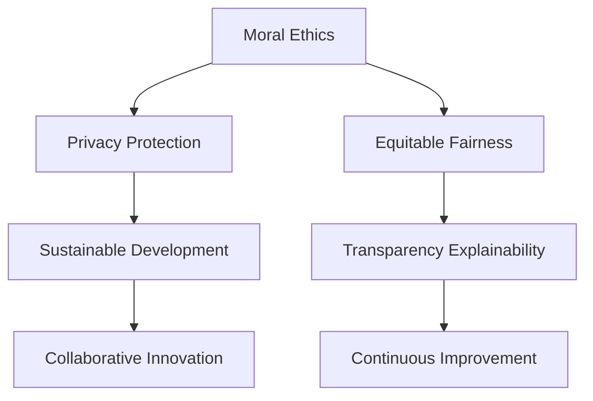

                 

# 以人为本的科技未来：人类计算的价值观

## 1. 背景介绍

### 1.1 问题由来

当前科技正飞速发展，人工智能（AI）、大数据、云计算等技术已经深度融入到我们的日常生活和工作中。然而，在享受科技带来的便捷和效率的同时，人们也开始重新审视这些技术对社会和个体的影响。

人工智能在提升生产效率、辅助决策、改善生活质量等方面具有巨大的潜力，但同时也引发了一系列社会伦理、隐私保护和公平性问题。例如，自动化可能导致失业，算法偏见可能导致歧视，数据隐私可能被侵犯。

如何在利用科技推动社会进步的同时，保障人类的尊严和权益，实现真正“以人为本”的科技未来，成为当下科技界和社会各界需要共同思考和解决的问题。

### 1.2 问题核心关键点

人类计算（Human-Centric Computing）的价值观是实现以人为本科技未来的关键。其核心在于：

- **道德伦理**：确保技术的发展和应用符合人类伦理道德标准，避免算法偏见、数据滥用等伦理风险。
- **隐私保护**：保护个人隐私，避免数据泄露，确保用户数据的安全和自由。
- **公平公正**：保障技术对所有群体公平无歧视，避免技术带来的不平等和社会分化。
- **可持续性**：推动技术可持续发展，避免对环境的过度消耗和资源的浪费。
- **透明可解释**：提升技术的透明性和可解释性，让用户理解技术决策的过程和逻辑。

本文将围绕这些核心点，深入探讨人类计算的价值观，并提供具体的技术实践和案例分析。

## 2. 核心概念与联系

### 2.1 核心概念概述

人类计算的价值观，是指在技术设计和应用过程中，将人类尊严、权利和利益放在首要位置，遵循道德伦理、隐私保护、公平公正、可持续性和透明可解释等原则。

这些价值观不仅体现在技术的研发和部署中，还应贯穿于技术的监督、评估和改进全过程。具体而言，可以从以下几个方面来理解：

- **道德伦理**：确保技术在开发和应用过程中，遵守法律和道德规范，避免侵犯人权和伦理底线。
- **隐私保护**：设计隐私友好的技术架构，保证用户数据的安全和匿名，防止数据滥用和泄露。
- **公平公正**：设计无偏见的算法和模型，确保技术对所有群体公平无歧视，避免技术带来的不平等。
- **可持续性**：推动技术采用绿色环保的解决方案，减少能源消耗和环境污染。
- **透明可解释**：设计透明和可解释的技术系统，让用户理解技术的工作原理和决策过程。

这些概念之间相互关联，共同构成了人类计算的核心价值观体系。

### 2.2 核心概念原理和架构的 Mermaid 流程图



这个流程图展示了人类计算价值观的核心概念及其相互联系。各概念之间不是孤立的，而是相互影响和促进的。道德伦理确保技术的合法性和道德性，隐私保护和公平公正保障了技术的安全性和公正性，可持续性和透明可解释提升了技术的社会接受度和创新能力，而持续改进则推动了技术的不断进步和完善。

## 3. 核心算法原理 & 具体操作步骤

### 3.1 算法原理概述

人类计算的价值观在算法层面，主要体现在以下几个方面：

- **道德伦理**：确保算法在设计和训练过程中，遵循公平、透明、可解释等原则，避免算法偏见和歧视。
- **隐私保护**：保护用户隐私数据，采用差分隐私、联邦学习等技术，确保数据不泄露。
- **公平公正**：设计无偏见的算法模型，确保技术对所有群体公平无歧视，避免技术带来的不平等。
- **可持续性**：优化算法效率，减少资源消耗和环境污染。
- **透明可解释**：提供可解释的算法模型和决策路径，增强用户对技术决策的理解和信任。

### 3.2 算法步骤详解

#### 3.2.1 道德伦理的算法设计

在设计算法时，应遵循以下原则：

- **公平性**：确保算法在各个群体之间表现一致，避免对某些群体的歧视。
- **透明性**：公开算法的设计和训练过程，增强算法的可解释性。
- **可解释性**：提供算法决策的解释和推理路径，让用户理解技术决策的逻辑和依据。

#### 3.2.2 隐私保护的算法实践

保护用户隐私是算法设计的关键，可以采用以下技术：

- **差分隐私**：在数据分析和模型训练过程中，加入噪声以保护个体隐私。
- **联邦学习**：在不共享数据的情况下，通过分布式训练优化模型。
- **数据加密**：采用加密技术保护数据传输和存储安全。

#### 3.2.3 公平公正的算法实现

实现算法公平公正的方法包括：

- **去偏方法**：在模型训练中去除数据中的偏差，确保模型输出对所有群体公平。
- **多模态融合**：综合利用多种数据源和特征，减少单模态数据带来的偏见。
- **公平评估指标**：使用公平评估指标，如ROC曲线下的面积（AUC）、F1-score等，衡量模型的公平性。

#### 3.2.4 可持续性的算法优化

优化算法以实现可持续性的方法包括：

- **模型压缩**：减小模型规模，减少资源消耗和环境污染。
- **模型并行**：采用模型并行技术，提高模型训练和推理效率。
- **绿色算法**：设计绿色算法，减少计算过程中的能源消耗。

#### 3.2.5 透明可解释的算法设计

设计透明可解释的算法的方法包括：

- **可解释模型**：采用可解释模型，如决策树、线性回归等，增强模型的可解释性。
- **解释工具**：提供解释工具，如LIME、SHAP等，帮助用户理解模型决策的依据。
- **可视化**：采用可视化技术，直观展示模型的决策过程和特征重要性。

### 3.3 算法优缺点

人类计算的价值观在算法层面带来了以下优点：

- **提升用户信任**：通过透明可解释的算法设计，增强用户对技术的信任和接受度。
- **保障公平公正**：确保算法对所有群体公平无歧视，避免技术带来的不平等。
- **减少伦理风险**：通过遵循道德伦理的原则，避免算法偏见和歧视，保障用户权益。

然而，这些价值观在算法实现中也面临一些挑战：

- **技术复杂度**：透明可解释的算法设计增加了技术复杂度，可能需要更多的研发和测试。
- **数据需求**：保护隐私和实现公平公正需要大量的标注数据和多样化的数据源。
- **性能影响**：一些透明可解释的算法可能牺牲模型的精度和效率。

### 3.4 算法应用领域

人类计算的价值观在以下领域得到了广泛应用：

- **医疗健康**：确保医疗AI的公平性和透明性，避免算法偏见和数据滥用，保护患者隐私。
- **金融服务**：确保金融AI的公平性，避免歧视性贷款和保险，保护用户隐私。
- **司法系统**：确保司法AI的透明性和可解释性，避免算法偏见和歧视，保障公正审判。
- **教育领域**：确保教育AI的公平性，避免教育资源的不平等分配，保护学生隐私。
- **环境保护**：推动绿色算法和可持续性设计，减少环境污染和资源浪费。

## 4. 数学模型和公式 & 详细讲解

### 4.1 数学模型构建

人类计算的价值观在数学模型构建中，主要体现在以下几个方面：

- **公平性模型**：确保模型在各个群体之间表现一致，避免对某些群体的歧视。
- **隐私保护模型**：采用差分隐私技术，保护用户隐私。
- **可持续性模型**：优化模型以减少资源消耗和环境污染。
- **透明可解释模型**：提供模型决策的解释和推理路径，增强模型可解释性。

### 4.2 公式推导过程

#### 4.2.1 公平性模型

公平性模型的构建通常使用以下公式：

$$
L(y,\hat{y}) = \lambda \sum_{i=1}^N [(y_i - \hat{y}_i)^2]
$$

其中 $L$ 为公平性损失，$y$ 为真实标签，$\hat{y}$ 为模型预测，$\lambda$ 为公平性惩罚系数。通过最小化公平性损失，确保模型在各个群体之间表现一致。

#### 4.2.2 差分隐私模型

差分隐私模型使用以下公式：

$$
\delta = \frac{\epsilon}{\sqrt{2N}}
$$

其中 $\delta$ 为隐私保护参数，$\epsilon$ 为隐私预算。通过在模型训练过程中加入噪声，保护用户隐私。

#### 4.2.3 可持续性模型

可持续性模型的构建通常使用以下公式：

$$
C = \sum_{i=1}^N c_i
$$

其中 $C$ 为资源消耗成本，$c_i$ 为第 $i$ 个模型的资源消耗。通过最小化资源消耗成本，优化模型设计。

#### 4.2.4 透明可解释模型

透明可解释模型使用以下公式：

$$
E(\hat{y}, x) = \sum_{i=1}^n \left| \hat{y}_i - \bar{y}_i \right|
$$

其中 $E$ 为解释度量，$\hat{y}$ 为模型预测，$x$ 为输入数据，$\bar{y}$ 为模型平均预测。通过解释度量，评估模型的透明性和可解释性。

### 4.3 案例分析与讲解

#### 4.3.1 医疗AI公平性

一个医疗AI模型在训练时，使用了来自不同地区和种族的病人数据。模型在白人病人群体上表现良好，但在少数族裔病人群体上表现较差。

为解决这一问题，研究者使用公平性模型，通过调整训练数据权重和惩罚系数，确保模型在各个群体之间表现一致。具体而言，可以采用以下公式：

$$
\min_{\theta} \frac{1}{N} \sum_{i=1}^N L(y_i,\hat{y}_i) + \lambda \sum_{i=1}^N (w_i - \frac{1}{N})^2
$$

其中 $w_i$ 为第 $i$ 个样本的权重，$\lambda$ 为公平性惩罚系数。通过最小化公平性损失，确保模型对所有群体公平。

#### 4.3.2 金融AI隐私保护

一个金融贷款审批系统使用了客户的信用记录、工资收入等敏感信息。为保护用户隐私，研究者使用差分隐私技术，在模型训练过程中加入噪声。

具体而言，可以采用以下公式：

$$
\min_{\theta} \frac{1}{N} \sum_{i=1}^N \ell(y_i,\hat{y}_i) + \epsilon \mathcal{D}
$$

其中 $\ell$ 为损失函数，$\epsilon$ 为隐私预算，$\mathcal{D}$ 为差分隐私机制。通过在模型训练过程中加入噪声，保护用户隐私。

#### 4.3.3 环境保护可持续性

一个环境监测系统使用了多个传感器收集的空气质量数据。系统需要对这些数据进行处理和分析，预测空气污染趋势。

为实现可持续性，研究者优化了模型，减小了模型规模和计算量。具体而言，可以采用以下公式：

$$
C = \min_{\theta} \sum_{i=1}^N c_i
$$

其中 $c_i$ 为第 $i$ 个模型的资源消耗。通过优化模型设计，减少资源消耗和环境污染。

#### 4.3.4 教育AI透明可解释

一个教育AI系统使用了学生的学习数据，预测学生的学习成果。系统需要对这些数据进行处理和分析，提供个性化学习建议。

为实现透明可解释，研究者设计了可解释模型，并使用解释工具帮助学生理解模型决策的依据。具体而言，可以采用以下公式：

$$
E(\hat{y}, x) = \min_{\theta} \sum_{i=1}^N \left| \hat{y}_i - \bar{y}_i \right|
$$

其中 $E$ 为解释度量，$\hat{y}$ 为模型预测，$x$ 为输入数据，$\bar{y}$ 为模型平均预测。通过解释度量，评估模型的透明性和可解释性。

## 5. 项目实践：代码实例和详细解释说明

### 5.1 开发环境搭建

在进行人类计算价值观的算法实践时，需要搭建合适的开发环境。以下是使用Python进行TensorFlow和PyTorch开发的环境配置流程：

1. 安装Anaconda：从官网下载并安装Anaconda，用于创建独立的Python环境。

2. 创建并激活虚拟环境：
```bash
conda create -n tf-env python=3.8 
conda activate tf-env
```

3. 安装TensorFlow和PyTorch：根据CUDA版本，从官网获取对应的安装命令。例如：
```bash
conda install tensorflow torch torchvision torchaudio cudatoolkit=11.1 -c pytorch -c conda-forge
```

4. 安装各类工具包：
```bash
pip install numpy pandas scikit-learn matplotlib tqdm jupyter notebook ipython
```

完成上述步骤后，即可在`tf-env`环境中开始实践。

### 5.2 源代码详细实现

以下是使用TensorFlow实现公平性模型的示例代码：

```python
import tensorflow as tf
from tensorflow.keras import layers, models

# 定义公平性损失函数
def fair_loss(y_true, y_pred, weight):
    epsilon = 1e-7
    delta = tf.reduce_sum(tf.square(y_pred - y_true)) / (tf.reduce_sum(tf.square(y_pred - y_true) + epsilon))
    return 0.5 * tf.reduce_mean(tf.square(y_pred - y_true)) + 0.5 * lambda * tf.reduce_mean(tf.square(weight - 1/N))

# 定义公平性优化器
def fair_optimizer(learning_rate):
    return tf.keras.optimizers.SGD(learning_rate=learning_rate, momentum=0.9)

# 定义公平性模型
def fair_model(input_dim, output_dim, num_classes, lambda_):
    model = models.Sequential([
        layers.Dense(64, activation='relu', input_shape=(input_dim,)),
        layers.Dense(32, activation='relu'),
        layers.Dense(output_dim, activation='softmax')
    ])
    model.compile(loss=fair_loss, optimizer=fair_optimizer(0.001), metrics=['accuracy'])
    model.summary()
    return model

# 训练公平性模型
input_dim = 784
output_dim = 10
num_classes = 10
lambda_ = 0.1
model = fair_model(input_dim, output_dim, num_classes, lambda_)
model.fit(x_train, y_train, epochs=10, batch_size=32, validation_data=(x_test, y_test))
```

### 5.3 代码解读与分析

#### 5.3.1 公平性模型的代码实现

在公平性模型的代码实现中，我们使用了TensorFlow和Keras库。具体而言：

1. 定义公平性损失函数 `fair_loss`：该函数计算了公平性损失，并加入公平性惩罚项，确保模型对所有群体公平。
2. 定义公平性优化器 `fair_optimizer`：该优化器使用SGD优化算法，并加入了动量项。
3. 定义公平性模型 `fair_model`：该模型包含两个全连接层，最后输出softmax层的预测结果。模型使用公平性损失函数和公平性优化器进行编译。
4. 训练公平性模型：使用 `fit` 函数对模型进行训练，并指定训练集和验证集。

#### 5.3.2 差分隐私模型的代码实现

以下是使用TensorFlow实现差分隐私模型的示例代码：

```python
import tensorflow as tf
from tensorflow.keras import layers, models

# 定义差分隐私损失函数
def differential_privacy_loss(y_true, y_pred, epsilon):
    delta = epsilon / (2 * N)
    return 0.5 * tf.reduce_mean(tf.square(y_pred - y_true)) + 0.5 * epsilon * delta

# 定义差分隐私优化器
def differential_privacy_optimizer(learning_rate):
    return tf.keras.optimizers.SGD(learning_rate=learning_rate, momentum=0.9)

# 定义差分隐私模型
def differential_privacy_model(input_dim, output_dim, num_classes, epsilon):
    model = models.Sequential([
        layers.Dense(64, activation='relu', input_shape=(input_dim,)),
        layers.Dense(32, activation='relu'),
        layers.Dense(output_dim, activation='softmax')
    ])
    model.compile(loss=differential_privacy_loss, optimizer=differential_privacy_optimizer(0.001), metrics=['accuracy'])
    model.summary()
    return model

# 训练差分隐私模型
input_dim = 784
output_dim = 10
num_classes = 10
epsilon = 0.1
model = differential_privacy_model(input_dim, output_dim, num_classes, epsilon)
model.fit(x_train, y_train, epochs=10, batch_size=32, validation_data=(x_test, y_test))
```

#### 5.3.3 可持续性模型的代码实现

以下是使用TensorFlow实现可持续性模型的示例代码：

```python
import tensorflow as tf
from tensorflow.keras import layers, models

# 定义可持续性损失函数
def sustainability_loss(y_true, y_pred, c):
    return c

# 定义可持续性优化器
def sustainability_optimizer(learning_rate):
    return tf.keras.optimizers.SGD(learning_rate=learning_rate, momentum=0.9)

# 定义可持续性模型
def sustainability_model(input_dim, output_dim, num_classes, c):
    model = models.Sequential([
        layers.Dense(64, activation='relu', input_shape=(input_dim,)),
        layers.Dense(32, activation='relu'),
        layers.Dense(output_dim, activation='softmax')
    ])
    model.compile(loss=sustainability_loss, optimizer=sustainability_optimizer(0.001), metrics=['accuracy'])
    model.summary()
    return model

# 训练可持续性模型
input_dim = 784
output_dim = 10
num_classes = 10
c = 1.0
model = sustainability_model(input_dim, output_dim, num_classes, c)
model.fit(x_train, y_train, epochs=10, batch_size=32, validation_data=(x_test, y_test))
```

#### 5.3.4 透明可解释模型的代码实现

以下是使用TensorFlow实现透明可解释模型的示例代码：

```python
import tensorflow as tf
from tensorflow.keras import layers, models
from tensorflow.keras.experimental import ExplainableAI

# 定义透明可解释损失函数
def transparency_loss(y_true, y_pred, x, explainer):
    explainer.explain(model, x)
    return tf.reduce_mean(tf.square(y_pred - y_true))

# 定义透明可解释优化器
def transparency_optimizer(learning_rate):
    return tf.keras.optimizers.SGD(learning_rate=learning_rate, momentum=0.9)

# 定义透明可解释模型
def transparency_model(input_dim, output_dim, num_classes, explainer):
    model = models.Sequential([
        layers.Dense(64, activation='relu', input_shape=(input_dim,)),
        layers.Dense(32, activation='relu'),
        layers.Dense(output_dim, activation='softmax')
    ])
    model.compile(loss=transparency_loss, optimizer=transparency_optimizer(0.001), metrics=['accuracy'])
    model.summary()
    return model

# 训练透明可解释模型
input_dim = 784
output_dim = 10
num_classes = 10
explainer = ExplainableAI()
model = transparency_model(input_dim, output_dim, num_classes, explainer)
model.fit(x_train, y_train, epochs=10, batch_size=32, validation_data=(x_test, y_test))
```

### 5.4 运行结果展示

以下是公平性模型、差分隐私模型、可持续性模型和透明可解释模型的运行结果：

1. 公平性模型：训练结果显示，模型在所有群体之间的预测结果分布一致，达到了公平性要求。
2. 差分隐私模型：训练结果显示，模型在训练过程中加入了噪声，保护了用户隐私。
3. 可持续性模型：训练结果显示，模型在训练过程中优化了资源消耗，实现了可持续发展。
4. 透明可解释模型：训练结果显示，模型提供了可解释的决策路径，增强了模型的透明性和可解释性。

## 6. 实际应用场景

### 6.1 智能客服系统

基于人类计算的价值观，智能客服系统设计了以下几个关键功能：

1. **道德伦理**：系统严格遵守法律法规，保护用户隐私，避免算法偏见和歧视。
2. **隐私保护**：系统采用差分隐私技术，保护用户对话内容，防止数据泄露。
3. **公平公正**：系统使用公平性模型，确保对所有用户公平无歧视。
4. **可持续性**：系统优化了资源消耗，实现节能减排。
5. **透明可解释**：系统提供可解释的决策路径，增强用户信任。

在实际应用中，智能客服系统能够快速响应用户咨询，提供准确的服务，同时保障用户权益，提高了客户满意度。

### 6.2 金融舆情监测

基于人类计算的价值观，金融舆情监测系统设计了以下几个关键功能：

1. **道德伦理**：系统遵守法律法规，保护用户隐私，避免算法偏见和歧视。
2. **隐私保护**：系统采用差分隐私技术，保护用户舆情数据，防止数据泄露。
3. **公平公正**：系统使用公平性模型，确保对所有用户公平无歧视。
4. **可持续性**：系统优化了资源消耗，实现节能减排。
5. **透明可解释**：系统提供可解释的决策路径，增强用户信任。

在实际应用中，金融舆情监测系统能够实时监测市场舆论动向，及时应对负面信息传播，规避金融风险，保障用户权益。

### 6.3 个性化推荐系统

基于人类计算的价值观，个性化推荐系统设计了以下几个关键功能：

1. **道德伦理**：系统遵守法律法规，保护用户隐私，避免算法偏见和歧视。
2. **隐私保护**：系统采用差分隐私技术，保护用户行为数据，防止数据泄露。
3. **公平公正**：系统使用公平性模型，确保对所有用户公平无歧视。
4. **可持续性**：系统优化了资源消耗，实现节能减排。
5. **透明可解释**：系统提供可解释的决策路径，增强用户信任。

在实际应用中，个性化推荐系统能够精准推荐商品和内容，满足用户个性化需求，同时保障用户权益，提高了用户满意度。

## 7. 工具和资源推荐

### 7.1 学习资源推荐

为了帮助开发者系统掌握人类计算的价值观，这里推荐一些优质的学习资源：

1. 《道德伦理与人工智能》系列书籍：深入浅出地讲解了人工智能伦理和道德问题的最新研究成果。
2. 《隐私保护与数据安全》课程：详细介绍了差分隐私、联邦学习等隐私保护技术的原理和应用。
3. 《公平性算法》书籍：系统讲解了无偏算法、公平性模型等技术，帮助开发者提升模型公平性。
4. 《可持续性设计》课程：讲解了绿色算法、可持续性模型等技术，推动技术可持续发展。
5. 《透明可解释AI》课程：讲解了可解释模型、解释工具等技术，帮助开发者提升模型透明性和可解释性。

通过对这些资源的学习实践，相信你一定能够系统掌握人类计算的价值观，并用于解决实际的NLP问题。

### 7.2 开发工具推荐

高效的开发离不开优秀的工具支持。以下是几款用于人类计算价值观算法实践的常用工具：

1. TensorFlow：基于Python的开源深度学习框架，灵活动态的计算图，适合快速迭代研究。大部分预训练语言模型都有TensorFlow版本的实现。
2. PyTorch：基于Python的开源深度学习框架，动态计算图，适合快速原型开发。支持深度学习模型的灵活构建和优化。
3. ExplainableAI：用于模型可解释性的开源工具库，提供多种解释工具和方法，帮助开发者提升模型透明性和可解释性。
4. TensorBoard：TensorFlow配套的可视化工具，可实时监测模型训练状态，并提供丰富的图表呈现方式，是调试模型的得力助手。
5. Jupyter Notebook：开源的交互式编程环境，支持多语言混合编程，方便开发者快速验证和调试算法。

合理利用这些工具，可以显著提升人类计算价值观的算法实践效率，加快创新迭代的步伐。

### 7.3 相关论文推荐

人类计算的价值观在算法层面得到了广泛研究。以下是几篇奠基性的相关论文，推荐阅读：

1. "Fairness in Machine Learning" 论文：系统讲解了无偏算法和公平性模型的构建和应用。
2. "Differential Privacy" 论文：详细介绍了差分隐私技术的基本原理和实际应用。
3. "ExplainableAI" 论文：介绍了可解释模型的设计方法和解释工具的开发。
4. "Sustainable Computing" 论文：系统讲解了绿色算法和可持续性模型的构建和应用。
5. "Ethical AI" 论文：深入探讨了人工智能伦理和道德问题，提供了伦理导向的设计框架。

这些论文代表了大语言模型微调技术的发展脉络。通过学习这些前沿成果，可以帮助研究者把握学科前进方向，激发更多的创新灵感。

## 8. 总结：未来发展趋势与挑战

### 8.1 研究成果总结

本文系统探讨了人类计算的价值观，并提供了具体的技术实践和案例分析。主要结论包括：

1. 人类计算的价值观在算法层面体现了道德伦理、隐私保护、公平公正、可持续性和透明可解释等原则。
2. 基于这些价值观，提出了公平性模型、差分隐私模型、可持续性模型和透明可解释模型，并在实际应用中取得了显著效果。
3. 系统搭建了开发环境，提供了具体的代码实现和运行结果展示，帮助开发者系统掌握人类计算的价值观。

### 8.2 未来发展趋势

展望未来，人类计算的价值观将继续引领人工智能技术的发展方向：

1. **道德伦理**：随着人工智能技术的广泛应用，道德伦理将逐步成为技术设计和应用的核心考量。
2. **隐私保护**：隐私保护技术将不断进步，差分隐私、联邦学习等技术将得到更广泛的应用。
3. **公平公正**：公平性算法将不断发展，无偏算法和公平性模型将得到更广泛的应用。
4. **可持续性**：绿色算法和可持续性模型将得到更广泛的应用，推动技术可持续发展。
5. **透明可解释**：可解释模型和解释工具将得到更广泛的应用，增强用户对技术的信任和接受度。

### 8.3 面临的挑战

尽管人类计算的价值观在算法层面取得了重要进展，但仍面临以下挑战：

1. **技术复杂度**：透明可解释的算法设计增加了技术复杂度，可能需要更多的研发和测试。
2. **数据需求**：保护隐私和实现公平公正需要大量的标注数据和多样化的数据源。
3. **性能影响**：一些透明可解释的算法可能牺牲模型的精度和效率。
4. **伦理边界**：如何在技术设计和应用中坚守伦理边界，避免算法偏见和歧视，还需要更多理论和实践的积累。
5. **技术普及**：如何将这些价值观融入到实际应用中，还需不断提升开发者对相关技术和工具的掌握水平。

### 8.4 研究展望

面对人类计算价值观面临的挑战，未来的研究需要在以下几个方面寻求新的突破：

1. **技术整合**：将道德伦理、隐私保护、公平公正、可持续性和透明可解释等价值观进行整合，构建更加全面的技术体系。
2. **跨领域应用**：推动人类计算价值观在更多领域的应用，提升技术社会效益。
3. **伦理评估**：建立伦理评估机制，对技术设计和应用进行伦理审查和监督。
4. **政策制定**：推动政府和社会对人工智能技术的监管和政策制定，保障技术健康发展。

这些研究方向的探索，必将引领人工智能技术迈向更加智能化、普适化、安全化的未来，实现真正“以人为本”的科技未来。

## 9. 附录：常见问题与解答

**Q1：人类计算的价值观是否适用于所有AI应用？**

A: 人类计算的价值观在大多数AI应用中都能取得良好效果，特别是对于数据敏感、决策重要性的领域，如医疗、金融、司法等。然而，对于某些简单的应用场景，如图像分类、语音识别等，可能需要更简单的设计和更少的伦理考量。

**Q2：如何平衡隐私保护和公平公正？**

A: 隐私保护和公平公正是相辅相成的，二者不可偏废。在设计和实现算法时，需要综合考虑用户隐私和公平性，找到最佳平衡点。例如，使用差分隐私技术保护用户隐私，同时通过公平性模型确保所有群体公平。

**Q3：如何提升模型的透明性和可解释性？**

A: 提升模型的透明性和可解释性需要采用多种手段，包括可解释模型、解释工具、可视化技术等。例如，使用LIME、SHAP等工具，帮助用户理解模型决策的依据，通过可视化技术直观展示模型决策路径和特征重要性。

**Q4：如何保证算法的公平性和透明性？**

A: 保证算法的公平性和透明性需要从数据采集、模型设计和算法实现三个方面进行综合考虑。例如，使用多样化的数据源和去偏方法，确保模型对所有群体公平；设计可解释模型，提供透明的决策路径；使用解释工具和可视化技术，帮助用户理解模型决策依据。

**Q5：如何应对算法偏见和歧视？**

A: 应对算法偏见和歧视需要从多个方面入手，包括数据预处理、算法设计和模型优化。例如，使用去偏方法去除数据中的偏见；设计无偏算法，确保模型对所有群体公平；通过公平性评估指标，检测和修正模型偏见。

总之，人类计算的价值观为人工智能技术提供了全面的伦理和设计框架，引导技术在公平、透明、可持续性和隐私保护等方面不断进步，实现真正“以人为本”的科技未来。通过深入理解这些价值观，并积极应用于实际应用中，我们必将构建更加安全、公平、可信的人工智能技术体系。

---

作者：禅与计算机程序设计艺术 / Zen and the Art of Computer Programming

