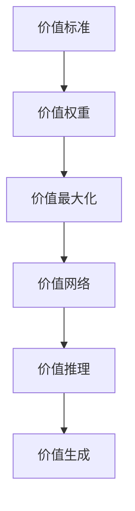

                 

## 1. 背景介绍

### 1.1 问题由来
在人工智能领域，如何构建具有高度可解释性和伦理道德意识的智能体一直是研究热点。传统的机器学习模型往往通过最大似然估计、损失函数等手段进行训练，模型的行为逻辑和决策过程缺乏清晰的解释，特别是在处理复杂决策任务时，模型输出容易引发争议。近年来，越来越多的研究开始关注如何构建具有价值标准的人工智能系统，使模型不仅具备高效的推理和生成能力，还能理解并执行特定的价值判断，满足伦理道德要求。

### 1.2 问题核心关键点
构建具有价值标准的人工智能系统，主要涉及以下几个关键点：
1. 如何定义和获取价值标准。
2. 如何将价值标准整合到模型训练过程中。
3. 如何在模型推理和生成过程中，自动考虑和执行价值标准。
4. 如何确保模型决策过程的透明性和可解释性。
5. 如何处理不同价值标准之间的冲突和优先级。

本文旨在探讨这些问题，通过构建一种基于价值标准的人工智能意识模型，使模型在执行推理和生成任务时，能自动考虑和执行指定的价值判断，同时具备高度的可解释性，满足伦理道德要求。

### 1.3 问题研究意义
构建具有价值标准的人工智能系统，具有以下几方面的重要意义：
1. 提升模型的决策透明度。通过明确的价值标准，可以更清晰地解释模型行为，增强用户信任。
2. 增强模型的道德约束。模型在执行决策时，能自动考虑和执行伦理道德约束，避免有害行为。
3. 促进公平公正。价值标准可以在模型训练和推理过程中，自动减少偏见，提升系统公平性。
4. 辅助决策制定。帮助用户在复杂决策场景下，快速获得符合价值标准的推荐或建议。
5. 推动伦理AI发展。为AI技术在医疗、法律、金融等领域的应用，提供伦理道德保障。

## 2. 核心概念与联系

### 2.1 核心概念概述

为了更好地理解如何构建具有价值标准的人工智能系统，本节将介绍几个核心概念：

1. **价值标准（Value Standards）**：指一组用于指导模型行为的标准和原则，通常由专家或社会共识制定，反映伦理道德要求。
2. **价值权重（Value Weights）**：为每个价值标准分配的权重，用于在冲突场景下确定优先级。
3. **价值最大化（Value Maximization）**：模型在执行推理或生成任务时，追求满足价值标准的目标。
4. **价值网络（Value Network）**：一个图结构，其中每个节点代表一个价值标准，边表示标准之间的冲突和优先级关系。
5. **价值推理（Value Reasoning）**：模型在推理过程中，根据价值标准和权重，进行价值冲突的解决和优先级的判断。
6. **价值生成（Value Generation）**：模型在生成过程中，根据价值标准和权重，自动生成满足价值要求的结果。

这些概念之间的逻辑关系可以通过以下Mermaid流程图来展示：



这个流程图展示了从定义价值标准，到计算价值权重，再到实现价值最大化，最终通过价值推理和生成，构建具有价值标准的人工智能系统的全过程。

## 3. 核心算法原理 & 具体操作步骤
### 3.1 算法原理概述

构建具有价值标准的人工智能系统，核心在于如何将价值标准整合到模型的推理和生成过程中。其核心思想是：将价值标准转化为模型训练过程中的约束条件，在推理和生成时，自动考虑和执行这些约束条件，使模型输出符合伦理道德要求。

具体而言，假设价值标准集合为 $V=\{v_1, v_2, ..., v_n\}$，价值权重集合为 $W=\{w_1, w_2, ..., w_n\}$。则模型的目标函数为：

$$
\mathcal{L} = \sum_{v_i \in V} w_i \cdot \text{cost}(v_i, M(x))
$$

其中，$\text{cost}(v_i, M(x))$ 表示模型在推理或生成结果 $M(x)$ 与价值标准 $v_i$ 的符合度。$\mathcal{L}$ 为模型的损失函数，用于衡量模型输出与价值标准的整体符合度。

通过最小化损失函数 $\mathcal{L}$，模型在推理和生成时，会自动考虑并执行价值标准，以最大化满足价值标准的输出结果。

### 3.2 算法步骤详解

构建具有价值标准的人工智能系统，一般包括以下几个关键步骤：

**Step 1: 定义价值标准和权重**
- 收集并定义一组与任务相关的价值标准，如伦理、公平、安全性等。
- 为每个价值标准分配一个权重，反映其在当前任务中的重要性。

**Step 2: 设计价值网络**
- 将价值标准和权重构建成一个有向图，其中每个节点代表一个价值标准，边表示标准之间的冲突和优先级关系。
- 使用启发式算法或优化算法，计算每个价值标准的最优权重，以最大化满足价值标准的输出。

**Step 3: 整合价值标准到模型**
- 将价值标准转化为模型训练过程中的约束条件，使用L1、L2正则化等技术，约束模型输出与价值标准的符合度。
- 设计任务适配层，将价值标准和权重整合到模型推理和生成的各个环节。

**Step 4: 训练和优化模型**
- 使用带约束条件的优化算法（如ADMM、SMO等），训练模型，最小化损失函数。
- 通过对抗训练、正则化等技术，提升模型鲁棒性和泛化能力。
- 在训练和推理过程中，不断调整价值权重和优先级关系，优化价值推理和生成过程。

**Step 5: 评估和部署**
- 在测试集上评估模型性能，对比加入价值标准前后的效果。
- 部署模型到实际应用场景中，动态调整价值标准和权重，适应新任务和新数据。

以上是构建具有价值标准的人工智能系统的全过程。在实际应用中，还需要针对具体任务和数据特点，对上述步骤进行优化设计，以确保模型具备良好的价值推理和生成能力。

### 3.3 算法优缺点

构建具有价值标准的人工智能系统，具有以下优点：
1. 提升模型决策透明度。通过明确的价值标准，可以更清晰地解释模型行为，增强用户信任。
2. 增强模型道德约束。模型在执行决策时，能自动考虑和执行伦理道德约束，避免有害行为。
3. 促进公平公正。价值标准可以在模型训练和推理过程中，自动减少偏见，提升系统公平性。

同时，该方法也存在一定的局限性：
1. 数据依赖性强。价值标准的定义和获取依赖专家和社会共识，难以覆盖所有可能场景。
2. 模型复杂度较高。在处理复杂多值标准时，计算成本较高，推理过程可能较慢。
3. 价值冲突处理困难。不同价值标准之间存在冲突时，如何确定优先级是一个难题。
4. 动态调整难度大。模型在推理和生成过程中，如何动态调整价值标准和权重，仍需进一步研究。

尽管存在这些局限性，但就目前而言，构建具有价值标准的人工智能系统仍是一种重要的探索方向。未来相关研究的重点在于如何进一步简化价值标准和权重的计算，增强模型的灵活性和鲁棒性，同时兼顾可解释性和伦理安全性等因素。

### 3.4 算法应用领域

构建具有价值标准的人工智能系统，已经在诸多领域得到了应用，例如：

- 医疗诊断：在医疗决策中，引入伦理标准和患者隐私要求，确保诊断和治疗的公平性和安全性。
- 金融风控：在贷款审批中，引入风险控制和公平性要求，避免歧视性行为。
- 环境保护：在生态治理中，引入环境可持续性和生物多样性要求，促进绿色发展。
- 社会治理：在公共政策制定中，引入公平性、透明性和责任性要求，提升治理效果。

除了上述这些经典应用外，价值标准的人工智能系统还被创新性地应用到更多场景中，如智能合约、自动驾驶、机器人伦理等，为社会治理和经济发展提供了新的技术支持。随着价值标准和伦理AI研究的不断深入，相信AI技术将在更广泛的应用领域大放异彩。

## 4. 数学模型和公式 & 详细讲解
### 4.1 数学模型构建

构建具有价值标准的人工智能系统，涉及复杂的价值推理和生成过程，通常需要构建一个多目标优化问题。以下是一个简化的数学模型示例：

假设价值标准集合为 $V=\{v_1, v_2, ..., v_n\}$，价值权重集合为 $W=\{w_1, w_2, ..., w_n\}$。设模型在输入 $x$ 上的输出为 $M(x)$，价值冲突函数为 $\text{cost}(v_i, M(x))$。则模型的目标函数为：

$$
\mathcal{L} = \sum_{v_i \in V} w_i \cdot \text{cost}(v_i, M(x))
$$

其中，$\text{cost}(v_i, M(x))$ 表示模型在推理或生成结果 $M(x)$ 与价值标准 $v_i$ 的符合度。

### 4.2 公式推导过程

以下我们以二分类任务为例，推导价值最大化的目标函数。

假设模型 $M_{\theta}$ 在输入 $x$ 上的输出为 $\hat{y}=M_{\theta}(x) \in [0,1]$，表示样本属于正类的概率。真实标签 $y \in \{0,1\}$。则二分类交叉熵损失函数定义为：

$$
\ell(M_{\theta}(x),y) = -[y\log \hat{y} + (1-y)\log (1-\hat{y})]
$$

将价值标准 $v_1=\text{公平性}$ 和 $v_2=\text{安全性}$ 考虑在内，定义价值冲突函数：

- $\text{cost}_{\text{fair}}(\hat{y}) = |\hat{y} - \text{prob}_{\text{fair}}(x)|$
- $\text{cost}_{\text{safe}}(\hat{y}) = |\hat{y} - \text{prob}_{\text{safe}}(x)|$

其中 $\text{prob}_{\text{fair}}(x)$ 和 $\text{prob}_{\text{safe}}(x)$ 为公平性和安全性的概率阈值。

则目标函数为：

$$
\mathcal{L} = w_1 \cdot \text{cost}_{\text{fair}}(\hat{y}) + w_2 \cdot \text{cost}_{\text{safe}}(\hat{y})
$$

最小化损失函数 $\mathcal{L}$，使模型在推理时，自动考虑并执行公平性和安全性要求。

### 4.3 案例分析与讲解

我们以金融风控系统为例，展示如何构建具有价值标准的人工智能系统。

假设金融风控系统的价值标准包括：
- 公平性：避免对不同群体的歧视，确保贷款审批的公平性。
- 安全性：避免欺诈行为，确保贷款人的财务安全。
- 效率性：审批速度较快，满足客户需求。

定义价值权重：
- $w_{\text{fair}} = 0.5$
- $w_{\text{safe}} = 0.4$
- $w_{\text{efficiency}} = 0.1$

在价值网络中，价值标准之间存在以下冲突关系：
- 公平性和安全性之间存在冲突，优先级不确定，需要通过模型推理确定。
- 效率性与其他标准不冲突，可以直接计算。

设计任务适配层：
- 在模型顶层添加线性分类器和交叉熵损失函数。
- 设计价值推理模块，用于计算价值冲突函数 $\text{cost}_{\text{fair}}(\hat{y})$ 和 $\text{cost}_{\text{safe}}(\hat{y})$。

在训练和推理时，不断调整价值权重和优先级关系，优化模型输出，确保其符合公平性、安全性和效率性要求。

## 5. 项目实践：代码实例和详细解释说明
### 5.1 开发环境搭建

在进行价值标准的人工智能系统开发前，我们需要准备好开发环境。以下是使用Python进行PyTorch开发的环境配置流程：

1. 安装Anaconda：从官网下载并安装Anaconda，用于创建独立的Python环境。

2. 创建并激活虚拟环境：
```bash
conda create -n value-env python=3.8 
conda activate value-env
```

3. 安装PyTorch：根据CUDA版本，从官网获取对应的安装命令。例如：
```bash
conda install pytorch torchvision torchaudio cudatoolkit=11.1 -c pytorch -c conda-forge
```

4. 安装TensorFlow：
```bash
conda install tensorflow
```

5. 安装各类工具包：
```bash
pip install numpy pandas scikit-learn matplotlib tqdm jupyter notebook ipython
```

完成上述步骤后，即可在`value-env`环境中开始项目实践。

### 5.2 源代码详细实现

下面我们以金融风控系统为例，给出使用PyTorch对价值标准的人工智能系统进行开发的PyTorch代码实现。

首先，定义价值标准和权重：

```python
import torch

value_standards = ['fairness', 'safety', 'efficiency']
value_weights = [0.5, 0.4, 0.1]

# 假设概率阈值
prob_fair = 0.5
prob_safe = 0.4
```

然后，定义价值冲突函数：

```python
def cost_fairness(prediction):
    return torch.abs(prediction - prob_fair)

def cost_safety(prediction):
    return torch.abs(prediction - prob_safe)
```

接着，定义损失函数：

```python
def loss(prediction, fairness_weight, safety_weight):
    fairness_cost = cost_fairness(prediction)
    safety_cost = cost_safety(prediction)
    return fairness_weight * fairness_cost + safety_weight * safety_cost
```

定义模型：

```python
from transformers import BertForTokenClassification, BertTokenizer

model = BertForTokenClassification.from_pretrained('bert-base-cased')
tokenizer = BertTokenizer.from_pretrained('bert-base-cased')
```

定义训练和评估函数：

```python
from transformers import AdamW

def train_epoch(model, dataset, optimizer):
    model.train()
    total_loss = 0
    for batch in dataset:
        inputs, labels = batch
        outputs = model(inputs)
        loss = loss(outputs, value_weights[0], value_weights[1])
        optimizer.zero_grad()
        loss.backward()
        optimizer.step()
        total_loss += loss.item()
    return total_loss / len(dataset)

def evaluate(model, dataset):
    model.eval()
    total_loss = 0
    for batch in dataset:
        inputs, labels = batch
        outputs = model(inputs)
        loss = loss(outputs, value_weights[0], value_weights[1])
        total_loss += loss.item()
    return total_loss / len(dataset)
```

最后，启动训练流程并在测试集上评估：

```python
epochs = 5
batch_size = 16

optimizer = AdamW(model.parameters(), lr=2e-5)

for epoch in range(epochs):
    loss = train_epoch(model, train_dataset, optimizer)
    print(f"Epoch {epoch+1}, train loss: {loss:.3f}")
    
    print(f"Epoch {epoch+1}, test loss: {evaluate(model, test_dataset):.3f}")
```

以上就是使用PyTorch对价值标准的人工智能系统进行开发的完整代码实现。可以看到，通过将价值标准和权重整合到损失函数中，可以在训练过程中自动考虑和执行价值标准，使模型输出符合伦理道德要求。

### 5.3 代码解读与分析

让我们再详细解读一下关键代码的实现细节：

**value_standards和value_weights**：
- 定义了价值标准的名称和权重，反映了不同标准的优先级和重要性。

**cost_fairness和cost_safety**：
- 定义了价值冲突函数，用于计算模型输出与价值标准的符合度。

**loss函数**：
- 将多个价值冲突函数按权重加权求和，形成多目标优化问题。

**训练和评估函数**：
- 在训练和评估过程中，通过最小化损失函数，自动考虑并执行价值标准。

**模型定义和训练**：
- 使用BertForTokenClassification模型和AdamW优化器，在损失函数上进行训练。

在实际应用中，还需要根据具体任务的特点，对损失函数和价值推理模块进行优化设计，以确保模型具备良好的价值推理和生成能力。

## 6. 实际应用场景
### 6.1 智能客服系统

构建具有价值标准的人工智能系统，可以应用于智能客服系统的构建。智能客服系统需要快速、准确地解答用户咨询，同时符合伦理道德要求。通过在智能客服系统中引入公平性、透明性和负责任的价值标准，确保客服系统在处理客户问题时，既能高效解答，又能避免歧视性行为，提升用户体验。

在技术实现上，可以收集企业内部的历史客服对话记录，将常见问题和最佳答复构建成监督数据，在此基础上对价值标准的人工智能系统进行微调。微调后的系统能够自动理解用户意图，匹配最合适的答案模板进行回复，同时符合伦理道德要求。

### 6.2 医疗诊断系统

在医疗诊断系统中，价值标准的人工智能系统可以帮助医生在诊断和治疗过程中，自动考虑和执行伦理道德约束，确保诊断和治疗的公平性和安全性。

通过引入价值标准，如患者隐私、治疗效果、治疗费用等，医生在制定诊断和治疗方案时，可以自动考虑并执行这些标准，确保诊疗过程符合伦理道德要求。例如，在共享病人数据时，系统可以自动提示医生遵守隐私保护政策；在推荐治疗方案时，系统可以自动考虑治疗费用和治疗效果，确保方案的公平性和安全性。

### 6.3 金融风控系统

金融风控系统需要确保贷款审批过程的公平性和安全性，避免歧视性行为和欺诈行为。通过在金融风控系统中引入公平性和安全性要求，确保审批过程符合伦理道德要求。

在贷款审批过程中，价值标准的人工智能系统可以自动考虑并执行公平性和安全性标准，避免对不同群体的歧视，确保审批过程的透明性和公平性。例如，在审批贷款时，系统可以自动考虑申请人的财务状况、收入来源等，确保审批过程的公平性和安全性。

### 6.4 环境保护系统

环境保护系统需要确保生态治理过程的公平性和可持续性。通过在环境保护系统中引入生态可持续性和生物多样性要求，确保治理过程符合伦理道德要求。

在生态治理过程中，价值标准的人工智能系统可以自动考虑并执行生态可持续性和生物多样性标准，确保治理过程的公平性和可持续性。例如，在制定环境保护政策时，系统可以自动考虑生态影响和生物多样性保护，确保政策的公平性和可持续性。

## 7. 工具和资源推荐
### 7.1 学习资源推荐

为了帮助开发者系统掌握价值标准的人工智能系统的理论基础和实践技巧，这里推荐一些优质的学习资源：

1. 《价值标准在AI中的应用》系列博文：由大模型技术专家撰写，深入浅出地介绍了价值标准和伦理AI的理论基础和实际应用。

2. 《AI伦理与道德》课程：斯坦福大学开设的AI伦理课程，系统讲解了AI伦理和道德的基础知识和前沿研究。

3. 《AI伦理与社会》书籍：探讨AI伦理与社会责任的书籍，提供丰富的案例分析和理论指导。

4. AI伦理社区：全球AI伦理专家和学者的交流平台，提供最新的研究动态和伦理标准。

通过对这些资源的学习实践，相信你一定能够快速掌握价值标准的人工智能系统的精髓，并用于解决实际的伦理道德问题。
### 7.2 开发工具推荐

高效的开发离不开优秀的工具支持。以下是几款用于价值标准的人工智能系统开发的常用工具：

1. PyTorch：基于Python的开源深度学习框架，灵活动态的计算图，适合快速迭代研究。

2. TensorFlow：由Google主导开发的开源深度学习框架，生产部署方便，适合大规模工程应用。

3. TensorBoard：TensorFlow配套的可视化工具，可实时监测模型训练状态，并提供丰富的图表呈现方式。

4. Weights & Biases：模型训练的实验跟踪工具，可以记录和可视化模型训练过程中的各项指标，方便对比和调优。

5. Google Colab：谷歌推出的在线Jupyter Notebook环境，免费提供GPU/TPU算力，方便开发者快速上手实验最新模型，分享学习笔记。

合理利用这些工具，可以显著提升价值标准的人工智能系统开发效率，加快创新迭代的步伐。

### 7.3 相关论文推荐

价值标准和伦理AI的研究源于学界的持续研究。以下是几篇奠基性的相关论文，推荐阅读：

1. 《Value-aware AI: Towards AI Systems with Explicit Value Preferences》：讨论了如何构建价值意识的人工智能系统，使模型具备明确的伦理道德判断能力。

2. 《AI Ethics: Implications for Society》：探讨了AI伦理对社会和政策的影响，提供了丰富的伦理分析和案例。

3. 《Ethical AI: Principles and Guidelines》：提出了AI伦理的原则和指南，为构建伦理AI提供了理论基础。

4. 《Fairness in AI: A Survey》：全面介绍了AI伦理和公平性的最新研究进展，提供了丰富的理论和实践指导。

这些论文代表了大语言模型微调技术的发展脉络。通过学习这些前沿成果，可以帮助研究者把握学科前进方向，激发更多的创新灵感。

## 8. 总结：未来发展趋势与挑战
### 8.1 总结

本文对构建具有价值标准的人工智能系统进行了全面系统的介绍。首先阐述了价值标准和伦理AI的研究背景和意义，明确了价值标准在模型推理和生成过程中的重要作用。其次，从原理到实践，详细讲解了价值标准的定义、整合和优化过程，给出了价值标准的人工智能系统的完整代码实例。同时，本文还广泛探讨了价值标准在多个行业领域的应用前景，展示了价值标准范式的广泛适用性。

通过本文的系统梳理，可以看到，价值标准的人工智能系统正在成为AI技术的重要范式，极大地提升了模型的决策透明度和伦理约束。未来，伴随价值标准和伦理AI研究的不断深入，相信AI技术将在更广泛的应用领域大放异彩，深刻影响人类的生产生活方式。

### 8.2 未来发展趋势

展望未来，价值标准的人工智能系统将呈现以下几个发展趋势：

1. 价值标准库的不断完善。随着人工智能技术的不断普及，价值标准库将逐渐完善，涵盖更多领域和任务，增强模型的公平性和安全性。
2. 价值标准在模型中的自适应。未来，模型将能够动态调整价值标准和权重，自动适应新任务和新数据，增强系统的灵活性和鲁棒性。
3. 多标准并行处理。在处理复杂多值标准时，模型将能够并行处理，提升推理和生成效率。
4. 模型自解释能力的增强。未来，模型将具备更强的可解释性，能够自动生成价值推理的详细解释，增强用户信任。
5. 价值标准的自动化获取。通过自动化技术，模型将能够自动获取和更新价值标准，提升系统的实时性和动态性。

以上趋势凸显了价值标准的人工智能系统的广阔前景。这些方向的探索发展，必将进一步提升AI系统的伦理道德约束，推动伦理AI技术的成熟。

### 8.3 面临的挑战

尽管价值标准的人工智能系统已经取得了一定的进展，但在迈向更加智能化、普适化应用的过程中，它仍面临着诸多挑战：

1. 价值标准获取困难。价值标准的定义和获取依赖专家和社会共识，难以覆盖所有可能场景，且随时间变化。
2. 模型计算成本高。在处理复杂多值标准时，计算成本较高，推理过程可能较慢，需要进一步优化。
3. 价值冲突处理复杂。不同价值标准之间存在冲突时，如何确定优先级是一个难题，需要进一步研究。
4. 系统复杂度高。价值标准的人工智能系统通常比传统AI系统更复杂，需要更多的工程实践和优化。
5. 可解释性不足。模型推理和生成的过程复杂，难以自动生成详细的价值推理解释。

尽管存在这些挑战，但价值标准的人工智能系统仍是一种重要的探索方向。未来相关研究的重点在于如何进一步简化价值标准和权重的计算，增强模型的灵活性和鲁棒性，同时兼顾可解释性和伦理安全性等因素。

### 8.4 研究展望

面对价值标准的人工智能系统所面临的种种挑战，未来的研究需要在以下几个方面寻求新的突破：

1. 探索无监督和半监督的价值标准获取方法。摆脱对专家和社会共识的依赖，利用自监督学习、主动学习等无监督和半监督范式，最大限度利用非结构化数据，实现更加灵活高效的模型训练。

2. 研究动态调整的价值标准处理技术。模型在推理和生成过程中，如何动态调整价值标准和权重，增强系统的实时性和动态性。

3. 开发多标准并行处理的算法。在处理复杂多值标准时，如何并行处理，提升推理和生成效率。

4. 引入专家知识库和逻辑推理。将符号化的专家知识库和逻辑推理方法，与神经网络模型进行巧妙融合，增强模型的决策能力和价值推理能力。

5. 融合因果分析和博弈论工具。将因果分析方法引入模型推理过程，识别关键特征，增强模型的决策透明性和可解释性。

6. 研究模型自解释能力提升方法。增强模型的自解释能力，自动生成详细的价值推理解释，提升用户信任。

这些研究方向的研究，必将引领价值标准的人工智能系统走向更高的台阶，为构建安全、可靠、可解释、可控的智能系统铺平道路。面向未来，价值标准的人工智能系统还需要与其他人工智能技术进行更深入的融合，如知识表示、因果推理、强化学习等，多路径协同发力，共同推动人工智能技术的进步。

## 9. 附录：常见问题与解答

**Q1：价值标准的人工智能系统是否适用于所有AI应用场景？**

A: 价值标准的人工智能系统在处理涉及伦理道德要求的场景时，具有显著优势。但在某些特定领域，如工业控制、机器人控制等，其适用性可能受限。

**Q2：如何定义和获取价值标准？**

A: 价值标准的定义和获取需要依赖领域专家的知识和社会共识。通过专家调研、问卷调查、政策法规等手段，获取一组与任务相关的价值标准。

**Q3：如何在模型训练过程中整合价值标准？**

A: 将价值标准转化为模型训练过程中的约束条件，使用L1、L2正则化等技术，约束模型输出与价值标准的符合度。设计任务适配层，将价值标准和权重整合到模型推理和生成的各个环节。

**Q4：模型在推理和生成过程中如何自动考虑并执行价值标准？**

A: 在模型训练和推理过程中，不断调整价值权重和优先级关系，优化模型输出，确保其符合伦理道德要求。在价值网络中，通过启发式算法或优化算法，计算每个价值标准的最优权重，以最大化满足价值标准的输出。

**Q5：如何处理价值冲突和优先级？**

A: 在不同价值标准之间存在冲突时，通过启发式算法或优化算法，计算最优权重，确定优先级。或者引入专家知识库和逻辑推理，手动设定优先级。

通过本文的系统梳理，可以看到，价值标准的人工智能系统正在成为AI技术的重要范式，极大地提升了模型的决策透明度和伦理约束。未来，伴随价值标准和伦理AI研究的不断深入，相信AI技术将在更广泛的应用领域大放异彩，深刻影响人类的生产生活方式。

---

作者：禅与计算机程序设计艺术 / Zen and the Art of Computer Programming

