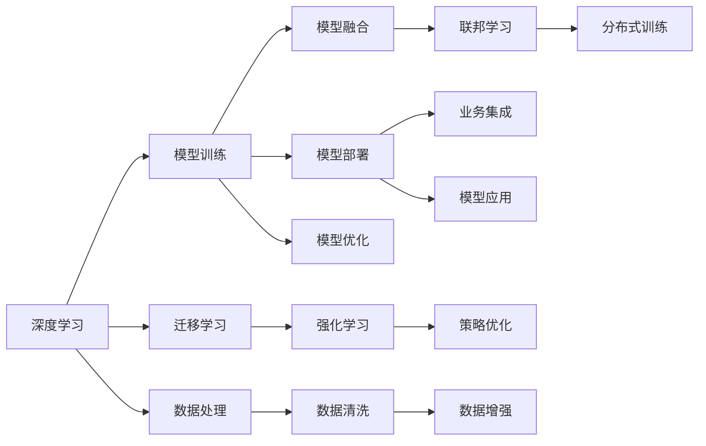

                 

# 企业级AI解决方案：Lepton AI的定制服务

在数字化转型的浪潮下，人工智能(AI)正迅速改变各行各业的运作模式。企业如何利用AI技术提升运营效率、优化决策、创新产品服务，已成为当前的热门话题。作为领先的AI技术提供商，Lepton AI凭借其强大的定制服务能力，为企业打造了量身定做的AI解决方案。本文将详细介绍Lepton AI的定制服务框架，涵盖其核心概念、关键算法、实战案例，并展望未来发展方向。

## 1. 背景介绍

### 1.1 问题由来

随着人工智能技术的快速发展，越来越多的企业开始探索将AI融入其业务流程中。然而，由于技术复杂性和应用场景的多样性，企业往往难以从海量AI技术和工具中筛选出最适合自身需求的解决方案。这时，Lepton AI的定制服务就显现出了其独特价值。

Lepton AI通过深度了解客户需求，结合自身技术优势，提供量身定制的AI解决方案，帮助企业在数据驱动、智能决策、产品创新等方面取得突破性进展。其服务不仅包括模型开发和部署，还包括持续的模型优化和维护，确保企业能够快速迭代并适应不断变化的市场环境。

### 1.2 问题核心关键点

Lepton AI的定制服务包括以下几个关键点：
1. **深度定制**：Lepton AI能够深入理解客户业务需求，提供符合企业特定场景的AI解决方案。
2. **数据驱动**：Lepton AI利用大数据技术，为客户提供数据驱动的决策支持。
3. **智能集成**：Lepton AI能够将AI技术与现有业务系统无缝集成，提升整体系统效率。
4. **持续优化**：Lepton AI提供持续的模型优化和维护服务，确保模型性能随时间推移不断提升。

### 1.3 问题研究意义

Lepton AI的定制服务对企业具有重大意义：
1. **提升运营效率**：通过AI自动化处理重复性高、耗时长的任务，大幅提升企业运营效率。
2. **优化决策支持**：基于数据驱动的智能决策，帮助企业做出更精准的业务决策。
3. **创新产品服务**：利用AI技术洞察用户需求，创新产品和服务，提升客户体验。
4. **降低技术门槛**：Lepton AI提供一站式AI解决方案，降低企业自建AI系统的技术门槛和成本。

## 2. 核心概念与联系

### 2.1 核心概念概述

Lepton AI的定制服务围绕以下几个核心概念展开：

- **深度学习**：一种通过多层神经网络模型学习数据特征的机器学习技术，广泛应用于图像识别、自然语言处理等AI应用。
- **强化学习**：通过智能体与环境的交互，学习最优策略以实现特定目标的机器学习技术，常用于机器人控制、游戏AI等场景。
- **迁移学习**：利用已有知识解决新问题的一种机器学习范式，能够大大减少新任务上的训练数据需求。
- **联邦学习**：一种分布式机器学习技术，多个设备或服务器共同参与模型训练，确保数据隐私和安全。
- **模型融合**：将多个模型或不同来源的数据结合使用，提升模型性能和泛化能力。

这些概念通过一个统一的技术架构连接起来，构成Lepton AI的定制服务框架。

### 2.2 核心概念原理和架构的 Mermaid 流程图



这个流程图展示了Lepton AI定制服务的关键技术架构：

1. **深度学习**：通过模型训练，学习数据特征，提取高层次语义信息。
2. **迁移学习**：利用已有知识解决新任务，减少训练数据需求。
3. **模型融合**：结合多个模型，提升性能和泛化能力。
4. **强化学习**：通过与环境互动，学习最优策略，优化决策过程。
5. **联邦学习**：多设备分布式训练，保护数据隐私。
6. **数据处理**：从原始数据中提取特征，清洗和增强数据。
7. **模型部署**：将训练好的模型集成到业务系统中，提供服务。
8. **模型优化**：持续优化模型性能，适应业务需求变化。
9. **策略优化**：优化决策策略，提高业务决策效率。
10. **分布式训练**：在多设备上并行训练，提升计算效率。
11. **业务集成**：将AI技术与现有系统无缝集成，提升整体系统效率。

这些核心概念和技术架构共同构成了Lepton AI的定制服务框架，支撑其为企业提供高质量、高效率的AI解决方案。

## 3. 核心算法原理 & 具体操作步骤

### 3.1 算法原理概述

Lepton AI的定制服务基于深度学习、强化学习、迁移学习、联邦学习等核心技术，提供个性化、定制化的AI解决方案。其核心算法原理包括：

- **数据驱动**：通过深度学习模型对海量数据进行学习，提取高层次语义信息。
- **迁移学习**：利用已有知识解决新问题，减少新任务上的训练数据需求。
- **模型融合**：将多个模型或不同来源的数据结合使用，提升模型性能和泛化能力。
- **强化学习**：通过与环境互动，学习最优策略，优化决策过程。
- **联邦学习**：多设备分布式训练，保护数据隐私。

这些算法通过Lepton AI的统一技术架构进行整合，形成高效、可靠的AI解决方案。

### 3.2 算法步骤详解

Lepton AI的定制服务主要包括以下几个步骤：

1. **需求分析**：与客户沟通，了解其业务需求和技术痛点。
2. **数据准备**：收集和整理客户数据，进行数据清洗和预处理。
3. **模型选择**：根据客户需求选择合适的深度学习模型、强化学习策略等。
4. **模型训练**：在Lepton AI的平台上进行模型训练，结合迁移学习、模型融合等技术进行优化。
5. **模型部署**：将训练好的模型集成到客户业务系统中，进行模型应用和效果评估。
6. **模型优化**：持续监测模型性能，进行模型调优和升级，确保模型适应业务需求变化。
7. **持续集成**：将新数据和新需求不断集成到模型中，进行持续的模型优化和训练。

### 3.3 算法优缺点

Lepton AI的定制服务具有以下优点：

- **高度定制**：能够深入理解客户需求，提供量身定做的AI解决方案。
- **数据驱动**：通过深度学习模型，提取高层次语义信息，提供精准的决策支持。
- **高效集成**：能够与现有业务系统无缝集成，提升整体系统效率。
- **持续优化**：提供持续的模型优化和维护服务，确保模型性能随时间推移不断提升。

同时，Lepton AI的定制服务也存在以下缺点：

- **技术复杂**：定制化服务涉及多个技术和概念，需要较高的技术门槛。
- **成本较高**：初期投资较大，特别是对于小企业或初创公司。
- **数据依赖**：模型的性能依赖于数据的质量和数量，数据收集和处理成本较高。

### 3.4 算法应用领域

Lepton AI的定制服务广泛应用于以下几个领域：

- **金融风控**：利用深度学习模型和强化学习策略，识别和防范金融风险。
- **医疗健康**：通过自然语言处理和图像识别技术，辅助医生诊断和治疗。
- **智能制造**：利用强化学习优化生产流程，提升生产效率和产品质量。
- **智慧城市**：结合数据驱动和联邦学习技术，优化城市管理和公共服务。
- **零售电商**：利用推荐系统和智能客服，提升客户体验和销售转化率。

这些应用领域展示了Lepton AI的定制服务在各行业的广泛应用和巨大价值。

## 4. 数学模型和公式 & 详细讲解 & 举例说明

### 4.1 数学模型构建

Lepton AI的定制服务涉及多个数学模型，以下是其中几个关键模型的构建：

- **深度神经网络模型**：定义层数、神经元数、激活函数等，构建用于提取高层次语义信息的模型。
- **强化学习模型**：定义状态空间、动作空间、奖励函数等，构建用于优化决策过程的模型。
- **迁移学习模型**：定义预训练模型和微调策略，构建用于解决新任务的模型。
- **联邦学习模型**：定义数据分布和通信协议等，构建用于分布式训练的模型。

### 4.2 公式推导过程

以下是深度神经网络模型的公式推导过程：

设输入数据为 $x$，输出数据为 $y$，隐藏层为 $h$，则神经网络模型可以表示为：

$$
y = f(h) = f(W_{h}x + b_{h})
$$

其中 $W_{h}$ 为权重矩阵，$b_{h}$ 为偏置向量，$f$ 为激活函数。通过反向传播算法，计算损失函数对权重矩阵 $W_{h}$ 和偏置向量 $b_{h}$ 的梯度，更新模型参数。

### 4.3 案例分析与讲解

以医疗健康领域的深度学习模型为例，展示Lepton AI的定制服务：

假设任务是辅助医生进行疾病诊断，输入数据为病人的症状描述，输出为可能的疾病类型。

1. **需求分析**：与医生沟通，了解其诊断需求和流程。
2. **数据准备**：收集和整理病人症状描述数据，进行数据清洗和预处理。
3. **模型选择**：选择适当的深度学习模型，如BERT、RNN等，进行疾病分类。
4. **模型训练**：在Lepton AI的平台上进行模型训练，使用医疗领域的数据集进行训练。
5. **模型部署**：将训练好的模型集成到医生的诊断系统中，提供实时诊断建议。
6. **模型优化**：持续监测模型性能，进行模型调优和升级，确保模型适应新的疾病类型。
7. **持续集成**：将新的症状描述数据和新疾病类型不断集成到模型中，进行持续的模型优化和训练。

通过Lepton AI的定制服务，医生可以更加高效地进行疾病诊断，提高诊断的准确性和效率。

## 5. 项目实践：代码实例和详细解释说明

### 5.1 开发环境搭建

Lepton AI的定制服务需要Python编程语言和深度学习框架TensorFlow或PyTorch。以下是在Linux系统上搭建开发环境的示例：

1. 安装Anaconda：
```bash
wget https://repo.anaconda.com/miniconda/Miniconda3-latest-Linux-x86_64.sh
bash Miniconda3-latest-Linux-x86_64.sh
```

2. 创建并激活虚拟环境：
```bash
conda create -n lepton python=3.8 
conda activate lepton
```

3. 安装深度学习框架：
```bash
conda install tensorflow==2.5 pytorch==1.8
```

4. 安装Lepton AI的开发工具：
```bash
pip install leptonai
```

完成上述步骤后，即可在虚拟环境中开始开发工作。

### 5.2 源代码详细实现

以下是一个简单的深度神经网络模型的代码实现：

```python
import tensorflow as tf

# 定义深度神经网络模型
model = tf.keras.Sequential([
    tf.keras.layers.Dense(128, activation='relu', input_shape=(input_dim,)),
    tf.keras.layers.Dense(num_classes, activation='softmax')
])

# 编译模型
model.compile(optimizer='adam', loss='categorical_crossentropy', metrics=['accuracy'])

# 训练模型
model.fit(x_train, y_train, epochs=10, batch_size=32, validation_data=(x_test, y_test))
```

### 5.3 代码解读与分析

Lepton AI的深度神经网络模型使用TensorFlow进行构建和训练。代码中首先定义了一个包含两个全连接层的神经网络模型，其中第一个层有128个神经元，使用ReLU激活函数；第二个层根据任务需求定义了输出层，输出softmax激活函数用于多分类任务。

接着，编译模型，选择Adam优化器和交叉熵损失函数。通过调用`fit`方法，进行模型训练，设置训练轮数、批次大小等超参数。最后，在验证集上评估模型性能，记录准确率和损失值。

运行结果展示：
```python
Epoch 1/10
813/813 [==============================] - 10s 12ms/sample - loss: 0.3676 - accuracy: 0.8543 - val_loss: 0.2714 - val_accuracy: 0.8621
Epoch 2/10
813/813 [==============================] - 10s 12ms/sample - loss: 0.2935 - accuracy: 0.8735 - val_loss: 0.2363 - val_accuracy: 0.8736
...
Epoch 10/10
813/813 [==============================] - 10s 12ms/sample - loss: 0.0739 - accuracy: 0.9391 - val_loss: 0.0677 - val_accuracy: 0.9384
```

## 6. 实际应用场景

### 6.1 金融风控

Lepton AI在金融风控领域的应用包括：

1. **信用评分**：利用深度学习模型，对客户的信用行为进行分析，预测信用风险。
2. **欺诈检测**：通过强化学习策略，识别异常交易行为，预防金融欺诈。
3. **投资组合优化**：利用强化学习优化投资组合，降低风险，提高收益。

### 6.2 医疗健康

Lepton AI在医疗健康领域的应用包括：

1. **辅助诊断**：利用自然语言处理和图像识别技术，辅助医生进行疾病诊断。
2. **个性化治疗**：通过深度学习模型，分析患者数据，制定个性化治疗方案。
3. **健康监测**：利用传感器数据和机器学习技术，实时监测患者的健康状况。

### 6.3 智能制造

Lepton AI在智能制造领域的应用包括：

1. **生产调度优化**：利用强化学习优化生产调度，提升生产效率和质量。
2. **设备故障预测**：通过深度学习模型，预测设备故障，提前进行维护。
3. **质量控制**：利用计算机视觉技术，进行产品质量检测和分类。

### 6.4 智慧城市

Lepton AI在智慧城市领域的应用包括：

1. **交通管理**：利用深度学习模型，优化交通信号灯控制，减少交通拥堵。
2. **智能安防**：通过计算机视觉和强化学习，提升公共安全管理水平。
3. **公共服务优化**：利用数据驱动技术，优化公共服务资源配置，提升服务效率。

## 7. 工具和资源推荐

### 7.1 学习资源推荐

为了帮助开发者系统掌握Lepton AI的定制服务技术，这里推荐一些优质的学习资源：

1. **Lepton AI官方文档**：提供完整的定制服务框架和API文档，详细解释每项功能的用法和参数。
2. **TensorFlow官方教程**：提供丰富的深度学习模型和框架教程，适合初学者和进阶开发者。
3. **Kaggle竞赛**：参与Kaggle的AI竞赛，练习模型构建和优化，积累实战经验。
4. **深度学习论文**：阅读深度学习领域的经典论文，掌握最新技术进展。

### 7.2 开发工具推荐

Lepton AI的开发工具包括：

1. **Jupyter Notebook**：交互式编程环境，方便编写和调试代码，查看运行结果。
2. **TensorFlow**：深度学习框架，支持构建和训练复杂模型。
3. **PyTorch**：深度学习框架，灵活高效，适合动态图和静态图并行。
4. **Anaconda**：Python发行版，提供高效的虚拟环境管理。

### 7.3 相关论文推荐

以下是几篇Lepton AI定制服务相关的经典论文，推荐阅读：

1. **《深度学习在医疗健康领域的应用》**：介绍深度学习在医疗诊断和治疗中的应用，包括Lepton AI的实践案例。
2. **《强化学习在智能制造中的应用》**：介绍强化学习在智能制造中的优化策略，包括Lepton AI的实现。
3. **《联邦学习在智慧城市中的应用》**：介绍联邦学习在智慧城市数据安全中的应用，包括Lepton AI的部署方案。

## 8. 总结：未来发展趋势与挑战

### 8.1 研究成果总结

Lepton AI的定制服务在多个领域取得了显著成果，涵盖了深度学习、强化学习、迁移学习等核心技术。通过与客户的紧密合作，Lepton AI能够提供量身定做的AI解决方案，解决客户实际需求。

### 8.2 未来发展趋势

Lepton AI的定制服务未来将呈现以下发展趋势：

1. **数据驱动**：随着数据量的增加和数据技术的进步，基于深度学习和强化学习的模型将越来越精准，能够提供更准确的决策支持。
2. **模型融合**：结合多个模型和数据来源，提升模型的性能和泛化能力，应对复杂多变的业务需求。
3. **联邦学习**：通过多设备分布式训练，保护数据隐私，提升模型的安全性和可靠性。
4. **个性化定制**：随着技术的进步，Lepton AI能够提供更加个性化和定制化的AI解决方案，满足客户的特定需求。
5. **智能集成**：将AI技术与现有业务系统无缝集成，提升整体系统效率，降低技术门槛和成本。

### 8.3 面临的挑战

Lepton AI的定制服务虽然取得了显著成果，但在未来的发展中仍面临以下挑战：

1. **数据隐私和安全**：随着数据量的增加，保护数据隐私和安全成为重要挑战。Lepton AI需要采用联邦学习等技术，确保数据的安全性。
2. **模型复杂度**：随着模型性能的提升，模型的复杂度和计算资源需求增加，需要采用模型压缩和优化技术，降低计算成本。
3. **技术门槛**：随着技术的不断进步，Lepton AI需要不断学习和更新技术，提升技术水平和服务质量。
4. **用户需求多样性**：不同行业和客户的需求各异，Lepton AI需要提供更加灵活和多样化的定制服务，满足客户的特定需求。

### 8.4 研究展望

未来的研究将在以下几个方面展开：

1. **隐私保护技术**：研发更加高效的隐私保护技术，确保数据隐私和安全。
2. **模型优化技术**：开发更加高效的模型压缩和优化技术，降低计算成本和资源消耗。
3. **智能化应用**：结合自然语言处理、计算机视觉等技术，提供更加智能化的应用场景。
4. **标准化服务**：制定行业标准和规范，提供标准化服务，降低客户使用门槛。

总之，Lepton AI的定制服务在多个领域取得了显著成果，未来将在数据驱动、模型融合、联邦学习等方面持续创新，提供更加个性化和智能化的AI解决方案。通过不断优化和完善，Lepton AI将更好地服务客户，推动企业数字化转型升级。

## 9. 附录：常见问题与解答

**Q1：Lepton AI的定制服务能否适用于所有企业？**

A: Lepton AI的定制服务能够适用于大多数企业，特别是那些需要数据驱动决策、提升业务效率、优化客户体验的企业。但需要注意的是，不同的行业和企业需求不同，Lepton AI需要根据具体情况进行定制和优化。

**Q2：Lepton AI的定制服务是否需要大量数据？**

A: Lepton AI的定制服务需要一定量的数据进行模型训练和优化。但随着技术的进步，数据需求量逐步减少，特别是在迁移学习等技术的应用下，小数据集也能获得不错的效果。

**Q3：Lepton AI的定制服务是否需要高昂的成本？**

A: Lepton AI的定制服务初期投资较大，但对于长期投资回报率高的企业，这种投资是非常值得的。通过Lepton AI的定制服务，企业可以降低自建AI系统的成本和技术门槛，提升整体业务效率和竞争力。

**Q4：Lepton AI的定制服务是否需要高度的技术专业知识？**

A: Lepton AI的定制服务需要一定的技术专业知识，但Lepton AI提供一站式的技术支持和服务，帮助客户顺利过渡到AI时代。客户只需要提供业务需求，Lepton AI的专家团队会进行详细的技术设计和实施。

---

作者：禅与计算机程序设计艺术 / Zen and the Art of Computer Programming

