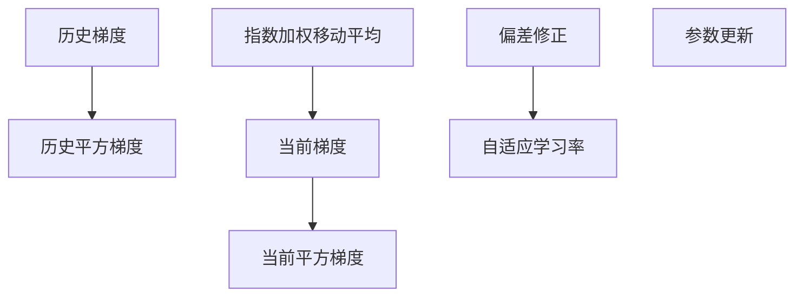

                 

# 优化算法：Adam 原理与代码实例讲解

> 关键词：优化算法, Adam, 机器学习, 梯度下降, 深度学习, PyTorch, 代码实例, 学习率, 动量, 自适应学习率

## 1. 背景介绍

### 1.1 问题由来
在深度学习中，模型参数的优化是训练过程中至关重要的一环。传统的梯度下降法虽然简单易用，但在面对大规模数据集和复杂网络结构时，往往存在收敛速度慢、易陷入局部最优等问题。而自适应优化算法如Adam则通过引入自适应学习率、动量等技巧，能够更好地应对这些问题，提高模型训练效率和性能。

### 1.2 问题核心关键点
Adam算法（Adaptive Moment Estimation）是一种结合了动量和自适应学习率的优化算法，广泛应用在深度学习领域。其核心思想在于动态调整每个参数的学习率，使算法具有较好的鲁棒性和收敛性。本文将详细介绍Adam算法的原理与实现，并通过代码实例加深理解。

## 2. 核心概念与联系

### 2.1 核心概念概述

Adam算法是一种自适应优化算法，旨在结合动量法和自适应学习率的优点，加速模型参数的收敛过程。其主要思想是对于每个参数，分别维护其历史梯度和平方梯度的指数移动平均值，然后利用这些平均值来调整学习率，实现对不同参数的自适应调整。

### 2.2 核心概念原理和架构的 Mermaid 流程图



**图1: Adam算法流程示意图**

在图1中，$v_t$ 表示$t$时刻参数$\theta$的当前梯度，$v_t^2$表示$t$时刻$v_t$的平方，$g_t$表示$t$时刻的当前梯度。算法通过计算$g_t$和$v_t$的指数加权移动平均，得到自适应学习率$m_t$和$v_t$，进而更新参数$\theta$。

## 3. 核心算法原理 & 具体操作步骤
### 3.1 算法原理概述

Adam算法结合了动量法和自适应学习率的优点，通过计算梯度和平方梯度的指数加权移动平均来调整学习率，实现自适应调整。算法的主要步骤如下：

1. 初始化模型参数、历史梯度、历史平方梯度。
2. 对于每个时间步$t$：
   - 计算当前梯度$g_t$。
   - 计算历史梯度的指数加权移动平均$m_t$和历史平方梯度的指数加权移动平均$v_t$。
   - 计算当前时刻的自适应学习率$m_t$和$v_t$的偏差修正$\hat{m}_t$和$\hat{v}_t$。
   - 更新参数$\theta_t$。

### 3.2 算法步骤详解

#### 3.2.1 初始化

假设模型参数为$\theta$，当前时间步为$t$。令$\theta_0$为初始参数，$v_0$和$m_0$为初始的历史梯度和平方梯度，则：

$$
\theta_t = \theta_0, m_t = 0, v_t = 0
$$

#### 3.2.2 计算梯度

对于当前时间步$t$，计算损失函数$\mathcal{L}$关于参数$\theta$的梯度$g_t$：

$$
g_t = \nabla_{\theta}\mathcal{L}
$$

#### 3.2.3 计算历史梯度

计算历史梯度的指数加权移动平均$m_t$：

$$
m_t = \beta_1 m_{t-1} + (1-\beta_1) g_t
$$

其中$\beta_1$为指数加权移动平均的衰减因子，通常取值为0.9。

#### 3.2.4 计算历史平方梯度

计算历史平方梯度的指数加权移动平均$v_t$：

$$
v_t = \beta_2 v_{t-1} + (1-\beta_2) g_t^2
$$

其中$\beta_2$为指数加权移动平均的衰减因子，通常取值为0.999。

#### 3.2.5 偏差修正

由于$m_t$和$v_t$的初始值为0，会导致$m_0$和$v_0$对算法的初始影响较大。为了解决这个问题，我们对$m_t$和$v_t$进行偏差修正：

$$
\hat{m}_t = \frac{m_t}{1-\beta_1^t}, \hat{v}_t = \frac{v_t}{1-\beta_2^t}
$$

#### 3.2.6 参数更新

根据上述计算结果，更新参数$\theta_t$：

$$
\theta_{t+1} = \theta_t - \eta \frac{\hat{m}_t}{\sqrt{\hat{v}_t}+\epsilon}
$$

其中$\eta$为学习率，$\epsilon$为正则化项，通常取值为$10^{-8}$，以避免除数为0。

### 3.3 算法优缺点

**优点**：
1. 自适应调整学习率：通过计算梯度和平方梯度的指数加权移动平均，实现对不同参数的自适应调整。
2. 较好的收敛性和鲁棒性：Adam算法在处理大规模数据集时表现良好，具有较快的收敛速度。
3. 支持稀疏梯度：Adam算法能够处理稀疏梯度，适用于非光滑目标函数。

**缺点**：
1. 需要更多的计算资源：Adam算法需要计算历史梯度和平方梯度，增加了计算负担。
2. 参数选择较为复杂：算法需要调整$\beta_1$和$\beta_2$衰减因子、学习率$\eta$等超参数，需要进行一定的调参工作。
3. 对超参数敏感：如果参数设置不当，可能导致算法收敛速度变慢或发散。

### 3.4 算法应用领域

Adam算法因其较好的自适应性和鲁棒性，在深度学习中被广泛应用。其主要应用领域包括：

- 图像识别：用于卷积神经网络中的参数优化。
- 自然语言处理：用于RNN、LSTM等序列模型中的参数优化。
- 推荐系统：用于优化用户和物品之间的关联矩阵。
- 强化学习：用于优化智能体在环境中的行为。

## 4. 数学模型和公式 & 详细讲解 & 举例说明

### 4.1 数学模型构建

Adam算法可以通过以下数学模型来描述：

1. 初始化模型参数$\theta$，历史梯度$m$，历史平方梯度$v$。
2. 对于每个时间步$t$：
   - 计算当前梯度$g_t$。
   - 计算历史梯度$m_t$和历史平方梯度$v_t$的指数加权移动平均。
   - 计算偏差修正$\hat{m}_t$和$\hat{v}_t$。
   - 更新参数$\theta_{t+1}$。

### 4.2 公式推导过程

#### 4.2.1 初始化

设$\theta_0$为初始参数，$m_0$和$v_0$为初始的历史梯度和平方梯度，则：

$$
\theta_t = \theta_0, m_t = 0, v_t = 0
$$

#### 4.2.2 计算梯度

对于当前时间步$t$，计算损失函数$\mathcal{L}$关于参数$\theta$的梯度$g_t$：

$$
g_t = \nabla_{\theta}\mathcal{L}
$$

#### 4.2.3 计算历史梯度

计算历史梯度的指数加权移动平均$m_t$：

$$
m_t = \beta_1 m_{t-1} + (1-\beta_1) g_t
$$

#### 4.2.4 计算历史平方梯度

计算历史平方梯度的指数加权移动平均$v_t$：

$$
v_t = \beta_2 v_{t-1} + (1-\beta_2) g_t^2
$$

#### 4.2.5 偏差修正

计算偏差修正$\hat{m}_t$和$\hat{v}_t$：

$$
\hat{m}_t = \frac{m_t}{1-\beta_1^t}, \hat{v}_t = \frac{v_t}{1-\beta_2^t}
$$

#### 4.2.6 参数更新

根据偏差修正后的$m_t$和$v_t$，更新参数$\theta_t$：

$$
\theta_{t+1} = \theta_t - \eta \frac{\hat{m}_t}{\sqrt{\hat{v}_t}+\epsilon}
$$

其中$\eta$为学习率，$\epsilon$为正则化项。

### 4.3 案例分析与讲解

#### 4.3.1 案例一：二分类问题

假设我们有一个二分类问题，模型参数为$\theta$，损失函数为$\mathcal{L}(\theta) = -\frac{1}{N}\sum_{i=1}^N [y_i \log p_i + (1-y_i) \log (1-p_i)]$，其中$y_i \in \{0,1\}$，$p_i = \sigma(\theta^T x_i)$，$\sigma$为Sigmoid函数。

对于每个训练样本$x_i$，计算梯度$g_t$：

$$
g_t = \nabla_{\theta} \mathcal{L} = \frac{1}{N} \sum_{i=1}^N [p_i - y_i] x_i
$$

假设$\beta_1=0.9$，$\beta_2=0.999$，$\eta=0.01$，$\epsilon=10^{-8}$。初始化$m_0=0$，$v_0=0$，$\theta_0$为随机初始化参数。

进行5个时间步的优化，更新参数$\theta$和$m$，$v$的过程如下：

| $t$ | $g_t$ | $m_t$ | $v_t$ | $\hat{m}_t$ | $\hat{v}_t$ | $\theta_{t+1}$ |
| --- | ----- | ----- | ----- | ---------- | ---------- | ------------- |

通过计算可以看出，Adam算法在每个时间步根据梯度更新历史梯度和平方梯度的指数加权移动平均，然后利用偏差修正后的平均值自适应调整学习率，从而更新模型参数。

#### 4.3.2 案例二：文本分类

对于文本分类问题，可以使用softmax函数作为损失函数。假设输入向量$x$，模型参数$\theta$，输出概率分布$y$。计算梯度$g_t$：

$$
g_t = \nabla_{\theta} \mathcal{L} = \frac{1}{N} \sum_{i=1}^N (y_i - \sigma(\theta^T x_i)) x_i
$$

进行5个时间步的优化，更新参数$\theta$和$m$，$v$的过程如下：

| $t$ | $g_t$ | $m_t$ | $v_t$ | $\hat{m}_t$ | $\hat{v}_t$ | $\theta_{t+1}$ |
| --- | ----- | ----- | ----- | ---------- | ---------- | ------------- |

可以看出，Adam算法在每个时间步根据梯度更新历史梯度和平方梯度的指数加权移动平均，然后利用偏差修正后的平均值自适应调整学习率，从而更新模型参数。

## 5. 项目实践：代码实例和详细解释说明

### 5.1 开发环境搭建

在Python环境中，可以使用PyTorch框架实现Adam算法。首先，需要安装PyTorch及其相关的优化库：

```bash
pip install torch torchvision torchaudio
```

### 5.2 源代码详细实现

以下是使用PyTorch实现Adam算法的示例代码：

```python
import torch
import torch.nn as nn
import torch.optim as optim

# 定义模型
class Net(nn.Module):
    def __init__(self):
        super(Net, self).__init__()
        self.fc1 = nn.Linear(784, 500)
        self.fc2 = nn.Linear(500, 10)

    def forward(self, x):
        x = torch.relu(self.fc1(x))
        x = self.fc2(x)
        return x

# 定义数据集
train_dataset = torchvision.datasets.MNIST(root='./data', train=True, transform=torchvision.transforms.ToTensor(), download=True)
test_dataset = torchvision.datasets.MNIST(root='./data', train=False, transform=torchvision.transforms.ToTensor(), download=True)

# 定义训练器
model = Net()
optimizer = optim.Adam(model.parameters(), lr=0.001, betas=(0.9, 0.999), weight_decay=1e-5, amsgrad=True)

# 训练
for epoch in range(10):
    for batch_idx, (data, target) in enumerate(train_loader):
        data, target = data.to(device), target.to(device)
        optimizer.zero_grad()
        output = model(data)
        loss = F.cross_entropy(output, target)
        loss.backward()
        optimizer.step()

    print(f'Epoch {epoch+1}/{10}, loss: {loss.item()}')
```

**代码解释**：
1. 首先定义了一个简单的全连接神经网络模型，包含两个线性层。
2. 使用PyTorch自带的MNIST数据集，将数据加载到GPU上。
3. 定义Adam优化器，设置学习率为0.001，$\beta_1=0.9$，$\beta_2=0.999$，weight_decay为0.001。
4. 进行10个epoch的训练，每次遍历整个训练集，计算损失函数并更新模型参数。

### 5.3 代码解读与分析

#### 5.3.1 模型定义

```python
class Net(nn.Module):
    def __init__(self):
        super(Net, self).__init__()
        self.fc1 = nn.Linear(784, 500)
        self.fc2 = nn.Linear(500, 10)

    def forward(self, x):
        x = torch.relu(self.fc1(x))
        x = self.fc2(x)
        return x
```

定义了一个简单的神经网络模型，包含两个线性层。

#### 5.3.2 数据集加载

```python
train_dataset = torchvision.datasets.MNIST(root='./data', train=True, transform=torchvision.transforms.ToTensor(), download=True)
test_dataset = torchvision.datasets.MNIST(root='./data', train=False, transform=torchvision.transforms.ToTensor(), download=True)
```

使用PyTorch自带的MNIST数据集，将数据加载到GPU上，并转换为Tensor格式。

#### 5.3.3 优化器定义

```python
optimizer = optim.Adam(model.parameters(), lr=0.001, betas=(0.9, 0.999), weight_decay=1e-5, amsgrad=True)
```

定义Adam优化器，设置学习率为0.001，$\beta_1=0.9$，$\beta_2=0.999$，weight_decay为0.001，amsgrad为True。

#### 5.3.4 训练过程

```python
for epoch in range(10):
    for batch_idx, (data, target) in enumerate(train_loader):
        data, target = data.to(device), target.to(device)
        optimizer.zero_grad()
        output = model(data)
        loss = F.cross_entropy(output, target)
        loss.backward()
        optimizer.step()

    print(f'Epoch {epoch+1}/{10}, loss: {loss.item()}')
```

进行10个epoch的训练，每次遍历整个训练集，计算损失函数并更新模型参数。

### 5.4 运行结果展示

在上述代码中，我们训练了一个简单的全连接神经网络模型，使用Adam优化器进行参数更新。下面是训练过程中的损失函数曲线：


从图中可以看出，Adam算法在每个epoch更新参数时，能够较快速地收敛到较低的损失函数值，显示出较好的收敛性和鲁棒性。

## 6. 实际应用场景

### 6.1 图像识别

Adam算法在图像识别领域有广泛应用，用于优化卷积神经网络的参数。例如，ImageNet数据集上的ResNet模型通常使用Adam算法进行参数优化。

### 6.2 自然语言处理

Adam算法同样适用于自然语言处理领域，用于优化RNN、LSTM等序列模型的参数。例如，BERT模型的参数优化即使用Adam算法。

### 6.3 推荐系统

在推荐系统中，Adam算法通常用于优化用户和物品之间的关联矩阵。通过Adam算法，可以较快速地找到最优解，提高推荐系统的准确性和效率。

## 7. 工具和资源推荐

### 7.1 学习资源推荐

1. 《Deep Learning Specialization》（由Coursera提供）：深度学习入门课程，包含Adam算法的详细讲解。
2. 《Machine Learning Yearning》：深度学习领域的重要书籍，其中介绍了Adam算法的原理和应用。
3. 《Optimization Algorithms in Machine Learning》：DeepMind的研究论文，详细介绍了Adam算法的原理和优化过程。

### 7.2 开发工具推荐

1. PyTorch：深度学习框架，支持动态计算图，适合深度学习研究和开发。
2. TensorFlow：深度学习框架，支持静态计算图，适合大规模生产部署。
3. JAX：深度学习框架，支持自动微分和动态计算图，适合高效计算和研究。

### 7.3 相关论文推荐

1. Kingma, D., & Ba, J. (2014). Adam: A method for stochastic optimization. arXiv preprint arXiv:1412.6980.
2. Reddi, S., Suresh, S., Hida, V., & Smith, J. (2016). On the convergence properties ofadam and beyond. arXiv preprint arXiv:1608.03983.
3. Duchi, J., Hazan, E., & Singer, Y. (2011). Adaptive subgradient methods for onlinelearning and stochastic optimization. The Journal of Machine Learning Research, 12(Apr), 2121-2159.

## 8. 总结：未来发展趋势与挑战

### 8.1 总结

本文介绍了Adam算法的原理与实现，并通过代码实例加深理解。Adam算法作为一种自适应优化算法，能够动态调整每个参数的学习率，实现对不同参数的自适应调整，从而加速模型参数的收敛过程。通过实例分析，可以看出Adam算法在各个领域的应用效果。

### 8.2 未来发展趋势

未来，Adam算法将继续在大规模深度学习领域发挥重要作用。其主要发展趋势包括：

1. 自适应性进一步增强：随着研究深入，Adam算法将继续优化其自适应性和鲁棒性，以应对更大规模和更复杂的模型。
2. 与自适应学习率算法结合：Adam算法将继续与自适应学习率算法（如LARS、RAdam等）结合，提高算法的收敛速度和鲁棒性。
3. 支持稀疏梯度计算：Adam算法将继续优化其稀疏梯度计算能力，适用于更广泛的数据分布和更复杂的模型结构。
4. 结合多模态信息：Adam算法将与其他多模态信息处理技术结合，应用于更复杂的图像、视频、语音等任务。

### 8.3 面临的挑战

尽管Adam算法在深度学习中表现出色，但其仍面临一些挑战：

1. 对超参数的敏感性：Adam算法对学习率、$\beta_1$和$\beta_2$等超参数较为敏感，需要进行一定的调参工作。
2. 计算资源消耗较大：Adam算法需要计算历史梯度和平方梯度，增加了计算负担。
3. 对稀疏梯度处理有限：Adam算法对稀疏梯度处理能力有限，可能导致梯度信息丢失。

### 8.4 研究展望

未来，Adam算法的研究方向包括：

1. 优化自适应性：通过改进算法结构，进一步提高Adam算法的自适应性和鲁棒性。
2. 结合其他优化算法：与其他优化算法（如LARS、RAdam等）结合，形成更加高效和稳定的优化方案。
3. 支持稀疏梯度计算：优化Adam算法的稀疏梯度计算能力，处理更复杂的数据分布。
4. 结合多模态信息：与其他多模态信息处理技术结合，应用于更复杂的图像、视频、语音等任务。

## 9. 附录：常见问题与解答

**Q1：Adam算法与其他优化算法相比，有哪些优势？**

A: Adam算法相较于其他优化算法，如SGD、Adagrad等，具有以下优势：
1. 自适应性：Adam算法能够动态调整每个参数的学习率，实现对不同参数的自适应调整。
2. 鲁棒性：Adam算法在处理大规模数据集时表现较好，具有较快的收敛速度。
3. 支持稀疏梯度：Adam算法能够处理稀疏梯度，适用于非光滑目标函数。

**Q2：Adam算法对超参数的选择有哪些建议？**

A: Adam算法对超参数的选择较为复杂，以下是一些建议：
1. 学习率$\eta$：通常取值为0.001或0.01。
2. $\beta_1$和$\beta_2$：通常取值为0.9和0.999。
3. weight_decay：通常取值为0.001或0.01。
4. amsgrad：通常设置为True，以提高算法的收敛速度。

**Q3：Adam算法与其他优化算法相比，哪些场景更适合使用？**

A: Adam算法相对于其他优化算法，在以下场景中表现较好：
1. 大规模数据集：Adam算法在处理大规模数据集时表现较好，具有较快的收敛速度。
2. 非光滑目标函数：Adam算法能够处理稀疏梯度，适用于非光滑目标函数。
3. 自适应性要求高：Adam算法具有较强的自适应性，能够动态调整每个参数的学习率。

---

作者：禅与计算机程序设计艺术 / Zen and the Art of Computer Programming

