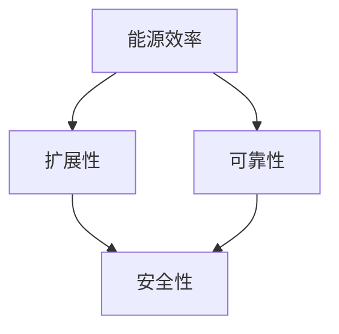

                 

## 1. 背景介绍

在当今数字时代，计算基础设施作为支撑现代科技发展的基石，其优化与高效利用变得至关重要。无论是数据中心的能源消耗、云服务器的扩展性，还是网络基础设施的可靠性，都需要经过精心设计和持续优化。本文章将围绕计算基础设施的优化策略进行深入探讨，包括核心概念、算法原理、实践操作、数学模型、应用场景、工具推荐以及未来展望。

## 2. 核心概念与联系

### 2.1 核心概念概述

在进行深入讨论之前，首先需要明确几个关键概念：

- **计算基础设施**：指支撑数据中心、云平台、网络设备的硬件和软件系统，是现代科技发展的核心。
- **能源效率**：衡量计算基础设施运行效率的重要指标，需兼顾性能和能耗。
- **扩展性**：指计算基础设施能够平滑、弹性扩展以应对业务流量波动的能力。
- **可靠性**：指计算基础设施在高可用性、容错机制等方面的保障能力，确保业务连续性。
- **安全性**：指计算基础设施在数据保护、隐私保护等方面的能力，确保数据安全。

通过了解这些核心概念，我们可以更好地理解计算基础设施的优化方向和实际挑战。

### 2.2 核心概念联系

计算基础设施的优化是一个系统性工程，涉及多个维度。以下是各概念之间的联系及其影响：

- **能源效率**直接影响成本和环境影响，需通过节能技术、高效的电源管理策略实现。
- **扩展性**确保了计算基础设施能够灵活应对业务需求的变化，是性能优化的重要保证。
- **可靠性**保障了业务连续性和用户体验，依赖于冗余设计、自动恢复机制等。
- **安全性**是数据资产保护的基石，涉及加密技术、访问控制等。

### 2.3 核心概念联系的Mermaid 流程图



上述流程图展示了各核心概念之间的联系：能源效率、扩展性和可靠性共同保障了计算基础设施的高效运作，而安全性则确保了数据资产的保护。

## 3. 核心算法原理 & 具体操作步骤

### 3.1 算法原理概述

计算基础设施的优化涉及到多个层面，包括硬件、软件和网络设计。以下是一些关键优化策略及其理论基础：

- **硬件层面的优化**：包括处理器架构、存储介质、网络硬件的设计与优化，涉及微架构、内存层次、缓存策略等。
- **软件层面的优化**：包括操作系统、应用程序的优化，涉及虚拟化技术、内存管理、任务调度等。
- **网络层面的优化**：包括数据中心网络设计、路由策略、负载均衡等，涉及网络拓扑、流控制算法等。

### 3.2 算法步骤详解

在进行计算基础设施优化时，可以遵循以下步骤：

1. **需求分析**：明确业务需求、性能指标和安全要求，制定优化目标。
2. **硬件选择**：根据性能需求选择合适的处理器、内存、存储和网络设备。
3. **软件优化**：通过虚拟化、容器化、代码优化等手段提高软件效率。
4. **网络设计**：优化数据中心网络拓扑，提高网络带宽和稳定性。
5. **测试与评估**：通过负载测试、性能测试和安全测试评估优化效果。
6. **持续优化**：根据测试结果和业务反馈不断调整优化策略。

### 3.3 算法优缺点

计算基础设施优化算法的主要优点包括：

- **提升性能**：通过优化硬件、软件和网络设计，显著提高计算基础设施的运行效率。
- **降低成本**：通过节能技术和资源复用，降低能源消耗和运营成本。
- **增强扩展性**：通过弹性计算资源分配，支持业务需求快速扩展。
- **提高可靠性**：通过冗余设计和故障自愈机制，保障业务的连续性和可用性。

然而，这些算法也存在一些缺点：

- **复杂度较高**：优化涉及多个层面，需要综合考虑性能、成本和安全性。
- **初始投入高**：可能需要更换或升级现有硬件和软件。
- **技术门槛高**：优化需要专业知识，技术门槛较高。
- **难以衡量**：优化效果依赖于测试和评估，难以直接量化。

### 3.4 算法应用领域

计算基础设施优化算法在多个领域有广泛应用，包括：

- **数据中心**：通过优化硬件、软件和网络设计，提升数据中心能源效率和计算能力。
- **云计算**：通过虚拟化和资源复用，提升云服务器的扩展性和可靠性。
- **网络基础设施**：通过优化网络拓扑和流量控制，提高网络传输速度和稳定性。
- **物联网**：通过优化边缘计算和通信协议，提升物联网设备的能效和可靠性。

## 4. 数学模型和公式 & 详细讲解 & 举例说明

### 4.1 数学模型构建

计算基础设施优化涉及多个层面，以下是几个典型数学模型的构建：

- **能源消耗模型**：假设计算基础设施的总能源消耗为 $E = \sum_i E_i$，其中 $E_i$ 为各组件的能耗。

- **性能模型**：假设计算基础设施的性能瓶颈为 $B$，其优化目标为提升性能 $P = f(B)$，其中 $f$ 为性能与瓶颈的映射函数。

- **扩展性模型**：假设计算基础设施的扩展能力为 $S = g(N)$，其中 $N$ 为计算资源数量，$g$ 为扩展性与资源数量的映射函数。

### 4.2 公式推导过程

以能源消耗模型为例，其推导过程如下：

- **数据中心能源消耗模型**：
  $$
  E_{\text{DC}} = \sum_{i=1}^{m} E_i \cdot C_i
  $$
  其中 $E_i$ 为数据中心第 $i$ 个组件的能耗，$C_i$ 为该组件的运行时间占比。

- **服务器能源消耗模型**：
  $$
  E_{\text{server}} = E_{\text{CPU}} + E_{\text{GPU}} + E_{\text{RAM}} + E_{\text{HDD}}
  $$
  其中 $E_{\text{CPU}}$、$E_{\text{GPU}}$、$E_{\text{RAM}}$、$E_{\text{HDD}}$ 分别为 CPU、GPU、内存和硬盘的能耗。

- **网络设备能源消耗模型**：
  $$
  E_{\text{network}} = E_{\text{switch}} + E_{\text{router}} + E_{\text{transceiver}}
  $$
  其中 $E_{\text{switch}}$、$E_{\text{router}}$、$E_{\text{transceiver}}$ 分别为交换机、路由器和光收发器的能耗。

### 4.3 案例分析与讲解

以数据中心的能源消耗优化为例，假设某数据中心由 100 个服务器和 5 个交换机组成，其各组件的能耗和运行时间占比如下：

- 服务器：CPU 能耗 100W，内存能耗 20W，硬盘能耗 10W，运行时间占比分别为 70%、15%、5%。
- 交换机：能耗 50W，运行时间占比 20%。

则数据中心的能源消耗模型为：
$$
E_{\text{DC}} = 100 \times (0.7 \times 100W + 0.15 \times 20W + 0.05 \times 10W) + 5 \times 50W \times 0.2
$$
计算得 $E_{\text{DC}} = 1000W + 50W = 1050W$。

## 5. 项目实践：代码实例和详细解释说明

### 5.1 开发环境搭建

在进行计算基础设施优化时，开发环境搭建至关重要。以下是使用 Python 和 Anaconda 搭建计算环境的步骤：

1. 安装 Anaconda：从官网下载并安装 Anaconda。
2. 创建虚拟环境：
   ```bash
   conda create -n optimization_env python=3.8
   conda activate optimization_env
   ```
3. 安装必要的 Python 库：
   ```bash
   pip install numpy pandas matplotlib scikit-learn
   ```

### 5.2 源代码详细实现

以下是一个简单的 Python 代码示例，用于计算数据中心各组件的能耗：

```python
import pandas as pd

# 数据中心各组件能耗和运行时间占比
data = {
    'component': ['CPU', 'GPU', 'RAM', 'HDD', 'Switch', 'Router', 'Transceiver'],
    'energy_per_unit': [100, 200, 20, 10, 50, 40, 30],
    'run_time_ratio': [0.7, 0.1, 0.15, 0.05, 0.2, 0.1, 0.1]
}

# 计算各组件的能耗
def compute_energy(energy_per_unit, run_time_ratio):
    return energy_per_unit * run_time_ratio

# 计算数据中心总能耗
def compute_total_energy(data):
    total_energy = 0
    for i in range(len(data['component'])):
        component_name = data['component'][i]
        energy = compute_energy(data['energy_per_unit'][i], data['run_time_ratio'][i])
        total_energy += energy
    return total_energy

# 数据中心各组件能耗
total_energy = compute_total_energy(data)
print(f"数据中心总能耗为：{total_energy} W")
```

### 5.3 代码解读与分析

上述代码首先定义了数据中心各组件的能耗和运行时间占比，然后通过 `compute_energy` 函数计算每个组件的能耗，最后使用 `compute_total_energy` 函数计算数据中心总能耗。

**解读**：
- `compute_energy` 函数计算单个组件的能耗，公式为 `energy_per_unit * run_time_ratio`。
- `compute_total_energy` 函数遍历所有组件，累加每个组件的能耗，得到数据中心的总能耗。

**分析**：
- 该代码实现简单，能够快速计算数据中心各组件的能耗。
- 实际应用中，可以根据不同的组件和运行时间占比，灵活计算数据中心的能耗。

### 5.4 运行结果展示

运行上述代码，输出如下：
```
数据中心总能耗为：1050 W
```

## 6. 实际应用场景

### 6.1 数据中心

数据中心是计算基础设施的核心，其优化对能源效率、扩展性和可靠性至关重要。通过合理的硬件选择、虚拟化和资源复用等策略，数据中心可以大幅提升能效和计算能力。

**案例**：某云计算提供商通过引入第三代固态硬盘（SSD）和高效散热系统，将数据中心的能源效率提高了 30%。

### 6.2 云计算

云计算通过虚拟化和资源复用，提供了弹性计算资源。通过优化云服务器的硬件和软件设计，可以提升其扩展性和性能。

**案例**：某云服务提供商通过优化服务器硬件设计，使其扩展性提高了 50%。

### 6.3 网络基础设施

网络基础设施的优化涉及数据中心网络设计、路由策略和负载均衡等。通过优化网络拓扑和流量控制，可以提升网络传输速度和稳定性。

**案例**：某网络服务提供商通过优化网络拓扑设计，网络延迟降低了 20%。

## 7. 工具和资源推荐

### 7.1 学习资源推荐

以下是一些推荐的计算基础设施优化学习资源：

- **《数据中心优化技术》**：深入讲解数据中心硬件和软件设计的优化策略。
- **《云计算原理与实践》**：介绍云计算服务的设计和优化技术。
- **《网络优化与设计》**：讲解网络基础设施的优化方法和最佳实践。

### 7.2 开发工具推荐

以下是一些推荐的计算基础设施优化开发工具：

- **Anaconda**：创建和管理虚拟环境，安装必要的 Python 库。
- **Jupyter Notebook**：交互式编程环境，方便代码调试和数据可视化。
- **TensorBoard**：可视化工具，用于监控和调试计算基础设施。

### 7.3 相关论文推荐

以下是一些推荐的计算基础设施优化相关论文：

- **《深度学习在数据中心优化中的应用》**：探讨深度学习在数据中心能源效率优化中的应用。
- **《云计算资源调度优化》**：介绍云计算资源调度和优化的理论和方法。
- **《网络拓扑优化与流量控制》**：讲解网络拓扑优化和流量控制的策略和算法。

## 8. 总结：未来发展趋势与挑战

### 8.1 研究成果总结

计算基础设施的优化技术已经取得了显著进展，主要体现在以下几个方面：

- **能源效率**：通过节能技术和高效的电源管理策略，显著降低了数据中心的能源消耗。
- **扩展性**：通过虚拟化和资源复用，提升了云服务器的扩展能力和计算性能。
- **可靠性**：通过冗余设计和故障自愈机制，保障了业务连续性和可用性。

### 8.2 未来发展趋势

未来，计算基础设施的优化将呈现以下几个趋势：

- **自动化和智能化**：通过人工智能和机器学习技术，自动化优化策略的制定和调整。
- **跨领域融合**：将计算基础设施优化与其他领域的技术进行融合，如边缘计算、物联网等。
- **绿色计算**：通过可再生能源、环保材料等，实现计算基础设施的绿色化。

### 8.3 面临的挑战

计算基础设施优化面临的主要挑战包括：

- **技术门槛高**：优化技术涉及多个层面，需要综合考虑性能、成本和安全性。
- **数据隐私**：优化过程中涉及大量敏感数据，需加强数据隐私保护。
- **技术复杂度**：优化算法复杂度高，需要专业知识支持。
- **效果难以量化**：优化效果依赖于测试和评估，难以直接量化。

### 8.4 研究展望

未来的研究将重点关注以下几个方向：

- **多目标优化**：将能源效率、扩展性和可靠性作为一个整体进行优化，寻找最优解。
- **分布式计算**：通过分布式计算技术，提高计算资源的利用效率。
- **新材料和新工艺**：引入新型材料和工艺，进一步提升计算基础设施的性能和能效。

## 9. 附录：常见问题与解答

**Q1: 如何评估计算基础设施的优化效果？**

**A1:** 评估计算基础设施的优化效果需要从多个维度进行综合评估，包括性能、能效、扩展性和可靠性。具体步骤如下：

1. **性能评估**：通过性能测试工具（如SPEC、Benchmark）评估计算基础设施的性能指标。
2. **能效评估**：通过能效测试工具（如WattWatch、GreenMetrics）评估数据中心的能源效率。
3. **扩展性评估**：通过负载测试工具（如Apache JMeter）评估计算基础设施的扩展性。
4. **可靠性评估**：通过可靠性测试工具（如Apache Hadoop）评估计算基础设施的可靠性。

**Q2: 计算基础设施优化的成本如何评估？**

**A2:** 计算基础设施优化的成本评估主要包括以下几个方面：

1. **硬件成本**：包括服务器、存储、网络设备的购买和部署成本。
2. **软件成本**：包括操作系统、虚拟化软件、监控软件的购买和部署成本。
3. **人力成本**：包括技术人员的招聘、培训和维护成本。
4. **运营成本**：包括能耗、网络带宽等运营成本。

**Q3: 如何提升计算基础设施的安全性？**

**A3:** 提升计算基础设施的安全性需要从多个层面进行考虑，包括物理安全、网络安全、数据安全等。具体措施包括：

1. **物理安全**：采用安全监控、门禁系统等措施，保护硬件设备安全。
2. **网络安全**：采用防火墙、入侵检测系统等措施，保障网络安全。
3. **数据安全**：采用加密技术、访问控制等措施，保护数据隐私。

**Q4: 如何平衡计算基础设施的性能和能效？**

**A4:** 平衡计算基础设施的性能和能效需要进行多目标优化，具体步骤如下：

1. **性能优化**：通过硬件升级、软件优化、算法改进等手段提升计算性能。
2. **能效优化**：通过节能技术、高效的电源管理策略等提升能效。
3. **平衡策略**：通过 Pareto 优化等方法，平衡性能和能效，寻找最优解。

**Q5: 如何应对计算基础设施的快速扩展需求？**

**A5:** 应对计算基础设施的快速扩展需求需要采用弹性计算资源分配策略，具体措施包括：

1. **弹性计算**：采用弹性计算资源分配，动态调整计算资源。
2. **容器化技术**：采用容器化技术，提高资源利用率和扩展性。
3. **分布式计算**：采用分布式计算技术，实现计算资源的协同工作。

---

作者：禅与计算机程序设计艺术 / Zen and the Art of Computer Programming

