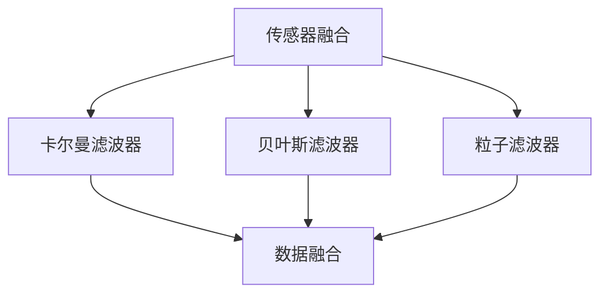

                 

# 传感器融合技术：获取准确的环境数据

## 1. 背景介绍

### 1.1 问题由来
在智能系统，如自动驾驶、机器人导航等领域，传感器融合技术扮演着关键角色。这些系统往往集成了多种不同类型的传感器，如激光雷达(LiDAR)、摄像头、雷达等，用于采集环境数据。每个传感器都有其特定的优势和局限性，因此单独使用任何一个传感器都无法全面获取复杂环境信息。

传感器融合技术通过综合多个传感器的输出，能够弥补单一传感器的不足，提高系统对环境的感知能力。常见的传感器融合方法包括贝叶斯滤波器、卡尔曼滤波器、粒子滤波器等。这些方法通过构建数学模型，利用数据融合算法，将不同传感器提供的数据进行最优融合，生成更加准确的环境数据。

### 1.2 问题核心关键点
传感器融合技术在实际应用中需考虑以下几个核心关键点：

- 不同传感器数据类型和单位不一致，需要进行数据预处理和归一化。
- 传感器间存在测量误差和延迟，需建立误差模型并进行优化。
- 融合算法应能够处理非线性、不确定性等复杂环境，保证数据融合的鲁棒性。
- 融合算法应具有实时性，满足动态环境变化下的实时数据处理需求。
- 融合算法需具有自适应能力，能够在不同环境条件下自动调整融合策略。

## 2. 核心概念与联系

### 2.1 核心概念概述

为更好地理解传感器融合技术，本节将介绍几个密切相关的核心概念：

- 传感器融合(Sensor Fusion)：将多个传感器的数据进行融合，以获得更加全面、准确的环境信息。

- 卡尔曼滤波器(Kalman Filter)：一种基于线性系统的状态估计算法，用于解决存在不确定性、噪声的数据融合问题。

- 贝叶斯滤波器(Bayesian Filter)：一种基于概率论的滤波器，用于解决存在不确定性和复杂环境的数据融合问题。

- 粒子滤波器(Particle Filter)：一种基于蒙特卡洛方法的非线性滤波器，适用于处理复杂的非线性系统。

- 数据融合算法(Data Fusion Algorithm)：一类用于处理多源数据的算法，包括卡尔曼滤波器、贝叶斯滤波器、粒子滤波器等。

- 非线性系统(Nonlinear System)：传感器数据处理过程中，往往会遇到非线性现象，如遮挡、光照变化等，需通过数据融合算法进行校正。

- 实时性(Real-Time)：传感器融合算法应能够在实时环境中高效运行，处理动态变化的环境数据。

- 自适应性(Adaptability)：融合算法应能够根据环境条件自动调整参数，以适应不同的应用场景。

这些核心概念之间的逻辑关系可以通过以下Mermaid流程图来展示：



这个流程图展示了几类主要传感器融合方法及其之间的关系：

1. 传感器融合是目标，将不同传感器数据进行最优融合。
2. 卡尔曼滤波器、贝叶斯滤波器和粒子滤波器是实现传感器融合的几种主要算法。
3. 数据融合是实现算法的基本步骤，不同算法具有不同的优化策略和适用场景。
4. 非线性系统和实时性、自适应性是传感器融合中需要特别考虑的因素。

## 3. 核心算法原理 & 具体操作步骤
### 3.1 算法原理概述

传感器融合技术的核心原理是利用数据融合算法，将多个传感器的数据进行综合处理，生成更加准确的环境数据。融合算法通过构建数学模型，利用统计方法对多个传感器的测量结果进行加权融合，减少单一传感器的测量误差和噪声。

### 3.2 算法步骤详解

以卡尔曼滤波器为例，传感器融合的具体步骤如下：

**Step 1: 数据预处理**
- 对不同传感器采集的数据进行预处理，包括去噪、归一化、数据格式统一等操作。
- 假设传感器数量为 $n$，每个传感器的测量结果为 $z_i(t)$。

**Step 2: 初始化状态**
- 定义系统状态变量 $x(t)$ 和状态协方差 $P(t)$，如位置、速度等。
- 初始化状态 $x(0)$ 和状态协方差 $P(0)$。

**Step 3: 数据融合**
- 根据传感器测量结果，计算状态预测值 $x(t)$ 和协方差 $P(t)$。
- 将传感器数据与状态预测值进行加权融合，得到新的状态估计值 $\hat{x}(t)$ 和协方差 $\hat{P}(t)$。
- 更新状态变量和协方差：
  $$
  \begin{align*}
  \hat{x}(t) &= \text{ Kalman Gain } * \left(z(t) - \text{H} * \hat{x}(t-1)\right) + \hat{x}(t-1) \\
  \hat{P}(t) &= \left(\text{I} - \text{Kalman Gain} * \text{H}\right) * \hat{P}(t-1)
  \end{align*}
  $$
  其中 $\text{Kalman Gain}$ 为滤波增益，$\text{H}$ 为观测矩阵。

**Step 4: 模型预测**
- 根据状态估计值 $\hat{x}(t)$ 和协方差 $\hat{P}(t)$，预测下一时刻的状态值 $x(t+1)$ 和协方差 $P(t+1)$。
- 使用预测结果更新状态变量和协方差。

**Step 5: 迭代更新**
- 重复上述步骤，直至达到终止条件。

卡尔曼滤波器的核心思想是通过预测和校正，不断更新状态估计值，以提高对环境数据的准确性。

### 3.3 算法优缺点

卡尔曼滤波器等传感器融合算法具有以下优点：
1. 能够处理存在噪声和不确定性的测量数据，提高数据融合的准确性。
2. 能够实时更新状态估计，适应动态环境变化。
3. 算法形式化，可扩展性高，适用于不同类型的传感器和数据源。

同时，这些算法也存在以下缺点：
1. 对模型线性假设强，难以处理复杂的非线性系统。
2. 需要初始状态和协方差等参数的准确设置，参数设置不当会导致滤波失效。
3. 计算复杂度较高，需要较高的计算资源。
4. 对传感器数据进行线性变换的假设可能不成立，影响融合效果。

## 4. 数学模型和公式 & 详细讲解 & 举例说明
### 4.1 数学模型构建

以卡尔曼滤波器为例，构建状态估计的数学模型：

- **状态方程**：
  $$
  x(t+1) = f(x(t),u(t))
  $$
  表示当前状态 $x(t)$ 到下一时刻 $x(t+1)$ 的转移关系。

- **观测方程**：
  $$
  z(t) = H(x(t)) + v(t)
  $$
  表示传感器测量结果 $z(t)$ 与系统状态 $x(t)$ 的关系，其中 $v(t)$ 为观测噪声。

- **状态协方差方程**：
  $$
  P(t+1) = F(t) * P(t) * F(t)^T + Q(t)
  $$
  表示状态协方差 $P(t)$ 在预测阶段的更新。

- **滤波增益方程**：
  $$
  K(t) = P(t) * H^T(t) * (H(t) * P(t) * H^T(t) + R(t))^{-1}
  $$
  表示滤波增益 $K(t)$ 的计算，用于调整传感器数据的权重。

### 4.2 公式推导过程

卡尔曼滤波器状态的预测和校正过程如下：

**预测阶段**：
- 状态预测值：
  $$
  \hat{x}(t|t-1) = f(\hat{x}(t-1),u(t-1))
  $$
  其中 $\hat{x}(t|t-1)$ 表示当前时刻的预测状态，$f(\cdot)$ 为系统转移矩阵。
- 状态协方差预测值：
  $$
  \hat{P}(t|t-1) = F(t) * P(t-1) * F(t)^T + Q(t)
  $$
  其中 $F(t)$ 为系统转移矩阵，$Q(t)$ 为状态噪声协方差。

**校正阶段**：
- 滤波增益：
  $$
  K(t) = P(t|t-1) * H^T(t) * (H(t) * P(t|t-1) * H^T(t) + R(t))^{-1}
  $$
  其中 $H(t)$ 为观测矩阵，$R(t)$ 为观测噪声协方差。
- 状态估计值：
  $$
  \hat{x}(t) = \hat{x}(t|t-1) + K(t) * (z(t) - H * \hat{x}(t|t-1))
  $$
  表示当前时刻的状态估计值。
- 状态协方差：
  $$
  \hat{P}(t) = \left(\text{I} - K(t) * H(t)\right) * \hat{P}(t|t-1)
  $$
  表示当前时刻的状态协方差。

卡尔曼滤波器的核心在于通过预测和校正，不断更新状态估计值，以提高对环境数据的准确性。其关键公式为滤波增益方程，用于调整传感器数据的权重。

### 4.3 案例分析与讲解

以自动驾驶系统为例，分析卡尔曼滤波器在数据融合中的应用：

1. **传感器数据**：
   - 激光雷达提供车辆周围物体的距离信息，通常以点云形式表示。
   - 摄像头提供道路、行人、交通标志等视觉信息，通常以图像形式表示。
   - 雷达提供车辆周围物体的速度、方向等运动信息，通常以幅度-频率形式表示。

2. **状态方程**：
   - 车辆的运动状态可以表示为位置、速度、加速度等。
   - 状态方程描述车辆运动，如 $x(t+1) = x(t) + v(t) + w(t)$，其中 $v(t)$ 为车辆加速度，$w(t)$ 为状态噪声。

3. **观测方程**：
   - 激光雷达的观测方程可以表示为 $z(t) = H(x(t)) + v(t)$，其中 $H$ 为从车辆状态到激光雷达测量的映射。
   - 摄像头的观测方程可以表示为 $z(t) = H(x(t)) + v(t)$，其中 $H$ 为从车辆状态到摄像头测量的映射。

4. **卡尔曼滤波器应用**：
   - 将激光雷达、摄像头和雷达的数据输入卡尔曼滤波器，通过状态预测和校正，生成车辆位置的准确估计。
   - 利用卡尔曼滤波器输出的状态估计值，进行路径规划、决策控制等应用。

通过卡尔曼滤波器的应用，自动驾驶系统能够整合多种传感器数据，生成更加全面、准确的环境信息，从而提升驾驶安全性。

## 5. 项目实践：代码实例和详细解释说明
### 5.1 开发环境搭建

在进行传感器融合项目实践前，我们需要准备好开发环境。以下是使用Python进行OpenCV、NumPy等库开发的环境配置流程：

1. 安装Anaconda：从官网下载并安装Anaconda，用于创建独立的Python环境。

2. 创建并激活虚拟环境：
```bash
conda create -n sensor-fusion python=3.8 
conda activate sensor-fusion
```

3. 安装依赖库：
```bash
conda install numpy opencv-python opencv-contrib-python
```

4. 安装相关工具：
```bash
pip install matplotlib jupyter notebook ipython
```

完成上述步骤后，即可在`sensor-fusion`环境中开始项目开发。

### 5.2 源代码详细实现

下面以卡尔曼滤波器为例，给出使用NumPy实现传感器数据融合的代码示例。

```python
import numpy as np

class KalmanFilter:
    def __init__(self, A, B, H, Q, R):
        self.A = A  # 系统转移矩阵
        self.B = B  # 控制矩阵
        self.H = H  # 观测矩阵
        self.Q = Q  # 状态噪声协方差
        self.R = R  # 观测噪声协方差
        self.P = np.eye(len(A))  # 状态协方差
        self.x = np.zeros((len(A), 1))  # 状态估计值
        self.u = np.zeros((len(B), 1))  # 控制输入
        self.z = np.zeros((len(H), 1))  # 观测输出
        self.K = np.zeros((len(A), len(H)))  # 滤波增益

    def predict(self, u=None):
        self.x = self.A @ self.x + self.B @ u
        self.P = self.A @ self.P @ self.A.T + self.Q
        return self.x, self.P

    def update(self, z):
        y = z - self.H @ self.x
        S = self.H @ self.P @ self.H.T + self.R
        self.K = self.P @ self.H.T @ S_inv
        self.x = self.x + self.K @ y
        self.P = (np.eye(len(self.A)) - self.K @ self.H) @ self.P
        return self.x, self.P

def kalman_filter_example():
    # 定义状态方程参数
    A = np.array([[1.0, 0.0], [0.0, 1.0]])  # 预测矩阵
    B = np.array([[0.0, 1.0]])  # 控制矩阵
    H = np.array([[1.0, 0.0]])  # 观测矩阵
    Q = np.array([[1.0, 0.0], [0.0, 1.0]])  # 状态噪声协方差
    R = np.array([[0.1]])

    # 创建卡尔曼滤波器
    filter = KalmanFilter(A, B, H, Q, R)

    # 进行状态预测和校正
    x, P = filter.predict()
    x, P = filter.update(np.array([[0.0]]))

    print("State estimate: ", x)
    print("Covariance: ", P)

# 运行示例
kalman_filter_example()
```

### 5.3 代码解读与分析

以上代码展示了使用NumPy实现卡尔曼滤波器的基本过程：

- **类定义**：定义`KalmanFilter`类，包含系统转移矩阵、控制矩阵、观测矩阵、状态噪声协方差和观测噪声协方差等参数，以及状态协方差、状态估计值、控制输入和观测输出等状态变量。
- **预测函数`predict`**：通过状态方程进行状态预测，更新状态协方差。
- **校正函数`update`**：通过观测方程进行状态校正，计算滤波增益，更新状态估计值和状态协方差。
- **示例函数`kalman_filter_example`**：定义一个简单的示例系统，进行状态预测和校正，并输出结果。

可以看到，卡尔曼滤波器的代码实现相对简洁，但其核心思想是通过预测和校正，不断更新状态估计值，以提高对环境数据的准确性。

## 6. 实际应用场景
### 6.1 自动驾驶系统

在自动驾驶系统中，传感器融合技术扮演着关键角色。通过整合激光雷达、摄像头、雷达等多种传感器数据，自动驾驶系统能够全面感知周围环境，做出精准决策。

具体而言，激光雷达可以提供高精度的距离信息，用于路径规划和避障；摄像头可以提供道路、行人、交通标志等视觉信息，用于导航和目标检测；雷达可以提供车辆周围物体的速度、方向等运动信息，用于交通流监测和目标跟踪。

传感器融合技术通过卡尔曼滤波器等算法，将这些不同传感器数据进行最优融合，生成更加全面、准确的环境信息。融合后的数据可以用于车辆定位、路径规划、决策控制等多个应用环节，显著提升自动驾驶系统的安全性和可靠性。

### 6.2 无人机自主导航

无人机自主导航是传感器融合技术的重要应用场景之一。无人机需要实时获取周围环境信息，进行路径规划和避障，以确保飞行安全。

激光雷达、摄像头、GPS等多种传感器可以提供丰富的环境数据。通过传感器融合技术，无人机可以实时获取位置、速度、方向等信息，进行自主导航和避障。

例如，激光雷达可以提供高精度的距离信息，用于避障和路径规划；摄像头可以提供周围环境的视觉信息，用于目标检测和识别；GPS可以提供定位信息，用于自主导航。

传感器融合技术通过卡尔曼滤波器等算法，将这些不同传感器数据进行最优融合，生成更加全面、准确的环境信息。融合后的数据可以用于无人机定位、路径规划、决策控制等多个应用环节，显著提升无人机的自主导航能力和安全性。

### 6.3 机器人导航

机器人导航是传感器融合技术的另一重要应用场景。机器人需要实时获取周围环境信息，进行路径规划和避障，以确保安全到达目的地。

激光雷达、摄像头、雷达等多种传感器可以提供丰富的环境数据。通过传感器融合技术，机器人可以实时获取位置、速度、方向等信息，进行自主导航和避障。

例如，激光雷达可以提供高精度的距离信息，用于避障和路径规划；摄像头可以提供周围环境的视觉信息，用于目标检测和识别；雷达可以提供车辆周围物体的速度、方向等运动信息，用于交通流监测和目标跟踪。

传感器融合技术通过卡尔曼滤波器等算法，将这些不同传感器数据进行最优融合，生成更加全面、准确的环境信息。融合后的数据可以用于机器人定位、路径规划、决策控制等多个应用环节，显著提升机器人的自主导航能力和安全性。

### 6.4 未来应用展望

随着传感器融合技术的不断发展，其在智能系统中的应用将更加广泛，未来可能涉及以下领域：

1. 智能家居：智能家居系统需要实时获取室内、室外环境信息，进行环境感知和智能控制。传感器融合技术可以帮助智能家居系统全面感知环境，提供更智能、便捷的用户体验。

2. 智能交通：智能交通系统需要实时获取道路、车辆、行人等环境信息，进行交通流量监测、路径规划和避障。传感器融合技术可以帮助智能交通系统全面感知交通环境，提高交通运行效率和安全性。

3. 智能医疗：智能医疗系统需要实时获取患者生理、环境信息，进行疾病诊断和治疗方案优化。传感器融合技术可以帮助智能医疗系统全面感知患者信息，提供更精准、有效的医疗服务。

4. 智能制造：智能制造系统需要实时获取设备、环境信息，进行设备监控和生产调度。传感器融合技术可以帮助智能制造系统全面感知制造环境，提高生产效率和设备利用率。

未来，传感器融合技术将进一步拓展应用场景，与人工智能、物联网等技术深度融合，为智能系统的快速发展提供更强大的技术支撑。

## 7. 工具和资源推荐
### 7.1 学习资源推荐

为了帮助开发者系统掌握传感器融合技术的理论基础和实践技巧，这里推荐一些优质的学习资源：

1. 《传感器与检测技术》系列书籍：系统介绍传感器的工作原理、测量方法和应用场景，适合初学者入门。

2. 《信号处理基础》系列课程：由MIT等名校开设的信号处理课程，涵盖信号处理的基本原理和实用技术。

3. 《机器人学基础》系列教材：系统介绍机器人的感知、控制和运动等基本原理，适合机器人工程师参考。

4. 《卡尔曼滤波器原理与应用》论文：介绍卡尔曼滤波器的基本原理和实际应用，适合研究者和工程师参考。

5. 《传感器融合算法》开源项目：提供多种传感器融合算法的实现代码，适合实践者参考。

通过对这些资源的学习实践，相信你一定能够快速掌握传感器融合技术的精髓，并用于解决实际的智能系统问题。

### 7.2 开发工具推荐

高效的开发离不开优秀的工具支持。以下是几款用于传感器融合开发的常用工具：

1. OpenCV：开源计算机视觉库，提供丰富的图像处理和计算机视觉算法，支持多种传感器数据的处理。

2. NumPy：高性能科学计算库，支持多维数组和矩阵运算，适合进行传感器数据的数学计算。

3. TensorFlow和PyTorch：深度学习框架，支持复杂的数据融合和模型训练，适合进行高级数据融合和机器学习应用。

4. ROS：机器人操作系统，提供多种传感器数据的接口和处理工具，适合进行机器人系统开发。

5. PCL：点云处理库，支持激光雷达等传感器数据的处理和分析，适合进行点云数据融合。

合理利用这些工具，可以显著提升传感器融合任务的开发效率，加快创新迭代的步伐。

### 7.3 相关论文推荐

传感器融合技术的发展源于学界的持续研究。以下是几篇奠基性的相关论文，推荐阅读：

1. Extended Kalman Filter: The Monarch of Recursive State Estimation（卡尔曼滤波器扩展版论文）：介绍扩展卡尔曼滤波器的基本原理和实际应用。

2. Probabilistic Robotic Vision：A Survey（概率机器人视觉综述论文）：综述概率机器人在视觉感知和数据融合中的应用。

3. GPS-aided extended Kalman filtering for autonomous vehicle navigation（GPS辅助扩展卡尔曼滤波论文）：介绍GPS辅助扩展卡尔曼滤波在自动驾驶中的应用。

4. An Analysis of the Fusion of the Fusion Algorithm in the Case of Long-term Deception（融合算法分析论文）：分析融合算法在长周期欺骗情况下的应用。

5. Multisensory State Estimation for Robust Object Recognition（多模态状态估计算法论文）：介绍多模态数据融合在目标识别中的应用。

这些论文代表了大语言模型微调技术的发展脉络。通过学习这些前沿成果，可以帮助研究者把握学科前进方向，激发更多的创新灵感。

## 8. 总结：未来发展趋势与挑战
### 8.1 总结

本文对传感器融合技术进行了全面系统的介绍。首先阐述了传感器融合技术的背景和意义，明确了其在大系统中的应用价值。其次，从原理到实践，详细讲解了卡尔曼滤波器等数据融合算法的数学模型和实现步骤，给出了传感器融合项目开发的完整代码实例。同时，本文还广泛探讨了传感器融合技术在智能系统中的应用场景，展示了其广阔的发展前景。

通过本文的系统梳理，可以看到，传感器融合技术在大系统中的应用前景广阔，特别是在自动驾驶、机器人导航、无人机自主导航等领域，能够显著提升系统的感知能力和智能化水平。未来，伴随传感器技术的不断进步，传感器融合技术必将进一步拓展应用范围，为智能系统的快速发展提供更强大的技术支撑。

### 8.2 未来发展趋势

展望未来，传感器融合技术将呈现以下几个发展趋势：

1. 传感器集成多样化：未来的传感器融合系统将集成更多类型的传感器，如毫米波雷达、红外传感器、超声波传感器等，以全面覆盖复杂环境。

2. 数据融合智能化：未来的数据融合算法将更加智能，能够根据环境条件自动调整参数，优化数据融合策略，提升系统鲁棒性和实时性。

3. 数据融合高效化：未来的数据融合算法将更加高效，能够在有限计算资源下处理更复杂的数据，提高系统的实时性和可靠性。

4. 数据融合实时化：未来的数据融合算法将更加实时，能够实时处理动态环境变化，支持系统的动态调整和决策优化。

5. 数据融合自适应化：未来的数据融合算法将更加自适应，能够根据环境条件自动调整融合策略，适应不同的应用场景。

以上趋势凸显了传感器融合技术的广阔前景。这些方向的探索发展，必将进一步提升智能系统的感知能力和智能化水平，为构建人机协同的智能系统铺平道路。

### 8.3 面临的挑战

尽管传感器融合技术已经取得了瞩目成就，但在迈向更加智能化、普适化应用的过程中，它仍面临着诸多挑战：

1. 传感器精度和一致性：不同类型的传感器精度和数据格式可能不一致，需要进行预处理和归一化，可能导致数据融合的误差。

2. 算法复杂度：传感器融合算法通常较为复杂，计算资源消耗较大，需要高效的数据处理和算法优化。

3. 数据隐私和安全：传感器融合系统涉及大量的环境数据，需要保护数据隐私和安全，避免数据泄露和滥用。

4. 系统集成难度：传感器融合系统通常涉及多种传感器和算法，系统集成难度较大，需要综合考虑硬件和软件设计。

5. 实时性和可靠性：传感器融合系统需要实时处理动态环境数据，提高系统的实时性和可靠性，避免数据丢失和决策失误。

6. 算法鲁棒性：传感器数据可能存在各种噪声和异常情况，需要算法具备较强的鲁棒性，能够处理异常数据并保证系统稳定。

正视传感器融合技术面临的这些挑战，积极应对并寻求突破，将使该技术向更加成熟和广泛的应用迈进。相信随着学界和产业界的共同努力，这些挑战终将一一被克服，传感器融合技术必将在智能系统中发挥更大的作用。

### 8.4 研究展望

面对传感器融合技术所面临的种种挑战，未来的研究需要在以下几个方面寻求新的突破：

1. 开发更加多样化和高效的传感器融合算法，支持更多类型的传感器数据融合。

2. 引入人工智能和机器学习技术，提升传感器融合算法的智能性和自适应性。

3. 优化传感器数据处理和存储，降低数据融合的计算资源消耗。

4. 加强数据隐私保护和安全技术，确保传感器数据的隐私和安全。

5. 研究和设计更加灵活和可扩展的传感器融合系统，适应不同应用场景。

6. 开发更加稳定和可靠的传感器融合算法，提高系统的实时性和鲁棒性。

这些研究方向将引领传感器融合技术的进一步发展，为智能系统的快速发展提供更强大的技术支撑。面向未来，传感器融合技术还需要与其他人工智能技术进行更深入的融合，如知识表示、因果推理、强化学习等，多路径协同发力，共同推动智能系统的进步。只有勇于创新、敢于突破，才能不断拓展智能系统的边界，让智能技术更好地造福人类社会。

## 9. 附录：常见问题与解答

**Q1：传感器融合算法是否适用于所有传感器数据？**

A: 传感器融合算法通常适用于多种不同类型的传感器数据，如激光雷达、摄像头、雷达等。但不同类型的传感器可能具有不同的物理特性和数据格式，需要进行预处理和归一化，以保证数据的一致性和融合效果。

**Q2：传感器融合算法是否需要高精度的初始参数？**

A: 传感器融合算法对初始参数的精度有一定要求，但并非必须。通常，通过多次预测和校正，系统能够逐渐逼近真实的参数值。因此，初始参数的精度可以逐渐提高，但不必追求过高的初始值。

**Q3：传感器融合算法是否需要高计算资源？**

A: 传感器融合算法通常需要一定的计算资源，尤其是在多传感器数据融合和复杂的非线性系统中。但通过算法优化和硬件加速，可以显著降低计算资源消耗，支持实时性和高效性。

**Q4：传感器融合算法是否需要实时处理？**

A: 传感器融合算法需要实时处理，以适应动态环境变化，确保系统的高实时性和可靠性。在自动驾驶、机器人导航等需要实时响应的场景中，传感器融合算法更是必不可少。

**Q5：传感器融合算法是否需要多模型集成？**

A: 传感器融合算法可以集成多个模型，提高系统的鲁棒性和可靠性。例如，可以通过卡尔曼滤波器、贝叶斯滤波器、粒子滤波器等多种算法进行融合，根据不同环境条件自动选择最优模型。

总之，传感器融合技术在大系统中的应用前景广阔，但需综合考虑传感器精度、数据格式、算法复杂度、实时性、鲁棒性等多个因素。通过不断的技术创新和优化，传感器融合技术必将在智能系统中发挥更大的作用，提升系统的感知能力和智能化水平。

---

作者：禅与计算机程序设计艺术 / Zen and the Art of Computer Programming

