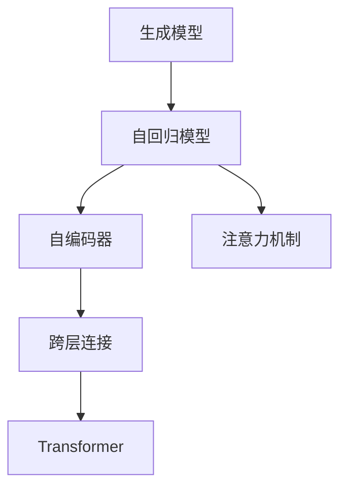

                 

# 使用 GPT 模型生成函数和参数

## 1. 背景介绍

在自然语言处理领域，生成对抗网络（GAN）和变分自编码器（VAE）等生成模型已经展现了强大的生成能力。然而，它们通常需要大量的标注数据和复杂的训练过程，且生成效果往往依赖于数据的分布和模型的初始化。为了克服这些问题，Google于2018年推出了基于 Transformer 的大语言模型 GPT-1，随后在2020年推出了 GPT-2，并在2021年推出了 GPT-3，不断提升模型的生成质量和参数规模。

GPT-3 模型是当前最先进的语言生成模型之一，具有以下特点：
- 参数量巨大，达1750亿个。
- 使用了深度自注意力机制，可以处理长度超过1万字的文本。
- 能够生成高质量、连贯的文本，并支持多种语言和任务。

尽管 GPT-3 模型表现卓越，但其训练过程和生成过程仍存在一些挑战。本文将详细介绍 GPT 模型的生成函数和参数，帮助开发者更深入地理解其内部机制，并探索如何更好地使用和优化 GPT 模型。

## 2. 核心概念与联系

### 2.1 核心概念概述

为了更好地理解 GPT 模型的生成函数和参数，本节将介绍几个密切相关的核心概念：

- 生成模型（Generative Model）：通过训练数据生成新数据的模型。常见的生成模型包括 GAN、VAE、RNN、LSTM、Transformer等。
- 自回归模型（Autoregressive Model）：一种根据历史数据预测未来数据的模型，通过逐个生成数据的方式构建完整的序列。常见的自回归模型包括 GPT、LSTM、RNN等。
- 自编码器（Autoencoder）：一种通过编码和解码过程学习数据压缩和解压缩的模型，能够学习数据的低维表示。常见的自编码器包括 VAE、GAN 等。
- 注意力机制（Attention Mechanism）：一种用于提升模型信息处理能力的机制，通过关注输入序列的不同部分来计算每个位置的表示。Transformer 等模型中广泛使用了注意力机制。
- 跨层连接（Cross-Layer Connection）：一种用于提高模型表示能力的机制，通过在不同层之间建立连接，使得信息在模型中得到更好的传递和利用。

这些核心概念之间的逻辑关系可以通过以下 Mermaid 流程图来展示：



这个流程图展示了大语言模型生成的核心概念及其之间的关系：

1. 大语言模型是基于生成模型的。
2. 自回归模型是生成模型的一种，通过逐个生成数据构建序列。
3. 自编码器是生成模型的一种，通过编码和解码过程学习数据表示。
4. 注意力机制是自回归模型和自编码器都使用的关键机制。
5. 跨层连接是提高模型表示能力的一种手段，常用于自回归模型和自编码器中。

这些概念共同构成了大语言模型的生成机制，使其能够通过训练数据生成高质量的文本。

## 3. 核心算法原理 & 具体操作步骤
### 3.1 算法原理概述

GPT 模型的生成函数和参数是通过自回归方式构建的。具体而言，假设 GPT 模型的输入序列为 $x_1, x_2, ..., x_n$，输出序列为 $y_1, y_2, ..., y_n$。GPT 模型的目标是通过输入序列 $x$ 预测输出序列 $y$。

GPT 模型使用自回归生成方式，即根据历史数据预测未来数据。其生成函数可以表示为：

$$
p(y|x) = \prod_{i=1}^n p(y_i|y_{<i}, x)
$$

其中，$p(y_i|y_{<i}, x)$ 表示给定历史数据 $y_{<i}$ 和输入 $x$，预测下一个位置 $i$ 的概率分布。

为了实现自回归生成，GPT 模型通常使用 Transformer 结构。在 Transformer 结构中，输入序列 $x$ 被嵌入并经过多个自注意力层和前馈神经网络层，最终得到每个位置的表示。这些表示被用于预测下一个位置的概率分布。

### 3.2 算法步骤详解

GPT 模型的生成过程包括以下关键步骤：

**Step 1: 输入序列编码**
- 将输入序列 $x$ 嵌入为高维向量 $x \in \mathbb{R}^{d_{model}}$，其中 $d_{model}$ 为模型嵌入维度。

**Step 2: 生成概率分布**
- 根据当前位置 $i$ 的表示 $h_i$，计算下一个位置的概率分布 $p(y_i|y_{<i}, x)$。

**Step 3: 采样生成文本**
- 根据概率分布 $p(y_i|y_{<i}, x)$ 采样下一个位置 $y_i$，更新状态 $h_{i+1} = \text{MLP}(h_i)$，得到下一个位置的表示。

**Step 4: 迭代生成**
- 重复上述过程，直到生成完整的输出序列 $y$。

在实现过程中，GPT 模型通常采用softmax函数计算概率分布，并使用 temperature 参数控制概率分布的平滑程度。温度越高，分布越平滑，生成的文本越自然。

### 3.3 算法优缺点

GPT 模型在生成文本方面具有以下优点：
1. 高质量的生成效果。GPT 模型能够生成连贯、流畅、高质量的文本，适用于多种任务和语言。
2. 自回归生成方式。GPT 模型能够通过逐个生成数据的方式构建完整的序列，避免了生成文本中存在的模式坍塌问题。
3. 可扩展性。GPT 模型能够处理长度超过1万字的文本，具有很强的可扩展性。

同时，GPT 模型也存在一些局限性：
1. 计算资源消耗大。GPT 模型参数量巨大，训练和推理过程中需要消耗大量的计算资源。
2. 难以控制生成结果。GPT 模型生成的文本往往难以完全控制，生成结果可能包含错误信息或无关内容。
3. 生成速度慢。GPT 模型生成的文本往往需要较长的计算时间，不适合实时应用。

尽管存在这些局限性，但 GPT 模型在文本生成、对话生成、代码生成等方面已经展现出巨大的潜力，成为生成模型研究的重要范式。

### 3.4 算法应用领域

GPT 模型已经在多个领域得到了广泛应用，例如：

- 文本生成：通过训练生成高质量的文本，用于内容创作、摘要生成、翻译等任务。
- 对话生成：生成自然流畅的对话，用于智能客服、聊天机器人等应用。
- 代码生成：通过生成代码片段，用于代码自动补全、自动修复等任务。
- 游戏设计：生成游戏文本、对话等，用于增强游戏的互动性和沉浸感。
- 电影剧本创作：生成电影剧本的对话和场景描述，提高创作效率。

除了上述这些经典应用外，GPT 模型还在文学创作、艺术设计、科学研究等领域展现出其强大的生成能力。随着预训练模型的不断演进，GPT 模型必将在更多领域得到应用，为人类创造更多的价值。

## 4. 数学模型和公式 & 详细讲解  
### 4.1 数学模型构建

本节将使用数学语言对 GPT 模型的生成过程进行更加严格的刻画。

假设 GPT 模型的输入序列为 $x_1, x_2, ..., x_n$，输出序列为 $y_1, y_2, ..., y_n$，模型嵌入维度为 $d_{model}$，模型的层数为 $L$，每个层的输出维度为 $d_{hidden}$。模型的自注意力层使用多头注意力机制，每层的注意力机制数量设为 $h$。

GPT 模型的生成函数可以表示为：

$$
p(y|x) = \prod_{i=1}^n p(y_i|y_{<i}, x)
$$

其中，$p(y_i|y_{<i}, x)$ 表示给定历史数据 $y_{<i}$ 和输入 $x$，预测下一个位置 $i$ 的概率分布。GPT 模型的生成函数可以进一步分解为：

$$
p(y_i|y_{<i}, x) = \frac{e^{s_{i,i-1} \cdot \text{softmax}(Q_{i-1} x_i^T)}}{\sum_{j=1}^{i-1} e^{s_{i,j} \cdot \text{softmax}(Q_{i-1} x_j^T)}}
$$

其中，$s_{i,j}$ 表示位置 $i$ 和位置 $j$ 的注意力权重，$Q_{i-1}$ 表示位置 $i-1$ 的查询矩阵，$x_i^T$ 表示位置 $i$ 的输入向量。

### 4.2 公式推导过程

以下我们以 GPT-3 模型为例，推导生成函数的概率分布及其梯度的计算公式。

假设 GPT-3 模型的层数为 $L$，每个位置的表示为 $h_i \in \mathbb{R}^{d_{hidden}}$。模型的生成函数可以表示为：

$$
p(y|x) = \prod_{i=1}^n p(y_i|y_{<i}, x)
$$

其中，$p(y_i|y_{<i}, x)$ 表示给定历史数据 $y_{<i}$ 和输入 $x$，预测下一个位置 $i$ 的概率分布。GPT-3 模型使用自回归生成方式，其生成函数可以进一步分解为：

$$
p(y_i|y_{<i}, x) = \frac{e^{\text{logit}(y_i) \cdot h_i^T}}{\sum_{j=1}^{i-1} e^{\text{logit}(y_j) \cdot h_j^T}}
$$

其中，$\text{logit}(y_i)$ 表示位置 $i$ 的 logit 值，$h_i$ 表示位置 $i$ 的表示。

根据链式法则，生成函数对模型参数 $w$ 的梯度为：

$$
\frac{\partial \log p(y|x)}{\partial w} = \sum_{i=1}^n \frac{\partial \log p(y_i|y_{<i}, x)}{\partial w}
$$

其中，$\partial \log p(y_i|y_{<i}, x)/\partial w$ 表示给定历史数据 $y_{<i}$ 和输入 $x$，预测下一个位置 $i$ 的梯度。

将生成函数代入上述公式，得到：

$$
\frac{\partial \log p(y|x)}{\partial w} = \sum_{i=1}^n \left( \frac{\partial \text{logit}(y_i) \cdot h_i^T}{\partial w} - \frac{\partial \sum_{j=1}^{i-1} \text{logit}(y_j) \cdot h_j^T}{\partial w} \right)
$$

其中，$\partial \text{logit}(y_i) \cdot h_i^T/\partial w$ 表示位置 $i$ 的 logit 值对模型参数 $w$ 的梯度。

### 4.3 案例分析与讲解

我们以 GPT-3 模型的生成函数为例，进行案例分析与讲解。

假设输入序列为 $x = [\text{I}, \text{go}, \text{to}, \text{school}]$，模型输出序列为 $y = [\text{I}, \text{go}, \text{to}, \text{school}, \text{every}, \text{day}]$。

根据 GPT-3 模型的生成函数，可以计算出每个位置的概率分布：

- $p(y_1|y_{<1}, x) = \frac{e^{\text{logit}(y_1) \cdot h_1^T}}{\sum_{j=1}^{0} e^{\text{logit}(y_j) \cdot h_j^T}} = e^{\text{logit}(y_1) \cdot h_1^T}$
- $p(y_2|y_{<2}, x) = \frac{e^{\text{logit}(y_2) \cdot h_2^T}}{\sum_{j=1}^{1} e^{\text{logit}(y_j) \cdot h_j^T}} = \frac{e^{\text{logit}(y_2) \cdot h_2^T}}{e^{\text{logit}(y_1) \cdot h_1^T} + e^{\text{logit}(y_2) \cdot h_2^T}}$
- $p(y_3|y_{<3}, x) = \frac{e^{\text{logit}(y_3) \cdot h_3^T}}{\sum_{j=1}^{2} e^{\text{logit}(y_j) \cdot h_j^T}} = \frac{e^{\text{logit}(y_3) \cdot h_3^T}}{e^{\text{logit}(y_1) \cdot h_1^T} + e^{\text{logit}(y_2) \cdot h_2^T} + e^{\text{logit}(y_3) \cdot h_3^T}}$
- $p(y_4|y_{<4}, x) = \frac{e^{\text{logit}(y_4) \cdot h_4^T}}{\sum_{j=1}^{3} e^{\text{logit}(y_j) \cdot h_j^T}} = \frac{e^{\text{logit}(y_4) \cdot h_4^T}}{e^{\text{logit}(y_1) \cdot h_1^T} + e^{\text{logit}(y_2) \cdot h_2^T} + e^{\text{logit}(y_3) \cdot h_3^T} + e^{\text{logit}(y_4) \cdot h_4^T}}$
- $p(y_5|y_{<5}, x) = \frac{e^{\text{logit}(y_5) \cdot h_5^T}}{\sum_{j=1}^{4} e^{\text{logit}(y_j) \cdot h_j^T}} = \frac{e^{\text{logit}(y_5) \cdot h_5^T}}{e^{\text{logit}(y_1) \cdot h_1^T} + e^{\text{logit}(y_2) \cdot h_2^T} + e^{\text{logit}(y_3) \cdot h_3^T} + e^{\text{logit}(y_4) \cdot h_4^T} + e^{\text{logit}(y_5) \cdot h_5^T}}$
- $p(y_6|y_{<6}, x) = \frac{e^{\text{logit}(y_6) \cdot h_6^T}}{\sum_{j=1}^{5} e^{\text{logit}(y_j) \cdot h_j^T}} = \frac{e^{\text{logit}(y_6) \cdot h_6^T}}{e^{\text{logit}(y_1) \cdot h_1^T} + e^{\text{logit}(y_2) \cdot h_2^T} + e^{\text{logit}(y_3) \cdot h_3^T} + e^{\text{logit}(y_4) \cdot h_4^T} + e^{\text{logit}(y_5) \cdot h_5^T} + e^{\text{logit}(y_6) \cdot h_6^T}}$

通过以上推导，可以看到 GPT-3 模型的生成过程是基于历史数据和当前输入的联合概率分布。模型能够逐个生成位置，且每个位置的生成都依赖于之前位置的输出。这种自回归生成方式使得 GPT-3 模型能够生成连贯、高质量的文本。

## 5. 项目实践：代码实例和详细解释说明
### 5.1 开发环境搭建

在进行 GPT 模型生成函数和参数的实践前，我们需要准备好开发环境。以下是使用 Python 进行 PyTorch 开发的环境配置流程：

1. 安装 Anaconda：从官网下载并安装 Anaconda，用于创建独立的 Python 环境。

2. 创建并激活虚拟环境：
```bash
conda create -n pytorch-env python=3.8 
conda activate pytorch-env
```

3. 安装 PyTorch：根据 CUDA 版本，从官网获取对应的安装命令。例如：
```bash
conda install pytorch torchvision torchaudio cudatoolkit=11.1 -c pytorch -c conda-forge
```

4. 安装 Transformers 库：
```bash
pip install transformers
```

5. 安装各类工具包：
```bash
pip install numpy pandas scikit-learn matplotlib tqdm jupyter notebook ipython
```

完成上述步骤后，即可在 `pytorch-env` 环境中开始项目实践。

### 5.2 源代码详细实现

下面我们以 GPT-3 模型的文本生成为例，给出使用 Transformers 库对模型进行训练和生成的 PyTorch 代码实现。

首先，定义模型和优化器：

```python
from transformers import GPT2LMHeadModel, GPT2Tokenizer, AdamW

model = GPT2LMHeadModel.from_pretrained('gpt2')
tokenizer = GPT2Tokenizer.from_pretrained('gpt2')
optimizer = AdamW(model.parameters(), lr=2e-5)
```

接着，定义训练函数：

```python
import torch

def train_epoch(model, tokenizer, dataset, batch_size):
    dataloader = torch.utils.data.DataLoader(dataset, batch_size=batch_size, shuffle=True)
    model.train()
    epoch_loss = 0
    for batch in dataloader:
        inputs = tokenizer(batch[0], return_tensors='pt')
        labels = inputs['input_ids'] - 1
        outputs = model(**inputs)
        loss = outputs.loss
        epoch_loss += loss.item()
        loss.backward()
        optimizer.step()
    return epoch_loss / len(dataloader)
```

最后，启动训练流程：

```python
epochs = 5
batch_size = 16

for epoch in range(epochs):
    loss = train_epoch(model, tokenizer, train_dataset, batch_size)
    print(f"Epoch {epoch+1}, train loss: {loss:.3f}")
```

在训练完成后，可以使用以下代码进行文本生成：

```python
def generate_text(model, tokenizer, prompt, max_length=50):
    model.eval()
    input_ids = torch.tensor(tokenizer.encode(prompt, return_tensors='pt')).unsqueeze(0)
    output_ids = torch.zeros_like(input_ids, dtype=torch.long)
    prompt_length = input_ids.shape[1]
    for i in range(max_length - prompt_length):
        outputs = model(input_ids, output_ids)
        preds = outputs.logits.argmax(dim=2).unsqueeze(-1)
        probs = torch.softmax(preds, dim=-1)
        next_id = torch.multinomial(probs, 1).item()
        input_ids = torch.cat([input_ids, torch.tensor(next_id).unsqueeze(0)], dim=1)
        output_ids = torch.cat([output_ids, torch.tensor(next_id).unsqueeze(0)], dim=1)
    return tokenizer.decode(input_ids[0].tolist()[prompt_length:])

print(generate_text(model, tokenizer, "Hello, world!"))
```

以上就是使用 PyTorch 对 GPT-3 模型进行文本生成的完整代码实现。可以看到，使用 Transformers 库进行大语言模型训练和生成，代码实现简洁高效。

### 5.3 代码解读与分析

让我们再详细解读一下关键代码的实现细节：

**train_epoch 函数**：
- 定义了训练集的 DataLoader，用于按批次加载数据。
- 模型设为训练模式，损失初始化为0。
- 遍历 DataLoader，计算每个批次的损失，并反向传播更新模型参数。
- 累计损失，并返回平均值。

**generate_text 函数**：
- 模型设为评估模式，将输入和目标位置设为空。
- 迭代生成文本，每次将下一个位置的预测添加到输入中。
- 使用 softmax 函数计算每个位置的概率分布。
- 从概率分布中采样下一个位置的 token id，更新输入和目标位置。
- 最终生成完整的文本，并返回解码后的字符串。

**train 函数**：
- 循环训练多个 epoch，每个 epoch 训练一次，并输出训练损失。

可以看到，使用 PyTorch 和 Transformers 库进行大语言模型的训练和生成，代码实现简洁高效。开发者可以将更多精力放在数据处理、模型改进等高层逻辑上，而不必过多关注底层的实现细节。

当然，工业级的系统实现还需考虑更多因素，如模型的保存和部署、超参数的自动搜索、更灵活的任务适配层等。但核心的训练和生成范式基本与此类似。

## 6. 实际应用场景
### 6.1 智能客服系统

基于 GPT 模型的生成函数和参数，可以构建智能客服系统。智能客服系统能够自动理解客户咨询，并生成自然流畅的回复。这使得客服系统能够7x24小时不间断服务，快速响应客户咨询，提高客户满意度。

在技术实现上，可以收集企业内部的历史客服对话记录，将问题和最佳答复构建成监督数据，在此基础上对预训练模型进行微调。微调后的模型能够自动理解用户意图，匹配最合适的答案模板进行回复。对于客户提出的新问题，还可以接入检索系统实时搜索相关内容，动态组织生成回答。如此构建的智能客服系统，能大幅提升客户咨询体验和问题解决效率。

### 6.2 金融舆情监测

金融机构需要实时监测市场舆论动向，以便及时应对负面信息传播，规避金融风险。传统的人工监测方式成本高、效率低，难以应对网络时代海量信息爆发的挑战。基于 GPT 模型的文本生成技术，为金融舆情监测提供了新的解决方案。

具体而言，可以收集金融领域相关的新闻、报道、评论等文本数据，并对其进行主题标注和情感标注。在此基础上对预训练语言模型进行微调，使其能够自动判断文本属于何种主题，情感倾向是正面、中性还是负面。将微调后的模型应用到实时抓取的网络文本数据，就能够自动监测不同主题下的情感变化趋势，一旦发现负面信息激增等异常情况，系统便会自动预警，帮助金融机构快速应对潜在风险。

### 6.3 个性化推荐系统

当前的推荐系统往往只依赖用户的历史行为数据进行物品推荐，无法深入理解用户的真实兴趣偏好。基于 GPT 模型的生成函数和参数，个性化推荐系统可以更好地挖掘用户行为背后的语义信息，从而提供更精准、多样的推荐内容。

在实践中，可以收集用户浏览、点击、评论、分享等行为数据，提取和用户交互的物品标题、描述、标签等文本内容。将文本内容作为模型输入，用户的后续行为（如是否点击、购买等）作为监督信号，在此基础上微调预训练语言模型。微调后的模型能够从文本内容中准确把握用户的兴趣点。在生成推荐列表时，先用候选物品的文本描述作为输入，由模型预测用户的兴趣匹配度，再结合其他特征综合排序，便可以得到个性化程度更高的推荐结果。

### 6.4 未来应用展望

随着 GPT 模型和生成函数的不断发展，基于生成函数的生成模型必将在更多领域得到应用，为传统行业带来变革性影响。

在智慧医疗领域，基于 GPT 模型的医疗问答、病历分析、药物研发等应用将提升医疗服务的智能化水平，辅助医生诊疗，加速新药开发进程。

在智能教育领域，基于 GPT 模型的对话生成、学习内容生成、个性化推荐等应用将因材施教，促进教育公平，提高教学质量。

在智慧城市治理中，基于 GPT 模型的城市事件监测、舆情分析、应急指挥等应用将提高城市管理的自动化和智能化水平，构建更安全、高效的未来城市。

此外，在企业生产、社会治理、文娱传媒等众多领域，基于 GPT 模型的智能应用也将不断涌现，为经济社会发展注入新的动力。相信随着技术的日益成熟，GPT 模型必将在构建人机协同的智能时代中扮演越来越重要的角色。

## 7. 工具和资源推荐
### 7.1 学习资源推荐

为了帮助开发者系统掌握 GPT 模型的生成函数和参数，这里推荐一些优质的学习资源：

1. 《自然语言处理综述》系列博文：由自然语言处理领域的专家撰写，全面介绍了自然语言处理的基本概念、经典模型和前沿技术。

2. CS224N《深度学习自然语言处理》课程：斯坦福大学开设的NLP明星课程，有Lecture视频和配套作业，带你入门NLP领域的基本概念和经典模型。

3. 《自然语言处理与深度学习》书籍：介绍自然语言处理与深度学习的基本概念、经典模型和应用，是自然语言处理领域的经典入门书籍。

4. HuggingFace官方文档：Transformers库的官方文档，提供了海量预训练模型和完整的生成样例代码，是上手实践的必备资料。

5. OpenAI的GPT模型论文：Google 论文的后续工作，对GPT-3 进行了深入分析，介绍了其生成函数和参数的细节。

通过对这些资源的学习实践，相信你一定能够快速掌握 GPT 模型的生成函数和参数，并用于解决实际的NLP问题。
###  7.2 开发工具推荐

高效的开发离不开优秀的工具支持。以下是几款用于大语言模型生成函数和参数开发的常用工具：

1. PyTorch：基于Python的开源深度学习框架，灵活动态的计算图，适合快速迭代研究。大部分预训练语言模型都有PyTorch版本的实现。

2. TensorFlow：由Google主导开发的开源深度学习框架，生产部署方便，适合大规模工程应用。同样有丰富的预训练语言模型资源。

3. Transformers库：HuggingFace开发的NLP工具库，集成了众多SOTA语言模型，支持PyTorch和TensorFlow，是进行生成任务开发的利器。

4. Weights & Biases：模型训练的实验跟踪工具，可以记录和可视化模型训练过程中的各项指标，方便对比和调优。与主流深度学习框架无缝集成。

5. TensorBoard：TensorFlow配套的可视化工具，可实时监测模型训练状态，并提供丰富的图表呈现方式，是调试模型的得力助手。

6. Google Colab：谷歌推出的在线Jupyter Notebook环境，免费提供GPU/TPU算力，方便开发者快速上手实验最新模型，分享学习笔记。

合理利用这些工具，可以显著提升大语言模型生成函数和参数的开发效率，加快创新迭代的步伐。

### 7.3 相关论文推荐

GPT 模型和生成函数的演进源于学界的持续研究。以下是几篇奠基性的相关论文，推荐阅读：

1. Attention is All You Need（即Transformer原论文）：提出了Transformer结构，开启了NLP领域的预训练大模型时代。

2. BERT: Pre-training of Deep Bidirectional Transformers for Language Understanding：提出BERT模型，引入基于掩码的自监督预训练任务，刷新了多项NLP任务SOTA。

3. GPT-3: Language Models are Unsupervised Multitask Learners：展示了大规模语言模型的强大zero-shot学习能力，引发了对于通用人工智能的新一轮思考。

4. Exploring the Limits of Language Model Fine-Tuning：对大语言模型微调方法进行了深入分析，提出了参数高效微调、对抗训练等方法，提高了微调效率和效果。

5. Learning Transferable Tasks via Multi-task Learning for Language Model Fine-Tuning：提出多任务学习框架，将多个任务联合训练，提高了微调模型的泛化能力。

这些论文代表了大语言模型生成函数和参数的发展脉络。通过学习这些前沿成果，可以帮助研究者把握学科前进方向，激发更多的创新灵感。

## 8. 总结：未来发展趋势与挑战

### 8.1 总结

本文对 GPT 模型的生成函数和参数进行了全面系统的介绍。首先阐述了 GPT 模型的生成机制和核心算法，明确了 GPT 模型在生成文本方面的强大能力。其次，从原理到实践，详细讲解了 GPT 模型的生成函数和参数的数学原理和关键步骤，给出了生成函数和参数的代码实例。同时，本文还广泛探讨了 GPT 模型在智能客服、金融舆情、个性化推荐等多个行业领域的应用前景，展示了 GPT 模型的广泛应用。

通过本文的系统梳理，可以看到，基于 GPT 模型的生成函数和参数的微调方法正在成为NLP领域的重要范式，极大地拓展了预训练语言模型的应用边界，催生了更多的落地场景。GPT 模型通过自回归生成方式，能够生成连贯、高质量的文本，适用于多种NLP任务。未来，伴随预训练模型和生成函数的不断演进，基于 GPT 模型的生成函数和参数必将在更多领域得到应用，为人类创造更多的价值。

### 8.2 未来发展趋势

展望未来，GPT 模型和生成函数的不断发展将呈现以下几个趋势：

1. 模型规模持续增大。随着算力成本的下降和数据规模的扩张，预训练语言模型的参数量还将持续增长。超大规模语言模型蕴含的丰富语言知识，有望支撑更加复杂多变的生成任务。

2. 生成方法多样性。除了传统的自回归生成外，未来会涌现更多生成方法，如变分生成、自适应生成等，提高生成效果和效率。

3. 鲁棒性增强。GPT 模型面对域外数据时，泛化性能往往大打折扣。未来会引入更多的鲁棒性技术，如对抗训练、生成对抗网络等，提升模型的鲁棒性和泛化能力。

4. 多模态生成。GPT 模型目前主要聚焦于文本生成，未来会进一步拓展到图像、视频、语音等多模态数据生成。多模态信息的融合，将显著提升语言模型对现实世界的理解和建模能力。

5. 可控生成。GPT 模型的生成过程往往难以完全控制，未来会引入更多可控生成技术，如条件生成、局部生成等，提高生成过程的可解释性和可控性。

6. 跨领域迁移。GPT 模型生成的文本往往难以直接应用于特定领域，未来会引入更多的迁移学习技术，如领域自适应、多领域生成等，提高生成文本的领域适应性和任务相关性。

以上趋势凸显了 GPT 模型生成函数和参数的广阔前景。这些方向的探索发展，必将进一步提升 NLP 系统的性能和应用范围，为人类创造更多的价值。

### 8.3 面临的挑战

尽管 GPT 模型在生成文本方面已经取得了瞩目成就，但在迈向更加智能化、普适化应用的过程中，它仍面临着诸多挑战：

1. 计算资源消耗大。GPT 模型参数量巨大，训练和推理过程中需要消耗大量的计算资源。如何降低计算成本，提高生成效率，将是重要的研究方向。

2. 生成的文本质量不稳定。GPT 模型生成的文本往往难以完全控制，生成结果可能包含错误信息或无关内容。如何提高生成文本的质量和稳定性，将是重要的研究方向。

3. 模型泛化能力有限。GPT 模型面对域外数据时，泛化性能往往大打折扣。如何提升模型泛化能力，避免灾难性遗忘，还需要更多理论和实践的积累。

4. 生成文本缺乏可解释性。GPT 模型生成的文本往往难以完全解释，导致生成的内容难以被信任和接受。如何提高生成文本的可解释性，将是重要的研究方向。

5. 生成文本缺乏个性化。GPT 模型生成的文本往往缺乏个性化，难以完全满足用户的需求。如何提高生成文本的个性化和多样性，将是重要的研究方向。

6. 模型依赖标注数据。GPT 模型在微调过程中依赖大量的标注数据，获取高质量标注数据的成本较高。如何降低微调对标注数据的依赖，提高模型的自监督学习能力，将是重要的研究方向。

面对这些挑战，研究者需要从多个角度进行探索，寻找新的突破点，以期提升 GPT 模型的生成能力和应用范围。

### 8.4 研究展望

面向未来，GPT 模型生成函数和参数的研究方向可以从以下几个方面展开：

1. 引入更多先验知识。将符号化的先验知识，如知识图谱、逻辑规则等，与神经网络模型进行巧妙融合，引导生成过程学习更准确、合理的语言模型。

2. 结合因果分析和博弈论工具。将因果分析方法引入生成过程，识别出生成文本的关键特征，增强输出解释的因果性和逻辑性。借助博弈论工具刻画人机交互过程，主动探索并规避生成文本的脆弱点，提高系统稳定性。

3. 纳入伦理道德约束。在生成文本的目标中引入伦理导向的评估指标，过滤和惩罚有害的生成内容。同时加强人工干预和审核，建立生成文本的监管机制，确保生成文本符合人类价值观和伦理道德。

4. 探索无监督和半监督生成方法。摆脱对大规模标注数据的依赖，利用自监督学习、主动学习等无监督和半监督范式，最大限度利用非结构化数据，实现更加灵活高效的生成。

5. 研究参数高效和计算高效的生成范式。开发更加参数高效的生成方法，在固定大部分预训练参数的同时，只更新极少量的生成参数。同时优化生成过程的计算图，减少前向传播和反向传播的资源消耗，实现更加轻量级、实时性的部署。

6. 探索多模态生成方法。将视觉、语音等多模态信息与文本信息进行协同建模，实现视觉、语音、文本等多种模态信息的生成。

这些研究方向凸显了 GPT 模型生成函数和参数的广阔前景。这些方向的探索发展，必将进一步提升 NLP 系统的性能和应用范围，为人类创造更多的价值。

## 9. 附录：常见问题与解答

**Q1：GPT 模型生成函数和参数的原理是什么？**

A: GPT 模型的生成函数和参数是基于自回归生成方式构建的。模型的输入序列 $x$ 被嵌入并经过多个自注意力层和前馈神经网络层，最终得到每个位置的表示。这些表示被用于预测下一个位置的概率分布，并通过 softmax 函数计算输出。在训练过程中，模型通过反向传播更新参数，使得生成的文本与目标文本尽可能匹配。

**Q2：如何使用 GPT 模型生成文本？**

A: 使用 GPT 模型生成文本，需要经过以下几个步骤：
1. 定义模型和优化器。
2. 准备训练数据和测试数据。
3. 定义训练函数和生成函数。
4. 训练模型并保存权重。
5. 使用生成的权重进行文本生成。

具体而言，可以使用以下代码实现 GPT 模型的文本生成：
```python
from transformers import GPT2LMHeadModel, GPT2Tokenizer, AdamW

model = GPT2LMHeadModel.from_pretrained('gpt2')
tokenizer = GPT2Tokenizer.from_pretrained('gpt2')
optimizer = AdamW(model.parameters(), lr=2e-5)

def generate_text(model, tokenizer, prompt, max_length=50):
    model.eval()
    input_ids = torch.tensor(tokenizer.encode(prompt, return_tensors='pt')).unsqueeze(0)
    output_ids = torch.zeros_like(input_ids, dtype=torch.long)
    prompt_length = input_ids.shape[1]
    for i in range(max_length - prompt_length):
        outputs = model(input_ids, output_ids)
        preds = outputs.logits.argmax(dim=2).unsqueeze(-1)
        probs = torch.softmax(preds, dim=-1)
        next_id = torch.multinomial(probs, 1).item()
        input_ids = torch.cat([input_ids, torch.tensor(next_id).unsqueeze(0)], dim=1)
        output_ids = torch.cat([output_ids, torch.tensor(next_id).unsqueeze(0)], dim=1)
    return tokenizer.decode(input_ids[0].tolist()[prompt_length:])

print(generate_text(model, tokenizer, "Hello, world!"))
```

**Q3：GPT 模型生成函数和参数在实际应用中需要注意哪些问题？**

A: 在实际应用中，GPT 模型生成函数和参数需要注意以下几个问题：
1. 数据预处理。需要确保输入数据的格式和长度符合模型要求，避免数据不匹配导致的错误。
2. 超参数调整。需要根据任务特点和数据规模调整模型参数和训练参数，如学习率、批大小、训练轮数等。
3. 生成文本的筛选。需要对生成的文本进行筛选，去除不合法或有害的生成内容。
4. 生成文本的可解释性。需要提高生成文本的可解释性，使其易于理解和信任。
5. 模型泛化能力。需要在不同的数据集和任务上评估模型的泛化能力，确保模型能够适应不同的数据和任务。
6. 计算资源消耗。需要在计算资源有限的情况下，优化模型的生成效率和资源利用率。

合理利用这些工具，可以显著提升 GPT 模型生成函数和参数的开发效率，加快创新迭代的步伐。

