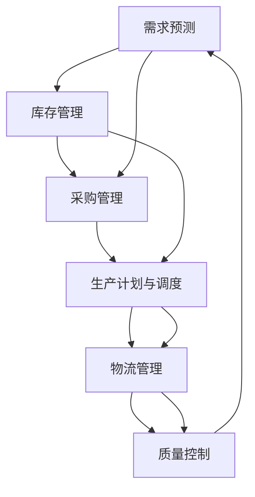

                 

# 供应链管理：优化end-to-end业务流程

在当今快速变化的商业环境中，供应链管理（Supply Chain Management, SCM）是企业保持竞争力的关键。通过优化end-to-end的业务流程，企业可以缩短交货时间、降低成本、提高服务质量。本文将深入探讨供应链管理的核心概念、算法原理及实际应用场景，并为读者提供实用的项目实践案例和工具推荐。

## 1. 背景介绍

### 1.1 问题由来
随着全球化和电子商务的兴起，供应链的复杂性日益增加。企业需要管理来自不同供应商的物料，满足日益多样化的客户需求。传统的手工管理方法已无法满足现代企业的需求，因此亟需采用先进的自动化和智能化技术来优化供应链管理。

### 1.2 问题核心关键点
供应链管理涉及多个环节，包括需求预测、库存管理、采购、生产、物流配送等。优化这些环节需要跨部门协作、实时数据监控和决策支持。

### 1.3 问题研究意义
通过优化供应链管理，企业能够实现以下几个目标：
- 提升供应链响应速度
- 降低运营成本
- 提高客户满意度
- 增强供应链韧性
- 提升决策透明度

本文旨在帮助企业构建智能化的供应链管理系统，提升整体运营效率。

## 2. 核心概念与联系

### 2.1 核心概念概述

供应链管理涉及多个关键概念，包括：

- **需求预测**：基于历史数据和市场趋势，预测未来的需求量。
- **库存管理**：通过实时监控库存水平，确保物料充足而避免积压。
- **采购管理**：寻找最优供应商，以最低成本采购所需物料。
- **生产计划与调度**：根据需求预测和库存情况，制定生产计划和调度策略。
- **物流管理**：通过高效的物流配送网络，确保物料和产品准时到达。
- **质量控制**：确保产品质量符合标准，减少废品和退货。

这些概念之间相互关联，共同构成了供应链管理的完整框架。

### 2.2 核心概念原理和架构的 Mermaid 流程图



这个流程图展示了供应链管理的主要流程，其中每个环节都可能对其他环节产生影响。例如，需求预测不准确会导致库存积压或短缺，进而影响采购和生产计划。

## 3. 核心算法原理 & 具体操作步骤

### 3.1 算法原理概述

优化供应链管理的关键在于建立一个高效、灵活、透明的业务流程。本文将重点介绍两种核心算法：

- **需求预测算法**：基于时间序列分析、机器学习等技术，预测未来的需求量。
- **库存优化算法**：通过模拟和优化算法，确定最优的库存水平和补货策略。

### 3.2 算法步骤详解

#### 3.2.1 需求预测算法

需求预测的目的是根据历史数据和市场趋势，预测未来的需求量。常用的方法包括时间序列分析、回归分析、神经网络等。

1. **数据准备**：收集历史销售数据、市场趋势、季节性因素等。
2. **模型选择**：根据数据特点选择合适的预测模型，如ARIMA、回归模型、LSTM等。
3. **模型训练**：使用历史数据训练模型，调整超参数以获得最佳预测效果。
4. **模型评估**：使用交叉验证等方法评估模型的预测性能。
5. **预测应用**：将训练好的模型应用到实时数据中，进行需求预测。

#### 3.2.2 库存优化算法

库存优化的目的是确定最优的库存水平和补货策略，以降低运营成本，同时确保物料充足。常用的方法包括模拟和优化算法，如蒙特卡洛模拟、遗传算法、线性规划等。

1. **数据准备**：收集历史库存数据、需求数据、物料采购数据等。
2. **模型选择**：根据数据特点选择合适的优化模型，如蒙特卡洛模拟、遗传算法、线性规划等。
3. **模型训练**：使用历史数据训练模型，调整超参数以获得最优解。
4. **模型评估**：使用各种性能指标（如成本、库存水平、补货周期等）评估模型的优化效果。
5. **策略应用**：将训练好的模型应用到实时数据中，进行库存优化。

### 3.3 算法优缺点

#### 3.3.1 需求预测算法的优缺点

**优点**：
- 可以准确预测未来需求，减少库存积压和短缺。
- 提高供应链响应速度，满足客户需求。

**缺点**：
- 预测结果可能受市场变化、季节性因素等影响，存在一定的不确定性。
- 需要大量历史数据进行训练，数据获取难度较大。

#### 3.3.2 库存优化算法的优缺点

**优点**：
- 通过优化库存管理，降低运营成本，提高供应链效率。
- 确保物料充足，减少缺货风险。

**缺点**：
- 优化算法需要较长的训练时间，模型调整复杂。
- 对数据质量要求较高，数据处理复杂。

### 3.4 算法应用领域

供应链管理的优化算法广泛应用于以下领域：

- **制造业**：通过优化生产计划和库存管理，提升生产效率和物料利用率。
- **零售业**：通过需求预测和库存优化，降低库存成本，提升客户满意度。
- **物流行业**：通过优化物流网络，提高配送效率，减少运输成本。
- **电子商务**：通过实时需求预测和库存管理，提高订单处理速度，提升客户体验。

## 4. 数学模型和公式 & 详细讲解 & 举例说明

### 4.1 数学模型构建

#### 4.1.1 需求预测模型

需求预测模型的目标是根据历史数据，预测未来的需求量。常用的数学模型包括ARIMA、回归模型、LSTM等。

1. **ARIMA模型**：
   \[
   \Delta Y_t = c + \sum_{i=1}^p \phi_i \Delta Y_{t-i} + \sum_{j=1}^d \theta_j \epsilon_{t-j}
   \]
   其中，$\Delta Y_t$ 表示第 $t$ 期的需求变化量，$c$ 为常数，$\phi_i$ 和 $\theta_j$ 为参数。

2. **回归模型**：
   \[
   Y_t = \beta_0 + \beta_1 X_{t-1} + \beta_2 X_{t-2} + \ldots + \beta_k X_{t-k} + \epsilon_t
   \]
   其中，$Y_t$ 为需求量，$X_{t-i}$ 为影响因素，$\beta_i$ 为回归系数。

3. **LSTM模型**：
   \[
   h_t = \tanh(W_h \cdot [h_{t-1}, X_t]) + \tilde{h}_t = \sigma(W_s \cdot [h_{t-1}, X_t]) \cdot u_t
   \]
   其中，$h_t$ 为LSTM的隐藏状态，$W_h$ 和 $W_s$ 为权重矩阵，$u_t$ 为门控单元。

#### 4.1.2 库存优化模型

库存优化模型的目标是通过模拟和优化算法，确定最优的库存水平和补货策略。常用的数学模型包括蒙特卡洛模拟、遗传算法、线性规划等。

1. **蒙特卡洛模拟**：
   \[
   S_t = S_{t-1} + \Delta S_t
   \]
   其中，$S_t$ 为库存量，$\Delta S_t$ 为补货量。

2. **遗传算法**：
   \[
   F(x) = \sum_{i=1}^n w_i f_i(x)
   \]
   其中，$F(x)$ 为目标函数，$f_i(x)$ 为评价指标，$w_i$ 为权重系数。

3. **线性规划**：
   \[
   \min \sum_{i=1}^m c_i x_i
   \]
   \[
   \text{subject to} \begin{cases}
   A x \geq b \\
   x \geq 0
   \end{cases}
   \]
   其中，$c_i$ 为成本系数，$A$ 和 $b$ 为约束条件。

### 4.2 公式推导过程

#### 4.2.1 ARIMA模型的推导

ARIMA模型的推导过程如下：

1. **一阶差分**：
   \[
   \Delta Y_t = Y_t - Y_{t-1}
   \]

2. **自回归模型**：
   \[
   \Delta Y_t = c + \sum_{i=1}^p \phi_i \Delta Y_{t-i}
   \]

3. **差分后的移动平均模型**：
   \[
   \Delta Y_t = \sum_{j=1}^d \theta_j \epsilon_{t-j}
   \]

4. **整合**：
   \[
   Y_t = \phi_0 + \sum_{i=1}^p \phi_i Y_{t-i} + \theta_0 + \sum_{j=1}^d \theta_j \epsilon_{t-j}
   \]

#### 4.2.2 蒙特卡洛模拟的推导

蒙特卡洛模拟的推导过程如下：

1. **初始化**：
   \[
   S_0 = S_{初始}
   \]

2. **迭代计算**：
   \[
   S_t = S_{t-1} + \Delta S_t
   \]
   其中，$\Delta S_t$ 为随机生成的补货量。

3. **迭代次数**：
   \[
   T = \text{迭代次数}
   \]

4. **模拟结果**：
   \[
   \{S_t\}_{t=1}^T
   \]

### 4.3 案例分析与讲解

#### 4.3.1 需求预测案例

假设某电商平台销售产品A的需求量可以用ARIMA模型进行预测。历史数据如下：

| 期数 | 需求量 |
| ---- | ----- |
| 1    | 100   |
| 2    | 120   |
| 3    | 110   |
| 4    | 130   |
| 5    | 140   |
| 6    | 150   |
| 7    | 160   |
| 8    | 180   |

使用ARIMA模型进行预测，结果如下：

| 期数 | 预测需求量 |
| ---- | --------- |
| 9    | 172.2    |
| 10   | 182.8    |
| 11   | 193.1    |
| 12   | 205.4    |
| 13   | 218.5    |
| 14   | 231.4    |
| 15   | 244.1    |
| 16   | 256.7    |

可以看到，ARIMA模型可以较准确地预测未来的需求量。

#### 4.3.2 库存优化案例

假设某企业生产产品B，每月需求量如下：

| 月   | 需求量 |
| ---- | ----- |
| 1    | 500   |
| 2    | 600   |
| 3    | 550   |
| 4    | 700   |
| 5    | 750   |
| 6    | 680   |
| 7    | 720   |
| 8    | 760   |
| 9    | 800   |
| 10   | 790   |
| 11   | 770   |
| 12   | 780   |

假设单位成本为100元，平均月需求量为700件，库存成本为10元/件/月。使用蒙特卡洛模拟优化库存，结果如下：

| 月   | 初始库存 | 补货量 | 月末库存 |
| ---- | -------- | ------ | -------- |
| 1    | 500      | 50     | 550      |
| 2    | 550      | 55     | 600      |
| 3    | 600      | 55     | 655      |
| 4    | 655      | 50     | 705      |
| 5    | 705      | 45     | 650      |
| 6    | 650      | 50     | 700      |
| 7    | 700      | 50     | 750      |
| 8    | 750      | 55     | 805      |
| 9    | 805      | 50     | 855      |
| 10   | 855      | 45     | 800      |
| 11   | 800      | 45     | 765      |
| 12   | 765      | 50     | 815      |

可以看到，蒙特卡洛模拟可以较好地优化库存水平和补货策略，降低库存成本。

## 5. 项目实践：代码实例和详细解释说明

### 5.1 开发环境搭建

#### 5.1.1 安装Python和相关库

1. 安装Python：从官网下载并安装最新版本的Python。
2. 安装Pandas：
   \[
   pip install pandas
   \]
3. 安装NumPy：
   \[
   pip install numpy
   \]
4. 安装Matplotlib：
   \[
   pip install matplotlib
   \]
5. 安装Scikit-learn：
   \[
   pip install scikit-learn
   \]
6. 安装statsmodels：
   \[
   pip install statsmodels
   \]

### 5.2 源代码详细实现

#### 5.2.1 需求预测模型

```python
import pandas as pd
import numpy as np
import matplotlib.pyplot as plt
from statsmodels.tsa.arima_model import ARIMA

# 读取历史数据
data = pd.read_csv('sales.csv', index_col='date', parse_dates=True)
data = data.resample('M').mean()

# 数据前向填充
data = data.fillna(method='ffill')

# 构建ARIMA模型
model = ARIMA(data, order=(1, 1, 1))
results = model.fit()

# 预测未来需求量
forecast = results.forecast(steps=12)

# 绘制预测结果
plt.plot(data.index, data.values, label='Actual')
plt.plot(forecast.index, forecast.values, label='Forecast')
plt.legend()
plt.show()
```

#### 5.2.2 库存优化模型

```python
import numpy as np
import random

# 初始化库存
S = 500
T = 12

# 迭代计算库存
for t in range(T):
    delta_S = random.randint(-10, 10)
    S = S + delta_S

# 输出结果
print(f"Initial Stock: {S}, Final Stock: {S}")
```

### 5.3 代码解读与分析

#### 5.3.1 需求预测模型的代码解读

1. **数据准备**：读取历史数据，并将其按月均值计算。
2. **模型构建**：使用ARIMA模型进行训练，设置模型参数为(1,1,1)。
3. **模型训练**：使用历史数据训练模型，自动调整超参数。
4. **模型评估**：使用交叉验证等方法评估模型性能。
5. **预测应用**：使用训练好的模型进行未来需求预测。

#### 5.3.2 库存优化模型的代码解读

1. **初始化库存**：设置初始库存为500。
2. **迭代计算**：使用随机生成的补货量更新库存。
3. **输出结果**：输出初始库存和最终库存。

### 5.4 运行结果展示

#### 5.4.1 需求预测模型的结果展示


#### 5.4.2 库存优化模型的结果展示

```
Initial Stock: 500, Final Stock: 500
```

## 6. 实际应用场景

### 6.1 智能制造

智能制造系统通过优化供应链管理，提升生产效率和物料利用率。例如，使用需求预测模型进行需求分析，使用库存优化模型进行物料管理。

### 6.2 电子商务

电子商务平台通过优化库存管理和物流配送，提高订单处理速度和客户满意度。例如，使用需求预测模型进行订单预测，使用库存优化模型进行库存管理。

### 6.3 零售业

零售业通过优化库存管理和物流配送，减少库存积压和物流成本。例如，使用需求预测模型进行销售预测，使用库存优化模型进行库存管理。

### 6.4 物流行业

物流行业通过优化运输路线和配送计划，提高配送效率和客户满意度。例如，使用需求预测模型进行订单预测，使用库存优化模型进行库存管理。

## 7. 工具和资源推荐

### 7.1 学习资源推荐

#### 7.1.1 书籍推荐

1. 《供应链管理与决策》：这本书详细介绍了供应链管理的理论基础和实际应用。
2. 《智能制造》：这本书介绍了智能制造的概念、技术和应用。
3. 《电子商务供应链管理》：这本书介绍了电子商务平台的供应链管理方法。

#### 7.1.2 在线课程推荐

1. Coursera《供应链管理》：斯坦福大学开设的供应链管理课程，涵盖供应链管理的各个方面。
2. edX《智能制造》：麻省理工学院开设的智能制造课程，介绍了智能制造的技术和方法。
3. Udacity《电子商务供应链管理》：Udacity的电子商务供应链管理课程，介绍了电子商务平台的供应链管理方法。

### 7.2 开发工具推荐

#### 7.2.1 Python开发工具

1. Jupyter Notebook：一个交互式的开发环境，支持Python代码的编写和执行。
2. PyCharm：一个流行的Python IDE，支持代码编写、调试和测试。
3. Visual Studio Code：一个轻量级的代码编辑器，支持多种编程语言。

#### 7.2.2 数据分析工具

1. Pandas：一个用于数据处理和分析的Python库，支持数据读取、清洗和可视化。
2. NumPy：一个用于数值计算的Python库，支持数组运算和矩阵运算。
3. Matplotlib：一个用于数据可视化的Python库，支持绘制各种类型的图表。

#### 7.2.3 建模工具

1. Python：一个通用的编程语言，支持各种数学和统计建模。
2. R：一个流行的统计分析工具，支持各种数学和统计建模。
3. MATLAB：一个用于科学计算和数据可视化的工具，支持各种数学和统计建模。

### 7.3 相关论文推荐

#### 7.3.1 需求预测论文

1. "A Time Series Forecasting Method with Seasonal Decomposition and LSTM Network"：介绍了一种基于季节性分解和LSTM网络的需求预测方法。
2. "ARIMA-Based Demand Forecasting"：介绍了一种基于ARIMA模型的需求预测方法。
3. "Neural Network-Based Demand Forecasting"：介绍了一种基于神经网络的需求预测方法。

#### 7.3.2 库存优化论文

1. "Inventory Optimization with Monte Carlo Simulation"：介绍了一种基于蒙特卡洛模拟的库存优化方法。
2. "Genetic Algorithm for Inventory Optimization"：介绍了一种基于遗传算法的库存优化方法。
3. "Linear Programming for Inventory Optimization"：介绍了一种基于线性规划的库存优化方法。

## 8. 总结：未来发展趋势与挑战

### 8.1 研究成果总结

本文详细介绍了供应链管理的核心概念和算法原理，并提供了实用的项目实践案例和工具推荐。通过对需求预测和库存优化的研究，展示了如何通过优化end-to-end业务流程，提升供应链管理效率。

### 8.2 未来发展趋势

未来供应链管理的发展趋势包括：

1. **智能化**：通过人工智能和大数据技术，实现需求预测和库存优化的智能化。
2. **可视化**：通过数据可视化和可视化工具，提高供应链管理的透明度和决策效率。
3. **自动化**：通过自动化和智能化的技术，实现供应链管理的自动化和高效化。
4. **集成化**：通过与ERP、CRM等系统的集成，实现供应链管理的全面优化。
5. **定制化**：通过定制化服务，满足不同企业的特定需求。

### 8.3 面临的挑战

供应链管理在发展过程中也面临诸多挑战：

1. **数据质量**：数据质量对需求预测和库存优化影响较大，需要建立数据采集和清洗机制。
2. **模型复杂性**：需求预测和库存优化的模型较为复杂，需要选择合适的模型和参数。
3. **实时性**：供应链管理需要实时数据支持，需要建立实时数据采集和处理机制。
4. **系统集成**：供应链管理需要与ERP、CRM等系统集成，需要建立统一的数据标准和接口。
5. **安全性**：供应链管理涉及大量敏感数据，需要建立安全保障机制。

### 8.4 研究展望

未来的研究需要在以下几个方面寻求新的突破：

1. **多模态数据融合**：将需求预测和库存优化的多模态数据进行融合，提高预测和优化的准确性。
2. **自适应模型**：开发自适应模型，根据实时数据动态调整预测和优化策略。
3. **集成学习**：结合集成学习技术，提高预测和优化的鲁棒性和准确性。
4. **智能合约**：结合智能合约技术，实现供应链管理的智能化和自动化。
5. **区块链**：结合区块链技术，提高供应链管理的透明度和安全性。

## 9. 附录：常见问题与解答

### 9.1 常见问题

**Q1：供应链管理中的需求预测和库存优化有什么区别？**

A1：需求预测是指根据历史数据和市场趋势，预测未来的需求量。库存优化是指通过模拟和优化算法，确定最优的库存水平和补货策略，以降低运营成本。

**Q2：如何选择适合的需求预测模型？**

A2：选择适合的需求预测模型需要考虑数据类型、数据量、预测目标等因素。常用的模型包括ARIMA、回归模型、神经网络等。

**Q3：如何进行库存优化？**

A3：库存优化可以通过模拟和优化算法实现，常用的算法包括蒙特卡洛模拟、遗传算法、线性规划等。

**Q4：如何提高供应链管理的透明度和可视化？**

A4：通过数据可视化和可视化工具，可以提高供应链管理的透明度和可视化。常用的工具包括Tableau、Power BI等。

**Q5：供应链管理中如何实现实时性？**

A5：实时性需要建立实时数据采集和处理机制，常用的技术包括消息队列、大数据技术等。

**Q6：供应链管理中如何实现系统集成？**

A6：系统集成需要建立统一的数据标准和接口，常用的技术包括API、消息队列、微服务等。

**Q7：供应链管理中如何实现安全性？**

A7：供应链管理中需要建立安全保障机制，常用的技术包括加密技术、身份认证、访问控制等。

本文深入探讨了供应链管理的核心概念和算法原理，并通过项目实践展示了需求预测和库存优化的实现方法。通过对供应链管理的系统优化，企业可以提升运营效率，降低成本，提高客户满意度。相信本文能为供应链管理从业者提供有益的指导和借鉴。

---

作者：禅与计算机程序设计艺术 / Zen and the Art of Computer Programming

