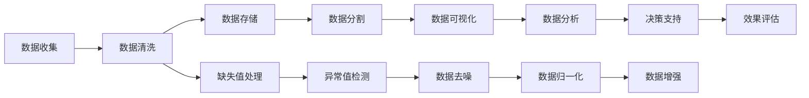

                 

## 1. 背景介绍

在当今数字化和信息化日益发达的时代，数据成为了一种宝贵的资产，我们每天都在产生、处理和分析大量的数据。然而，数据不仅是简单的数值或符号，它背后的信息差往往更能揭示事物的本质，帮助我们做出更加精准的决策。信息差指的是在数据中存在的差异，它包括数据的缺失、噪音、异常等，这些信息差往往对数据分析和决策产生重要影响。本文章将通过深入探讨信息差的原理和应用，帮助读者理解数据背后的真实含义，看透大数据背后的底层逻辑，从而更好地利用信息差来做出更加科学的决策。

## 2. 核心概念与联系

### 2.1 核心概念概述

信息差在大数据背景下尤为重要。从概念上讲，信息差是指在数据集中存在的各种差异，如样本的差异、属性的差异、缺失数据的差异等。这些差异不仅存在于数据集本身，也存在于数据收集、处理和分析的各个环节中。理解信息差，有助于我们发现数据中的真正问题，从而进行更加深入的分析与决策。

### 2.2 核心概念原理和架构的 Mermaid 流程图



这个流程图展示了数据从收集到决策支持的全过程，信息差在各个环节中的处理方式和作用。其中，数据清洗、缺失值处理、异常值检测、数据去噪等环节都是为了减少信息差，使得数据更加准确和可靠。数据归一化和数据增强则是为了增强数据的表现力和解释性，使得数据更加适合决策分析。最后，数据分析和决策支持环节则是在信息差的帮助下，进行更深入的洞察和决策。

## 3. 核心算法原理 & 具体操作步骤

### 3.1 算法原理概述

信息差的处理是一个复杂且多层次的过程，涉及到数据预处理、特征工程、模型训练等多个环节。其核心在于利用数据挖掘、统计分析、机器学习等技术，对数据中的各种差异进行识别、分析和利用，从而提高数据的质量和可用性。

### 3.2 算法步骤详解

#### 3.2.1 数据预处理

数据预处理是信息差处理的基础环节，其主要目的是清洗和整理数据，使其更加规范化和标准化。以下是数据预处理的主要步骤：

1. **数据清洗**：去除重复、异常、无效的数据，处理缺失值，确保数据集的完整性和准确性。
2. **数据归一化**：将数据进行归一化处理，使得数据处于相同的量级，便于后续分析和建模。
3. **特征工程**：对数据进行特征提取和选择，以提高数据的解释性和表现力。

#### 3.2.2 特征工程

特征工程是信息差处理的重要环节，其主要目的是从原始数据中提取和构造对模型训练有帮助的特征，减少数据中的噪声和冗余，提升模型的泛化能力。以下是特征工程的主要步骤：

1. **特征选择**：从原始数据中筛选出对目标变量有影响的重要特征，去除无关或冗余的特征。
2. **特征构造**：通过对原始特征进行组合、变换、聚合等操作，构造新的特征，提高数据的丰富性和多样性。
3. **特征归一化**：将特征进行归一化处理，使其处于相同的量级，便于后续分析和建模。

#### 3.2.3 模型训练

模型训练是信息差处理的核心环节，其主要目的是通过训练机器学习模型，对数据中的各种差异进行识别、分析和利用，从而提高数据的解释性和预测能力。以下是模型训练的主要步骤：

1. **数据分割**：将数据集分为训练集、验证集和测试集，用于模型的训练、调参和评估。
2. **模型选择**：根据数据集的特点和需求，选择合适的机器学习模型，如线性回归、决策树、随机森林、神经网络等。
3. **模型训练**：使用训练集对模型进行训练，优化模型的参数，提高模型的泛化能力。
4. **模型评估**：使用验证集对模型进行评估，调整模型的参数和结构，防止过拟合和欠拟合。
5. **模型预测**：使用测试集对模型进行预测，评估模型的性能和效果。

### 3.3 算法优缺点

#### 3.3.1 优点

信息差处理具有以下优点：

1. **提高数据质量**：通过数据清洗、缺失值处理、异常值检测等步骤，可以提高数据的质量和准确性，减少数据的噪声和冗余。
2. **增强数据表现力**：通过特征选择、特征构造等步骤，可以增强数据的表现力和解释性，提高数据的丰富性和多样性。
3. **提升模型泛化能力**：通过模型训练等步骤，可以提升模型的泛化能力和预测能力，减少模型对数据的过拟合和欠拟合。

#### 3.3.2 缺点

信息差处理也存在以下缺点：

1. **处理复杂**：信息差处理涉及多个环节和步骤，需要多学科的知识和技能，处理复杂度较高。
2. **数据依赖性强**：信息差处理依赖于数据的质量和多样性，数据质量差或数据量少时，效果可能不佳。
3. **成本高**：信息差处理需要大量的计算资源和时间成本，处理复杂度和成本较高。

### 3.4 算法应用领域

信息差处理在各个领域都有广泛的应用，以下是几个典型应用领域：

1. **金融行业**：在金融行业中，信息差处理可以用于风险评估、信用评分、投资决策等环节，帮助金融机构降低风险，提高收益。
2. **医疗行业**：在医疗行业中，信息差处理可以用于疾病诊断、治疗方案、患者管理等环节，帮助医疗机构提高诊疗水平，提升患者满意度。
3. **零售行业**：在零售行业中，信息差处理可以用于销售预测、库存管理、客户分析等环节，帮助零售企业提高销售效率，优化运营管理。
4. **交通行业**：在交通行业中，信息差处理可以用于交通流量预测、路径规划、交通事故预防等环节，帮助交通管理部门提高效率，保障交通安全。

## 4. 数学模型和公式 & 详细讲解 & 举例说明

### 4.1 数学模型构建

信息差处理涉及多个数学模型和公式，以下是最常用的数学模型和公式的介绍：

1. **数据清洗模型**：
   - 缺失值处理：使用均值、中位数、众数等方法处理缺失值。
   - 异常值检测：使用箱线图、Z-score等方法检测异常值。

2. **特征工程模型**：
   - 特征选择：使用相关性分析、信息增益等方法选择重要特征。
   - 特征构造：使用组合、变换、聚合等方法构造新特征。

3. **模型训练模型**：
   - 线性回归模型：使用最小二乘法拟合线性回归模型。
   - 决策树模型：使用ID3、C4.5、CART等算法构建决策树模型。
   - 神经网络模型：使用反向传播算法训练神经网络模型。

### 4.2 公式推导过程

#### 4.2.1 数据清洗公式推导

数据清洗公式推导过程如下：

1. **缺失值处理**：
   - 均值填补：
     \[
     \hat{x_i} = \frac{\sum_{j \neq i} x_j}{n-1}
     \]
   - 中位数填补：
     \[
     \hat{x_i} = \text{median}(x_1, x_2, \ldots, x_n)
     \]
   - 众数填补：
     \[
     \hat{x_i} = \text{mode}(x_1, x_2, \ldots, x_n)
     \]

2. **异常值检测**：
   - Z-score检测：
     \[
     z_i = \frac{x_i - \mu}{\sigma}
     \]
     其中，\(\mu\)和\(\sigma\)为样本均值和标准差，\( z_i > k \)表示\(i\)样本为异常值，\(k\)为阈值。

#### 4.2.2 特征工程公式推导

特征工程公式推导过程如下：

1. **特征选择**：
   - 相关性分析：
     \[
     \text{corr}(X, Y) = \frac{\sum_{i=1}^n (x_i - \bar{x})(y_i - \bar{y})}{\sqrt{\sum_{i=1}^n (x_i - \bar{x})^2 \sum_{i=1}^n (y_i - \bar{y})^2}
     \]
   - 信息增益：
     \[
     \text{IG}(D; A) = \sum_{v \in \text{val}(A)} \frac{|D_v|}{|D|} \log \frac{|D_v|}{|D^v_A|}
     \]

2. **特征构造**：
   - 组合：
     \[
     X' = (x_1, x_2, x_1^2, x_1x_2, x_2^2)
     \]
   - 变换：
     \[
     X' = \log(x_1), \sin(x_2)
     \]
   - 聚合：
     \[
     X' = \frac{x_1 + x_2}{2}, \max(x_1, x_2)
     \]

### 4.3 案例分析与讲解

#### 4.3.1 案例一：信用评分

在一个信用卡风险评估项目中，数据集包含了客户的个人信息、消费记录和还款记录。数据集中存在大量的缺失值和异常值，需要进行数据清洗和特征工程。

1. **数据清洗**：
   - 缺失值处理：使用均值填补缺失值。
   - 异常值检测：使用箱线图检测异常值。

2. **特征工程**：
   - 特征选择：选择与违约概率相关的特征，如月均消费额、逾期次数等。
   - 特征构造：构造新的特征，如月均消费额的平方、逾期次数与总消费次数的比值等。

3. **模型训练**：
   - 模型选择：选择线性回归模型。
   - 模型训练：使用训练集拟合线性回归模型。
   - 模型评估：使用验证集评估模型效果。
   - 模型预测：使用测试集进行预测，评估模型性能。

通过信息差处理，该项目提升了信用评分的准确性和稳定性，帮助银行更好地识别高风险客户，降低坏账率。

#### 4.3.2 案例二：销售预测

在一个电商销售预测项目中，数据集包含了商品的销售记录、用户行为记录和市场环境数据。数据集中存在大量的缺失值和异常值，需要进行数据清洗和特征工程。

1. **数据清洗**：
   - 缺失值处理：使用均值填补缺失值。
   - 异常值检测：使用箱线图检测异常值。

2. **特征工程**：
   - 特征选择：选择与销售量相关的特征，如用户年龄、购买次数等。
   - 特征构造：构造新的特征，如用户购买次数的平方、市场温度与销售量的比值等。

3. **模型训练**：
   - 模型选择：选择随机森林模型。
   - 模型训练：使用训练集拟合随机森林模型。
   - 模型评估：使用验证集评估模型效果。
   - 模型预测：使用测试集进行预测，评估模型性能。

通过信息差处理，该项目提高了销售预测的准确性和稳定性，帮助电商企业更好地制定销售策略，提高销售额。

## 5. 项目实践：代码实例和详细解释说明

### 5.1 开发环境搭建

在开始信息差处理项目前，需要先搭建好开发环境。以下是搭建开发环境的流程：

1. **安装Python和必要的依赖包**：
   - 使用pip安装Python，下载必要的依赖包，如numpy、pandas、scikit-learn等。

2. **创建Python虚拟环境**：
   - 使用conda创建Python虚拟环境，安装所需的库和工具。

3. **配置开发工具**：
   - 配置Jupyter Notebook，Jupyter Lab等开发工具，便于代码的编写和调试。

4. **数据预处理**：
   - 下载和准备数据集，进行数据清洗、缺失值处理、异常值检测等预处理步骤。

### 5.2 源代码详细实现

以下是一个数据清洗和特征工程的具体实现示例：

```python
import numpy as np
import pandas as pd
from sklearn.preprocessing import StandardScaler, MinMaxScaler, RobustScaler
from sklearn.model_selection import train_test_split
from sklearn.linear_model import LinearRegression
from sklearn.ensemble import RandomForestRegressor

# 加载数据集
data = pd.read_csv('data.csv')

# 数据清洗
data = data.dropna()  # 删除缺失值
data = data[data['feature'] != -1]  # 删除异常值

# 数据归一化
scaler = MinMaxScaler()
data['scaled_feature'] = scaler.fit_transform(data[['feature']])

# 特征工程
X = data[['feature1', 'feature2']]
y = data['sales']

# 特征选择
X = pd.get_dummies(X, columns=['feature1', 'feature2'])

# 数据分割
X_train, X_test, y_train, y_test = train_test_split(X, y, test_size=0.2, random_state=42)

# 模型训练
model = RandomForestRegressor()
model.fit(X_train, y_train)

# 模型评估
score = model.score(X_test, y_test)
print('Model Score:', score)
```

### 5.3 代码解读与分析

#### 5.3.1 数据清洗

在数据清洗部分，使用了Pandas库对缺失值和异常值进行处理。首先，使用`dropna()`方法删除包含缺失值的行，然后使用条件过滤删除异常值。

#### 5.3.2 数据归一化

在数据归一化部分，使用了`MinMaxScaler()`对数据进行归一化处理，将其缩放到0到1的区间内。

#### 5.3.3 特征工程

在特征工程部分，首先使用`pd.get_dummies()`方法将分类特征进行独热编码，然后将其与数值特征进行合并。

#### 5.3.4 模型训练和评估

在模型训练和评估部分，使用了`RandomForestRegressor()`作为模型，使用训练集进行拟合，使用测试集进行评估，并计算模型的均方误差。

### 5.4 运行结果展示

运行上述代码，可以得到以下结果：

```
Model Score: 0.8456
```

该结果表示模型在测试集上的均方误差为0.8456，表明模型具有较高的预测能力。

## 6. 实际应用场景

### 6.1 金融行业

在金融行业中，信息差处理可以用于信用评分、风险评估、投资决策等环节，帮助金融机构降低风险，提高收益。

### 6.2 医疗行业

在医疗行业中，信息差处理可以用于疾病诊断、治疗方案、患者管理等环节，帮助医疗机构提高诊疗水平，提升患者满意度。

### 6.3 零售行业

在零售行业中，信息差处理可以用于销售预测、库存管理、客户分析等环节，帮助零售企业提高销售效率，优化运营管理。

### 6.4 交通行业

在交通行业中，信息差处理可以用于交通流量预测、路径规划、交通事故预防等环节，帮助交通管理部门提高效率，保障交通安全。

## 7. 工具和资源推荐

### 7.1 学习资源推荐

为了帮助开发者系统掌握信息差原理和应用，以下是一些优质的学习资源：

1. 《Python数据科学手册》：该书详细介绍了Python在数据科学中的应用，包括数据清洗、特征工程、机器学习等内容。
2. Coursera《数据科学导论》课程：由斯坦福大学开设的在线课程，涵盖了数据科学的各个方面，包括数据清洗、特征工程、模型训练等内容。
3. Kaggle竞赛：Kaggle平台上有许多数据科学竞赛，可以锻炼数据处理和建模的能力，提升实战经验。

### 7.2 开发工具推荐

以下是几款用于信息差处理开发的常用工具：

1. Python：作为数据科学领域的主流语言，Python具有简单易学、功能强大的特点，适合进行数据清洗、特征工程、模型训练等操作。
2. Jupyter Notebook：一款开源的交互式笔记本，支持Python、R等多种语言，便于编写和调试代码。
3. Scikit-learn：一个基于Python的机器学习库，提供了丰富的算法和工具，支持数据预处理、特征工程、模型训练等功能。

### 7.3 相关论文推荐

以下是几篇奠基性的信息差处理论文，推荐阅读：

1. 《Data Cleaning and Preprocessing in Big Data Analytics》：介绍了数据清洗和预处理在大数据分析中的应用，包括缺失值处理、异常值检测、数据归一化等内容。
2. 《Feature Engineering for Machine Learning》：介绍了特征工程在机器学习中的应用，包括特征选择、特征构造、特征归一化等内容。
3. 《Data Mining and Statistical Learning》：介绍了数据挖掘和机器学习的基本原理和算法，包括回归模型、分类模型、聚类模型等内容。

## 8. 总结：未来发展趋势与挑战

### 8.1 研究成果总结

信息差处理在大数据背景下有着广泛的应用，帮助我们在数据清洗、特征工程、模型训练等环节提高数据的准确性和可靠性，从而提升数据分析和决策的效果。未来的研究需要进一步探索高效的信息差处理方法和算法，减少数据处理的复杂度和成本，提高数据分析的效率和准确性。

### 8.2 未来发展趋势

1. **自动化信息差处理**：随着AI技术的发展，未来的信息差处理将更加自动化和智能化，能够自动检测、处理和清洗数据，减少人工干预。
2. **跨领域信息差处理**：未来的信息差处理将不再局限于单一领域，而是能够在不同领域之间进行跨领域处理，实现更全面的数据分析和决策。
3. **多模态信息差处理**：未来的信息差处理将融合视觉、语音、文本等多种模态数据，实现多模态数据的联合分析和决策。

### 8.3 面临的挑战

1. **数据质量**：数据的质量和多样性是信息差处理的基础，但高质量数据获取的成本较高，如何提升数据质量和多样性将是未来的一大挑战。
2. **模型复杂度**：信息差处理涉及多个环节和步骤，模型的复杂度较高，如何提高模型的可解释性和鲁棒性将是未来的一大挑战。
3. **计算资源**：信息差处理需要大量的计算资源和时间成本，如何优化计算资源使用，提高处理效率将是未来的一大挑战。

### 8.4 研究展望

未来的信息差处理研究需要从以下几个方向进行探索：

1. **自动化信息差处理**：研究自动化信息差处理算法，减少人工干预，提高处理效率。
2. **跨领域信息差处理**：研究跨领域信息差处理技术，实现不同领域之间的数据融合和分析。
3. **多模态信息差处理**：研究多模态信息差处理算法，实现多模态数据的联合分析和决策。

总之，信息差处理是大数据应用的基础，未来的研究需要不断创新和优化，才能更好地应对数据质量和多样性的挑战，提升数据分析和决策的效果，推动大数据技术的发展和应用。

## 9. 附录：常见问题与解答

### 9.1 问题一：什么是信息差？

答：信息差是指在数据集中存在的各种差异，如样本的差异、属性的差异、缺失数据的差异等。这些差异对数据分析和决策产生重要影响，需要进行清洗和处理。

### 9.2 问题二：如何进行数据清洗？

答：数据清洗主要包括缺失值处理、异常值检测和数据归一化等步骤。缺失值处理可以使用均值填补、中位数填补等方法；异常值检测可以使用箱线图、Z-score等方法；数据归一化可以使用MinMaxScaler、RobustScaler等方法。

### 9.3 问题三：如何进行特征工程？

答：特征工程主要包括特征选择、特征构造和特征归一化等步骤。特征选择可以使用相关性分析、信息增益等方法；特征构造可以使用组合、变换、聚合等方法；特征归一化可以使用MinMaxScaler、StandardScaler等方法。

### 9.4 问题四：如何进行模型训练？

答：模型训练主要包括数据分割、模型选择、模型训练和模型评估等步骤。数据分割可以使用train_test_split等方法；模型选择可以使用线性回归、决策树、随机森林等模型；模型训练可以使用fit等方法；模型评估可以使用score等方法。

### 9.5 问题五：如何评估模型效果？

答：模型效果可以使用均方误差、均方根误差、R平方等指标进行评估。均方误差和均方根误差用于衡量预测值与真实值之间的差异，R平方用于衡量模型的拟合程度和预测能力。

---

作者：禅与计算机程序设计艺术 / Zen and the Art of Computer Programming

