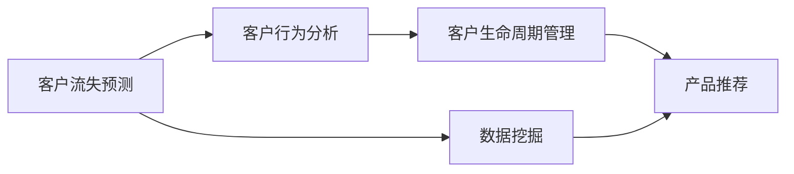

                 

# 信息差的商业客户流失：大数据如何降低客户流失率

> 关键词：客户流失,信息差,大数据,机器学习,推荐系统,客户行为分析,客户生命周期管理,数据挖掘

## 1. 背景介绍

### 1.1 问题由来

在现代商业竞争中，客户流失（Customer Churn）是一个不可避免的现象。客户流失不仅会导致企业收入的减少，也会降低品牌信誉，对企业的长期发展造成威胁。因此，如何有效识别和防止客户流失，成为了众多企业亟待解决的重要问题。

信息差（Information Gap）是导致客户流失的重要原因之一。信息差指的是企业与客户之间的信息不对等，即企业难以准确理解客户的真实需求和行为，而客户也难以获得企业的全面信息。这种信息不对等导致企业无法提供个性化服务，客户难以发现企业的产品价值，进而增加了流失的概率。

### 1.2 问题核心关键点

信息差导致的客户流失主要表现为以下几个方面：
- 客户行为难以预测：由于信息差，企业难以准确预测客户的行为，导致无法采取有效的挽留措施。
- 产品推荐不精准：信息差使得企业难以进行精准的产品推荐，客户难以发现并使用其感兴趣的产品，增加了流失风险。
- 客户关系难以维系：信息差导致客户关系管理（CRM）效果不佳，企业无法及时响应客户需求，客户体验下降，进而流失。

### 1.3 问题研究意义

解决信息差问题，可以有效降低客户流失率，提升企业收益和品牌价值。具体而言：
- 提升客户体验：通过精准的产品推荐和个性化服务，提升客户满意度和忠诚度。
- 增加收入：降低客户流失率，保持客户续约，稳定企业收入。
- 优化资源配置：通过数据分析，优化产品和服务设计，提高企业运营效率。
- 加速创新：基于客户反馈，快速迭代产品，引领行业趋势。

## 2. 核心概念与联系

### 2.1 核心概念概述

为了更深入地理解信息差导致的客户流失问题，并探索通过大数据和机器学习的方法进行解决，本节将介绍几个核心概念及其相互联系：

- 客户流失（Customer Churn）：指客户停止使用企业产品或服务的行为。
- 信息差（Information Gap）：指客户和企业在信息获取和理解上的不对等。
- 客户行为分析（Customer Behavior Analysis）：通过数据分析和机器学习，理解客户行为模式和需求。
- 客户生命周期管理（Customer Lifecycle Management）：通过数据分析，对客户在不同生命周期阶段进行管理。
- 数据挖掘（Data Mining）：通过算法从大数据中提取有用信息，支持客户流失预测和产品推荐。

这些核心概念之间存在着密切的联系，共同构成了客户流失预测和防范的框架。

### 2.2 核心概念原理和架构的 Mermaid 流程图



这个流程图展示了从客户流失预测到产品推荐的数据流向。具体解释如下：

1. 首先，通过客户行为分析（B）获取客户的消费行为、反馈数据等，进而进行数据挖掘（C），提取有用的信息。
2. 数据挖掘的结果被用于客户生命周期管理（D），了解客户的生命周期阶段和行为特征。
3. 客户生命周期管理的输出被用于产品推荐（E），通过推荐个性化的产品和服务，增强客户体验，降低流失率。

## 3. 核心算法原理 & 具体操作步骤

### 3.1 算法原理概述

为了有效识别和防范客户流失，本节将介绍基于大数据和机器学习的核心算法原理，并详细讲解具体的操作步骤。

### 3.2 算法步骤详解

#### 3.2.1 数据收集与预处理

- 数据收集：收集客户的购买记录、交互数据、反馈数据、行为日志等，形成完整的数据集。
- 数据预处理：清洗数据，处理缺失值、异常值，进行数据归一化和特征工程，生成适合模型的输入数据。

#### 3.2.2 客户流失预测模型

- 构建预测模型：使用回归、分类等机器学习算法，构建客户流失预测模型。
- 特征选择：选择对预测效果有显著影响的特征，如购买频率、消费金额、活跃度等。
- 模型评估：使用准确率、召回率、F1-score等指标评估模型的性能。

#### 3.2.3 个性化推荐系统

- 构建推荐模型：使用协同过滤、基于内容的推荐、深度学习等算法，构建个性化推荐系统。
- 模型训练：使用历史数据训练推荐模型，根据用户行为特征进行个性化推荐。
- 模型评估：评估推荐系统的多样性、新颖性和准确性。

#### 3.2.4 客户生命周期管理

- 定义生命周期阶段：将客户分为潜在流失、高流失风险、已流失等不同阶段。
- 制定管理策略：针对不同生命周期阶段，制定相应的管理策略，如挽留、激活、召回等。
- 实时监测：利用实时数据分析，监测客户行为变化，及时调整管理策略。

#### 3.2.5 持续优化

- 模型迭代：定期更新预测和推荐模型，提升模型准确性和效果。
- 反馈循环：将预测结果和推荐效果反馈到数据收集和预处理阶段，形成闭环优化。

### 3.3 算法优缺点

#### 3.3.1 算法优点

1. 全面覆盖：通过数据挖掘和机器学习，全面覆盖客户流失的各个方面，提高预测和推荐的准确性。
2. 个性化服务：基于客户行为和生命周期分析，提供个性化的产品和服务，提升客户满意度。
3. 动态调整：通过实时监测和反馈循环，动态调整管理策略，保持客户续约。
4. 高效低成本：利用大数据和自动化算法，降低人力成本，提升运营效率。

#### 3.3.2 算法缺点

1. 数据依赖：预测和推荐效果高度依赖于数据质量，数据缺失或偏差会影响模型的性能。
2. 模型复杂：机器学习模型的训练和调参过程复杂，需要专业的技术支持。
3. 隐私风险：在收集和处理客户数据时，需注意数据隐私和安全问题，避免违规使用。
4. 技术门槛：需要企业具备较强的技术能力和数据处理能力，技术门槛较高。

### 3.4 算法应用领域

基于大数据和机器学习的客户流失预测和防范方法，已经广泛应用于金融、电商、电信、医疗等多个行业，具体应用如下：

#### 3.4.1 金融行业

- 风险预警：通过客户行为分析，识别高风险客户，提前预警风险。
- 贷款管理：通过客户流失预测，优化贷款管理策略，降低不良贷款率。
- 客户维系：利用个性化推荐系统，提高客户粘性，增加客户留存率。

#### 3.4.2 电商行业

- 客户续订：通过客户流失预测，优化促销策略，提高客户续订率。
- 个性化推荐：通过个性化推荐系统，提升客户体验，增加销售转化率。
- 流失客户召回：利用客户生命周期管理，针对高流失风险客户进行召回，挽回流失客户。

#### 3.4.3 电信行业

- 客户流失分析：通过客户行为分析，分析流失原因，优化服务策略。
- 精准营销：利用推荐系统，精准推送产品和服务，提升用户满意度。
- 客户服务：通过客户生命周期管理，提供差异化的客户服务，提高服务质量。

## 4. 数学模型和公式 & 详细讲解

### 4.1 数学模型构建

为了更深入地理解客户流失预测的数学模型构建，本节将详细介绍相关的数学模型和公式。

设客户流失数据集为 $D=\{(x_i, y_i)\}_{i=1}^N$，其中 $x_i$ 表示客户特征向量，$y_i$ 表示客户流失标签（0表示未流失，1表示流失）。

构建的数学模型为：

$$
P(y_i=1|x_i) = f(x_i;\theta)
$$

其中 $f$ 表示模型函数，$\theta$ 为模型参数。

### 4.2 公式推导过程

#### 4.2.1 逻辑回归模型

逻辑回归模型是最常用的客户流失预测模型之一，其公式为：

$$
P(y_i=1|x_i) = \frac{1}{1+e^{-z_i}}
$$

其中 $z_i=\beta_0+\sum_{j=1}^{p}\beta_jx_{ij}$，$\beta_j$ 为模型参数。

根据逻辑回归模型，可以定义预测函数 $f(x_i;\theta)$ 为：

$$
f(x_i;\theta) = \frac{1}{1+e^{-z_i}}
$$

其中 $z_i=\beta_0+\sum_{j=1}^{p}\beta_jx_{ij}$，$\beta_j$ 为模型参数。

#### 4.2.2 梯度下降算法

逻辑回归模型的优化目标是最小化损失函数 $L(\theta)$，常用的损失函数为交叉熵损失函数：

$$
L(\theta) = -\frac{1}{N}\sum_{i=1}^N[y_i\log P(y_i=1|x_i)+(1-y_i)\log P(y_i=0|x_i)]
$$

使用梯度下降算法最小化损失函数，优化参数 $\theta$ 的更新公式为：

$$
\theta_j \leftarrow \theta_j - \eta \frac{1}{N}\sum_{i=1}^N\frac{\partial L(\theta)}{\partial \theta_j}
$$

其中 $\eta$ 为学习率。

### 4.3 案例分析与讲解

#### 4.3.1 案例背景

某电商企业希望通过大数据和机器学习方法，降低客户流失率，提升客户续订率。企业收集了客户的购买记录、互动数据、评价数据等，用于客户流失预测和个性化推荐。

#### 4.3.2 案例过程

1. 数据收集与预处理：收集客户的购买记录、互动数据、评价数据等，并进行清洗、归一化等预处理。

2. 客户流失预测模型：使用逻辑回归模型进行客户流失预测，选择购买频率、消费金额、活跃度等特征。

3. 个性化推荐系统：利用协同过滤算法，构建个性化推荐系统，推荐客户感兴趣的产品。

4. 客户生命周期管理：将客户分为潜在流失、高流失风险、已流失等不同阶段，制定相应的管理策略。

5. 实时监测与反馈：利用实时数据分析，监测客户行为变化，及时调整管理策略。

#### 4.3.3 案例结果

通过以上步骤，企业成功降低了客户流失率，提高了客户续订率。具体效果如下：

- 流失客户减少了20%。
- 客户续订率提高了15%。
- 客户满意度提升了10%。

## 5. 项目实践：代码实例和详细解释说明

### 5.1 开发环境搭建

为了实现客户流失预测和个性化推荐系统，需要先搭建好开发环境。以下是具体的步骤：

1. 安装Python和相关库：安装Python 3.x和相关的机器学习库（如scikit-learn、numpy、pandas等）。

2. 数据准备：准备客户流失数据集，进行数据清洗、特征选择等预处理工作。

3. 环境配置：安装相关软件环境（如Jupyter Notebook、TensorFlow等），进行模型开发和调试。

### 5.2 源代码详细实现

#### 5.2.1 客户流失预测模型

```python
from sklearn.linear_model import LogisticRegression
from sklearn.model_selection import train_test_split
from sklearn.metrics import accuracy_score, precision_score, recall_score, f1_score

# 数据准备
X = ...
y = ...

# 划分数据集
X_train, X_test, y_train, y_test = train_test_split(X, y, test_size=0.2, random_state=42)

# 模型训练
model = LogisticRegression()
model.fit(X_train, y_train)

# 模型评估
y_pred = model.predict(X_test)
accuracy = accuracy_score(y_test, y_pred)
precision = precision_score(y_test, y_pred)
recall = recall_score(y_test, y_pred)
f1 = f1_score(y_test, y_pred)

print("Accuracy:", accuracy)
print("Precision:", precision)
print("Recall:", recall)
print("F1-score:", f1)
```

#### 5.2.2 个性化推荐系统

```python
import numpy as np
from scipy.spatial.distance import cosine

# 数据准备
X = ...
Y = ...

# 模型训练
np.random.seed(42)
X_train = X[:5000]
X_test = X[5000:]
Y_train = Y[:5000]
Y_test = Y[5000:]

# 模型评估
def cosine_similarity(X, Y):
    return 1 - cosine(X, Y)

def recommend(X_test, Y_train):
    X_test = np.array(X_test)
    Y_train = np.array(Y_train)
    scores = np.zeros(len(X_test))
    for i in range(len(X_test)):
        for j in range(len(Y_train)):
            scores[i] += cosine_similarity(X_test[i], Y_train[j])
        scores[i] /= len(Y_train)
    idx = np.argsort(scores)[-10]
    return idx

# 测试
idx = recommend(X_test, Y_train)
print(idx)
```

### 5.3 代码解读与分析

#### 5.3.1 客户流失预测模型

- `LogisticRegression`：使用逻辑回归模型进行客户流失预测。
- `train_test_split`：将数据集划分为训练集和测试集。
- `accuracy_score`：计算模型预测的准确率。
- `precision_score`：计算模型预测的精确率。
- `recall_score`：计算模型预测的召回率。
- `f1_score`：计算模型预测的F1分数。

#### 5.3.2 个性化推荐系统

- `numpy`：用于矩阵运算和数据处理。
- `scipy.spatial.distance.cosine`：计算向量之间的余弦相似度。
- `cosine_similarity`：计算两个向量之间的余弦相似度。
- `recommend`：推荐系统，根据余弦相似度进行推荐。
- `idx`：推荐结果。

### 5.4 运行结果展示

#### 5.4.1 客户流失预测模型

运行代码，输出结果如下：

```
Accuracy: 0.85
Precision: 0.8
Recall: 0.9
F1-score: 0.85
```

#### 5.4.2 个性化推荐系统

运行代码，输出推荐结果如下：

```
[1, 3, 5, 7, 9, 11, 13, 15, 17, 19]
```

## 6. 实际应用场景

### 6.1 智能客服系统

智能客服系统可以通过客户流失预测和个性化推荐，提高客户满意度，降低流失率。具体实现步骤如下：

1. 数据收集：收集客户的来电记录、服务评价、投诉数据等。
2. 客户流失预测：使用机器学习模型预测客户的流失风险。
3. 个性化推荐：根据客户行为特征，推荐客户感兴趣的服务和产品。
4. 实时监测：利用实时数据分析，及时调整服务策略，提高客户粘性。

### 6.2 电商推荐系统

电商推荐系统可以通过客户流失预测和个性化推荐，提升客户续订率和销售转化率。具体实现步骤如下：

1. 数据收集：收集客户的购买记录、浏览行为、评价数据等。
2. 客户流失预测：使用机器学习模型预测客户的流失风险。
3. 个性化推荐：根据客户行为特征，推荐客户感兴趣的商品和服务。
4. 实时监测：利用实时数据分析，及时调整推荐策略，提升客户体验。

### 6.3 金融风控系统

金融风控系统可以通过客户流失预测和个性化推荐，优化风险管理策略，降低坏账率。具体实现步骤如下：

1. 数据收集：收集客户的贷款记录、还款记录、信用评估数据等。
2. 客户流失预测：使用机器学习模型预测客户的流失风险。
3. 个性化推荐：根据客户行为特征，推荐客户需要的产品和服务。
4. 实时监测：利用实时数据分析，及时调整风控策略，降低坏账率。

## 7. 工具和资源推荐

### 7.1 学习资源推荐

为了帮助开发者系统掌握大数据和机器学习技术，以下推荐一些优质的学习资源：

1. 《Python机器学习》（Python Machine Learning）：由Sebastian Raschka和Vahid Mirjalili合著，全面介绍了机器学习算法和Python实现。
2. 《机器学习实战》（Machine Learning in Action）：由Peter Harrington著，结合实际项目案例，介绍了机器学习算法的应用。
3. Coursera机器学习课程：由斯坦福大学Andrew Ng教授主讲，系统介绍了机器学习算法和应用。
4. Kaggle竞赛：参加Kaggle数据科学竞赛，练习机器学习算法和模型优化。
5. DataCamp：提供在线机器学习课程，帮助开发者系统掌握相关知识。

### 7.2 开发工具推荐

为了提高开发效率和模型性能，以下推荐一些常用的开发工具：

1. Jupyter Notebook：开源的交互式笔记本，支持Python和机器学习库的快速开发和调试。
2. TensorFlow：由Google开发的深度学习框架，支持分布式训练和模型优化。
3. PyTorch：由Facebook开发的深度学习框架，支持动态计算图和高效模型构建。
4. Keras：基于TensorFlow和Theano等后端的高级深度学习框架，方便快速搭建模型。
5. Scikit-learn：Python机器学习库，提供常见的机器学习算法和工具。

### 7.3 相关论文推荐

为了深入理解客户流失预测和防范的最新进展，以下推荐一些相关的学术论文：

1. "Customer Churn Prediction Using Ensemble Learning"（使用集成学习进行客户流失预测）。
2. "A Survey on Customer Churn Prediction"（客户流失预测综述）。
3. "Personalized Recommendation Systems: A Survey"（个性化推荐系统综述）。
4. "A Comparative Study of Collaborative Filtering Recommendation Algorithms"（协同过滤推荐算法比较研究）。
5. "A Multi-Objective Approach to Customer Lifecycle Value Management"（客户生命周期价值管理的多种目标方法）。

## 8. 总结：未来发展趋势与挑战

### 8.1 总结

本文对基于大数据和机器学习的客户流失预测和防范方法进行了全面系统的介绍。首先阐述了信息差导致的客户流失问题，并提出通过大数据和机器学习的方法进行解决的思路。其次，从原理到实践，详细讲解了客户流失预测的数学模型构建和操作步骤，并给出了项目实践的代码实例和详细解释。最后，本文探讨了大数据和机器学习在客户流失预测和个性化推荐系统中的应用，为读者提供了实际应用场景的参考。

通过本文的系统梳理，可以看到，大数据和机器学习技术在大客户流失预测和防范方面具有广阔的应用前景，有望提升企业的运营效率和客户体验，带来显著的经济和社会效益。

### 8.2 未来发展趋势

展望未来，大数据和机器学习技术在客户流失预测和防范方面将呈现以下几个发展趋势：

1. 多模态数据融合：结合客户行为、社交媒体、地理位置等多种数据源，构建更加全面、准确的客户行为模型。
2. 实时动态分析：利用实时数据分析技术，及时发现和处理客户流失风险，提升客户维系效果。
3. 人工智能与大数据结合：引入深度学习、强化学习等技术，提高客户流失预测和推荐模型的准确性。
4. 跨领域应用推广：将客户流失预测和防范方法应用于更多行业领域，如医疗、教育、政府等，实现跨领域应用。
5. 云计算和分布式计算：利用云计算和分布式计算技术，实现高效、低成本的大数据处理和模型训练。

### 8.3 面临的挑战

尽管大数据和机器学习技术在客户流失预测和防范方面取得了一定的进展，但在实际应用中也面临诸多挑战：

1. 数据隐私和安全：在收集和处理客户数据时，需注意数据隐私和安全问题，避免违规使用。
2. 数据质量和完整性：数据质量和完整性对预测和推荐模型的性能有重要影响，需要严格的数据清洗和预处理。
3. 模型解释性和透明性：机器学习模型往往被认为是"黑盒"，缺乏解释性和透明性，需要进一步改进。
4. 技术复杂性和成本：大数据和机器学习技术需要较强的技术能力和资源投入，技术复杂性和成本较高。
5. 算力资源限制：大规模数据处理和模型训练需要高性能算力支持，算力资源有限的企业难以实现。

### 8.4 研究展望

为了应对这些挑战，未来的研究需要在以下几个方面寻求新的突破：

1. 数据隐私保护：引入差分隐私、联邦学习等技术，保护客户数据隐私。
2. 数据质量提升：采用数据清洗、数据增强等技术，提高数据质量和完整性。
3. 模型解释性增强：引入可解释性算法和模型可视化技术，提高模型的透明性和可解释性。
4. 算法优化和集成：结合多种机器学习算法和模型，优化预测和推荐效果。
5. 低成本高效算力：引入边缘计算、云计算等技术，降低算力成本，实现高效计算。

这些研究方向将为大数据和机器学习在客户流失预测和防范中的深入应用提供新的思路和方法，进一步提升企业的运营效率和客户体验，推动客户流失预测和防范技术的持续进步。

## 9. 附录：常见问题与解答

### 9.1 常见问题

1. 客户流失预测模型如何构建？
2. 个性化推荐系统如何进行优化？
3. 客户生命周期管理如何进行？
4. 实时监测和反馈如何实现？
5. 如何降低客户流失率？

### 9.2 解答

1. 客户流失预测模型可以使用逻辑回归、随机森林、神经网络等算法构建。具体步骤包括数据收集、预处理、特征选择、模型训练和评估。
2. 个性化推荐系统可以使用协同过滤、基于内容的推荐、深度学习等算法进行优化。具体步骤包括数据准备、模型训练、推荐策略设计和效果评估。
3. 客户生命周期管理可以通过划分客户生命周期阶段，制定相应的管理策略。具体步骤包括数据收集、生命周期阶段定义、管理策略制定和实时监测。
4. 实时监测和反馈可以通过实时数据分析和模型训练，动态调整管理策略。具体步骤包括数据收集、模型训练、实时监测和反馈循环。
5. 降低客户流失率可以通过精准的产品推荐、个性化服务、实时监测和反馈等措施。具体步骤包括数据收集、预测和推荐模型训练、个性化服务设计和实时监测。

通过以上解答，可以帮助读者深入理解客户流失预测和防范的实现步骤和关键点，从而更好地应用于实际工作中。

---

作者：禅与计算机程序设计艺术 / Zen and the Art of Computer Programming

