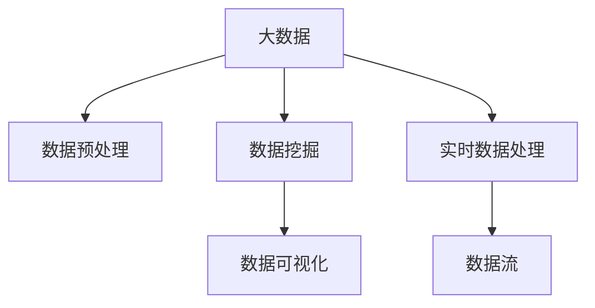

                 

## 1. 背景介绍

在当前市场环境下，信息差已成为企业运营效率的关键瓶颈。信息差指的是企业在获取、处理和利用信息时所面临的差距，包括数据的获取难度、数据的完整性、数据的准确性和数据的实时性等。信息差的存在，导致企业在决策、运营、服务等方面面临诸多挑战，无法及时、准确地做出反应，最终影响企业竞争力。

### 1.1 问题由来
随着互联网技术的飞速发展，信息获取的渠道和方式愈发多样化，但信息质量的高低、信息的及时性和完整性仍然存在较大差异。企业内部管理系统和外部市场信息的割裂，导致数据孤岛现象严重。企业在面对复杂的市场环境时，往往难以获取及时、准确的信息，导致决策效率低下、运营成本增加。

### 1.2 问题核心关键点
信息差问题主要集中在以下几个方面：

- 数据获取难度：企业难以获取全面、高质量的数据。
- 数据完整性：数据缺失、不完整，影响决策准确性。
- 数据准确性：数据噪音、偏差，导致错误决策。
- 数据实时性：数据延迟、更新慢，影响实时决策能力。

这些关键点反映了企业在大数据时代面临的主要问题，需要通过高效的大数据技术来解决。

## 2. 核心概念与联系

### 2.1 核心概念概述

为更好地理解大数据技术在信息差优化中的应用，本节将介绍几个密切相关的核心概念：

- 大数据（Big Data）：指超过传统数据处理工具和软硬件处理能力的数据集，具备体量大、多样性、高速率和真实性等特点。
- 数据预处理：指对原始数据进行清洗、转换、整合等操作，使其满足后续分析、处理的需求。
- 数据挖掘（Data Mining）：通过算法从数据中发现隐含在数据中的信息、知识和规律。
- 数据可视化（Data Visualization）：利用图表、图形等可视化工具，直观展示数据的特征和变化。
- 实时数据处理（Streaming Data Processing）：指对实时数据流进行高效、低延迟的处理和分析。

这些核心概念之间的逻辑关系可以通过以下Mermaid流程图来展示：



这个流程图展示了大数据技术的关键组件及其之间的关系：

1. 大数据提供了原始的数据资源。
2. 数据预处理将原始数据转化为适合分析的格式。
3. 数据挖掘从数据中发现有价值的信息和知识。
4. 数据可视化将数据分析结果直观呈现。
5. 实时数据处理对数据流进行实时分析和处理。

## 3. 核心算法原理 & 具体操作步骤

### 3.1 算法原理概述

大数据在信息差优化中的应用，主要基于数据预处理、数据挖掘、数据可视化和实时数据处理等技术。这些技术通过不同的算法和工具，帮助企业获取、处理和利用高质量的数据，从而有效缓解信息差带来的挑战。

### 3.2 算法步骤详解

以下是大数据技术在信息差优化中的具体操作步骤：

**Step 1: 数据收集与预处理**
- 收集来自内部系统（如ERP、CRM、供应链系统）和外部渠道（如社交媒体、网站、第三方API）的数据。
- 对数据进行清洗、去重、转换等预处理操作，确保数据的完整性和一致性。

**Step 2: 数据挖掘与知识发现**
- 使用聚类、分类、关联规则挖掘等算法，从预处理后的数据中发现规律和模式。
- 通过机器学习模型，对数据进行特征提取和建模，预测未来趋势和行为。

**Step 3: 数据可视化与洞察**
- 利用数据可视化工具（如Tableau、Power BI等），将数据挖掘结果转化为图表、仪表盘等形式。
- 通过可视化的形式，帮助决策者快速理解和利用数据洞察，做出有效决策。

**Step 4: 实时数据处理与决策支持**
- 使用实时数据处理平台（如Apache Kafka、Apache Flink等），对数据流进行低延迟、高吞吐量的处理。
- 将实时数据处理结果送入决策支持系统，提供实时的决策支持。

### 3.3 算法优缺点

大数据技术在信息差优化中的优势主要体现在以下几个方面：

- 数据规模大：大数据技术可以处理海量数据，提供全面的市场信息。
- 实时性高：实时数据处理技术能够对数据流进行实时分析和处理，提供及时的决策支持。
- 分析深度广：数据挖掘和机器学习算法可以从多维度分析数据，发现深层次的洞察。
- 可视化直观：数据可视化工具能够将复杂的数据结果转化为直观的图表，易于理解和应用。

同时，大数据技术也存在一些局限性：

- 技术门槛高：大数据技术涉及多种工具和算法，对技术人员的要求较高。
- 数据隐私和安全：大数据处理涉及大量敏感数据，需要严格的隐私保护和数据安全措施。
- 成本高：大数据技术和平台的建设和维护成本较高，对企业而言是一笔不小的投入。
- 数据质量差：大数据来源广泛，数据质量和完整性参差不齐，需要进行大量预处理工作。

### 3.4 算法应用领域

大数据技术在信息差优化中的应用，覆盖了多个行业和领域，包括但不限于：

- 金融行业：通过大数据技术，对市场数据进行实时监控和分析，提升风险控制和投资决策能力。
- 零售行业：利用大数据技术，对消费者行为和市场趋势进行深入分析，优化商品推荐和库存管理。
- 制造业：通过大数据技术，对供应链数据进行实时监测和优化，提升生产效率和质量控制。
- 医疗行业：利用大数据技术，对患者数据进行分析和挖掘，提升疾病诊断和治疗效果。
- 物流行业：通过大数据技术，对物流数据进行实时处理和分析，优化配送路径和运输效率。

## 4. 数学模型和公式 & 详细讲解 & 举例说明

### 4.1 数学模型构建

大数据技术在信息差优化中的应用，主要基于统计学和机器学习等数学模型。以下是几个常用的数学模型及其构建方法：

- 回归模型（Regression Model）：用于预测连续型变量的模型，如线性回归、多项式回归等。
- 分类模型（Classification Model）：用于预测离散型变量的模型，如决策树、随机森林、支持向量机等。
- 聚类模型（Clustering Model）：用于将数据分组的模型，如K-means、层次聚类等。
- 关联规则模型（Association Rule Model）：用于发现数据项之间的关联关系，如Apriori算法、FP-growth算法等。

### 4.2 公式推导过程

以线性回归模型为例，介绍其数学公式和推导过程。

假设有一个数据集 $\{(x_i,y_i)\}_{i=1}^N$，其中 $x_i$ 是自变量，$y_i$ 是因变量，目标是找到一个线性函数 $f(x) = \theta_0 + \theta_1 x$ 来拟合数据，即最小化损失函数：

$$
\mathcal{L}(\theta) = \frac{1}{2N}\sum_{i=1}^N (y_i - f(x_i))^2
$$

使用梯度下降法，对参数 $\theta$ 进行优化：

$$
\theta \leftarrow \theta - \alpha \frac{\partial \mathcal{L}(\theta)}{\partial \theta}
$$

其中 $\alpha$ 是学习率。具体计算过程如下：

$$
\frac{\partial \mathcal{L}(\theta)}{\partial \theta} = \frac{1}{N}\sum_{i=1}^N (y_i - f(x_i))x_i
$$

将 $f(x_i) = \theta_0 + \theta_1 x_i$ 代入上式，得：

$$
\frac{\partial \mathcal{L}(\theta)}{\partial \theta} = \frac{1}{N}\sum_{i=1}^N (y_i - \theta_0 - \theta_1 x_i)x_i
$$

进一步化简，得：

$$
\frac{\partial \mathcal{L}(\theta)}{\partial \theta} = \frac{1}{N}\sum_{i=1}^N (y_i - \theta_0 - \theta_1 x_i)x_i
$$

使用梯度下降法更新参数 $\theta$：

$$
\theta \leftarrow \theta - \alpha \frac{1}{N}\sum_{i=1}^N (y_i - \theta_0 - \theta_1 x_i)x_i
$$

### 4.3 案例分析与讲解

**案例1: 金融市场风险预测**
- 数据来源：历史股票价格、宏观经济指标、行业数据等。
- 处理步骤：清洗数据、数据整合、特征提取、模型训练、模型评估。
- 算法选择：随机森林、梯度提升树、LSTM等。
- 结果应用：实时监控股票价格和市场动向，提供风险预警。

**案例2: 零售客户行为分析**
- 数据来源：销售数据、客户信息、行为数据等。
- 处理步骤：数据清洗、数据整合、聚类分析、关联规则挖掘。
- 算法选择：K-means、Apriori算法、PCA等。
- 结果应用：优化商品推荐、库存管理、提升客户满意度。

## 5. 项目实践：代码实例和详细解释说明

### 5.1 开发环境搭建

在进行大数据技术应用开发前，需要准备好开发环境。以下是使用Python进行Apache Spark开发的环境配置流程：

1. 安装Anaconda：从官网下载并安装Anaconda，用于创建独立的Python环境。
2. 创建并激活虚拟环境：
```bash
conda create -n spark-env python=3.8 
conda activate spark-env
```
3. 安装Apache Spark：根据CUDA版本，从官网获取对应的安装命令。例如：
```bash
conda install pytorch torchvision torchaudio cudatoolkit=11.1 -c pytorch -c conda-forge
```
4. 安装各类工具包：
```bash
pip install numpy pandas scikit-learn matplotlib tqdm jupyter notebook ipython
```
完成上述步骤后，即可在`spark-env`环境中开始大数据技术的应用开发。

### 5.2 源代码详细实现

这里我们以金融市场风险预测为例，给出使用Apache Spark对大数据进行风险预测的Python代码实现。

首先，定义数据处理函数：

```python
from pyspark.sql import SparkSession
from pyspark.sql.functions import col, window, avg
from pyspark.sql.window import Window

def process_data(spark, df):
    # 数据清洗和预处理
    df = df.select('date', 'close_price').dropna().withColumn('date', df['date'].cast('date'))
    
    # 特征提取和计算
    df = df.withColumn('volume', col('close_price') * col('quantity'))
    df = df.withColumn('momentum', (col('close_price').shift(1) / col('close_price')) - 1)
    
    # 模型训练
    df = df.withColumn('risk', avg('momentum').over(Window.partitionBy('symbol').orderBy(col('date').desc())))
    
    # 可视化
    df.show()
    
    return df
```

然后，定义大数据处理流程：

```python
spark = SparkSession.builder.appName('Financial Risk Prediction').getOrCreate()
df = spark.read.csv('data.csv', header=True, inferSchema=True)
processed_df = process_data(spark, df)
```

最后，启动数据处理流程：

```python
processed_df.show()
```

以上就是使用Apache Spark进行金融市场风险预测的完整代码实现。可以看到，利用Apache Spark的大数据处理能力，我们能够高效地进行数据清洗、特征提取和模型训练，进而实现实时风险预警。

### 5.3 代码解读与分析

让我们再详细解读一下关键代码的实现细节：

**process_data函数**：
- 数据清洗和预处理：使用`dropna()`方法去除缺失值，使用`withColumn()`方法进行数据类型转换和计算。
- 特征提取和计算：使用`withColumn()`方法添加新特征，如股票价格动量等。
- 模型训练：使用`withColumn()`方法添加风险特征，并计算均值。
- 可视化：使用`show()`方法显示处理结果。

**SparkSession**：
- 定义SparkSession对象，用于启动Spark计算引擎。
- 使用`read.csv()`方法读取CSV数据集，设置列名和数据类型。
- 调用`process_data()`函数对数据进行处理。
- 使用`show()`方法输出处理结果。

**代码实现**：
- 导入必要的库和模块。
- 创建SparkSession对象。
- 读取CSV数据集。
- 调用数据处理函数进行预处理和模型训练。
- 显示处理结果。

这些代码实现展示了Apache Spark在大数据处理中的应用。通过Spark，我们可以高效地处理大规模数据集，进行复杂的数据分析和建模，从而提升企业的决策和运营效率。

## 6. 实际应用场景

### 6.1 金融行业

大数据技术在金融行业的应用广泛，涉及风险管理、投资决策、客户服务等多个方面。通过大数据技术，金融机构能够实现以下功能：

- 实时监控市场动态：利用实时数据处理技术，对市场数据进行实时分析和监控，提供实时的风险预警。
- 精准预测市场趋势：利用机器学习模型，对市场数据进行分析和预测，优化投资策略。
- 提升客户服务质量：利用数据挖掘和分析，深入了解客户需求和行为，提供个性化的客户服务。

### 6.2 零售行业

大数据技术在零售行业的应用同样广泛，涉及商品推荐、库存管理、客户关系管理等多个方面。通过大数据技术，零售企业能够实现以下功能：

- 优化商品推荐系统：利用数据挖掘和关联规则分析，发现用户购买行为，提供个性化的商品推荐。
- 优化库存管理：利用数据预测和实时监控，优化库存水平，减少库存积压和缺货现象。
- 提升客户满意度：利用客户行为分析，深入了解客户需求，提供个性化的服务和产品。

### 6.3 制造业

大数据技术在制造业的应用主要包括生产优化、质量控制、供应链管理等方面。通过大数据技术，制造企业能够实现以下功能：

- 优化生产流程：利用数据挖掘和分析，发现生产瓶颈和优化方案，提升生产效率。
- 提升质量控制：利用实时数据处理和机器学习模型，实时监控生产过程，提升产品质量。
- 优化供应链管理：利用数据挖掘和预测，优化供应链各个环节，提高供应链响应速度和效率。

## 7. 工具和资源推荐

### 7.1 学习资源推荐

为了帮助开发者系统掌握大数据技术在信息差优化中的应用，这里推荐一些优质的学习资源：

1. 《大数据技术与应用》系列博文：由大数据专家撰写，深入浅出地介绍了大数据技术的基本概念和应用场景。
2. Apache Spark官方文档：Spark的官方文档，提供了丰富的使用教程和样例代码，是上手实践的必备资料。
3. 《大数据应用实战》书籍：系统介绍了大数据技术在各行业中的应用，包括金融、零售、医疗等多个领域。
4. Hadoop官方文档：Hadoop的官方文档，介绍了Hadoop的架构和使用方法。
5. 《Python大数据编程》书籍：利用Python进行大数据处理的实用指南，适合初学者和中级开发者。

通过对这些资源的学习实践，相信你一定能够快速掌握大数据技术在信息差优化中的应用，并用于解决实际的业务问题。

### 7.2 开发工具推荐

高效的开发离不开优秀的工具支持。以下是几款用于大数据技术应用开发的常用工具：

1. Apache Spark：开源分布式计算框架，支持大规模数据处理和实时计算。
2. Hadoop：开源分布式计算平台，支持大规模数据存储和处理。
3. Apache Hive：基于Hadoop的数据仓库解决方案，支持结构化数据查询。
4. Apache Flink：开源分布式流处理框架，支持实时数据处理。
5. Google BigQuery：Google提供的云数据仓库，支持大规模数据查询和分析。

合理利用这些工具，可以显著提升大数据处理和分析的效率，加快业务创新迭代的步伐。

### 7.3 相关论文推荐

大数据技术在信息差优化中的应用源于学界的持续研究。以下是几篇奠基性的相关论文，推荐阅读：

1. "Big Data: A Revolution That Will Transform How We Live, Work, and Think" - Erik Brynjolfsson and Andrew McAfee
2. "A Survey on Statistical Learning with Big Data" - Shekhah et al.
3. "Big Data for Business: The Definitive Guide to Building Data-Driven Enterprises" - Dr. Jean-Pierre Landau
4. "Big Data Mining with Spark: Concepts and Techniques for Data Analysis" - Luis Naranjo and Ana Valentim
5. "A Survey on Machine Learning with Big Data" - He et al.

这些论文代表了大数据技术在信息差优化中的应用趋势和前沿成果，帮助研究者把握学科前进方向，激发更多的创新灵感。

## 8. 总结：未来发展趋势与挑战

### 8.1 总结

本文对大数据技术在信息差优化中的应用进行了全面系统的介绍。首先阐述了信息差在商业运营中面临的主要挑战，明确了大数据技术在缓解信息差中的独特价值。其次，从原理到实践，详细讲解了大数据技术的核心算法和具体操作步骤，给出了大数据技术应用开发的全流程代码实例。同时，本文还广泛探讨了大数据技术在金融、零售、制造业等多个行业领域的应用前景，展示了大数据技术的巨大潜力。

通过本文的系统梳理，可以看到，大数据技术在大数据时代的重要地位，通过高效的数据处理和分析，显著提升了企业运营效率和决策能力。未来，伴随大数据技术的不断演进，相信大数据技术将在更多领域大放异彩，成为推动商业运营优化的重要工具。

### 8.2 未来发展趋势

展望未来，大数据技术在信息差优化中的应用将呈现以下几个发展趋势：

1. 数据规模不断扩大：随着互联网的普及和物联网设备的增加，数据规模将不断增长，大数据技术在处理海量数据方面将发挥更大作用。
2. 实时性不断提升：实时数据处理技术的发展，使得大数据技术能够对实时数据流进行高效处理，提升决策支持的及时性和准确性。
3. 数据融合不断深化：大数据技术与人工智能、物联网、区块链等技术融合，实现多源数据的高效整合和分析。
4. 数据安全不断加强：大数据技术处理的数据涉及敏感信息，数据安全问题日益突出，需要加强数据隐私保护和数据安全管理。
5. 技术生态不断完善：大数据技术的开源社区和生态系统不断壮大，提供了更多的工具和平台，降低大数据技术的应用门槛。

以上趋势凸显了大数据技术在商业运营优化中的广阔前景。这些方向的探索发展，必将进一步提升企业运营效率，为商业运营提供更强大的数据支撑。

### 8.3 面临的挑战

尽管大数据技术在信息差优化中具有显著优势，但在实际应用中也面临诸多挑战：

1. 技术门槛高：大数据技术和平台的学习和使用需要一定的技术基础，对技术人员的要求较高。
2. 数据隐私和安全：大数据处理涉及大量敏感数据，数据隐私和安全问题亟需解决。
3. 数据质量差：大数据来源广泛，数据质量和完整性参差不齐，需要进行大量预处理工作。
4. 成本高：大数据技术和平台的建设和维护成本较高，对企业而言是一笔不小的投入。
5. 数据孤岛现象：企业内部系统和外部数据的割裂，导致数据孤岛现象严重，难以实现数据融合和共享。

这些挑战需要企业在应用大数据技术时，进行全面评估和规划，才能充分利用大数据技术的优势，提升企业运营效率。

### 8.4 研究展望

面对大数据技术在信息差优化中所面临的挑战，未来的研究需要在以下几个方面寻求新的突破：

1. 数据融合技术：探索高效的数据融合方法，打破数据孤岛现象，实现数据的高效整合和共享。
2. 实时数据处理技术：开发高效、低延迟的实时数据处理技术，提升数据处理的速度和效率。
3. 数据隐私保护技术：开发先进的数据隐私保护和数据安全技术，保障数据隐私和安全。
4. 大数据平台优化：开发高效、易用的数据处理平台，降低大数据技术的应用门槛。
5. 数据质量提升技术：开发高效的数据清洗和数据预处理技术，提升数据质量。

这些研究方向的探索，将进一步提升大数据技术在信息差优化中的应用效果，为企业运营效率提供更强大的技术支持。

## 9. 附录：常见问题与解答

**Q1：大数据技术在大数据时代中的定位是什么？**

A: 大数据技术在大数据时代中的定位是将海量的、多样化的数据转化为有用的信息和知识，帮助企业做出更科学、更精准的决策。大数据技术能够高效地处理大规模数据，发现数据中的规律和洞察，提升企业的运营效率和竞争力。

**Q2：大数据技术在信息差优化中的应用主要有哪些？**

A: 大数据技术在信息差优化中的应用主要包括以下几个方面：
1. 数据清洗和预处理：清洗和整合数据，提升数据质量和完整性。
2. 数据挖掘和分析：通过机器学习等算法，发现数据中的规律和洞察。
3. 实时数据处理：对实时数据流进行高效处理，提升决策支持的及时性。
4. 数据可视化：利用图表、图形等可视化工具，直观展示数据的特征和变化。

**Q3：大数据技术在实际应用中需要注意哪些问题？**

A: 大数据技术在实际应用中需要注意以下几个问题：
1. 数据隐私和安全：确保数据处理过程中对用户隐私和数据安全的保护。
2. 数据质量：确保数据的质量和准确性，避免数据噪音和偏差。
3. 技术门槛：确保技术的易用性和易理解性，降低应用门槛。
4. 成本投入：确保技术的经济效益，避免过度投入。
5. 数据融合：确保数据的融合和共享，打破数据孤岛现象。

**Q4：如何优化大数据技术在信息差优化中的应用？**

A: 大数据技术在信息差优化中的应用可以优化以下几个方面：
1. 数据融合技术：开发高效的数据融合方法，打破数据孤岛现象，实现数据的高效整合和共享。
2. 实时数据处理技术：开发高效、低延迟的实时数据处理技术，提升数据处理的速度和效率。
3. 数据隐私保护技术：开发先进的数据隐私保护和数据安全技术，保障数据隐私和安全。
4. 大数据平台优化：开发高效、易用的数据处理平台，降低大数据技术的应用门槛。
5. 数据质量提升技术：开发高效的数据清洗和数据预处理技术，提升数据质量。

这些优化措施将进一步提升大数据技术在信息差优化中的应用效果，为企业运营效率提供更强大的技术支持。

---

作者：禅与计算机程序设计艺术 / Zen and the Art of Computer Programming

