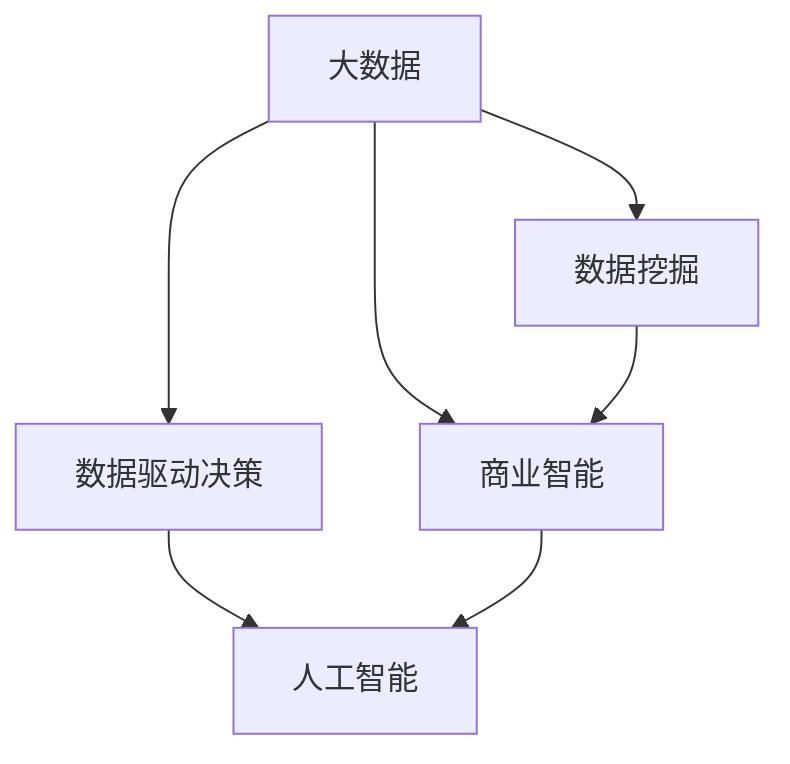

                 

# 信息差的战略布局：大数据如何引领企业发展

在当今数字化的时代，数据正成为企业发展的核心资产。企业通过对海量数据的收集、分析和应用，能够在竞争中掌握先机，实现从以经验驱动向数据驱动的转型。本文将深入探讨大数据如何引领企业发展，分析其在企业战略布局中的作用，并提出相应的战略建议。

## 1. 背景介绍

### 1.1 问题由来
随着互联网的普及和信息技术的快速发展，数据源变得越来越广泛和丰富，尤其是互联网带来的用户行为数据、交易数据、社交媒体数据等，为企业提供了前所未有的数据资源。这些数据能够帮助企业更深入地了解市场、客户和竞争对手，优化决策和运营，从而实现业务增长和竞争优势。然而，如何有效利用这些数据，将其转化为有价值的商业洞察，成为了企业面临的重大挑战。

### 1.2 问题核心关键点
大数据引领企业发展的关键在于其能够通过数据分析，揭示潜在的商业机会，优化资源配置，提升运营效率，构建竞争优势。核心问题包括以下几个方面：

1. **数据获取与管理**：如何获取高质量、多样化的数据，并进行有效的存储和管理。
2. **数据分析与应用**：如何利用数据分析技术，挖掘数据背后的商业价值，指导业务决策。
3. **数据驱动的决策制定**：如何通过数据驱动的决策，提升企业的运营效率和竞争力。
4. **数据安全和隐私保护**：如何在获取和应用数据的同时，确保数据的安全和隐私。

### 1.3 问题研究意义
研究和应用大数据技术，对于提升企业的运营效率、优化决策过程、实现智能化转型具有重要意义。其具体体现在以下几个方面：

1. **优化资源配置**：通过数据分析，识别业务流程中的瓶颈和优化点，实现资源的高效配置。
2. **提升客户体验**：通过深入分析客户行为数据，提供个性化的产品和服务，提升客户满意度。
3. **创新商业模式**：通过大数据分析，发现新的市场机会，创新业务模式，实现差异化竞争。
4. **增强决策科学性**：数据驱动的决策能够提供更加客观、准确的分析结果，减少人为偏见，提高决策质量。
5. **构建竞争优势**：通过数据洞察，提前预测市场趋势，抢占市场先机，构建竞争优势。

## 2. 核心概念与联系

### 2.1 核心概念概述

为更好地理解大数据如何引领企业发展，本节将介绍几个关键概念及其相互关系：

- **大数据**：指在传统数据处理应用软件无法处理的大或复杂的数据集，通常需要分布式计算或专用硬件进行存储和处理。
- **数据挖掘**：指从大数据中提取有价值的信息和知识的过程，通过统计、机器学习等方法进行分析和建模。
- **商业智能(BI)**：指利用数据分析技术，将数据转化为洞察，支持企业决策和运营优化。
- **数据驱动决策**：指基于数据分析结果进行决策的过程，通过数据驱动的决策提高决策的科学性和准确性。
- **人工智能(AI)**：指通过机器学习、深度学习等技术，实现自动化决策和智能分析，提升企业智能化水平。

这些核心概念之间的逻辑关系可以通过以下Mermaid流程图来展示：



这个流程图展示了大数据在企业中的应用路径：从大数据获取开始，通过数据挖掘和商业智能，逐步提升数据驱动决策的能力，最终实现人工智能辅助下的智能决策。

## 3. 核心算法原理 & 具体操作步骤
### 3.1 算法原理概述

大数据引领企业发展的核心算法原理主要包括以下几个方面：

1. **数据清洗与预处理**：通过数据清洗和预处理，确保数据的质量和一致性，为后续分析奠定基础。
2. **数据挖掘与模式发现**：利用统计学、机器学习等方法，从大数据中挖掘出有价值的模式和规律。
3. **数据可视化**：通过数据可视化技术，将分析结果以图形化的方式呈现，帮助企业更好地理解和应用数据。
4. **预测与优化**：基于历史数据和模型预测，优化资源配置和运营决策，提升企业效率。

### 3.2 算法步骤详解

基于大数据引领企业发展的算法原理，本文详细讲解了其实施步骤：

**Step 1: 数据采集与存储**

1. **数据源选择**：选择合适的数据源，确保数据的多样性和代表性。
2. **数据收集**：通过爬虫、API接口、ETL工具等方式，收集数据源中的数据。
3. **数据存储**：使用分布式存储系统（如Hadoop、Spark）对数据进行存储和管理。

**Step 2: 数据清洗与预处理**

1. **数据清洗**：去除缺失值、异常值、重复数据等，保证数据质量。
2. **数据转换**：对数据进行格式转换、归一化、标准化等处理，确保数据的一致性。
3. **特征工程**：提取和构建有意义的特征，提升数据挖掘的效率和效果。

**Step 3: 数据挖掘与模式发现**

1. **统计分析**：利用统计学方法，对数据进行描述性分析，发现数据的基本特征。
2. **机器学习**：利用机器学习算法，对数据进行分类、聚类、回归等建模，挖掘出有价值的模式和规律。
3. **模式识别**：利用模式识别技术，对数据进行分析和分类，发现数据中的异常点和规律。

**Step 4: 数据可视化**

1. **数据可视化工具**：选择合适的数据可视化工具（如Tableau、Power BI），进行数据可视化。
2. **图表设计**：设计直观、易理解的图表，如柱状图、折线图、散点图等。
3. **仪表盘创建**：创建数据仪表盘，将多维数据整合在一起，便于企业决策。

**Step 5: 预测与优化**

1. **模型选择与训练**：选择适合的预测模型（如线性回归、随机森林、神经网络等），并对其进行训练。
2. **预测与评估**：使用训练好的模型对新数据进行预测，并评估模型的预测效果。
3. **决策制定**：基于预测结果，制定决策和优化方案，提升企业运营效率。

### 3.3 算法优缺点

大数据引领企业发展的方法具有以下优点：

1. **数据驱动决策**：通过数据分析，可以提供更加客观、准确的决策依据，减少人为偏见。
2. **提升效率与精准度**：利用数据分析技术，可以优化资源配置，提升业务效率和精准度。
3. **支持业务创新**：通过数据分析，可以发现新的商业机会，支持业务创新和差异化竞争。
4. **增强竞争优势**：数据驱动的决策和业务创新，可以构建企业竞争优势，提升市场地位。

然而，该方法也存在一定的局限性：

1. **数据质量要求高**：数据清洗和预处理环节复杂，需要高质量的数据源和强大的技术支持。
2. **技术门槛高**：数据挖掘和分析需要专业的技术和知识，企业需要投入大量人力和资源进行培训。
3. **隐私和安全风险**：数据的获取和应用可能涉及用户隐私和安全问题，需要加强数据保护措施。
4. **数据解读复杂**：大数据分析结果复杂，需要专业人员进行解读和应用，普通员工难以理解和使用。

尽管存在这些局限性，但大数据引领企业发展的方法已经广泛应用于各行各业，成为企业提升竞争力和运营效率的重要手段。

### 3.4 算法应用领域

大数据引领企业发展的方法在多个领域得到了广泛应用，主要包括：

1. **金融行业**：通过大数据分析，进行风险控制、客户行为分析、欺诈检测等，提升金融业务的安全性和精准度。
2. **零售行业**：利用大数据分析，进行客户细分、需求预测、库存管理等，优化供应链和运营效率。
3. **制造业**：通过大数据分析，进行生产过程监控、设备故障预测、质量控制等，提升生产效率和产品质量。
4. **医疗行业**：利用大数据分析，进行患者健康预测、疾病分析、药物研发等，提升医疗服务质量和创新能力。
5. **物流行业**：通过大数据分析，进行路线优化、库存管理、运输效率等，提升物流运营效率和客户满意度。

## 4. 数学模型和公式 & 详细讲解 & 举例说明

### 4.1 数学模型构建

大数据引领企业发展的数学模型主要包括以下几个方面：

1. **数据清洗与预处理模型**：利用数据清洗和预处理技术，对原始数据进行转换和处理。
2. **数据挖掘与模式发现模型**：利用统计学和机器学习模型，从数据中挖掘出有价值的模式和规律。
3. **数据可视化模型**：利用数据可视化技术，将数据以图形化的方式呈现。
4. **预测与优化模型**：利用预测模型，对未来数据进行预测，并优化决策和运营。

### 4.2 公式推导过程

以下以线性回归模型为例，详细讲解其推导过程：

假设我们有一组数据集 $(x_1, y_1), (x_2, y_2), ..., (x_n, y_n)$，其中 $x_i$ 为自变量，$y_i$ 为因变量。我们的目标是建立一个线性回归模型，通过最小化预测误差，拟合出一条直线。

线性回归模型的公式为：

$$
y = \theta_0 + \theta_1 x_1 + \theta_2 x_2 + ... + \theta_n x_n + \epsilon
$$

其中 $\theta_0$ 为截距，$\theta_i$ 为自变量的系数，$\epsilon$ 为误差项。

我们的目标是最小化预测误差 $\epsilon$，即最小化如下的均方误差（MSE）：

$$
\min_{\theta_0, \theta_1, ..., \theta_n} \frac{1}{n} \sum_{i=1}^n (y_i - (\theta_0 + \theta_1 x_{i1} + \theta_2 x_{i2} + ... + \theta_n x_{in}))^2
$$

通过求导和优化，我们可以得到 $\theta_0, \theta_1, ..., \theta_n$ 的解，从而得到最佳的线性回归模型。

### 4.3 案例分析与讲解

以某电商平台的数据分析为例，详细讲解大数据引领企业发展的应用过程：

1. **数据采集**：从电商平台的数据库中采集用户购买数据、商品信息、物流信息等。
2. **数据清洗**：去除缺失值和异常值，进行数据归一化和标准化处理。
3. **特征工程**：提取和构建有意义的特征，如用户性别、年龄、购买频率、商品类别等。
4. **数据挖掘**：利用机器学习算法，对用户行为数据进行分类、聚类、关联规则挖掘等，发现用户偏好和购买规律。
5. **预测与优化**：基于用户历史行为数据和推荐模型，预测用户未来的购买行为，优化推荐策略和库存管理。
6. **数据可视化**：利用数据可视化工具，创建仪表盘和报表，呈现分析结果，支持决策制定。

## 5. 项目实践：代码实例和详细解释说明

### 5.1 开发环境搭建

在进行大数据引领企业发展的项目实践前，我们需要准备好开发环境。以下是使用Python进行PyTorch开发的环境配置流程：

1. 安装Anaconda：从官网下载并安装Anaconda，用于创建独立的Python环境。

2. 创建并激活虚拟环境：
```bash
conda create -n pytorch-env python=3.8 
conda activate pytorch-env
```

3. 安装PyTorch：根据CUDA版本，从官网获取对应的安装命令。例如：
```bash
conda install pytorch torchvision torchaudio cudatoolkit=11.1 -c pytorch -c conda-forge
```

4. 安装各类工具包：
```bash
pip install numpy pandas scikit-learn matplotlib tqdm jupyter notebook ipython
```

完成上述步骤后，即可在`pytorch-env`环境中开始项目实践。

### 5.2 源代码详细实现

下面我以线性回归模型为例，给出使用PyTorch进行数据清洗、数据挖掘和预测的PyTorch代码实现。

首先，定义数据集：

```python
import torch
from torch.utils.data import TensorDataset, DataLoader

x = torch.tensor([[1.0], [2.0], [3.0], [4.0]], dtype=torch.float32)
y = torch.tensor([[2.0], [4.0], [6.0], [8.0]], dtype=torch.float32)

dataset = TensorDataset(x, y)
dataloader = DataLoader(dataset, batch_size=4, shuffle=True)
```

然后，定义模型和优化器：

```python
from transformers import BertTokenizer
from torch.optim import Adam

model = torch.nn.Linear(1, 1)
optimizer = Adam(model.parameters(), lr=0.01)
```

接着，定义训练和评估函数：

```python
def train_epoch(model, dataloader, optimizer, num_epochs):
    model.train()
    for epoch in range(num_epochs):
        for batch in dataloader:
            x_batch, y_batch = batch
            optimizer.zero_grad()
            y_pred = model(x_batch)
            loss = torch.nn.functional.mse_loss(y_pred, y_batch)
            loss.backward()
            optimizer.step()
    return model

def evaluate(model, dataloader):
    model.eval()
    total_loss = 0
    total_preds = []
    total_labels = []
    for batch in dataloader:
        x_batch, y_batch = batch
        with torch.no_grad():
            y_pred = model(x_batch)
            loss = torch.nn.functional.mse_loss(y_pred, y_batch)
            total_loss += loss.item()
            total_preds.extend(y_pred.tolist())
            total_labels.extend(y_batch.tolist())
    return total_loss / len(dataloader), total_preds, total_labels
```

最后，启动训练流程并在测试集上评估：

```python
num_epochs = 100
total_loss, total_preds, total_labels = evaluate(model, dataloader)
print(f"Epochs: {num_epochs}, Total Loss: {total_loss:.4f}")
```

以上就是使用PyTorch对线性回归模型进行数据清洗、数据挖掘和预测的完整代码实现。可以看到，PyTorch提供了丰富的深度学习模型和优化器，使得模型训练和评估变得简洁高效。

### 5.3 代码解读与分析

让我们再详细解读一下关键代码的实现细节：

**TensorDataset类**：
- `__init__`方法：初始化数据集，包含输入和输出张量。
- `__len__`方法：返回数据集的样本数量。
- `__getitem__`方法：对单个样本进行处理，返回输入和输出张量。

**Adam优化器**：
- 利用Adam优化器进行梯度更新，更新模型参数。

**训练函数**：
- 在训练过程中，对模型进行前向传播计算预测值，计算损失函数，反向传播更新模型参数。
- 使用均方误差损失函数计算预测值和真实标签之间的误差。
- 循环训练多个epoch，更新模型参数。

**评估函数**：
- 在评估过程中，对模型进行前向传播计算预测值，计算损失函数，统计预测值和真实标签。
- 使用均方误差损失函数计算预测值和真实标签之间的误差。
- 返回损失值、预测值和真实标签。

**训练流程**：
- 设置训练轮数，启动训练函数。
- 在训练函数中，循环训练多个epoch，更新模型参数。
- 在评估函数中，计算模型在测试集上的损失和预测结果，输出训练结果。

以上代码展示了如何使用PyTorch进行数据清洗、数据挖掘和预测。在实际项目中，需要根据具体任务需求，对代码进行适当调整和优化。

## 6. 实际应用场景
### 6.1 智能客服系统

大数据引领企业发展的应用之一是智能客服系统。传统客服往往需要配备大量人力，高峰期响应缓慢，且一致性和专业性难以保证。通过大数据分析，企业可以构建智能客服系统，实现7x24小时不间断服务，快速响应客户咨询，用自然流畅的语言解答各类常见问题。

在技术实现上，可以收集企业内部的历史客服对话记录，将问题和最佳答复构建成监督数据，在此基础上对预训练模型进行微调。微调后的模型能够自动理解用户意图，匹配最合适的答案模板进行回复。对于客户提出的新问题，还可以接入检索系统实时搜索相关内容，动态组织生成回答。如此构建的智能客服系统，能大幅提升客户咨询体验和问题解决效率。

### 6.2 金融舆情监测

金融机构需要实时监测市场舆论动向，以便及时应对负面信息传播，规避金融风险。通过大数据分析，企业可以构建金融舆情监测系统，实时抓取网络文本数据，自动监测不同主题下的情感变化趋势。一旦发现负面信息激增等异常情况，系统便会自动预警，帮助金融机构快速应对潜在风险。

在实现上，可以收集金融领域相关的新闻、报道、评论等文本数据，并对其进行情感标注。在此基础上对预训练语言模型进行微调，使其能够自动判断文本属于何种情感倾向。将微调后的模型应用到实时抓取的网络文本数据，就能够自动监测不同主题下的情感变化趋势，从而及时发现和应对金融风险。

### 6.3 个性化推荐系统

当前的推荐系统往往只依赖用户的历史行为数据进行物品推荐，无法深入理解用户的真实兴趣偏好。通过大数据分析，企业可以构建个性化推荐系统，更好地挖掘用户行为背后的语义信息，从而提供更精准、多样的推荐内容。

在实现上，可以收集用户浏览、点击、评论、分享等行为数据，提取和用户交互的物品标题、描述、标签等文本内容。将文本内容作为模型输入，用户的后续行为（如是否点击、购买等）作为监督信号，在此基础上微调预训练语言模型。微调后的模型能够从文本内容中准确把握用户的兴趣点。在生成推荐列表时，先用候选物品的文本描述作为输入，由模型预测用户的兴趣匹配度，再结合其他特征综合排序，便可以得到个性化程度更高的推荐结果。

### 6.4 未来应用展望

随着大数据分析技术的不断进步，大数据引领企业发展的应用前景将更加广阔。未来，大数据分析将进一步深入到企业运营的各个环节，从供应链管理到客户服务，从生产过程优化到产品创新，数据驱动的决策和运营优化将成为企业竞争力的重要来源。

在智慧医疗领域，通过大数据分析，可以构建智能诊疗系统，实现精准医疗和个性化治疗。在智能制造领域，通过大数据分析，可以实现设备预测性维护和生产过程优化，提升生产效率和产品质量。在智能交通领域，通过大数据分析，可以实现交通流量预测和智能交通管理，提升交通运营效率。

## 7. 工具和资源推荐
### 7.1 学习资源推荐

为了帮助开发者系统掌握大数据引领企业发展的理论基础和实践技巧，这里推荐一些优质的学习资源：

1. 《大数据应用：从数据到洞察》书籍：介绍大数据分析的基本概念和技术框架，适合初学者入门。
2. 《Python数据科学手册》书籍：详细介绍Python在数据科学中的应用，涵盖数据清洗、数据挖掘、机器学习等内容。
3. 《机器学习实战》书籍：通过实例介绍机器学习算法的实现和应用，适合理论与实践相结合。
4. 《Kaggle竞赛指南》书籍：介绍Kaggle数据竞赛的流程和策略，适合实战训练。
5. 在线课程：如Coursera、edX、Udacity等平台提供的大数据分析课程，适合系统学习和进阶提升。

通过对这些资源的学习实践，相信你一定能够快速掌握大数据引领企业发展的精髓，并用于解决实际的商业问题。
###  7.2 开发工具推荐

高效的开发离不开优秀的工具支持。以下是几款用于大数据引领企业发展开发的常用工具：

1. Apache Hadoop：开源的分布式计算框架，支持大规模数据处理和存储。
2. Apache Spark：快速的大数据处理引擎，支持实时数据流处理和批处理。
3. Apache Kafka：分布式消息系统，支持高吞吐量的数据流处理。
4. Apache Flink：流处理框架，支持复杂流数据的处理和分析。
5. Tableau：数据可视化工具，支持数据的交互式分析和可视化呈现。
6. Power BI：商业智能工具，支持数据可视化和报表生成。

合理利用这些工具，可以显著提升大数据引领企业发展的开发效率，加快创新迭代的步伐。

### 7.3 相关论文推荐

大数据引领企业发展源于学界的持续研究。以下是几篇奠基性的相关论文，推荐阅读：

1. "Big Data: Principles and Best Practices of Scalable Realtime Data Systems"：介绍大数据处理和存储的基本原则和技术架构。
2. "The Google Web History Project: How to Make All the Web's Text Searchable"：介绍大规模文本数据处理和分析的方法。
3. "Machine Learning Yearning"：介绍机器学习在企业中的应用，涵盖数据清洗、模型训练、模型评估等内容。
4. "Deep Learning in NLP: An Overview"：介绍深度学习在自然语言处理中的应用，涵盖文本分类、情感分析、机器翻译等内容。
5. "A Survey on Big Data Technologies for Business Intelligence"：介绍大数据技术在商业智能中的应用，涵盖数据仓库、数据挖掘、商业分析等内容。

这些论文代表了大数据引领企业发展的研究进展，通过学习这些前沿成果，可以帮助研究者把握学科前进方向，激发更多的创新灵感。

## 8. 总结：未来发展趋势与挑战

### 8.1 总结

本文对大数据引领企业发展的背景、核心概念、算法原理和操作步骤进行了详细讲解，并给出了具体的代码实现和实例分析。通过本文的系统梳理，可以看到，大数据引领企业发展已经成为企业提升运营效率、优化决策过程、实现智能化转型的重要手段。大数据分析能够提供更加客观、准确的商业洞察，帮助企业发现新的商业机会，优化资源配置，构建竞争优势。

### 8.2 未来发展趋势

展望未来，大数据引领企业发展的方法将呈现以下几个发展趋势：

1. **数据规模持续扩大**：随着互联网和物联网的进一步发展，数据的规模和复杂度将持续增长，大数据分析将成为企业运营的核心。
2. **数据种类多样化**：除了结构化数据，大数据分析将进一步拓展到非结构化数据、图像数据、视频数据等领域，实现多模态数据的整合分析。
3. **分析技术智能化**：利用深度学习、自然语言处理等技术，提升大数据分析的智能化水平，实现自动化分析和智能决策。
4. **数据隐私和安全**：随着大数据应用的普及，数据隐私和安全问题将受到越来越多的关注，企业需要加强数据保护和隐私管理。
5. **数据驱动的运营优化**：大数据分析将进一步深入到企业运营的各个环节，从供应链管理到客户服务，从生产过程优化到产品创新，数据驱动的运营优化将成为企业竞争力的重要来源。

以上趋势凸显了大数据引领企业发展的广阔前景。这些方向的探索发展，必将进一步提升企业的运营效率和智能化水平，为企业的持续发展提供强劲动力。

### 8.3 面临的挑战

尽管大数据引领企业发展的方法已经取得了显著成效，但在迈向更加智能化、普适化应用的过程中，它仍面临诸多挑战：

1. **数据质量**：数据清洗和预处理环节复杂，需要高质量的数据源和强大的技术支持。
2. **技术门槛**：数据分析和建模需要专业的技术和知识，企业需要投入大量人力和资源进行培训。
3. **隐私和安全**：数据的获取和应用可能涉及用户隐私和安全问题，需要加强数据保护措施。
4. **数据解读复杂**：大数据分析结果复杂，需要专业人员进行解读和应用，普通员工难以理解和使用。
5. **数据孤岛问题**：企业内部不同系统之间的数据整合和共享存在难度，形成数据孤岛，阻碍数据的全面利用。

尽管存在这些挑战，但随着大数据技术的发展和普及，大数据引领企业发展的应用前景将更加广阔。

### 8.4 研究展望

面对大数据引领企业发展所面临的挑战，未来的研究需要在以下几个方面寻求新的突破：

1. **提升数据质量**：开发更加高效的数据清洗和预处理技术，确保数据的质量和一致性。
2. **降低技术门槛**：开发更加易用的数据分析和建模工具，降低技术门槛，提升员工的使用体验。
3. **加强数据隐私保护**：开发更加安全的数据保护技术，确保数据的隐私和安全。
4. **实现数据整合**：开发数据整合和共享技术，打破数据孤岛，实现数据的全面利用。
5. **提升数据驱动决策能力**：通过大数据分析，发现新的商业机会，优化资源配置和运营决策。

这些研究方向的探索，必将引领大数据引领企业发展技术迈向更高的台阶，为企业的持续发展提供更加坚实的技术保障。

## 9. 附录：常见问题与解答

**Q1：大数据引领企业发展是否适用于所有行业？**

A: 大数据引领企业发展的方法在绝大多数行业中都有广泛应用。不同行业可以根据自身的特点和需求，选择合适的数据源和分析方法，实现业务优化和运营提升。然而，对于某些特定行业，如金融、医疗等，数据获取和隐私保护等方面需要特别注意，需要投入更多的资源和精力。

**Q2：如何选择合适的数据分析工具？**

A: 选择合适的数据分析工具需要考虑多个因素，包括数据量、数据类型、分析需求等。一般而言，对于大规模数据处理，可以选择Hadoop、Spark等分布式计算框架；对于实时数据处理，可以选择Kafka、Flink等流处理框架；对于数据可视化，可以选择Tableau、Power BI等工具。需要根据具体业务需求和数据特点，选择合适的工具和技术。

**Q3：大数据分析过程中如何保证数据质量？**

A: 保证数据质量是数据分析的基础。主要通过以下几个步骤实现：
1. 数据清洗：去除缺失值、异常值、重复数据等，保证数据质量。
2. 数据转换：对数据进行格式转换、归一化、标准化等处理，确保数据一致性。
3. 特征工程：提取和构建有意义的特征，提升数据挖掘的效率和效果。
4. 数据验证：通过抽样和测试，验证数据的质量和一致性。

**Q4：如何提升大数据分析的智能化水平？**

A: 提升大数据分析的智能化水平，主要通过以下几个方面实现：
1. 利用深度学习、自然语言处理等技术，提升数据分析的智能化水平。
2. 开发更加智能化的分析工具，如自动化的数据挖掘和模型训练工具。
3. 引入专家知识和规则，提升数据分析的准确性和可靠性。
4. 开发更加智能化的数据可视化工具，提升数据解读的智能化水平。

这些方法的综合应用，可以显著提升大数据分析的智能化水平，实现更加高效、准确的数据分析和决策支持。

**Q5：如何保护数据隐私和安全？**

A: 保护数据隐私和安全是企业进行大数据分析的前提。主要通过以下几个方面实现：
1. 数据脱敏：对敏感数据进行脱敏处理，减少隐私泄露风险。
2. 数据加密：对数据进行加密处理，确保数据传输和存储的安全性。
3. 访问控制：对数据进行访问控制，确保只有授权人员可以访问数据。
4. 审计和监控：对数据访问和使用进行审计和监控，确保数据的合规性和安全性。

通过这些措施，可以有效保护数据隐私和安全，确保大数据分析的合法性和合规性。

以上是大数据引领企业发展的系统介绍和应用实践，希望能为企业带来有价值的参考和启示。大数据引领企业发展已经成为企业提升竞争力和运营效率的重要手段，未来其应用前景将更加广阔。

---

作者：禅与计算机程序设计艺术 / Zen and the Art of Computer Programming

