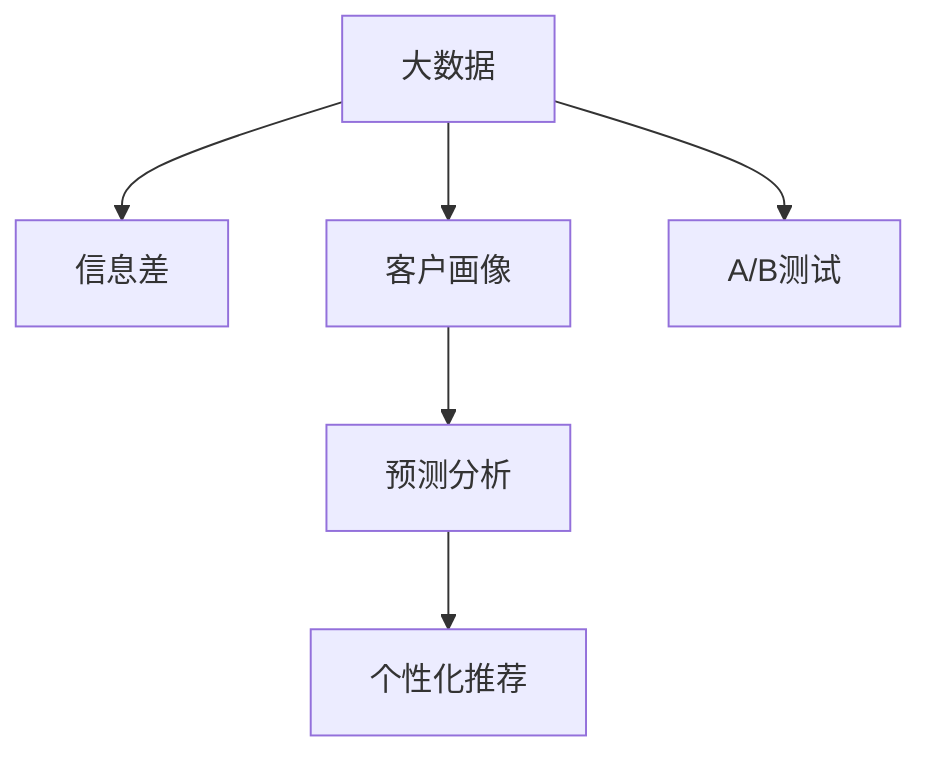

                 

# 信息差的营销革命：大数据如何重塑营销策略

> 关键词：大数据, 信息差, 营销策略, 客户画像, 预测分析, 个性化推荐, A/B测试

## 1. 背景介绍

### 1.1 问题由来
随着互联网的普及和信息技术的飞速发展，企业面临着前所未有的信息爆炸和数据过载。在传统营销模式中，企业往往依赖直觉和经验，缺乏对用户行为的深入理解。但在大数据时代，企业可以通过数据挖掘、用户画像等技术手段，洞察用户需求，实现更精准、更高效的营销。信息差的营销革命，就是通过挖掘信息差，获取数据驱动的营销洞察，从而优化营销策略，提升转化率和经济效益。

### 1.2 问题核心关键点
信息差的营销革命，关键在于数据驱动的决策支持。通过分析用户行为数据，构建详细的用户画像，挖掘用户行为特征，预测用户需求，从而制定针对性的营销策略。具体核心关键点包括：

1. **数据采集**：获取全面的用户行为数据，包括浏览记录、购买历史、社交媒体互动等。
2. **用户画像**：基于用户行为数据，构建详尽的用户画像，描述用户的基本属性、兴趣偏好、购买行为等。
3. **预测分析**：利用机器学习模型预测用户行为，包括购买意愿、流失风险等。
4. **个性化推荐**：根据用户画像和预测结果，提供个性化的产品推荐和营销信息。
5. **A/B测试**：通过实验对比，优化营销策略，提升广告效果和ROI。

## 2. 核心概念与联系

### 2.1 核心概念概述

为更好地理解信息差的营销革命，本节将介绍几个密切相关的核心概念：

- **大数据 (Big Data)**：指的是体量大、类型多、价值密度低的海量数据集合。通过大数据分析，企业可以从中挖掘有价值的信息，指导决策。

- **信息差 (Information Gap)**：指的是用户在寻找和获取信息时，面临的信息不对称现象。信息差的存在，导致了用户的决策偏差，也为企业提供了营销机遇。

- **客户画像 (Customer Persona)**：基于用户数据构建的详细用户描述，包括人口统计学信息、行为习惯、兴趣偏好等。

- **预测分析 (Predictive Analysis)**：通过数据分析和建模，预测用户未来的行为和需求，辅助决策制定。

- **个性化推荐 (Personalized Recommendation)**：根据用户行为数据，为用户提供定制化的产品推荐和营销内容。

- **A/B测试 (A/B Testing)**：通过对比两个或多个营销策略的效果，确定最优策略。

这些核心概念之间的逻辑关系可以通过以下Mermaid流程图来展示：



这个流程图展示了大数据、信息差、客户画像、预测分析、个性化推荐、A/B测试等概念之间的关系：

1. 大数据通过数据采集和存储，为信息差、客户画像、预测分析等提供数据支持。
2. 信息差揭示了用户需求的未知性和复杂性，为个性化推荐和A/B测试提供了方向。
3. 客户画像是基于大数据的分析结果，描述了用户的特征和行为，为预测分析和个性化推荐提供依据。
4. 预测分析利用客户画像和行为数据，预测用户需求和行为，辅助营销决策。
5. 个性化推荐通过分析用户画像和预测结果，提供定制化的产品推荐，提升用户满意度。
6. A/B测试通过对比不同策略的效果，优化营销方案，提升广告效果和ROI。

这些概念共同构成了大数据驱动的营销框架，为企业提供了全面的决策支持。

## 3. 核心算法原理 & 具体操作步骤
### 3.1 算法原理概述

信息差的营销革命，本质上是通过数据分析挖掘用户需求，利用信息差实现个性化营销的过程。其核心思想是：通过大数据分析，构建详尽的客户画像，预测用户需求，并针对信息差设计个性化的营销策略，从而提升转化率和经济效益。

具体而言，假设企业已获取了用户的行为数据 $D=\{(x_i,y_i)\}_{i=1}^N$，其中 $x_i$ 为用户的属性特征，$y_i$ 为用户的购买行为或意向。目标是构建客户画像 $P$，利用预测模型 $M$ 预测用户未来行为 $y$，并通过推荐算法 $R$ 提供个性化推荐，最后通过A/B测试 $T$ 优化营销策略。

信息差营销的算法流程如下：

1. 数据预处理：清洗、归一化、特征工程等数据处理步骤。
2. 客户画像构建：基于用户行为数据，构建详尽的客户画像。
3. 预测模型训练：使用机器学习算法训练预测模型，预测用户未来的行为。
4. 个性化推荐：根据用户画像和预测结果，生成个性化推荐。
5. A/B测试：对比不同营销策略的效果，选择最优策略。
6. 迭代优化：根据A/B测试结果，不断优化预测模型和推荐算法。

### 3.2 算法步骤详解

信息差营销的算法步骤如下：

**Step 1: 数据采集与预处理**

- 收集全面的用户行为数据，包括浏览记录、购买历史、社交媒体互动等。
- 数据清洗：处理缺失值、异常值、重复记录等。
- 特征工程：提取、选择、组合特征，构建详尽的特征集。

**Step 2: 客户画像构建**

- 对用户行为数据进行聚类和降维，获得用户的行为特征。
- 根据行为特征，构建详尽的客户画像，描述用户的基本属性、兴趣偏好、购买行为等。

**Step 3: 预测模型训练**

- 选择合适的机器学习算法，如逻辑回归、决策树、随机森林、神经网络等。
- 将客户画像和历史行为数据作为输入，训练预测模型，预测用户未来的行为，如购买意向、流失风险等。
- 评估模型的性能，使用交叉验证、ROC曲线等方法，选择最优模型。

**Step 4: 个性化推荐**

- 将预测模型和客户画像结合起来，生成个性化的产品推荐和营销信息。
- 使用协同过滤、内容推荐、基于规则的推荐等算法，提高推荐效果。

**Step 5: A/B测试**

- 设计两个或多个营销策略，如不同版本的广告文案、不同渠道的广告投放等。
- 随机将用户分配到不同策略组，收集用户的反应数据。
- 使用统计学方法评估不同策略的效果，选择最优策略。

**Step 6: 迭代优化**

- 根据A/B测试结果，不断优化预测模型和推荐算法。
- 定期更新客户画像和行为数据，确保模型和推荐策略的有效性。

### 3.3 算法优缺点

信息差营销的算法具有以下优点：

1. **精度高**：通过分析用户行为数据，构建详尽的客户画像和预测模型，实现高精度的用户需求预测。
2. **个性化强**：根据用户画像和预测结果，提供个性化的推荐和营销信息，提升用户满意度。
3. **效果显著**：利用信息差，优化营销策略，显著提升广告效果和ROI。
4. **可扩展性好**：可以应用于多种营销场景，如电商、社交媒体、线下活动等。

同时，该算法也存在以下缺点：

1. **数据依赖性强**：对数据质量、完整性要求高，数据采集和清洗成本高。
2. **模型复杂度高**：需要构建详尽的客户画像，训练复杂的预测模型，计算资源消耗大。
3. **隐私风险**：用户行为数据的采集和使用可能涉及隐私问题，需要严格的数据保护措施。
4. **技术门槛高**：需要掌握数据分析、机器学习、推荐算法等技术，对技术团队要求高。

尽管存在这些局限性，但就目前而言，信息差营销的算法仍然是大数据驱动营销的重要范式。未来相关研究的重点在于如何进一步降低数据依赖，提高模型的可解释性和鲁棒性，同时兼顾隐私保护和用户满意度。

### 3.4 算法应用领域

信息差营销的算法在以下领域中得到了广泛应用：

- **电商推荐**：根据用户浏览记录和购买历史，生成个性化的产品推荐，提升转化率。
- **社交媒体广告**：分析用户的社交行为和兴趣偏好，提供定向的广告投放，提升广告效果。
- **内容推荐**：利用用户的历史阅读和互动数据，提供个性化的内容推荐，增强用户粘性。
- **用户流失预测**：分析用户行为数据，预测用户流失风险，采取挽留措施，提升客户保留率。
- **个性化营销活动**：设计定制化的营销活动，提升用户的参与度和满意度。

除了这些应用外，信息差营销的算法还被创新性地应用于更多场景中，如智能客服、客户细分、个性化推送等，为企业带来了显著的效益提升。

## 4. 数学模型和公式 & 详细讲解 & 举例说明

### 4.1 数学模型构建

本节将使用数学语言对信息差营销的算法进行更加严格的刻画。

假设企业已获取用户的行为数据 $D=\{(x_i,y_i)\}_{i=1}^N$，其中 $x_i$ 为用户的属性特征，$y_i$ 为用户的购买行为或意向。

目标构建客户画像 $P$，利用预测模型 $M$ 预测用户未来的行为 $y$，并通过推荐算法 $R$ 提供个性化推荐，最后通过A/B测试 $T$ 优化营销策略。

### 4.2 公式推导过程

以下我们以电商推荐系统为例，推导客户画像、预测模型和个性化推荐的具体数学模型。

**客户画像构建**：

- 对用户行为数据进行聚类和降维，获得用户的行为特征 $F=\{x_{ij}\}_{j=1}^M$，其中 $M$ 为用户数，$N$ 为特征数。
- 根据行为特征，构建详尽的客户画像 $P$，描述用户的基本属性、兴趣偏好、购买行为等。

**预测模型训练**：

- 使用逻辑回归模型 $M=\log\sigma(\mathbf{W}x+\mathbf{b})$，其中 $\sigma$ 为Sigmoid函数，$\mathbf{W}$ 和 $\mathbf{b}$ 为模型参数。
- 将客户画像 $P$ 和历史行为数据 $D$ 作为输入，训练预测模型 $M$，预测用户未来的行为 $y$。
- 使用交叉验证、ROC曲线等方法，评估模型的性能，选择最优模型。

**个性化推荐**：

- 使用协同过滤算法 $R$，生成个性化的产品推荐。
- 协同过滤算法基于用户之间的相似度，推荐相似用户喜欢的产品。
- 例如，可以使用基于用户的协同过滤算法 $R_{user\_based}$，计算用户之间的相似度 $S_{uv}=\cos\theta(U_x,V_x)$，其中 $U_x$ 和 $V_x$ 为用户 $u$ 和 $v$ 的行为特征，$\theta$ 为夹角余弦。

### 4.3 案例分析与讲解

假设某电商平台收集了用户的浏览记录和购买历史，用于推荐系统。具体步骤如下：

1. **数据预处理**：清洗数据，处理缺失值和异常值。
2. **特征工程**：提取用户的历史浏览记录、搜索记录、点击记录等特征。
3. **客户画像构建**：使用K-Means聚类算法，将用户分为若干个行为相似的用户群体，每个群体作为一个客户画像。
4. **预测模型训练**：使用逻辑回归模型，训练预测模型 $M$，预测用户未来的购买意向。
5. **个性化推荐**：基于用户画像和预测结果，使用协同过滤算法，生成个性化的产品推荐。
6. **A/B测试**：设计两个版本的广告文案，随机分配用户到不同策略组，收集广告点击率等指标。
7. **迭代优化**：根据A/B测试结果，不断优化预测模型和推荐算法。

## 5. 项目实践：代码实例和详细解释说明

### 5.1 开发环境搭建

在进行信息差营销的实践前，我们需要准备好开发环境。以下是使用Python进行PyTorch开发的环境配置流程：

1. 安装Anaconda：从官网下载并安装Anaconda，用于创建独立的Python环境。

2. 创建并激活虚拟环境：
```bash
conda create -n infogap-env python=3.8 
conda activate infogap-env
```

3. 安装PyTorch：根据CUDA版本，从官网获取对应的安装命令。例如：
```bash
conda install pytorch torchvision torchaudio cudatoolkit=11.1 -c pytorch -c conda-forge
```

4. 安装各类工具包：
```bash
pip install numpy pandas scikit-learn matplotlib tqdm jupyter notebook ipython
```

完成上述步骤后，即可在`infogap-env`环境中开始信息差营销的实践。

### 5.2 源代码详细实现

这里我们以电商推荐系统为例，给出使用PyTorch进行信息差营销的代码实现。

首先，定义推荐系统的数据处理函数：

```python
from transformers import BertTokenizer
from torch.utils.data import Dataset
import torch

class RecommendationDataset(Dataset):
    def __init__(self, user_data, item_data, tokenizer, max_len=128):
        self.user_data = user_data
        self.item_data = item_data
        self.tokenizer = tokenizer
        self.max_len = max_len
        
    def __len__(self):
        return len(self.user_data)
    
    def __getitem__(self, item):
        user = self.user_data[item]
        item = self.item_data[item]
        
        user_encoding = self.tokenizer(user, return_tensors='pt', max_length=self.max_len, padding='max_length', truncation=True)
        item_encoding = self.tokenizer(item, return_tensors='pt', max_length=self.max_len, padding='max_length', truncation=True)
        
        return {'user_encoding': user_encoding['input_ids'][0],
                'item_encoding': item_encoding['input_ids'][0]}
```

然后，定义模型和优化器：

```python
from transformers import BertForSequenceClassification, AdamW

model = BertForSequenceClassification.from_pretrained('bert-base-cased', num_labels=2)

optimizer = AdamW(model.parameters(), lr=2e-5)
```

接着，定义训练和评估函数：

```python
from torch.utils.data import DataLoader
from tqdm import tqdm
from sklearn.metrics import accuracy_score

device = torch.device('cuda') if torch.cuda.is_available() else torch.device('cpu')
model.to(device)

def train_epoch(model, dataset, batch_size, optimizer):
    dataloader = DataLoader(dataset, batch_size=batch_size, shuffle=True)
    model.train()
    epoch_loss = 0
    for batch in tqdm(dataloader, desc='Training'):
        user_encoding = batch['user_encoding'].to(device)
        item_encoding = batch['item_encoding'].to(device)
        model.zero_grad()
        outputs = model(user_encoding, item_encoding)
        loss = outputs.loss
        epoch_loss += loss.item()
        loss.backward()
        optimizer.step()
    return epoch_loss / len(dataloader)

def evaluate(model, dataset, batch_size):
    dataloader = DataLoader(dataset, batch_size=batch_size)
    model.eval()
    preds, labels = [], []
    with torch.no_grad():
        for batch in tqdm(dataloader, desc='Evaluating'):
            user_encoding = batch['user_encoding'].to(device)
            item_encoding = batch['item_encoding'].to(device)
            batch_labels = batch['labels'].to(device)
            outputs = model(user_encoding, item_encoding)
            batch_preds = outputs.logits.argmax(dim=1).to('cpu').tolist()
            batch_labels = batch_labels.to('cpu').tolist()
            for pred, label in zip(batch_preds, batch_labels):
                preds.append(pred)
                labels.append(label)
                
    print(f"Accuracy: {accuracy_score(labels, preds)}")
```

最后，启动训练流程并在测试集上评估：

```python
epochs = 5
batch_size = 16

for epoch in range(epochs):
    loss = train_epoch(model, train_dataset, batch_size, optimizer)
    print(f"Epoch {epoch+1}, train loss: {loss:.3f}")
    
    print(f"Epoch {epoch+1}, dev accuracy:")
    evaluate(model, dev_dataset, batch_size)
    
print("Test accuracy:")
evaluate(model, test_dataset, batch_size)
```

以上就是使用PyTorch进行电商推荐系统的信息差营销实践代码实现。可以看到，通过Transformers库的封装，代码实现变得简洁高效。

### 5.3 代码解读与分析

让我们再详细解读一下关键代码的实现细节：

**RecommendationDataset类**：
- `__init__`方法：初始化用户行为数据、物品数据、分词器等关键组件。
- `__len__`方法：返回数据集的样本数量。
- `__getitem__`方法：对单个样本进行处理，将用户和物品的文本输入编码为token ids。

**训练和评估函数**：
- 使用PyTorch的DataLoader对数据集进行批次化加载，供模型训练和推理使用。
- 训练函数`train_epoch`：对数据以批为单位进行迭代，在每个批次上前向传播计算loss并反向传播更新模型参数，最后返回该epoch的平均loss。
- 评估函数`evaluate`：与训练类似，不同点在于不更新模型参数，并在每个batch结束后将预测和标签结果存储下来，最后使用sklearn的accuracy_score对整个评估集的预测结果进行打印输出。

**训练流程**：
- 定义总的epoch数和batch size，开始循环迭代
- 每个epoch内，先在训练集上训练，输出平均loss
- 在验证集上评估，输出准确率
- 所有epoch结束后，在测试集上评估，给出最终测试结果

可以看到，PyTorch配合Transformers库使得电商推荐系统的信息差营销代码实现变得简洁高效。开发者可以将更多精力放在数据处理、模型改进等高层逻辑上，而不必过多关注底层的实现细节。

当然，工业级的系统实现还需考虑更多因素，如模型的保存和部署、超参数的自动搜索、更灵活的任务适配层等。但核心的信息差营销范式基本与此类似。

## 6. 实际应用场景
### 6.1 智能客服系统

基于信息差营销的智能客服系统，可以显著提升客户服务体验。传统客服往往依赖人工，响应时间长、效率低、难以应对高峰期。而使用智能客服系统，可以利用信息差营销技术，自动理解和回答客户问题，提供快速响应。

在技术实现上，可以收集企业内部的客服对话记录，将问题和最佳答复构建成监督数据，在此基础上对预训练模型进行微调。微调后的模型能够自动理解用户意图，匹配最合适的答复，甚至可以接入检索系统实时搜索相关内容，动态组织生成回答。如此构建的智能客服系统，能大幅提升客户咨询体验和问题解决效率。

### 6.2 金融舆情监测

金融机构需要实时监测市场舆论动向，以便及时应对负面信息传播，规避金融风险。传统的人工监测方式成本高、效率低，难以应对网络时代海量信息爆发的挑战。基于信息差营销的文本分类和情感分析技术，为金融舆情监测提供了新的解决方案。

具体而言，可以收集金融领域相关的新闻、报道、评论等文本数据，并对其进行主题标注和情感标注。在此基础上对预训练语言模型进行微调，使其能够自动判断文本属于何种主题，情感倾向是正面、中性还是负面。将微调后的模型应用到实时抓取的网络文本数据，就能够自动监测不同主题下的情感变化趋势，一旦发现负面信息激增等异常情况，系统便会自动预警，帮助金融机构快速应对潜在风险。

### 6.3 个性化推荐系统

当前的推荐系统往往只依赖用户的历史行为数据进行物品推荐，无法深入理解用户的真实兴趣偏好。基于信息差营销的个性化推荐系统，可以更好地挖掘用户行为背后的语义信息，从而提供更精准、多样的推荐内容。

在实践中，可以收集用户浏览、点击、评论、分享等行为数据，提取和用户交互的物品标题、描述、标签等文本内容。将文本内容作为模型输入，用户的后续行为（如是否点击、购买等）作为监督信号，在此基础上微调预训练语言模型。微调后的模型能够从文本内容中准确把握用户的兴趣点。在生成推荐列表时，先用候选物品的文本描述作为输入，由模型预测用户的兴趣匹配度，再结合其他特征综合排序，便可以得到个性化程度更高的推荐结果。

### 6.4 未来应用展望

随着信息差营销技术的不断发展，其在更多领域得到应用，为传统行业带来变革性影响。

在智慧医疗领域，基于信息差营销的医疗问答、病历分析、药物研发等应用将提升医疗服务的智能化水平，辅助医生诊疗，加速新药开发进程。

在智能教育领域，信息差营销可应用于作业批改、学情分析、知识推荐等方面，因材施教，促进教育公平，提高教学质量。

在智慧城市治理中，信息差营销可用于城市事件监测、舆情分析、应急指挥等环节，提高城市管理的自动化和智能化水平，构建更安全、高效的未来城市。

此外，在企业生产、社会治理、文娱传媒等众多领域，基于信息差营销的人工智能应用也将不断涌现，为经济社会发展注入新的动力。相信随着技术的日益成熟，信息差营销必将在构建人机协同的智能时代中扮演越来越重要的角色。

## 7. 工具和资源推荐
### 7.1 学习资源推荐

为了帮助开发者系统掌握信息差营销的理论基础和实践技巧，这里推荐一些优质的学习资源：

1. 《大数据分析与挖掘》系列博文：由大数据专家撰写，深入浅出地介绍了大数据分析的基本概念和关键技术。

2. 《机器学习实战》课程：由Google深度学习专家撰写，涵盖机器学习的基本算法和应用案例，适合初学者入门。

3. 《深度学习与推荐系统》书籍：介绍深度学习在推荐系统中的应用，包括协同过滤、内容推荐、基于序列的推荐等算法。

4. Coursera《数据科学与机器学习》课程：斯坦福大学开设的机器学习课程，系统介绍机器学习的基本概念和常用算法。

5. Udacity《深度学习专项》课程：由Google工程师讲授，涵盖深度学习的各种基础算法和实践案例。

通过对这些资源的学习实践，相信你一定能够快速掌握信息差营销的精髓，并用于解决实际的营销问题。
###  7.2 开发工具推荐

高效的开发离不开优秀的工具支持。以下是几款用于信息差营销开发的常用工具：

1. PyTorch：基于Python的开源深度学习框架，灵活动态的计算图，适合快速迭代研究。

2. TensorFlow：由Google主导开发的开源深度学习框架，生产部署方便，适合大规模工程应用。

3. Scikit-learn：Python中的经典机器学习库，提供了丰富的算法和工具，适合数据预处理和模型训练。

4. Pandas：Python中的数据处理库，提供了强大的数据结构和数据操作工具。

5. Jupyter Notebook：支持多种编程语言的数据科学平台，便于数据探索和模型验证。

6. Weights & Biases：模型训练的实验跟踪工具，可以记录和可视化模型训练过程中的各项指标，方便对比和调优。

7. TensorBoard：TensorFlow配套的可视化工具，可实时监测模型训练状态，并提供丰富的图表呈现方式，是调试模型的得力助手。

合理利用这些工具，可以显著提升信息差营销任务的开发效率，加快创新迭代的步伐。

### 7.3 相关论文推荐

信息差营销技术的发展源于学界的持续研究。以下是几篇奠基性的相关论文，推荐阅读：

1. Predictive Analytics for Customer Churn: The Case of Mobile Subscribers：一篇经典的客户流失预测论文，展示了数据挖掘和机器学习在客户管理中的应用。

2. Social Recommendation Algorithms in Knowledge Networks：介绍社交网络中的推荐算法，探讨了用户之间的交互对推荐效果的影响。

3. Mining and Summarizing Customer Reviews：研究如何从客户评论中提取有价值的信息，提升推荐系统的效果。

4. Word2Vec: Exploring the Semantic Structure of the Vocabulary：一篇经典词向量论文，提出了Word2Vec算法，用于构建语义空间，提升推荐系统的性能。

5. ImageNet Classification with Deep Convolutional Neural Networks：一篇开创性的图像识别论文，展示了深度卷积神经网络在图像分类任务中的应用，为计算机视觉提供了新的突破。

这些论文代表了大数据驱动的营销技术的发展脉络。通过学习这些前沿成果，可以帮助研究者把握学科前进方向，激发更多的创新灵感。

## 8. 总结：未来发展趋势与挑战

### 8.1 总结

本文对信息差营销的技术进行了全面系统的介绍。首先阐述了信息差营销的背景和核心关键点，明确了数据驱动的决策支持在营销中的重要作用。其次，从原理到实践，详细讲解了信息差营销的数学模型和关键步骤，给出了完整的代码实例。同时，本文还广泛探讨了信息差营销在智能客服、金融舆情、个性化推荐等多个行业领域的应用前景，展示了信息差营销的巨大潜力。最后，本文精选了信息差营销技术的各类学习资源，力求为读者提供全方位的技术指引。

通过本文的系统梳理，可以看到，信息差营销技术正在成为大数据驱动营销的重要范式，极大地拓展了企业的决策支持能力。未来，伴随大数据技术和机器学习模型的不断演进，信息差营销必将在更多行业和应用场景中发挥更大的作用，推动企业在市场竞争中取得优势。

### 8.2 未来发展趋势

展望未来，信息差营销技术将呈现以下几个发展趋势：

1. **数据质量提升**：随着数据采集和处理技术的进步，数据质量将进一步提升，有助于更准确地构建客户画像和预测模型。

2. **模型优化**：未来的信息差营销将更加注重模型优化，如引入深度学习、强化学习等技术，提高模型的预测精度和鲁棒性。

3. **实时化增强**：利用流式数据处理技术，实现实时化信息差营销，提升用户体验和营销效果。

4. **多模态融合**：将文本、图像、语音等多模态数据进行融合，构建更全面、准确的用户画像，提供更个性化推荐。

5. **自动化决策**：引入自动化决策技术，如因果推断、协同过滤等，减少人工干预，提高决策效率。

6. **隐私保护**：加强隐私保护技术，如差分隐私、联邦学习等，确保用户数据安全。

以上趋势凸显了信息差营销技术的广阔前景。这些方向的探索发展，必将进一步提升信息差营销的精度和效果，为企业带来更大的商业价值。

### 8.3 面临的挑战

尽管信息差营销技术已经取得了显著的进展，但在应用过程中仍面临诸多挑战：

1. **数据隐私**：用户数据采集和使用涉及隐私问题，需要严格的数据保护措施。

2. **数据质量**：数据采集和处理过程中可能存在噪音和偏差，影响模型的预测精度。

3. **模型复杂性**：构建详尽的客户画像和预测模型，计算资源消耗大。

4. **模型鲁棒性**：在实际应用中，模型面对未知或异常数据时，鲁棒性不足，预测效果不稳定。

5. **技术门槛**：信息差营销需要掌握大数据、机器学习、推荐系统等技术，对技术团队要求高。

尽管存在这些挑战，但通过持续的技术创新和应用实践，相信信息差营销技术将继续发展，为企业提供更高效、更精准的营销支持。

### 8.4 研究展望

面对信息差营销所面临的挑战，未来的研究需要在以下几个方面寻求新的突破：

1. **数据治理**：制定数据采集、处理和使用的规范，保障数据质量和安全。

2. **模型简化**：引入模型压缩、轻量化等技术，减少计算资源消耗。

3. **隐私保护**：引入差分隐私、联邦学习等技术，保障用户隐私。

4. **模型优化**：结合深度学习、强化学习等技术，提高模型的鲁棒性和预测精度。

5. **实时化**：引入流式数据处理技术，实现实时化信息差营销。

6. **多模态融合**：将文本、图像、语音等多模态数据进行融合，构建更全面、准确的用户画像。

这些研究方向的探索，必将引领信息差营销技术迈向更高的台阶，为企业的营销决策提供更强大的支持。面向未来，信息差营销技术还需要与其他人工智能技术进行更深入的融合，如知识表示、因果推理、强化学习等，多路径协同发力，共同推动信息差营销技术的进步。只有勇于创新、敢于突破，才能不断拓展信息差营销的边界，让信息差营销技术更好地服务企业和用户。

## 9. 附录：常见问题与解答

**Q1：信息差营销如何提升用户满意度？**

A: 信息差营销通过分析用户行为数据，构建详尽的客户画像，预测用户需求，并根据信息差设计个性化的营销策略。通过个性化的推荐和及时的响应，用户能够更快地找到所需产品和服务，提升用户体验和满意度。例如，智能客服系统可以根据用户的问题和历史互动记录，提供最合适的答案，避免用户等待或遇到不合适的推荐。

**Q2：信息差营销需要哪些数据？**

A: 信息差营销需要全面的用户行为数据，包括浏览记录、购买历史、社交媒体互动等。这些数据可以帮助企业构建详尽的客户画像，预测用户需求，提供个性化的推荐和营销信息。具体而言，数据可以分为三类：用户属性数据、行为数据、社交数据。用户属性数据包括基本信息、兴趣爱好等，行为数据包括浏览记录、购买记录等，社交数据包括社交媒体互动、评论等。

**Q3：如何处理数据中的噪音和偏差？**

A: 数据中的噪音和偏差会影响模型的预测精度，需要进行数据清洗和特征选择。数据清洗包括处理缺失值、异常值、重复记录等。特征选择包括选择与目标相关的特征，去除无关或冗余的特征。此外，可以使用异常检测算法，如孤立森林、LOF等，识别并处理数据中的异常点。

**Q4：信息差营销的优势和劣势是什么？**

A: 信息差营销的优势在于通过数据分析挖掘用户需求，利用信息差实现个性化营销，提升用户满意度和营销效果。劣势在于对数据质量、完整性要求高，数据采集和处理成本高。此外，模型的复杂性和隐私保护也是需要考虑的重要问题。

**Q5：信息差营销的未来趋势是什么？**

A: 信息差营销的未来趋势包括数据质量提升、模型优化、实时化增强、多模态融合、自动化决策和隐私保护等。数据质量提升通过数据采集和处理技术的进步，保障数据质量和安全。模型优化引入深度学习、强化学习等技术，提高模型的预测精度和鲁棒性。实时化增强利用流式数据处理技术，实现实时化信息差营销。多模态融合将文本、图像、语音等多模态数据进行融合，构建更全面、准确的用户画像。自动化决策引入自动化决策技术，减少人工干预，提高决策效率。隐私保护加强隐私保护技术，保障用户数据安全。

这些趋势凸显了信息差营销技术的广阔前景，为企业提供更高效、更精准的营销支持。面向未来，信息差营销技术还需要与其他人工智能技术进行更深入的融合，如知识表示、因果推理、强化学习等，多路径协同发力，共同推动信息差营销技术的进步。

---

作者：禅与计算机程序设计艺术 / Zen and the Art of Computer Programming

