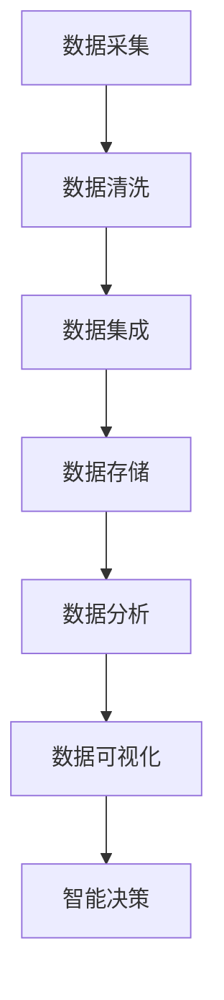

                 

## 1. 背景介绍

在当今数据驱动的时代，运营效率的提升已离不开数据的精准运用。运营决策在很大程度上依赖于对信息的全面掌握和及时获取。然而，信息的复杂性和多元性，以及信息传播的速率和广度，常常使得运营者面临信息差的挑战。为了解决这一问题，大数据技术应运而生，并逐步成为企业运营优化的重要手段。

### 1.1 问题由来

1. **数据分散**：企业内部和外部的数据源繁多，数据格式各异，使得数据整合难度大，信息孤岛现象普遍。
2. **信息不对称**：不同部门和层级间，以及与外部利益相关者之间，信息流动不畅通，存在信息不对称问题。
3. **数据质量问题**：数据完整性、准确性和一致性问题普遍存在，影响数据分析的准确性。
4. **决策效率低**：在缺乏及时、全面信息的情况下，运营决策效率低下，延误决策时机。

### 1.2 问题核心关键点

大数据技术通过整合、分析海量数据，帮助企业提升运营效率。主要关键点包括：
- **数据采集与集成**：收集各类数据源，进行清洗和整合，消除信息孤岛。
- **数据存储与处理**：采用高效的数据存储和处理技术，确保数据的时效性和可靠性。
- **数据分析与可视化**：利用先进的数据分析工具，提供多维度的数据洞察，支持决策。
- **智能决策系统**：引入机器学习和人工智能技术，构建智能决策系统，提升运营响应速度和精准度。

### 1.3 问题研究意义

通过大数据技术，企业能够及时获取、整合和分析关键信息，消除信息差，实现以下效果：
- **提高决策质量**：基于全面数据支撑的决策，更具科学性和准确性。
- **优化资源配置**：通过大数据分析，精准调配资源，减少浪费。
- **提升运营效率**：及时响应市场变化，灵活调整运营策略。
- **增强竞争力**：准确把握市场动态，快速把握商业机会。

## 2. 核心概念与联系

### 2.1 核心概念概述

为更好地理解大数据在运营优化中的作用，本节将介绍几个关键概念：

- **大数据(Big Data)**：指的是体量大、类型多样、速度快、价值密度低的数据集合。这些数据通常涉及企业运营的各个方面，包括客户行为、产品销售、供应链管理等。
- **数据仓库(Data Warehouse)**：用于集中存储和管理大量历史数据的系统，支持快速查询和分析。
- **数据湖(Data Lake)**：非结构化数据的存储和管理系统，提供更灵活的数据访问和处理方式。
- **数据挖掘(Data Mining)**：通过分析海量数据，发现其中的规律和趋势，支持决策。
- **商业智能(Business Intelligence, BI)**：将数据分析结果转化为可视化的商业洞察，支持管理层决策。
- **智能决策系统(Decision Support System, DSS)**：集成数据分析和人工智能技术，实现自动化决策。

这些概念通过合数据流、分析、存储和可视化等环节，形成一个完整的运营优化框架，帮助企业精准把握信息差，提升运营效率。

### 2.2 核心概念原理和架构的 Mermaid 流程图



此图展示了从数据采集到智能决策的整个流程，其中：

- **A** 数据采集：从各个数据源收集原始数据，并进行初步预处理。
- **B** 数据清洗：消除数据中的噪音和错误，提升数据质量。
- **C** 数据集成：将清洗后的数据整合到一个统一的数据仓库或数据湖中。
- **D** 数据存储：采用高效的数据存储技术，确保数据的可靠性和可访问性。
- **E** 数据分析：利用数据挖掘和机器学习技术，分析数据中的规律和趋势。
- **F** 数据可视化：将分析结果转化为图表、报告等形式，便于管理层理解和决策。
- **G** 智能决策：集成数据分析和人工智能技术，实现自动化决策。

## 3. 核心算法原理 & 具体操作步骤

### 3.1 算法原理概述

运营优化的核心算法主要围绕数据采集、清洗、集成、分析和可视化展开，其基本思路是通过以下步骤：

1. **数据采集**：收集各种数据源，包括客户行为数据、销售数据、供应链数据等。
2. **数据清洗**：清洗和修正数据，确保数据的完整性和准确性。
3. **数据集成**：将清洗后的数据进行整合，消除信息孤岛。
4. **数据分析**：利用数据挖掘和机器学习技术，分析数据中的规律和趋势。
5. **数据可视化**：通过图表和报告，直观展示分析结果，支持决策。

### 3.2 算法步骤详解

以下是运营优化中大数据应用的详细步骤：

**Step 1: 数据采集与集成**

1. **数据源收集**：收集企业内部和外部的数据源，包括销售数据、客户行为数据、供应链数据等。
2. **数据清洗与处理**：对数据进行清洗和预处理，如去除噪音、填补缺失值、统一数据格式等。
3. **数据集成与整合**：将清洗后的数据集成到一个统一的数据仓库或数据湖中，采用ETL（Extract, Transform, Load）技术进行数据整合。

**Step 2: 数据分析与建模**

1. **特征工程**：根据业务需求，选择和构造合适的特征，提高模型的准确性。
2. **模型训练与优化**：利用机器学习算法，训练和优化预测模型，如回归模型、分类模型等。
3. **模型评估与部署**：对训练好的模型进行评估和验证，部署到生产环境中，支持实时决策。

**Step 3: 数据可视化与仪表盘**

1. **数据可视化**：利用可视化工具，如Tableau、Power BI等，将分析结果转化为图表、仪表盘等形式，便于管理层理解和决策。
2. **仪表盘构建**：构建实时监控仪表盘，展示关键指标和动态数据，支持运营实时监控。

**Step 4: 智能决策与优化**

1. **智能决策系统**：引入智能决策系统，结合业务规则和数据模型，实现自动化决策。
2. **运营优化与调整**：根据智能决策系统的输出，调整运营策略，优化资源配置，提升效率。

### 3.3 算法优缺点

大数据在运营优化中的优点：
- **数据全面性**：能够整合企业内外部的数据，提供全面信息支持。
- **分析深度**：通过先进的数据挖掘和机器学习技术，发现数据中的规律和趋势。
- **实时响应**：实时监控和分析数据，快速响应市场变化。

大数据在运营优化中的缺点：
- **成本高**：需要大量的硬件设备和计算资源，投入成本高。
- **数据质量问题**：数据清洗和整合难度大，数据质量难以保证。
- **复杂度**：技术实现复杂，需要专业的技术团队支撑。

### 3.4 算法应用领域

大数据技术在运营优化中应用广泛，涉及以下领域：

1. **客户关系管理(CRM)**：通过分析客户行为数据，提升客户满意度，增加客户黏性。
2. **供应链管理(SCM)**：优化供应链流程，提高物流效率，减少库存成本。
3. **营销优化**：利用客户数据和市场分析，精准投放广告，提升营销效果。
4. **财务分析**：通过财务数据，预测经营趋势，优化资金管理。
5. **运营监控**：实时监控关键指标，及时发现和解决问题，提升运营效率。

## 4. 数学模型和公式 & 详细讲解 & 举例说明

### 4.1 数学模型构建

在运营优化的数据建模过程中，我们通常会构建多个模型，包括回归模型、分类模型、聚类模型等。这里以线性回归模型为例，介绍数学模型的构建。

假设有一个数据集 $D=\{(x_i,y_i)\}_{i=1}^N$，其中 $x_i$ 为输入特征，$y_i$ 为输出标签。线性回归模型的目标是找到一条直线 $y=\theta^T x$，使得对任意 $x_i$，预测值 $y_i'$ 与真实值 $y_i$ 的误差最小化。

设误差函数为均方误差 $L=\frac{1}{2N}\sum_{i=1}^N (y_i - y_i')^2$，则最小化误差函数的目标函数为：

$$
\min_{\theta} L(\theta) = \frac{1}{2N}\sum_{i=1}^N (y_i - \theta^T x_i)^2
$$

其中 $\theta$ 为模型参数，$x_i$ 为输入特征。

### 4.2 公式推导过程

线性回归模型的参数 $\theta$ 可以通过求解目标函数的最小值得到。具体而言，利用梯度下降算法，求解目标函数 $L(\theta)$ 的导数，得：

$$
\frac{\partial L(\theta)}{\partial \theta} = \frac{1}{N}\sum_{i=1}^N -(x_i - \bar{x})^T(y_i - \theta^T x_i)
$$

其中 $\bar{x}$ 为输入特征的均值。

令导数等于0，解得：

$$
\theta = \left(\sum_{i=1}^N x_i x_i^T\right)^{-1}\sum_{i=1}^N x_i y_i
$$

### 4.3 案例分析与讲解

以某电商平台的销售数据分析为例，利用线性回归模型预测下一季度销售额。

假设数据集 $D=\{(x_i,y_i)\}_{i=1}^N$，其中 $x_i$ 包含销售时间、广告支出、促销活动等特征，$y_i$ 为对应时段的销售额。模型目标为：

- **特征选择**：选取与销售额相关的特征，如广告支出、促销活动等。
- **模型训练**：利用历史数据，训练线性回归模型，得到 $\theta$。
- **模型评估**：在验证集上评估模型性能，选择合适的超参数。
- **模型预测**：利用训练好的模型，预测下一季度销售额。

假设 $x_i=[1, ad_i, promo_i]$，$y_i=[sales_i]$，则线性回归模型为：

$$
\hat{y_i} = \theta^T x_i = \theta_0 + \theta_1 ad_i + \theta_2 promo_i
$$

其中 $\hat{y_i}$ 为预测销售额。

## 5. 项目实践：代码实例和详细解释说明

### 5.1 开发环境搭建

在进行运营优化实践前，我们需要准备好开发环境。以下是使用Python进行Pandas和Scikit-learn开发的工具环境配置流程：

1. 安装Anaconda：从官网下载并安装Anaconda，用于创建独立的Python环境。
2. 创建并激活虚拟环境：
```bash
conda create -n data-env python=3.8 
conda activate data-env
```

3. 安装Pandas和Scikit-learn：
```bash
pip install pandas scikit-learn
```

4. 安装可视化工具：
```bash
pip install matplotlib seaborn
```

5. 安装分布式计算工具：
```bash
pip install dask
```

完成上述步骤后，即可在`data-env`环境中开始项目实践。

### 5.2 源代码详细实现

下面我们以销售数据分析为例，给出使用Pandas和Scikit-learn进行线性回归模型训练的代码实现。

首先，定义数据处理函数：

```python
import pandas as pd
from sklearn.model_selection import train_test_split
from sklearn.linear_model import LinearRegression

def load_data(file_path):
    data = pd.read_csv(file_path)
    features = data[['ad_spending', 'promotion']]
    target = data['sales']
    return features, target
```

然后，定义模型训练函数：

```python
def train_model(features, target, test_size=0.2, random_state=42):
    X_train, X_test, y_train, y_test = train_test_split(features, target, test_size=test_size, random_state=random_state)
    model = LinearRegression()
    model.fit(X_train, y_train)
    return model, X_test, y_test
```

接着，定义模型评估函数：

```python
def evaluate_model(model, X_test, y_test):
    y_pred = model.predict(X_test)
    mse = mean_squared_error(y_test, y_pred)
    rmse = np.sqrt(mse)
    print(f"RMSE: {rmse:.2f}")
```

最后，启动模型训练和评估流程：

```python
file_path = 'sales_data.csv'
features, target = load_data(file_path)
model, X_test, y_test = train_model(features, target)
evaluate_model(model, X_test, y_test)
```

以上就是使用Pandas和Scikit-learn进行线性回归模型训练的完整代码实现。可以看到，通过Pandas和Scikit-learn的强大封装，我们可以用相对简洁的代码完成数据的预处理和模型训练。

### 5.3 代码解读与分析

让我们再详细解读一下关键代码的实现细节：

**load_data函数**：
- 读取数据文件，选择输入特征和输出标签。

**train_model函数**：
- 将数据集分为训练集和测试集。
- 创建并训练线性回归模型。
- 返回模型、测试集和测试标签。

**evaluate_model函数**：
- 利用测试集评估模型性能，计算均方误差和根均方误差。

**启动模型训练和评估流程**：
- 加载数据集。
- 训练模型。
- 评估模型性能。

可以看到，Pandas和Scikit-learn使得数据处理和模型训练的代码实现变得简洁高效。开发者可以将更多精力放在特征工程、模型优化等高层逻辑上，而不必过多关注底层的实现细节。

## 6. 实际应用场景

### 6.1 智能客户服务

大数据技术在智能客户服务中广泛应用，通过分析客户历史行为数据，提供个性化的服务和解决方案。例如，某电商平台的客服系统，利用大数据分析客户浏览记录和购买历史，智能推荐相关商品，提升客户购物体验。通过数据可视化仪表盘，实时监控客户反馈和投诉，及时调整服务策略。

### 6.2 供应链优化

供应链管理涉及复杂的流程和环节，通过大数据技术，企业可以实时监控和分析供应链数据，优化库存管理和物流配送。例如，某物流公司利用大数据分析物流运输数据，优化配送路线，减少运输成本。通过智能决策系统，实时调整配送计划，提高物流效率。

### 6.3 市场洞察

大数据分析能够提供深刻的市场洞察，帮助企业把握市场动态，制定精准的营销策略。例如，某零售企业利用大数据分析客户行为数据和市场趋势，制定精准的促销活动和产品推荐策略，提升销售业绩。通过可视化仪表盘，实时监控市场变化，及时调整营销策略。

### 6.4 未来应用展望

未来，大数据技术在运营优化中的应用将更加广泛，涉及更多领域和场景。

- **智能制造**：利用大数据分析生产线数据，优化生产流程，提高生产效率。
- **智慧医疗**：通过分析患者医疗数据，优化诊疗方案，提升医疗服务质量。
- **智能交通**：实时分析交通数据，优化交通管理，提升交通安全。
- **智能农业**：利用大数据分析农业数据，优化种植和养殖方案，提高农业生产效率。

## 7. 工具和资源推荐

### 7.1 学习资源推荐

为了帮助开发者系统掌握大数据在运营优化中的应用，这里推荐一些优质的学习资源：

1. **《Python数据分析与可视化》**：全面介绍Pandas和Matplotlib等数据分析工具的使用。
2. **《机器学习实战》**：通过实际案例，讲解Scikit-learn等机器学习库的使用。
3. **《数据科学导论》**：介绍数据处理、数据挖掘和机器学习的经典方法和技术。
4. **Kaggle平台**：丰富的数据集和竞赛，提供大量实战案例。
5. **Coursera《数据科学专业》**：由斯坦福大学开设，涵盖数据处理、机器学习和数据可视化等多个方面。

通过对这些资源的学习实践，相信你一定能够快速掌握大数据在运营优化中的应用方法，并用于解决实际的运营问题。

### 7.2 开发工具推荐

高效的工具是提高大数据项目开发效率的关键。以下是几款用于大数据项目开发的常用工具：

1. **Jupyter Notebook**：强大的交互式数据处理和分析环境，支持Python和R等多种语言。
2. **Spark**：分布式计算框架，支持大规模数据处理和分析。
3. **Hadoop**：大数据处理和存储框架，支持海量数据的分布式存储和处理。
4. **Tableau**：数据可视化工具，提供直观的图表和仪表盘。
5. **Power BI**：微软推出的BI工具，支持数据导入和可视化分析。

合理利用这些工具，可以显著提升大数据项目开发效率，加快创新迭代的步伐。

### 7.3 相关论文推荐

大数据技术的发展离不开学界的持续研究。以下是几篇奠基性的相关论文，推荐阅读：

1. **《Google's PageRank and the Links within the Web》**：谷歌PageRank算法的经典论文，引入网页间的链接关系，通过算法计算网页权重，提升搜索引擎效果。
2. **《A Framework of Distributed Computing》**：MapReduce框架的奠基性论文，提出分布式计算模型，提升大规模数据处理的效率。
3. **《Distributed Deep Learning with Parameter Servers》**：提出参数服务器模型，支持大规模深度学习模型的分布式训练。
4. **《Hadoop: Sustainable Storage for the Masses》**：介绍Hadoop框架的设计和实现，支持海量数据的分布式存储和处理。
5. **《Practical Recommendation Systems in Healthcare: A Survey》**：综述了医疗领域推荐系统的最新进展，提供多角度的思路和方法。

这些论文代表了大数据技术的发展脉络。通过学习这些前沿成果，可以帮助研究者把握学科前进方向，激发更多的创新灵感。

## 8. 总结：未来发展趋势与挑战

### 8.1 研究成果总结

本文对大数据在运营优化中的应用进行了全面系统的介绍。首先阐述了运营优化的背景和意义，明确了大数据技术在消除信息差、提升运营效率方面的独特价值。其次，从原理到实践，详细讲解了运营优化的数学模型和具体步骤，给出了大数据应用项目的完整代码实例。同时，本文还广泛探讨了大数据技术在多个行业领域的应用前景，展示了大数据的广泛潜力。

通过本文的系统梳理，可以看到，大数据技术在运营优化中已经发挥了重要作用，通过全面、高效的数据整合和分析，帮助企业及时获取和利用关键信息，消除信息差，实现运营效率的提升。未来，随着技术的不断进步和应用的深化，大数据必将在更多领域发挥更大的作用。

### 8.2 未来发展趋势

展望未来，大数据技术在运营优化中将呈现以下几个发展趋势：

1. **数据智能化**：通过引入人工智能和机器学习技术，提升数据分析的深度和精准度。
2. **实时化**：通过实时数据处理和分析，提供实时决策支持，提升运营响应速度。
3. **集成化**：将大数据技术与云计算、物联网等技术结合，形成更完整的生态系统。
4. **可视化**：利用更先进的数据可视化技术，提供更直观的业务洞察，支持决策。
5. **场景化**：针对不同应用场景，提供定制化的大数据解决方案，提升运营效果。

### 8.3 面临的挑战

尽管大数据技术在运营优化中已经取得了显著成效，但在迈向更加智能化、普适化应用的过程中，它仍面临诸多挑战：

1. **数据孤岛**：企业内部和外部的数据源众多，数据格式各异，使得数据整合难度大，信息孤岛现象普遍。
2. **数据质量**：数据清洗和整合难度大，数据质量难以保证。
3. **技术复杂度**：大数据技术实现复杂，需要专业的技术团队支撑。
4. **成本高昂**：需要大量的硬件设备和计算资源，投入成本高。
5. **安全性和隐私**：大数据应用过程中，数据安全和隐私保护成为重要问题。

### 8.4 研究展望

面对大数据在运营优化中所面临的挑战，未来的研究需要在以下几个方面寻求新的突破：

1. **数据融合技术**：探索更高效的数据整合和融合方法，消除信息孤岛。
2. **数据质量保障**：研发更智能的数据清洗和处理技术，提升数据质量。
3. **技术创新**：引入新的算法和模型，提升大数据处理和分析效率。
4. **成本控制**：探索更高效的数据存储和处理方式，降低成本。
5. **安全性和隐私**：加强数据安全保护，确保数据隐私。

这些研究方向将推动大数据技术在运营优化中迈向新的高度，为构建更高效、智能、安全的运营系统提供技术支撑。相信随着学界和产业界的共同努力，大数据技术必将进一步提升企业的运营效率，推动更多行业的数字化转型。

## 9. 附录：常见问题与解答

**Q1：如何确保大数据分析的准确性？**

A: 确保大数据分析的准确性需要从数据采集、清洗、分析和可视化等多个环节进行全面控制。以下是一些关键点：

1. **数据来源可靠性**：确保数据源的可靠性，选择高质量的数据源，避免数据噪声。
2. **数据清洗和预处理**：通过数据清洗和预处理，消除数据中的噪音和错误，确保数据质量。
3. **模型选择和优化**：选择适合的数据挖掘和机器学习模型，并通过交叉验证等方法进行模型优化，提升模型的准确性。
4. **可视化验证**：通过数据可视化工具，验证分析结果的正确性，发现和纠正分析中的问题。

**Q2：大数据项目如何降低成本？**

A: 降低大数据项目的成本可以从以下几个方面入手：

1. **数据压缩和存储优化**：利用数据压缩和存储优化技术，减少数据存储和传输的资源消耗。
2. **分布式计算**：通过分布式计算框架，如Hadoop、Spark等，提高计算效率，降低计算成本。
3. **资源调度**：采用资源调度技术，优化资源配置，减少资源浪费。
4. **数据共享和复用**：通过数据共享和复用，避免重复计算，降低计算成本。

**Q3：大数据项目如何进行风险管理？**

A: 大数据项目中，风险管理是至关重要的。以下是一些关键措施：

1. **数据安全和隐私保护**：采用数据加密、访问控制等技术，保护数据安全和隐私。
2. **数据备份和恢复**：建立数据备份和恢复机制，避免数据丢失和损坏。
3. **模型验证和监控**：通过模型验证和监控，及时发现和纠正模型偏差，确保模型稳定性和可靠性。
4. **风险评估和预警**：建立风险评估和预警机制，及时发现和应对风险，减少风险影响。

**Q4：大数据项目如何提高效率？**

A: 提高大数据项目效率需要从多个方面进行优化：

1. **自动化流程**：通过脚本和工具，自动化数据处理和分析流程，减少人工操作。
2. **数据预处理**：通过数据预处理技术，提高数据质量和处理效率。
3. **实时数据处理**：通过实时数据处理技术，及时响应市场变化，提升运营效率。
4. **分布式计算**：利用分布式计算框架，提高数据处理和分析效率。

---

作者：禅与计算机程序设计艺术 / Zen and the Art of Computer Programming

