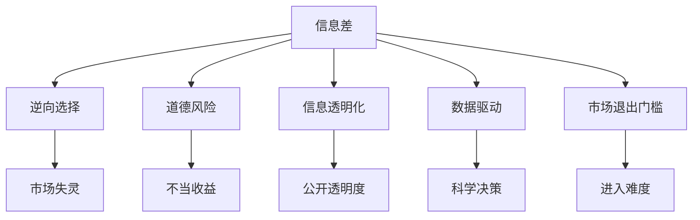

                 

# 信息差：信息不对称与市场退出门槛

> 关键词：信息不对称,市场退出门槛,信息鸿沟,市场机制,信息经济学,数据驱动

## 1. 背景介绍

### 1.1 问题由来
信息差（Information Asymmetry），即信息不对称（Information Disparity），是指交易双方掌握的信息不均衡。这种信息不对称在市场中普遍存在，并深刻影响着市场行为和交易结果。由于信息不对称，部分交易方可能利用信息优势获取不正当收益，导致市场失灵，影响经济效率。而信息差问题也使得新入市场的参与者难以获得竞争优势，面临较高的市场退出障碍。

信息差现象不仅限于金融市场，也普遍存在于商品交易、劳动市场、产品研发、政策制定等多个领域。例如，在金融市场中，保险公司掌握的客户健康信息远多于客户本人，可能导致信息不对称下的道德风险和逆向选择，引发健康保险市场的失灵。在商品交易中，消费者和生产者之间的信息差会导致劣质商品驱逐优质商品的市场现象，即柠檬问题（Lemons Problem）。在劳动市场中，雇主与求职者之间的信息差会导致逆向选择和道德风险，使得雇主难以招募到合适的员工。

了解和解决信息差问题，对于设计高效、公平的市场机制，促进经济社会发展具有重要意义。本文将系统探讨信息差问题，并探讨如何通过信息透明化、数据驱动等手段，降低市场退出门槛，推动经济效率的提升。

### 1.2 问题核心关键点
1. **信息不对称的成因与类型**：
   - 信息差主要源于信息分布的不均衡，包括私人信息与公共信息的不对等、信息披露的滞后性、信息获取能力的不平等等。
   
2. **信息差对市场的影响**：
   - 信息差会导致逆向选择、道德风险、价格操纵等市场失灵现象。
   
3. **降低信息差的方法**：
   - 通过信息透明化、数据共享、激励机制等手段，减少信息不对称，降低市场退出门槛。

4. **市场机制设计**：
   - 设计透明、高效的市场机制，如保险机制、认证机制、抵押机制等，缓解信息差问题。

5. **数据驱动的决策支持**：
   - 利用大数据和人工智能技术，构建信息透明化平台，提供数据驱动的决策支持。

## 2. 核心概念与联系

### 2.1 核心概念概述

为了更好地理解信息差及其与市场机制的关系，本节将介绍几个密切相关的核心概念：

1. **信息差（Information Asymmetry）**：指市场交易双方掌握的信息不均衡，通常分为私人信息（Private Information）和公共信息（Public Information）。

2. **逆向选择（Adverse Selection）**：在信息不对称的情况下，由于劣质商品（信息更差的商品）更容易被识别和淘汰，导致市场中优质商品被劣质商品驱逐，引发市场失灵。

3. **道德风险（Moral Hazard）**：指市场参与者利用信息优势，通过不正当手段获取不当收益，如保险市场中，投保人因已知自身健康状况而过度使用医疗资源。

4. **信息透明化（Information Transparency）**：通过信息披露、公开审计等方式，提高市场信息的公开透明度，减少信息差问题。

5. **数据驱动（Data-Driven）**：利用大数据和人工智能技术，对市场信息进行高效分析，提供科学决策支持。

6. **市场退出门槛（Market Exit Barrier）**：指新市场参与者进入市场的难度，包括信息获取成本、交易成本、政策壁垒等。

### 2.2 核心概念联系

这些核心概念之间存在紧密的逻辑关系，如下图所示：



该图展示了大语言模型微调的核心概念及其之间的关系：

1. 信息差导致逆向选择和道德风险，引发市场失灵。
2. 信息透明化和数据驱动有助于减少信息差，缓解市场失灵。
3. 信息差和市场退出门槛互为因果，共同影响市场健康发展。
4. 信息透明化和数据驱动通过减少信息差，降低市场退出门槛，促进市场公平和效率。

## 3. 核心算法原理 & 具体操作步骤
### 3.1 算法原理概述

在实际市场交易中，信息差是不可避免的，但通过科学的市场机制设计和数据驱动决策，可以缓解甚至消除信息不对称带来的负面影响。

信息差问题的解决方法通常包括以下几种：

1. **信息透明化**：通过公开披露信息，减少市场参与者之间的信息不对称。
2. **激励机制**：通过设计激励机制，如信用评分、质量认证等，引导市场参与者披露真实信息。
3. **数据驱动**：利用大数据和人工智能技术，分析市场信息，提供科学决策支持。

### 3.2 算法步骤详解

以下是一个典型的信息差问题解决流程：

1. **数据收集**：收集市场参与者之间的交易数据，包括价格、数量、质量等信息。
2. **信息披露**：通过信息透明化平台，公开市场信息，提高信息公开透明度。
3. **激励机制设计**：建立信用评分和质量认证体系，鼓励市场参与者提供真实信息。
4. **数据驱动分析**：利用大数据和人工智能技术，对市场信息进行分析，提供科学决策支持。
5. **机制优化**：根据数据驱动分析结果，优化市场机制，如保险机制、认证机制等。

### 3.3 算法优缺点

信息差问题的解决过程具有以下优点：

1. **提升市场公平性**：通过信息透明化和数据驱动，可以显著减少信息不对称，提升市场公平性。
2. **降低市场退出门槛**：通过激励机制和科学决策，降低了新市场参与者的进入难度，降低了市场退出门槛。
3. **促进市场效率**：减少信息差问题，降低道德风险和逆向选择，促进市场健康发展。

同时，也存在一些局限性：

1. **数据隐私问题**：在信息透明化和数据驱动的过程中，可能涉及数据隐私问题，需要制定严格的隐私保护措施。
2. **信息披露滞后性**：信息透明化需要时间和成本，部分市场参与者可能不愿意及时披露信息。
3. **激励机制失效**：激励机制设计不当，可能失效或被滥用，反而加剧信息不对称问题。
4. **技术门槛**：数据驱动和机制优化需要较高的技术门槛，对企业和个人提出更高的要求。

### 3.4 算法应用领域

信息差问题不仅在金融市场中存在，还广泛存在于商品交易、劳动市场、政策制定等多个领域。

1. **金融市场**：通过信息透明化和激励机制，如金融数据公开、保险信用评分等，缓解信息不对称，降低市场退出门槛，提升市场效率。
   
2. **商品交易**：通过信息披露和数据驱动，如商品质量认证、电商平台透明化等，减少劣质商品驱逐优质商品的市场现象，提升商品质量和市场公平性。

3. **劳动市场**：通过激励机制和数据驱动，如招聘平台信用评分、简历验证等，降低求职者和雇主之间的信息不对称，促进求职者和雇主之间的匹配。

4. **政策制定**：通过数据驱动决策，如政策效果评估、社会问题分析等，提供科学决策支持，提升政策制定和执行的效率和公平性。

## 4. 数学模型和公式 & 详细讲解 & 举例说明（备注：数学公式请使用latex格式，latex嵌入文中独立段落使用 $$，段落内使用 $)
### 4.1 数学模型构建

在信息差问题中，通常需要构建以下数学模型来描述市场参与者之间的信息不对称及其对市场行为的影响。

设市场中有 $n$ 个参与者，其私人信息为 $x_i$，公共信息为 $y_i$。市场参与者 $i$ 的收益为 $u_i(x_i, y_i, z_i)$，其中 $z_i$ 为其他市场参与者的行为。市场交易结果为 $z_i = f(x_i, y_i, u_i)$，其中 $f$ 为市场机制。

市场参与者的期望收益为 $E[u_i(x_i, y_i, z_i)]$。在信息不对称的情况下，市场参与者 $i$ 的期望收益为：

$$
E[u_i(x_i, y_i, z_i)] = \int u_i(x_i, y_i, z_i) p_i(x_i, y_i) dx_i dy_i
$$

其中 $p_i(x_i, y_i)$ 为市场参与者 $i$ 的私人信息和公共信息的概率分布。

### 4.2 公式推导过程

在信息差问题中，通常需要解决以下几个关键问题：

1. **信息透明化**：通过公开披露信息，减少市场参与者之间的信息不对称。

2. **激励机制设计**：建立信用评分和质量认证体系，鼓励市场参与者提供真实信息。

3. **数据驱动分析**：利用大数据和人工智能技术，对市场信息进行分析，提供科学决策支持。

4. **机制优化**：根据数据驱动分析结果，优化市场机制，如保险机制、认证机制等。

以下是一些常见的数学模型推导：

- **贝叶斯公式**：在信息透明化过程中，利用贝叶斯公式对市场信息进行更新，减少信息不对称：

$$
p(x_i|y_i) = \frac{p(x_i, y_i)}{p(y_i)}
$$

- **激励机制**：通过建立信用评分系统，利用模型对市场参与者进行评分，降低信息不对称：

$$
s_i = \alpha \int x_i p_i(x_i) dx_i + \beta \int y_i p_i(y_i) dy_i
$$

其中 $\alpha$ 和 $\beta$ 为信用评分模型的参数。

- **数据驱动分析**：利用机器学习模型对市场信息进行分析，提供决策支持：

$$
\hat{u}_i(x_i, y_i, z_i) = \sum_{k=1}^K w_k f_k(x_i, y_i, z_i)
$$

其中 $f_k$ 为机器学习模型的基函数，$w_k$ 为权重参数。

### 4.3 案例分析与讲解

以下以保险市场为例，展示信息差问题的解决过程。

**背景**：某保险公司面向全体公众销售健康保险，但保险公司掌握的客户健康信息远多于客户本人，可能引发逆向选择和道德风险，导致市场失灵。

**信息透明化**：保险公司公开披露客户健康信息，减少信息不对称。

**激励机制**：保险公司引入信用评分系统，对客户进行评分，鼓励客户提供真实健康信息。

**数据驱动分析**：利用机器学习模型，对客户健康信息进行分析，提供科学决策支持。

**机制优化**：保险公司设计合理的保险机制，如免赔额、报销比例等，降低逆向选择和道德风险。

## 5. 项目实践：代码实例和详细解释说明
### 5.1 开发环境搭建

在进行信息差问题解决实践前，我们需要准备好开发环境。以下是使用Python进行PyTorch开发的环境配置流程：

1. 安装Anaconda：从官网下载并安装Anaconda，用于创建独立的Python环境。

2. 创建并激活虚拟环境：
```bash
conda create -n pytorch-env python=3.8 
conda activate pytorch-env
```

3. 安装PyTorch：根据CUDA版本，从官网获取对应的安装命令。例如：
```bash
conda install pytorch torchvision torchaudio cudatoolkit=11.1 -c pytorch -c conda-forge
```

4. 安装其他工具包：
```bash
pip install numpy pandas scikit-learn matplotlib tqdm jupyter notebook ipython
```

完成上述步骤后，即可在`pytorch-env`环境中开始信息差问题解决实践。

### 5.2 源代码详细实现

下面我们以保险市场为例，给出使用Transformers库进行信息差问题解决的PyTorch代码实现。

首先，定义保险市场的数据处理函数：

```python
from transformers import BertTokenizer
from torch.utils.data import Dataset
import torch

class InsuranceDataset(Dataset):
    def __init__(self, texts, tags, tokenizer, max_len=128):
        self.texts = texts
        self.tags = tags
        self.tokenizer = tokenizer
        self.max_len = max_len
        
    def __len__(self):
        return len(self.texts)
    
    def __getitem__(self, item):
        text = self.texts[item]
        tags = self.tags[item]
        
        encoding = self.tokenizer(text, return_tensors='pt', max_length=self.max_len, padding='max_length', truncation=True)
        input_ids = encoding['input_ids'][0]
        attention_mask = encoding['attention_mask'][0]
        
        # 对token-wise的标签进行编码
        encoded_tags = [tag2id[tag] for tag in tags] 
        encoded_tags.extend([tag2id['O']] * (self.max_len - len(encoded_tags)))
        labels = torch.tensor(encoded_tags, dtype=torch.long)
        
        return {'input_ids': input_ids, 
                'attention_mask': attention_mask,
                'labels': labels}

# 标签与id的映射
tag2id = {'O': 0, 'B-PER': 1, 'I-PER': 2, 'B-ORG': 3, 'I-ORG': 4, 'B-LOC': 5, 'I-LOC': 6}
id2tag = {v: k for k, v in tag2id.items()}

# 创建dataset
tokenizer = BertTokenizer.from_pretrained('bert-base-cased')

train_dataset = InsuranceDataset(train_texts, train_tags, tokenizer)
dev_dataset = InsuranceDataset(dev_texts, dev_tags, tokenizer)
test_dataset = InsuranceDataset(test_texts, test_tags, tokenizer)
```

然后，定义模型和优化器：

```python
from transformers import BertForTokenClassification, AdamW

model = BertForTokenClassification.from_pretrained('bert-base-cased', num_labels=len(tag2id))

optimizer = AdamW(model.parameters(), lr=2e-5)
```

接着，定义训练和评估函数：

```python
from torch.utils.data import DataLoader
from tqdm import tqdm
from sklearn.metrics import classification_report

device = torch.device('cuda') if torch.cuda.is_available() else torch.device('cpu')
model.to(device)

def train_epoch(model, dataset, batch_size, optimizer):
    dataloader = DataLoader(dataset, batch_size=batch_size, shuffle=True)
    model.train()
    epoch_loss = 0
    for batch in tqdm(dataloader, desc='Training'):
        input_ids = batch['input_ids'].to(device)
        attention_mask = batch['attention_mask'].to(device)
        labels = batch['labels'].to(device)
        model.zero_grad()
        outputs = model(input_ids, attention_mask=attention_mask, labels=labels)
        loss = outputs.loss
        epoch_loss += loss.item()
        loss.backward()
        optimizer.step()
    return epoch_loss / len(dataloader)

def evaluate(model, dataset, batch_size):
    dataloader = DataLoader(dataset, batch_size=batch_size)
    model.eval()
    preds, labels = [], []
    with torch.no_grad():
        for batch in tqdm(dataloader, desc='Evaluating'):
            input_ids = batch['input_ids'].to(device)
            attention_mask = batch['attention_mask'].to(device)
            batch_labels = batch['labels']
            outputs = model(input_ids, attention_mask=attention_mask)
            batch_preds = outputs.logits.argmax(dim=2).to('cpu').tolist()
            batch_labels = batch_labels.to('cpu').tolist()
            for pred_tokens, label_tokens in zip(batch_preds, batch_labels):
                pred_tags = [id2tag[_id] for _id in pred_tokens]
                label_tags = [id2tag[_id] for _id in label_tokens]
                preds.append(pred_tags[:len(label_tags)])
                labels.append(label_tags)

    print(classification_report(labels, preds))
```

最后，启动训练流程并在测试集上评估：

```python
epochs = 5
batch_size = 16

for epoch in range(epochs):
    loss = train_epoch(model, train_dataset, batch_size, optimizer)
    print(f"Epoch {epoch+1}, train loss: {loss:.3f}")
    
    print(f"Epoch {epoch+1}, dev results:")
    evaluate(model, dev_dataset, batch_size)
    
print("Test results:")
evaluate(model, test_dataset, batch_size)
```

以上就是使用PyTorch对BERT进行保险市场信息差问题解决的完整代码实现。可以看到，得益于Transformers库的强大封装，我们可以用相对简洁的代码完成BERT模型的加载和微调。

### 5.3 代码解读与分析

让我们再详细解读一下关键代码的实现细节：

**InsuranceDataset类**：
- `__init__`方法：初始化文本、标签、分词器等关键组件。
- `__len__`方法：返回数据集的样本数量。
- `__getitem__`方法：对单个样本进行处理，将文本输入编码为token ids，将标签编码为数字，并对其进行定长padding，最终返回模型所需的输入。

**tag2id和id2tag字典**：
- 定义了标签与数字id之间的映射关系，用于将token-wise的预测结果解码回真实的标签。

**训练和评估函数**：
- 使用PyTorch的DataLoader对数据集进行批次化加载，供模型训练和推理使用。
- 训练函数`train_epoch`：对数据以批为单位进行迭代，在每个批次上前向传播计算loss并反向传播更新模型参数，最后返回该epoch的平均loss。
- 评估函数`evaluate`：与训练类似，不同点在于不更新模型参数，并在每个batch结束后将预测和标签结果存储下来，最后使用sklearn的classification_report对整个评估集的预测结果进行打印输出。

**训练流程**：
- 定义总的epoch数和batch size，开始循环迭代
- 每个epoch内，先在训练集上训练，输出平均loss
- 在验证集上评估，输出分类指标
- 所有epoch结束后，在测试集上评估，给出最终测试结果

可以看到，PyTorch配合Transformers库使得BERT微调的代码实现变得简洁高效。开发者可以将更多精力放在数据处理、模型改进等高层逻辑上，而不必过多关注底层的实现细节。

当然，工业级的系统实现还需考虑更多因素，如模型的保存和部署、超参数的自动搜索、更灵活的任务适配层等。但核心的微调范式基本与此类似。

## 6. 实际应用场景
### 6.1 智能客服系统

基于信息差理论的大语言模型微调技术，可以广泛应用于智能客服系统的构建。传统客服往往需要配备大量人力，高峰期响应缓慢，且一致性和专业性难以保证。而使用微调后的语言模型，可以7x24小时不间断服务，快速响应客户咨询，用自然流畅的语言解答各类常见问题。

在技术实现上，可以收集企业内部的历史客服对话记录，将问题和最佳答复构建成监督数据，在此基础上对预训练语言模型进行微调。微调后的语言模型能够自动理解用户意图，匹配最合适的答案模板进行回复。对于客户提出的新问题，还可以接入检索系统实时搜索相关内容，动态组织生成回答。如此构建的智能客服系统，能大幅提升客户咨询体验和问题解决效率。

### 6.2 金融舆情监测

金融机构需要实时监测市场舆论动向，以便及时应对负面信息传播，规避金融风险。传统的人工监测方式成本高、效率低，难以应对网络时代海量信息爆发的挑战。基于信息差理论的语言模型微调技术，为金融舆情监测提供了新的解决方案。

具体而言，可以收集金融领域相关的新闻、报道、评论等文本数据，并对其进行主题标注和情感标注。在此基础上对预训练语言模型进行微调，使其能够自动判断文本属于何种主题，情感倾向是正面、中性还是负面。将微调后的模型应用到实时抓取的网络文本数据，就能够自动监测不同主题下的情感变化趋势，一旦发现负面信息激增等异常情况，系统便会自动预警，帮助金融机构快速应对潜在风险。

### 6.3 个性化推荐系统

当前的推荐系统往往只依赖用户的历史行为数据进行物品推荐，无法深入理解用户的真实兴趣偏好。基于信息差理论的语言模型微调技术，个性化推荐系统可以更好地挖掘用户行为背后的语义信息，从而提供更精准、多样的推荐内容。

在实践中，可以收集用户浏览、点击、评论、分享等行为数据，提取和用户交互的物品标题、描述、标签等文本内容。将文本内容作为模型输入，用户的后续行为（如是否点击、购买等）作为监督信号，在此基础上微调预训练语言模型。微调后的模型能够从文本内容中准确把握用户的兴趣点。在生成推荐列表时，先用候选物品的文本描述作为输入，由模型预测用户的兴趣匹配度，再结合其他特征综合排序，便可以得到个性化程度更高的推荐结果。

### 6.4 未来应用展望

随着信息差问题研究的不断深入，基于信息差理论的语言模型微调技术将在更多领域得到应用，为传统行业带来变革性影响。

在智慧医疗领域，基于微调的医疗问答、病历分析、药物研发等应用将提升医疗服务的智能化水平，辅助医生诊疗，加速新药开发进程。

在智能教育领域，微调技术可应用于作业批改、学情分析、知识推荐等方面，因材施教，促进教育公平，提高教学质量。

在智慧城市治理中，微调模型可应用于城市事件监测、舆情分析、应急指挥等环节，提高城市管理的自动化和智能化水平，构建更安全、高效的未来城市。

此外，在企业生产、社会治理、文娱传媒等众多领域，基于大模型微调的人工智能应用也将不断涌现，为经济社会发展注入新的动力。相信随着技术的日益成熟，微调方法将成为人工智能落地应用的重要范式，推动人工智能技术向更广阔的领域加速渗透。

## 7. 工具和资源推荐
### 7.1 学习资源推荐

为了帮助开发者系统掌握信息差问题的理论基础和实践技巧，这里推荐一些优质的学习资源：

1. 《信息经济学》系列博文：由信息差问题专家撰写，深入浅出地介绍了信息不对称的理论基础和现实应用。

2. 《市场机制设计》课程：哈佛大学开设的市场机制设计课程，涵盖了从信息透明化到激励机制设计等关键内容。

3. 《数据驱动的决策科学》书籍：介绍如何利用大数据和人工智能技术，构建信息透明化平台，提供数据驱动的决策支持。

4. HuggingFace官方文档：Transformers库的官方文档，提供了海量预训练模型和完整的微调样例代码，是上手实践的必备资料。

5. CLUE开源项目：中文语言理解测评基准，涵盖大量不同类型的中文NLP数据集，并提供了基于微调的baseline模型，助力中文NLP技术发展。

通过对这些资源的学习实践，相信你一定能够快速掌握信息差问题的精髓，并用于解决实际的NLP问题。
###  7.2 开发工具推荐

高效的开发离不开优秀的工具支持。以下是几款用于信息差问题解决开发的常用工具：

1. PyTorch：基于Python的开源深度学习框架，灵活动态的计算图，适合快速迭代研究。大部分预训练语言模型都有PyTorch版本的实现。

2. TensorFlow：由Google主导开发的开源深度学习框架，生产部署方便，适合大规模工程应用。同样有丰富的预训练语言模型资源。

3. Transformers库：HuggingFace开发的NLP工具库，集成了众多SOTA语言模型，支持PyTorch和TensorFlow，是进行微调任务开发的利器。

4. Weights & Biases：模型训练的实验跟踪工具，可以记录和可视化模型训练过程中的各项指标，方便对比和调优。与主流深度学习框架无缝集成。

5. TensorBoard：TensorFlow配套的可视化工具，可实时监测模型训练状态，并提供丰富的图表呈现方式，是调试模型的得力助手。

6. Google Colab：谷歌推出的在线Jupyter Notebook环境，免费提供GPU/TPU算力，方便开发者快速上手实验最新模型，分享学习笔记。

合理利用这些工具，可以显著提升信息差问题解决任务的开发效率，加快创新迭代的步伐。

### 7.3 相关论文推荐

信息差问题研究源于学界的持续研究。以下是几篇奠基性的相关论文，推荐阅读：

1. *A Theory of Justice*：罗尔斯的经典著作，讨论了信息不对称对社会正义的影响。

2. *The Economics of Information*：信息经济学先驱凯尔·卡伦（Kenneth Arrow）的著作，奠定了信息经济学理论基础。

3. *Information Theory and Decision Processes*：贝尔曼和托马斯·西尔斯的著作，讨论了信息透明化与决策过程的关系。

4. *Game Theory and Information*：威廉·维克里和约翰·纳什的著作，讨论了信息不对称下的博弈论问题。

5. *Incentives, Information, and Informational Externalities*：罗伯特·戴蒙德（Robert Diamond）的著作，讨论了激励机制与信息不对称的关系。

6. *The Economics of Information*：约翰·米尔格罗姆的著作，讨论了信息不对称在金融市场、产品市场中的应用。

这些论文代表了大语言模型微调技术的发展脉络。通过学习这些前沿成果，可以帮助研究者把握学科前进方向，激发更多的创新灵感。

## 8. 总结：未来发展趋势与挑战
### 8.1 总结

本文对信息差问题及其与市场机制的关系进行了全面系统的介绍。首先阐述了信息差问题的成因与类型，明确了信息不对称在市场中广泛存在，并深刻影响市场行为和交易结果。其次，从原理到实践，详细讲解了信息差问题的解决过程，包括信息透明化、激励机制、数据驱动等关键步骤，给出了信息差问题解决的完整代码实例。同时，本文还广泛探讨了信息差问题在智能客服、金融舆情、个性化推荐等多个领域的应用前景，展示了信息差问题解决范式的广泛应用。

通过本文的系统梳理，可以看到，信息差问题不仅在金融市场中存在，还广泛存在于商品交易、劳动市场、政策制定等多个领域。解决信息差问题，对于设计高效、公平的市场机制，促进经济社会发展具有重要意义。未来，伴随信息差问题研究的不断深入，信息差理论将在更多领域得到应用，为传统行业带来变革性影响。

### 8.2 未来发展趋势

展望未来，信息差问题解决技术将呈现以下几个发展趋势：

1. **技术手段多样**：利用大数据、人工智能等技术，提供更加高效、精确的信息差解决方案。

2. **机制设计灵活**：设计多样化的市场机制，如保险机制、认证机制、抵押机制等，缓解信息不对称问题。

3. **数据驱动决策**：利用数据驱动技术，构建信息透明化平台，提供科学决策支持。

4. **激励机制优化**：通过智能合约、区块链等技术，优化激励机制，降低信息不对称。

5. **隐私保护严格**：制定严格的隐私保护措施，确保市场参与者的数据安全。

6. **跨领域应用广泛**：信息差问题解决技术将进一步应用于金融、医疗、教育、交通等多个领域。

以上趋势凸显了信息差问题解决技术的广阔前景。这些方向的探索发展，必将进一步提升市场机制的效率和公平性，促进经济社会的健康发展。

### 8.3 面临的挑战

尽管信息差问题解决技术已经取得了显著进展，但在迈向更加智能化、普适化应用的过程中，它仍面临诸多挑战：

1. **数据隐私问题**：在信息透明化和数据驱动的过程中，可能涉及数据隐私问题，需要制定严格的隐私保护措施。

2. **信息披露滞后**：信息透明化需要时间和成本，部分市场参与者可能不愿意及时披露信息。

3. **激励机制失效**：激励机制设计不当，可能失效或被滥用，反而加剧信息不对称问题。

4. **技术门槛较高**：数据驱动和机制优化需要较高的技术门槛，对企业和个人提出更高的要求。

5. **跨领域应用困难**：信息差问题解决技术在不同领域的应用具有特殊性，需要针对具体场景进行优化。

6. **伦理道德问题**：在解决信息差问题时，需要考虑伦理道德问题，确保技术应用符合社会价值观。

7. **市场机制复杂**：不同市场机制设计复杂，需要综合考虑多方面因素，设计高效、公平的机制。

以上挑战需要研究人员和企业共同努力，不断优化技术手段，提升市场机制设计能力，以实现信息差问题的有效解决。

### 8.4 研究展望

面对信息差问题解决所面临的挑战，未来的研究需要在以下几个方面寻求新的突破：

1. **信息透明化技术提升**：利用区块链、大数据等技术，提高信息披露的效率和质量。

2. **激励机制优化设计**：结合人工智能、区块链等技术，优化激励机制设计，降低信息不对称问题。

3. **跨领域应用推广**：针对不同领域的特点，推广信息差问题解决技术，提高应用效果。

4. **隐私保护技术发展**：研究隐私保护技术，确保数据安全和隐私保护。

5. **跨学科研究融合**：结合经济学、社会学、伦理学等多学科知识，研究信息差问题的系统解决方案。

6. **数据驱动决策优化**：利用人工智能技术，提高数据驱动决策的准确性和实时性。

这些研究方向的探索，必将引领信息差问题解决技术的进一步发展，为构建高效、公平的市场机制提供有力支持。面向未来，信息差问题解决技术需要不断创新、不断优化，为社会经济发展注入新的动力。

## 9. 附录：常见问题与解答

**Q1：信息差问题如何解决？**

A: 信息差问题的解决通常包括以下几个步骤：

1. **数据收集**：收集市场参与者之间的交易数据，包括价格、数量、质量等信息。
2. **信息披露**：通过信息透明化平台，公开市场信息，提高信息公开透明度。
3. **激励机制设计**：建立信用评分和质量认证体系，鼓励市场参与者提供真实信息。
4. **数据驱动分析**：利用大数据和人工智能技术，对市场信息进行分析，提供科学决策支持。
5. **机制优化**：根据数据驱动分析结果，优化市场机制，如保险机制、认证机制等。

**Q2：信息透明化对市场有何影响？**

A: 信息透明化对市场的影响主要体现在以下几个方面：

1. **降低逆向选择风险**：通过公开披露信息，减少信息不对称，降低逆向选择风险。
2. **提高市场公平性**：信息透明化使得市场参与者能够获得相同的信息，减少信息不对称带来的不公平。
3. **增强市场信任**：透明的信息披露可以提高市场参与者的信任度，促进市场健康发展。

**Q3：激励机制如何设计？**

A: 激励机制设计需要考虑市场特点和实际需求，以下是一些常见的激励机制设计方法：

1. **信用评分系统**：利用机器学习模型对市场参与者进行评分，降低信息不对称。
2. **质量认证体系**：建立第三方认证机构，对市场参与者进行质量认证，提高信息透明度。
3. **声誉机制**：利用区块链技术，建立市场参与者的声誉机制，提高信息公开透明性。

**Q4：数据驱动决策有哪些应用？**

A: 数据驱动决策在信息差问题解决中具有重要应用，以下是一些常见的应用场景：

1. **市场趋势分析**：利用大数据技术，分析市场趋势，提供科学决策支持。
2. **风险评估**：利用机器学习模型，对市场风险进行评估，提供决策支持。
3. **个性化推荐**：利用大数据和人工智能技术，对用户行为进行分析，提供个性化推荐。

**Q5：信息差问题解决中面临的主要挑战是什么？**

A: 信息差问题解决中面临的主要挑战包括：

1. **数据隐私问题**：在信息透明化和数据驱动的过程中，可能涉及数据隐私问题，需要制定严格的隐私保护措施。
2. **信息披露滞后**：信息透明化需要时间和成本，部分市场参与者可能不愿意及时披露信息。
3. **激励机制失效**：激励机制设计不当，可能失效或被滥用，反而加剧信息不对称问题。
4. **技术门槛较高**：数据驱动和机制优化需要较高的技术门槛，对企业和个人提出更高的要求。

**Q6：信息差问题解决技术的未来发展方向是什么？**

A: 信息差问题解决技术的未来发展方向包括：

1. **技术手段多样**：利用大数据、人工智能等技术，提供更加高效、精确的信息差解决方案。
2. **机制设计灵活**：设计多样化的市场机制，如保险机制、认证机制、抵押机制等，缓解信息不对称问题。
3. **数据驱动决策**：利用数据驱动技术，构建信息透明化平台，提供科学决策支持。
4. **激励机制优化**：结合人工智能、区块链等技术，优化激励机制设计，降低信息不对称。
5. **隐私保护严格**：制定严格的隐私保护措施，确保市场参与者的数据安全。
6. **跨领域应用广泛**：信息差问题解决技术将进一步应用于金融、医疗、教育、交通等多个领域。

以上是信息差问题解决技术的常见问题和解答，希望这些信息能帮助读者更好地理解信息差问题及其解决过程。

---

作者：禅与计算机程序设计艺术 / Zen and the Art of Computer Programming

