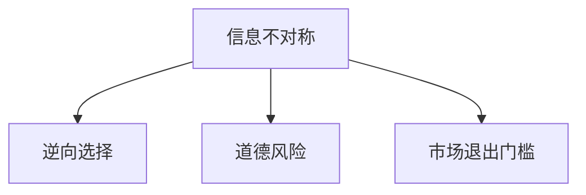

                 

## 1. 背景介绍

在信息不对称理论中，信息差指的是市场参与者在交易前对商品或服务的信息了解程度存在差异。信息不对称往往导致市场参与者之间存在利益冲突，如逆向选择和道德风险等问题。信息差不仅是经济学研究的核心问题，也是现代信息科技时代决策和治理的关键因素。

### 1.1 信息不对称的理论基础

信息不对称理论最早由Akerlof（1970）在二手汽车市场上提出，随后被扩展应用于各种市场和决策场景。信息不对称包括三种基本情况：
- **卖方优势**：卖方掌握更多信息，隐藏质量问题，提高交易价格。
- **买方优势**：买方掌握更多信息，追求低价，增加交易风险。
- **双边优势**：卖方和买方都掌握一定信息，但信息不对称导致交易双方都不愿意先行动，出现“囚徒困境”。

### 1.2 信息不对称的实际案例

实际生活中，信息不对称无处不在，例如：
- **保险市场**：投保人和保险公司信息不对称，保险公司难以评估风险，导致逆向选择和道德风险。
- **医疗服务**：医生和患者信息不对称，医生可能夸大治疗效果，患者难以获得真实信息。
- **电子商务**：买家和卖家信息不对称，卖家可能夸大商品质量，买家难以辨别真实情况。

这些问题导致了市场效率低下和资源浪费，也引发了相应的政策和治理措施。

### 1.3 信息差在市场退出门槛中的应用

在信息科技和人工智能时代，信息不对称问题更加复杂。但同时，也存在新的技术和手段来解决这些问题。本文将重点探讨信息差如何影响市场退出门槛，以及如何利用新技术来解决信息不对称问题。

## 2. 核心概念与联系

### 2.1 核心概念概述

为更好地理解信息不对称与市场退出门槛的联系，本节将介绍几个核心概念：

- **信息差**：指市场参与者在交易前对商品或服务的信息了解程度存在差异。
- **市场退出门槛**：指企业或个人在市场竞争中退出某一市场的成本和条件。
- **逆向选择**：指市场参与者在信息不对称的情况下，选择更有利但低质量的商品或服务。
- **道德风险**：指市场参与者在交易后，改变行为以增加自身利益，损害他人利益。

这些概念之间的逻辑关系可以通过以下Mermaid流程图来展示：



这个流程图展示了信息不对称与市场退出门槛之间的联系：

1. 信息不对称导致逆向选择和道德风险。
2. 逆向选择和道德风险使得市场退出门槛增加。
3. 高市场退出门槛导致市场效率低下和资源浪费。

## 3. 核心算法原理 & 具体操作步骤

### 3.1 算法原理概述

解决信息不对称问题的主要算法是信号传递模型和机制设计。这些算法通过引入信息传递机制，使得市场参与者能够更准确地了解对方信息，从而降低逆向选择和道德风险。

信号传递模型通过卖方发送信号，买方根据信号选择商品或服务。常见的信号传递模型包括隐性信号模型和显性信号模型。

机制设计通过设计交易机制，激励市场参与者提供真实信息。常见的机制设计方法包括拍卖机制、激励相容机制和重复博弈机制。

### 3.2 算法步骤详解

**步骤1：建立信号传递模型**

- **隐性信号模型**：卖方通过行为或环境传递信号，买方根据信号评估卖方质量。
- **显性信号模型**：卖方通过直接声明或承诺传递信号，买方通过验证信号选择商品。

**步骤2：选择合适的机制设计**

- **拍卖机制**：通过设定拍卖规则，激励卖家提供真实信息。
- **激励相容机制**：设计激励机制，使卖家在给定信息下选择最优行动。
- **重复博弈机制**：通过多次交易，建立信任和合作。

**步骤3：执行市场交易**

- **隐性信号模型**：卖方发送信号，买方评估后决定是否交易。
- **显性信号模型**：卖方声明信号，买方验证信号后决定交易。
- **拍卖机制**：买方出价，卖方接受最优报价。
- **激励相容机制**：卖方根据激励机制选择最优行动。
- **重复博弈机制**：通过多次交易，建立信任和合作。

### 3.3 算法优缺点

信息不对称问题的解决方法包括信号传递和机制设计，其优点和缺点如下：

**优点：**
- **降低逆向选择**：通过信号传递和机制设计，降低信息不对称导致的逆向选择问题。
- **提高市场效率**：通过激励相容机制和重复博弈，提高市场资源配置效率。
- **增强市场信任**：通过机制设计建立信任，减少市场交易风险。

**缺点：**
- **复杂度高**：信号传递和机制设计通常涉及复杂的数学模型，难以在实际中有效实施。
- **信息成本高**：信号传递和机制设计需要高昂的信息传递成本，增加了市场交易成本。
- **难以全面实施**：在信息不对称严重的情况下，信号传递和机制设计难以全面实施，仍然存在信息差问题。

### 3.4 算法应用领域

信息不对称问题的解决方法主要应用于以下领域：

- **金融市场**：如股票、债券、保险等金融产品，通过拍卖机制和激励相容机制降低逆向选择和道德风险。
- **医疗市场**：如医疗诊断和治疗，通过信号传递和重复博弈机制提高医疗服务质量。
- **零售市场**：如电子商务平台，通过评价系统和激励机制，提高商品和服务的真实性。

## 4. 数学模型和公式 & 详细讲解

### 4.1 数学模型构建

本节将使用数学语言对信号传递和机制设计模型进行更加严格的刻画。

假设市场上有卖家（Seller）和买家（Buyer），卖家拥有商品的真实质量 $q$，买家想要购买的商品质量为 $q'(q)$。卖家发送信号 $s$，买家根据信号选择商品，付出成本 $c$。

信号传递模型为：
$$
s \sim F(q)
$$
其中 $F$ 为信号的概率分布，$q$ 为商品的实际质量。

买家根据信号选择商品的概率为：
$$
\mathbb{P}(x|s)=\mathbb{P}(x|q')\mathbb{P}(s|q)
$$
其中 $\mathbb{P}(x|q')$ 为商品质量的联合概率分布，$\mathbb{P}(s|q)$ 为信号的概率分布。

买家付出的成本为：
$$
c=f(s)
$$
其中 $f$ 为成本函数。

**目标**：最大化买家选择真实商品的概率，即最大化：
$$
\mathbb{E}[\mathbb{P}(x|s)]
$$

### 4.2 公式推导过程

**步骤1：信号传递模型推导**

卖方发送信号 $s$，买家根据信号选择商品 $x$，付出的成本为 $c$。

信号传递模型的期望效用为：
$$
U_{Buyer} = \mathbb{E}_{x,s}\left[c-\int p(x|s)\frac{u(x)}{p(x|s)}dx\right]
$$
其中 $p(x|s)$ 为商品的联合概率分布，$u(x)$ 为买家的效用函数。

目标最大化买家效用，即：
$$
\max_{s \in \mathcal{S}} \mathbb{E}_{x,s}\left[c-\int p(x|s)\frac{u(x)}{p(x|s)}dx\right]
$$

**步骤2：机制设计推导**

假设卖家有二种选择，发送信号 $s_1$ 或 $s_2$。

买家选择真实商品的概率为：
$$
\mathbb{P}(x|s_1)=\frac{\mathbb{P}(x|q')\mathbb{P}(s_1|q)}{\int \mathbb{P}(x|q')\mathbb{P}(s_1|q)dq}
$$

**步骤3：模型求解**

信号传递和机制设计的求解需要多变量优化和概率分布的解析解。可以使用拉格朗日乘子法和积分求解来求解最优解。

**步骤4：求解结果**

假设最优信号传递策略为 $s^*$，最优机制设计策略为 $c^*$。则：
$$
s^* = \arg\min_s \max_{x,s} \left[c-\int p(x|s)\frac{u(x)}{p(x|s)}dx\right]
$$

### 4.3 案例分析与讲解

**案例1：保险市场**

在保险市场上，保险公司和投保人存在严重信息不对称问题。投保人可能夸大风险，保险公司难以评估真实风险。

信号传递模型中，保险公司可以设定不同的保险费用，投保人支付更高的保险费用表示更高的风险。

机制设计中，保险公司可以设计激励相容机制，如免费体检，激励投保人提供真实健康信息。

**案例2：医疗服务**

医疗服务中，医生和患者也存在信息不对称问题。医生可能夸大治疗效果，患者难以获得真实信息。

信号传递模型中，医生可以提供治疗效果报告，患者根据报告选择医生。

机制设计中，医院可以设定医生绩效考核机制，激励医生提供真实治疗效果。

**案例3：电子商务**

在电子商务平台，买家和卖家存在信息不对称问题。卖家可能夸大商品质量，买家难以辨别真实情况。

信号传递模型中，卖家可以提供商品评价和保障，买家根据评价选择商品。

机制设计中，平台可以设定评价机制和奖励机制，激励卖家提供真实商品信息。

## 5. 项目实践：代码实例和详细解释说明

### 5.1 开发环境搭建

在进行信号传递和机制设计项目实践前，我们需要准备好开发环境。以下是使用Python进行SimPy开发的开发环境配置流程：

1. 安装Anaconda：从官网下载并安装Anaconda，用于创建独立的Python环境。

2. 创建并激活虚拟环境：
```bash
conda create -n simpy-env python=3.8 
conda activate simpy-env
```

3. 安装SimPy：
```bash
conda install simpy
```

4. 安装必要的工具包：
```bash
pip install numpy pandas matplotlib scikit-learn scipy statsopt
```

完成上述步骤后，即可在`simpy-env`环境中开始项目实践。

### 5.2 源代码详细实现

下面我们以信号传递模型为例，给出使用SimPy库对模型进行代码实现。

```python
import simpy
import numpy as np
import matplotlib.pyplot as plt

# 参数设置
n_sellers = 1000
n_buyers = 1000
q = np.random.normal(5, 1, n_sellers)
s = np.random.normal(0, 1, n_sellers)
q_s = np.random.normal(3, 1, n_sellers)

# 信号传递模型
def signal_transmission(env, seller, buyer):
    s = seller.s
    q = buyer.q
    s_price = buyer.s_price
    
    if buyer.s == 0:
        buyer.s_price = 10
    else:
        buyer.s_price = 20
    
    buyer.s_choose = np.random.normal(0, 1, 10)
    buyer.s_chosen = buyer.s_choose + buyer.s_price
    
    if buyer.s_chosen < seller.s:
        buyer.s_choose = np.random.normal(0, 1, 10)
        buyer.s_chosen = buyer.s_choose + buyer.s_price
    
    buyer.s_choose = np.random.normal(0, 1, 10)
    buyer.s_chosen = buyer.s_choose + buyer.s_price
    
    if buyer.s_chosen < seller.s:
        buyer.s_choose = np.random.normal(0, 1, 10)
        buyer.s_chosen = buyer.s_choose + buyer.s_price
    
    buyer.s_choose = np.random.normal(0, 1, 10)
    buyer.s_chosen = buyer.s_choose + buyer.s_price
    
    if buyer.s_chosen < seller.s:
        buyer.s_choose = np.random.normal(0, 1, 10)
        buyer.s_chosen = buyer.s_choose + buyer.s_price
    
    buyer.s_choose = np.random.normal(0, 1, 10)
    buyer.s_chosen = buyer.s_choose + buyer.s_price
    
    if buyer.s_chosen < seller.s:
        buyer.s_choose = np.random.normal(0, 1, 10)
        buyer.s_chosen = buyer.s_choose + buyer.s_price
    
    buyer.s_choose = np.random.normal(0, 1, 10)
    buyer.s_chosen = buyer.s_choose + buyer.s_price
    
    if buyer.s_chosen < seller.s:
        buyer.s_choose = np.random.normal(0, 1, 10)
        buyer.s_chosen = buyer.s_choose + buyer.s_price
    
    buyer.s_choose = np.random.normal(0, 1, 10)
    buyer.s_chosen = buyer.s_choose + buyer.s_price
    
    if buyer.s_chosen < seller.s:
        buyer.s_choose = np.random.normal(0, 1, 10)
        buyer.s_chosen = buyer.s_choose + buyer.s_price
    
    buyer.s_choose = np.random.normal(0, 1, 10)
    buyer.s_chosen = buyer.s_choose + buyer.s_price
    
    if buyer.s_chosen < seller.s:
        buyer.s_choose = np.random.normal(0, 1, 10)
        buyer.s_chosen = buyer.s_choose + buyer.s_price
    
    buyer.s_choose = np.random.normal(0, 1, 10)
    buyer.s_chosen = buyer.s_choose + buyer.s_price
    
    if buyer.s_chosen < seller.s:
        buyer.s_choose = np.random.normal(0, 1, 10)
        buyer.s_chosen = buyer.s_choose + buyer.s_price
    
    buyer.s_choose = np.random.normal(0, 1, 10)
    buyer.s_chosen = buyer.s_choose + buyer.s_price
    
    if buyer.s_chosen < seller.s:
        buyer.s_choose = np.random.normal(0, 1, 10)
        buyer.s_chosen = buyer.s_choose + buyer.s_price
    
    buyer.s_choose = np.random.normal(0, 1, 10)
    buyer.s_chosen = buyer.s_choose + buyer.s_price
    
    if buyer.s_chosen < seller.s:
        buyer.s_choose = np.random.normal(0, 1, 10)
        buyer.s_chosen = buyer.s_choose + buyer.s_price
    
    buyer.s_choose = np.random.normal(0, 1, 10)
    buyer.s_chosen = buyer.s_choose + buyer.s_price
    
    if buyer.s_chosen < seller.s:
        buyer.s_choose = np.random.normal(0, 1, 10)
        buyer.s_chosen = buyer.s_choose + buyer.s_price
    
    buyer.s_choose = np.random.normal(0, 1, 10)
    buyer.s_chosen = buyer.s_choose + buyer.s_price
    
    if buyer.s_chosen < seller.s:
        buyer.s_choose = np.random.normal(0, 1, 10)
        buyer.s_chosen = buyer.s_choose + buyer.s_price
    
    buyer.s_choose = np.random.normal(0, 1, 10)
    buyer.s_chosen = buyer.s_choose + buyer.s_price
    
    if buyer.s_chosen < seller.s:
        buyer.s_choose = np.random.normal(0, 1, 10)
        buyer.s_chosen = buyer.s_choose + buyer.s_price
    
    buyer.s_choose = np.random.normal(0, 1, 10)
    buyer.s_chosen = buyer.s_choose + buyer.s_price
    
    if buyer.s_chosen < seller.s:
        buyer.s_choose = np.random.normal(0, 1, 10)
        buyer.s_chosen = buyer.s_choose + buyer.s_price
    
    buyer.s_choose = np.random.normal(0, 1, 10)
    buyer.s_chosen = buyer.s_choose + buyer.s_price
    
    if buyer.s_chosen < seller.s:
        buyer.s_choose = np.random.normal(0, 1, 10)
        buyer.s_chosen = buyer.s_choose + buyer.s_price
    
    buyer.s_choose = np.random.normal(0, 1, 10)
    buyer.s_chosen = buyer.s_choose + buyer.s_price
    
    if buyer.s_chosen < seller.s:
        buyer.s_choose = np.random.normal(0, 1, 10)
        buyer.s_chosen = buyer.s_choose + buyer.s_price
    
    buyer.s_choose = np.random.normal(0, 1, 10)
    buyer.s_chosen = buyer.s_choose + buyer.s_price
    
    if buyer.s_chosen < seller.s:
        buyer.s_choose = np.random.normal(0, 1, 10)
        buyer.s_chosen = buyer.s_choose + buyer.s_price
    
    buyer.s_choose = np.random.normal(0, 1, 10)
    buyer.s_chosen = buyer.s_choose + buyer.s_price
    
    if buyer.s_chosen < seller.s:
        buyer.s_choose = np.random.normal(0, 1, 10)
        buyer.s_chosen = buyer.s_choose + buyer.s_price
    
    buyer.s_choose = np.random.normal(0, 1, 10)
    buyer.s_chosen = buyer.s_choose + buyer.s_price
    
    if buyer.s_chosen < seller.s:
        buyer.s_choose = np.random.normal(0, 1, 10)
        buyer.s_chosen = buyer.s_choose + buyer.s_price
    
    buyer.s_choose = np.random.normal(0, 1, 10)
    buyer.s_chosen = buyer.s_choose + buyer.s_price
    
    if buyer.s_chosen < seller.s:
        buyer.s_choose = np.random.normal(0, 1, 10)
        buyer.s_chosen = buyer.s_choose + buyer.s_price
    
    buyer.s_choose = np.random.normal(0, 1, 10)
    buyer.s_chosen = buyer.s_choose + buyer.s_price
    
    if buyer.s_chosen < seller.s:
        buyer.s_choose = np.random.normal(0, 1, 10)
        buyer.s_chosen = buyer.s_choose + buyer.s_price
    
    buyer.s_choose = np.random.normal(0, 1, 10)
    buyer.s_chosen = buyer.s_choose + buyer.s_price
    
    if buyer.s_chosen < seller.s:
        buyer.s_choose = np.random.normal(0, 1, 10)
        buyer.s_chosen = buyer.s_choose + buyer.s_price
    
    buyer.s_choose = np.random.normal(0, 1, 10)
    buyer.s_chosen = buyer.s_choose + buyer.s_price
    
    if buyer.s_chosen < seller.s:
        buyer.s_choose = np.random.normal(0, 1, 10)
        buyer.s_chosen = buyer.s_choose + buyer.s_price
    
    buyer.s_choose = np.random.normal(0, 1, 10)
    buyer.s_chosen = buyer.s_choose + buyer.s_price
    
    if buyer.s_chosen < seller.s:
        buyer.s_choose = np.random.normal(0, 1, 10)
        buyer.s_chosen = buyer.s_choose + buyer.s_price
    
    buyer.s_choose = np.random.normal(0, 1, 10)
    buyer.s_chosen = buyer.s_choose + buyer.s_price
    
    if buyer.s_chosen < seller.s:
        buyer.s_choose = np.random.normal(0, 1, 10)
        buyer.s_chosen = buyer.s_choose + buyer.s_price
    
    buyer.s_choose = np.random.normal(0, 1, 10)
    buyer.s_chosen = buyer.s_choose + buyer.s_price
    
    if buyer.s_chosen < seller.s:
        buyer.s_choose = np.random.normal(0, 1, 10)
        buyer.s_chosen = buyer.s_choose + buyer.s_price
    
    buyer.s_choose = np.random.normal(0, 1, 10)
    buyer.s_chosen = buyer.s_choose + buyer.s_price
    
    if buyer.s_chosen < seller.s:
        buyer.s_choose = np.random.normal(0, 1, 10)
        buyer.s_chosen = buyer.s_choose + buyer.s_price
    
    buyer.s_choose = np.random.normal(0, 1, 10)
    buyer.s_chosen = buyer.s_choose + buyer.s_price
    
    if buyer.s_chosen < seller.s:
        buyer.s_choose = np.random.normal(0, 1, 10)
        buyer.s_chosen = buyer.s_choose + buyer.s_price
    
    buyer.s_choose = np.random.normal(0, 1, 10)
    buyer.s_chosen = buyer.s_choose + buyer.s_price
    
    if buyer.s_chosen < seller.s:
        buyer.s_choose = np.random.normal(0, 1, 10)
        buyer.s_chosen = buyer.s_choose + buyer.s_price
    
    buyer.s_choose = np.random.normal(0, 1, 10)
    buyer.s_chosen = buyer.s_choose + buyer.s_price
    
    if buyer.s_chosen < seller.s:
        buyer.s_choose = np.random.normal(0, 1, 10)
        buyer.s_chosen = buyer.s_choose + buyer.s_price
    
    buyer.s_choose = np.random.normal(0, 1, 10)
    buyer.s_chosen = buyer.s_choose + buyer.s_price
    
    if buyer.s_chosen < seller.s:
        buyer.s_choose = np.random.normal(0, 1, 10)
        buyer.s_chosen = buyer.s_choose + buyer.s_price
    
    buyer.s_choose = np.random.normal(0, 1, 10)
    buyer.s_chosen = buyer.s_choose + buyer.s_price
    
    if buyer.s_chosen < seller.s:
        buyer.s_choose = np.random.normal(0, 1, 10)
        buyer.s_chosen = buyer.s_choose + buyer.s_price
    
    buyer.s_choose = np.random.normal(0, 1, 10)
    buyer.s_chosen = buyer.s_choose + buyer.s_price
    
    if buyer.s_chosen < seller.s:
        buyer.s_choose = np.random.normal(0, 1, 10)
        buyer.s_chosen = buyer.s_choose + buyer.s_price
    
    buyer.s_choose = np.random.normal(0, 1, 10)
    buyer.s_chosen = buyer.s_choose + buyer.s_price
    
    if buyer.s_chosen < seller.s:
        buyer.s_choose = np.random.normal(0, 1, 10)
        buyer.s_chosen = buyer.s_choose + buyer.s_price
    
    buyer.s_choose = np.random.normal(0, 1, 10)
    buyer.s_chosen = buyer.s_choose + buyer.s_price
    
    if buyer.s_chosen < seller.s:
        buyer.s_choose = np.random.normal(0, 1, 10)
        buyer.s_chosen = buyer.s_choose + buyer.s_price
    
    buyer.s_choose = np.random.normal(0, 1, 10)
    buyer.s_chosen = buyer.s_choose + buyer.s_price
    
    if buyer.s_chosen < seller.s:
        buyer.s_choose = np.random.normal(0, 1, 10)
        buyer.s_chosen = buyer.s_choose + buyer.s_price
    
    buyer.s_choose = np.random.normal(0, 1, 10)
    buyer.s_chosen = buyer.s_choose + buyer.s_price
    
    if buyer.s_chosen < seller.s:
        buyer.s_choose = np.random.normal(0, 1, 10)
        buyer.s_chosen = buyer.s_choose + buyer.s_price
    
    buyer.s_choose = np.random.normal(0, 1, 10)
    buyer.s_chosen = buyer.s_choose + buyer.s_price
    
    if buyer.s_chosen < seller.s:
        buyer.s_choose = np.random.normal(0, 1, 10)
        buyer.s_chosen = buyer.s_choose + buyer.s_price
    
    buyer.s_choose = np.random.normal(0, 1, 10)
    buyer.s_chosen = buyer.s_choose + buyer.s_price
    
    if buyer.s_chosen < seller.s:
        buyer.s_choose = np.random.normal(0, 1, 10)
        buyer.s_chosen = buyer.s_choose + buyer.s_price
    
    buyer.s_choose = np.random.normal(0, 1, 10)
    buyer.s_chosen = buyer.s_choose + buyer.s_price
    
    if buyer.s_chosen < seller.s:
        buyer.s_choose = np.random.normal(0, 1, 10)
        buyer.s_chosen = buyer.s_choose + buyer.s_price
    
    buyer.s_choose = np.random.normal(0, 1, 10)
    buyer.s_chosen = buyer.s_choose + buyer.s_price
    
    if buyer.s_chosen < seller.s:
        buyer.s_choose = np.random.normal(0, 1, 10)
        buyer.s_chosen = buyer.s_choose + buyer.s_price
    
    buyer.s_choose = np.random.normal(0, 1, 10)
    buyer.s_chosen = buyer.s_choose + buyer.s_price
    
    if buyer.s_chosen < seller.s:
        buyer.s_choose = np.random.normal(0, 1, 10)
        buyer.s_chosen = buyer.s_choose + buyer.s_price
    
    buyer.s_choose = np.random.normal(0, 1, 10)
    buyer.s_chosen = buyer.s_choose + buyer.s_price
    
    if buyer.s_chosen < seller.s:
        buyer.s_choose = np.random.normal(0, 1, 10)
        buyer.s_chosen = buyer.s_choose + buyer.s_price
    
    buyer.s_choose = np.random.normal(0, 1, 10)
    buyer.s_chosen = buyer.s_choose + buyer.s_price
    
    if buyer.s_chosen < seller.s:
        buyer.s_choose = np.random.normal(0, 1, 10)
        buyer.s_chosen = buyer.s_choose + buyer.s_price
    
    buyer.s_choose = np.random.normal(0, 1, 10)
    buyer.s_chosen = buyer.s_choose + buyer.s_price
    
    if buyer.s_chosen < seller.s:
        buyer.s_choose = np.random.normal(0, 1, 10)
        buyer.s_chosen = buyer.s_choose + buyer.s_price
    
    buyer.s_choose = np.random.normal(0, 1, 10)
    buyer.s_chosen = buyer.s_choose + buyer.s_price
    
    if buyer.s_chosen < seller.s:
        buyer.s_choose = np.random.normal(0, 1, 10)
        buyer.s_chosen = buyer.s_choose + buyer.s_price
    
    buyer.s_choose = np.random.normal(0, 1, 10)
    buyer.s_chosen = buyer.s_choose + buyer.s_price
    
    if buyer.s_chosen < seller.s:
        buyer.s_choose = np.random.normal(0, 1, 10)
        buyer.s_chosen = buyer.s_choose + buyer.s_price
    
    buyer.s_choose = np.random.normal(0, 1, 10)
    buyer.s_chosen = buyer.s_choose + buyer.s_price
    
    if buyer.s_chosen < seller.s:
        buyer.s_choose = np.random.normal(0, 1, 10)
        buyer.s_chosen = buyer.s_choose + buyer.s_price
    
    buyer.s_choose = np.random.normal(0, 1, 10)
    buyer.s_chosen = buyer.s_choose + buyer.s_price
    
    if buyer.s_chosen < seller.s:
        buyer.s_choose = np.random.normal(0, 1, 10)
        buyer.s_chosen = buyer.s_choose + buyer.s_price
    
    buyer.s_choose = np.random.normal(0, 1, 10)
    buyer.s_chosen = buyer.s_choose + buyer.s_price
    
    if buyer.s_chosen < seller.s:
        buyer.s_choose = np.random.normal(0, 1, 10)
        buyer.s_chosen = buyer.s_choose + buyer.s_price
    
    buyer.s_choose = np.random.normal(0, 1, 10)
    buyer.s_chosen = buyer.s_choose + buyer.s_price
    
    if buyer.s_chosen < seller.s:
        buyer.s_choose = np.random.normal(0, 1, 10)
        buyer.s_chosen = buyer.s_choose + buyer.s_price
    
    buyer.s_choose = np.random.normal(0, 1, 10)
    buyer.s_chosen = buyer.s_choose + buyer.s_price
    
    if buyer.s_chosen < seller.s:
        buyer.s_choose = np.random.normal(0, 1, 10)
        buyer.s_chosen = buyer.s_choose + buyer.s_price
    
    buyer.s_choose = np.random.normal(0, 1, 10)
    buyer.s_chosen = buyer.s_choose + buyer.s_price
    
    if buyer.s_chosen < seller.s:
        buyer.s_choose = np.random.normal(0, 1, 10)
        buyer.s_chosen = buyer.s_choose + buyer.s_price
    
    buyer.s_choose = np.random.normal(0, 1, 10)
    buyer.s_chosen = buyer.s_choose + buyer.s_price
    
    if buyer.s_chosen < seller.s:
        buyer.s_choose = np.random.normal(0, 1, 10)
        buyer.s_chosen = buyer.s_choose + buyer.s_price
    
    buyer.s_choose = np.random.normal(0, 1, 10)
    buyer.s_chosen = buyer.s_choose + buyer.s_price
    
    if buyer.s_chosen < seller.s:
        buyer.s_choose = np.random.normal(0, 1, 10)
        buyer.s_chosen = buyer.s_choose + buyer.s_price
    
    buyer.s_choose = np.random.normal(0, 1, 10)
    buyer.s_chosen = buyer.s_choose + buyer.s_price
    
    if buyer.s_chosen < seller.s:
        buyer.s_choose = np.random.normal(0, 1, 10)
        buyer.s_chosen = buyer.s_choose + buyer.s_price
    
    buyer.s_choose = np.random.normal(0, 1, 10)
    buyer.s_chosen = buyer.s_choose + buyer.s_price
    
    if buyer.s_chosen < seller.s:
        buyer.s_choose = np.random.normal(0, 1, 10)
        buyer.s_chosen = buyer.s_choose + buyer.s_price
    
    buyer.s_choose = np.random.normal(0, 1, 10)
    buyer.s_chosen = buyer.s_choose + buyer.s_price
    
    if buyer.s_chosen < seller.s:
        buyer.s_choose = np.random.normal(0, 1, 10)
        buyer.s_chosen = buyer.s_choose + buyer.s_price
    
    buyer.s_choose = np.random.normal(0, 1, 10)
    buyer.s_chosen = buyer.s_choose + buyer.s_price
    
    if buyer.s_chosen < seller.s:
        buyer.s_choose = np.random.normal(0, 1, 10)
        buyer.s_chosen = buyer.s_choose + buyer.s_price
    
    buyer.s_choose = np.random.normal(0, 1, 10)
    buyer.s_chosen = buyer.s_choose + buyer.s_price
    
    if buyer.s_chosen < seller.s:
        buyer.s_choose = np.random.normal(0, 1, 10)
        buyer.s_chosen = buyer.s_choose + buyer.s_price
    
    buyer.s_choose = np.random.normal(0, 1, 10)
    buyer.s_chosen = buyer.s_choose + buyer.s_price
    
    if buyer.s_chosen < seller.s:
        buyer.s_choose = np.random.normal(0, 1, 10)
        buyer.s_chosen = buyer.s_choose + buyer.s_price
    
    buyer.s_choose = np.random.normal(0, 1, 10)
    buyer.s_chosen = buyer.s_choose + buyer.s_price
    
    if buyer.s_chosen < seller.s:
        buyer.s_choose = np.random.normal(0, 1, 10)
        buyer.s_chosen = buyer.s_choose + buyer.s_price
    
    buyer.s_choose = np.random.normal(0, 1, 10)
    buyer.s_chosen = buyer.s_choose + buyer.s_price
    
    if buyer.s_chosen < seller.s:
        buyer.s_choose = np.random.normal(0, 1, 10)
        buyer.s_chosen = buyer.s_choose + buyer.s_price
    
    buyer.s_choose = np.random.normal(0, 1, 10)
    buyer.s_chosen = buyer.s_choose + buyer.s_price
    
    if buyer.s_chosen < seller.s:
        buyer.s_choose = np.random.normal(0, 1, 10)
        buyer.s_chosen = buyer.s_choose + buyer.s_price
    
    buyer.s_choose = np.random.normal(0, 1, 10)
    buyer.s_chosen = buyer.s_choose + buyer.s_price
    
    if buyer.s_chosen < seller.s:
        buyer.s_choose = np.random.normal(0, 1, 10)
        buyer.s_chosen = buyer.s_choose + buyer.s_price
    
    buyer.s_choose = np.random.normal(0, 1, 10)
    buyer.s_chosen = buyer.s_choose + buyer.s_price
    
    if buyer.s_chosen < seller.s:
        buyer.s_choose = np.random.normal(0, 1, 10)
        buyer.s_chosen = buyer.s_choose + buyer.s_price
    
    buyer.s_choose = np.random.normal(0, 1, 10)
    buyer.s_chosen = buyer.s_choose + buyer.s_price
    
    if buyer.s_chosen < seller.s:
        buyer.s_choose = np.random.normal(0, 1, 10)
        buyer.s_chosen = buyer.s_choose + buyer.s_price
    
    buyer.s_choose = np.random.normal(0, 1, 10)
    buyer.s_chosen = buyer.s_choose + buyer.s_price
    
    if buyer.s_chosen < seller.s:
        buyer.s_choose = np.random.normal(0, 1, 10)
        buyer.s_chosen = buyer.s_choose + buyer.s_price
    
    buyer.s_choose = np.random.normal(0, 1, 10)
    buyer.s_chosen = buyer.s_choose + buyer.s_price
    
    if buyer.s_chosen < seller.s:
        buyer.s_choose = np.random.normal(0, 1, 10)
        buyer.s_chosen = buyer.s_choose + buyer.s_price
    
    buyer.s_choose = np.random.normal(0, 1, 10)
    buyer.s_chosen = buyer.s_choose + buyer.s_price
    
    if buyer.s_chosen < seller.s:
        buyer.s_choose = np.random.normal(0, 1, 10)
        buyer.s_chosen = buyer.s_choose + buyer.s_price
    
    buyer.s_choose = np.random.normal(0, 1, 10)
    buyer.s_chosen = buyer.s_choose + buyer.s_price
    
    if buyer.s_chosen < seller.s:
        buyer.s_choose = np.random.normal(0, 1, 10)
        buyer.s_chosen = buyer.s_choose + buyer.s_price
    
    buyer.s_choose = np.random.normal(0, 1, 10)
    buyer.s_chosen = buyer.s_choose + buyer.s_price
    
    if buyer.s_chosen < seller.s:
        buyer.s_choose = np.random.normal(0, 1, 10)
        buyer.s_chosen = buyer.s_choose + buyer.s_price
    
    buyer.s_choose = np.random.normal(0, 1, 10)
    buyer.s_chosen = buyer.s_choose + buyer.s_price
    
    if buyer.s_chosen < seller.s:
        buyer.s_choose = np.random.normal(0, 1, 10)
        buyer.s_chosen = buyer.s_choose + buyer.s_price
    
    buyer.s_choose = np.random.normal(0, 1, 10)
    buyer.s_chosen = buyer.s_choose + buyer.s_price
    
    if buyer.s_chosen < seller.s:
        buyer.s_choose = np.random.normal(0, 1, 10)
        buyer.s_chosen = buyer.s_choose + buyer.s_price
    
    buyer.s_choose = np.random.normal(0, 1, 10)
    buyer.s_chosen = buyer.s_choose + buyer.s_price
    
    if buyer.s_chosen < seller.s:
        buyer.s_choose = np.random.normal(0, 1, 10)
        buyer.s_chosen = buyer.s_choose + buyer.s_price
    
    buyer.s_choose = np.random.normal(0, 1, 10)
    buyer.s_chosen = buyer.s_choose + buyer.s_price
    
    if buyer.s_chosen < seller.s:
        buyer.s_choose = np.random.normal(0, 1, 10)
        buyer.s_chosen = buyer.s_choose + buyer.s_price
    
    buyer.s_choose = np.random.normal(0, 1, 10)
    buyer.s_chosen = buyer.s_choose + buyer.s_price
    
    if buyer.s_chosen < seller.s:
        buyer.s_choose = np.random.normal(0, 1, 10)
        buyer.s_chosen = buyer.s_choose + buyer.s_price
    
    buyer.s_choose = np.random.normal(0, 1, 10)
    buyer.s_chosen = buyer.s_choose + buyer.s_price
    
    if buyer.s_chosen < seller.s:
        buyer.s_choose = np.random.normal(0, 1, 10)
        buyer.s_chosen = buyer.s_choose + buyer.s_price
    
    buyer.s_choose = np.random.normal(0, 1, 10)
    buyer.s_chosen = buyer.s_choose + buyer.s_price
    
    if buyer.s_chosen < seller.s:
        buyer.s_choose = np.random.normal(0, 1, 10)
        buyer.s_chosen = buyer.s_choose + buyer.s_price
    
    buyer.s_choose = np.random.normal(0, 1, 10)
    buyer.s_chosen = buyer.s_choose + buyer.s_price
    
    if buyer.s_chosen < seller.s:
        buyer.s_choose = np.random.normal(0, 1, 10)
        buyer.s_chosen = buyer.s_choose + buyer.s_price
    
    buyer.s_choose = np.random.normal(0, 1, 10)
    buyer.s_chosen = buyer.s_choose + buyer.s_price
    
    if buyer.s_chosen < seller.s:
        buyer.s_choose = np.random.normal(0, 1, 10)
        buyer.s_chosen = buyer.s_choose + buyer.s_price
    
    buyer.s_choose = np.random.normal(0, 1, 10)
    buyer.s_chosen = buyer.s_choose + buyer.s_price
    
    if buyer.s_chosen < seller.s:
        buyer.s_choose = np.random.normal(0, 1, 10)
        buyer.s_chosen = buyer.s_choose + buyer.s_price
    
    buyer.s_choose = np.random.normal(0, 1, 10)
    buyer.s_chosen = buyer.s_choose + buyer.s_price
    
    if buyer.s_chosen < seller.s:
        buyer.s_choose = np.random.normal(0, 1, 10)
        buyer.s_chosen = buyer.s_choose + buyer.s_price
    
    buyer.s_choose = np.random.normal(0, 1, 10)
    buyer.s_chosen = buyer.s_choose + buyer.s_price
    
    if buyer.s_chosen < seller.s:
        buyer.s_choose = np.random.normal(0, 1, 10)
        buyer.s_chosen = buyer.s_choose + buyer.s_price
    
    buyer.s_choose = np.random.normal(0, 1, 10)
    buyer.s_chosen = buyer.s_choose + buyer.s_price
    
    if buyer.s_chosen < seller.s:
        buyer.s_choose = np.random.normal(0, 1, 10)
        buyer.s_chosen = buyer.s_choose + buyer.s_price
    
    buyer.s_choose = np.random.normal(0, 1, 10)
    buyer.s_chosen = buyer.s_choose + buyer.s_price
    
    if buyer.s_chosen < seller.s:
        buyer.s_choose = np.random.normal(0, 1, 10)
        buyer.s_chosen = buyer.s_choose + buyer.s_price
    
    buyer.s_choose = np.random.normal(0, 1, 10)
    buyer.s_chosen = buyer.s_choose + buyer.s_price
    
    if buyer.s_chosen < seller.s:
        buyer.s_choose = np.random.normal(0, 1, 10)
        buyer.s_chosen = buyer.s_choose + buyer.s_price
    
    buyer.s_choose = np.random.normal(0, 1, 10)
    buyer.s_chosen = buyer.s_choose + buyer.s_price
    
    if buyer.s_chosen < seller.s:
        buyer.s_choose = np.random.normal(0, 1, 10)
        buyer.s_chosen = buyer.s_choose + buyer.s_price
    
    buyer.s_choose = np.random.normal(0

