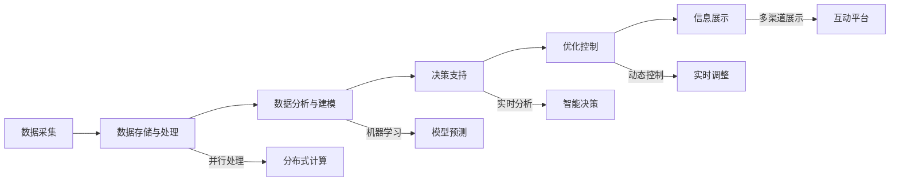

                 

## 1. 背景介绍

随着城市化进程的推进和交通出行需求的激增，智能交通系统逐渐成为城市管理的重要组成部分。通过采集、分析大规模交通数据，可以实时监控交通流量、优化信号灯控制、预测交通事故风险、改善道路使用效率等，为市民提供更安全、便捷、高效的出行体验。在这过程中，大数据技术扮演了关键角色，能够实现交通数据的全面收集和深入分析，为智能交通的决策提供有力支持。然而，交通系统的复杂性和动态性使得智能交通的数据获取和处理难度极大，如何通过数据驱动的方式提升交通管理水平，成为一个亟待解决的问题。

## 2. 核心概念与联系

### 2.1 核心概念概述

大数据在智能交通中的应用主要涉及以下几个关键概念：

- **智能交通系统**：通过集成现代信息技术和交通工程，实现交通系统运行状态监控、决策分析、资源调配、交通预测等功能，以提升道路交通运行效率和安全性的系统。
- **数据采集与处理**：智能交通系统需要采集大量交通数据，包括车辆位置、速度、流量、事故等，通过云计算、分布式存储、大数据分析等技术进行处理。
- **数据分析与建模**：通过大数据技术对交通数据进行深入分析，构建交通模型，识别交通特征和趋势，预测交通流量、优化信号控制、评估交通网络性能等。
- **信息差**：指智能交通系统中数据采集、处理、传输和展示的全链条中存在的信息不对称问题，导致信息不一致、延迟或缺失，进而影响决策和服务的质量。

以上几个概念相互关联，构成了一个闭环的数据流系统。通过数据采集与处理、数据分析与建模，以及信息差管理，智能交通系统能够实时监控交通状态、预测未来趋势，并做出有效决策，优化交通运行效率和安全性。

### 2.2 核心概念原理和架构的 Mermaid 流程图



## 3. 核心算法原理 & 具体操作步骤

### 3.1 算法原理概述

大数据在智能交通中的应用，核心在于通过大规模数据驱动的决策分析，提升交通系统的运行效率和安全性。其算法原理主要包括以下几个方面：

- **数据采集与处理**：智能交通系统通过传感器、视频监控、GPS等手段实时采集交通数据，并利用分布式存储和大数据技术进行数据清洗、预处理和存储。
- **数据分析与建模**：利用机器学习和数据挖掘技术，对交通数据进行分析，构建交通模型，提取交通特征，预测交通流量，优化信号控制等。
- **信息差管理**：通过信息差监控和分析，及时识别数据采集、处理、传输和展示过程中存在的问题，并采取措施解决，提升数据的一致性和及时性。

### 3.2 算法步骤详解

智能交通系统的大数据应用主要包括以下步骤：

1. **数据采集与预处理**：利用传感器、摄像头、GPS等设备实时采集交通数据，包括车辆位置、速度、流量、事故等信息，并进行初步清洗和预处理，去除噪声和异常值。
2. **数据存储与分布式计算**：采用分布式存储和计算技术，如Hadoop、Spark等，将大规模交通数据存储在分布式文件系统中，并进行并行计算和分析。
3. **数据分析与建模**：利用机器学习和数据挖掘算法，如随机森林、神经网络、时间序列分析等，对交通数据进行深入分析，构建交通模型，识别交通特征和趋势。
4. **信息差监控与处理**：通过信息差管理算法，实时监控数据采集、处理、传输和展示过程中存在的信息不对称问题，如数据延迟、不完整等，并采取措施解决。
5. **决策支持与优化控制**：基于分析结果，利用智能决策算法，如动态优化算法、路径规划算法等，实时调整交通信号控制策略，优化交通运行。
6. **信息展示与反馈**：通过多渠道展示平台，如电子屏幕、手机APP、智能导航等，实时展示交通运行状态和决策建议，并收集用户反馈，进一步优化智能交通系统。

### 3.3 算法优缺点

大数据在智能交通中的应用具有以下优点：

- **实时性**：大数据技术支持实时数据采集和处理，能够实时监控交通状态，快速响应交通事件。
- **全面性**：通过分布式存储和大数据技术，能够全面收集和处理海量交通数据，涵盖多种交通参与者的行为信息。
- **精准性**：利用机器学习和数据分析技术，能够精准预测交通流量、优化信号控制，提高交通运行效率。

但同时也存在以下缺点：

- **数据噪声**：交通数据中存在大量噪声和异常值，需要复杂的预处理算法进行清洗和过滤。
- **计算资源消耗**：大规模交通数据的存储和处理需要大量计算资源，可能导致成本高昂。
- **隐私与安全问题**：交通数据涉及个人隐私，需采取严格的隐私保护措施，防止数据泄露和滥用。

### 3.4 算法应用领域

大数据在智能交通中的应用广泛，涵盖以下几个主要领域：

1. **交通流量预测**：利用时间序列分析和大数据技术，预测未来的交通流量，优化交通信号控制策略。
2. **路径规划与导航**：通过数据分析和机器学习算法，推荐最优路径，提供智能导航服务。
3. **事故预测与预警**：利用大数据和机器学习模型，预测交通事故发生概率，提前进行预警和预防。
4. **交通信号优化**：通过分析交通数据，实时调整信号灯控制策略，提升交通运行效率。
5. **交通需求分析**：利用大数据技术，分析交通需求变化趋势，优化交通资源配置。

## 4. 数学模型和公式 & 详细讲解 & 举例说明

### 4.1 数学模型构建

交通流量预测是智能交通系统中的核心任务之一。基于大数据的交通流量预测模型通常包括以下几个部分：

- **输入层**：输入历史交通流量数据、天气状况、节假日、事件等信息。
- **隐藏层**：采用多层神经网络，对输入数据进行特征提取和转换。
- **输出层**：输出未来时间段的交通流量预测值。

### 4.2 公式推导过程

假设有一个交通流量预测模型，其输入数据为 $x_1, x_2, ..., x_n$，输出预测结果为 $y$。模型采用三层神经网络，其中第一层为输入层，第二层为隐藏层，第三层为输出层。设 $f$ 为隐藏层激活函数，$g$ 为输出层激活函数。则模型的预测公式为：

$$
y = g\left(W_3 \cdot f\left(W_2 \cdot f\left(W_1 \cdot x\right)\right) + b_3\right)
$$

其中 $W_1, W_2, W_3$ 为神经网络的权重，$b_1, b_2, b_3$ 为偏置项。隐藏层激活函数 $f$ 通常采用ReLU函数，输出层激活函数 $g$ 则根据任务需求选择合适的函数，如sigmoid或softmax。

### 4.3 案例分析与讲解

以一个典型的城市交通流量预测模型为例，该模型采用LSTM神经网络，对历史交通流量数据进行建模，并预测未来小时流量。模型采用以下步骤：

1. 数据预处理：将原始交通流量数据进行归一化处理，去除噪声和异常值。
2. 特征工程：选择与交通流量相关的特征，如天气状况、节假日、事件等，作为模型的输入特征。
3. 模型构建：采用LSTM神经网络，构建三层模型，训练预测交通流量。
4. 模型评估：利用均方误差（MSE）和平均绝对误差（MAE）等指标，评估模型的预测效果。
5. 结果展示：将模型预测结果与实际流量进行对比，验证预测效果。

## 5. 项目实践：代码实例和详细解释说明

### 5.1 开发环境搭建

在智能交通大数据应用开发中，常用的开发环境包括：

- **Python**：作为主要编程语言，支持数据处理和建模。
- **TensorFlow**：支持分布式计算和大规模模型训练。
- **Hadoop**：支持大规模数据存储和分布式计算。
- **Kafka**：支持实时数据采集和传输。
- **Flume**：支持日志数据采集和传输。

### 5.2 源代码详细实现

以下是一个基于Python和TensorFlow的智能交通流量预测模型示例代码：

```python
import tensorflow as tf
from tensorflow.keras.layers import LSTM, Dense
from tensorflow.keras.models import Sequential
from sklearn.preprocessing import MinMaxScaler

# 数据预处理
scaler = MinMaxScaler()
train_data = scaler.fit_transform(train_data)
test_data = scaler.transform(test_data)

# 模型构建
model = Sequential()
model.add(LSTM(128, input_shape=(train_data.shape[1], 1), return_sequences=True))
model.add(LSTM(64))
model.add(Dense(1))
model.compile(optimizer='adam', loss='mse', metrics=['mae'])

# 模型训练
model.fit(train_data[:-10], train_data[-10:], epochs=10, batch_size=32, validation_data=(test_data[:-10], test_data[-10:]))

# 模型评估
mse, mae = model.evaluate(test_data[:-10], test_data[-10:], verbose=0)
print(f'Mean Squared Error: {mse:.2f}, Mean Absolute Error: {mae:.2f}')
```

### 5.3 代码解读与分析

在上述代码中，首先使用MinMaxScaler对数据进行归一化处理，然后采用LSTM神经网络构建流量预测模型，使用均方误差和平均绝对误差作为评估指标。通过训练和评估，可以得出模型在预测交通流量方面的效果。

## 6. 实际应用场景

### 6.1 智能交通管理

智能交通管理是大数据在智能交通中的应用核心之一。通过实时采集和分析交通数据，可以优化信号灯控制，改善道路使用效率，减少交通拥堵。例如，在交叉路口安装传感器和摄像头，实时监控车辆通行情况，并根据数据调整信号灯配时，提高交通流量。

### 6.2 智能导航与路径规划

利用大数据分析，可以为司机提供智能导航和路径规划服务。通过分析实时交通数据，推荐最优路径，避免拥堵路段，提升出行效率。例如，利用实时交通信息，推荐最佳行驶路线，避开事故高发路段。

### 6.3 事故预测与预警

利用大数据分析技术，可以预测交通事故发生概率，提前进行预警和预防。例如，通过分析历史交通事故数据和实时交通流量，预测交通事故高发时段和路段，并提前发布预警信息，避免事故发生。

### 6.4 未来应用展望

未来，大数据在智能交通中的应用将进一步扩展，涵盖更多领域和应用场景。例如：

- **智能停车管理**：通过大数据分析，优化停车资源配置，提供智能停车推荐和导航服务。
- **智能货运管理**：利用大数据和机器学习，优化货运路径，提高运输效率和安全性。
- **智能公交管理**：通过大数据分析，优化公交线路，提高公交运行效率，减少乘客等待时间。

## 7. 工具和资源推荐

### 7.1 学习资源推荐

- **《Python大数据开发实战》**：涵盖大数据技术在智能交通系统中的应用，包括数据采集、处理、分析等。
- **《TensorFlow实战》**：详细介绍了TensorFlow在大规模模型训练和智能交通系统中的应用。
- **《大数据技术与应用》**：系统介绍了大数据技术在智能交通系统中的应用。

### 7.2 开发工具推荐

- **Hadoop**：支持大规模数据存储和分布式计算。
- **TensorFlow**：支持分布式计算和大规模模型训练。
- **Apache Kafka**：支持实时数据采集和传输。
- **Flume**：支持日志数据采集和传输。
- **ElasticSearch**：支持大规模数据存储和搜索。

### 7.3 相关论文推荐

- **《智能交通系统中的大数据技术》**：介绍了大数据技术在智能交通系统中的应用。
- **《基于大数据的交通流量预测》**：详细介绍了利用大数据技术进行交通流量预测的方法。
- **《实时交通数据分析与优化》**：介绍了实时交通数据分析和优化的方法。

## 8. 总结：未来发展趋势与挑战

### 8.1 研究成果总结

本文系统介绍了大数据在智能交通中的应用，包括智能交通管理、智能导航与路径规划、事故预测与预警等。通过实时采集和分析大规模交通数据，智能交通系统能够优化信号控制，提供智能导航服务，预测交通事故，改善交通运行效率和安全性。

### 8.2 未来发展趋势

未来，大数据在智能交通中的应用将进一步拓展，涵盖更多领域和应用场景。例如，通过实时数据分析，优化停车管理、货运管理、公交管理等。同时，大数据技术将与人工智能、物联网等技术深度融合，构建更加智能化、高效化的交通系统。

### 8.3 面临的挑战

大数据在智能交通中的应用面临诸多挑战：

- **数据隐私与安全**：交通数据涉及个人隐私，需采取严格的隐私保护措施。
- **数据质量与准确性**：交通数据存在噪声和异常值，需要进行复杂的预处理和清洗。
- **计算资源消耗**：大规模数据存储和处理需要大量计算资源，可能导致成本高昂。
- **实时性要求高**：实时交通数据的处理和分析需保证高效性，以满足实时决策需求。

### 8.4 研究展望

未来，大数据在智能交通中的应用需要从以下几个方面进行深入研究：

- **数据隐私保护**：研究如何在大数据分析和应用过程中，保护个人隐私，防止数据泄露和滥用。
- **数据质量与准确性**：研究如何对交通数据进行有效的预处理和清洗，提高数据质量和准确性。
- **计算资源优化**：研究如何优化计算资源消耗，降低成本，提升系统效率。
- **实时性优化**：研究如何实现高效的数据采集和实时处理，满足实时决策需求。

总之，大数据在智能交通中的应用具有广阔前景，但需面对诸多挑战。通过深入研究和持续创新，相信能够构建更加智能化、高效化的智能交通系统，为人类交通出行带来革命性变化。

## 9. 附录：常见问题与解答

**Q1: 智能交通系统中，大数据的作用是什么？**

A: 在大数据技术的支持下，智能交通系统能够实时采集和分析大规模交通数据，从而优化信号控制，改善道路使用效率，预测交通事故，提高交通运行效率和安全性。

**Q2: 大数据在智能交通中的应用，如何保证数据隐私和安全？**

A: 交通数据涉及个人隐私，需采取严格的隐私保护措施，如数据脱敏、访问控制、加密传输等，防止数据泄露和滥用。

**Q3: 大数据在智能交通中的应用，如何处理数据噪声和异常值？**

A: 交通数据中存在噪声和异常值，需要进行复杂的预处理和清洗，如数据归一化、去重、异常值检测等。

**Q4: 大数据在智能交通中的应用，如何优化计算资源消耗？**

A: 通过分布式计算和优化算法，如梯度累积、混合精度训练等，降低计算资源消耗，提升系统效率。

**Q5: 大数据在智能交通中的应用，如何实现实时性优化？**

A: 通过高效的算法设计和硬件优化，如优化模型结构、并行计算、GPU加速等，实现数据采集和处理的实时性。

---

作者：禅与计算机程序设计艺术 / Zen and the Art of Computer Programming

