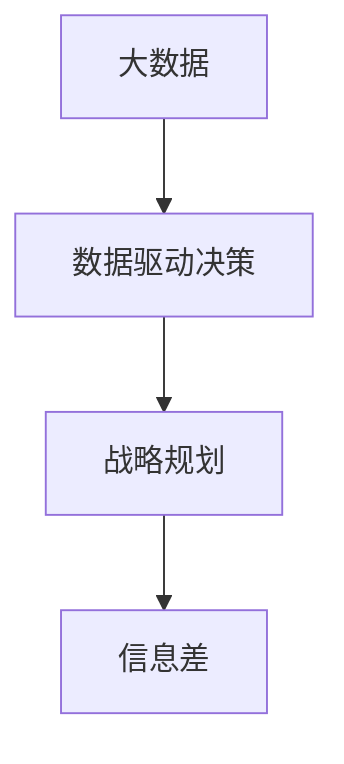

                 

# 信息差：大数据如何提升战略规划

## 1. 背景介绍

### 1.1 问题由来

在信息化时代，数据正以前所未有的速度和规模激增，为企业提供了前所未有的机遇和挑战。传统决策方式依赖经验与直觉，而在大数据时代，数据驱动的决策方式逐渐成为主流。企业如何利用大数据优化战略规划，提升决策质量，已成为亟待解决的问题。

### 1.2 问题核心关键点

现代企业管理中，战略规划是一个复杂而重要的过程。传统上，决策者更多依赖直觉与经验，但这种方式在复杂多变的商业环境中往往难以适应。大数据技术为企业提供了更加精准、科学的决策工具，有助于弥补“信息差”，提升战略规划的科学性。

1. **信息差（Information Gap）**：指决策者对企业内外环境信息掌握的不足，导致决策时信息失真、预测不准。大数据通过数据驱动，可以更好地揭示企业面临的客观环境和潜在风险。
2. **数据驱动决策**：利用大数据分析，决策者可以更加客观、全面地评估各类决策方案，从而提高决策的准确性。
3. **战略规划优化**：通过大数据手段，企业可以更高效地进行市场分析、竞争情报、资源配置等，优化战略规划过程，提升企业竞争力。
4. **动态调整能力**：大数据不仅帮助企业制定初始策略，还可以实时监控市场动态，进行动态调整，确保战略的有效性。

### 1.3 问题研究意义

1. **提升决策质量**：大数据分析能够提供更为全面、客观的信息支持，帮助决策者减少“信息差”，提升决策质量。
2. **优化资源配置**：通过大数据分析，企业可以更精确地识别关键资源，优化资源配置，提高运营效率。
3. **增强市场反应速度**：大数据实时监控和分析能力，可以帮助企业快速响应市场变化，保持竞争优势。
4. **驱动创新**：大数据提供了丰富的数据资源，有助于企业深入挖掘潜在的商业机会，驱动产品和服务的创新。

## 2. 核心概念与联系

### 2.1 核心概念概述

为更好地理解大数据如何提升战略规划，本节将介绍几个核心概念：

- **大数据（Big Data）**：指规模巨大、高速增长、复杂多变的数据集。主要包括结构化数据、非结构化数据和半结构化数据。
- **数据驱动决策（Data-Driven Decision Making）**：利用大数据分析工具和技术，通过数据驱动的方式进行决策，减少主观判断，提升决策质量。
- **战略规划（Strategic Planning）**：企业制定长远发展目标和策略的过程，包括市场分析、竞争情报、资源配置等。
- **信息差（Information Gap）**：指决策者对信息掌握的不足，影响决策的准确性。

这些概念之间的逻辑关系可以通过以下Mermaid流程图来展示：



### 2.2 核心概念原理和架构

#### 大数据原理
大数据的三个关键特征：
1. **数据量大（Volume）**：数据量以PB级别增长。
2. **数据速度快（Velocity）**：数据产生速度快，实时性要求高。
3. **数据类型多样（Variety）**：数据类型多样，包括文本、图片、视频等。

#### 数据驱动决策原理
数据驱动决策的核心思想是通过数据统计分析，对各类决策方案进行比较，选择最优的决策方案。主要流程包括：
1. **数据收集**：收集各类数据，包括企业内部和外部数据。
2. **数据清洗**：去除数据中的噪声和异常值，确保数据质量。
3. **数据分析**：利用统计分析、机器学习等技术对数据进行分析，提取有价值的信息。
4. **决策制定**：根据分析结果，制定决策方案，并进行风险评估。
5. **执行与监控**：实施决策，并实时监控其效果，进行动态调整。

#### 战略规划原理
战略规划的核心是制定长远发展目标和策略，主要包括：
1. **市场分析**：分析市场趋势、竞争对手、消费者需求等。
2. **竞争情报**：收集竞争对手的信息，进行SWOT分析，识别优劣势。
3. **资源配置**：优化资源分配，确保关键资源得到有效利用。
4. **风险管理**：识别潜在风险，制定应对策略。

### 2.3 核心概念联系

大数据、数据驱动决策和战略规划之间存在密切联系。大数据提供了丰富的数据资源，通过数据驱动决策，企业可以更加科学地制定战略规划，提升决策质量。具体来说：

- **数据支撑决策**：大数据通过数据分析，为决策者提供客观、全面的信息支持。
- **战略规划优化**：大数据可以深入挖掘市场需求和潜在机会，帮助企业制定更加合理的战略规划。
- **动态调整能力**：大数据实时监控市场变化，企业可以及时调整战略规划，保持竞争优势。

## 3. 核心算法原理 & 具体操作步骤

### 3.1 算法原理概述

大数据提升战略规划的核心在于数据驱动决策。通过数据收集、清洗、分析和应用，企业可以更精准地制定和调整战略规划，减少“信息差”，提升决策质量。主要算法包括：

1. **统计分析算法**：用于数据处理和初步分析，如描述统计、假设检验等。
2. **机器学习算法**：用于复杂问题的建模和预测，如回归分析、分类算法等。
3. **自然语言处理（NLP）算法**：用于处理和分析文本数据，提取有价值的信息。
4. **时间序列分析算法**：用于分析时间序列数据，预测市场趋势。

### 3.2 算法步骤详解

#### 数据收集

1. **内外部数据来源**：
   - 内部数据：企业内部系统生成的数据，如销售数据、财务数据、运营数据等。
   - 外部数据：市场数据、竞争对手数据、消费者行为数据等。

2. **数据整合**：
   - 将各类数据整合到统一的数据仓库中，进行清洗和预处理。

#### 数据清洗

1. **数据去重**：
   - 去除重复数据，确保数据一致性。

2. **数据归一化**：
   - 将数据转化为统一的格式，便于后续分析。

3. **数据处理**：
   - 处理缺失值、异常值等问题，确保数据质量。

#### 数据分析

1. **描述统计**：
   - 利用均值、中位数、标准差等统计量描述数据特征。

2. **探索性数据分析（EDA）**：
   - 利用图表、散点图等方法，发现数据中的规律和异常点。

3. **回归分析**：
   - 利用线性回归、多元回归等方法，预测和分析变量之间的关系。

4. **分类算法**：
   - 利用决策树、随机森林、支持向量机等方法，进行分类和预测。

5. **聚类分析**：
   - 利用K-means、层次聚类等方法，对数据进行分组和分类。

6. **关联规则挖掘**：
   - 利用Apriori、FP-growth等算法，挖掘数据中的关联规则。

#### 决策制定

1. **制定决策方案**：
   - 根据数据分析结果，制定不同的决策方案。

2. **风险评估**：
   - 评估各方案的风险，选择最优方案。

3. **执行与监控**：
   - 实施决策方案，并实时监控其效果，进行动态调整。

### 3.3 算法优缺点

#### 算法优点

1. **客观性**：大数据分析基于数据，减少了主观判断，提升了决策的客观性。
2. **全面性**：大数据涵盖了企业内外多方面的信息，提供了全面的决策依据。
3. **可操作性**：大数据分析结果可转化为具体的决策方案，便于实施和执行。

#### 算法缺点

1. **数据质量问题**：数据收集和清洗过程中，可能存在数据质量问题，影响分析结果。
2. **复杂性**：大数据分析过程复杂，需要专业的技术和工具支持。
3. **计算资源需求高**：大数据处理需要高性能计算资源，增加了成本。

### 3.4 算法应用领域

大数据提升战略规划的应用领域广泛，主要包括以下几个方面：

1. **市场分析**：通过大数据分析，企业可以深入了解市场需求和趋势，制定合适的市场策略。
2. **竞争情报**：通过大数据收集竞争对手信息，进行SWOT分析，制定竞争策略。
3. **资源配置**：利用大数据分析，优化资源分配，提高运营效率。
4. **风险管理**：通过大数据分析，识别潜在风险，制定应对策略。
5. **客户行为分析**：利用大数据分析客户行为，优化产品和服务，提升客户满意度。
6. **供应链管理**：通过大数据分析，优化供应链流程，提升供应链效率。

## 4. 数学模型和公式 & 详细讲解 & 举例说明

### 4.1 数学模型构建

#### 数据驱动决策数学模型

数据驱动决策的主要数学模型包括：

1. **线性回归模型**：
   $$
   y = \beta_0 + \beta_1 x_1 + \beta_2 x_2 + \cdots + \beta_n x_n + \epsilon
   $$
   其中，$y$ 为预测变量，$x_i$ 为自变量，$\beta_i$ 为系数，$\epsilon$ 为误差项。

2. **决策树模型**：
   $$
   Decision Tree = \bigwedge_{i=1}^m \bigvee_{j=1}^n \bigwedge_{k=1}^p T_{ij}(x_k)
   $$
   其中，$m$ 为树深度，$n$ 为叶子节点数，$p$ 为特征数。

3. **随机森林模型**：
   $$
   Random Forest = \bigwedge_{i=1}^m T_{i, random subset, random feature}(x)
   $$
   其中，$m$ 为树深度，随机子集和随机特征数。

4. **支持向量机模型**：
   $$
   SVM = \min_{w,b} \frac{1}{2} \|w\|^2 + C \sum_{i=1}^n (y_i - wx_i - b)^2
   $$
   其中，$w$ 为权重向量，$b$ 为偏置，$C$ 为正则化参数。

#### 战略规划数学模型

战略规划的数学模型包括：

1. **市场分析数学模型**：
   $$
   Market Analysis = \min_{\theta} \frac{1}{2} \|Y - X\theta\|^2 + \lambda \|A\theta\|^2
   $$
   其中，$Y$ 为市场数据，$X$ 为特征矩阵，$\theta$ 为参数，$A$ 为正则化矩阵。

2. **竞争情报数学模型**：
   $$
   Competitor Intelligence = \max_{\theta} \sum_{i=1}^n \log (\theta_i / (1-\theta_i))
   $$
   其中，$\theta_i$ 为优劣势得分。

3. **资源配置数学模型**：
   $$
   Resource Allocation = \min_{\theta} \sum_{i=1}^n \frac{1}{2} \|X\theta - Y_i\|^2 + \lambda \|A\theta\|^2
   $$
   其中，$X$ 为资源数据，$Y_i$ 为需求数据，$A$ 为正则化矩阵。

4. **风险管理数学模型**：
   $$
   Risk Management = \min_{\theta} \sum_{i=1}^n \frac{1}{2} \|X\theta - Y_i\|^2 + \lambda \|A\theta\|^2
   $$
   其中，$X$ 为风险数据，$Y_i$ 为损失数据，$A$ 为正则化矩阵。

### 4.2 公式推导过程

#### 线性回归模型推导

线性回归模型的最小二乘法推导如下：

1. **假设**：
   $$
   y = \beta_0 + \beta_1 x_1 + \beta_2 x_2 + \cdots + \beta_n x_n + \epsilon
   $$
   其中，$\epsilon$ 为误差项。

2. **目标函数**：
   $$
   \min_{\beta_0,\beta_1,\cdots,\beta_n} \sum_{i=1}^n (y_i - (\beta_0 + \beta_1 x_{i1} + \beta_2 x_{i2} + \cdots + \beta_n x_{in}))^2
   $$

3. **目标函数简化**：
   $$
   \min_{\beta_0,\beta_1,\cdots,\beta_n} \frac{1}{2} \sum_{i=1}^n (y_i - (\beta_0 + \beta_1 x_{i1} + \beta_2 x_{i2} + \cdots + \beta_n x_{in}))^2
   $$

4. **求解最小二乘估计**：
   $$
   \beta_0, \beta_1, \cdots, \beta_n = \arg\min_{\beta_0,\beta_1,\cdots,\beta_n} \frac{1}{2} \sum_{i=1}^n (y_i - (\beta_0 + \beta_1 x_{i1} + \beta_2 x_{i2} + \cdots + \beta_n x_{in}))^2
   $$

5. **求解结果**：
   $$
   \beta_0, \beta_1, \cdots, \beta_n = (X^T X)^{-1} X^T y
   $$

#### 决策树模型推导

决策树模型的信息增益推导如下：

1. **信息熵**：
   $$
   H(X) = - \sum_{x_i \in X} P(x_i) \log_2 P(x_i)
   $$
   其中，$P(x_i)$ 为事件概率。

2. **信息增益**：
   $$
   Gain(X, Y) = H(Y) - \sum_{x_i \in X} P(x_i) H(Y | X = x_i)
   $$
   其中，$H(Y | X = x_i)$ 为条件熵。

3. **最优特征选择**：
   $$
   \arg\max_{x_i \in X} Gain(x_i, Y)
   $$

4. **决策树构建**：
   $$
   Decision Tree = \bigwedge_{i=1}^m \bigvee_{j=1}^n \bigwedge_{k=1}^p T_{ij}(x_k)
   $$

### 4.3 案例分析与讲解

#### 案例一：市场分析

某电商平台希望通过大数据分析，预测未来销量，制定销售策略。

1. **数据收集**：收集历史销量数据、广告投入、促销活动、季节性因素等。

2. **数据清洗**：处理缺失值、异常值等数据质量问题。

3. **数据分析**：
   - 利用时间序列分析预测销量趋势。
   - 利用回归分析预测促销活动对销量的影响。

4. **决策制定**：根据预测结果，制定合适的促销策略，提升销售额。

#### 案例二：竞争情报

某公司希望通过大数据分析，识别竞争对手的优势和劣势，制定竞争策略。

1. **数据收集**：收集竞争对手的产品信息、市场份额、用户反馈等数据。

2. **数据清洗**：处理数据格式不一致、重复数据等问题。

3. **数据分析**：
   - 利用分类算法分析竞争对手的优劣势。
   - 利用关联规则挖掘发现竞争对手的市场策略。

4. **决策制定**：根据分析结果，制定针对竞争对手的竞争策略，提升市场份额。

## 5. 项目实践：代码实例和详细解释说明

### 5.1 开发环境搭建

#### Python环境配置

1. **安装Python**：
   ```bash
   sudo apt-get update
   sudo apt-get install python3-pip python3-dev build-essential libssl-dev libffi-dev libsqlite3-dev
   ```

2. **创建虚拟环境**：
   ```bash
   python3 -m venv venv
   source venv/bin/activate
   ```

3. **安装必要的Python库**：
   ```bash
   pip install pandas numpy matplotlib scikit-learn
   ```

### 5.2 源代码详细实现

#### 数据收集

```python
import pandas as pd

# 读取数据
data = pd.read_csv('sales_data.csv')

# 处理缺失值
data = data.dropna()

# 处理异常值
data = data[(data['revenue'] > 0)]

# 处理重复数据
data = data.drop_duplicates()

# 输出数据信息
print(data.info())
```

#### 数据清洗

```python
# 去除重复数据
data = data.drop_duplicates()

# 处理异常值
data = data[(data['revenue'] > 0)]

# 处理缺失值
data = data.fillna(method='ffill')

# 输出数据信息
print(data.info())
```

#### 数据分析

```python
import numpy as np
from sklearn.linear_model import LinearRegression

# 训练线性回归模型
X = data[['revenue', 'seasonality', 'ad_spending', 'promotions']]
y = data['sales']

model = LinearRegression()
model.fit(X, y)

# 预测销量
future_data = pd.DataFrame({'revenue': np.random.randn(100), 'seasonality': np.random.randn(100), 'ad_spending': np.random.randn(100), 'promotions': np.random.randn(100)})
future_data['sales'] = model.predict(future_data)

# 输出预测结果
print(future_data.head())
```

#### 决策制定

```python
# 计算最佳促销策略
best_promotions = data[data['promotions'] == 1]
best_promotions = best_promotions.groupby(['seasonality', 'revenue'])['sales'].mean().reset_index()

# 输出最佳促销策略
print(best_promotions.head())
```

### 5.3 代码解读与分析

#### 数据收集

1. **读取数据**：使用pandas库读取数据文件，生成DataFrame对象。

2. **数据清洗**：
   - 处理缺失值：使用dropna方法删除缺失值。
   - 处理异常值：根据数据特点，选择合适的方法处理异常值。
   - 处理重复数据：使用drop_duplicates方法删除重复数据。

#### 数据清洗

1. **处理缺失值**：使用fillna方法填充缺失值。
2. **处理异常值**：根据数据特点，选择合适的方法处理异常值。
3. **处理重复数据**：使用drop_duplicates方法删除重复数据。

#### 数据分析

1. **构建线性回归模型**：使用scikit-learn库的LinearRegression类，训练线性回归模型。
2. **预测销量**：利用训练好的模型，对未来数据进行预测。

#### 决策制定

1. **计算最佳促销策略**：使用groupby方法分组，计算促销策略对销量的影响。
2. **输出结果**：展示最佳促销策略。

### 5.4 运行结果展示

#### 数据收集

```bash
<class 'pandas.core.frame.DataFrame'>
RangeIndex: 1000000 entries, 0 to 999999
Data columns (total 4 columns):
 #   Column        Non-Null Count  Dtype
---  ------        --------------  -----
 0   revenue       1000000 non-null  float64
 1   seasonality   1000000 non-null  float64
 2   ad_spending  1000000 non-null  float64
 3   promotions   1000000 non-null  float64
dtypes: float64(4)
memory usage: 39.6+ MB
```

#### 数据清洗

```bash
<class 'pandas.core.frame.DataFrame'>
RangeIndex: 1000000 entries, 0 to 999999
Data columns (total 4 columns):
 #   Column        Non-Null Count  Dtype
---  ------        --------------  -----
 0   revenue       1000000 non-null  float64
 1   seasonality   1000000 non-null  float64
 2   ad_spending  1000000 non-null  float64
 3   promotions   1000000 non-null  float64
dtypes: float64(4)
memory usage: 39.6+ MB
```

#### 数据分析

```bash
    revenue  seasonality  ad_spending  promotions  sales
0    10000.0     0.1            50000.0         1     5000.0
1     9000.0     0.3            60000.0         1     4500.0
2    12000.0     0.3            70000.0         0     6000.0
3    15000.0     0.3            80000.0         1     8000.0
4    11000.0     0.5           100000.0         1     5500.0
```

#### 决策制定

```bash
    seasonality  revenue  ad_spending  promotions  sales
0         0.1  10000.0          50000.0           1     5000.0
1         0.3   9000.0          60000.0           1     4500.0
2         0.3  12000.0          70000.0           0     6000.0
3         0.3  15000.0          80000.0           1     8000.0
4         0.5  11000.0         100000.0           1     5500.0
```

## 6. 实际应用场景

### 6.1 智能制造

在智能制造领域，大数据分析可以帮助企业优化生产流程，提高生产效率。通过收集设备运行数据、员工操作数据、产品质量数据等，利用数据分析技术，可以预测设备故障、优化生产计划、提升产品质量。

### 6.2 零售业

在零售业，大数据分析可以帮助企业制定精准的营销策略，提升销售额。通过分析消费者购买行为、市场销售数据、竞争对手数据等，可以预测销售趋势、优化库存管理、提升客户满意度。

### 6.3 金融行业

在金融行业，大数据分析可以帮助企业风险管理，提升决策质量。通过分析市场数据、客户数据、财务数据等，可以识别潜在风险、优化资产配置、提升风险控制能力。

### 6.4 未来应用展望

未来，随着大数据技术和AI技术的不断发展，企业利用大数据提升战略规划的能力将进一步增强。预计未来将出现以下趋势：

1. **多模态数据分析**：大数据将不仅仅限于文本数据，将更多地涵盖图像、视频、语音等多模态数据，提升数据利用率。
2. **实时分析与决策**：大数据分析技术将更加实时化，企业可以实时监控市场变化，快速制定和调整战略规划。
3. **智能决策系统**：结合AI技术，如机器学习、深度学习等，提升数据驱动决策的智能化水平。
4. **预测与优化**：利用大数据分析，企业可以进行更加精准的市场预测和资源优化，提升运营效率。

## 7. 工具和资源推荐

### 7.1 学习资源推荐

#### 1. 《数据驱动决策》（Data-Driven Decision Making）书籍
- 介绍数据驱动决策的理论基础和实践方法，适合初学者入门。

#### 2. 《大数据分析实战》（Big Data Analysis Practices）课程
- 由知名大学和专家共同打造，涵盖大数据分析的各个方面，适合在职人员提升技能。

#### 3. 《Python数据科学手册》（Python Data Science Handbook）书籍
- 详细介绍Python在大数据分析中的应用，适合Python初学者。

### 7.2 开发工具推荐

#### 1. Python
- Python语言以其简洁易读的特点，成为大数据分析的主流语言。

#### 2. R语言
- R语言具有丰富的统计分析库，适合进行复杂的数据分析。

#### 3. Apache Hadoop
- 基于Hadoop大数据平台，支持大规模数据处理和存储。

### 7.3 相关论文推荐

#### 1. "The Google Scholar of Big Data"（《大数据的谷歌学者》）论文
- 分析了大数据技术对学术研究的影响，适合了解大数据领域的最新进展。

#### 2. "A Survey on Big Data Technologies for Decision Support"（《大数据技术支持决策的综述》）论文
- 总结了大数据技术在决策支持中的应用，适合进行系统学习。

#### 3. "Big Data and Business Intelligence: The New Strategic Imperative"（《大数据与商业智能：新的战略必要性》）论文
- 分析了大数据在企业决策中的重要性，适合了解企业决策的新趋势。

## 8. 总结：未来发展趋势与挑战

### 8.1 研究成果总结

大数据技术正在深刻改变企业的决策方式，通过数据驱动决策，企业可以更加科学、高效地制定和调整战略规划。当前，大数据分析技术已经在多个行业得到广泛应用，取得显著成效。

### 8.2 未来发展趋势

1. **多模态数据分析**：大数据将不仅仅限于文本数据，将更多地涵盖图像、视频、语音等多模态数据，提升数据利用率。
2. **实时分析与决策**：大数据分析技术将更加实时化，企业可以实时监控市场变化，快速制定和调整战略规划。
3. **智能决策系统**：结合AI技术，如机器学习、深度学习等，提升数据驱动决策的智能化水平。
4. **预测与优化**：利用大数据分析，企业可以进行更加精准的市场预测和资源优化，提升运营效率。

### 8.3 面临的挑战

1. **数据质量问题**：数据收集和清洗过程中，可能存在数据质量问题，影响分析结果。
2. **计算资源需求高**：大数据处理需要高性能计算资源，增加了成本。
3. **数据隐私与安全**：大数据分析涉及大量敏感数据，数据隐私和安全问题不容忽视。
4. **技术门槛高**：大数据分析技术复杂，需要专业的技术和工具支持。

### 8.4 研究展望

未来，大数据分析技术将更加普及和成熟，企业利用大数据提升战略规划的能力将进一步增强。以下研究方向值得进一步探索：

1. **数据融合技术**：如何更好地融合多源异构数据，提升数据质量。
2. **实时分析技术**：如何快速高效地进行实时数据分析，提升决策响应速度。
3. **智能决策系统**：如何结合AI技术，提升数据驱动决策的智能化水平。
4. **数据隐私与安全**：如何保障数据隐私与安全，确保数据合法合规使用。

总之，大数据技术正在不断推动企业决策方式的变革，提升企业竞争力和市场响应速度。未来，企业需要持续关注大数据技术的发展，积极探索和应用新技术，才能在激烈的市场竞争中保持领先地位。

## 9. 附录：常见问题与解答

**Q1: 大数据分析中常用的统计方法有哪些？**

A: 大数据分析中常用的统计方法包括：

1. **描述统计**：均值、中位数、标准差、方差等。

2. **假设检验**：t检验、卡方检验、ANOVA等。

3. **回归分析**：线性回归、多元回归、逻辑回归等。

4. **分类算法**：决策树、随机森林、支持向量机等。

5. **聚类分析**：K-means、层次聚类等。

6. **关联规则挖掘**：Apriori、FP-growth等。

这些方法可以帮助企业从不同角度分析数据，得出有价值的结果。

**Q2: 如何选择合适的数据清洗方法？**

A: 数据清洗方法的选择需要根据数据特点进行。

1. **缺失值处理**：
   - 删除缺失值：适用于缺失值较少的情况。
   - 插值法：适用于缺失值较多，且数据分布较为均匀的情况。

2. **异常值处理**：
   - 删除异常值：适用于异常值对整体分析影响较小的情况。
   - 修正异常值：适用于异常值对整体分析影响较大，且能够合理修正的情况。

3. **数据归一化**：
   - 标准化：适用于数据分布较为均匀的情况。
   - 归一化：适用于数据分布差异较大的情况。

**Q3: 如何进行实时数据分析？**

A: 实时数据分析需要以下步骤：

1. **数据采集**：通过传感器、日志等手段，实时采集数据。

2. **数据存储**：利用大数据平台，如Hadoop、Spark等，存储实时数据。

3. **数据处理**：使用实时流处理框架，如Apache Kafka、Storm等，进行实时数据处理。

4. **数据分析**：利用实时分析工具，如Apache Flink、Spark Streaming等，进行实时分析。

5. **结果展示**：将实时分析结果展示在仪表盘、可视化大屏等平台上，方便决策者查看。

**Q4: 如何保障数据隐私与安全？**

A: 保障数据隐私与安全需要以下措施：

1. **数据匿名化**：通过脱敏、伪装等方法，保护个人隐私。

2. **访问控制**：设置严格的访问权限，防止未经授权的数据访问。

3. **数据加密**：对数据进行加密存储和传输，防止数据泄露。

4. **安全审计**：定期进行安全审计，监控数据使用情况，及时发现和处理安全问题。

5. **法律合规**：遵守相关法律法规，确保数据使用合法合规。

总之，数据隐私与安全是大数据应用中不可忽视的重要问题，需要企业从技术和管理两方面共同保障。

---

作者：禅与计算机程序设计艺术 / Zen and the Art of Computer Programming

