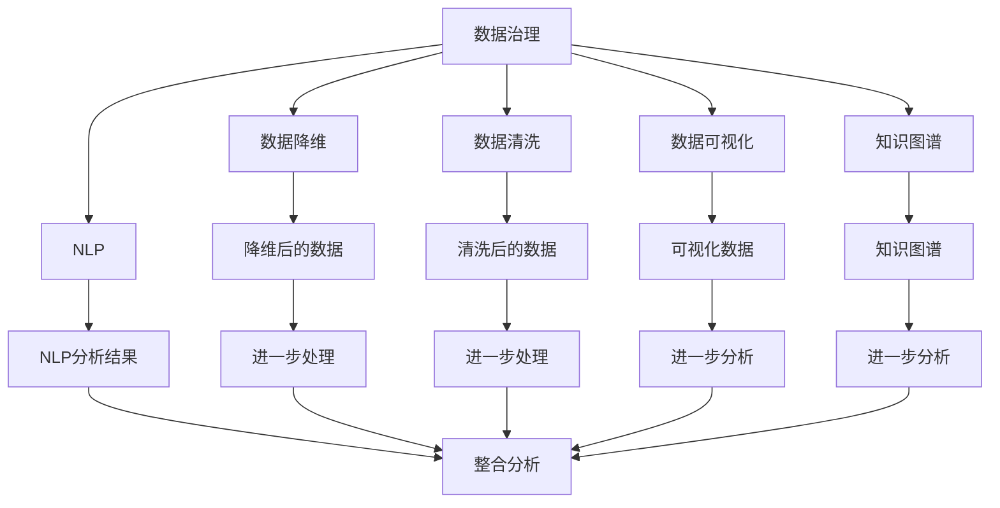

                 

# 信息简化的原则与艺术：在混乱中建立秩序与简化

> 关键词：信息简化, 数据治理, 数据降维, 数据清洗, 数据可视化, 知识图谱, 自然语言处理

## 1. 背景介绍

### 1.1 问题由来
在信息化高度发达的现代社会，数据成为了一切决策和创新的基石。然而，数据量的爆炸式增长也带来了数据质量参差不齐、数据维度过高等问题，给数据的处理和使用带来了巨大的挑战。如何在海量的、杂乱无章的数据中提取出有用的信息，是信息时代每一个从业人员都需要面对的问题。信息简化的原则与艺术，就是在这种背景下诞生的，它旨在通过系统性的方法，将复杂的数据和信息，转化为便于理解和使用的形式。

### 1.2 问题核心关键点
信息简化的核心在于理解信息的目标和受众，然后通过合理的数据处理、数据清洗和数据可视化等技术手段，将复杂的原始数据转化为简单、明确、易于理解的形式。该过程通常包括以下几个关键步骤：

1. 数据预处理：包括数据清洗、数据降维、特征选择等，确保数据的准确性和可靠性。
2. 数据可视化：利用图表、热图等手段，直观展示数据的变化和趋势。
3. 知识图谱构建：将数据转化为有结构的知识图谱，便于进行深入分析。
4. 自然语言处理：利用文本分析和情感分析等技术，从文本数据中提取有价值的信息。
5. 信息整合与简化：将多源异构的数据进行整合，提取关键信息，形成简明的结论和报告。

信息简化技术的有效应用，可以帮助企业在数据驱动的决策中占据优势，提高运营效率，降低成本。

### 1.3 问题研究意义
理解信息简化的原则与艺术，对于提高企业的数据治理水平、优化决策流程、提升客户满意度等方面具有重要意义。在快速变化的市场环境中，信息简化的应用不仅能够帮助企业快速响应市场变化，还能通过精准的数据洞察，发现新的商业机会，推动业务的创新和发展。

## 2. 核心概念与联系

### 2.1 核心概念概述

为了更好地理解信息简化的过程，我们首先需要了解几个核心概念：

- **数据治理(Data Governance)**：通过标准化和规范化的数据管理，确保数据的准确性、完整性和一致性，是信息简化技术的基础。
- **数据降维(Data Reduction)**：通过降维技术，减少数据维度，去除冗余信息，提升数据处理效率和精度。
- **数据清洗(Data Cleaning)**：清洗数据中的噪声和异常值，确保数据质量，提高数据处理效果。
- **数据可视化(Data Visualization)**：利用图表、热图等手段，直观展示数据的变化和趋势，便于理解和分析。
- **知识图谱(Knowledge Graph)**：通过构建知识图谱，将数据转化为有结构的知识形式，便于进行深入分析和知识管理。
- **自然语言处理(Natural Language Processing, NLP)**：利用文本分析和情感分析等技术，从文本数据中提取有价值的信息。

这些核心概念之间的逻辑关系可以通过以下Mermaid流程图来展示：



这个流程图展示了大数据处理过程中的各个环节及其相互关系：

1. 数据治理作为基础，保证了数据的质量和可靠性。
2. 数据降维和数据清洗分别从数据维度和数据噪声两个方面提升数据处理效果。
3. 数据可视化和知识图谱分别从直观展示和结构化分析两个角度，辅助决策者理解数据。
4. NLP技术从文本数据中提取有价值的信息，进一步丰富数据资源。
5. 最后，通过整合分析，形成简明易懂的结论和报告，帮助决策者进行判断和决策。

## 3. 核心算法原理 & 具体操作步骤
### 3.1 算法原理概述

信息简化的核心算法原理主要包括数据治理、数据降维、数据清洗、数据可视化和知识图谱构建等技术手段。以下将逐一介绍这些核心算法的原理和具体操作步骤。

### 3.2 算法步骤详解

#### 3.2.1 数据治理

数据治理的目标是确保数据的质量、一致性和可用性。具体步骤包括：

1. **数据规范制定**：根据业务需求，制定数据规范，包括数据格式、数据类型、数据精度等，确保数据的一致性。
2. **数据质量评估**：使用数据质量评估工具，检测数据中的错误、缺失、重复等质量问题。
3. **数据整合**：通过ETL工具，将不同来源的数据进行整合，确保数据的一致性和完整性。

#### 3.2.2 数据降维

数据降维的目的是减少数据的维度，去除冗余信息，提升数据处理效率和精度。具体步骤包括：

1. **PCA算法**：使用主成分分析(PCA)算法，通过计算数据的协方差矩阵，找到数据中的主要成分，去除冗余信息。
2. **t-SNE算法**：使用t分布随机邻域嵌入(t-SNE)算法，将高维数据映射到低维空间，保留关键信息。

#### 3.2.3 数据清洗

数据清洗的目的是去除数据中的噪声和异常值，确保数据质量。具体步骤包括：

1. **数据去重**：使用去重算法，去除数据中的重复记录。
2. **数据去噪**：使用数据去噪算法，去除数据中的噪声和异常值。
3. **数据补全**：使用数据补全算法，对缺失数据进行填补。

#### 3.2.4 数据可视化

数据可视化的目的是通过图表、热图等手段，直观展示数据的变化和趋势，便于理解和分析。具体步骤包括：

1. **绘制折线图**：使用折线图展示时间序列数据的趋势。
2. **绘制散点图**：使用散点图展示两个变量之间的关系。
3. **绘制柱状图**：使用柱状图展示各类数据的分布情况。

#### 3.2.5 知识图谱构建

知识图谱的构建是将数据转化为有结构的知识形式，便于进行深入分析和知识管理。具体步骤包括：

1. **实体抽取**：使用实体抽取算法，从文本数据中识别出实体和关系。
2. **关系抽取**：使用关系抽取算法，从文本数据中识别出实体之间的关系。
3. **知识图谱构建**：将抽取的实体和关系构建成知识图谱，形成结构化的知识表示。

### 3.3 算法优缺点

信息简化技术在处理大规模、高维、异构数据时具有显著优势，但也存在以下局限性：

- **优点**：
  1. **提升数据处理效率**：通过数据降维和数据清洗，减少了数据处理的复杂度和时间成本。
  2. **增强数据分析能力**：通过数据可视化和知识图谱构建，提升了数据分析的深度和广度。
  3. **便于决策支持**：通过简化后的数据，决策者能够更直观、更快速地做出决策。
  
- **缺点**：
  1. **技术门槛较高**：信息简化技术需要掌握多种数据处理和分析技能，技术门槛较高。
  2. **结果依赖于算法选择**：不同的算法有不同的应用场景和效果，选择合适的算法是关键。
  3. **数据隐私和安全风险**：在数据清洗和处理过程中，存在数据泄露和隐私保护的风险。

### 3.4 算法应用领域

信息简化技术已经广泛应用于数据治理、数据分析、商业智能、风险管理等领域，成为现代企业信息化建设的重要工具。

- **金融行业**：通过信息简化技术，金融机构可以更准确地评估风险、制定投资策略、进行市场预测。
- **医疗行业**：通过信息简化技术，医疗机构可以更精准地诊断疾病、制定治疗方案、进行医疗管理。
- **零售行业**：通过信息简化技术，零售企业可以更深入地了解客户需求、优化库存管理、提升销售业绩。
- **政府行业**：通过信息简化技术，政府机构可以更高效地进行数据分析、制定政策、进行公共管理。

## 4. 数学模型和公式 & 详细讲解 & 举例说明

### 4.1 数学模型构建

为了更好地理解信息简化的过程，我们将使用数学语言对信息简化的关键步骤进行严格的刻画。

假设我们有N个数据点 $(x_1, y_1), (x_2, y_2), ..., (x_N, y_N)$，其中 $x_i$ 是特征向量，$y_i$ 是标签。

#### 4.2 公式推导过程

1. **PCA算法**
   PCA算法的核心思想是通过线性变换，将高维数据映射到低维空间。其数学公式为：

   $$
   U = V \Sigma V^T
   $$

   其中，$U$ 是低维空间中的数据矩阵，$V$ 是特征向量矩阵，$\Sigma$ 是协方差矩阵。

2. **t-SNE算法**
   t-SNE算法通过计算高维数据在高维空间中的概率分布，将其映射到低维空间。其数学公式为：

   $$
   P(x_i) = \frac{exp(-\frac{(x_i-\mu)^2}{\sigma^2})}{\sum_{i=1}^N exp(-\frac{(x_i-\mu)^2}{\sigma^2})}
   $$

   其中，$P(x_i)$ 是高维空间中点 $x_i$ 的概率分布，$\mu$ 是均值，$\sigma$ 是标准差。

3. **数据去噪算法**
  常见的数据去噪算法包括中值滤波、均值滤波等。其中，中值滤波的数学公式为：

   $$
   x_i' = median(x_i, x_{i-1}, x_{i+1})
   $$

   其中，$x_i'$ 是去噪后的数据，$x_i$ 是原始数据，$x_{i-1}$ 和 $x_{i+1}$ 是相邻数据点。

4. **数据补全算法**
  数据补全算法可以通过插值、回归等方法进行。其中，线性插值的数学公式为：

   $$
   x_{i+1} = x_i + \frac{\Delta x}{n} * (i+1)
   $$

   其中，$\Delta x$ 是相邻数据点的差值，$n$ 是数据点的数量。

### 4.3 案例分析与讲解

以金融行业为例，分析信息简化技术在风险评估中的应用。

假设我们有一个包含股票价格的数据集，数据集中每条记录包含日期和股票价格。我们需要对股票价格进行预测，以评估其风险。

1. **数据预处理**：首先，我们需要对数据集进行清洗，去除缺失值和异常值，确保数据质量。然后，对日期进行归一化处理，以便进行时间序列分析。

2. **数据降维**：接下来，我们使用PCA算法将高维的股票价格数据降维，保留主要的市场趋势和波动。

3. **数据可视化**：我们使用散点图和折线图，展示股票价格的波动和趋势，帮助分析师理解市场的变化。

4. **知识图谱构建**：我们使用实体抽取和关系抽取算法，识别出股票价格与市场因素之间的关系，构建知识图谱，方便进行深入分析。

5. **模型训练**：最后，我们使用知识图谱中的信息，训练机器学习模型，对股票价格进行预测，评估其风险。

## 5. 项目实践：代码实例和详细解释说明

### 5.1 开发环境搭建

在进行信息简化的实践前，我们需要准备好开发环境。以下是使用Python进行Scikit-learn开发的环境配置流程：

1. 安装Anaconda：从官网下载并安装Anaconda，用于创建独立的Python环境。

2. 创建并激活虚拟环境：
```bash
conda create -n scikit-learn-env python=3.8 
conda activate scikit-learn-env
```

3. 安装Scikit-learn：
```bash
conda install scikit-learn
```

4. 安装各类工具包：
```bash
pip install numpy pandas matplotlib seaborn scikit-learn
```

完成上述步骤后，即可在`scikit-learn-env`环境中开始信息简化的实践。

### 5.2 源代码详细实现

下面我们以PCA算法为例，给出使用Scikit-learn进行数据降维的Python代码实现。

首先，定义数据集和特征矩阵：

```python
import pandas as pd
import numpy as np
from sklearn.decomposition import PCA

# 加载数据集
data = pd.read_csv('data.csv')

# 提取特征矩阵
X = data[['特征1', '特征2', '特征3']].to_numpy()
```

然后，定义PCA模型并拟合数据：

```python
# 定义PCA模型
pca = PCA(n_components=2)

# 拟合数据
X_pca = pca.fit_transform(X)
```

接着，将降维后的数据可视化：

```python
import matplotlib.pyplot as plt

# 绘制散点图
plt.scatter(X_pca[:, 0], X_pca[:, 1])
plt.xlabel('第一主成分')
plt.ylabel('第二主成分')
plt.show()
```

### 5.3 代码解读与分析

让我们再详细解读一下关键代码的实现细节：

**数据集加载和特征提取**：
- 使用Pandas加载数据集，提取特征矩阵，并转换为NumPy数组。

**PCA模型定义和拟合**：
- 使用Scikit-learn中的PCA类定义PCA模型，指定降维后的维度为2。
- 使用`fit_transform`方法拟合数据并降维，返回降维后的结果。

**数据可视化**：
- 使用Matplotlib绘制降维后的数据散点图，直观展示数据变化趋势。

可以看出，Scikit-learn库提供了丰富的数据处理和分析工具，使得信息简化的实现变得简洁高效。开发者可以进一步探索Scikit-learn提供的其他数据处理算法，提升信息简化的效果。

## 6. 实际应用场景

### 6.1 智能客服系统

信息简化技术可以广泛应用于智能客服系统的构建。传统客服往往需要配备大量人力，高峰期响应缓慢，且一致性和专业性难以保证。通过信息简化技术，可以实时分析和处理客户咨询，自动匹配最合适的答案模板，提升客服效率和质量。

在技术实现上，可以收集企业内部的历史客服对话记录，使用信息简化技术提取出关键信息，构建知识图谱，供机器学习模型训练。训练好的模型可以自动理解客户意图，匹配最佳答复，实现智能化客服系统。

### 6.2 金融舆情监测

金融机构需要实时监测市场舆论动向，以便及时应对负面信息传播，规避金融风险。通过信息简化技术，可以将海量的金融新闻、评论等文本数据转化为知识图谱，供机器学习模型进行情感分析和舆情监测。

具体而言，可以收集金融领域相关的新闻、报道、评论等文本数据，使用信息简化技术提取出关键信息，构建知识图谱。然后，利用情感分析技术，对金融舆情进行实时监测，一旦发现负面信息激增等异常情况，系统便会自动预警，帮助金融机构快速应对潜在风险。

### 6.3 个性化推荐系统

当前的推荐系统往往只依赖用户的历史行为数据进行物品推荐，无法深入理解用户的真实兴趣偏好。通过信息简化技术，可以更好地挖掘用户行为背后的语义信息，从而提供更精准、多样的推荐内容。

在实践中，可以收集用户浏览、点击、评论、分享等行为数据，提取和用户交互的物品标题、描述、标签等文本内容。使用信息简化技术提取出关键信息，构建知识图谱，供机器学习模型进行推荐。通过结合多模态数据，实现视觉、语音等多模态信息与文本信息的协同建模，提升推荐系统的性能。

### 6.4 未来应用展望

随着信息简化技术的不断发展，将在更多领域得到应用，为传统行业带来变革性影响。

在智慧医疗领域，通过信息简化技术，可以快速分析和处理患者数据，提供精准的诊断和治疗方案。

在智能教育领域，通过信息简化技术，可以分析学生的学习行为和表现，提供个性化的学习建议，提升教育效果。

在智慧城市治理中，通过信息简化技术，可以实时监测城市事件和舆情，提高城市管理的自动化和智能化水平。

此外，在企业生产、社会治理、文娱传媒等众多领域，信息简化技术都将得到广泛应用，为各行各业带来新的发展机遇。

## 7. 工具和资源推荐

### 7.1 学习资源推荐

为了帮助开发者系统掌握信息简化的技术基础和实践技巧，这里推荐一些优质的学习资源：

1. 《数据治理与数据管理》系列博文：深入浅出地介绍了数据治理和数据管理的核心概念和实践技巧。

2. 《机器学习实战》课程：由大数据权威Gene Kim等专家开设的机器学习实战课程，涵盖了数据处理、模型训练、效果评估等关键内容。

3. 《Python数据科学手册》书籍：全面介绍了Python在数据处理、分析、可视化等方面的应用，是入门信息简化的必备教材。

4. Scikit-learn官方文档：Scikit-learn库的官方文档，提供了海量数据处理和分析算法的详细说明和代码示例，是学习信息简化的重要参考资料。

5. Kaggle开源项目：包含大量数据处理和分析的实战项目，可帮助读者通过实践提升信息简化的技能。

通过对这些资源的学习实践，相信你一定能够快速掌握信息简化的精髓，并用于解决实际的数据处理问题。

### 7.2 开发工具推荐

高效的开发离不开优秀的工具支持。以下是几款用于信息简化的常用工具：

1. Scikit-learn：Python数据分析和机器学习库，提供丰富的数据处理和分析算法，支持PCA、t-SNE等降维方法。

2. Matplotlib和Seaborn：Python数据可视化库，支持多种图表绘制，适合展示数据变化和趋势。

3. Jupyter Notebook：交互式编程环境，支持Python、R、SQL等多种语言，方便数据处理和分析。

4. Tableau：商业智能和数据可视化工具，支持多种数据源，易于使用，适合企业级应用。

5. Apache Kafka：大数据流处理框架，支持实时数据采集和处理，适合处理大规模数据流。

合理利用这些工具，可以显著提升信息简化的开发效率，加快创新迭代的步伐。

### 7.3 相关论文推荐

信息简化技术的不断发展源于学界的持续研究。以下是几篇奠基性的相关论文，推荐阅读：

1. PCA算法（Karhunen-Loeve Transform）：提出主成分分析算法，通过线性变换，将高维数据映射到低维空间。

2. t-SNE算法：提出t分布随机邻域嵌入算法，将高维数据映射到低维空间，保留关键信息。

3. 数据降维方法（Dimensionality Reduction）：介绍数据降维的多种方法，如PCA、LDA等，提升数据处理效率。

4. 数据清洗技术（Data Cleaning）：介绍数据清洗的多种技术，如中值滤波、均值滤波等，去除数据中的噪声和异常值。

5. 数据可视化技术（Data Visualization）：介绍数据可视化的多种方法，如散点图、柱状图等，直观展示数据变化和趋势。

6. 知识图谱构建（Knowledge Graph Construction）：介绍知识图谱的构建方法和应用场景，提升数据分析的深度和广度。

这些论文代表了大数据处理技术的发展脉络。通过学习这些前沿成果，可以帮助研究者把握学科前进方向，激发更多的创新灵感。

## 8. 总结：未来发展趋势与挑战

### 8.1 研究成果总结

本文对信息简化的原则与艺术进行了全面系统的介绍。首先阐述了信息简化的研究背景和意义，明确了信息简化技术在提升数据治理水平、优化决策流程、提升客户满意度等方面的重要作用。其次，从原理到实践，详细讲解了信息简化的数学模型和操作步骤，给出了信息简化任务开发的完整代码实例。同时，本文还广泛探讨了信息简化技术在智能客服、金融舆情、个性化推荐等多个行业领域的应用前景，展示了信息简化技术的广阔应用空间。最后，本文精选了信息简化技术的各类学习资源，力求为读者提供全方位的技术指引。

通过本文的系统梳理，可以看到，信息简化技术在处理大规模、高维、异构数据时具有显著优势，极大地提升了数据处理和分析的效率。未来，随着信息技术的不断演进，信息简化技术还将进一步发展，成为数据治理和数据智能的重要工具。

### 8.2 未来发展趋势

展望未来，信息简化技术将呈现以下几个发展趋势：

1. **自动化与智能化**：随着机器学习和人工智能技术的发展，信息简化的自动化水平将不断提高，智能化的信息提取和分析将成为可能。

2. **多模态融合**：信息简化技术将更多地结合图像、语音、视频等多模态数据，提升对复杂数据的处理能力。

3. **实时处理**：信息简化技术将能够实时处理数据流，提升数据处理和分析的效率。

4. **交互式分析**：信息简化技术将更加注重用户交互，通过交互式分析提升用户体验。

5. **开源与社区**：信息简化技术将更加注重开源与社区，通过共享资源和协作，提升整体技术水平。

### 8.3 面临的挑战

尽管信息简化技术已经取得了显著成就，但在实现高效、精准的信息处理时，仍面临诸多挑战：

1. **数据隐私与安全**：在信息提取和处理过程中，数据隐私和安全风险成为重要问题。如何保障数据隐私和数据安全，是信息简化技术面临的重要挑战。

2. **技术复杂度**：信息简化技术需要掌握多种数据处理和分析技能，技术复杂度较高，对人才的需求也相应增加。

3. **模型鲁棒性**：信息简化模型在面对异常数据和噪声时，鲁棒性有待提升。如何增强模型的鲁棒性，减少误判，是信息简化技术的重要研究方向。

4. **数据融合与整合**：多源异构数据的融合与整合是信息简化技术的重要难题，需要高效的算法和工具支持。

5. **计算资源限制**：信息简化技术在处理大规模数据时，计算资源需求较高，如何优化算法和硬件资源，提升处理效率，是信息简化技术的重要挑战。

### 8.4 研究展望

面对信息简化技术所面临的挑战，未来的研究需要在以下几个方面寻求新的突破：

1. **数据隐私与安全**：研究数据隐私保护技术，确保数据安全，保障用户隐私。

2. **技术复杂度降低**：开发易于上手、功能强大的信息简化工具，降低技术门槛，提升信息处理效率。

3. **模型鲁棒性增强**：研究鲁棒性强的信息简化算法，提升模型在异常数据和噪声环境下的表现。

4. **数据融合与整合**：研究高效的异构数据融合与整合算法，提升数据处理效率和质量。

5. **计算资源优化**：研究高效的数据处理算法和硬件优化技术，提升信息简化技术的计算效率和处理能力。

6. **自动化与智能化**：研究自动化与智能化的信息简化方法，提升信息处理的智能化水平。

这些研究方向的探索，必将引领信息简化技术迈向更高的台阶，为数据治理和数据智能带来新的突破。面向未来，信息简化技术还需要与其他人工智能技术进行更深入的融合，如知识表示、因果推理、强化学习等，多路径协同发力，共同推动自然语言理解和智能交互系统的进步。只有勇于创新、敢于突破，才能不断拓展信息简化的边界，让信息简化技术更好地造福人类社会。

## 9. 附录：常见问题与解答

**Q1：信息简化技术与数据治理有何区别？**

A: 信息简化技术是数据治理的一个重要组成部分，但两者并不是同一个概念。数据治理是对数据的规范、标准、质量、安全等方面的全面管理，而信息简化技术则是通过数据处理和分析，将复杂的数据和信息转化为便于理解和使用的形式。

**Q2：数据降维技术有哪些？**

A: 常见的数据降维技术包括主成分分析(PCA)、线性判别分析(LDA)、独立成分分析(ICA)等。每种技术都有其优缺点和适用场景，需要根据具体任务和数据特点进行选择。

**Q3：信息简化技术在实际应用中有哪些注意事项？**

A: 信息简化技术在实际应用中需要注意以下几点：
1. 数据隐私和安全问题：确保数据隐私和安全，避免数据泄露和滥用。
2. 数据质量和一致性：数据质量直接影响信息简化的效果，需要严格控制数据质量。
3. 技术复杂度：信息简化技术需要掌握多种数据处理和分析技能，需要合理选择算法和工具。
4. 计算资源限制：信息简化技术在处理大规模数据时，计算资源需求较高，需要优化算法和硬件资源。

**Q4：信息简化技术对数据质量的要求有哪些？**

A: 信息简化技术对数据质量有以下要求：
1. 数据完整性：数据需要完整，缺失值和异常值需要处理。
2. 数据一致性：数据需要保持一致，避免数据冲突和不一致。
3. 数据准确性：数据需要准确，避免错误和噪声。
4. 数据时效性：数据需要及时，避免过时和不相关信息。

这些要求能够确保信息简化技术的准确性和有效性。

通过本文的系统梳理，可以看到，信息简化技术在提升数据处理效率和分析能力方面具有重要意义。未来，随着技术的不断演进和应用的不断扩展，信息简化技术将在各行各业中发挥更加重要的作用。相信通过持续的研究和实践，信息简化技术必将成为数据治理和数据智能的重要工具，推动人类社会的数字化转型。

