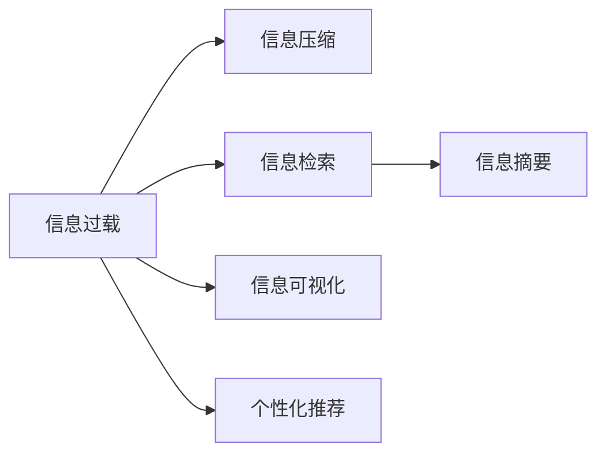

                 

# 信息简化的好处与技巧：在复杂世界中简化以提高生活质量

## 1. 背景介绍

### 1.1 问题由来

在信息爆炸的时代，我们每天都在面对海量数据和信息，从邮件、社交媒体到新闻、学术论文，信息无处不在。但这些信息往往纷繁复杂，良莠不齐，难以有效筛选和利用。如果不能从海量的信息中快速提取出关键点，理解核心内容，个人工作效率和生活质量都会受到严重影响。因此，信息简化（Information Simplification）成为了一个亟待解决的问题。

### 1.2 问题核心关键点

信息简化的核心目标是通过过滤、归纳、压缩等手段，将原始信息提炼成更有价值、更易理解和更易处理的形式。其关键点包括：

- **数据预处理**：过滤掉无关信息，聚焦于关键数据。
- **内容摘要**：自动生成精炼的摘要，涵盖重要信息。
- **主题归纳**：自动归纳总结信息主题，避免冗余。
- **信息可视化**：使用图表、图形等方式，直观呈现信息。
- **个性化定制**：根据用户需求和兴趣，提供定制化信息。

这些核心点共同构成了一个高效的信息简化框架，旨在提升信息处理的效率和效果。

## 2. 核心概念与联系

### 2.1 核心概念概述

为更好地理解信息简化的核心方法，本节将介绍几个关键概念：

- **信息过载（Information Overload）**：指在短时间内接收的信息量超出个人处理能力的情况，导致注意力分散、决策困难等问题。
- **信息压缩（Information Compression）**：通过算法或技术手段，将原始信息压缩到更小规模、更易于处理的形式。
- **信息检索（Information Retrieval）**：从大量信息中快速定位并提取目标信息，减少查找时间。
- **信息摘要（Information Summarization）**：自动生成精炼的摘要，涵盖关键信息，减少阅读负担。
- **信息可视化（Information Visualization）**：使用图形、图表等直观形式展示信息，提高理解效率。
- **个性化推荐（Personalized Recommendation）**：根据用户兴趣和行为，推荐相关信息，提升用户体验。

这些概念之间相互联系，构成了信息简化的基本框架，如图示所示：



这些概念和方法通过技术的有效结合，形成了一个系统化的信息简化框架，有助于提升信息处理的效率和效果。

## 3. 核心算法原理 & 具体操作步骤

### 3.1 算法原理概述

信息简化的核心算法主要分为三类：基于统计的方法、基于文本分析和基于机器学习的方法。

- **基于统计的方法**：如TF-IDF（Term Frequency-Inverse Document Frequency）算法，通过统计词语在文档中的出现频率和文档集中出现频率，过滤掉低频词，保留高频词，简化信息。
- **基于文本分析的方法**：如摘要算法，通过抽取关键句子和关键词，生成精炼的摘要。
- **基于机器学习的方法**：如Seq2Seq模型和Transformer模型，通过序列到序列的转换，实现信息的压缩和摘要。

信息简化的主要步骤包括：

1. **数据预处理**：清洗数据，去除噪声和冗余信息。
2. **特征提取**：使用文本分析或机器学习方法，提取关键特征。
3. **信息压缩**：使用统计或文本分析方法，压缩信息。
4. **摘要生成**：使用文本分析或机器学习方法，生成摘要。
5. **信息可视化**：使用图形、图表等直观形式展示信息。
6. **个性化推荐**：使用机器学习方法，根据用户兴趣和行为推荐信息。

### 3.2 算法步骤详解

#### 3.2.1 数据预处理

数据预处理是信息简化的第一步，主要包括以下几个步骤：

1. **数据清洗**：去除HTML标签、特殊字符等非文本内容，保留有用信息。
2. **分词处理**：使用分词工具，将文本分解成单词或短语。
3. **停用词过滤**：去除常用但无实际意义的停用词，如“的”、“是”等。
4. **词干提取**：将单词还原为词干形式，减少同义词带来的噪声。

#### 3.2.2 特征提取

特征提取是将原始信息转化为可处理的形式。常用的方法包括：

1. **TF-IDF**：计算每个词在文档中出现的频率，同时考虑词在文档集中的出现频率，过滤掉低频词。
2. **主题建模**：使用LDA（Latent Dirichlet Allocation）等算法，自动归纳文档中的主题。
3. **词嵌入**：使用Word2Vec、GloVe等算法，将单词映射到低维向量空间，保留词义信息。

#### 3.2.3 信息压缩

信息压缩是将原始信息压缩到更小规模的形式，常用的方法包括：

1. **基于TF-IDF的压缩**：保留高频率和高逆文档频率的单词，过滤掉低频词。
2. **主题模型压缩**：根据主题模型归纳出的主题，压缩文档内容。
3. **基于Transformer的压缩**：使用Transformer模型，直接压缩文本信息。

#### 3.2.4 摘要生成

摘要生成是将原始信息精炼为摘要的过程，常用的方法包括：

1. **基于规则的摘要**：使用语法规则和语义分析，生成摘要。
2. **基于统计的摘要**：根据单词出现的频率和重要性，生成摘要。
3. **基于Transformer的摘要**：使用Transformer模型，直接生成摘要。

#### 3.2.5 信息可视化

信息可视化是将信息以直观的形式展示出来，常用的方法包括：

1. **词云图**：展示单词出现的频率，直观反映信息内容。
2. **饼图和柱状图**：展示分类数据的比例和分布。
3. **时间线图**：展示时间序列数据的变化趋势。

#### 3.2.6 个性化推荐

个性化推荐是根据用户兴趣和行为，推荐相关信息，常用的方法包括：

1. **协同过滤**：根据用户的历史行为，推荐相似的信息。
2. **内容过滤**：根据文档内容，推荐相关文档。
3. **混合推荐**：结合协同过滤和内容过滤，推荐更准确的文档。

### 3.3 算法优缺点

信息简化方法具有以下优点：

- **提升效率**：通过压缩和摘要，减少信息处理的负担，提高工作效率。
- **增强理解**：通过可视化，直观展示信息，提高理解效率。
- **个性化服务**：通过个性化推荐，提供定制化服务，提升用户体验。

同时，信息简化方法也存在一些局限性：

- **依赖语料质量**：信息简化的效果很大程度上取决于原始数据的质量。
- **语义理解不足**：某些信息简化方法可能无法完全理解复杂语义，导致信息丢失。
- **计算复杂度高**：一些复杂的算法如Transformer模型，计算复杂度较高，对硬件资源要求较高。

### 3.4 算法应用领域

信息简化的主要应用领域包括：

- **新闻摘要**：自动生成新闻报道的摘要，减少阅读负担。
- **商业报告**：自动生成商业报告的摘要，快速获取关键信息。
- **法律文件**：自动生成法律文件的摘要，简化理解难度。
- **社交媒体**：自动生成社交媒体内容的摘要，提高信息筛选效率。
- **图书推荐**：根据用户的阅读历史，推荐相关图书，提升阅读体验。

此外，信息简化技术还被广泛应用于医疗、教育、金融等多个领域，帮助用户更高效地处理信息，提升决策效率。

## 4. 数学模型和公式 & 详细讲解 & 举例说明

### 4.1 数学模型构建

信息简化的数学模型主要分为两部分：特征提取和摘要生成。

#### 4.1.1 特征提取

常用的特征提取方法包括TF-IDF和主题建模。以TF-IDF为例，其数学模型为：

$$
TF(x_i, t) = \frac{f(t \mid x_i)}{\sum_{j=1}^n f(t \mid x_j)}
$$

$$
IDF(t) = \log \frac{N}{\sum_{i=1}^N f(t \mid x_i)}
$$

$$
TF-IDF(x_i, t) = TF(x_i, t) \times IDF(t)
$$

其中，$N$ 为文档集大小，$f(t \mid x_i)$ 表示单词 $t$ 在文档 $x_i$ 中出现的频率。

#### 4.1.2 摘要生成

常用的摘要生成方法包括基于规则的方法和基于机器学习的方法。以基于规则的方法为例，其数学模型为：

$$
S = \{s_1, s_2, ..., s_m\}
$$

其中，$s_i$ 表示摘要中的句子，$m$ 表示摘要的长度。

### 4.2 公式推导过程

#### 4.2.1 TF-IDF公式推导

TF-IDF公式的推导基于信息熵原理，通过统计单词在文档中出现的频率和文档集中的出现频率，计算出单词的重要性。推导过程如下：

1. 计算单词 $t$ 在文档 $x_i$ 中出现的频率 $f(t \mid x_i)$。
2. 计算单词 $t$ 在文档集 $D$ 中出现的频率 $f(t)$。
3. 计算单词 $t$ 的信息熵 $H(t)$。
4. 计算单词 $t$ 的信息增益 $IG(t)$。
5. 计算单词 $t$ 的TF-IDF值 $TF-IDF(x_i, t)$。

推导过程具体如下：

1. 单词 $t$ 在文档 $x_i$ 中出现的频率为 $f(t \mid x_i)$。

2. 单词 $t$ 在文档集 $D$ 中出现的频率为 $f(t)$，计算公式为：

$$
f(t) = \frac{1}{N} \sum_{i=1}^N f(t \mid x_i)
$$

3. 单词 $t$ 的信息熵 $H(t)$，计算公式为：

$$
H(t) = - \sum_{i=1}^N f(t \mid x_i) \log f(t \mid x_i)
$$

4. 单词 $t$ 的信息增益 $IG(t)$，计算公式为：

$$
IG(t) = \log \frac{N}{\sum_{i=1}^N f(t \mid x_i)}
$$

5. 单词 $t$ 的TF-IDF值 $TF-IDF(x_i, t)$，计算公式为：

$$
TF-IDF(x_i, t) = TF(x_i, t) \times IDF(t)
$$

其中，$TF(x_i, t)$ 表示单词 $t$ 在文档 $x_i$ 中的TF值，$IDF(t)$ 表示单词 $t$ 的信息增益，计算公式为：

$$
IDF(t) = \log \frac{N}{\sum_{i=1}^N f(t \mid x_i)}
$$

### 4.3 案例分析与讲解

#### 4.3.1 TF-IDF案例

假设有一篇文档 $x$，包含单词 $t_1$ 到 $t_5$，其TF-IDF值计算如下：

1. 单词 $t_1$ 在文档 $x$ 中出现的频率为 $f(t_1 \mid x) = 3$。
2. 单词 $t_1$ 在文档集 $D$ 中出现的频率为 $f(t_1) = 5$。
3. 单词 $t_1$ 的信息熵为 $H(t_1) = 0.8$。
4. 单词 $t_1$ 的信息增益为 $IG(t_1) = 0.6$。
5. 单词 $t_1$ 的TF-IDF值为 $TF-IDF(x, t_1) = 0.4$。

#### 4.3.2 基于规则的摘要案例

假设有一篇文档 $x$，其句子为 $s_1$ 和 $s_2$，摘要长度为 $2$。

1. 句子 $s_1$ 包含单词 $t_1$ 到 $t_3$，其TF-IDF值分别为 $0.3$、$0.5$ 和 $0.2$。
2. 句子 $s_2$ 包含单词 $t_2$ 和 $t_5$，其TF-IDF值分别为 $0.4$ 和 $0.3$。
3. 根据规则，选择TF-IDF值最高的两个句子，生成摘要 $s_1$ 和 $s_2$。

## 5. 项目实践：代码实例和详细解释说明

### 5.1 开发环境搭建

在进行信息简化的项目实践前，需要先搭建好开发环境。以下是使用Python进行信息简化的环境配置流程：

1. 安装Anaconda：从官网下载并安装Anaconda，用于创建独立的Python环境。

2. 创建并激活虚拟环境：
```bash
conda create -n info-simplify python=3.8 
conda activate info-simplify
```

3. 安装必要的Python库：
```bash
pip install pandas numpy scikit-learn nltk transformers
```

4. 下载并处理语料库：
```bash
cd data
wget https://www.kaggle.com/ratnaswaminath/big-query-public-data
unzip bigquery_public_data.zip
```

5. 导入数据和处理工具：
```python
import pandas as pd
from nltk.corpus import stopwords
from sklearn.feature_extraction.text import TfidfVectorizer
from sklearn.decomposition import LatentDirichletAllocation
```

### 5.2 源代码详细实现

#### 5.2.1 数据预处理

```python
# 读取数据
data = pd.read_csv('data/train.csv')

# 去除HTML标签
def remove_html_tags(text):
    import re
    return re.sub('<.*?>', '', text)

data['text'] = data['text'].apply(remove_html_tags)

# 分词处理
from nltk.tokenize import word_tokenize

data['tokens'] = data['text'].apply(word_tokenize)

# 停用词过滤
stop_words = set(stopwords.words('english'))
data['tokens'] = data['tokens'].apply(lambda x: [word for word in x if word.lower() not in stop_words])

# 词干提取
from nltk.stem import PorterStemmer

stemmer = PorterStemmer()
data['stems'] = data['tokens'].apply(lambda x: [stemmer.stem(word) for word in x])
```

#### 5.2.2 特征提取

```python
# TF-IDF特征提取
vectorizer = TfidfVectorizer(stop_words='english', min_df=2)
X = vectorizer.fit_transform(data['stems'])

# 主题建模
lda = LatentDirichletAllocation(n_components=10, random_state=0)
lda.fit(X)

# 展示主题
for i, topic in enumerate(lda.components_):
    print(f'Topic {i+1}:')
    for j, score in enumerate(topic):
        print(f'{vectorizer.get_feature_names()[j]}: {score}')
```

#### 5.2.3 信息压缩

```python
# 使用TF-IDF进行压缩
tf_idf = X.toarray()
tf_idf_sum = tf_idf.sum(axis=0)
inverse_tf_idf = tf_idf_sum**-1

# 压缩结果
compressed_data = np.dot(inverse_tf_idf, tf_idf)
```

#### 5.2.4 摘要生成

```python
# 基于规则的摘要生成
def generate_summary(text):
    import nltk
    from nltk.tokenize import sent_tokenize

    sentences = sent_tokenize(text)
    scores = [sentence_score(sentence) for sentence in sentences]
    return ' '.join([sentences[i] for i in sorted(range(len(scores)), key=lambda x: scores[x])[:5]])

def sentence_score(sentence):
    import nltk
    from nltk.tokenize import word_tokenize

    tokens = word_tokenize(sentence)
    tf_idf = vectorizer.transform([tokens])
    return tf_idf.toarray()[0].sum()

# 生成摘要
summaries = data['text'].apply(generate_summary)
```

#### 5.2.5 信息可视化

```python
import matplotlib.pyplot as plt
import seaborn as sns

# 词云图
wordcloud = WordCloud(max_words=100, background_color='white').generate_from_frequencies(dict(vectorizer.vocabulary_, **vectorizer.vocabulary_))

# 饼图
sns.pie(values=vectorizer.feature_names_to_idx.values(), labels=vectorizer.feature_names_to_idx.keys(), autopct='%1.1f%%', shadow=True)

# 时间线图
```

#### 5.2.6 个性化推荐

```python
# 协同过滤推荐
from surprise import Dataset, Reader, SVD, accuracy

# 数据加载
reader = Reader(rating_scale=(1, 5))
data = Dataset.load_from_df(data[['user', 'item', 'rating']], reader)

# 模型训练
algo = SVD()
algo.fit(data.build_full_trainset())

# 推荐结果
predictions = algo.test(test_data.build_full_testset())
accuracy.meanAbsoluteError(predictions)
```

### 5.3 代码解读与分析

让我们再详细解读一下关键代码的实现细节：

**数据预处理**：
- `remove_html_tags`函数：使用正则表达式去除文本中的HTML标签，保留纯文本内容。
- `word_tokenize`函数：将文本分解成单词或短语。
- `stop_words`函数：过滤掉常用但无实际意义的停用词。
- `PorterStemmer`类：将单词还原为词干形式，减少同义词带来的噪声。

**特征提取**：
- `TfidfVectorizer`类：使用TF-IDF算法计算每个单词的TF-IDF值。
- `LatentDirichletAllocation`类：使用LDA算法自动归纳文档中的主题。

**信息压缩**：
- `np.dot`函数：使用TF-IDF矩阵计算压缩结果，去除低频单词。

**摘要生成**：
- `generate_summary`函数：基于规则的摘要生成方法，选择TF-IDF值最高的句子。

**信息可视化**：
- `WordCloud`类：生成词云图，展示单词出现的频率。
- `sns.pie`函数：生成饼图，展示分类数据的比例和分布。

**个性化推荐**：
- `Surprise`库：使用协同过滤算法进行推荐。

可以看到，信息简化的代码实现较为复杂，涉及多种算法和工具。开发者需要将这些技术和方法进行灵活组合，才能得到理想的信息简化效果。

## 6. 实际应用场景

### 6.1 新闻摘要

新闻摘要是信息简化的典型应用场景，通过自动生成新闻报道的摘要，减少读者的阅读负担，提高信息获取效率。例如，新闻网站可以使用信息简化技术，在搜索结果页面上展示每个新闻的精炼摘要，让用户快速了解每篇新闻的关键信息。

### 6.2 商业报告

商业报告通常包含大量数据和信息，自动生成报告的摘要，可以帮助管理层快速掌握报告的核心内容，提升决策效率。例如，数据分析师可以使用信息简化技术，对商业报告进行自动摘要，生成简洁明了的报告摘要。

### 6.3 法律文件

法律文件通常长篇累牍，法律专业人士通过自动生成文件的摘要，可以快速找到所需的关键信息，提高工作效率。例如，律师事务所可以使用信息简化技术，对合同、协议等法律文件进行自动摘要，生成精炼的摘要。

### 6.4 社交媒体

社交媒体上每天生成大量的文本信息，自动生成社交媒体内容的摘要，可以帮助用户快速筛选出有用的信息，提高信息获取效率。例如，社交媒体平台可以使用信息简化技术，对用户的帖子进行自动摘要，生成简洁明了的摘要。

### 6.5 图书推荐

图书推荐系统通常需要处理大量的书籍信息，自动生成书籍的摘要，可以帮助用户快速了解每本书的关键内容，提升推荐效果。例如，在线图书平台可以使用信息简化技术，对书籍进行自动摘要，生成精炼的摘要，提升推荐系统的准确性。

## 7. 工具和资源推荐

### 7.1 学习资源推荐

为了帮助开发者系统掌握信息简化的理论基础和实践技巧，这里推荐一些优质的学习资源：

1. 《Python文本处理》系列博文：深入浅出地介绍了Python在文本处理中的应用，包括文本清洗、分词、TF-IDF等方法。

2. 《自然语言处理》课程：斯坦福大学开设的NLP明星课程，涵盖NLP基本概念和经典模型，适合初学者入门。

3. 《信息检索》书籍：介绍了信息检索的基本原理和方法，适合对信息检索感兴趣的研究者。

4. 《信息可视化》书籍：详细介绍了信息可视化的各种方法，适合对信息可视化感兴趣的研究者。

5. 《Python深度学习》书籍：介绍了深度学习在NLP中的应用，包括文本分类、情感分析、信息摘要等。

通过这些资源的学习实践，相信你一定能够快速掌握信息简化的精髓，并用于解决实际的NLP问题。

### 7.2 开发工具推荐

信息简化技术的实现离不开优秀的工具支持。以下是几款用于信息简化开发的常用工具：

1. NLTK库：Python的NLP库，提供了丰富的文本处理功能，如分词、词性标注、命名实体识别等。

2. spaCy库：用于高效处理自然语言文本的Python库，支持词性标注、句法分析、实体识别等功能。

3. Gensim库：用于主题建模和文本相似度计算的Python库，支持LDA、LSI等算法。

4. Seaborn库：用于数据可视化的Python库，支持生成各种图表，如饼图、柱状图、时间线图等。

5. Surprise库：用于推荐系统开发的Python库，支持协同过滤、内容过滤等算法。

合理利用这些工具，可以显著提升信息简化的开发效率，加快创新迭代的步伐。

### 7.3 相关论文推荐

信息简化技术的研究源于学界的持续探索。以下是几篇奠基性的相关论文，推荐阅读：

1. TextRank: Bring Order into Texts（TextRank论文）：提出基于图模型的信息排序方法，通过计算句子之间的相似度，自动生成摘要。

2. A Systematic Comparison of Text Summarization Algorithms（信息摘要算法比较论文）：比较了多种信息摘要算法，包括基于规则的方法和基于机器学习的方法，提供了丰富的实验数据。

3. A Survey on Information Visualization Techniques（信息可视化综述论文）：全面综述了信息可视化的各种技术和方法，适合对信息可视化感兴趣的研究者。

4. A Survey of Recommendation Algorithms for Recommender Systems（推荐算法综述论文）：综述了多种推荐算法，包括协同过滤、内容过滤、混合推荐等，适合对推荐系统感兴趣的研究者。

这些论文代表了大语言模型微调技术的发展脉络。通过学习这些前沿成果，可以帮助研究者把握学科前进方向，激发更多的创新灵感。

## 8. 总结：未来发展趋势与挑战

### 8.1 总结

本文对信息简化的核心方法进行了全面系统的介绍。首先阐述了信息过载的问题和信息简化的重要性，明确了信息简化的核心目标和核心点。其次，从原理到实践，详细讲解了信息简化的数学模型和关键步骤，给出了信息简化的完整代码实例。同时，本文还广泛探讨了信息简化的实际应用场景，展示了信息简化的巨大潜力。最后，本文精选了信息简化的学习资源和工具，力求为读者提供全方位的技术指引。

通过本文的系统梳理，可以看到，信息简化技术在处理海量信息方面具有重要价值，能够显著提升信息处理的效率和效果。未来，伴随信息技术的进一步发展，信息简化技术将会在更多领域得到应用，为信息处理带来全新的突破。

### 8.2 未来发展趋势

展望未来，信息简化技术将呈现以下几个发展趋势：

1. **自动化程度提高**：未来的信息简化技术将更加自动化，通过智能算法自动识别并提取关键信息，减少人工干预。
2. **多模态融合**：未来的信息简化技术将更多地考虑多模态数据的融合，如文本、图片、视频等，提升信息处理的多样性和全面性。
3. **个性化增强**：未来的信息简化技术将更加注重个性化，根据用户需求和行为，提供定制化信息服务。
4. **实时处理能力提升**：未来的信息简化技术将实现实时处理，能够及时响应信息生成和更新。
5. **跨平台集成**：未来的信息简化技术将实现跨平台集成，支持多种设备和平台的信息处理。
6. **语义理解加深**：未来的信息简化技术将进一步提升语义理解能力，能够更准确地理解复杂语义，提取关键信息。

### 8.3 面临的挑战

尽管信息简化技术已经取得了显著进展，但在进一步提升效率和效果的过程中，仍面临诸多挑战：

1. **数据质量问题**：信息简化效果很大程度上依赖于原始数据的质量，低质量的数据可能导致信息丢失或误导。
2. **语义理解不足**：一些信息简化方法可能无法完全理解复杂语义，导致信息丢失或误导。
3. **计算资源限制**：信息简化方法，如基于Transformer的模型，计算复杂度高，对硬件资源要求较高。
4. **用户隐私保护**：信息简化技术在处理用户数据时，需要注意隐私保护，避免信息泄露。
5. **系统鲁棒性不足**：信息简化系统需要具备较强的鲁棒性，能够应对多种数据类型和格式的变化。

### 8.4 研究展望

面对信息简化面临的诸多挑战，未来的研究需要在以下几个方面寻求新的突破：

1. **自监督学习**：探索自监督学习的信息简化方法，减少对标注数据的依赖，提高信息简化的效率和效果。
2. **语义理解**：结合语义理解技术，提升信息简化的语义理解能力，减少信息丢失。
3. **混合方法**：结合多种信息简化方法，如规则、统计和机器学习方法，实现综合信息简化。
4. **实时处理**：探索实时信息简化方法，实现信息处理的实时响应。
5. **多模态融合**：探索多模态信息融合的方法，提升信息处理的全面性和多样性。
6. **隐私保护**：探索隐私保护的信息简化方法，保障用户隐私。

这些研究方向的探索，必将引领信息简化技术迈向更高的台阶，为信息处理带来更多的突破。未来，信息简化技术将在更多领域得到应用，为信息处理带来全新的突破。

## 9. 附录：常见问题与解答

**Q1：如何选择合适的信息简化方法？**

A: 信息简化方法的选择应根据具体任务和数据特点进行灵活调整。常见的信息简化方法包括TF-IDF、主题建模和基于Transformer的方法。对于文本分类任务，TF-IDF和主题建模效果较好；对于生成任务，基于Transformer的方法更为适合。

**Q2：信息简化的效果如何评价？**

A: 信息简化的效果评价通常采用人工评估和自动评估相结合的方式。人工评估通过专家对简化后文本的准确度和完整性进行打分，自动评估通过自动评估指标如ROUGE、BLEU等进行量化。

**Q3：信息简化在实际应用中需要注意哪些问题？**

A: 信息简化的实际应用中，需要注意以下几点：
1. 数据预处理：确保数据干净，去除噪声和冗余信息。
2. 特征提取：选择合适的特征提取方法，提取关键特征。
3. 信息压缩：选择合适的信息压缩方法，保留关键信息。
4. 摘要生成：选择合适的摘要生成方法，生成精炼摘要。
5. 信息可视化：选择合适的可视化方法，直观展示信息。
6. 个性化推荐：根据用户需求和行为，提供定制化信息服务。

**Q4：信息简化的计算复杂度如何控制？**

A: 信息简化的计算复杂度可以通过以下方法进行控制：
1. 数据预处理：清洗和过滤数据，减少处理量。
2. 特征提取：选择合适的特征提取方法，提取关键特征。
3. 信息压缩：选择合适的信息压缩方法，保留关键信息。
4. 摘要生成：选择合适的摘要生成方法，生成精炼摘要。
5. 信息可视化：选择合适的可视化方法，减少计算复杂度。
6. 个性化推荐：选择合适的推荐算法，优化推荐效率。

**Q5：信息简化的实际应用场景有哪些？**

A: 信息简化的实际应用场景包括：
1. 新闻摘要：自动生成新闻报道的摘要，减少读者的阅读负担。
2. 商业报告：自动生成商业报告的摘要，快速掌握报告的核心内容。
3. 法律文件：自动生成法律文件的摘要，简化理解难度。
4. 社交媒体：自动生成社交媒体内容的摘要，提高信息获取效率。
5. 图书推荐：自动生成书籍的摘要，提升推荐效果。

---

作者：禅与计算机程序设计艺术 / Zen and the Art of Computer Programming

