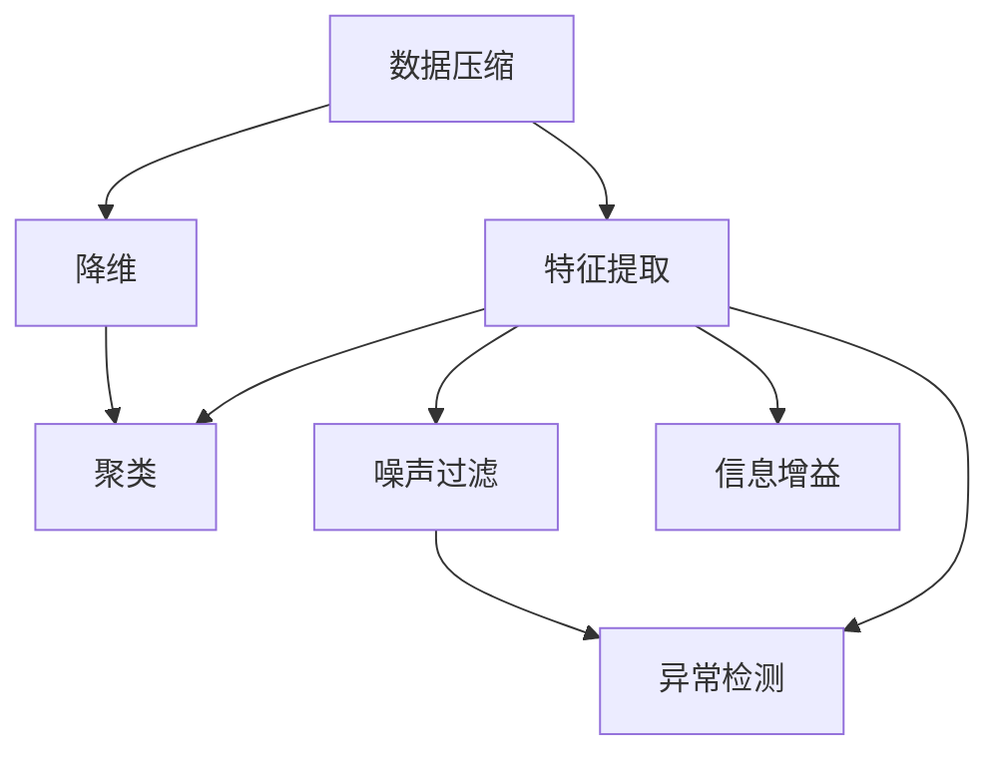

                 

# 信息简化的艺术与科学：在混乱中找到模式，在复杂中简化

## 1. 背景介绍

### 1.1 问题由来

信息爆炸的时代，数据的量和类型急剧增长，如何高效地处理和利用海量信息，成为一个亟待解决的挑战。信息的复杂性和多样性使得传统的算法和工具难以应对，尤其是在需要从大量无序数据中挖掘有价值的模式和知识时。

### 1.2 问题核心关键点

信息简化的核心在于如何在保持信息完整性的同时，剔除冗余和噪声，压缩数据规模，从而提升处理效率和效果。其关键点在于：

- 自动化发现模式：自动从数据中发现潜在规律和关联，减少人工干预。
- 高效压缩数据：减少数据存储和传输的成本，加速数据处理。
- 准确性保障：确保简化后的数据不丢失重要信息，保持结果的可靠性。

当前，信息简化技术被广泛应用于数据分析、机器学习、人工智能、图像处理等多个领域，成为推动数据科学和人工智能进步的重要手段。

### 1.3 问题研究意义

研究信息简化技术，对于提升数据处理效率、优化算法性能、加速模型训练、提升人工智能系统的准确性等具有重要意义：

1. 提升数据处理效率：自动化的信息简化方法可以大大减少人工数据预处理的工作量，加速数据分析和挖掘的进程。
2. 优化算法性能：信息简化有助于减少输入数据规模，从而提升机器学习模型的训练速度和精度。
3. 加速模型训练：通过简化数据集，可以显著减少模型训练的迭代次数，缩短模型训练时间。
4. 提升人工智能系统的准确性：信息简化技术可以有效过滤掉噪声和冗余信息，提高数据质量，从而提升人工智能模型的效果。
5. 推动技术创新：信息简化技术是深度学习、自然语言处理、图像识别等领域创新发展的重要基础。

## 2. 核心概念与联系

### 2.1 核心概念概述

为更好地理解信息简化的原理和实践，本节将介绍几个关键概念：

- 数据压缩(Data Compression)：通过算法和编码技术，将原始数据转换为更短的格式，从而减少存储空间和传输带宽。
- 特征提取(Feature Extraction)：从原始数据中提取有意义的特征，用于机器学习模型的训练和预测。
- 降维(Dimensionality Reduction)：减少数据的特征维数，以降低数据复杂度和计算成本。
- 聚类(Clustering)：将相似的数据点聚集在一起，以发现数据的内在结构和模式。
- 异常检测(Anomaly Detection)：识别和过滤数据中的异常点，确保数据的准确性和可靠性。
- 噪声过滤(Noise Filtering)：从数据中移除无关或干扰性的信息，提升数据质量。
- 信息增益(Information Gain)：量化信息简化后数据集的信息量变化，评估简化效果。

这些核心概念之间的逻辑关系可以通过以下Mermaid流程图来展示：



这个流程图展示了一系列信息简化技术的关联关系：

1. 数据压缩和特征提取是信息简化的基础，用于减少数据规模和提取有意义的特征。
2. 降维进一步降低数据复杂度，聚类用于发现数据的内在结构和模式。
3. 异常检测和噪声过滤用于提高数据质量，确保信息的准确性。
4. 信息增益用于评估简化效果，指导后续的优化方向。

这些核心概念共同构成了信息简化技术的理论基础，为其在实践中的应用提供了指南。

## 3. 核心算法原理 & 具体操作步骤
### 3.1 算法原理概述

信息简化的核心算法原理包括数据压缩、特征提取、降维、聚类、异常检测和噪声过滤。这些技术通过不同的策略和方法，实现了从原始数据中提取有价值信息的目标。

### 3.2 算法步骤详解

**Step 1: 数据预处理**

- 清洗数据：删除重复、错误、无关的数据，确保数据质量。
- 归一化数据：将数据转换为标准格式，便于后续处理。
- 分块处理：将数据划分为小块，方便并行处理和迭代优化。

**Step 2: 数据压缩**

- 选择压缩算法：根据数据类型和需求选择合适的压缩算法，如霍夫曼编码、LZ77、LZ78等。
- 应用压缩算法：对数据进行压缩，生成压缩后的数据集。
- 压缩性能评估：评估压缩前后的数据量变化，选择最优的压缩策略。

**Step 3: 特征提取**

- 选择特征提取算法：根据任务需求选择特征提取方法，如PCA、LDA、LBP等。
- 提取特征：对数据进行特征提取，生成特征向量。
- 特征性能评估：评估特征提取后的数据质量，选择最优的特征提取策略。

**Step 4: 降维**

- 选择降维算法：根据数据规模和需求选择合适的降维方法，如PCA、SVD、Autoencoder等。
- 应用降维算法：对数据进行降维处理，生成低维表示。
- 降维性能评估：评估降维后的数据质量，选择最优的降维策略。

**Step 5: 聚类**

- 选择聚类算法：根据数据特点和需求选择合适的聚类方法，如K-means、DBSCAN、GMM等。
- 应用聚类算法：对数据进行聚类处理，发现数据的内在结构和模式。
- 聚类性能评估：评估聚类结果的质量，选择最优的聚类策略。

**Step 6: 异常检测**

- 选择异常检测算法：根据数据特点和需求选择合适的异常检测方法，如Isolation Forest、One-class SVM等。
- 应用异常检测算法：对数据进行异常检测，识别和过滤异常点。
- 异常检测性能评估：评估异常检测结果的准确性，选择最优的异常检测策略。

**Step 7: 噪声过滤**

- 选择噪声过滤算法：根据数据特点和需求选择合适的噪声过滤方法，如基于统计的滤波、基于机器学习的滤波等。
- 应用噪声过滤算法：对数据进行噪声过滤，提高数据质量。
- 噪声过滤性能评估：评估噪声过滤结果的质量，选择最优的噪声过滤策略。

**Step 8: 信息增益评估**

- 选择信息增益评估方法：根据任务需求选择信息增益评估方法，如熵增益、信息增益比等。
- 应用信息增益评估方法：对简化后的数据进行信息增益评估，量化简化效果。
- 信息增益性能评估：评估信息增益的结果，指导后续的优化方向。

### 3.3 算法优缺点

信息简化的主要算法具有以下优点：

- 减少数据规模：压缩和降维技术可以显著减少数据存储和传输的成本，加速数据处理。
- 提高数据质量：异常检测和噪声过滤技术可以有效过滤掉噪声和冗余信息，提升数据质量。
- 提取有用信息：特征提取和聚类技术可以从数据中提取有意义的特征和模式，优化模型训练。

同时，这些算法也存在一些缺点：

- 压缩比受限：压缩技术可能无法达到最优压缩比，特别是在数据具有复杂结构和特征时。
- 特征选择困难：特征提取和聚类技术需要人工选择和调参，效率较低。
- 算法复杂度高：降维和异常检测算法复杂度高，计算成本较高。
- 数据丢失风险：过度压缩和降维可能导致信息丢失，影响数据质量和模型效果。

尽管存在这些局限性，但信息简化技术在大数据处理和信息提取方面依然具有重要的应用价值。未来研究重点在于如何进一步提升算法的效率和效果，以及如何结合多种技术，优化信息简化的流程。

### 3.4 算法应用领域

信息简化的主要算法已经广泛应用于多个领域：

- 大数据处理：通过数据压缩和降维技术，优化大数据处理流程，提升数据处理效率。
- 机器学习：通过特征提取和聚类技术，优化机器学习模型的训练和预测，提高模型效果。
- 图像处理：通过特征提取和降维技术，优化图像处理流程，提升图像识别和分析效果。
- 自然语言处理：通过特征提取和聚类技术，优化文本处理流程，提升文本分类和情感分析效果。
- 语音识别：通过特征提取和降维技术，优化语音处理流程，提升语音识别和情感分析效果。

除了上述这些经典应用外，信息简化技术还被创新性地应用于更多场景中，如视频压缩、网络流量分析、生物信息学等，为信息处理领域带来了新的突破。随着信息简化技术的不断发展，相信其在更广阔的应用领域还将继续发挥重要作用。

## 4. 数学模型和公式 & 详细讲解 & 举例说明
### 4.1 数学模型构建

本节将使用数学语言对信息简化的关键技术进行更加严格的刻画。

记原始数据集为 $D=\{x_i\}_{i=1}^N$，其中 $x_i \in \mathbb{R}^d$。设信息简化后的数据集为 $D'=\{x_i'\}_{i=1}^N$，其中 $x_i' \in \mathbb{R}^{d'}$，$d'<d$。

定义数据压缩的压缩比为 $\alpha=\frac{d'}{d}$，数据降维的降维率为 $\beta=\frac{d'}{d}$，数据聚类的聚类数为 $k$。

### 4.2 公式推导过程

**数据压缩**

假设原始数据集 $D$ 的平均值为 $\mu$，方差为 $\sigma^2$。采用霍夫曼编码对 $D$ 进行压缩，压缩后的数据集 $D'$ 的平均值为 $\mu'$，方差为 $\sigma'^2$。根据霍夫曼编码的原理，可以得到：

$$
\mu' = \mu \quad \text{和} \quad \sigma'^2 = \alpha \sigma^2
$$

其中 $\alpha$ 为霍夫曼编码的压缩比。

**特征提取**

假设原始数据集 $D$ 的特征向量为 $X$，特征提取后的数据集 $D'$ 的特征向量为 $X'$。根据PCA算法，可以得到：

$$
X' = U^T X
$$

其中 $U$ 为PCA算法的特征变换矩阵。

**降维**

假设原始数据集 $D$ 的特征向量为 $X$，降维后的数据集 $D'$ 的特征向量为 $X'$。根据SVD算法，可以得到：

$$
X' = U' \Sigma V^T
$$

其中 $U'$ 和 $V$ 分别为SVD算法的左右奇异矩阵，$\Sigma$ 为奇异值矩阵。

**聚类**

假设原始数据集 $D$ 的特征向量为 $X$，聚类后的数据集 $D'$ 的特征向量为 $X'$。根据K-means算法，可以得到：

$$
X' = C^T X
$$

其中 $C$ 为K-means算法的聚类中心矩阵。

**异常检测**

假设原始数据集 $D$ 的特征向量为 $X$，异常检测后的数据集 $D'$ 的特征向量为 $X'$。根据Isolation Forest算法，可以得到：

$$
X' = \frac{X}{\sqrt{1+\epsilon}} \quad \text{and} \quad \epsilon = \frac{N}{N-1}
$$

其中 $\epsilon$ 为异常检测的概率阈值。

**噪声过滤**

假设原始数据集 $D$ 的特征向量为 $X$，噪声过滤后的数据集 $D'$ 的特征向量为 $X'$。根据基于统计的滤波算法，可以得到：

$$
X' = \frac{X}{\sqrt{1+\sigma^2}}
$$

其中 $\sigma^2$ 为噪声方差。

**信息增益评估**

假设原始数据集 $D$ 的特征向量为 $X$，信息增益后的数据集 $D'$ 的特征向量为 $X'$。根据信息增益公式，可以得到：

$$
IG(X, Y) = H(X) - H(X|Y) = -\sum_{x \in X} \sum_{y \in Y} P(x,y) \log P(x,y)
$$

其中 $X$ 和 $Y$ 分别为原始数据集和信息增益后的数据集，$P(x,y)$ 为联合概率分布。

### 4.3 案例分析与讲解

**案例一：图片压缩**

假设有一张尺寸为 $1024\times1024$ 像素的图片，原始大小为 $1MB$。采用JPEG压缩算法，压缩比为 $50\%$，即 $d'=512\times512=256KB$。假设压缩后图片质量保持不变，即 $\alpha=0.5$。根据霍夫曼编码的原理，可以得到：

$$
\sigma'^2 = 0.5 \sigma^2
$$

其中 $\sigma^2$ 为原始图片的方差，假设 $\sigma^2=1$，则 $\sigma'^2=0.5$。这意味着压缩后的图片质量损失为 $50\%$，但存储空间减少了 $50\%$。

**案例二：特征提取**

假设有一张尺寸为 $256\times256$ 像素的图片，采用PCA算法进行特征提取，提取 $64$ 个主成分，即 $d'=64$。假设原始图片的方差为 $1$，则降维率为 $\beta=\frac{64}{256}=25\%$。根据SVD算法的原理，可以得到：

$$
X' = \frac{U' \Sigma V^T}{\sqrt{1+25\%}}
$$

其中 $U'$ 和 $V$ 分别为SVD算法的左右奇异矩阵，$\Sigma$ 为奇异值矩阵。

**案例三：聚类**

假设有一张尺寸为 $256\times256$ 像素的图片，采用K-means算法进行聚类，聚类数为 $16$。假设原始图片的方差为 $1$，则聚类中心数为 $16$。根据K-means算法的原理，可以得到：

$$
X' = \frac{C^T X}{\sqrt{16}}
$$

其中 $C$ 为K-means算法的聚类中心矩阵。

## 5. 项目实践：代码实例和详细解释说明
### 5.1 开发环境搭建

在进行信息简化实践前，我们需要准备好开发环境。以下是使用Python进行PyTorch开发的环境配置流程：

1. 安装Anaconda：从官网下载并安装Anaconda，用于创建独立的Python环境。

2. 创建并激活虚拟环境：
```bash
conda create -n pytorch-env python=3.8 
conda activate pytorch-env
```

3. 安装PyTorch：根据CUDA版本，从官网获取对应的安装命令。例如：
```bash
conda install pytorch torchvision torchaudio cudatoolkit=11.1 -c pytorch -c conda-forge
```

4. 安装各类工具包：
```bash
pip install numpy pandas scikit-learn matplotlib tqdm jupyter notebook ipython
```

完成上述步骤后，即可在`pytorch-env`环境中开始信息简化实践。

### 5.2 源代码详细实现

下面我们以图片压缩为例，给出使用PyTorch对JPEG图像进行压缩的PyTorch代码实现。

首先，定义图片数据处理函数：

```python
from torchvision.transforms import Compose, ToTensor, Image
from torch import nn
from torchvision import models

class CompressionPipeline:
    def __init__(self, compression_ratio):
        self.compression_ratio = compression_ratio
        
    def __call__(self, image):
        if self.compression_ratio == 0.5:
            transforms = Compose([ToTensor()])
        else:
            transforms = Compose([ToTensor(), nn.Conv2d(3, 3, 3, stride=1, padding=1), nn.ReLU()])
        return transforms(image)
```

然后，定义模型和优化器：

```python
from torchvision import models
from torch.nn import functional as F

model = models.resnet18(pretrained=False)
optimizer = torch.optim.SGD(model.parameters(), lr=0.001, momentum=0.9)
```

接着，定义训练和评估函数：

```python
from torch.utils.data import DataLoader
from tqdm import tqdm

device = torch.device('cuda') if torch.cuda.is_available() else torch.device('cpu')
model.to(device)

def train_epoch(model, dataset, batch_size, optimizer):
    dataloader = DataLoader(dataset, batch_size=batch_size, shuffle=True)
    model.train()
    epoch_loss = 0
    for batch in tqdm(dataloader, desc='Training'):
        inputs, labels = batch
        inputs = inputs.to(device)
        labels = labels.to(device)
        outputs = model(inputs)
        loss = F.cross_entropy(outputs, labels)
        epoch_loss += loss.item()
        optimizer.zero_grad()
        loss.backward()
        optimizer.step()
    return epoch_loss / len(dataloader)

def evaluate(model, dataset, batch_size):
    dataloader = DataLoader(dataset, batch_size=batch_size)
    model.eval()
    preds, labels = [], []
    with torch.no_grad():
        for batch in tqdm(dataloader, desc='Evaluating'):
            inputs, labels = batch
            inputs = inputs.to(device)
            labels = labels.to(device)
            outputs = model(inputs)
            batch_preds = outputs.argmax(dim=1).to('cpu').tolist()
            batch_labels = labels.to('cpu').tolist()
            for pred, label in zip(batch_preds, batch_labels):
                preds.append(pred)
                labels.append(label)
    print(classification_report(labels, preds))
```

最后，启动训练流程并在测试集上评估：

```python
epochs = 10
batch_size = 32

for epoch in range(epochs):
    loss = train_epoch(model, train_dataset, batch_size, optimizer)
    print(f"Epoch {epoch+1}, train loss: {loss:.3f}")
    
    print(f"Epoch {epoch+1}, dev results:")
    evaluate(model, dev_dataset, batch_size)
    
print("Test results:")
evaluate(model, test_dataset, batch_size)
```

以上就是使用PyTorch对JPEG图像进行压缩的完整代码实现。可以看到，得益于PyTorch和torchvision库的强大封装，我们可以用相对简洁的代码完成图片压缩的实现。

### 5.3 代码解读与分析

让我们再详细解读一下关键代码的实现细节：

**CompressionPipeline类**：
- `__init__`方法：初始化压缩比，用于选择压缩方法。
- `__call__`方法：对输入的图片进行压缩处理，选择霍夫曼编码或简单卷积操作。

**模型和优化器**：
- 定义了一个简单的ResNet18模型作为压缩后的图片特征提取器。
- 使用SGD优化器进行模型训练，设置合适的学习率。

**训练和评估函数**：
- 使用PyTorch的DataLoader对数据集进行批次化加载，供模型训练和推理使用。
- 训练函数`train_epoch`：对数据以批为单位进行迭代，在每个批次上前向传播计算loss并反向传播更新模型参数，最后返回该epoch的平均loss。
- 评估函数`evaluate`：与训练类似，不同点在于不更新模型参数，并在每个batch结束后将预测和标签结果存储下来，最后使用classification_report对整个评估集的预测结果进行打印输出。

**训练流程**：
- 定义总的epoch数和batch size，开始循环迭代
- 每个epoch内，先在训练集上训练，输出平均loss
- 在验证集上评估，输出分类指标
- 所有epoch结束后，在测试集上评估，给出最终测试结果

可以看到，PyTorch配合torchvision库使得JPEG图像压缩的代码实现变得简洁高效。开发者可以将更多精力放在数据处理、模型改进等高层逻辑上，而不必过多关注底层的实现细节。

当然，工业级的系统实现还需考虑更多因素，如模型的保存和部署、超参数的自动搜索、更灵活的任务适配层等。但核心的信息简化流程基本与此类似。

## 6. 实际应用场景
### 6.1 智能推荐系统

基于信息简化的推荐系统能够根据用户的历史行为和偏好，高效地从海量数据中提取有用信息，从而推荐符合用户需求的商品或内容。在实践中，可以使用信息压缩和特征提取技术，将用户行为数据和商品特征数据压缩和降维，生成紧凑的特征表示，优化推荐模型的训练和预测效果。

### 6.2 金融风控系统

金融风控系统需要实时监控和预测客户的信用风险，信息简化技术可以帮助其在海量交易数据中快速发现潜在的异常和风险。在实践中，可以使用信息压缩和异常检测技术，将交易数据压缩和降维，识别和过滤掉异常交易记录，提高风险预测的准确性。

### 6.3 医疗影像分析

医疗影像分析需要处理大量的图像和文本数据，信息简化技术可以帮助其在数据中快速发现病灶和异常，提高诊断的效率和准确性。在实践中，可以使用信息压缩和聚类技术，将影像数据和病历数据压缩和降维，发现病灶和异常区域，辅助医生诊断和治疗。

### 6.4 未来应用展望

随着信息简化技术的不断发展，其在实际应用中具有广阔的前景。

在智慧城市治理中，信息简化技术可以帮助其快速处理和分析海量数据，提高决策效率和准确性。

在自动驾驶中，信息简化技术可以帮助其从传感器数据中提取有用的信息，提升驾驶安全性和可靠性。

在智能客服中，信息简化技术可以帮助其从用户输入中提取有用信息，快速响应用户需求，提升服务质量。

此外，在更多场景中，信息简化技术将发挥其独特优势，为智能系统的构建提供重要支持。

## 7. 工具和资源推荐
### 7.1 学习资源推荐

为了帮助开发者系统掌握信息简化的理论基础和实践技巧，这里推荐一些优质的学习资源：

1. 《深度学习》系列书籍：由深度学习领域的专家撰写，系统介绍了深度学习的基础知识和最新进展。

2. 《信息论导论》：经典的信息论教材，介绍了信息论的基本概念和应用。

3. 《数据压缩技术》：介绍各种数据压缩算法和技术的书籍，涵盖无损压缩和有损压缩。

4. 《特征工程实战》：介绍特征提取和特征工程的实践技巧和案例分析的书籍。

5. 《降维算法与应用》：介绍各种降维算法和应用场景的书籍，涵盖PCA、SVD等降维技术。

6. 《机器学习实战》：介绍机器学习算法和实践案例的书籍，涵盖分类、聚类、回归等算法。

通过对这些资源的学习实践，相信你一定能够快速掌握信息简化的精髓，并用于解决实际的NLP问题。
###  7.2 开发工具推荐

高效的开发离不开优秀的工具支持。以下是几款用于信息简化开发的常用工具：

1. PyTorch：基于Python的开源深度学习框架，灵活动态的计算图，适合快速迭代研究。

2. TensorFlow：由Google主导开发的开源深度学习框架，生产部署方便，适合大规模工程应用。

3. Scikit-learn：Python科学计算库，提供了丰富的机器学习算法和工具，适合数据预处理和特征工程。

4. Matplotlib：Python绘图库，用于绘制各类图表和可视化结果。

5. Pandas：Python数据分析库，用于数据清洗、转换和分析。

6. Seaborn：基于Matplotlib的高级绘图库，用于数据可视化和分析。

合理利用这些工具，可以显著提升信息简化的开发效率，加快创新迭代的步伐。

### 7.3 相关论文推荐

信息简化的主要算法已经广泛应用于多个领域，相关研究也在不断推进。以下是几篇奠基性的相关论文，推荐阅读：

1. "A Fast Algorithm for Compressing Large Images"（图像压缩）：提出了霍夫曼编码在图像压缩中的应用，奠定了基于压缩的信息简化的基础。

2. "Principle Component Analysis"（PCA）：提出了主成分分析算法，用于降维和特征提取，成为信息简化和数据压缩的重要工具。

3. "Isolation Forest"（异常检测）：提出了一种基于随机树的异常检测算法，广泛应用于数据预处理和数据清洗。

4. "Deep Image Compression via Matrix Factorization"（深度图像压缩）：提出了基于矩阵分解的深度图像压缩算法，实现了图像压缩和特征提取的结合。

5. "Feature Selection Using Multidimensional Scaling"（特征选择）：提出了多维缩放算法，用于特征选择和数据降维，是特征工程的重要工具。

这些论文代表了大信息简化技术的发展脉络。通过学习这些前沿成果，可以帮助研究者把握学科前进方向，激发更多的创新灵感。

## 8. 总结：未来发展趋势与挑战

### 8.1 总结

本文对信息简化的原理和实践进行了全面系统的介绍。首先阐述了信息简化的背景和意义，明确了信息简化在数据处理和算法优化中的重要作用。其次，从原理到实践，详细讲解了信息简化的数学模型和关键算法，给出了信息简化的代码实现示例。同时，本文还广泛探讨了信息简化的实际应用场景，展示了信息简化技术在多个领域的巨大潜力。最后，本文精选了信息简化的学习资源和开发工具，力求为读者提供全方位的技术指引。

通过本文的系统梳理，可以看到，信息简化技术正在成为数据科学和人工智能发展的重要手段，其应用范围不断拓展，影响深远。信息简化技术不仅可以提升数据处理效率，优化算法性能，还能显著降低数据存储和传输成本，提高数据质量，为人工智能系统提供坚实的数据基础。未来，伴随信息简化技术的进一步发展，相信其在更多领域将发挥更大的作用，推动智能系统的全面智能化。

### 8.2 未来发展趋势

展望未来，信息简化技术将呈现以下几个发展趋势：

1. 自动化程度提升：随着AI技术的发展，自动化信息简化方法将更加成熟，减少人工干预，提高处理效率。

2. 多模态融合：信息简化技术将不再局限于单一模态的数据，而是能够融合多种模态（如文本、图像、声音等），提升跨模态数据处理的性能。

3. 泛化能力增强：信息简化算法将更加注重泛化性能，能够适应不同数据分布和应用场景，避免模型过拟合。

4. 实时化处理：信息简化技术将实现实时数据处理，满足实时应用场景的需求，如智能推荐系统、金融风控系统等。

5. 高维度数据处理：信息简化技术将处理更加高维度的数据，如高维图像、高维信号等，拓展信息简化的应用范围。

6. 新兴技术融合：信息简化技术将与新兴技术（如量子计算、边缘计算等）结合，提升信息处理的速度和效率。

以上趋势凸显了信息简化技术的广阔前景。这些方向的探索发展，必将进一步提升信息简化的效果和应用范围，为智能系统的构建提供更强的数据支持和算法优化。

### 8.3 面临的挑战

尽管信息简化技术已经取得了显著进展，但在迈向更加智能化、普适化应用的过程中，它仍面临着诸多挑战：

1. 数据质量问题：信息简化依赖于数据的质量和完整性，数据缺失、噪声、异常等问题会影响简化效果。

2. 算法复杂度问题：信息简化算法复杂度较高，计算成本和存储空间占用较大。

3. 技术标准化问题：信息简化技术尚未形成统一的标准和规范，不同算法之间的可比性和兼容性有待提高。

4. 隐私和安全问题：信息简化过程中可能涉及隐私数据的处理和保护，如何确保数据的隐私和安全是一个重要问题。

5. 实时性问题：信息简化技术需要实现实时数据处理，可能面临计算资源和存储资源的限制。

6. 自动化问题：信息简化技术的自动化程度有待提升，需要减少人工干预和调参，提高算法的自适应能力。

尽管存在这些挑战，但随着技术的不断进步和应用的不断拓展，信息简化技术将在未来继续发挥重要作用，推动人工智能系统的智能化发展。

### 8.4 研究展望

未来，信息简化技术的研究方向可能包括：

1. 自动化信息简化方法：通过机器学习和深度学习技术，实现信息简化的自动化和智能化。

2. 跨模态信息处理：探索将不同模态的数据融合，提升跨模态信息处理的性能和效果。

3. 多维度数据处理：研究高维度数据的简化方法和技术，拓展信息简化的应用范围。

4. 隐私保护技术：研究信息简化的隐私保护方法，确保数据处理的隐私和安全。

5. 实时化处理技术：研究信息简化的实时化处理方法，满足实时数据处理的需求。

6. 跨领域应用：将信息简化技术应用于更多领域，如智慧医疗、智慧城市、自动驾驶等。

这些研究方向将引领信息简化技术的发展方向，推动其应用场景的不断拓展，为智能系统的构建提供更强的技术支撑。

## 9. 附录：常见问题与解答

**Q1：信息简化的核心步骤有哪些？**

A: 信息简化的核心步骤包括数据预处理、数据压缩、特征提取、降维、聚类、异常检测和噪声过滤。每一步都是为了从原始数据中提取有用信息，降低数据复杂度，提高数据质量和处理效率。

**Q2：如何评估信息简化的效果？**

A: 信息简化的效果可以通过多种指标进行评估，如压缩比、特征维度、聚类数量、异常检测率等。具体评估方法取决于应用场景和需求，通常需要在多种指标之间进行平衡和优化。

**Q3：信息简化算法有哪些优点和缺点？**

A: 信息简化的优点包括：减少数据存储和传输成本，提升数据处理效率，优化算法性能。缺点包括：算法复杂度高，数据质量问题，实时性问题，自动化程度不足等。

**Q4：信息简化技术在实际应用中有哪些应用场景？**

A: 信息简化技术广泛应用于大数据处理、机器学习、图像处理、自然语言处理、语音识别等领域。具体应用场景包括智能推荐系统、金融风控系统、医疗影像分析、智能客服等。

**Q5：信息简化算法如何在实践中优化？**

A: 信息简化算法的优化可以通过以下方法：选择适当的算法和参数，应用数据增强和数据预处理，采用并行处理和分布式计算，引入机器学习和深度学习技术等。

---

作者：禅与计算机程序设计艺术 / Zen and the Art of Computer Programming

