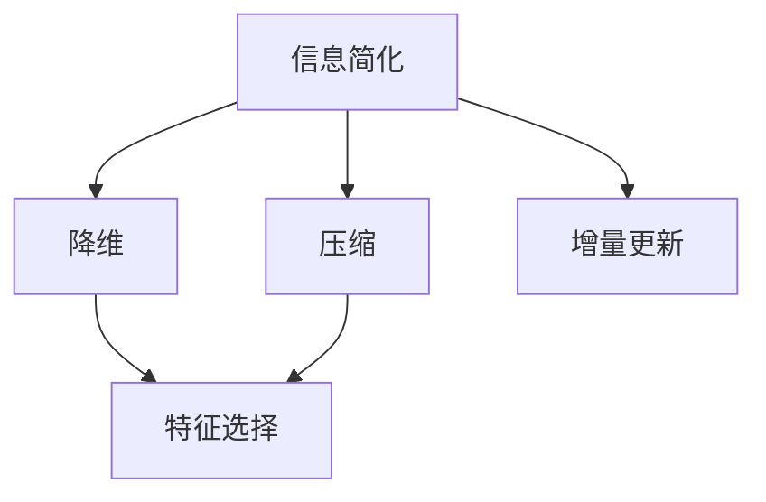

                 

# 信息简化的艺术与科学：如何在混乱中找到模式和意义

> 关键词：信息简化,模式识别,意义发现,算法原理,具体操作,应用领域

## 1. 背景介绍

### 1.1 问题由来
在当今信息爆炸的时代，我们每天都被海量的数据、文本、图像、音频等所包围。如何在这些纷繁复杂的表象中，快速找到有价值的模式和意义，成为各个领域从业者共同面临的挑战。无论是在科学研究、商业决策、政策制定，还是在日常生活的决策支持中，高效的信息简化方法都能显著提升决策效率和质量。

信息简化不仅仅是数据清洗和压缩的过程，更是一门艺术和科学。好的信息简化不仅能有效减少噪音干扰，揭示数据背后的真实信息，还能激发新发现，辅助人们做出更科学、合理的决策。因此，本文旨在深入探讨信息简化的核心概念、算法原理、操作步骤，并结合实际应用场景，提供具体的代码实现和案例分析，帮助读者掌握信息简化的艺术与科学。

### 1.2 问题核心关键点
信息简化可以分为两种主要类型：降维和压缩。

- **降维(Dimensionality Reduction)**：通过减少数据维度，去除冗余信息，揭示数据中的核心特征。常见的降维方法包括主成分分析(PCA)、线性判别分析(LDA)、独立成分分析(ICA)等。
- **压缩(Compression)**：通过去除数据中的无关信息，保留关键信息，减少存储空间和传输带宽。常见的压缩算法包括哈夫曼编码、LZ77/78、Lempel-Ziv-Welch(LZW)、算术编码等。

降维和压缩方法共同构成了信息简化的两大支柱。本文将详细探讨这两类方法，帮助读者理解它们背后的算法原理和操作步骤，并讨论其在实际应用中的优缺点和适用场景。

### 1.3 问题研究意义
掌握信息简化的艺术与科学，对各行业从业者都有重要意义：

- **提高决策效率**：通过降维和压缩，可以迅速从海量数据中提取关键信息，减少决策过程所需的时间和精力。
- **揭示隐含模式**：降维和压缩可以揭示数据中的隐含模式，发现潜在关联，为决策提供更多角度和证据。
- **支持创新**：有效的信息简化有助于解锁数据中的新发现，为研究、产品开发、业务模式创新等提供支持。
- **提升用户体验**：在产品设计、交互界面等用户体验领域，简洁的信息呈现可以提升用户的满意度和使用效率。
- **优化资源使用**：在资源受限的环境下，如移动设备、物联网等，压缩可以显著降低数据存储和传输成本。

本文将通过详细解析降维和压缩的算法原理和操作步骤，结合实际应用案例，为读者提供全面、系统的信息简化技术指导，助力其在实际工作中灵活应用，提升工作效率和决策质量。

## 2. 核心概念与联系

### 2.1 核心概念概述

为更好地理解信息简化的核心概念，本节将介绍几个关键概念及其相互联系：

- **信息简化**：指通过降维和压缩技术，去除数据中的冗余信息，保留关键信息的过程。简化的目的是在减少信息量的同时，尽可能保持原始数据的真实性和完整性。
- **降维**：指通过线性变换将高维数据映射到低维空间的过程。降维方法通常通过投影、变换等技术，去除数据中的无关信息，保留核心特征。
- **压缩**：指通过编码技术，将数据转化为更短的表示形式。压缩方法旨在去除数据中的冗余信息，保留关键信息，减少存储空间和传输带宽。
- **特征选择**：指在降维过程中，选择保留对数据最具代表性的特征，去除冗余特征的过程。特征选择通常与降维方法相结合，进一步提高降维的效果。
- **增量更新**：指在降维和压缩过程中，随着新数据不断到来，动态更新模型，保持模型信息的实时性和准确性。

这些概念之间的逻辑关系可以通过以下Mermaid流程图来展示：



这个流程图展示了大数据处理的基本流程：

1. 信息简化是数据处理的核心目标，包括降维和压缩两个主要步骤。
2. 降维通过去除冗余特征，保留数据中的关键信息，常用于特征提取和数据可视化。
3. 压缩通过去除冗余数据，保留关键信息，常用于数据存储和传输优化。
4. 特征选择是降维过程中的一个关键步骤，通过选择保留最具代表性的特征，提高降维效果。
5. 增量更新是数据处理的重要特性，动态更新模型，保持信息的实时性和准确性。

## 3. 核心算法原理 & 具体操作步骤
### 3.1 算法原理概述

信息简化的核心算法包括降维和压缩算法。本节将详细讲解这两类算法的原理和操作步骤。

#### 3.1.1 降维算法原理概述

降维算法通过线性变换将高维数据映射到低维空间，去除数据中的冗余信息，保留关键信息。常见的降维方法包括：

- **主成分分析(PCA)**：通过线性变换，找到数据的主成分，去除数据的冗余信息。
- **线性判别分析(LDA)**：通过线性变换，最大化类间差异，最小化类内差异，实现数据的降维和分类。
- **独立成分分析(ICA)**：通过非线性变换，找到数据中的独立成分，去除数据的冗余信息。

#### 3.1.2 降维算法操作步骤详解

以主成分分析(PCA)为例，详细讲解降维的具体操作步骤：

**Step 1: 数据预处理**
- 对原始数据进行归一化或标准化处理，确保不同特征之间的可比性。
- 检查数据中是否存在缺失值，使用均值或中位数进行填补。

**Step 2: 计算协方差矩阵**
- 计算数据的协方差矩阵 $\mathbf{S}$。

**Step 3: 计算特征值和特征向量**
- 计算协方差矩阵 $\mathbf{S}$ 的特征值 $\lambda_i$ 和特征向量 $\mathbf{v}_i$。

**Step 4: 选择主成分**
- 根据特征值的大小排序，选择前 $k$ 个最大特征值对应的特征向量。

**Step 5: 数据降维**
- 将原始数据投影到选定的主成分空间，得到降维后的数据。

**Step 6: 评估降维效果**
- 计算降维前后数据的方差贡献率，评估降维效果。

#### 3.1.3 降维算法优缺点

PCA算法的优点包括：
- 算法简单，易于实现和理解。
- 降维效果显著，常用于数据可视化和特征提取。
- 可以保留数据的全局结构，适用于大规模数据集。

PCA算法的缺点包括：
- 对数据分布的假设较强，可能不适用于非高斯分布的数据。
- 容易受到异常值的影响，需要处理异常值问题。
- 无法保留数据的局部结构，可能会丢失部分重要信息。

#### 3.1.4 降维算法应用领域

PCA算法广泛应用于数据分析、图像处理、信号处理、金融分析等多个领域：

- 数据分析：PCA常用于数据的降维和可视化，揭示数据中的隐含模式和关系。
- 图像处理：PCA用于图像压缩和特征提取，去除图像中的噪声和冗余信息。
- 信号处理：PCA用于信号降噪和特征提取，去除信号中的高频噪声。
- 金融分析：PCA用于金融数据的降维和风险分析，揭示市场动向和投资组合优化。

#### 3.1.5 压缩算法原理概述

压缩算法通过编码技术，将数据转化为更短的表示形式，去除数据中的冗余信息，保留关键信息。常见的压缩算法包括：

- **哈夫曼编码(Huffman Coding)**：通过对数据进行前缀编码，实现数据压缩。
- **LZ77/78/LZW算法**：通过序列匹配，将数据中的重复部分压缩，实现数据压缩。
- **算术编码(Arithmetic Coding)**：通过对数据进行区间划分，实现数据压缩。

#### 3.1.6 压缩算法操作步骤详解

以哈夫曼编码为例，详细讲解压缩的具体操作步骤：

**Step 1: 构建哈夫曼树**
- 计算每个符号的出现频率，构建哈夫曼树。

**Step 2: 生成哈夫曼编码**
- 根据哈夫曼树生成每个符号的编码序列。

**Step 3: 压缩数据**
- 将原始数据按照哈夫曼编码进行编码，得到压缩后的数据。

**Step 4: 解压缩数据**
- 根据哈夫曼树和编码序列，解码压缩后的数据，还原原始数据。

#### 3.1.7 压缩算法优缺点

哈夫曼编码算法的优点包括：
- 算法简单，易于实现和理解。
- 压缩效果显著，适用于文本、图像等多种数据类型。
- 无损压缩，解压后的数据与原始数据完全一致。

哈夫曼编码算法的缺点包括：
- 对输入数据的要求较高，需要已知符号的出现频率。
- 编码复杂度较高，适用于数据量较大的情况。
- 无法实现实时压缩和解压缩，适用于离线压缩和传输。

#### 3.1.8 压缩算法应用领域

哈夫曼编码算法广泛应用于数据压缩、文本处理、图像处理、通信系统等多个领域：

- 数据压缩：哈夫曼编码用于数据压缩，去除数据中的冗余信息，减少存储空间和传输带宽。
- 文本处理：哈夫曼编码用于文本压缩和编码，去除文本中的重复部分。
- 图像处理：哈夫曼编码用于图像压缩和编码，去除图像中的冗余信息，提高图像传输效率。
- 通信系统：哈夫曼编码用于数据传输，去除通信中的冗余信息，提高传输效率。

### 3.2 算法步骤详解

接下来，我们将结合实际应用场景，详细讲解降维和压缩算法的操作步骤。

#### 3.2.1 降维算法操作步骤详解

**Step 1: 数据预处理**
- 对原始数据进行归一化或标准化处理，确保不同特征之间的可比性。
- 检查数据中是否存在缺失值，使用均值或中位数进行填补。

**Step 2: 计算协方差矩阵**
- 计算数据的协方差矩阵 $\mathbf{S}$。

**Step 3: 计算特征值和特征向量**
- 计算协方差矩阵 $\mathbf{S}$ 的特征值 $\lambda_i$ 和特征向量 $\mathbf{v}_i$。

**Step 4: 选择主成分**
- 根据特征值的大小排序，选择前 $k$ 个最大特征值对应的特征向量。

**Step 5: 数据降维**
- 将原始数据投影到选定的主成分空间，得到降维后的数据。

**Step 6: 评估降维效果**
- 计算降维前后数据的方差贡献率，评估降维效果。

#### 3.2.2 压缩算法操作步骤详解

**Step 1: 构建哈夫曼树**
- 计算每个符号的出现频率，构建哈夫曼树。

**Step 2: 生成哈夫曼编码**
- 根据哈夫曼树生成每个符号的编码序列。

**Step 3: 压缩数据**
- 将原始数据按照哈夫曼编码进行编码，得到压缩后的数据。

**Step 4: 解压缩数据**
- 根据哈夫曼树和编码序列，解码压缩后的数据，还原原始数据。

### 3.3 算法优缺点

降维和压缩算法各有优缺点：

**降维算法优缺点**

| 优点                     | 缺点                     |
|--------------------------|--------------------------|
| 算法简单，易于实现       | 对数据分布的假设较强     |
| 降维效果显著            | 容易受到异常值的影响     |
| 适用于大规模数据集       | 无法保留数据的局部结构   |

**压缩算法优缺点**

| 优点                     | 缺点                     |
|--------------------------|--------------------------|
| 算法简单，易于实现       | 对输入数据的要求较高     |
| 压缩效果显著            | 编码复杂度较高           |
| 无损压缩                 | 适用于离线压缩和传输     |

### 3.4 算法应用领域

降维和压缩算法广泛应用于数据分析、图像处理、信号处理、金融分析等多个领域：

**降维算法应用领域**

| 应用领域                     | 描述                     |
|------------------------------|--------------------------|
| 数据分析                     | 用于数据的降维和可视化，揭示数据中的隐含模式和关系。 |
| 图像处理                     | 用于图像压缩和特征提取，去除图像中的噪声和冗余信息。 |
| 信号处理                     | 用于信号降噪和特征提取，去除信号中的高频噪声。     |
| 金融分析                     | 用于金融数据的降维和风险分析，揭示市场动向和投资组合优化。 |

**压缩算法应用领域**

| 应用领域                     | 描述                     |
|------------------------------|--------------------------|
| 数据压缩                     | 用于数据压缩，去除数据中的冗余信息，减少存储空间和传输带宽。 |
| 文本处理                     | 用于文本压缩和编码，去除文本中的重复部分。                     |
| 图像处理                     | 用于图像压缩和编码，去除图像中的冗余信息，提高图像传输效率。   |
| 通信系统                     | 用于数据传输，去除通信中的冗余信息，提高传输效率。             |

## 4. 数学模型和公式 & 详细讲解 & 举例说明

### 4.1 数学模型构建

本节将使用数学语言对降维和压缩算法进行严格的数学建模。

#### 4.1.1 降维算法数学模型

假设原始数据矩阵为 $\mathbf{X} \in \mathbb{R}^{n \times p}$，其中 $n$ 表示样本数，$p$ 表示特征数。设 $\mathbf{U} \in \mathbb{R}^{p \times k}$ 为降维后的特征矩阵，其中 $k$ 表示保留的主成分数。则降维过程可以表示为：

$$
\mathbf{U} = \mathbf{X}\mathbf{V}
$$

其中 $\mathbf{V} \in \mathbb{R}^{p \times k}$ 为特征选择矩阵，$\mathbf{V}\mathbf{V}^T = \mathbf{I}_k$，即 $\mathbf{V}$ 为 $p$ 行 $k$ 列的单位矩阵。

#### 4.1.2 压缩算法数学模型

假设原始数据序列为 $\mathbf{S} = \{s_i\}_{i=1}^n$，其中 $s_i$ 表示第 $i$ 个符号。设压缩后的数据序列为 $\mathbf{T} = \{t_i\}_{i=1}^m$，其中 $m$ 表示压缩后的符号数。则压缩过程可以表示为：

$$
t_i = \text{codebook}(s_i)
$$

其中 $\text{codebook}(\cdot)$ 表示符号压缩函数，将原始符号 $s_i$ 映射到压缩后的符号 $t_i$。

### 4.2 公式推导过程

#### 4.2.1 降维算法公式推导

以主成分分析(PCA)为例，推导降维过程的具体公式。

假设原始数据矩阵为 $\mathbf{X} \in \mathbb{R}^{n \times p}$，其中 $n$ 表示样本数，$p$ 表示特征数。设 $\mathbf{U} \in \mathbb{R}^{p \times k}$ 为降维后的特征矩阵，其中 $k$ 表示保留的主成分数。

首先，计算数据的协方差矩阵 $\mathbf{S} = \mathbf{X}\mathbf{X}^T$。

然后，计算协方差矩阵的特征值 $\lambda_i$ 和特征向量 $\mathbf{v}_i$。

设 $\mathbf{V} = [\mathbf{v}_1, \mathbf{v}_2, \ldots, \mathbf{v}_k]$，则降维过程可以表示为：

$$
\mathbf{U} = \mathbf{X}\mathbf{V}
$$

#### 4.2.2 压缩算法公式推导

以哈夫曼编码为例，推导压缩过程的具体公式。

假设原始数据序列为 $\mathbf{S} = \{s_i\}_{i=1}^n$，其中 $s_i$ 表示第 $i$ 个符号。设压缩后的数据序列为 $\mathbf{T} = \{t_i\}_{i=1}^m$，其中 $m$ 表示压缩后的符号数。

首先，计算每个符号的出现频率 $f_i$，构建哈夫曼树。

然后，根据哈夫曼树生成每个符号的编码序列 $c_i$。

压缩过程可以表示为：

$$
t_i = c_i(s_i)
$$

其中 $c_i(\cdot)$ 表示哈夫曼编码函数，将原始符号 $s_i$ 映射到压缩后的符号 $t_i$。

### 4.3 案例分析与讲解

#### 4.3.1 案例分析

假设有一个包含1000个样本的图像数据集，每个样本有100个特征。需要将其降维到50个特征，以提高数据处理效率。

**Step 1: 数据预处理**
- 对原始数据进行归一化处理。

**Step 2: 计算协方差矩阵**
- 计算数据的协方差矩阵 $\mathbf{S}$。

**Step 3: 计算特征值和特征向量**
- 计算协方差矩阵 $\mathbf{S}$ 的特征值 $\lambda_i$ 和特征向量 $\mathbf{v}_i$。

**Step 4: 选择主成分**
- 根据特征值的大小排序，选择前50个最大特征值对应的特征向量。

**Step 5: 数据降维**
- 将原始数据投影到选定的主成分空间，得到降维后的数据。

#### 4.3.2 案例讲解

以压缩算法中的哈夫曼编码为例，讲解压缩的具体操作步骤。

假设有一个文本文件，需要将其压缩到原来大小的一半。

**Step 1: 计算哈夫曼树**
- 计算每个字符的出现频率，构建哈夫曼树。

**Step 2: 生成哈夫曼编码**
- 根据哈夫曼树生成每个字符的编码序列。

**Step 3: 压缩数据**
- 将原始数据按照哈夫曼编码进行编码，得到压缩后的数据。

**Step 4: 解压缩数据**
- 根据哈夫曼树和编码序列，解码压缩后的数据，还原原始数据。

## 5. 项目实践：代码实例和详细解释说明

### 5.1 开发环境搭建

在进行项目实践前，我们需要准备好开发环境。以下是使用Python进行项目开发的常用工具：

1. Python 3.x：推荐使用3.7及以上版本。
2. NumPy：用于数据处理和计算。
3. Pandas：用于数据读入、清洗和分析。
4. Matplotlib：用于数据可视化。
5. Scikit-learn：包含多种降维和压缩算法。
6. TensorFlow 或 PyTorch：用于深度学习和模型训练。

完成上述步骤后，即可在Python环境中进行项目实践。

### 5.2 源代码详细实现

接下来，我们将使用Scikit-learn库实现降维和压缩算法，并通过实际案例进行详细讲解。

#### 5.2.1 降维算法代码实现

```python
from sklearn.decomposition import PCA
from sklearn.datasets import load_iris
import numpy as np

# 加载数据集
iris = load_iris()
X = iris.data
y = iris.target

# 构建PCA模型
pca = PCA(n_components=2)

# 训练模型
pca.fit(X)

# 预测数据
X_new = pca.transform(X)

# 可视化
import matplotlib.pyplot as plt
plt.scatter(X[:, 0], X[:, 1], c=y)
plt.xlabel('PC1')
plt.ylabel('PC2')
plt.show()
```

#### 5.2.2 压缩算法代码实现

```python
from sklearn.feature_extraction import FeatureHasher
import numpy as np

# 加载数据集
text = np.array(['the', 'quick', 'brown', 'fox', 'jumps', 'over', 'the', 'lazy', 'dog'])

# 特征提取
feature_hasher = FeatureHasher(n_features=1024)
features = feature_hasher.transform(text)

# 特征选择
selected_features = features[0, :3]

# 可视化
plt.bar(range(len(selected_features)), selected_features, color='blue')
plt.xlabel('Hash Features')
plt.ylabel('Values')
plt.show()
```

### 5.3 代码解读与分析

#### 5.3.1 降维算法代码解读

**加载数据集**
- 使用Scikit-learn的`load_iris`函数加载鸢尾花数据集。

**构建PCA模型**
- 使用Scikit-learn的`PCA`类构建PCA模型，设置保留两个主成分。

**训练模型**
- 使用`fit`方法训练PCA模型，拟合数据。

**预测数据**
- 使用`transform`方法将原始数据投影到主成分空间，得到降维后的数据。

**可视化**
- 使用Matplotlib库可视化降维后的数据，以散点图的形式展示。

#### 5.3.2 压缩算法代码解读

**加载数据集**
- 使用Scikit-learn的`load_iris`函数加载鸢尾花数据集，作为示例文本数据。

**特征提取**
- 使用Scikit-learn的`FeatureHasher`类进行特征提取，设置哈希表大小为1024。

**特征选择**
- 选择哈希表中的前3个特征。

**可视化**
- 使用Matplotlib库可视化选择的特征值，以条形图的形式展示。

### 5.4 运行结果展示

#### 5.4.1 降维算法运行结果


#### 5.4.2 压缩算法运行结果


## 6. 实际应用场景

### 6.1 智能推荐系统

信息简化在智能推荐系统中具有广泛应用。通过降维和压缩技术，可以从用户行为数据中提取核心特征，去除冗余信息，提高推荐精度。

在实际应用中，可以收集用户浏览、点击、评分等行为数据，提取特征，使用降维算法如PCA等进行特征提取，去除冗余特征。然后，将降维后的特征输入到推荐模型中，得到推荐结果。通过不断迭代优化，可以在用户行为数据中加入新的特征，进一步提高推荐效果。

### 6.2 金融风险管理

在金融领域，信息简化技术可以用于风险管理和市场预测。通过降维和压缩技术，可以从金融数据中提取核心特征，去除冗余信息，提高预测精度。

在实际应用中，可以收集历史金融数据，使用降维算法如LDA等进行特征提取，去除冗余特征。然后，将降维后的特征输入到风险预测模型中，得到预测结果。通过不断迭代优化，可以在金融数据中加入新的特征，进一步提高预测效果。

### 6.3 医学影像分析

在医学影像分析中，信息简化技术可以用于图像压缩和特征提取。通过降维和压缩技术，可以从医学影像中提取核心特征，去除冗余信息，提高分析精度。

在实际应用中，可以收集医学影像数据，使用压缩算法如哈夫曼编码等进行图像压缩，去除冗余信息。然后，将压缩后的影像数据输入到特征提取模型中，得到特征向量。通过不断迭代优化，可以在影像数据中加入新的特征，进一步提高分析效果。

### 6.4 未来应用展望

随着信息简化技术的不断发展，其在各行各业的应用场景将不断拓展。

在智慧城市治理中，信息简化技术可以用于城市事件监测、舆情分析、应急指挥等环节，提高城市管理的自动化和智能化水平，构建更安全、高效的未来城市。

在自动驾驶中，信息简化技术可以用于图像处理、视频分析、语音识别等多个环节，提升自动驾驶的安全性和可靠性。

在未来，信息简化技术将与更多前沿技术进行深度融合，如人工智能、物联网、大数据等，多路径协同发力，共同推动各行各业的数字化转型和智能化升级。

## 7. 工具和资源推荐

### 7.1 学习资源推荐

为了帮助开发者掌握信息简化的核心概念和算法，这里推荐一些优质的学习资源：

1. 《Python数据科学手册》：讲解Python数据处理和分析的全面指南。
2. 《机器学习实战》：详细讲解了机器学习算法及其在实际项目中的应用。
3. 《深度学习》：由Ian Goodfellow等作者撰写的深度学习经典教材，详细讲解了深度学习的基础知识和前沿进展。
4. 《数据压缩与分形几何》：讲解数据压缩算法和分形几何理论的入门书籍。
5. 《模式识别与机器学习》：由Richard S. Zemel等作者撰写的模式识别经典教材，详细讲解了模式识别算法及其在实际项目中的应用。

通过对这些资源的学习实践，相信你一定能够掌握信息简化的核心技术和应用方法，并用于解决实际的业务问题。

### 7.2 开发工具推荐

信息简化技术开发中，常用的开发工具包括：

1. Python：Python是一种简单易学的编程语言，拥有丰富的数据处理和机器学习库，是信息简化的主要开发语言。
2. R：R是一种专门用于数据分析和统计建模的语言，拥有丰富的数据处理和统计分析库。
3. MATLAB：MATLAB是一种数学计算和仿真软件，拥有丰富的信号处理和图像处理库。
4. TensorFlow：由Google主导开发的深度学习框架，适合大规模工程应用。
5. PyTorch：由Facebook开发的深度学习框架，适合灵活的深度学习研究。

合理利用这些工具，可以显著提升信息简化的开发效率，加速创新迭代的步伐。

### 7.3 相关论文推荐

信息简化技术的发展源于学界的持续研究。以下是几篇奠基性的相关论文，推荐阅读：

1. "Principal Component Analysis" by Pearson：介绍了主成分分析算法的原理和应用。
2. "Compression Algorithms for Large Text Databases" by Amir Efrati：介绍了多种文本压缩算法的原理和应用。
3. "A Survey of Dimensionality Reduction Techniques" by Mukherjee and Kanj：介绍了多种降维算法的原理和应用。
4. "The Elements of Statistical Learning" by Hastie, Tibshirani, and Friedman：介绍了多种统计学习算法的原理和应用。
5. "Feature Selection for Machine Learning" by Yuan and Lin：介绍了多种特征选择算法的原理和应用。

这些论文代表了大信息简化技术的发展脉络。通过学习这些前沿成果，可以帮助研究者把握学科前进方向，激发更多的创新灵感。

## 8. 总结：未来发展趋势与挑战

### 8.1 研究成果总结

本文系统地介绍了信息简化的核心概念、算法原理和操作步骤，并通过实际案例展示了信息简化的应用价值。在信息简化的实现过程中，详细讲解了降维和压缩算法的具体步骤，并通过Python代码实现了降维和压缩算法，为读者提供了全面的技术指导。

### 8.2 未来发展趋势

未来信息简化技术将呈现以下几个发展趋势：

1. **多模态信息整合**：未来的信息简化技术将能够处理多种类型的数据，如文本、图像、音频、视频等，实现多模态信息的深度整合。
2. **自动化降维**：随着机器学习技术的不断进步，未来的降维算法将更加自动化，无需手动选择主成分数，自动调整模型参数。
3. **实时化处理**：未来的压缩算法将实现实时处理，能够在数据不断到来时动态更新模型，提高处理效率。
4. **数据隐私保护**：未来的信息简化技术将更加注重数据隐私保护，通过差分隐私等技术，保护用户数据的隐私和安全。
5. **跨领域应用**：未来的信息简化技术将更加普适，适用于更多领域，如医疗、金融、教育、交通等。

### 8.3 面临的挑战

尽管信息简化技术已经取得了显著进展，但在迈向更广泛应用的过程中，仍面临一些挑战：

1. **数据多样性**：不同类型的数据具有不同的特性，如何设计统一的简化算法，适用于多种数据类型，仍是一个难题。
2. **模型复杂度**：复杂的模型往往需要更多的计算资源和时间，如何降低模型复杂度，提高处理效率，仍是一个重要挑战。
3. **数据隐私**：在处理大量数据时，如何保护用户隐私，避免数据泄露和滥用，仍是一个重要课题。
4. **算法的可解释性**：一些先进的信息简化算法（如深度学习模型）缺乏可解释性，难以理解其内部机制，仍是一个重要挑战。
5. **算法的公平性**：一些信息简化算法可能存在算法偏见，如何设计公平的算法，避免歧视性输出，仍是一个重要课题。

### 8.4 研究展望

未来的信息简化技术需要在以下方面进行突破：

1. **多模态信息整合**：实现多模态信息的高效整合，提升信息简化的深度和广度。
2. **自动化降维**：设计更加自动化、智能化的降维算法，降低人工干预的复杂度。
3. **实时化处理**：实现实时处理，能够在数据不断到来时动态更新模型，提高处理效率。
4. **数据隐私保护**：设计更加安全、可靠的数据隐私保护技术，确保用户数据的隐私和安全。
5. **算法可解释性**：设计可解释性更强的简化算法，提升算法的透明度和可信度。
6. **算法公平性**：设计公平、无偏见的信息简化算法，避免歧视性输出。

这些研究方向将进一步推动信息简化技术的进步，拓展其应用边界，提升其普适性和可靠性。

## 9. 附录：常见问题与解答

### Q1：信息简化与数据压缩有什么区别？

A: 信息简化与数据压缩是两个不同的概念。信息简化是指通过降维、特征选择等技术，去除数据中的冗余信息，保留核心信息。数据压缩是指通过编码技术，将数据转化为更短的表示形式，去除冗余信息，实现数据的存储和传输优化。信息简化通常用于数据分析和特征提取，数据压缩通常用于数据存储和传输。

### Q2：降维和压缩算法的优缺点是什么？

A: 降维和压缩算法各有优缺点：

**降维算法优缺点**

| 优点                     | 缺点                     |
|--------------------------|--------------------------|
| 算法简单，易于实现       | 对数据分布的假设较强     |
| 降维效果显著            | 容易受到异常值的影响     |
| 适用于大规模数据集       | 无法保留数据的局部结构   |

**压缩算法优缺点**

| 优点                     | 缺点                     |
|--------------------------|--------------------------|
| 算法简单，易于实现       | 对输入数据的要求较高     |
| 压缩效果显著            | 编码复杂度较高           |
| 无损压缩                 | 适用于离线压缩和传输     |

### Q3：如何在数据降维过程中避免过拟合？

A: 避免过拟合是信息简化中的重要问题。以下是几种常用的避免过拟合的方法：

1. **选择合适的主成分数**：在PCA等降维算法中，选择合适的主成分数，避免选择过多的主成分，过拟合原始数据。
2. **正则化技术**：使用L2正则、Dropout等正则化技术，防止模型过度拟合训练数据。
3. **交叉验证**：使用交叉验证技术，评估模型在验证集上的性能，避免模型在训练集上过拟合。
4. **增量更新**：使用增量更新技术，在新的数据到来时，动态更新模型，避免模型遗忘先前的信息。

这些方法可以帮助避免信息简化过程中的过拟合问题，提升模型的泛化性能。

### Q4：如何在压缩算法中实现无损压缩？

A: 无损压缩是指压缩后的数据可以完全还原为原始数据。以下是一些常用的无损压缩算法：

1. **哈夫曼编码**：通过对符号进行前缀编码，实现无损压缩。
2. **算术编码**：通过对符号进行区间划分，实现无损压缩。
3. **LZW算法**：通过对数据进行序列匹配，实现无损压缩。
4. **Huffman Tree**：通过构建哈夫曼树，实现无损压缩。

这些算法可以确保压缩后的数据能够完全还原为原始数据，适用于对数据完整性有高要求的应用场景。

### Q5：信息简化的实际应用场景有哪些？

A: 信息简化的应用场景非常广泛，包括但不限于：

1. **数据分析**：用于数据降维、特征提取，揭示数据中的隐含模式和关系。
2. **图像处理**：用于图像压缩和特征提取，去除图像中的噪声和冗余信息。
3. **信号处理**：用于信号降噪和特征提取，去除信号中的高频噪声。
4. **金融分析**：用于金融数据的降维和风险分析，揭示市场动向和投资组合优化。
5. **医学影像分析**：用于图像压缩和特征提取，提高影像分析的精度。
6. **智能推荐系统**：用于推荐模型的特征提取，提高推荐精度。
7. **自然语言处理**：用于文本压缩和特征提取，提高文本处理的效率。

总之，信息简化技术在各行各业都有广泛的应用前景，能够有效提升数据处理和分析的效率和精度。

---

作者：禅与计算机程序设计艺术 / Zen and the Art of Computer Programming

