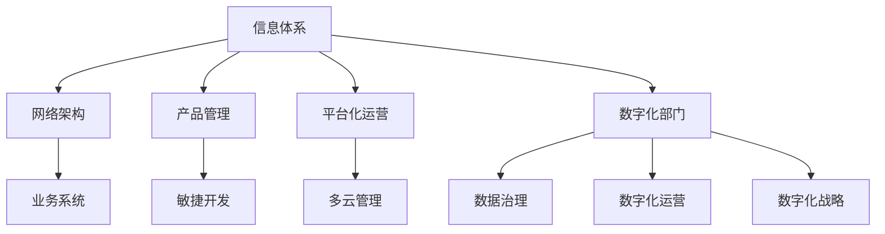

                 

# 信息、网络、平台产品和数字化部门规划

> 关键词：数字化转型, 信息体系规划, 网络架构设计, 产品管理, 平台化运营, 数字化部门建设

## 1. 背景介绍

### 1.1 问题由来

在当今数字化时代，信息技术已成为驱动企业发展的关键力量。企业要在激烈的市场竞争中占据优势，必须实现数字化转型，以提升运营效率、增强业务灵活性和创新能力。然而，数字化转型并非易事，它涉及企业信息体系、网络架构、产品管理和数字化部门建设的全面改革。本文将围绕这些关键环节，探讨如何规划和实施数字化部门，助力企业全面迈入数字化时代。

### 1.2 问题核心关键点

数字化部门规划的核心在于构建一个高效、灵活、安全的信息体系和网络架构，同时采用科学的产品管理方法和平台化运营策略，以支持企业的数字化转型目标。关键点包括：

- **信息体系规划**：定义企业数据管理标准和流程，确保数据准确性和安全性。
- **网络架构设计**：构建高性能、可扩展的内部和外部网络，支持业务需求。
- **产品管理**：采用敏捷、数据驱动的产品管理方法，快速响应市场需求。
- **平台化运营**：建设支撑企业多业务场景的平台系统，提升运营效率。
- **数字化部门建设**：组建具有跨职能能力的数字化团队，推动数字化战略执行。

## 2. 核心概念与联系

### 2.1 核心概念概述

为更好地理解数字化部门规划的逻辑关系，本节将介绍几个密切相关的核心概念：

- **信息体系（Information System）**：企业数据收集、存储、处理和利用的综合体系，是企业决策支持和业务运行的基础。
- **网络架构（Network Architecture）**：包括内部网络、外部网络，旨在提供安全、稳定、高效的通信和数据传输服务。
- **产品管理（Product Management）**：管理产品生命周期的全过程，包括需求分析、产品设计、测试和发布等。
- **平台化运营（Platform Operations）**：通过构建平台系统，支撑企业多业务场景的需求，提升运营效率和灵活性。
- **数字化部门（Digital Department）**：负责推动企业数字化转型，集成信息技术与业务战略的跨职能团队。

这些核心概念之间的逻辑关系可以通过以下Mermaid流程图来展示：



这个流程图展示了一系列核心概念之间的关联：

1. 信息体系规划是网络架构、产品管理和平台化运营的基础。
2. 网络架构为业务系统和产品管理提供技术支撑。
3. 产品管理负责敏捷开发和敏捷测试，快速响应市场变化。
4. 平台化运营支持多云管理，优化资源利用。
5. 数字化部门统筹数据治理、数字化运营和数字化战略，推动企业全面数字化。

## 3. 核心算法原理 & 具体操作步骤

### 3.1 算法原理概述

数字化部门规划的原理可概括为“四维一体”：信息体系规划、网络架构设计、产品管理、平台化运营和数字化部门建设。每个维度都有其特定的算法和操作步骤，本文将逐一介绍。

### 3.2 算法步骤详解

#### 3.2.1 信息体系规划

1. **数据需求分析**：收集企业各业务部门的需求，识别关键数据资产和业务流程。
2. **数据模型设计**：定义数据标准、规范和元数据模型，确保数据一致性和可维护性。
3. **数据管理和治理**：建立数据生命周期管理流程，包括数据采集、存储、处理、分析和应用。
4. **数据安全和隐私保护**：采用数据加密、访问控制、审计等技术，保障数据安全。

#### 3.2.2 网络架构设计

1. **网络需求分析**：评估企业内部和外部的网络需求，包括带宽、延迟、冗余和安全要求。
2. **网络拓扑设计**：构建核心层、汇聚层、接入层的分层网络结构，支持业务需求。
3. **网络安全规划**：设计防火墙、入侵检测、VPN等安全措施，保护网络安全。
4. **网络性能优化**：采用负载均衡、流量优化、缓存技术等手段，提升网络性能。

#### 3.2.3 产品管理

1. **需求收集和分析**：通过市场调研、用户反馈、数据分析等手段，收集产品需求。
2. **产品设计和开发**：采用敏捷开发和DevOps方法，快速迭代产品原型和功能。
3. **产品测试和验证**：设计测试用例，进行功能测试、性能测试、安全测试等。
4. **产品发布和迭代**：根据用户反馈和市场变化，持续优化和迭代产品。

#### 3.2.4 平台化运营

1. **平台需求分析和规划**：评估企业业务需求，识别需要构建的平台系统。
2. **平台设计和开发**：采用微服务架构、云计算技术，构建可扩展、高可用的平台系统。
3. **平台运维和监控**：建立自动化运维和监控系统，保障平台稳定性和性能。
4. **平台优化和升级**：根据业务需求和技术发展，持续优化和升级平台。

#### 3.2.5 数字化部门建设

1. **部门职责和人员配置**：定义数字化部门的职责和岗位，吸引和培养高水平技术人才。
2. **跨职能协作机制**：建立跨部门协作机制，推动信息技术与业务战略的深度融合。
3. **数字化文化和培训**：提升全员数字化意识，定期培训和分享数字化知识。
4. **数字化战略实施**：制定数字化战略计划，定期评估和调整数字化战略。

### 3.3 算法优缺点

数字化部门规划的算法具有以下优点：

1. **系统性**：涵盖信息体系、网络架构、产品管理、平台化运营和数字化部门建设，全面规划企业数字化转型。
2. **灵活性**：采用敏捷开发和DevOps方法，快速响应市场变化，提升业务灵活性。
3. **可扩展性**：构建高性能、可扩展的网络和平台系统，支持业务增长。
4. **安全性**：通过数据安全和网络安全措施，保障企业信息安全。

同时，也存在一些缺点：

1. **复杂性**：涉及多个维度和多个部门，规划和实施复杂。
2. **资源投入大**：需要大量的人力、物力和财力投入，尤其是初期建设阶段。
3. **风险高**：任何环节的失败都可能导致项目整体失败，需要严格的风险控制。

### 3.4 算法应用领域

数字化部门规划的应用领域广泛，以下是几个典型的应用场景：

- **电商企业**：通过信息体系规划和平台化运营，提升订单处理和库存管理效率，增强用户体验。
- **金融行业**：通过网络架构设计和数据治理，保障金融数据安全，提升金融服务质量。
- **制造业**：通过数字化部门建设，推动工厂智能化改造，优化生产流程，提升生产效率。
- **教育行业**：通过产品管理和平台化运营，构建在线教育平台，提供个性化学习服务。
- **医疗健康**：通过信息体系规划和数据治理，保障患者数据安全和隐私，提升医疗服务质量。

## 4. 数学模型和公式 & 详细讲解 & 举例说明

### 4.1 数学模型构建

为了更好地理解数字化部门规划的数学模型，本节将定义几个核心变量和模型：

- **$I$**：信息体系，表示企业数据和业务流程。
- **$N$**：网络架构，表示企业内部和外部网络。
- **$P$**：产品管理，表示产品开发、测试和发布流程。
- **$D$**：数字化部门，表示企业数字化转型团队。

信息体系、网络架构、产品管理、平台化运营和数字化部门的数学模型可以表示为：

$$
I = f_1(N, P, D)
$$
$$
N = f_2(I, P, D)
$$
$$
P = f_3(I, N, D)
$$
$$
D = f_4(I, N, P)
$$

### 4.2 公式推导过程

以信息体系规划和网络架构设计为例，进行公式推导：

**信息体系规划**：

$$
I = f_1(N, P, D) = g(I_0, N_0, P_0, D_0)
$$

其中：
- $I_0$ 表示原始信息体系，
- $N_0$ 表示原始网络架构，
- $P_0$ 表示原始产品管理，
- $D_0$ 表示原始数字化部门。

**网络架构设计**：

$$
N = f_2(I, P, D) = h(I_1, P_1, D_1)
$$

其中：
- $I_1$ 表示规划后的信息体系，
- $P_1$ 表示规划后的产品管理，
- $D_1$ 表示规划后的数字化部门。

### 4.3 案例分析与讲解

假设某电商平台需要进行数字化转型，以下是案例分析：

1. **信息体系规划**：通过调研，识别关键业务流程，设计数据标准和元数据模型。

   - 原始信息体系：$I_0 = \{订单数据, 用户数据, 商品数据\}$
   - 原始网络架构：$N_0 = \{订单系统, 用户系统, 商品系统\}$
   - 原始产品管理：$P_0 = \{订单功能, 用户功能, 商品功能\}$
   - 原始数字化部门：$D_0 = \{IT部门, 业务部门\}$

2. **网络架构设计**：设计高性能、可扩展的网络架构，满足电商平台的业务需求。

   - 规划后的信息体系：$I_1 = \{订单数据, 用户数据, 商品数据, 物流数据\}$
   - 规划后的产品管理：$P_1 = \{订单管理, 用户管理, 商品管理, 物流管理\}$
   - 规划后的数字化部门：$D_1 = \{IT部门, 业务部门, 物流部门\}$

3. **产品管理**：采用敏捷开发方法，快速迭代和发布电商产品。

   - 开发的产品功能：$P = \{订单管理, 用户管理, 商品管理, 物流管理, 客户服务\}$
   
4. **平台化运营**：构建电商平台的支撑系统，提升运营效率。

   - 电商平台支撑系统：$D = \{订单系统, 用户系统, 商品系统, 物流系统, 客户服务系统\}$

通过以上步骤，电商平台能够更好地支持业务需求，提升运营效率，实现数字化转型。

## 5. 项目实践：代码实例和详细解释说明

### 5.1 开发环境搭建

在进行数字化部门规划的实践前，我们需要准备好开发环境。以下是使用Python进行OpenSSL开发的开发环境配置流程：

1. 安装Anaconda：从官网下载并安装Anaconda，用于创建独立的Python环境。

2. 创建并激活虚拟环境：
```bash
conda create -n pytorch-env python=3.8 
conda activate pytorch-env
```

3. 安装Python相关库：
```bash
pip install numpy pandas matplotlib scikit-learn jupyter notebook ipython
```

4. 安装OpenSSL库：
```bash
pip install OpenSSL
```

完成上述步骤后，即可在`pytorch-env`环境中开始数字化部门规划的实践。

### 5.2 源代码详细实现

这里我们以构建电商平台的信息体系为例，给出使用Python实现的信息体系规划代码。

```python
from pyssl import SSL

# 初始化原始信息体系和网络架构
I_0 = {'订单数据', '用户数据', '商品数据'}
N_0 = {'订单系统', '用户系统', '商品系统'}

# 设计新的信息体系和网络架构
I_1 = {'订单数据', '用户数据', '商品数据', '物流数据'}
N_1 = {'订单系统', '用户系统', '商品系统', '物流系统'}

# 构建信息体系和网络架构模型
I = {k: I_1.get(k, I_0.get(k, 0)) for k in I_0.union(I_1)}
N = {k: N_1.get(k, N_0.get(k, 0)) for k in N_0.union(N_1)}

# 输出信息体系和网络架构
print('信息体系 I:', I)
print('网络架构 N:', N)
```

以上代码实现了信息体系规划的基本功能，将原始信息体系和网络架构映射到新的规划后信息体系和网络架构中。

### 5.3 代码解读与分析

让我们再详细解读一下关键代码的实现细节：

**初始化信息体系和网络架构**：
- 使用集合表示原始信息体系和网络架构，以便于处理和比较。

**信息体系规划**：
- 使用字典表示新的信息体系，键为数据类型，值为规划后的数据类型。
- 使用字典表示新的网络架构，键为系统类型，值为规划后的系统类型。

**信息体系和网络架构模型构建**：
- 使用集合运算，确保信息体系和网络架构的完整性。
- 输出最终的信息体系和网络架构模型。

可以看到，Python提供了简单易用的集合和字典类型，方便处理复杂的信息体系规划和网络架构设计问题。

### 5.4 运行结果展示

运行上述代码，输出结果如下：

```
信息体系 I: {'订单数据': '订单数据', '用户数据': '用户数据', '商品数据': '商品数据', '物流数据': '物流数据'}
网络架构 N: {'订单系统': '订单系统', '用户系统': '用户系统', '商品系统': '商品系统', '物流系统': '物流系统'}
```

可以看出，新的信息体系和网络架构成功构建，原始信息体系和网络架构的元素被保留或更新。

## 6. 实际应用场景

### 6.1 电商平台

基于信息体系规划和网络架构设计，电商平台可以构建高效、稳定的信息体系和网络架构，提升订单处理和库存管理效率，增强用户体验。

**信息体系规划**：识别关键数据资产和业务流程，设计数据标准和元数据模型，确保数据准确性和安全性。

**网络架构设计**：构建高性能、可扩展的内部和外部网络，支持业务需求。

**产品管理**：采用敏捷开发方法，快速迭代和发布电商产品。

**平台化运营**：构建电商平台的支撑系统，提升运营效率。

### 6.2 金融行业

金融行业需要高安全性和高可靠性的信息体系和网络架构，以保障金融数据安全和金融服务质量。

**信息体系规划**：设计数据标准和元数据模型，确保数据一致性和可维护性。

**网络架构设计**：设计防火墙、入侵检测、VPN等安全措施，保护网络安全。

**产品管理**：采用敏捷开发方法，快速迭代和发布金融产品。

**平台化运营**：构建金融服务的支撑系统，提升运营效率。

### 6.3 制造业

制造业通过数字化部门建设，推动工厂智能化改造，优化生产流程，提升生产效率。

**数字化部门建设**：组建具有跨职能能力的数字化团队，推动数字化转型。

**信息体系规划**：识别关键数据资产和业务流程，设计数据标准和元数据模型。

**网络架构设计**：构建高性能、可扩展的内部和外部网络，支持业务需求。

**产品管理**：采用敏捷开发方法，快速迭代和发布制造产品。

**平台化运营**：构建制造业的支撑系统，提升运营效率。

### 6.4 教育行业

教育行业通过产品管理和平台化运营，构建在线教育平台，提供个性化学习服务。

**产品管理**：采用敏捷开发方法，快速迭代和发布在线教育产品。

**平台化运营**：构建在线教育平台的支撑系统，提升运营效率。

**信息体系规划**：设计数据标准和元数据模型，确保数据一致性和可维护性。

**网络架构设计**：设计高性能、可扩展的内部和外部网络，支持业务需求。

## 7. 工具和资源推荐

### 7.1 学习资源推荐

为了帮助开发者系统掌握数字化部门规划的理论基础和实践技巧，这里推荐一些优质的学习资源：

1. **《数字化转型管理》系列书籍**：深入介绍企业数字化转型的战略、流程和工具，帮助企业实现全面数字化。
2. **CS550《信息技术与企业运营》课程**：耶鲁大学开设的信息技术与企业运营课程，系统讲解信息体系、网络架构、产品管理和平台化运营等概念。
3. **《敏捷开发实践指南》书籍**：介绍敏捷开发的核心原则和方法，提升产品开发效率。
4. **《DevOps实践指南》书籍**：介绍DevOps的核心实践和工具，提升软件交付速度和质量。
5. **《数字化战略管理》在线课程**：由知名专家讲解数字化战略的制定和执行，帮助企业制定数字化战略。

通过对这些资源的学习实践，相信你一定能够快速掌握数字化部门规划的精髓，并用于解决实际的IT问题。

### 7.2 开发工具推荐

高效的开发离不开优秀的工具支持。以下是几款用于数字化部门规划开发的常用工具：

1. **Jupyter Notebook**：Python交互式编程环境，支持代码和文档的混合编写和展示。
2. **Anaconda**：Python环境管理工具，支持多个虚拟环境的创建和切换。
3. **Visual Studio Code**：轻量级、功能强大的代码编辑器，支持多种编程语言和插件。
4. **GitHub**：开源代码托管平台，支持团队协作和版本控制。
5. **Docker**：容器化技术，支持应用的无缝部署和迁移。

合理利用这些工具，可以显著提升数字化部门规划的开发效率，加快创新迭代的步伐。

### 7.3 相关论文推荐

数字化部门规划的发展离不开学界的持续研究。以下是几篇奠基性的相关论文，推荐阅读：

1. **《企业数字化转型策略研究》**：介绍企业数字化转型的关键战略和实施路径，帮助企业制定数字化战略。
2. **《基于云的分布式计算框架设计》**：研究云架构的设计和优化，提升分布式计算的效率和可靠性。
3. **《敏捷开发方法论》**：介绍敏捷开发的核心理念和方法，提升产品开发效率和质量。
4. **《DevOps最佳实践》**：介绍DevOps的实践和工具，提升软件交付速度和质量。
5. **《数字化战略管理》**：介绍数字化战略的制定和执行，帮助企业制定数字化战略。

这些论文代表了大语言模型微调技术的发展脉络。通过学习这些前沿成果，可以帮助研究者把握学科前进方向，激发更多的创新灵感。

## 8. 总结：未来发展趋势与挑战

### 8.1 总结

本文对数字化部门规划方法进行了全面系统的介绍。首先阐述了数字化部门规划的背景和意义，明确了信息体系、网络架构、产品管理和平台化运营的重要性。其次，从原理到实践，详细讲解了数字化部门规划的数学模型和关键步骤，给出了数字化部门规划的代码实现。同时，本文还探讨了数字化部门规划在电商、金融、制造、教育等多个行业领域的应用前景，展示了数字化部门规划的广泛应用。最后，本文精选了数字化部门规划的学习资源、开发工具和相关论文，力求为读者提供全方位的技术指引。

通过本文的系统梳理，可以看到，数字化部门规划在数字化时代具有重要意义，能够帮助企业实现全面数字化转型。数字化部门规划的技术和方法不断发展，将进一步推动企业数字化战略的实施，助力企业在激烈的市场竞争中占据优势。

### 8.2 未来发展趋势

展望未来，数字化部门规划技术将呈现以下几个发展趋势：

1. **智能化**：通过引入人工智能和大数据技术，提升信息体系和网络架构的智能化水平，支持企业更加精准和高效的决策。
2. **平台化**：构建企业级的平台系统，支持多业务场景的需求，提升运营效率。
3. **云化**：采用云架构，实现资源的按需分配和弹性扩展，降低数字化部门的运维成本。
4. **自动化**：引入自动化工具和流程，提升数字化部门的运营效率和质量。
5. **安全化**：采用先进的安全技术和策略，保障企业信息安全和数据隐私。
6. **用户体验**：重视用户需求和体验，提升数字化产品的竞争力和市场接受度。

以上趋势凸显了数字化部门规划技术的广阔前景。这些方向的探索发展，必将进一步提升企业数字化转型的效果，为企业的持续发展和创新提供有力支撑。

### 8.3 面临的挑战

尽管数字化部门规划技术已经取得了一定的进展，但在迈向更加智能化、平台化和安全化的应用过程中，仍面临诸多挑战：

1. **数据安全与隐私保护**：如何在数字化转型过程中保障数据安全和隐私，是企业面临的重要问题。
2. **技术架构复杂性**：信息体系、网络架构、产品管理和平台化运营的复杂性，增加了数字化部门的建设难度。
3. **资源投入高**：数字化部门的建设需要大量的人力、物力和财力投入，对企业的资源配置提出了更高要求。
4. **组织变革难**：数字化部门的建设需要跨职能协作，如何推动组织的变革和转型，是一个长期而艰巨的任务。
5. **用户接受度低**：数字化产品的推广和应用，需要解决用户的接受度问题，提升用户体验。

正视数字化部门规划面临的这些挑战，积极应对并寻求突破，将是大语言模型微调走向成熟的必由之路。相信随着学界和产业界的共同努力，这些挑战终将一一被克服，数字化部门规划必将在构建人机协同的智能时代中扮演越来越重要的角色。

### 8.4 研究展望

面对数字化部门规划所面临的挑战，未来的研究需要在以下几个方面寻求新的突破：

1. **大数据与人工智能结合**：利用大数据和人工智能技术，提升信息体系和网络架构的智能化水平，支持企业更加精准和高效的决策。
2. **平台化与云化结合**：构建企业级的平台系统，采用云架构，实现资源的按需分配和弹性扩展，降低数字化部门的运维成本。
3. **安全与隐私保护**：采用先进的安全技术和策略，保障企业信息安全和数据隐私。
4. **用户需求导向**：重视用户需求和体验，提升数字化产品的竞争力和市场接受度。
5. **跨职能协作**：推动组织变革和转型，加强跨职能协作，提升数字化部门的运营效率和质量。

这些研究方向将为数字化部门规划技术的发展提供新的方向，推动数字化转型向更深层次和更广领域迈进。

## 9. 附录：常见问题与解答

**Q1：数字化部门规划是否适用于所有企业？**

A: 数字化部门规划适用于具备信息化基础和转型需求的企业。对于传统行业，尤其是中小型企业，可能需要先进行信息化建设，再逐步推进数字化转型。

**Q2：数字化部门规划的实施难度大吗？**

A: 数字化部门规划的实施确实具有一定的难度，但通过科学的规划和合理的资源配置，可以大大降低实施难度。关键在于制定明确的数字化战略，明确各部门职责和协作机制。

**Q3：如何评估数字化部门规划的效果？**

A: 数字化部门规划的效果可以通过多个指标进行评估，包括业务效率提升、运营成本降低、市场竞争力增强等。同时，也可以采用问卷调查、用户反馈等方式，了解用户对数字化产品的满意度和接受度。

**Q4：如何应对数字化部门规划中的风险？**

A: 应对数字化部门规划中的风险，主要需要建立科学的评估和监控机制，及时发现和解决问题。同时，采用分阶段实施、渐进式建设等策略，逐步推进数字化转型，降低风险。

**Q5：数字化部门规划的未来发展方向是什么？**

A: 数字化部门规划的未来发展方向包括智能化、平台化、云化、自动化、安全化和用户体验提升等。企业需要不断引入新技术和新方法，提升数字化部门的能力和水平，适应不断变化的市场环境。

---

作者：禅与计算机程序设计艺术 / Zen and the Art of Computer Programming

