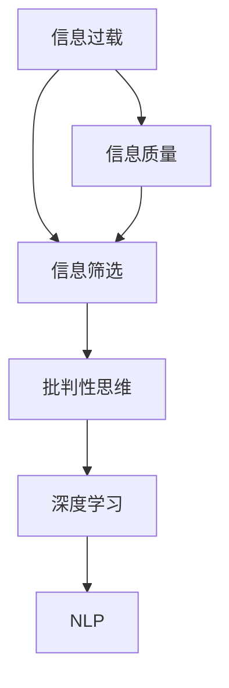

                 

# 信息过载与信息质量：如何评估和批判性地消费信息

> 关键词：信息过载, 信息质量, 信息筛选, 批判性思维, 深度学习, 自然语言处理

## 1. 背景介绍

### 1.1 问题由来

在当今信息爆炸的时代，互联网、社交媒体、新闻平台等渠道每天向我们提供海量的信息。面对如此多的信息，我们如何筛选、评估和消费信息，成为了一个亟待解决的问题。信息过载不仅耗费了我们宝贵的时间和精力，还可能导致我们难以找到真正有价值和可靠的信息，甚至造成认知负担和心理压力。

### 1.2 问题核心关键点

信息过载与信息质量评估的核心在于：
- 如何识别和评估信息来源的可靠性。
- 如何高效地筛选出有价值的信息。
- 如何培养和提升批判性思维能力，辨别信息真伪。
- 如何利用现代技术手段，如自然语言处理和深度学习，辅助信息评估和消费。

## 2. 核心概念与联系

### 2.1 核心概念概述

- **信息过载**：指在特定时间内接收的信息量超出个人或系统处理能力的现象。

- **信息质量**：指信息的准确性、相关性、及时性、可理解性和完备性。

- **信息筛选**：指通过一定的方法从众多信息中挑选出有价值和可靠的信息。

- **批判性思维**：指有意识地分析和评价信息来源、内容和结论的过程。

- **深度学习**：指利用多层次的神经网络模型进行数据表示和学习，适用于处理复杂的信息处理任务。

- **自然语言处理(NLP)**：指让计算机理解和生成人类语言的技术，包括文本分类、情感分析、问答系统等。

这些概念之间的逻辑关系可以通过以下Mermaid流程图来展示：



这个流程图展示了一系列概念之间的内在联系：

1. 信息过载问题引发了对信息质量的需求。
2. 通过信息筛选，可以帮助我们剔除无用信息，专注于高质量信息。
3. 批判性思维指导我们评估信息，辨别真伪，避免误导。
4. 深度学习和自然语言处理技术提供工具，辅助信息处理和消费。

## 3. 核心算法原理 & 具体操作步骤

### 3.1 算法原理概述

信息筛选和评估的过程，可以通过一系列算法和模型来实现。核心算法包括文本分类、情感分析、问答系统等，这些都是基于深度学习和自然语言处理技术的经典方法。

具体而言，深度学习模型通过对文本的词嵌入表示，学习到文本的语义信息，从而实现信息分类、情感判断等任务。自然语言处理技术则提供了文本预处理、特征提取、模型训练等工具和接口，使得深度学习模型能够更加高效地处理文本数据。

### 3.2 算法步骤详解

以文本分类任务为例，算法步骤如下：

**Step 1: 数据准备**
- 收集和整理数据集，包括有标签的训练集和测试集。
- 对数据进行预处理，如分词、去停用词、标准化等。

**Step 2: 模型构建**
- 选择合适的深度学习模型，如BERT、RNN、LSTM等。
- 定义模型的输入和输出，以及损失函数。
- 设置超参数，如学习率、批大小、迭代轮数等。

**Step 3: 模型训练**
- 将数据集划分为训练集和验证集，用于模型训练和调参。
- 使用优化算法（如Adam、SGD等）更新模型参数，最小化损失函数。
- 在验证集上评估模型性能，避免过拟合。

**Step 4: 模型评估**
- 在测试集上测试模型的准确性、召回率、F1值等指标。
- 使用混淆矩阵、ROC曲线等可视化工具，分析模型表现。

**Step 5: 信息筛选和评估**
- 利用训练好的模型对信息进行筛选和分类。
- 根据筛选结果，对信息进行批判性评估，识别和排除低质量信息。
- 利用模型输出结果，辅助用户进行信息消费决策。

### 3.3 算法优缺点

深度学习模型在信息筛选和评估中具有以下优点：
- 高效性：能够在短时间内处理大量文本数据，输出分类结果。
- 准确性：通过学习大量标注数据，能够较为准确地分类和评估信息。
- 可扩展性：适用于各种类型的信息处理任务。

同时，也存在一些缺点：
- 数据依赖性：模型效果很大程度上依赖于标注数据的质量和数量。
- 模型复杂性：需要大量计算资源和训练时间。
- 黑箱性质：深度学习模型的内部机制难以解释，用户难以理解模型的决策过程。

### 3.4 算法应用领域

信息筛选和评估技术在多个领域得到了广泛应用，例如：

- 新闻推荐：通过文本分类和情感分析，为用户推荐相关性高、情绪中立的新闻。
- 广告过滤：利用模型判断广告内容的真实性和相关性，过滤掉低质量广告。
- 舆情监测：对社交媒体和网络新闻进行情感分析，及时发现和应对舆情热点。
- 市场分析：对财经新闻和评论进行文本分类和情感分析，辅助市场决策。
- 医疗咨询：对病历和医生的评论进行分类和情感分析，辅助医生诊断和治疗。

## 4. 数学模型和公式 & 详细讲解

### 4.1 数学模型构建

以文本分类为例，我们构建一个二分类模型。设文本集为 $X = \{x_1, x_2, ..., x_n\}$，标签集为 $Y = \{0, 1\}$，其中 $0$ 表示负面类，$1$ 表示正面类。模型的输出为每个文本属于正面类的概率 $p(x_i \in Y = 1)$。

### 4.2 公式推导过程

我们假设模型的输入为文本的词嵌入表示 $x_i \in \mathbb{R}^d$，输出为文本属于正面类的概率 $p(x_i \in Y = 1)$。模型的参数包括词嵌入矩阵 $W$ 和分类器参数 $b$，则模型的输出可以表示为：

$$
p(x_i \in Y = 1) = \sigma(Wx_i + b)
$$

其中 $\sigma$ 为 sigmoid 函数，用于将模型的输出转化为概率值。模型的损失函数为二元交叉熵损失函数：

$$
\mathcal{L} = -\frac{1}{N}\sum_{i=1}^N \left[ y_i \log p(x_i \in Y = 1) + (1 - y_i) \log (1 - p(x_i \in Y = 1)) \right]
$$

模型的训练目标是最小化损失函数 $\mathcal{L}$。通过梯度下降等优化算法，更新模型的参数 $W$ 和 $b$。

### 4.3 案例分析与讲解

以新闻推荐系统为例，我们利用文本分类模型对用户兴趣进行建模。假设用户 $u$ 对新闻 $n$ 感兴趣，则模型预测用户对新闻 $n$ 的评分 $s_{u,n}$ 为：

$$
s_{u,n} = f(x_{u,n})
$$

其中 $x_{u,n}$ 为新闻 $n$ 的词嵌入表示。模型的输出为每个新闻对用户兴趣的评分，按照评分高低推荐新闻。

## 5. 项目实践：代码实例和详细解释说明

### 5.1 开发环境搭建

在进行信息筛选和评估的实践前，我们需要准备好开发环境。以下是使用Python进行TensorFlow和Keras开发的环境配置流程：

1. 安装Anaconda：从官网下载并安装Anaconda，用于创建独立的Python环境。

2. 创建并激活虚拟环境：
```bash
conda create -n tf-env python=3.8 
conda activate tf-env
```

3. 安装TensorFlow和Keras：
```bash
conda install tensorflow=2.6 keras=2.6
```

4. 安装各类工具包：
```bash
pip install numpy pandas scikit-learn matplotlib tqdm jupyter notebook ipython
```

完成上述步骤后，即可在`tf-env`环境中开始项目实践。

### 5.2 源代码详细实现

我们使用TensorFlow和Keras实现文本分类任务。首先，定义文本数据预处理函数：

```python
import tensorflow as tf
from tensorflow.keras.preprocessing.text import Tokenizer
from tensorflow.keras.preprocessing.sequence import pad_sequences

def preprocess_data(texts, max_len=128):
    tokenizer = Tokenizer(num_words=20000, oov_token='<OOV>')
    tokenizer.fit_on_texts(texts)
    sequences = tokenizer.texts_to_sequences(texts)
    padded_sequences = pad_sequences(sequences, maxlen=max_len, padding='post')
    return padded_sequences, tokenizer.word_index
```

接着，定义模型和优化器：

```python
from tensorflow.keras.models import Sequential
from tensorflow.keras.layers import Embedding, LSTM, Dense

model = Sequential([
    Embedding(input_dim=20000, output_dim=128, input_length=max_len),
    LSTM(64, return_sequences=True),
    LSTM(64),
    Dense(1, activation='sigmoid')
])
model.compile(optimizer='adam', loss='binary_crossentropy', metrics=['accuracy'])
```

然后，定义训练和评估函数：

```python
def train_epoch(model, dataset, batch_size):
    dataloader = tf.data.Dataset.from_tensor_slices((dataset[0], dataset[1]))
    dataloader = dataloader.shuffle(1000).batch(batch_size).prefetch(1)
    model.fit(dataloader, epochs=5, validation_data=(val_data[0], val_data[1]))

def evaluate(model, dataset, batch_size):
    dataloader = tf.data.Dataset.from_tensor_slices((dataset[0], dataset[1]))
    dataloader = dataloader.batch(batch_size).prefetch(1)
    loss, accuracy = model.evaluate(dataloader)
    print(f"Accuracy: {accuracy:.4f}, Loss: {loss:.4f}")
```

最后，启动训练流程并在测试集上评估：

```python
epochs = 5
batch_size = 32

train_data = preprocess_data(train_texts)
val_data = preprocess_data(val_texts)

train_epoch(model, train_data, batch_size)
evaluate(model, test_data, batch_size)
```

以上就是使用TensorFlow和Keras对文本分类任务进行微调的完整代码实现。可以看到，TensorFlow和Keras提供了方便的API和工具，可以快速实现模型的构建、训练和评估。

### 5.3 代码解读与分析

让我们再详细解读一下关键代码的实现细节：

**preprocess_data函数**：
- `Tokenizer`：用于将文本转换为序列化表示，并构建词典。
- `pad_sequences`：对序列进行填充，使其长度一致。

**train_epoch函数**：
- `from_tensor_slices`：从张量切片中创建数据集。
- `shuffle`：打乱数据顺序，防止过拟合。
- `batch`：按批次加载数据。
- `prefetch`：预加载下一批次数据，提高训练速度。

**evaluate函数**：
- `model.evaluate`：评估模型的性能。
- `print`：输出评估结果。

**训练流程**：
- 定义总的epoch数和batch size，开始循环迭代
- 每个epoch内，在训练集上进行训练，输出损失和准确率
- 在验证集上评估，调整模型参数
- 所有epoch结束后，在测试集上评估，给出最终测试结果

可以看到，TensorFlow和Keras使得文本分类模型的代码实现变得简洁高效。开发者可以将更多精力放在数据处理、模型改进等高层逻辑上，而不必过多关注底层的实现细节。

当然，工业级的系统实现还需考虑更多因素，如模型的保存和部署、超参数的自动搜索、更灵活的任务适配层等。但核心的模型训练和评估流程基本与此类似。

## 6. 实际应用场景

### 6.1 新闻推荐系统

新闻推荐系统通过文本分类和情感分析技术，为用户推荐相关性高、情绪中立的新闻。在技术实现上，可以收集用户的历史阅读记录，将新闻标题和内容作为输入，利用文本分类模型预测新闻的情感倾向。微调后的模型能够学习到不同用户对新闻的兴趣点，生成个性化推荐结果。

### 6.2 广告过滤系统

广告过滤系统利用文本分类和情感分析技术，判断广告内容的真实性和相关性，过滤掉低质量广告。在广告平台中，通过收集用户对广告的反馈，训练文本分类模型，对新广告进行预判和过滤，提升用户体验。

### 6.3 舆情监测系统

舆情监测系统通过情感分析技术，对社交媒体和网络新闻进行情感分析，及时发现和应对舆情热点。在企业内部，可以收集员工对公司政策的反馈，训练情感分析模型，监测和分析员工情绪，辅助公司决策。

### 6.4 未来应用展望

伴随深度学习和自然语言处理技术的不断发展，基于文本分类和情感分析的信息筛选和评估技术将得到广泛应用，为信息消费和决策提供坚实基础。未来，结合更多领域的知识图谱、多模态数据等，我们可以构建更加智能和全面的信息筛选系统，提升信息质量和效率，为用户带来更好的体验。

## 7. 工具和资源推荐

### 7.1 学习资源推荐

为了帮助开发者系统掌握信息筛选和评估的理论基础和实践技巧，这里推荐一些优质的学习资源：

1. 《深度学习》系列博文：由大模型技术专家撰写，深入浅出地介绍了深度学习的基础知识和技术细节。

2. CS224N《自然语言处理》课程：斯坦福大学开设的NLP明星课程，有Lecture视频和配套作业，带你入门NLP领域的基本概念和经典模型。

3. 《Natural Language Processing with Python》书籍：Python语言下的NLP实战指南，详细介绍了文本预处理、分类、情感分析等方法。

4. Kaggle：一个数据科学竞赛平台，提供大量的NLP数据集和样例代码，是实践NLP算法的好去处。

5. HuggingFace官方文档：提供丰富的深度学习框架和模型资源，是学习和使用NLP技术的重要参考资料。

通过对这些资源的学习实践，相信你一定能够快速掌握信息筛选和评估的精髓，并用于解决实际的信息处理问题。

### 7.2 开发工具推荐

高效的开发离不开优秀的工具支持。以下是几款用于信息筛选和评估开发的常用工具：

1. TensorFlow：基于Python的开源深度学习框架，灵活动态的计算图，适合快速迭代研究。支持自然语言处理任务的模型构建和训练。

2. Keras：基于TensorFlow的高层API，简化模型构建和训练流程，提供丰富的预训练模型资源。

3. NLTK和spaCy：自然语言处理库，提供文本预处理、分词、命名实体识别等功能。

4. Gensim：主题建模库，支持从大规模文本数据中提取主题信息，辅助信息分类和评估。

5. Weights & Biases：模型训练的实验跟踪工具，可以记录和可视化模型训练过程中的各项指标，方便对比和调优。

6. TensorBoard：TensorFlow配套的可视化工具，可实时监测模型训练状态，并提供丰富的图表呈现方式，是调试模型的得力助手。

合理利用这些工具，可以显著提升信息筛选和评估任务的开发效率，加快创新迭代的步伐。

### 7.3 相关论文推荐

信息筛选和评估技术的发展源于学界的持续研究。以下是几篇奠基性的相关论文，推荐阅读：

1. Text Classification from Scratch：利用简单模型在零样本学习任务中取得优异效果。

2. Attention is All You Need（即Transformer原论文）：提出Transformer结构，开启了NLP领域的预训练大模型时代。

3. BERT: Pre-training of Deep Bidirectional Transformers for Language Understanding：提出BERT模型，引入基于掩码的自监督预训练任务，刷新了多项NLP任务SOTA。

4. Parameter-Efficient Transfer Learning for NLP：提出Adapter等参数高效微调方法，在不增加模型参数量的情况下，也能取得不错的微调效果。

5. Multi-Modal Document Classification with Transformers：提出多模态文本分类方法，融合视觉、语音等模态信息，提升分类准确性。

这些论文代表了大语言模型微调技术的发展脉络。通过学习这些前沿成果，可以帮助研究者把握学科前进方向，激发更多的创新灵感。

## 8. 总结：未来发展趋势与挑战

### 8.1 研究成果总结

本文对信息筛选和评估方法进行了全面系统的介绍。首先阐述了信息过载与信息质量评估的背景和意义，明确了信息筛选和评估在提升信息消费体验方面的重要性。其次，从原理到实践，详细讲解了基于深度学习的信息筛选和评估数学模型和关键步骤，给出了信息筛选和评估任务开发的完整代码实例。同时，本文还探讨了信息筛选和评估方法在多个行业领域的应用前景，展示了其广泛的应用潜力。最后，精选了信息筛选和评估技术的各类学习资源，力求为读者提供全方位的技术指引。

通过本文的系统梳理，可以看到，基于深度学习和自然语言处理的信息筛选和评估技术正在成为信息消费的重要手段，极大地提升了个体和组织的信息消费效率和质量。未来，伴随深度学习技术的不断进步，信息筛选和评估方法必将进一步拓展其应用边界，为信息消费带来更多便利和价值。

### 8.2 未来发展趋势

展望未来，信息筛选和评估技术将呈现以下几个发展趋势：

1. 模型复杂度降低：随着计算资源的丰富，越来越多的简单、高效模型将被应用于信息筛选和评估。如BERT、GPT等大模型将逐渐被轻量级、参数高效的模型取代。

2. 多模态融合：信息筛选和评估技术将拓展到更多模态，如视觉、语音等。多模态数据的融合，将带来更加全面、准确的信息分类和评估。

3. 实时化处理：实时数据流处理技术将为信息筛选和评估带来新的突破，实现实时信息消费和决策。

4. 用户参与：用户反馈和众包机制将引入信息筛选和评估过程，提升模型鲁棒性和准确性。

5. 伦理与安全：信息筛选和评估模型将更多关注数据隐私和模型偏见，提升信息消费的安全性和公平性。

6. 跨领域应用：信息筛选和评估技术将在更多领域得到应用，如金融、医疗、法律等，为这些行业带来新的创新点和商业价值。

以上趋势凸显了信息筛选和评估技术的广阔前景。这些方向的探索发展，必将进一步提升信息消费的效率和质量，推动信息社会向更加智能、高效的方向迈进。

### 8.3 面临的挑战

尽管信息筛选和评估技术已经取得了瞩目成就，但在迈向更加智能化、普适化应用的过程中，它仍面临着诸多挑战：

1. 数据隐私保护：如何在使用用户数据进行模型训练的同时，保护用户隐私，避免数据泄露，是一个亟待解决的问题。

2. 模型公平性：现有模型往往存在偏见，如何确保信息筛选和评估结果公平、公正，避免歧视性输出，是重要研究方向。

3. 模型可解释性：深度学习模型的黑箱性质，使得用户难以理解模型的决策过程，如何提高模型的可解释性，增强用户信任，需要更多探索。

4. 知识整合：当前模型往往局限于文本数据，如何融合更多领域的知识，提升信息筛选和评估的准确性和广度，需要跨领域的研究合作。

5. 跨模态融合：信息筛选和评估技术将拓展到更多模态，如何实现视觉、语音等模态数据的融合，是技术难点。

6. 实时性需求：实时信息消费和决策对模型性能提出更高要求，如何提升模型推理速度，满足实时需求，是重要挑战。

以上挑战需要学界和产业界共同努力，通过不断创新和优化，才能使得信息筛选和评估技术更好地服务于社会和用户。

### 8.4 研究展望

面向未来，信息筛选和评估技术需要在以下几个方面寻求新的突破：

1. 研究无监督和半监督筛选方法：摆脱对大规模标注数据的依赖，利用自监督学习、主动学习等无监督和半监督范式，最大限度利用非结构化数据，实现更加灵活高效的信息筛选。

2. 开发多模态融合模型：结合视觉、语音等模态信息，构建多模态融合的信息筛选和评估模型，提升分类准确性和泛化能力。

3. 引入因果推理机制：通过因果分析方法，增强模型的因果关系，提升信息筛选和评估结果的稳定性和可靠性。

4. 结合博弈论工具：利用博弈论工具，研究信息筛选和评估过程中的博弈策略，提高模型鲁棒性和决策能力。

5. 开发可解释性模型：引入可解释性组件，提高模型的决策透明度，增强用户信任和接受度。

6. 研究知识整合技术：将符号化的先验知识与神经网络模型进行融合，提升信息筛选和评估结果的准确性和完备性。

这些研究方向和突破，将进一步推动信息筛选和评估技术的成熟和应用，为信息消费和决策提供坚实基础。

## 9. 附录：常见问题与解答

**Q1：信息筛选和评估技术是否适用于所有信息类型？**

A: 信息筛选和评估技术在处理文本、图像、音频等不同类型的信息时，需要分别应用不同的模型和技术。文本信息主要通过深度学习模型进行分类和情感分析，图像信息可以通过卷积神经网络进行识别，音频信息可以通过声学模型进行情感分析。因此，不同类型的信息需要不同的技术手段进行筛选和评估。

**Q2：信息筛选和评估技术如何应对信息过载？**

A: 信息过载问题需要通过多种方式解决：
1. 数据降维：利用主成分分析、聚类等方法，减少信息维度，避免冗余信息。
2. 信息聚合：利用主题模型、序列模型等方法，将相似信息聚合，提升信息可理解性。
3. 用户定制：通过个性化推荐算法，为用户推荐最相关的信息。
4. 信息过滤：利用信息筛选技术，过滤掉无用和有害信息，减少信息干扰。

**Q3：如何提高信息筛选和评估的准确性和鲁棒性？**

A: 提高信息筛选和评估的准确性和鲁棒性，可以从以下几个方面入手：
1. 数据质量：确保训练数据的质量和多样性，避免数据偏见和噪声。
2. 模型优化：通过超参数调优、正则化、集成学习等方法，提高模型性能。
3. 多模型融合：利用多个模型的集成学习，提升信息筛选和评估的稳定性和鲁棒性。
4. 用户反馈：引入用户反馈机制，实时调整模型参数，提升模型适应性和鲁棒性。

**Q4：信息筛选和评估技术在实际应用中存在哪些挑战？**

A: 信息筛选和评估技术在实际应用中面临以下挑战：
1. 数据隐私：在收集和使用用户数据时，需要严格遵守隐私保护法规。
2. 模型公平性：模型偏见问题可能导致不公正的信息筛选和评估结果，需要更多关注模型公平性。
3. 模型可解释性：深度学习模型的黑箱性质，使得用户难以理解模型的决策过程，需要提高模型的可解释性。
4. 实时性需求：实时信息消费和决策对模型性能提出更高要求，需要提高模型推理速度，满足实时需求。
5. 知识整合：模型往往局限于文本数据，需要更多跨领域的知识融合。

**Q5：信息筛选和评估技术在实际应用中如何部署和维护？**

A: 在实际应用中，信息筛选和评估技术需要进行以下部署和维护：
1. 模型裁剪：去除不必要的层和参数，减小模型尺寸，加快推理速度。
2. 量化加速：将浮点模型转为定点模型，压缩存储空间，提高计算效率。
3. 服务化封装：将模型封装为标准化服务接口，便于集成调用。
4. 弹性伸缩：根据请求流量动态调整资源配置，平衡服务质量和成本。
5. 监控告警：实时采集系统指标，设置异常告警阈值，确保服务稳定性。
6. 安全防护：采用访问鉴权、数据脱敏等措施，保障数据和模型安全。

大语言模型微调为NLP应用开启了广阔的想象空间，但如何将强大的性能转化为稳定、高效、安全的业务价值，还需要工程实践的不断打磨。唯有从数据、算法、工程、业务等多个维度协同发力，才能真正实现人工智能技术在垂直行业的规模化落地。总之，信息筛选和评估技术需要在数据、算法、工程、业务等多个维度协同发力，才能真正实现人工智能技术在垂直行业的规模化落地。

