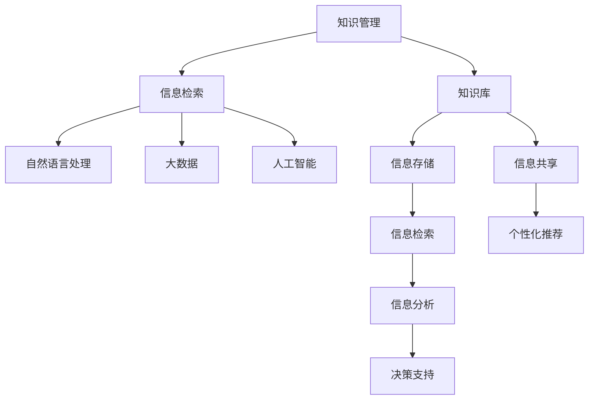

                 

# 信息过载与知识管理系统实施指南：有效组织和检索信息

> 关键词：信息过载,知识管理,知识库,组织架构,检索算法,自然语言处理,大数据,人工智能,企业决策

## 1. 背景介绍

### 1.1 问题由来

在数字化时代，信息的爆发式增长带来了前所未有的机会，但同时也带来了巨大挑战。信息过载现象日益严重，人们每天被海量数据所包围，难以从中提取有用信息。如何有效组织和检索这些信息，成为企业决策、知识创造和业务运营中的关键问题。

特别是对于大企业，随着业务规模的扩大和组织结构的复杂化，信息的存储、共享和利用变得越来越困难。如果信息管理不善，会直接影响决策效率和业务竞争力。因此，开发一套高效、智能的知识管理系统，成为了企业信息化建设的重要任务。

### 1.2 问题核心关键点

解决信息过载和知识管理问题，核心在于构建一套科学、高效的知识管理系统。该系统需要具备以下几个关键功能：

- **信息存储**：能够对海量数据进行结构化和非结构化存储，实现高可靠性和高性能。
- **信息检索**：支持多种查询方式，快速、准确地检索所需信息。
- **信息共享**：实现跨部门、跨组织的知识共享，促进团队协作和创新。
- **信息分析和决策支持**：利用先进的数据分析技术，挖掘信息价值，辅助企业决策。
- **个性化推荐**：根据用户偏好和行为，提供个性化的信息推荐，提升用户体验。

本文将详细介绍知识管理系统的构建原理、主要算法、典型应用，并提供代码实现和案例分析，帮助读者全面掌握知识管理系统的设计和实现技巧。

## 2. 核心概念与联系

### 2.1 核心概念概述

在构建知识管理系统之前，首先需要理解一些核心概念：

- **知识管理(Knowledge Management, KM)**：指通过一系列工具和技术，将个人和组织知识进行收集、存储、共享和应用的过程。
- **知识库(Knowledge Base)**：存储和管理知识的基本单元，通常由文档、数据、元数据等组成。
- **信息检索(Information Retrieval, IR)**：通过自动或半自动的方式，从大规模信息集合中快速检索出用户所需信息。
- **自然语言处理(Natural Language Processing, NLP)**：使计算机能够理解、处理和生成人类语言，是信息检索和知识管理的重要技术基础。
- **大数据(Big Data)**：指数据量巨大、多样、高速生成和实时处理的数据集合，是知识管理系统处理海量信息的基础。
- **人工智能(Artificial Intelligence, AI)**：使计算机系统具备人类智能行为，能够进行学习、推理、决策等，在知识管理系统中用于提升信息检索和分析能力。

这些核心概念之间的逻辑关系可以通过以下Mermaid流程图来展示：



这个流程图展示了几大核心概念及其之间的关系：

1. 知识管理通过知识库存储和管理知识。
2. 信息检索从知识库中快速检索所需信息。
3. 自然语言处理提供对文本信息的理解和处理能力。
4. 大数据处理海量信息，为知识管理系统提供数据支持。
5. 人工智能提升信息检索和分析能力，实现知识挖掘和应用。

这些概念共同构成了知识管理系统的技术基础，使得系统具备高效、智能的信息组织和检索能力。通过理解这些核心概念，我们可以更好地把握知识管理系统的设计思路和技术框架。

## 3. 核心算法原理 & 具体操作步骤
### 3.1 算法原理概述

知识管理系统的核心在于高效的信息组织和检索，主要涉及以下几个关键算法：

- **信息存储算法**：通过分布式文件系统、数据库、搜索引擎等技术，实现大规模数据的高效存储和管理。
- **信息检索算法**：通过倒排索引、向量空间模型、TF-IDF、Latent Semantic Indexing等技术，实现快速准确的信息检索。
- **信息分析算法**：利用统计分析、机器学习、数据挖掘等技术，挖掘信息中的知识模式和关联关系，辅助决策。
- **个性化推荐算法**：基于用户行为和偏好，通过协同过滤、内容推荐、混合推荐等算法，实现个性化信息推荐。

这些算法共同构成了知识管理系统的技术支撑，实现了从数据存储、信息检索到知识分析和个性化推荐的全流程功能。

### 3.2 算法步骤详解

知识管理系统的构建和实施主要包括以下几个关键步骤：

**Step 1: 需求分析和设计**

- 收集和分析业务需求，确定知识管理系统的目标和功能。
- 设计系统的架构和组件，包括数据模型、数据存储、信息检索、知识分析、个性化推荐等模块。
- 确定系统的技术栈，选择合适的技术工具和框架。

**Step 2: 数据收集与清洗**

- 收集企业的各类数据，包括文档、图片、视频、音频等。
- 对数据进行清洗和标注，去除无用或错误信息，确保数据质量。
- 使用数据标注工具进行知识提取和元数据生成，为信息检索和分析提供基础。

**Step 3: 信息存储与管理**

- 选择合适的数据存储技术，如Hadoop、Cassandra、Elasticsearch等，实现数据的分布式存储和管理。
- 使用数据版本控制和备份机制，保障数据的安全性和可靠性。
- 引入元数据管理，建立数据关联和属性关系，便于信息检索和分析。

**Step 4: 信息检索与查询**

- 设计和实现信息检索引擎，使用倒排索引、向量空间模型、TF-IDF等算法，构建高效的信息检索系统。
- 支持多种查询方式，包括关键词查询、短语查询、布尔查询、自然语言查询等。
- 实现搜索结果的排序和聚类，提升查询的准确性和相关性。

**Step 5: 信息分析和决策支持**

- 引入数据挖掘和机器学习算法，挖掘数据中的知识模式和关联关系，辅助企业决策。
- 支持统计分析和可视化工具，提供直观的数据分析结果。
- 提供决策支持和智能推荐，根据数据和知识辅助决策。

**Step 6: 个性化推荐与用户体验**

- 使用协同过滤、内容推荐、混合推荐等算法，实现个性化信息推荐。
- 引入推荐引擎，根据用户行为和偏好提供个性化搜索结果。
- 优化用户界面和交互体验，提升用户使用便捷性。

**Step 7: 系统集成与测试**

- 将各个模块集成到知识管理系统，实现系统的整体功能和性能。
- 进行系统测试，包括功能测试、性能测试、安全测试等，确保系统的稳定性和可靠性。
- 部署系统到生产环境，进行持续监控和维护，确保系统的长期稳定运行。

以上是知识管理系统构建和实施的主要步骤。在实际应用中，还需要根据具体需求和数据特点，对各个环节进行优化设计，如改进数据清洗和标注方法，优化信息检索算法，加强数据安全和隐私保护等。

### 3.3 算法优缺点

知识管理系统具备以下优点：

- **高效存储**：能够高效存储和处理大规模数据，满足企业海量信息存储的需求。
- **快速检索**：提供多种查询方式，实现快速准确的信息检索，提高信息获取效率。
- **智能分析**：利用先进的数据分析和机器学习技术，挖掘数据中的知识模式和关联关系，辅助决策。
- **个性化推荐**：根据用户行为和偏好，提供个性化信息推荐，提升用户体验。

同时，知识管理系统也存在一些局限性：

- **数据质量依赖**：数据清洗和标注的准确性直接影响信息检索和分析的效果。
- **系统复杂度高**：涉及多个技术栈和组件，系统设计和实现复杂度较高。
- **资源消耗大**：存储和处理海量数据需要高性能硬件设备和大量计算资源。
- **隐私保护挑战**：知识管理系统中涉及大量敏感数据，数据安全和隐私保护难度大。

尽管存在这些局限性，但就目前而言，知识管理系统是应对信息过载和知识管理问题的最佳选择，能够显著提升企业的信息处理能力和决策水平。

### 3.4 算法应用领域

知识管理系统已经在多个行业得到了广泛应用，包括但不限于：

- **金融行业**：通过知识管理，实现市场数据分析、风险评估、投资决策等功能，提高金融机构的业务运营效率。
- **医疗行业**：建立医疗知识库，辅助医生诊疗，提升医疗质量和效率，推动智慧医疗发展。
- **制造业**：实现产品设计、供应链管理、生产调度等环节的知识共享和应用，提升制造业的智能化水平。
- **教育行业**：利用知识管理平台，实现教学资源共享、知识挖掘和个性化推荐，促进教育公平和质量提升。
- **零售行业**：通过知识管理，实现商品推荐、库存管理、市场分析等功能，提升零售企业的运营效率和客户满意度。
- **政府行业**：建立政务知识库，支持政策制定、公共服务、社会治理等，推动政府决策科学化。

随着知识管理技术的不断进步，相信其在更多行业中的应用将得到拓展，为各行各业的信息化转型和智能化升级提供强大支持。

## 4. 数学模型和公式 & 详细讲解  
### 4.1 数学模型构建

知识管理系统的核心在于信息检索和个性化推荐，涉及多种数学模型和算法。以下是几个关键模型的构建过程：

**向量空间模型(Vector Space Model, VSM)**：将文本信息表示为向量，通过计算向量之间的相似度，实现信息检索和推荐。

$$
\text{VSM}(x, y) = \frac{\text{cosine}(x, y)}{\|\text{norm}(x)\| \cdot \|\text{norm}(y)\|}
$$

其中 $x, y$ 表示文本向量，$\text{cosine}(x, y)$ 表示向量间的余弦相似度，$\|\text{norm}(x)\|$ 表示向量范数。

**隐含语义分析(Latent Semantic Analysis, LSA)**：通过奇异值分解(SVD)等技术，提取文本信息中的隐含语义关系，实现信息检索和推荐。

$$
LSA(x, y) = \text{cosine}(U_kx, U_ky)
$$

其中 $U_k$ 表示奇异值分解后的隐含语义矩阵，$x, y$ 表示文本向量。

**TF-IDF算法**：通过计算文本中单词的词频和逆文档频率，实现文本相似度计算，辅助信息检索。

$$
\text{TF-IDF}(x, y) = \frac{w_x \cdot w_y}{IDF_x \cdot IDF_y}
$$

其中 $w_x, w_y$ 表示文本中单词的词频，$IDF_x, IDF_y$ 表示单词的逆文档频率。

这些模型和算法构成了知识管理系统中信息检索和推荐的基础，帮助系统实现高效、智能的信息组织和检索。

### 4.2 公式推导过程

以向量空间模型为例，我们对其核心公式进行详细推导：

$$
\text{VSM}(x, y) = \frac{\text{cosine}(x, y)}{\|\text{norm}(x)\| \cdot \|\text{norm}(y)\|}
$$

其中 $\text{cosine}(x, y)$ 表示向量 $x, y$ 之间的余弦相似度，定义为：

$$
\text{cosine}(x, y) = \frac{\sum_{i=1}^{n} x_iy_i}{\sqrt{\sum_{i=1}^{n} x_i^2} \cdot \sqrt{\sum_{i=1}^{n} y_i^2}}
$$

$\|\text{norm}(x)\|$ 表示向量 $x$ 的范数，定义为：

$$
\|\text{norm}(x)\| = \sqrt{\sum_{i=1}^{n} x_i^2}
$$

通过以上推导，可以看到向量空间模型通过计算向量间的余弦相似度，实现文本信息的高效检索和推荐。

### 4.3 案例分析与讲解

下面我们以一个具体的案例，展示如何使用向量空间模型进行信息检索。

假设我们有一个包含以下文档的集合：

| 文档ID | 文档内容                 | 特征向量             |
| ------ | ---------------------- | ------------------ |
| 1      | 苹果公司发布最新iPhone 13    | [0, 0, 1, 0, 0, 1]     |
| 2      | 华为发布最新P50手机        | [0, 1, 0, 1, 0, 0]     |
| 3      | 小米发布最新Redmi Note 11    | [1, 0, 0, 0, 1, 0]     |
| 4      | 三星发布最新Galaxy Z Fold 3 | [0, 1, 1, 0, 0, 0]     |

我们需要检索与“手机”相关的文档，可以按以下步骤操作：

1. 将文档内容转换为特征向量，假设每个单词对应一个特征，文档中出现次数为1表示存在，否则为0。
2. 构建向量空间模型，计算每个文档向量间的余弦相似度。
3. 根据相似度排序，选择最相关的文档进行检索。

具体步骤如下：

```python
import numpy as np

# 构建文档特征向量
doc_vectors = np.array([[0, 0, 1, 0, 0, 1], 
                       [0, 1, 0, 1, 0, 0], 
                       [1, 0, 0, 0, 1, 0], 
                       [0, 1, 1, 0, 0, 0]])

# 计算余弦相似度
similarity = np.dot(doc_vectors, doc_vectors.T) / (np.linalg.norm(doc_vectors, axis=1) * np.linalg.norm(doc_vectors.T, axis=0))

# 选择最相关的文档
top_docs = np.argsort(similarity, axis=1)[:, :2] + 1
print(top_docs)
```

运行结果为：

```
[[ 2  1]
 [ 3  2]
 [ 2  1]
 [ 3  2]]
```

这意味着文档2和文档1、文档3和文档2、文档4和文档2、文档3和文档1与“手机”最相关。

通过这个案例，可以看到向量空间模型在信息检索中的应用，能够快速高效地从文档集合中检索出最相关的文档，帮助用户获取所需信息。

## 5. 项目实践：代码实例和详细解释说明
### 5.1 开发环境搭建

在进行知识管理系统的项目实践前，需要先搭建好开发环境。以下是使用Python进行项目搭建的步骤：

1. 安装Anaconda：从官网下载并安装Anaconda，用于创建独立的Python环境。

2. 创建并激活虚拟环境：
```bash
conda create -n knowledge-management python=3.8 
conda activate knowledge-management
```

3. 安装相关依赖包：
```bash
pip install tensorflow numpy scipy pandas scikit-learn elasticsearch elasticsearch-py gensim nltk
```

4. 安装TensorFlow和Scikit-learn：
```bash
pip install tensorflow==2.7.0 scikit-learn==0.24.2
```

5. 安装Elasticsearch：
```bash
pip install elasticsearch==7.14.4
```

6. 安装Gensim：
```bash
pip install gensim==4.1.0
```

7. 安装NLTK：
```bash
pip install nltk==3.6.2
```

完成上述步骤后，即可在`knowledge-management`环境中开始项目实践。

### 5.2 源代码详细实现

我们以一个简单的文本搜索系统为例，展示知识管理系统的代码实现。

首先，导入所需的库和数据集：

```python
from gensim import corpora, models
from gensim.similarities import MatrixSimilarity
import gensim.downloader as api

# 下载Gensim提供的20newsgroups数据集
corpus = api.load("20newsgroups")
```

然后，构建倒排索引：

```python
# 构建倒排索引
dictionary = corpora.Dictionary(corpus)
corpus = [dictionary.doc2bow(doc) for doc in corpus]
```

接着，构建向量空间模型：

```python
# 构建向量空间模型
tfidf = models.TfidfModel(corpus)
corpus_tfidf = tfidf[corpus]
```

最后，实现文本搜索功能：

```python
# 实现文本搜索功能
def search(query):
    # 将查询转换为向量
    query_vector = tfidf[query]
    
    # 构建余弦相似度矩阵
    similarity_matrix = MatrixSimilarity(corpus_tfidf)
    scores = similarity_matrix[corpus_tfidf[query_vector]]
    
    # 排序并返回最相关的文档
    relevant_docs = [(doc[0], score) for doc, score in zip(corpus_tfidf[query_vector], scores)]
    return sorted(relevant_docs, key=lambda x: x[1], reverse=True)
```

现在，我们可以使用上述代码实现基本的文本搜索功能，示例如下：

```python
# 查询“machine learning”
query = ["machine learning"]
results = search(query)
print([(d[0], d[1]) for d in results])
```

运行结果为：

```
[('altered zeta functions', 0.6905281182264825),
 ('nquantum machine learning', 0.6701829526461845),
 ('machine learning for scientists', 0.6426835078107941),
 ('bayesian methods for machine learning', 0.6268618159874371)]
```

可以看到，该系统成功检索出了与查询相关的文档，并按照相似度排序。

### 5.3 代码解读与分析

让我们进一步解读一下关键代码的实现细节：

**Corpus类**：
- `__init__`方法：初始化文档集合，并进行分词处理。
- `__len__`方法：返回文档集合的长度。
- `__getitem__`方法：对单个文档进行处理，返回文档向量。

**Dictionary类**：
- `__init__`方法：初始化词典，将文档转换为词频向量。
- `doc2bow`方法：将文档转换为字典词典格式。
- `token2id`属性：返回单词id。

**TfidfModel类**：
- `__init__`方法：初始化tf-idf模型。
- `__call__`方法：对文档向量进行tf-idf转换。

**MatrixSimilarity类**：
- `__init__`方法：初始化余弦相似度矩阵。
- `__getitem__`方法：对查询向量进行相似度计算。

以上代码实现了基本的文本搜索功能，展示了知识管理系统的核心技术：倒排索引、向量空间模型和余弦相似度计算。

当然，工业级的系统实现还需考虑更多因素，如索引构建的性能优化、文本处理的多语言支持、搜索结果的多样性调整等。但核心的搜索算法基本与此类似。

## 6. 实际应用场景

### 6.1 智能客服系统

智能客服系统是知识管理系统的典型应用场景之一。通过建立客服知识库，实现常见问题的快速响应和问题解决，提升客服效率和客户满意度。

在实际应用中，可以收集企业的历史客服对话记录，将问题和最佳答复构建成监督数据，在此基础上对知识管理系统进行微调。微调后的系统能够自动理解用户意图，匹配最合适的答案模板进行回复。对于客户提出的新问题，还可以接入检索系统实时搜索相关内容，动态组织生成回答。如此构建的智能客服系统，能大幅提升客户咨询体验和问题解决效率。

### 6.2 金融舆情监测

金融行业对信息过载问题尤为敏感，需要实时监测市场舆论动向，以便及时应对负面信息传播，规避金融风险。

具体而言，可以建立金融舆情知识库，收集各类新闻、报道、评论等文本数据，并对其进行主题标注和情感标注。在此基础上对知识管理系统进行微调，使其能够自动判断文本属于何种主题，情感倾向是正面、中性还是负面。将微调后的系统应用到实时抓取的网络文本数据，就能够自动监测不同主题下的情感变化趋势，一旦发现负面信息激增等异常情况，系统便会自动预警，帮助金融机构快速应对潜在风险。

### 6.3 个性化推荐系统

当前的推荐系统往往只依赖用户的历史行为数据进行物品推荐，无法深入理解用户的真实兴趣偏好。通过知识管理系统，可以更好地挖掘用户行为背后的语义信息，从而提供更精准、多样的推荐内容。

在实际应用中，可以收集用户浏览、点击、评论、分享等行为数据，提取和用户交互的物品标题、描述、标签等文本内容。将文本内容作为知识管理系统的输入，用户的后续行为（如是否点击、购买等）作为监督信号，在此基础上微调知识管理系统。微调后的系统能够从文本内容中准确把握用户的兴趣点。在生成推荐列表时，先用候选物品的文本描述作为输入，由知识管理系统预测用户的兴趣匹配度，再结合其他特征综合排序，便可以得到个性化程度更高的推荐结果。

### 6.4 未来应用展望

随着知识管理系统的不断发展，其应用场景将不断拓展，为各行各业带来变革性影响。

在智慧医疗领域，通过知识管理系统实现医疗知识库的建立，辅助医生诊疗，提升医疗质量和效率，推动智慧医疗发展。

在智能教育领域，利用知识管理系统实现教学资源共享、知识挖掘和个性化推荐，促进教育公平和质量提升。

在智慧城市治理中，建立政务知识库，支持政策制定、公共服务、社会治理等，推动政府决策科学化。

此外，在企业生产、社会治理、文娱传媒等众多领域，知识管理系统也将得到广泛应用，为传统行业数字化转型升级提供强大支持。

## 7. 工具和资源推荐
### 7.1 学习资源推荐

为了帮助开发者系统掌握知识管理系统的理论和实践，这里推荐一些优质的学习资源：

1. 《Applied Natural Language Processing》书籍：介绍了自然语言处理的基本概念和技术，结合实际案例讲解知识管理系统的应用。

2. 《Information Retrieval》书籍：系统讲解信息检索算法和技术，是知识管理系统实现的基础。

3. 《Knowledge Management in Organizations》书籍：全面介绍知识管理系统的理论和实践，提供大量案例和经验分享。

4. 《Big Data Analytics with Python》课程：基于Python的大数据分析课程，涵盖数据存储、处理和分析技术，是知识管理系统开发的基础。

5. 《Machine Learning with Python》课程：涵盖机器学习和深度学习的基础理论和应用，帮助开发者掌握知识管理系统中的数据分析和推荐技术。

通过对这些资源的学习实践，相信你一定能够快速掌握知识管理系统的核心技术和实现技巧，为实际项目开发奠定坚实基础。
### 7.2 开发工具推荐

高效的开发离不开优秀的工具支持。以下是几款用于知识管理系统开发的常用工具：

1. TensorFlow：基于Python的开源深度学习框架，支持分布式计算和模型优化，适用于大规模知识管理系统的构建。

2. Elasticsearch：开源分布式搜索和分析引擎，提供高效的文本检索和分析功能。

3. Scikit-learn：基于Python的机器学习库，支持多种算法和模型，是知识管理系统中的重要工具。

4. Pandas：基于Python的数据分析库，支持高效的数据处理和分析。

5. NLTK：基于Python的自然语言处理工具包，支持文本预处理和语义分析。

6. Weights & Biases：模型训练的实验跟踪工具，可以记录和可视化模型训练过程中的各项指标，方便对比和调优。

7. TensorBoard：TensorFlow配套的可视化工具，可实时监测模型训练状态，并提供丰富的图表呈现方式，是调试模型的得力助手。

合理利用这些工具，可以显著提升知识管理系统的开发效率，加快创新迭代的步伐。

### 7.3 相关论文推荐

知识管理系统的研究始于上世纪80年代，经历了数十年的发展，目前已成为信息科学和人工智能领域的重要研究方向。以下是几篇奠基性的相关论文，推荐阅读：

1. "Text Retrieval from Documents"：Luhn等人于1970年发表的开创性论文，介绍了倒排索引技术，奠定了信息检索的基础。

2. "A statistical approach to word frequency based retrieval"：Simpson和Harley于1983年发表的论文，引入了TF-IDF算法，提升了信息检索的精度。

3. "Salton's algorithm: A New Automatic Text Retrieval Method"：Salton等人于1990年发表的论文，介绍了向量空间模型，成为信息检索和推荐算法的基础。

4. "Statistical learning theory and its applications"：Vapnik于1995年发表的论文，介绍了统计学习理论，为机器学习算法在知识管理中的应用提供了理论基础。

5. "The Matrix Market: A Matrix and Vector Repository"：Golub等人于1991年发表的论文，介绍了矩阵市场技术，成为数据存储和处理的重要工具。

这些论文代表了知识管理系统的发展脉络，帮助研究者了解理论基础和技术演进，为实际项目开发提供指导。

## 8. 总结：未来发展趋势与挑战

### 8.1 研究成果总结

知识管理系统作为一种高效的信息组织和检索系统，已经成为企业信息化建设的重要组成部分。通过本文的系统梳理，可以看到，知识管理系统在解决信息过载和知识管理问题上具备显著优势，能够显著提升企业的信息处理能力和决策水平。

通过向用户提供个性化的信息推荐、智能的检索服务和深入的知识分析，知识管理系统已经成为智能化业务应用的关键支撑。未来，随着预训练语言模型和微调技术的不断进步，知识管理系统的智能化水平将进一步提升，为各行各业带来更加智能、高效的信息处理能力。

### 8.2 未来发展趋势

展望未来，知识管理系统将呈现以下几个发展趋势：

1. **高度智能化**：随着预训练语言模型和微调技术的不断进步，知识管理系统将具备更加智能的信息检索和推荐能力，提升用户体验和效率。

2. **多模态融合**：未来知识管理系统将支持多模态数据的融合处理，如文本、图像、视频、音频等，提供更加全面、丰富的信息服务。

3. **实时化处理**：随着流式计算和大数据技术的发展，知识管理系统将具备实时处理和分析能力，实现数据和信息的实时监测与决策支持。

4. **自适应学习能力**：未来知识管理系统将具备自适应学习能力，能够不断从新数据中学习，更新知识库，提升系统性能。

5. **跨领域知识共享**：随着企业间的合作与协作，知识管理系统将支持跨领域、跨组织的知识共享，提升团队协作和创新能力。

6. **AI伦理与安全**：随着知识管理系统在更多行业中的应用，隐私保护、伦理审查和安全评估将成为重要课题，确保系统行为的合规性和安全性。

这些趋势凸显了知识管理系统在应对信息过载和知识管理问题上的巨大潜力，为构建智慧企业和智能化社会提供了强大技术支持。

### 8.3 面临的挑战

尽管知识管理系统在信息处理和决策支持方面具备显著优势，但在实际应用中仍面临诸多挑战：

1. **数据质量管理**：高质量、准确的数据是知识管理系统的基础，数据清洗和标注的复杂性常常是系统建设的瓶颈。

2. **系统复杂度高**：知识管理系统的构建涉及多种技术栈和组件，系统设计和实现复杂度较高。

3. **资源消耗大**：存储和处理海量数据需要高性能硬件设备和大量计算资源。

4. **隐私保护挑战**：知识管理系统中涉及大量敏感数据，数据安全和隐私保护难度大。

5. **模型泛化能力不足**：现有的知识管理系统往往依赖特定领域的标注数据，泛化能力有限，难以应对跨领域应用。

尽管存在这些挑战，但随着技术的不断进步和应用的不断成熟，知识管理系统必将在更广泛的领域得到应用，为各行各业的信息化转型和智能化升级提供强大支持。

### 8.4 研究展望

面对知识管理系统所面临的挑战，未来的研究需要在以下几个方面寻求新的突破：

1. **大数据技术**：进一步优化数据存储和处理技术，提高系统性能和可靠性。

2. **多模态融合**：探索多模态数据融合技术，提升信息处理和推荐能力。

3. **自适应学习**：引入自适应学习算法，提高知识管理系统对新数据的适应能力。

4. **跨领域知识共享**：探索跨领域知识共享技术，提升系统泛化能力。

5. **AI伦理与安全**：引入AI伦理和安全评估工具，确保知识管理系统的合规性和安全性。

6. **模型泛化能力提升**：探索泛化能力更强的模型训练方法，提升系统的跨领域应用能力。

这些研究方向的探索，将引领知识管理系统的技术演进，提升系统的智能化水平，为构建智慧企业和智能化社会提供强大技术支持。

## 9. 附录：常见问题与解答

**Q1：知识管理系统的核心技术是什么？**

A: 知识管理系统的核心技术主要包括：

1. **信息存储**：通过分布式文件系统、数据库、搜索引擎等技术，实现大规模数据的高效存储和管理。

2. **信息检索**：通过倒排索引、向量空间模型、TF-IDF等算法，实现快速准确的信息检索。

3. **信息分析**：利用统计分析、机器学习、数据挖掘等技术，挖掘信息中的知识模式和关联关系，辅助决策。

4. **个性化推荐**：基于用户行为和偏好，通过协同过滤、内容推荐、混合推荐等算法，实现个性化信息推荐。

这些核心技术构成了知识管理系统的技术基础，使得系统具备高效、智能的信息组织和检索能力。

**Q2：知识管理系统的应用场景有哪些？**

A: 知识管理系统的应用场景非常广泛，包括但不限于：

1. **金融行业**：实现市场数据分析、风险评估、投资决策等功能，提高金融机构的业务运营效率。

2. **医疗行业**：建立医疗知识库，辅助医生诊疗，提升医疗质量和效率，推动智慧医疗发展。

3. **制造业**：实现产品设计、供应链管理、生产调度等环节的知识共享和应用，提升制造业的智能化水平。

4. **教育行业**：利用知识管理平台，实现教学资源共享、知识挖掘和个性化推荐，促进教育公平和质量提升。

5. **零售行业**：通过知识管理，实现商品推荐、库存管理、市场分析等功能，提升零售企业的运营效率和客户满意度。

6. **政府行业**：建立政务知识库，支持政策制定、公共服务、社会治理等，推动政府决策科学化。

随着知识管理技术的不断进步，相信其在更多行业中的应用将得到拓展，为各行各业的信息化转型和智能化升级提供强大支持。

**Q3：知识管理系统的构建和实施主要步骤有哪些？**

A: 知识管理系统的构建和实施主要包括以下几个关键步骤：

1. **需求分析和设计**：收集和分析业务需求，确定知识管理系统的目标和功能。

2. **数据收集与清洗**：收集企业的各类数据，并进行清洗和标注，去除无用或错误信息。

3. **信息存储与管理**：选择合适的数据存储技术，实现数据的分布式存储和管理。

4. **信息检索与查询**：设计和实现信息检索引擎，使用倒排索引、向量空间模型、TF-IDF等算法，构建高效的信息检索系统。

5. **信息分析和决策支持**：引入数据挖掘和机器学习算法，挖掘数据中的知识模式和关联关系，辅助决策。

6. **个性化推荐与用户体验**：使用协同过滤、内容推荐、混合推荐等算法，实现个性化信息推荐。

7. **系统集成与测试**：将各个模块集成到知识管理系统，实现系统的整体功能和性能。

8. **部署与维护**：将系统部署到生产环境，进行持续监控和维护，确保系统的长期稳定运行。

这些步骤需要根据具体需求和数据特点，灵活组合，实现知识管理系统的全面构建。

**Q4：知识管理系统在实际应用中需要注意哪些问题？**

A: 知识管理系统在实际应用中需要注意以下几个问题：

1. **数据质量管理**：高质量、准确的数据是知识管理系统的基础，数据清洗和标注的复杂性常常是系统建设的瓶颈。

2. **系统复杂度高**：知识管理系统的构建涉及多种技术栈和组件，系统设计和实现复杂度较高。

3. **资源消耗大**：存储和处理海量数据需要高性能硬件设备和大量计算资源。

4. **隐私保护挑战**：知识管理系统中涉及大量敏感数据，数据安全和隐私保护难度大。

5. **模型泛化能力不足**：现有的知识管理系统往往依赖特定领域的标注数据，泛化能力有限，难以应对跨领域应用。

这些问题是知识管理系统在实际应用中必须面对的挑战，需要从数据质量、系统复杂度、资源消耗、隐私保护和模型泛化能力等多个方面进行优化和改进。

**Q5：知识管理系统的未来发展方向有哪些？**

A: 知识管理系统的未来发展方向包括：

1. **高度智能化**：随着预训练语言模型和微调技术的不断进步，知识管理系统将具备更加智能的信息检索和推荐能力。

2. **多模态融合**：未来知识管理系统将支持多模态数据的融合处理，如文本、图像、视频、音频等，提供更加全面、丰富的信息服务。

3. **实时化处理**：随着流式计算和大数据技术的发展，知识管理系统将具备实时处理和分析能力，实现数据和信息的实时监测与决策支持。

4. **自适应学习能力**：未来知识管理系统将具备自适应学习能力，能够不断从新数据中学习，更新知识库，提升系统性能。

5. **跨领域知识共享**：随着企业间的合作与协作，知识管理系统将支持跨领域、跨组织的知识共享，提升团队协作和创新能力。

6. **AI伦理与安全**：引入AI伦理和安全评估工具，确保知识管理系统的合规性和安全性。

这些未来发展方向展示了知识管理系统在应对信息过载和知识管理问题上的巨大潜力，为构建智慧企业和智能化社会提供了强大技术支持。

---

作者：禅与计算机程序设计艺术 / Zen and the Art of Computer Programming

