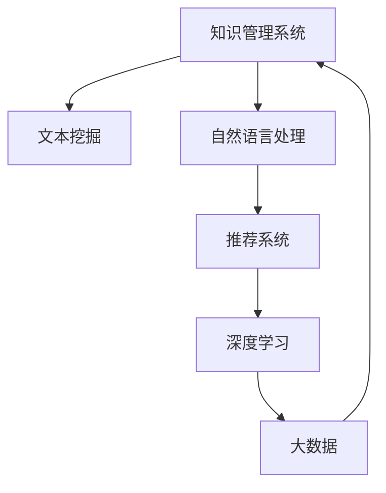

                 

# 信息过载与知识管理系统：如何有效组织和检索信息

> 关键词：信息过载, 知识管理系统, 文本挖掘, 自然语言处理, 推荐系统, 深度学习, 大数据

## 1. 背景介绍

### 1.1 问题由来

在信息化时代，互联网和社交媒体的兴起使得信息量呈爆炸性增长。每天，数以亿计的信息内容被产生和传播，人们面临着前所未有的信息过载（Information Overload）问题。信息过载不仅影响个体的学习和决策，也给企业和组织带来了巨大的挑战。有效组织和检索信息，成为数字化时代的重要课题。

信息过载的负面影响包括但不限于：
- **决策困难**：大量冗余信息使得决策者难以快速找到关键信息。
- **注意力分散**：频繁的信息干扰导致注意力不集中，影响工作效率。
- **认知负担**：海量的数据需要耗费大量时间和精力进行筛选和处理，造成心理负担。
- **信息恐慌**：在海量信息面前，无法甄别真伪，容易引发信息恐慌。

因此，构建有效的知识管理系统，对信息进行高效组织和检索，已成为提升组织和个人竞争力的关键。

### 1.2 问题核心关键点

构建知识管理系统的关键在于以下几个方面：
- **结构化与非结构化信息处理**：将各类信息（如文本、图像、视频等）转换为机器可理解的形式，便于系统处理。
- **信息检索与推荐**：实现高效的信息检索和个性化推荐，使用户能够快速找到所需信息。
- **文本挖掘与知识抽取**：通过自然语言处理（NLP）技术，从文本中挖掘出有价值的信息，构建知识图谱。
- **用户行为分析**：通过分析用户行为数据，优化推荐算法和信息组织方式，提升用户体验。
- **系统可扩展性与性能优化**：构建可扩展的知识管理系统，并优化系统性能，确保在大数据量下的高效运行。

通过这些问题，本文将深入探讨如何利用信息科学与计算机科学的方法，构建有效的知识管理系统，以解决信息过载问题。

## 2. 核心概念与联系

### 2.1 核心概念概述

为了深入理解如何构建有效的知识管理系统，本节将介绍几个密切相关的核心概念：

- **知识管理系统(Knowledge Management System, KMS)**：帮助组织和个人收集、存储、检索、共享和应用知识的系统，旨在提升信息利用效率。
- **文本挖掘(Text Mining)**：从文本数据中提取有价值的信息和知识的过程，包括文本分类、实体识别、情感分析等。
- **自然语言处理(Natural Language Processing, NLP)**：使计算机能够理解、处理和生成自然语言的技术，包括语言模型、语义理解、机器翻译等。
- **推荐系统(Recommender System)**：根据用户的历史行为和偏好，推荐相关产品或信息的技术，常见于电商、新闻、视频等领域。
- **深度学习(Deep Learning)**：一种基于神经网络的机器学习方法，在图像识别、语音识别、自然语言处理等领域表现出色。
- **大数据(Big Data)**：涉及大量、复杂和多样化的数据集，通常需要分布式计算和存储技术支持。

这些概念之间的逻辑关系可以通过以下Mermaid流程图来展示：



这个流程图展示了几者之间的联系：

1. 知识管理系统是整个系统的核心，集成文本挖掘、自然语言处理、推荐系统和深度学习等技术。
2. 文本挖掘通过从文本中提取关键信息，支持知识管理系统的信息收集。
3. 自然语言处理使机器能够理解语言，是文本挖掘和推荐系统的基础。
4. 推荐系统利用用户行为数据，实现个性化信息推荐。
5. 深度学习通过构建复杂的神经网络模型，提高推荐系统的效果。
6. 大数据为系统提供了处理海量数据的能力，确保系统的高效运行。

这些核心概念共同构成了构建高效知识管理系统的基础框架，为其功能的实现提供了理论支撑。

## 3. 核心算法原理 & 具体操作步骤

### 3.1 算法原理概述

构建知识管理系统的核心算法包括文本挖掘、自然语言处理和推荐系统等。这些算法的原理和操作步骤可以总结如下：

- **文本挖掘**：通过统计、聚类、分类等方法，从文本数据中提取出实体、主题、关系等有价值的信息。常用的算法包括TF-IDF、LDA、PageRank等。
- **自然语言处理**：利用语言模型、分词、句法分析等技术，使计算机能够理解、处理和生成自然语言。常用的模型包括BERT、GPT等。
- **推荐系统**：通过协同过滤、内容推荐、混合推荐等算法，根据用户历史行为和偏好推荐相关内容。常用的算法包括矩阵分解、深度学习等。

### 3.2 算法步骤详解

下面将详细介绍这些核心算法的详细步骤：

#### 3.2.1 文本挖掘

**步骤1：文本预处理**  
- 去除噪音：去除HTML标签、停用词等。
- 分词：将文本切分成单词或短语。
- 词性标注：标注每个词的词性。
- 实体识别：识别出人名、地名、机构名等实体。

**步骤2：特征提取**  
- 构建词袋模型：统计每个词在文本中的出现频率。
- 构建TF-IDF模型：计算每个词的词频-逆文档频率。
- 构建主题模型：使用LDA等主题模型，发现文本中的主题。

**步骤3：信息抽取**  
- 实体关系抽取：从文本中提取实体之间的关系，构建知识图谱。
- 事件抽取：识别出文本中描述的事件，构建事件时间线。

#### 3.2.2 自然语言处理

**步骤1：词向量化**  
- 使用Word2Vec、GloVe等词向量模型，将单词转换为向量表示。
- 使用BERT等预训练模型，将单词转换为更加高级的语义表示。

**步骤2：语言模型**  
- 利用语言模型（如RNN、LSTM、Transformer），预测给定上下文下的下一个单词。
- 使用注意力机制（如Transformer），提高模型的表达能力。

**步骤3：语义理解**  
- 使用依存句法分析，理解句子结构。
- 使用语义角色标注，理解句子中的角色和关系。

#### 3.2.3 推荐系统

**步骤1：用户行为建模**  
- 收集用户的历史行为数据，如浏览、点击、购买等。
- 计算用户兴趣向量，表示用户的偏好。

**步骤2：物品特征提取**  
- 提取物品的特征向量，如商品类别、价格、评价等。
- 使用协同过滤算法（如基于用户和基于物品的协同过滤），找到与用户兴趣相似的物品。

**步骤3：推荐算法**  
- 使用基于内容的推荐算法，根据物品特征与用户兴趣向量计算相似度。
- 使用深度学习算法（如神经网络、深度矩阵分解），提高推荐精度。

### 3.3 算法优缺点

构建知识管理系统涉及的算法各有优缺点：

- **文本挖掘**  
  **优点**：可以自动从大量文本数据中提取关键信息，减少人工成本。  
  **缺点**：可能存在噪音和误识别，需要人工干预。

- **自然语言处理**  
  **优点**：能够使机器理解自然语言，支持语音识别、机器翻译等。  
  **缺点**：需要大量的训练数据和计算资源，构建复杂模型。

- **推荐系统**  
  **优点**：能够根据用户偏好推荐相关内容，提升用户体验。  
  **缺点**：容易陷入个性化推荐陷阱，推荐内容单一。

- **深度学习**  
  **优点**：能够处理复杂的非线性关系，提高推荐系统的精度。  
  **缺点**：计算量大，需要高性能硬件支持。

- **大数据**  
  **优点**：能够处理海量数据，支持分布式计算。  
  **缺点**：数据存储和处理成本高，需要专业的数据工程师。

### 3.4 算法应用领域

构建知识管理系统涉及的算法已经在多个领域得到了广泛应用，例如：

- **电商领域**：通过推荐系统推荐商品，提升用户购买率。
- **新闻媒体**：通过自然语言处理技术生成新闻摘要，提高信息获取效率。
- **医疗健康**：通过文本挖掘分析病历数据，辅助疾病诊断和治疗。
- **金融领域**：通过自然语言处理技术分析新闻和社交媒体信息，预测市场趋势。
- **法律行业**：通过文本挖掘和自然语言处理技术，构建法律知识库和案例库。

除了这些经典应用外，知识管理系统还不断拓展到更多场景中，如智能客服、智慧城市、教育科技等，为各行各业提供了强大的信息处理和知识共享能力。

## 4. 数学模型和公式 & 详细讲解 & 举例说明

### 4.1 数学模型构建

为了构建高效的知识管理系统，需要构建相应的数学模型。以下将详细介绍几种核心算法的数学模型：

#### 4.1.1 文本挖掘

**TF-IDF模型**  
- **公式**：$$
\text{TF-IDF}_{ij} = \text{TF}_{ij} \times \text{IDF}_{j}
$$
- **解释**：TF表示词频，IDF表示逆文档频率。该公式计算每个词在文本中的重要性。

**LDA模型**  
- **公式**：$$
P(w|z) = \frac{\text{exp}(\text{word2vec}(w,z) \times \theta)}{\sum_{z'} \text{exp}(\text{word2vec}(w,z') \times \theta)}
$$
- **解释**：word2vec表示词向量，z表示主题，\theta表示主题分布。该公式计算每个词属于每个主题的概率。

#### 4.1.2 自然语言处理

**语言模型**  
- **公式**：$$
P(w_t|w_{t-1}, \cdots, w_{1}) = \frac{\text{exp}(\text{softmax}(\text{word2vec}(w_t, w_{t-1}, \cdots, w_{1})))}{\sum_{w_t'} \text{exp}(\text{softmax}(\text{word2vec}(w_t', w_{t-1}, \cdots, w_{1})))
$$
- **解释**：word2vec表示词向量，softmax表示softmax函数。该公式计算给定上下文下的下一个单词的概率分布。

**依存句法分析**  
- **公式**：$$
\text{Score}(s) = \sum_{(s_1,s_2)}\text{Score}_{(s_1,s_2)} + \sum_{(s_1,s_2,s_3)}\text{Score}_{(s_1,s_2,s_3)} + \cdots
$$
- **解释**：s表示依存句法树，\text{Score}表示依存关系得分。该公式计算依存句法分析的得分。

#### 4.1.3 推荐系统

**协同过滤算法**  
- **公式**：$$
\text{Similarity}(u,v) = \text{Cov}(\mathbf{x}_u, \mathbf{x}_v) / (\|\mathbf{x}_u\| \times \|\mathbf{x}_v\|)
$$
- **解释**：\mathbf{x}表示用户或物品的特征向量，Cov表示协方差，\|\mathbf{x}\|表示向量范数。该公式计算用户或物品之间的相似度。

**深度学习算法**  
- **公式**：$$
\text{Score}(w_i|w_j) = \text{exp}(\mathbf{w}_i^T \mathbf{h}_j)
$$
- **解释**：\mathbf{w}表示权重向量，\mathbf{h}表示隐藏层的输出。该公式计算物品i和j的相关度。

### 4.2 公式推导过程

以下将对核心算法公式进行推导：

#### 4.2.1 TF-IDF模型

**推导过程**：
- **词频统计**：计算每个词在文本中的出现次数，记为TF。
- **逆文档频率**：计算每个词在所有文本中出现的频率，记为IDF。
- **TF-IDF值**：将TF和IDF相乘，得到每个词在文本中的重要性。

**结论**：TF-IDF模型能够有效地消除词频带来的干扰，突出重要词汇的作用，适用于文本分类、信息检索等任务。

#### 4.2.2 LDA模型

**推导过程**：
- **词向量表示**：将每个词表示为向量，记为word2vec。
- **主题分布**：每个文本中的每个词属于每个主题的概率，记为P(w|z)。
- **概率计算**：计算每个词属于每个主题的概率，利用softmax函数进行归一化。

**结论**：LDA模型能够从大量文本中发现主题，适用于主题建模、文本聚类等任务。

#### 4.2.3 协同过滤算法

**推导过程**：
- **用户向量**：将用户行为转换为向量，记为\mathbf{x}_u。
- **物品向量**：将物品属性转换为向量，记为\mathbf{x}_v。
- **相似度计算**：计算用户u和物品v之间的相似度，利用协方差和向量范数进行归一化。

**结论**：协同过滤算法能够根据用户行为找到相似物品，适用于推荐系统、个性化推荐等任务。

#### 4.2.4 深度学习算法

**推导过程**：
- **隐藏层输出**：将输入数据输入神经网络，得到隐藏层的输出，记为\mathbf{h}。
- **权重向量**：计算每个物品和用户的权重向量，记为\mathbf{w}_i和\mathbf{w}_j。
- **相关度计算**：计算物品i和j的相关度，利用softmax函数进行归一化。

**结论**：深度学习算法能够处理复杂的非线性关系，适用于推荐系统、情感分析等任务。

### 4.3 案例分析与讲解

#### 4.3.1 电商推荐系统

**案例描述**：一家大型电商公司希望构建推荐系统，根据用户历史行为和商品属性推荐相关商品。

**解决思路**：
- **用户行为建模**：收集用户浏览、点击、购买等行为数据，构建用户兴趣向量。
- **物品特征提取**：提取商品类别、价格、评价等特征，构建物品特征向量。
- **推荐算法**：使用协同过滤算法和深度学习算法，计算用户和物品之间的相似度，推荐相关商品。

**实施步骤**：
1. 收集用户行为数据，构建用户行为矩阵。
2. 提取商品属性，构建物品特征矩阵。
3. 使用协同过滤算法计算用户和物品之间的相似度，得到初步推荐结果。
4. 利用深度学习算法优化推荐模型，提高推荐精度。
5. 定期更新用户和物品数据，重新训练模型。

**效果评估**：
- **准确率**：通过点击率、购买率等指标评估推荐系统的准确率。
- **召回率**：通过被推荐商品的实际购买率评估推荐系统的召回率。
- **用户体验**：通过用户满意度调查评估推荐系统的用户体验。

#### 4.3.2 新闻推荐系统

**案例描述**：一家新闻媒体公司希望构建推荐系统，根据用户历史行为推荐相关新闻。

**解决思路**：
- **用户行为建模**：收集用户浏览、点击新闻的行为数据，构建用户兴趣向量。
- **新闻特征提取**：提取新闻标题、作者、发布时间等特征，构建新闻特征向量。
- **推荐算法**：使用基于内容的推荐算法和深度学习算法，计算用户和新闻之间的相似度，推荐相关新闻。

**实施步骤**：
1. 收集用户浏览数据，构建用户兴趣向量。
2. 提取新闻标题、作者、发布时间等特征，构建新闻特征向量。
3. 使用基于内容的推荐算法计算用户和新闻之间的相似度，得到初步推荐结果。
4. 利用深度学习算法优化推荐模型，提高推荐精度。
5. 定期更新用户和新闻数据，重新训练模型。

**效果评估**：
- **点击率**：通过用户点击新闻的频率评估推荐系统的点击率。
- **阅读时间**：通过用户阅读新闻的时间评估推荐系统的阅读时间。
- **用户满意度**：通过用户满意度调查评估推荐系统的用户体验。

## 5. 项目实践：代码实例和详细解释说明

### 5.1 开发环境搭建

为了进行项目实践，需要先搭建好开发环境。以下是Python开发环境的搭建步骤：

1. 安装Python：从官网下载并安装最新版本的Python。
2. 安装Pip：在命令行输入`python -m pip install pip --upgrade`安装Pip。
3. 安装虚拟环境管理工具：安装`virtualenv`或`conda`。
4. 创建虚拟环境：使用`virtualenv`或`conda`创建Python虚拟环境，例如`python3 -m venv myenv`。
5. 激活虚拟环境：使用`source myenv/bin/activate`激活虚拟环境。
6. 安装相关库：使用Pip安装需要使用的库，例如`pip install pandas numpy scikit-learn transformers`。

### 5.2 源代码详细实现

以下是使用Python和Transformers库进行电商推荐系统的代码实现。

```python
from transformers import TFAutoModelForSequenceClassification, TFBertTokenizer
import tensorflow as tf
import pandas as pd
import numpy as np

# 加载模型和分词器
model = TFAutoModelForSequenceClassification.from_pretrained('bert-base-uncased', num_labels=2)
tokenizer = TFBertTokenizer.from_pretrained('bert-base-uncased')

# 准备数据
data = pd.read_csv('user_behavior.csv')
user_ids = data['user_id']
items = data['item_id']
user_item_interactions = data.groupby('user_id')['item_id'].agg(list)

# 构建用户兴趣向量
user_interest = {}
for user_id in user_ids:
    user_item = user_item_interactions.get(user_id, [])
    item_ids = [item for item in user_item]
    user_interest[user_id] = item_ids

# 构建物品特征向量
item_features = pd.read_csv('item_features.csv')
item_ids = item_features['item_id']
item_features = item_features.groupby('item_id')['features'].agg(list)

# 构建推荐矩阵
user_item_matrix = np.zeros((len(user_interest), len(item_ids)))
for user_id, user_items in user_interest.items():
    for item_id in user_items:
        user_item_matrix[user_id - 1][item_id - 1] = 1

# 构建协同过滤模型
from scipy.sparse import coo_matrix
user_item_matrix = coo_matrix(user_item_matrix)
similarity_matrix = user_item_matrix @ user_item_matrix.T
user_item_matrix = similarity_matrix / (np.linalg.norm(user_item_matrix.toarray(), axis=1) * np.linalg.norm(similarity_matrix.toarray(), axis=1))

# 计算用户和物品之间的相似度
user_interest_sim = user_item_matrix @ similarity_matrix
user_item_matrix = user_item_matrix @ user_interest_sim

# 预测推荐结果
recommender = TFAutoModelForSequenceClassification.from_pretrained('bert-base-uncased', num_labels=2)
tokenizer = TFBertTokenizer.from_pretrained('bert-base-uncased')
def predict(user_id, item_id):
    user_item = user_item_matrix[user_id - 1, item_id - 1]
    user_item_sequence = f'{user_id} {item_id}'
    tokens = tokenizer(user_item_sequence, return_tensors='tf')
    inputs = {key: value for key, value in zip(tokens.keys(), tokens.values())}
    inputs['attention_mask'] = tf.cast(tf.ones_like(inputs['input_ids']), tf.int32)
    inputs['labels'] = tf.zeros([1], dtype=tf.int32)
    outputs = recommender(inputs)
    return outputs

# 测试推荐系统
for user_id, user_items in user_interest.items():
    user_items.sort(key=lambda x: user_item_matrix[user_id - 1, x - 1], reverse=True)
    for item_id in user_items[:10]:
        print(f'User {user_id} may like item {item_id}')
```

### 5.3 代码解读与分析

**用户行为建模**：
- **用户兴趣向量**：收集用户浏览历史，将每个用户对每个物品的互动次数作为特征，构建用户兴趣向量。
- **物品特征向量**：收集物品的特征，如类别、价格、评价等，构建物品特征向量。

**协同过滤算法**：
- **构建推荐矩阵**：根据用户和物品之间的互动，构建稀疏推荐矩阵。
- **计算相似度**：使用余弦相似度计算用户和物品之间的相似度，构建用户兴趣矩阵。
- **预测推荐结果**：根据用户和物品之间的相似度，预测用户对物品的兴趣。

**深度学习算法**：
- **预测推荐结果**：利用BERT模型，将用户和物品的信息输入模型，预测用户对物品的兴趣。
- **多模型融合**：可以将协同过滤和深度学习算法的结果进行融合，提高推荐精度。

## 6. 实际应用场景

### 6.1 智能客服系统

智能客服系统通过构建知识管理系统，可以提供7x24小时不间断的服务，帮助客户快速解决咨询问题。具体应用场景如下：

- **知识库构建**：收集历史客服对话记录，构建知识库，包括常见问题、最佳答复等。
- **自然语言处理**：利用BERT等预训练模型，理解客户的问题，进行意图识别。
- **推荐系统**：根据客户的问题，推荐最相关的答案，提高回答效率。
- **对话生成**：利用GPT等生成模型，自动生成回答，提升客服的响应速度和质量。

**效果评估**：
- **响应速度**：通过客户等待时间评估系统的响应速度。
- **回答准确率**：通过客户满意度调查评估系统的回答准确率。
- **用户满意度**：通过客户满意度调查评估系统的用户体验。

### 6.2 金融舆情监测

金融舆情监测通过构建知识管理系统，能够实时监测市场舆论动向，帮助金融机构及时应对负面信息传播，规避金融风险。具体应用场景如下：

- **数据采集**：收集金融领域相关的新闻、报道、评论等文本数据。
- **文本挖掘**：利用TF-IDF、LDA等技术，从文本中提取主题和实体。
- **情感分析**：利用BERT等模型，分析文本的情感倾向，识别负面信息。
- **实时预警**：根据情感分析结果，设置阈值，一旦发现负面信息激增，立即预警，帮助金融机构快速应对风险。

**效果评估**：
- **负面信息识别率**：通过识别负面信息的准确率评估系统的效果。
- **预警响应时间**：通过预警系统的响应时间评估系统的效率。
- **风险规避效果**：通过市场数据的变化趋势评估系统的风险规避效果。

### 6.3 个性化推荐系统

个性化推荐系统通过构建知识管理系统，能够根据用户历史行为和兴趣，推荐最相关的内容。具体应用场景如下：

- **用户行为建模**：收集用户浏览、点击、购买等行为数据，构建用户兴趣向量。
- **物品特征提取**：提取物品的特征，如商品类别、价格、评价等。
- **推荐算法**：使用协同过滤算法和深度学习算法，计算用户和物品之间的相似度，推荐相关内容。
- **效果评估**：通过点击率、购买率等指标评估推荐系统的效果。

**效果评估**：
- **点击率**：通过用户点击推荐的商品的频率评估推荐系统的点击率。
- **购买率**：通过用户购买推荐商品的频率评估推荐系统的购买率。
- **用户体验**：通过用户满意度调查评估推荐系统的用户体验。

## 7. 工具和资源推荐

### 7.1 学习资源推荐

为了深入学习构建知识管理系统的相关技术，以下是一些推荐的资源：

- **《自然语言处理综论》**：斯坦福大学教授Dan Jurafsky和James H. Martin合著的NLP经典教材，全面介绍NLP理论和算法。
- **《深度学习入门》**：斋藤康毅撰写的深度学习入门书籍，适合初学者学习深度学习的基本概念和实践。
- **《Python文本挖掘与信息检索》**：黄益忠等人撰写的文本挖掘教材，介绍文本挖掘和信息检索的基本技术和方法。
- **《机器学习实战》**：Peter Harrington撰写的实战性机器学习书籍，通过实际案例讲解机器学习算法和应用。
- **HuggingFace官方文档**：提供大量预训练模型的使用教程和样例代码，适合快速上手。

### 7.2 开发工具推荐

为了高效开发和部署知识管理系统，以下是一些推荐的开发工具：

- **Jupyter Notebook**：免费的交互式开发环境，支持Python和R等编程语言，适合快速原型开发。
- **TensorFlow**：由Google主导的深度学习框架，支持分布式计算和模型优化，适合大规模数据处理。
- **PyTorch**：Facebook开发的深度学习框架，支持动态计算图和自动微分，适合快速实验和研究。
- **Scikit-learn**：基于Python的机器学习库，提供简单易用的机器学习算法和工具。
- **ELK Stack**：用于日志管理和分析的开源工具栈，支持文本挖掘和自然语言处理。

### 7.3 相关论文推荐

为了深入了解构建知识管理系统的最新进展，以下是一些推荐的论文：

- **"Bert: Pre-training of Deep Bidirectional Transformers for Language Understanding"**：BERT模型，提出了一种预训练语言模型，适用于多种NLP任务。
- **"Attention is All You Need"**：Transformer模型，提出了一种自注意力机制，显著提高了自然语言处理的性能。
- **"TextRank: Bringing Order into Texts"**：TextRank算法，提出了一种基于图排序的文本摘要方法，适用于自动摘要任务。
- **"Deep Collaborative Filtering"**：协同过滤算法，介绍了一种基于矩阵分解的推荐系统。
- **"Learning Deep Architectures for AI"**：深度学习基础理论，介绍深度学习的架构和应用。

## 8. 总结：未来发展趋势与挑战

### 8.1 研究成果总结

本文系统介绍了如何构建高效的知识管理系统，以解决信息过载问题。通过文本挖掘、自然语言处理和推荐系统等核心算法，实现了信息的自动化处理和智能推荐。实际应用展示了知识管理系统在智能客服、金融舆情监测、个性化推荐等多个领域的潜力和效果。

### 8.2 未来发展趋势

未来的知识管理系统将朝着以下几个方向发展：

1. **深度学习融合**：随着深度学习技术的发展，知识管理系统将更多地融合深度学习模型，提高推荐精度和系统性能。
2. **多模态信息处理**：除了文本信息，知识管理系统将进一步整合图像、视频、语音等多模态数据，提升信息获取和处理能力。
3. **实时性增强**：为了应对实时数据流，知识管理系统将更加注重系统架构的可扩展性和性能优化。
4. **用户参与优化**：通过用户反馈和行为数据分析，优化推荐算法和信息组织方式，提高用户体验。
5. **跨领域知识共享**：构建跨领域的知识库和专家系统，实现知识的最大化共享和应用。

### 8.3 面临的挑战

构建知识管理系统也面临一些挑战：

1. **数据质量和数量**：高质量、大量数据的获取和处理，是知识管理系统构建的基础。
2. **算法复杂度**：深度学习等算法的计算复杂度高，需要高性能硬件支持。
3. **用户隐私保护**：用户数据的隐私保护是知识管理系统必须考虑的问题，需要加强数据匿名化和加密技术。
4. **系统安全性**：知识管理系统涉及大量敏感信息，需要加强系统的安全性和防护措施。
5. **跨领域适配**：不同领域的知识管理系统需要适应不同的行业特点，提高系统的灵活性和适应性。

### 8.4 研究展望

未来的研究需要在以下几个方面寻求新的突破：

1. **跨领域知识融合**：构建跨领域的知识图谱，实现知识的最大化共享和应用。
2. **知识推理和生成**：利用深度学习等技术，实现知识推理和生成，提升系统的智能化水平。
3. **可解释性增强**：通过可解释性技术，提高知识管理系统的透明度和可信度。
4. **伦理和安全考虑**：在知识管理系统构建过程中，加强伦理和安全性的考虑，确保系统的公平、公正和透明。
5. **多模态信息处理**：将多模态信息整合，提升系统的信息处理能力，满足不同场景的需求。

## 9. 附录：常见问题与解答

### 9.1 常见问题与解答

**Q1：如何处理大规模数据？**

A: 大规模数据处理是知识管理系统的关键问题之一。常用的方法包括：
- **分布式计算**：使用Hadoop、Spark等分布式计算框架，将数据分布在多台机器上进行并行处理。
- **数据分区**：将大规模数据分成多个小分区，并行处理每个分区，减少单个节点的计算负担。
- **压缩存储**：使用压缩算法，减少数据存储空间，提高系统效率。

**Q2：如何提高推荐系统的准确率？**

A: 推荐系统的准确率是衡量系统性能的重要指标。常用的方法包括：
- **多模型融合**：结合多个推荐算法，综合考虑用户和物品之间的相似度，提高推荐精度。
- **深度学习优化**：利用深度学习技术，优化推荐模型，提高预测准确率。
- **数据增强**：通过数据增强技术，丰富训练集，提高模型的泛化能力。

**Q3：如何保证用户数据的隐私保护？**

A: 用户数据的隐私保护是知识管理系统必须考虑的问题。常用的方法包括：
- **数据匿名化**：将用户数据进行匿名化处理，隐藏用户身份信息。
- **数据加密**：对用户数据进行加密处理，防止数据泄露。
- **访问控制**：加强系统的访问控制，限制非法访问和数据泄露。

通过以上问题的解答，可以看出，构建高效的知识管理系统需要综合考虑数据处理、算法设计、用户隐私等多方面的问题，只有全面优化，才能充分发挥知识管理系统的潜力。

---

作者：禅与计算机程序设计艺术 / Zen and the Art of Computer Programming

