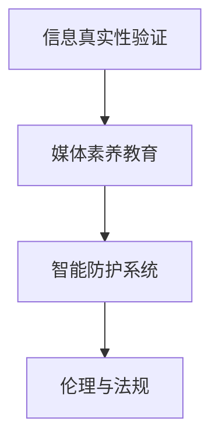

                 

# 信息验证和媒体素养能力培养：为假新闻和媒体操纵做好准备

## 1. 背景介绍

### 1.1 问题由来
在信息爆炸的时代，假新闻和媒体操纵（Media Manipulation）已经成为严重威胁公共信息安全和社会稳定的现象。虚假信息的传播不仅误导公众，还可能对社会治理、选举结果、金融市场等产生深远影响。同时，随着信息技术的进步，媒体操纵手段也日益复杂多样，普通公众难以分辨真伪。

### 1.2 问题核心关键点
1. **信息真实性验证**：通过技术手段对文本、图片、视频等形式的信息进行真实性判断。
2. **媒体素养教育**：提升公众识别假新闻和媒体操纵的能力，增强社会媒体素养。
3. **系统防护**：开发智能系统，实现对假新闻和媒体操纵行为的实时监测和拦截。
4. **伦理与法规**：建立合理的伦理框架和法规体系，规范媒体行为，保护公众权益。

### 1.3 问题研究意义
通过技术手段提升信息真实性验证能力，构建媒体素养教育体系，开发智能系统进行实时防护，是维护公共信息安全，增强社会治理能力，提升公众信息素养的重要途径。

## 2. 核心概念与联系

### 2.1 核心概念概述

为了更好地理解信息验证和媒体素养能力培养的方法，本节将介绍几个关键概念：

- **信息真实性验证**：通过技术手段对文本、图片、视频等信息进行真实性判断，防止假新闻和媒体操纵。
- **媒体素养教育**：通过课程、训练等方式，提升公众对假新闻、媒体操纵的识别和防范能力。
- **智能防护系统**：利用人工智能技术，构建实时监测和拦截假新闻和媒体操纵行为的智能系统。
- **伦理与法规**：建立合理的伦理框架和法规体系，规范媒体行为，保护公众权益。

这些核心概念之间的逻辑关系可以通过以下Mermaid流程图来展示：



这个流程图展示了几者之间的联系：

1. 通过信息真实性验证，可以增强媒体素养教育的基础。
2. 媒体素养教育提升后，用户更易于使用智能防护系统。
3. 智能防护系统的运行，依赖伦理与法规的保障。

## 3. 核心算法原理 & 具体操作步骤
### 3.1 算法原理概述

信息验证和媒体素养能力培养的核心技术之一是信息真实性验证。其核心思想是，利用技术手段对信息进行多维度、多模态的分析和比对，判断信息是否真实可信。

### 3.2 算法步骤详解

信息真实性验证算法通常包括以下几个关键步骤：

**Step 1: 数据收集与预处理**
- 从新闻源、社交媒体等渠道收集待验证的信息。
- 对信息进行清洗和预处理，去除噪声数据，保证数据的纯净度。

**Step 2: 特征提取**
- 利用自然语言处理、图像识别、视频分析等技术，提取信息的多维度特征。
- 对于文本信息，可以提取关键词、情感极性、语法结构等特征；对于图片和视频，可以提取图像特征、帧间变化、音频信号等特征。

**Step 3: 真实性判断**
- 将提取的多维度特征输入模型，进行真实性判断。常见的真实性判断方法包括基于深度学习的分类、回归等方法，以及基于规则和专家知识的分析。
- 真实性判断的输出结果可以是一个二值标签（真/假）或一个置信度分数。

**Step 4: 结果验证与修正**
- 对判断结果进行验证，采用交叉验证、多重验证等方法，确保结果的准确性和可靠性。
- 对误判结果进行修正和改进，优化模型性能。

### 3.3 算法优缺点

信息真实性验证算法具有以下优点：
1. 自动化、高效性：可以快速处理大量信息，提供实时验证结果。
2. 多模态、多维度：能够从文本、图片、视频等多个角度进行信息分析。
3. 可解释性：通过多种特征提取方法，增加了判断过程的可解释性。

但该算法也存在一些局限：
1. 依赖于数据质量：需要高质量的数据进行训练和验证，依赖于数据采集和清洗的准确性。
2. 假新闻形态多样：对于新型、伪装性强的假新闻，识别效果有限。
3. 误判风险：在误判率控制上需要平衡准确率和误判率。

### 3.4 算法应用领域

信息真实性验证技术在多个领域都有广泛的应用，例如：

- **新闻业**：对新闻报道进行实时验证，防止假新闻发布。
- **社交媒体**：对用户发布的帖子、评论进行真实性检查，防止谣言传播。
- **金融领域**：对新闻和消息进行真实性验证，防范金融欺诈和市场操纵。
- **政府治理**：对公共信息进行审核，防止虚假信息误导政策制定。
- **教育**：在信息素养教育中引入真实性验证技术，提升学生的媒体素养。

## 4. 数学模型和公式 & 详细讲解 & 举例说明

### 4.1 数学模型构建

信息真实性验证可以构建一个二分类模型，将待验证信息标记为“真”或“假”。设真实性标签为 $y \in \{0, 1\}$，模型输出为 $\hat{y}$。模型的目标是最小化经验损失函数：

$$
\mathcal{L}(\theta) = \frac{1}{N} \sum_{i=1}^N \ell(\hat{y}_i, y_i)
$$

其中，$\ell$ 为损失函数，常用的有交叉熵损失、对数损失等。模型的参数 $\theta$ 包括特征提取器和分类器。

### 4.2 公式推导过程

以文本信息为例，假设模型的输入为 $x = (x_1, x_2, \ldots, x_n)$，其中 $x_i$ 为文本的第 $i$ 个词向量。模型的输出为 $\hat{y} = \sigma(\langle \theta, \phi(x) \rangle)$，其中 $\phi(x)$ 为特征提取器，$\sigma$ 为激活函数。

假设真实性标签为 $y$，则模型的损失函数为交叉熵损失：

$$
\ell(\hat{y}, y) = -y\log \hat{y} - (1-y)\log(1-\hat{y})
$$

经验损失函数可以表示为：

$$
\mathcal{L}(\theta) = \frac{1}{N} \sum_{i=1}^N \ell(\sigma(\langle \theta, \phi(x_i) \rangle), y_i)
$$

通过梯度下降等优化算法，最小化损失函数，更新模型参数 $\theta$，即：

$$
\theta \leftarrow \theta - \eta \nabla_{\theta}\mathcal{L}(\theta)
$$

### 4.3 案例分析与讲解

假设我们有一篇待验证的新闻文章 $x$，模型已经通过训练得到了参数 $\theta$。模型的输入 $x$ 经过特征提取器 $\phi$ 后，生成特征向量 $\phi(x)$。模型的输出为 $\hat{y} = \sigma(\langle \theta, \phi(x) \rangle)$，其中 $\sigma$ 为 sigmoid 激活函数。

假设真实性标签 $y=1$（真实），模型输出的结果 $\hat{y} \approx 1$。如果 $\hat{y}$ 的置信度 $p$ 大于某个阈值 $\tau$，则认为该新闻文章为“真实”。如果 $p < \tau$，则认为该新闻文章为“虚假”。

## 5. 项目实践：代码实例和详细解释说明
### 5.1 开发环境搭建

在进行信息真实性验证的开发前，需要准备好开发环境。以下是使用Python进行TensorFlow开发的环境配置流程：

1. 安装Anaconda：从官网下载并安装Anaconda，用于创建独立的Python环境。

2. 创建并激活虚拟环境：
```bash
conda create -n tf-env python=3.8 
conda activate tf-env
```

3. 安装TensorFlow：
```bash
conda install tensorflow==2.5.0
```

4. 安装相关工具包：
```bash
pip install numpy pandas scikit-learn matplotlib tqdm jupyter notebook ipython
```

完成上述步骤后，即可在`tf-env`环境中开始开发。

### 5.2 源代码详细实现

下面我们以文本信息真实性验证为例，给出使用TensorFlow进行信息真实性验证的PyTorch代码实现。

首先，定义数据处理函数：

```python
import tensorflow as tf
from tensorflow.keras.preprocessing.text import Tokenizer
from tensorflow.keras.preprocessing.sequence import pad_sequences

tokenizer = Tokenizer(num_words=10000, oov_token='<OOV>')
tokenizer.fit_on_texts(train_texts)
word_index = tokenizer.word_index
text_sequences = tokenizer.texts_to_sequences(train_texts)
train_X = pad_sequences(text_sequences, maxlen=50)
train_y = tf.keras.utils.to_categorical(train_labels, num_classes=2)

test_sequences = tokenizer.texts_to_sequences(dev_texts)
dev_X = pad_sequences(test_sequences, maxlen=50)
dev_y = tf.keras.utils.to_categorical(dev_labels, num_classes=2)
```

然后，定义模型：

```python
from tensorflow.keras.models import Sequential
from tensorflow.keras.layers import Dense, Dropout, Embedding, LSTM, GlobalAveragePooling1D

model = Sequential([
    Embedding(input_dim=10000, output_dim=128, input_length=50),
    LSTM(128),
    GlobalAveragePooling1D(),
    Dense(64, activation='relu'),
    Dropout(0.5),
    Dense(1, activation='sigmoid')
])
model.compile(loss='binary_crossentropy', optimizer='adam', metrics=['accuracy'])
```

接着，训练模型：

```python
batch_size = 32
epochs = 10

model.fit(train_X, train_y, batch_size=batch_size, epochs=epochs, validation_data=(dev_X, dev_y))
```

最后，评估模型：

```python
test_X = pad_sequences(tokenizer.texts_to_sequences(test_texts), maxlen=50)
test_y = tf.keras.utils.to_categorical(test_labels, num_classes=2)

test_loss, test_acc = model.evaluate(test_X, test_y, verbose=0)
print('Test loss:', test_loss)
print('Test accuracy:', test_acc)
```

以上代码实现了使用LSTM模型对文本信息进行真实性验证的完整流程。可以看到，TensorFlow的封装使得模型构建和训练过程非常简单，开发者可以将更多精力放在数据处理和模型优化上。

### 5.3 代码解读与分析

让我们再详细解读一下关键代码的实现细节：

**Tokenizer类**：
- 定义了单词和OOV标记的映射关系，用于将文本转换为数字序列。

**训练过程**：
- 使用`fit`方法对模型进行训练，指定训练集、批次大小和迭代轮数。
- `validation_data`参数指定验证集的批次大小和迭代轮数，用于评估模型性能。
- `batch_size`参数指定训练时的批次大小，影响模型的收敛速度和内存占用。
- `epochs`参数指定训练轮数，影响模型的拟合效果。

**评估过程**：
- 使用`evaluate`方法对测试集进行评估，返回测试集上的损失和准确率。

通过以上步骤，可以构建一个基本的文本信息真实性验证模型。

## 6. 实际应用场景
### 6.1 智能新闻审核系统

智能新闻审核系统可以利用信息真实性验证技术，对新闻报道进行实时审核，防止假新闻发布。在技术实现上，可以收集历史新闻数据，将其标注为“真”或“假”，在此基础上对预训练模型进行微调。微调后的模型能够自动识别新闻文章的真实性，对疑似虚假新闻进行标注和拦截。

在新闻发布平台中集成智能审核系统，能够显著提升新闻审核的效率和准确性，保护公众的知情权和媒体的公信力。

### 6.2 社交媒体信息管理

社交媒体平台面对海量用户信息，虚假信息和恶意传播成为主要问题。通过信息真实性验证技术，可以构建实时监控系统，对用户发布的帖子、评论等进行真实性检查，防止谣言和虚假信息的传播。

在社交媒体平台中集成智能信息管理工具，能够快速识别和处理虚假信息，维护平台的稳定和秩序。

### 6.3 企业舆情监测

企业在舆情管理中面临虚假信息和恶意评论的挑战。利用信息真实性验证技术，可以构建企业舆情监测系统，对用户评论进行真实性验证，防止恶意评论和虚假信息的干扰。

在企业内部系统中集成舆情监测系统，能够及时发现和处理负面信息，提升企业的品牌形象和声誉。

### 6.4 未来应用展望

随着信息真实性验证技术的不断发展，其在多个领域的应用前景广阔：

1. **政治选举**：利用信息真实性验证技术，防止假新闻和媒体操纵，保障选举的公正和透明。
2. **金融市场**：对新闻和消息进行真实性验证，防范金融欺诈和市场操纵，保护投资者权益。
3. **医疗健康**：对健康信息进行真实性验证，防止虚假健康信息的传播，保障公众健康。
4. **环境保护**：对环境信息进行真实性验证，防止虚假环境信息的传播，提升环境保护效果。

未来，随着技术的不断进步和应用的深入，信息真实性验证技术将在更多领域得到应用，为信息社会的安全和稳定做出更大贡献。

## 7. 工具和资源推荐
### 7.1 学习资源推荐

为了帮助开发者系统掌握信息真实性验证的理论基础和实践技巧，这里推荐一些优质的学习资源：

1. **TensorFlow官方文档**：TensorFlow的官方文档提供了完整的API文档和教程，适合初学者和进阶者。

2. **深度学习基础课程**：斯坦福大学、Coursera等平台提供的深度学习基础课程，涵盖TensorFlow、Keras等框架的使用。

3. **信息真实性验证研究论文**：查阅最新的学术研究论文，了解最新的进展和技术突破。

4. **GitHub开源项目**：通过GitHub上的开源项目，学习其他开发者的实践经验和代码实现。

通过对这些资源的学习实践，相信你一定能够快速掌握信息真实性验证的精髓，并用于解决实际的NLP问题。

### 7.2 开发工具推荐

高效的开发离不开优秀的工具支持。以下是几款用于信息真实性验证开发的常用工具：

1. **TensorFlow**：Google主导开发的开源深度学习框架，生产部署方便，适合大规模工程应用。

2. **Keras**：TensorFlow的高层API，适合快速迭代研究。

3. **Jupyter Notebook**：支持代码和文本混排，便于撰写和分享代码。

4. **PyTorch**：Facebook主导的深度学习框架，灵活动态，适合研究性开发。

5. **Numpy**：高效的数值计算库，支持多维数组和矩阵运算。

合理利用这些工具，可以显著提升信息真实性验证任务的开发效率，加快创新迭代的步伐。

### 7.3 相关论文推荐

信息真实性验证技术的发展源于学界的持续研究。以下是几篇奠基性的相关论文，推荐阅读：

1. **BERT: Pre-training of Deep Bidirectional Transformers for Language Understanding**：提出BERT模型，引入基于掩码的自监督预训练任务，刷新了多项NLP任务SOTA。

2. **Adversarial Examples in the Physical World**：展示基于对抗样本的假新闻识别技术，揭示对抗样本对信息真实性验证的挑战。

3. **A Survey of Text Deception Detection**：总结了文本欺骗检测的研究进展和技术方法，为信息真实性验证提供了丰富的理论支持。

这些论文代表了大语言模型微调技术的发展脉络。通过学习这些前沿成果，可以帮助研究者把握学科前进方向，激发更多的创新灵感。

## 8. 总结：未来发展趋势与挑战

### 8.1 总结

本文对信息真实性验证和媒体素养能力培养的方法进行了全面系统的介绍。首先阐述了信息真实性验证和媒体素养教育的研究背景和意义，明确了其在大数据、人工智能背景下的重要性。其次，从原理到实践，详细讲解了信息真实性验证的数学模型和算法步骤，给出了信息真实性验证任务开发的完整代码实例。同时，本文还广泛探讨了信息真实性验证技术在多个行业领域的应用前景，展示了其在信息社会中的重要价值。

通过本文的系统梳理，可以看到，信息真实性验证技术已经成为应对假新闻和媒体操纵的重要手段，具备广阔的应用前景。未来，伴随技术的不断进步，信息真实性验证技术必将为维护公共信息安全和社会稳定，提升信息素养教育，构建智能化媒体环境做出更大贡献。

### 8.2 未来发展趋势

展望未来，信息真实性验证技术将呈现以下几个发展趋势：

1. **多模态融合**：未来将更多地融合图像、视频、音频等多模态信息，提升信息真实性验证的准确性和鲁棒性。

2. **联邦学习**：在分布式环境中进行信息真实性验证，保护数据隐私，同时提升验证效果。

3. **自适应学习**：动态调整模型参数，适应不同领域、不同形式的信息，提升验证模型的泛化能力。

4. **解释性增强**：增加模型的可解释性，使得验证结果更加透明、可信。

5. **跨领域迁移**：将信息真实性验证技术应用于更多领域，如政治、金融、医疗等，提升其在社会治理中的应用价值。

这些趋势凸显了信息真实性验证技术的广阔前景。这些方向的探索发展，必将进一步提升信息真实性验证技术的精度和应用范围，为构建安全、可靠、可解释、可控的智能系统铺平道路。

### 8.3 面临的挑战

尽管信息真实性验证技术已经取得了瞩目成就，但在迈向更加智能化、普适化应用的过程中，它仍面临着诸多挑战：

1. **数据质量瓶颈**：高质量的数据是信息真实性验证的基础，但数据获取和清洗往往需要大量人力物力。

2. **对抗样本攻击**：对抗样本能够欺骗验证模型，使其输出错误的判断结果，需要进一步增强模型的鲁棒性。

3. **计算资源限制**：大模型的训练和推理需要大量的计算资源，如何优化资源消耗是一个重要问题。

4. **跨领域迁移能力不足**：现有模型在不同领域上的迁移效果有限，需要更多跨领域数据进行预训练。

5. **解释性不足**：验证模型的决策过程难以解释，对于法律、金融等高风险应用，缺乏解释性会带来严重问题。

6. **隐私保护挑战**：在数据隐私保护方面，需要设计合理的隐私保护机制，防止用户隐私泄露。

这些挑战需要通过技术创新和制度完善来解决，才能使信息真实性验证技术在实际应用中发挥更大的作用。

### 8.4 研究展望

面对信息真实性验证技术面临的挑战，未来的研究需要在以下几个方面寻求新的突破：

1. **跨领域迁移学习**：构建跨领域的知识图谱和迁移模型，提升信息真实性验证模型的泛化能力。

2. **对抗样本防御**：开发更加鲁棒的模型结构和方法，增强模型对对抗样本的防御能力。

3. **资源优化技术**：使用分布式训练、模型压缩等技术，降低信息真实性验证模型的计算资源消耗。

4. **解释性增强**：引入可解释性方法，增强验证模型的决策透明度，使其更易于理解和调试。

5. **隐私保护技术**：设计隐私保护算法，保护用户隐私，同时提升信息真实性验证的准确性。

这些研究方向将推动信息真实性验证技术向更广范围、更高效、更可控的方向发展，为构建安全、可靠、可解释、可控的智能系统铺平道路。

## 9. 附录：常见问题与解答

**Q1: 信息真实性验证的准确率受哪些因素影响？**

A: 信息真实性验证的准确率受以下因素影响：
1. 数据质量：数据集中标注的真实性标签是否准确。
2. 模型选择：模型的结构和参数是否合适，是否经过充分的训练和调参。
3. 特征提取：特征提取方法是否合理，是否能够充分提取文本、图像等信息的特征。
4. 损失函数：损失函数是否合适，是否能够适应不同的任务需求。
5. 对抗样本：对抗样本是否存在，对抗样本是否能够欺骗模型。
6. 计算资源：计算资源是否充足，模型是否能够在有限的时间内收敛。

**Q2: 如何构建高质量的信息真实性验证数据集？**

A: 构建高质量的信息真实性验证数据集需要以下步骤：
1. 数据收集：从新闻、社交媒体、网络论坛等渠道收集文本、图片、视频等数据。
2. 数据清洗：去除噪声数据，如去除无关词汇、纠正拼写错误等。
3. 数据标注：邀请专业人士进行标注，确保标注结果的准确性和一致性。
4. 数据扩展：使用数据增强技术，如近义词替换、同义词扩充等，增加数据集的多样性。
5. 数据划分：将数据集划分为训练集、验证集和测试集，保证模型在未知数据上的泛化能力。

**Q3: 信息真实性验证的模型如何选择？**

A: 选择信息真实性验证模型需要考虑以下因素：
1. 数据类型：不同的数据类型需要选择不同的模型。文本数据可以选择RNN、CNN、Transformer等模型，图像数据可以选择CNN等模型，视频数据可以选择3D CNN等模型。
2. 任务需求：根据任务需求选择合适的模型。例如，文本分类任务可以选择线性分类器，文本生成任务可以选择语言模型，图像分类任务可以选择卷积神经网络等。
3. 模型复杂度：考虑模型的复杂度和计算资源。复杂模型需要更多的计算资源，但可能获得更好的效果。
4. 可解释性：考虑模型的可解释性，即模型输出是否易于理解，是否能够提供决策依据。

通过选择合适的模型，可以提升信息真实性验证的精度和效率，满足不同的任务需求。

**Q4: 如何提高信息真实性验证的鲁棒性？**

A: 提高信息真实性验证的鲁棒性需要以下策略：
1. 多模型集成：使用多个模型进行信息真实性验证，取平均输出，减少单一模型的误差。
2. 对抗训练：在训练过程中引入对抗样本，增强模型对对抗样本的防御能力。
3. 多维度特征提取：使用多维度特征提取方法，如文本的关键词、情感极性、语法结构，图像的颜色、形状、纹理等，增强模型的鲁棒性。
4. 数据扩充：使用数据增强技术，如回译、近义词替换等，增加数据集的多样性，提升模型的泛化能力。
5. 规则约束：在模型中加入规则约束，如禁止语法错误、禁止重复词汇等，减少误判风险。

这些策略可以综合应用，提升信息真实性验证的鲁棒性，防止单一模型的误判。

**Q5: 如何设计信息真实性验证系统的用户界面？**

A: 设计信息真实性验证系统的用户界面需要考虑以下因素：
1. 简洁明了：界面简洁明了，用户易于理解和使用。
2. 反馈及时：系统能够及时反馈验证结果，使用户能够快速了解信息真实性。
3. 可视化展示：通过图表、图标等形式，直观展示验证结果和推理过程，增强系统的可解释性。
4. 用户教育：在界面设计中加入教育元素，如提示说明、案例分析等，帮助用户理解信息真实性验证的过程和方法。
5. 自定义设置：提供自定义设置选项，让用户能够根据实际需求调整验证参数和规则。

通过设计友好的用户界面，可以提升信息真实性验证系统的可用性和用户体验。

---

作者：禅与计算机程序设计艺术 / Zen and the Art of Computer Programming

