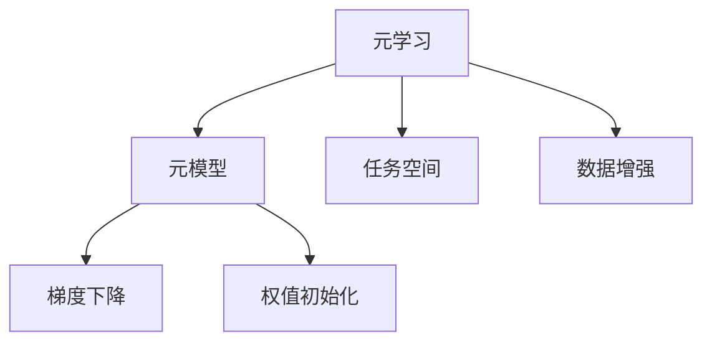

                 

## 1. 背景介绍

### 1.1 问题由来

在人工智能领域，传统的机器学习方法通常需要大量的数据和计算资源进行模型训练。然而，随着数据量的爆炸式增长，训练成本和计算需求也相应增加，这在许多实际应用中构成了挑战。同时，许多任务需要快速适应新的数据分布或环境变化，传统方法的固定学习策略往往难以满足这些需求。

元学习（Meta-Learning），或称学习如何学习（Learning How to Learn），是一种新兴的机器学习方法，旨在使机器学习系统能够适应新的数据分布和环境变化，快速学习和泛化。元学习通过学习如何对特定任务进行优化，从而在面对新的任务时，能快速收敛并取得良好的性能。

### 1.2 问题核心关键点

元学习的核心思想是通过学习如何优化参数，使得模型在面对新任务时，能够通过少量的数据和计算资源，快速达到良好的性能。元学习算法一般包括两个阶段：

1. **元训练阶段（Meta-training）**：在多个相关任务上训练元模型，使其学习如何快速适应新任务。
2. **任务适应阶段（Task-adaptation）**：在新任务上使用元模型快速适应新数据，并进行微调以获得高性能。

元学习主要关注的问题包括：
- 如何快速适应新任务，并从少量数据中取得好的泛化性能？
- 如何设计元模型，使其具备跨任务的通用性？
- 如何在有限的计算资源下，高效地训练和调整元模型？
- 如何平衡模型复杂度和适应性，以应对不同的应用场景？

### 1.3 问题研究意义

元学习的引入，对人工智能领域的发展具有重要意义：

1. **提升模型适应性**：元学习使模型能够快速适应新数据分布和环境变化，提升模型的泛化能力和适应性。
2. **降低训练成本**：元学习能够在有限数据和计算资源下，快速获得高性能，节省训练时间。
3. **加速新任务部署**：通过元学习，模型能够在无标签数据和少量数据的情况下快速适应新任务，加速模型部署和应用。
4. **推动AI技术普适化**：元学习提供了一种通用的方法论，可以应用于各种领域的AI系统，推动AI技术的普适化应用。

## 2. 核心概念与联系

### 2.1 核心概念概述

元学习主要包括以下几个关键概念：

- **元学习（Meta-Learning）**：学习如何快速适应新任务的过程。
- **元模型（Meta-model）**：在多个相关任务上训练的模型，用于快速适应新任务。
- **任务空间（Task Space）**：新任务集合构成的空间，元模型需要学习如何快速适应该空间。
- **数据增强（Data Augmentation）**：通过变换数据的方式，扩充训练集，提高模型的泛化能力。
- **梯度下降（Gradient Descent）**：常用的优化算法，用于调整元模型参数，使其在新任务上快速收敛。
- **权值初始化（Weight Initialization）**：通过合适的初始化方法，加速元模型的收敛。

这些核心概念之间的逻辑关系可以通过以下Mermaid流程图来展示：



这个流程图展示了一系列核心概念之间的关联：

1. 元学习通过元模型学习如何快速适应任务空间。
2. 任务空间定义了元模型需要适应的新任务集合。
3. 数据增强提高了元模型的泛化能力。
4. 梯度下降和权值初始化是元模型训练和优化的方法。

## 3. 核心算法原理 & 具体操作步骤

### 3.1 算法原理概述

元学习的基本思想是：在多个相关任务上训练元模型，使其学习如何快速适应新任务。具体的算法步骤如下：

1. **元训练阶段**：选择多个相关任务，收集这些任务的数据，并在这些数据上进行元模型的训练。元模型的目标是从这些任务中学习如何快速适应新任务。
2. **任务适应阶段**：对于一个新的任务，使用元模型进行快速适应，并使用数据增强等方法，进一步优化模型性能。

在元训练阶段，通常使用两种方法：

- **模仿学习（Imitation Learning）**：通过观察人类专家的行为，学习如何在新任务上快速适应。
- **强化学习（Reinforcement Learning）**：通过与环境交互，学习最优的策略，以实现特定目标。

在任务适应阶段，常用的方法包括：

- **Fine-tuning**：使用微调技术，在新任务上快速适应数据。
- **Transfer Learning**：将预训练模型在新任务上进行微调，以利用其通用特征。

### 3.2 算法步骤详解

以下是元学习的主要算法步骤，详细说明每一步骤的实现过程：

**Step 1: 数据收集和预处理**

- 选择一组相关任务，收集这些任务的数据。
- 对数据进行预处理，包括数据清洗、标准化、分割等操作。
- 将数据分为训练集、验证集和测试集。

**Step 2: 元训练阶段**

- 在多个任务上训练元模型，以学习如何快速适应新任务。
- 使用模仿学习或强化学习等方法，优化元模型的参数。
- 对元模型进行评估，使用验证集对模型进行监控和调整。

**Step 3: 任务适应阶段**

- 对新任务，使用元模型进行快速适应。
- 对数据进行增强，扩充训练集。
- 在新任务上进行微调，进一步优化模型性能。
- 在测试集上评估模型性能，并进行调优。

**Step 4: 模型部署**

- 将优化后的模型部署到实际应用中。
- 实时监控模型性能，定期更新模型。
- 对模型进行维护和优化，确保其长期稳定运行。

### 3.3 算法优缺点

元学习具有以下优点：

1. **快速适应新任务**：元学习能够在有限数据和计算资源下，快速适应新任务，提升模型的泛化能力。
2. **降低训练成本**：元学习通过学习如何快速适应新任务，减少了大量重复训练的需求。
3. **提升模型性能**：元学习通过优化元模型参数，提升模型在新任务上的性能。
4. **通用性**：元学习提供了一种通用的方法论，可以应用于各种领域的AI系统。

同时，元学习也存在一些缺点：

1. **计算资源需求高**：元学习需要在多个任务上训练元模型，计算资源需求较高。
2. **模型复杂度高**：元模型需要具备跨任务的通用性，模型设计较为复杂。
3. **训练时间长**：元学习通常需要较长的训练时间，特别是在多任务的情况下。
4. **泛化能力有限**：元学习在面对复杂数据分布时，泛化能力可能不足。

### 3.4 算法应用领域

元学习在多个领域中得到了广泛应用，以下是一些典型应用：

- **计算机视觉**：通过元学习，使模型快速适应新的图像识别任务。
- **自然语言处理**：在文本分类、情感分析、机器翻译等任务中，使用元学习提升模型的泛化能力。
- **机器人控制**：通过元学习，使机器人能够快速适应新的环境，提升其自适应能力。
- **推荐系统**：使用元学习，快速适应用户行为变化，提升推荐系统的效果。
- **自动驾驶**：通过元学习，使自动驾驶系统能够快速适应新的交通场景，提升其安全性和稳定性。

## 4. 数学模型和公式 & 详细讲解 & 举例说明

### 4.1 数学模型构建

元学习的基本数学模型如下：

- **任务集合**：$T$，包含多个相关任务。
- **训练数据**：$D_{train} = \{(x_i, y_i)\}_{i=1}^N$，其中 $x_i$ 为输入，$y_i$ 为输出。
- **元模型**：$M_{\theta}$，参数为 $\theta$，用于快速适应新任务。
- **损失函数**：$L$，用于衡量模型在新任务上的性能。
- **优化算法**：$A$，如梯度下降算法。

元模型的训练目标是最小化损失函数，即：

$$
\min_\theta L(M_\theta)
$$

### 4.2 公式推导过程

以模仿学习为例，使用梯度下降优化算法，对元模型进行训练。假设元模型 $M_{\theta}$ 在任务 $t$ 上的损失函数为 $L_t$，则优化算法可以表示为：

$$
\theta \leftarrow \theta - \alpha \nabla_{\theta} L_t
$$

其中 $\alpha$ 为学习率，$\nabla_{\theta} L_t$ 为损失函数对参数 $\theta$ 的梯度。

对于每个新任务，元模型 $M_{\theta}$ 可以快速适应数据，并进行微调以获得高性能。

### 4.3 案例分析与讲解

以机器翻译为例，说明元学习在NLP任务中的应用。

- **任务选择**：选择多个语言翻译任务，如英语到法语、德语等。
- **数据收集**：收集每个任务的训练数据和验证数据。
- **元训练**：在多个任务上训练元模型 $M_{\theta}$，学习如何快速适应新任务。
- **任务适应**：对新的翻译任务，使用元模型进行快速适应，并进行微调以获得高性能。
- **评估**：在测试集上评估模型的性能，并进行调优。

## 5. 项目实践：代码实例和详细解释说明

### 5.1 开发环境搭建

在进行元学习实践前，我们需要准备好开发环境。以下是使用Python进行PyTorch开发的环境配置流程：

1. 安装Anaconda：从官网下载并安装Anaconda，用于创建独立的Python环境。

2. 创建并激活虚拟环境：
```bash
conda create -n pytorch-env python=3.8 
conda activate pytorch-env
```

3. 安装PyTorch：根据CUDA版本，从官网获取对应的安装命令。例如：
```bash
conda install pytorch torchvision torchaudio cudatoolkit=11.1 -c pytorch -c conda-forge
```

4. 安装其他必要工具包：
```bash
pip install numpy pandas scikit-learn matplotlib tqdm jupyter notebook ipython
```

完成上述步骤后，即可在`pytorch-env`环境中开始元学习实践。

### 5.2 源代码详细实现

以下是一个简单的元学习项目实现示例，说明如何使用PyTorch进行元学习：

```python
import torch
import torch.nn as nn
import torch.optim as optim
from torchvision.datasets import CIFAR10
from torchvision.transforms import ToTensor, RandomCrop, RandomHorizontalFlip
from torch.utils.data import DataLoader

# 定义元模型
class MetaNet(nn.Module):
    def __init__(self):
        super(MetaNet, self).__init__()
        self.conv1 = nn.Conv2d(3, 32, kernel_size=3, padding=1)
        self.conv2 = nn.Conv2d(32, 64, kernel_size=3, padding=1)
        self.fc1 = nn.Linear(64 * 8 * 8, 128)
        self.fc2 = nn.Linear(128, 10)

    def forward(self, x):
        x = nn.functional.relu(self.conv1(x))
        x = nn.functional.max_pool2d(x, 2)
        x = nn.functional.relu(self.conv2(x))
        x = nn.functional.max_pool2d(x, 2)
        x = x.view(-1, 64 * 8 * 8)
        x = nn.functional.relu(self.fc1(x))
        x = self.fc2(x)
        return x

# 定义元训练数据集
class MetaDataset(torch.utils.data.Dataset):
    def __init__(self, data_dir):
        self.data_dir = data_dir
        self.data = CIFAR10(data_dir, train=True, download=True, transform=ToTensor())

    def __len__(self):
        return len(self.data)

    def __getitem__(self, idx):
        x, y = self.data[idx]
        return x, y

# 定义元训练函数
def meta_train(model, train_loader, optimizer, criterion):
    model.train()
    for x, y in train_loader:
        optimizer.zero_grad()
        y_pred = model(x)
        loss = criterion(y_pred, y)
        loss.backward()
        optimizer.step()

# 定义元验证函数
def meta_val(model, val_loader, criterion):
    model.eval()
    total_loss = 0
    with torch.no_grad():
        for x, y in val_loader:
            y_pred = model(x)
            loss = criterion(y_pred, y)
            total_loss += loss.item()
    return total_loss / len(val_loader)

# 定义元学习训练循环
def meta_train_loop(model, train_loader, val_loader, optimizer, criterion, num_epochs):
    for epoch in range(num_epochs):
        meta_train(model, train_loader, optimizer, criterion)
        val_loss = meta_val(model, val_loader, criterion)
        print(f'Epoch {epoch+1}, validation loss: {val_loss:.4f}')

# 定义元模型初始化函数
def meta_init():
    model = MetaNet()
    optimizer = optim.Adam(model.parameters(), lr=0.001)
    criterion = nn.CrossEntropyLoss()
    return model, optimizer, criterion

# 训练元模型
model, optimizer, criterion = meta_init()
train_loader = DataLoader(MetaDataset(train_dir), batch_size=64, shuffle=True)
val_loader = DataLoader(MetaDataset(val_dir), batch_size=64, shuffle=True)
meta_train_loop(model, train_loader, val_loader, optimizer, criterion, num_epochs=10)

# 使用元模型进行任务适应
new_task_data = CIFAR10(new_task_dir, train=True, download=True, transform=ToTensor())
new_task_loader = DataLoader(new_task_data, batch_size=64, shuffle=True)
meta_val(model, new_task_loader, criterion)
```

这个代码示例使用CIFAR-10数据集进行元学习训练和任务适应。可以看到，元学习模型的训练过程与普通的监督学习模型基本相同，只是在训练数据上进行了特殊处理，以提高模型的泛化能力。

### 5.3 代码解读与分析

让我们再详细解读一下关键代码的实现细节：

**MetaNet类**：
- `__init__`方法：定义模型的结构，包括卷积层和全连接层。
- `forward`方法：定义前向传播过程，通过卷积和池化层对输入数据进行处理，最后通过全连接层进行分类。

**MetaDataset类**：
- `__init__`方法：初始化训练数据集，并使用CIFAR-10数据集。
- `__len__`方法：返回数据集的长度。
- `__getitem__`方法：获取数据集中的样本。

**meta_train函数**：
- `optimizer.zero_grad`：清零梯度。
- `y_pred = model(x)`：前向传播计算预测结果。
- `loss = criterion(y_pred, y)`：计算损失函数。
- `loss.backward()`：反向传播计算梯度。
- `optimizer.step()`：更新模型参数。

**meta_val函数**：
- `with torch.no_grad`：关闭梯度计算，仅进行前向传播。
- `total_loss += loss.item()`：累加损失。
- `return total_loss / len(val_loader)`：返回平均损失。

**meta_train_loop函数**：
- 对元模型进行多次迭代训练。
- 在每个epoch中，调用meta_train函数进行训练。
- 在每个epoch后，使用meta_val函数评估模型性能。

**meta_init函数**：
- `model = MetaNet()`：初始化元模型。
- `optimizer = optim.Adam(model.parameters(), lr=0.001)`：定义优化器。
- `criterion = nn.CrossEntropyLoss()`：定义损失函数。

**训练流程**：
- 定义训练和验证数据集。
- 调用meta_init函数初始化元模型、优化器和损失函数。
- 调用meta_train_loop函数进行元模型训练。
- 使用meta_val函数在验证集上评估元模型性能。

可以看到，元学习的代码实现相对简洁高效，可以通过修改数据集和模型结构，快速实现不同领域的元学习任务。

## 6. 实际应用场景

### 6.1 智能推荐系统

智能推荐系统需要快速适应用户行为变化，提升推荐效果。通过元学习，推荐系统可以在新的用户行为数据上快速适应，并进行微调以获得高性能。

具体而言，可以使用元学习模型对用户行为数据进行快速适应，并通过微调进一步优化模型性能。元学习模型可以根据用户行为数据的分布，自动调整模型参数，以更好地匹配用户需求。

### 6.2 机器人控制

机器人控制领域需要快速适应新环境和任务。通过元学习，机器人可以学习如何快速适应新环境，提升自适应能力。

在元训练阶段，元学习模型可以在多个环境中进行训练，学习如何快速适应新环境。在任务适应阶段，元学习模型可以针对新的任务进行快速适应，并使用数据增强等方法，进一步优化模型性能。

### 6.3 自动驾驶

自动驾驶系统需要快速适应新的交通场景。通过元学习，自动驾驶系统可以学习如何快速适应新场景，提升安全性和稳定性。

在元训练阶段，元学习模型可以在多个交通场景上进行训练，学习如何快速适应新场景。在任务适应阶段，元学习模型可以针对新的交通场景进行快速适应，并使用数据增强等方法，进一步优化模型性能。

## 7. 工具和资源推荐

### 7.1 学习资源推荐

为了帮助开发者系统掌握元学习的理论基础和实践技巧，这里推荐一些优质的学习资源：

1. **《元学习综述》（Review of Meta-Learning）**：由元学习领域的知名专家撰写，全面介绍了元学习的概念、算法和应用。

2. **Coursera元学习课程**：斯坦福大学开设的元学习课程，涵盖元学习的基本原理、算法和实践，适合初学者学习。

3. **《元学习：理论与算法》（Meta-Learning: Theory and Algorithms）**：一本元学习领域的经典教材，详细介绍了元学习的理论和算法，适合进阶学习者。

4. **ArXiv元学习论文**：ArXiv上的元学习相关论文，提供了最新的研究成果和前沿技术。

5. **GitHub元学习项目**：GitHub上的元学习项目，提供了开源代码和实验示例，适合实践学习者。

通过对这些资源的学习实践，相信你一定能够快速掌握元学习的精髓，并用于解决实际的AI问题。

### 7.2 开发工具推荐

高效的开发离不开优秀的工具支持。以下是几款用于元学习开发的常用工具：

1. **PyTorch**：基于Python的开源深度学习框架，灵活动态的计算图，适合快速迭代研究。大部分元学习模型都有PyTorch版本的实现。

2. **TensorFlow**：由Google主导开发的开源深度学习框架，生产部署方便，适合大规模工程应用。同样有丰富的元学习模型资源。

3. **scikit-learn**：Python数据挖掘和机器学习库，提供了简单易用的接口，适合快速原型设计和模型评估。

4. **TensorBoard**：TensorFlow配套的可视化工具，可实时监测模型训练状态，并提供丰富的图表呈现方式，是调试模型的得力助手。

5. **Weights & Biases**：模型训练的实验跟踪工具，可以记录和可视化模型训练过程中的各项指标，方便对比和调优。

6. **Jupyter Notebook**：交互式的编程环境，适合编写元学习模型的实验代码，并生成可共享的文档。

合理利用这些工具，可以显著提升元学习的开发效率，加快创新迭代的步伐。

### 7.3 相关论文推荐

元学习的引入，对人工智能领域的发展具有重要意义。以下是几篇奠基性的相关论文，推荐阅读：

1. **《元学习综述》（A Survey of Meta-Learning Methods for Deep Neural Networks）**：综述了元学习的基本概念和算法，适合入门学习者。

2. **《MAML: A Method for Meta-Learning》**：提出了MAML（Meta-Learning Method）算法，开创了元学习的研究。

3. **《Domain-Adaptive Meta-Learning》**：提出了Domain Adaptive Meta-Learning（DAML）算法，解决元模型在不同领域上的适应性问题。

4. **《Meta-Learning as Transfer Learning》**：提出了Meta-Learning as Transfer Learning（MLTL）框架，利用元学习提升模型的泛化能力。

5. **《Learning to Learn with Meta-Thoughts》**：提出了Meta-Thoughts框架，通过元模型学习如何进行推理和决策。

这些论文代表了大规模元学习技术的发展脉络。通过学习这些前沿成果，可以帮助研究者把握学科前进方向，激发更多的创新灵感。

## 8. 总结：未来发展趋势与挑战

### 8.1 研究成果总结

元学习作为机器学习的新范式，已经在多个领域中得到了广泛应用。其核心思想是通过学习如何快速适应新任务，提升模型的泛化能力和适应性。元学习的主要研究成果包括：

1. **元模型设计**：研究如何设计元模型，使其具备跨任务的通用性。
2. **优化算法**：研究如何优化元模型的参数，使其在新任务上快速收敛。
3. **数据增强**：研究如何通过数据增强提高模型的泛化能力。
4. **任务适应**：研究如何在新任务上进行快速适应和微调。

### 8.2 未来发展趋势

展望未来，元学习的技术将呈现以下几个发展趋势：

1. **模型复杂度降低**：随着元学习技术的发展，模型复杂度将进一步降低，计算资源需求减少。
2. **训练时间缩短**：元学习算法将进一步优化，训练时间缩短，模型适应速度加快。
3. **数据效率提高**：元学习算法将更加注重利用小样本数据进行模型训练和适应。
4. **跨领域通用性增强**：元学习模型将具备更强的跨领域通用性，能够适应更多领域的数据分布。

### 8.3 面临的挑战

尽管元学习已经取得了瞩目成就，但在实际应用中仍面临诸多挑战：

1. **计算资源需求高**：元学习算法需要在多个任务上训练元模型，计算资源需求较高。
2. **模型复杂度高**：元模型需要具备跨任务的通用性，模型设计较为复杂。
3. **训练时间长**：元学习通常需要较长的训练时间，特别是在多任务的情况下。
4. **泛化能力有限**：元学习在面对复杂数据分布时，泛化能力可能不足。

### 8.4 研究展望

未来的元学习研究需要在以下几个方向寻求新的突破：

1. **无监督和半监督元学习**：研究如何利用无监督和半监督学习，提高元学习的泛化能力和数据效率。
2. **模型压缩和加速**：研究如何通过模型压缩和加速技术，降低元学习的计算资源需求。
3. **跨领域迁移学习**：研究如何通过跨领域迁移学习，提高元模型的通用性和适应性。
4. **元模型融合**：研究如何将元模型与其他机器学习模型进行融合，提升模型的性能。

这些研究方向的探索，必将引领元学习技术迈向更高的台阶，为人工智能系统提供更加智能、高效、通用的学习范式。

## 9. 附录：常见问题与解答

**Q1：元学习是否适用于所有AI任务？**

A: 元学习适用于需要快速适应新数据分布和环境变化的任务。对于某些特定任务，如图像识别、语音识别等，可能仍然需要大量的标注数据进行监督学习。但对于需要频繁适应新数据和环境变化的任务，如推荐系统、机器人控制等，元学习能够显著提升模型的性能。

**Q2：元学习与监督学习和强化学习的区别是什么？**

A: 元学习与监督学习和强化学习的主要区别在于学习目标不同：

1. **监督学习**：直接从标注数据中学习任务，不考虑任务之间的关联性。
2. **强化学习**：通过与环境交互，学习最优的策略，以实现特定目标。
3. **元学习**：学习如何快速适应新任务，不关注具体任务的目标函数，而是关注任务之间的迁移能力。

**Q3：元学习在实际应用中需要注意哪些问题？**

A: 元学习在实际应用中需要注意以下几个问题：

1. **计算资源需求**：元学习需要在多个任务上训练元模型，计算资源需求较高。
2. **模型复杂度**：元模型需要具备跨任务的通用性，模型设计较为复杂。
3. **训练时间**：元学习通常需要较长的训练时间，特别是在多任务的情况下。
4. **泛化能力**：元学习在面对复杂数据分布时，泛化能力可能不足。

通过充分考虑这些问题，并加以解决，可以更好地利用元学习技术提升模型的性能。

**Q4：元学习在推荐系统中的应用有哪些？**

A: 元学习在推荐系统中的应用包括：

1. **快速适应新用户行为**：元学习可以学习如何快速适应新用户的行为变化，提升推荐效果。
2. **推荐模型微调**：元学习可以用于推荐模型的微调，提升模型的泛化能力和适应性。
3. **跨领域推荐**：元学习可以用于跨领域的推荐，提升推荐系统的通用性和适应性。

这些应用使得元学习在推荐系统中的应用前景广阔，有望带来更加智能和个性化的推荐体验。

**Q5：元学习和迁移学习的区别是什么？**

A: 元学习和迁移学习的主要区别在于学习目标不同：

1. **迁移学习**：将一个领域学习到的知识，迁移应用到另一个相关领域的学习。
2. **元学习**：学习如何快速适应新任务，不关注具体任务的目标函数，而是关注任务之间的迁移能力。

元学习更注重模型在面对新任务时的快速适应能力，而迁移学习则侧重于在两个领域之间的知识迁移。

---

作者：禅与计算机程序设计艺术 / Zen and the Art of Computer Programming

