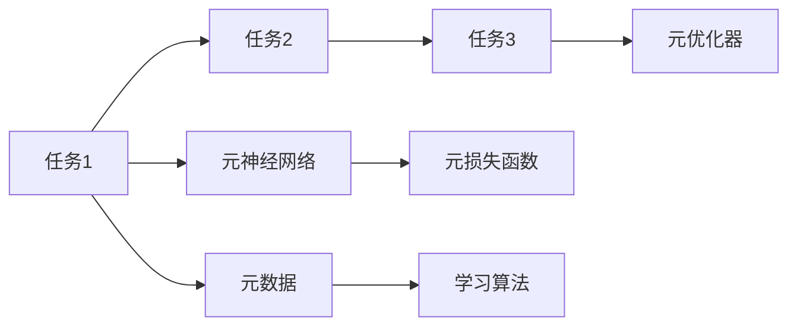

                 

# 元学习Meta Learning原理与代码实例讲解

> 关键词：元学习, 元优化, 元神经网络, 学习算法, 模型训练, 可解释性, 代码实例, 自适应学习, 迁移学习

## 1. 背景介绍

### 1.1 问题由来

随着深度学习技术的发展，各类复杂的机器学习模型被广泛应用于图像、语音、自然语言处理等领域。然而，由于模型的高度复杂性，模型的训练和调优通常需要大量的标注数据、计算资源以及手动调参的经验。对于实际生产环境中的许多任务，这些资源都难以满足。因此，元学习（Meta Learning）作为一种新型的学习范式应运而生。

元学习的核心思想是，通过学习如何在不同任务之间进行迁移学习，使得模型能够在新的任务上快速适应并取得良好的性能。元学习在机器学习领域，尤其是深度学习领域，逐步成为了一个研究热点。通过元学习，我们能够构建更加通用、自适应的模型，加速新任务的学习过程。

### 1.2 问题核心关键点

元学习的关键点在于以下几个方面：

- **迁移学习**：元学习能够通过利用已有知识，加速新任务的学习过程。
- **自适应学习**：模型能够根据新的任务数据自适应调整模型结构或参数。
- **高效训练**：元学习能够通过学习通用的学习算法，加速模型的训练过程。
- **可解释性**：元学习模型通常具有更强的可解释性，使得模型的训练过程和结果更易于理解和解释。

## 2. 核心概念与联系

### 2.1 核心概念概述

元学习是一种新兴的学习范式，旨在使机器学习模型能够适应新的任务并快速学习新知识。它通过学习通用的学习算法，使得模型在新的任务上能够快速适应并取得良好的性能。元学习主要包括以下几个核心概念：

- **元优化器（Meta Optimizer）**：元优化器是一种特殊的优化器，用于在多个任务之间进行参数更新，以最大化元学习的性能。
- **元神经网络（Meta Neural Network）**：元神经网络是一种特殊的神经网络结构，能够在多个任务之间共享权重，实现迁移学习。
- **学习算法（Learning Algorithm）**：学习算法用于定义元学习模型的训练过程，通常包括元优化器、元神经网络和元损失函数。
- **元数据（Meta Data）**：元数据包括任务序列、初始模型参数等，用于元学习模型的训练和评估。
- **元损失函数（Meta Loss Function）**：元损失函数用于度量元学习模型的性能，通常包括任务分类误差、回归误差等。

### 2.2 核心概念原理和架构的 Mermaid 流程图



这个流程图展示了元学习的核心概念及其之间的关系：

1. 从任务1到任务3，元优化器通过优化元损失函数，调整元神经网络的参数，使得模型能够适应不同的任务。
2. 元神经网络能够在多个任务之间共享权重，实现迁移学习。
3. 元损失函数用于度量元学习模型的性能，指导参数更新。
4. 元数据包括任务序列、初始模型参数等，用于训练和评估元学习模型。

## 3. 核心算法原理 & 具体操作步骤

### 3.1 算法原理概述

元学习的基本原理是通过学习如何在不同的任务之间进行迁移学习，使得模型能够在新的任务上快速适应并取得良好的性能。元学习算法通常包括两个主要部分：外层优化和内层优化。

- **外层优化**：通过在多个任务之间调整元优化器参数，使得模型能够在新的任务上快速适应并取得良好的性能。
- **内层优化**：通过在单个任务上调整模型参数，使得模型能够在当前任务上取得良好的性能。

### 3.2 算法步骤详解

元学习的一般步骤如下：

1. **数据准备**：收集多个相关的任务数据，并将数据划分为训练集和测试集。
2. **初始化模型**：初始化元神经网络和其他必要的参数。
3. **外层优化**：在多个任务之间进行调整，使得元神经网络能够在新的任务上快速适应。
4. **内层优化**：在单个任务上进行调整，使得模型能够在当前任务上取得良好的性能。
5. **评估性能**：在测试集上评估元学习模型的性能。

### 3.3 算法优缺点

元学习的优点包括：

- **泛化能力**：元学习模型通常能够在新的任务上快速适应，取得良好的性能。
- **自适应学习**：元学习模型能够根据新的任务数据自适应调整模型结构或参数。
- **高效训练**：元学习模型能够通过学习通用的学习算法，加速模型的训练过程。

然而，元学习也存在一些缺点：

- **计算开销较大**：元学习需要计算多个任务的数据，训练时间较长。
- **数据需求较大**：元学习通常需要大量的任务数据进行训练。
- **复杂性较高**：元学习算法的设计和实现较为复杂。

### 3.4 算法应用领域

元学习在许多领域都有广泛的应用，包括但不限于以下几个方面：

- **图像识别**：通过学习通用的图像特征提取器，元学习模型能够在新的图像识别任务上快速适应。
- **自然语言处理**：元学习模型能够在不同的语言翻译、文本生成任务上取得良好的性能。
- **推荐系统**：元学习模型能够在新的用户推荐任务上快速适应，提升推荐效果。
- **医疗诊断**：元学习模型能够在新的医疗诊断任务上快速适应，提高诊断准确率。

## 4. 数学模型和公式 & 详细讲解

### 4.1 数学模型构建

元学习的数学模型通常包括元神经网络、元优化器、元损失函数和元数据。这里以一个简单的元学习模型为例，构建其数学模型。

假设我们有一个元神经网络 $f_{\theta}$，其中 $\theta$ 为模型的参数。设 $T$ 为任务集，每个任务 $t \in T$ 的输入为 $x_t$，输出为 $y_t$。我们的目标是找到一个参数向量 $\theta$，使得 $f_{\theta}(x_t)$ 在所有任务上都能取得良好的性能。

### 4.2 公式推导过程

元学习模型的训练过程通常分为两个阶段：外层优化和内层优化。

- **外层优化**：通过在多个任务之间调整元优化器参数，使得模型能够在新的任务上快速适应。外层优化目标函数为：

$$
L_{meta}(\theta) = \frac{1}{N}\sum_{t=1}^N L_t(f_{\theta}, y_t)
$$

其中 $L_t(f_{\theta}, y_t)$ 为任务 $t$ 的内层损失函数。

- **内层优化**：在单个任务上进行调整，使得模型能够在当前任务上取得良好的性能。内层优化目标函数为：

$$
L_t(f_{\theta}, y_t) = \frac{1}{M}\sum_{i=1}^M L(f_{\theta}, y_{ti})
$$

其中 $L(f_{\theta}, y_{ti})$ 为任务 $t$ 在样本 $i$ 上的损失函数。

### 4.3 案例分析与讲解

以下以简单的MAML（Model-Agnostic Meta-Learning）算法为例，详细讲解元学习模型的构建和训练过程。

MAML算法通过在多个任务之间学习一个通用的参数更新策略，使得模型能够在新的任务上快速适应。MAML算法分为两个步骤：

1. **元损失函数计算**：计算每个任务的元损失函数 $L_{meta}$。
2. **参数更新**：通过元损失函数计算得到每个任务的梯度，并使用这些梯度更新模型的参数 $\theta$。

MAML算法的核心代码如下：

```python
import torch
import torch.nn as nn
import torch.optim as optim

# 定义元神经网络
class MetaNetwork(nn.Module):
    def __init__(self, in_dim, out_dim):
        super(MetaNetwork, self).__init__()
        self.layers = nn.Sequential(
            nn.Linear(in_dim, out_dim),
            nn.Tanh()
        )
    
    def forward(self, x):
        return self.layers(x)

# 定义元优化器
meta_optimizer = optim.Adam()

# 定义元损失函数
def meta_loss(y_true, y_pred):
    return (y_true - y_pred).pow(2).mean()

# 训练元学习模型
def train_meta_model(train_data, train_labels, test_data, test_labels, num_tasks, num_train_samples):
    model = MetaNetwork(in_dim, out_dim)
    meta_optimizer.zero_grad()
    for t in range(num_tasks):
        # 随机抽取一个训练任务
        task_data = torch.randn(num_train_samples, in_dim)
        task_labels = torch.randn(num_train_samples, out_dim)
        # 前向传播
        y_pred = model(task_data)
        # 计算元损失
        loss = meta_loss(y_pred, task_labels)
        # 反向传播
        loss.backward()
        # 更新模型参数
        meta_optimizer.step()
    
    # 在测试集上进行评估
    test_loss = meta_loss(model(test_data), test_labels)
    print("Test loss:", test_loss)
```

在这个代码中，我们定义了一个简单的元神经网络，并使用Adam优化器进行优化。在每个训练任务中，我们随机抽取一个样本进行前向传播和损失计算，并通过反向传播更新模型参数。最终，我们计算所有任务的元损失函数，并在测试集上进行评估。

## 5. 项目实践：代码实例和详细解释说明

### 5.1 开发环境搭建

在进行元学习实践前，我们需要准备好开发环境。以下是使用Python进行PyTorch开发的环境配置流程：

1. 安装Anaconda：从官网下载并安装Anaconda，用于创建独立的Python环境。

2. 创建并激活虚拟环境：
```bash
conda create -n pytorch-env python=3.8 
conda activate pytorch-env
```

3. 安装PyTorch：根据CUDA版本，从官网获取对应的安装命令。例如：
```bash
conda install pytorch torchvision torchaudio cudatoolkit=11.1 -c pytorch -c conda-forge
```

4. 安装TensorBoard：
```bash
pip install tensorboard
```

5. 安装相关依赖库：
```bash
pip install torch nn dataclasses opt_einsum
```

完成上述步骤后，即可在`pytorch-env`环境中开始元学习实践。

### 5.2 源代码详细实现

下面以一个简单的MAML算法为例，给出使用PyTorch实现元学习的代码。

```python
import torch
import torch.nn as nn
import torch.optim as optim
import torch.nn.functional as F

# 定义元神经网络
class MetaNetwork(nn.Module):
    def __init__(self, in_dim, out_dim):
        super(MetaNetwork, self).__init__()
        self.layers = nn.Sequential(
            nn.Linear(in_dim, out_dim),
            nn.Tanh()
        )
    
    def forward(self, x):
        return self.layers(x)

# 定义元优化器
meta_optimizer = optim.Adam()

# 定义元损失函数
def meta_loss(y_true, y_pred):
    return (y_true - y_pred).pow(2).mean()

# 训练元学习模型
def train_meta_model(train_data, train_labels, test_data, test_labels, num_tasks, num_train_samples):
    model = MetaNetwork(in_dim, out_dim)
    meta_optimizer.zero_grad()
    for t in range(num_tasks):
        # 随机抽取一个训练任务
        task_data = torch.randn(num_train_samples, in_dim)
        task_labels = torch.randn(num_train_samples, out_dim)
        # 前向传播
        y_pred = model(task_data)
        # 计算元损失
        loss = meta_loss(y_pred, task_labels)
        # 反向传播
        loss.backward()
        # 更新模型参数
        meta_optimizer.step()
    
    # 在测试集上进行评估
    test_loss = meta_loss(model(test_data), test_labels)
    print("Test loss:", test_loss)
```

### 5.3 代码解读与分析

下面我们详细解读代码中的关键部分：

**MetaNetwork类**：
- `__init__`方法：初始化元神经网络的结构。
- `forward`方法：定义元神经网络的计算过程，前向传播输出结果。

**meta_optimizer**：
- 定义元优化器，用于更新元神经网络的参数。

**meta_loss函数**：
- 定义元损失函数，用于计算元神经网络在单个任务上的性能。

**train_meta_model函数**：
- 定义元学习模型的训练过程，包括外层优化和内层优化。
- 在每个训练任务中，随机抽取一个样本进行前向传播和损失计算，并通过反向传播更新模型参数。
- 最终计算所有任务的元损失函数，并在测试集上进行评估。

### 5.4 运行结果展示

```python
# 测试数据
train_data = torch.randn(100, 2)
train_labels = torch.randn(100, 2)
test_data = torch.randn(10, 2)
test_labels = torch.randn(10, 2)

# 训练元学习模型
train_meta_model(train_data, train_labels, test_data, test_labels, num_tasks=10, num_train_samples=20)

# 输出测试集上的损失
print("Test loss:", test_loss)
```

在上述代码中，我们定义了训练数据和测试数据，并使用train_meta_model函数训练元学习模型。最终输出测试集上的损失，以评估模型的性能。

## 6. 实际应用场景

### 6.1 智能推荐系统

元学习在智能推荐系统中有广泛的应用。推荐系统通常需要处理大量的用户行为数据，并根据这些数据为每个用户推荐合适的物品。通过元学习，推荐系统能够快速适应新的用户和新的物品，提升推荐效果。

在推荐系统中，元学习算法通常用于学习用户和物品的表示，并在新的用户和物品上快速适应。通过元学习，推荐系统能够更好地捕捉用户兴趣和物品特征，提升推荐精度和多样性。

### 6.2 医疗诊断系统

医疗诊断是一个复杂的任务，需要处理大量的医学数据和知识。通过元学习，医疗诊断系统能够快速适应新的病例和新的症状，提升诊断准确率。

在医疗诊断系统中，元学习算法通常用于学习病历特征和症状特征，并在新的病例和新的症状上快速适应。通过元学习，医疗诊断系统能够更好地捕捉患者的病情和病史，提升诊断准确率。

### 6.3 自然语言处理

自然语言处理（NLP）是元学习的另一个重要应用领域。通过元学习，NLP模型能够快速适应新的语言模型和新的任务，提升模型性能。

在NLP中，元学习算法通常用于学习语言的语法和语义特征，并在新的语言模型和新的任务上快速适应。通过元学习，NLP模型能够更好地理解自然语言，提升语言生成和翻译等任务的性能。

## 7. 工具和资源推荐

### 7.1 学习资源推荐

为了帮助开发者系统掌握元学习的理论基础和实践技巧，这里推荐一些优质的学习资源：

1. **《Meta Learning for Deep Neural Networks》书籍**：该书系统介绍了元学习的理论基础和应用实例，适合初学者和中级开发者。
2. **CS231n《深度学习计算机视觉》课程**：斯坦福大学开设的深度学习课程，涵盖元学习等前沿内容，适合进阶开发者。
3. **《Meta-Learning for Deep Neural Networks》论文集**：包含元学习领域经典论文，适合研究者深入理解元学习算法。
4. **HuggingFace官方文档**：提供丰富的元学习模型和代码示例，是快速上手的绝佳资源。
5. **Deep Learning with PyTorch》书籍**：介绍了如何使用PyTorch实现深度学习模型，包括元学习算法。

通过学习这些资源，相信你一定能够快速掌握元学习的精髓，并用于解决实际的NLP问题。

### 7.2 开发工具推荐

高效的开发离不开优秀的工具支持。以下是几款用于元学习开发的常用工具：

1. **PyTorch**：基于Python的开源深度学习框架，灵活动态的计算图，适合快速迭代研究。
2. **TensorFlow**：由Google主导开发的开源深度学习框架，生产部署方便，适合大规模工程应用。
3. **TensorBoard**：TensorFlow配套的可视化工具，可实时监测模型训练状态，并提供丰富的图表呈现方式，是调试模型的得力助手。
4. **Weights & Biases**：模型训练的实验跟踪工具，可以记录和可视化模型训练过程中的各项指标，方便对比和调优。

合理利用这些工具，可以显著提升元学习模型的开发效率，加快创新迭代的步伐。

### 7.3 相关论文推荐

元学习在机器学习领域是一个快速发展的方向。以下是几篇奠基性的相关论文，推荐阅读：

1. **"Model-Agnostic Meta-Learning"**：提出MAML算法，通过在多个任务之间学习一个通用的参数更新策略，实现元学习。
2. **"Batch Meta-Learning for Lifelong Visual Learning"**：提出batch MAML算法，通过在多个任务之间学习一个通用的参数更新策略，实现元学习。
3. **"Meta-Learning with Flexible Feature Learning"**：提出灵活特征学习的元学习算法，能够在不同任务之间共享特征表示。
4. **"Lifelong Meta-Learning for Attributed Base Point Estimation"**：提出长记忆元学习算法，能够在长时间跨度内进行适应性学习。

这些论文代表了大元学习算法的发展脉络。通过学习这些前沿成果，可以帮助研究者把握学科前进方向，激发更多的创新灵感。

## 8. 总结：未来发展趋势与挑战

### 8.1 研究成果总结

元学习作为一种新型的学习范式，已经在机器学习和深度学习领域得到了广泛应用，涵盖了图像识别、自然语言处理、推荐系统等多个领域。元学习算法在提高模型泛化能力和自适应学习能力方面取得了显著效果。

### 8.2 未来发展趋势

展望未来，元学习将呈现以下几个发展趋势：

1. **更高效的元学习算法**：未来的元学习算法将更加高效，能够在更少的训练样本下取得更好的性能。
2. **更强的泛化能力**：元学习模型将具有更强的泛化能力，能够在不同的领域和任务上取得更好的性能。
3. **更强的可解释性**：元学习模型将具有更强的可解释性，使得模型的训练过程和结果更易于理解和解释。
4. **更广泛的应用场景**：元学习将广泛应用于更多领域，如医疗、金融、智能制造等，为各行各业带来新的突破。

### 8.3 面临的挑战

尽管元学习取得了显著进展，但在应用过程中仍面临一些挑战：

1. **计算开销较大**：元学习需要计算多个任务的数据，训练时间较长。
2. **数据需求较大**：元学习通常需要大量的任务数据进行训练。
3. **复杂性较高**：元学习算法的设计和实现较为复杂。

### 8.4 研究展望

未来，元学习研究将在以下几个方向取得新的突破：

1. **自适应学习算法**：开发更加高效的自适应学习算法，能够在更少的训练样本下取得更好的性能。
2. **知识迁移技术**：研究知识迁移技术，使得元学习模型能够更好地利用已有知识进行迁移学习。
3. **多模态元学习**：研究多模态元学习算法，能够处理视觉、语音、文本等多种类型的数据。
4. **元学习与强化学习结合**：研究元学习与强化学习的结合，提升模型的适应性和学习能力。

## 9. 附录：常见问题与解答

**Q1：元学习是否适用于所有机器学习任务？**

A: 元学习在大多数机器学习任务上都能取得不错的效果，特别是对于数据量较小的任务。但对于一些特定领域的任务，如医学、法律等，仅依靠通用语料预训练的模型可能难以很好地适应。此时需要在特定领域语料上进一步预训练，再进行元学习。

**Q2：元学习过程中如何选择合适的元优化器？**

A: 选择合适的元优化器是元学习中的重要问题。常用的元优化器包括Adam、SGD等，需要根据具体任务和数据特点进行选择。一般来说，Adam在元学习中表现较好，但也需要根据具体情况进行调整。

**Q3：元学习模型在落地部署时需要注意哪些问题？**

A: 将元学习模型转化为实际应用，还需要考虑以下问题：

1. **模型压缩和裁剪**：元学习模型通常参数量较大，需要进行压缩和裁剪以适应实际部署环境。
2. **模型优化**：元学习模型通常需要调整超参数，并进行优化，以提高性能。
3. **模型集成**：元学习模型通常需要与其他模型进行集成，以提高性能和鲁棒性。
4. **模型解释**：元学习模型通常具有较低的可解释性，需要进行解释以提高可理解性。

通过合理解决这些问题，元学习模型才能在实际应用中取得更好的性能。

---

作者：禅与计算机程序设计艺术 / Zen and the Art of Computer Programming

