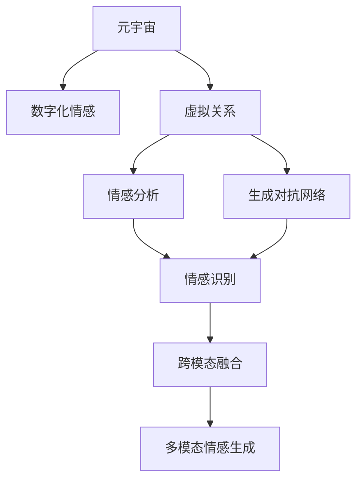

                 

# 元宇宙中的数字化情感:虚拟关系的深度探索

> 关键词：元宇宙,数字化情感,虚拟关系,社交网络,人工智能,深度学习,自然语言处理,跨模态融合

## 1. 背景介绍

### 1.1 问题由来
随着元宇宙概念的兴起，数字化的虚拟世界正逐渐成为人们日常生活的重要组成部分。虚拟世界中的人际关系构建、情感交互，成为了这一新兴领域的研究热点。数字化情感的实现不仅能够丰富虚拟体验，还能够提升用户的粘性和参与度，对元宇宙的经济和社交价值具有重要影响。

当前，基于深度学习的情感分析技术已经在文本、语音、图像等领域取得了显著进展，但虚拟世界中的数字化情感生成和交互仍然面临诸多挑战。如何在元宇宙中构建真实、自然、可控的虚拟关系，成为当前研究的关键问题。

### 1.2 问题核心关键点
数字化情感的实现涉及以下几个核心关键点：
1. **情感语料库构建**：构建包含丰富情感表达的文本语料库，为情感生成模型提供训练数据。
2. **多模态融合**：将文本、语音、图像等多种模态的信息进行融合，提高情感识别的准确性和自然度。
3. **生成对抗网络(GANs)**：使用GANs等生成模型，生成具有情感表达的虚拟角色对话、表情等。
4. **交互性提升**：设计虚拟角色间的互动机制，增强用户的沉浸感和参与感。
5. **可解释性与公平性**：确保生成情感表达的合理性和公平性，避免偏见和歧视。

本文将从核心概念和算法原理入手，详细阐述如何在元宇宙中构建数字化情感和虚拟关系。

## 2. 核心概念与联系

### 2.1 核心概念概述

为更好地理解元宇宙中数字化情感的实现，本节将介绍几个密切相关的核心概念：

- **元宇宙(Metaverse)**：由多个虚拟世界通过网络技术连接形成的大型虚拟空间，用户可以在其中自由交互、创作和体验。
- **数字化情感(Digital Emotion)**：通过深度学习技术生成或识别的虚拟世界中的情感表达，如语音、文字、表情等。
- **虚拟关系(Virtual Relationship)**：在虚拟世界中构建的人与人之间的情感联系，包括社交网络、游戏角色互动等。
- **情感分析(Emotion Analysis)**：使用自然语言处理(NLP)和深度学习技术，从文本或语音中识别和提取情感信息。
- **生成对抗网络(GANs)**：一种通过两个神经网络进行对抗训练的生成模型，用于生成高质量的图像、视频、音频等。
- **跨模态融合(Cross-Modal Fusion)**：将不同模态的数据进行融合，提高情感识别的综合能力。

这些核心概念之间的逻辑关系可以通过以下Mermaid流程图来展示：



这个流程图展示了大语言模型的核心概念及其之间的关系：

1. 元宇宙通过多模态数据构建虚拟关系。
2. 数字化情感通过生成对抗网络和跨模态融合生成。
3. 情感分析用于识别虚拟世界中的情感表达。
4. 多模态情感生成模型整合文本、语音、图像等多种模态的信息。

## 3. 核心算法原理 & 具体操作步骤
### 3.1 算法原理概述

在元宇宙中构建数字化情感，本质上是一个多模态情感生成和识别的过程。其核心思想是：利用深度学习技术，将文本、语音、图像等多种模态的信息进行融合，生成具有情感表达的虚拟角色对话、表情等，并通过情感分析技术，识别虚拟世界中的情感表达，从而实现虚拟关系构建。

形式化地，假设我们有一个包含文本、语音、图像等模态的情感语料库 $D$，其中每个样本 $d_i = (x_i, y_i)$，$x_i$ 表示模态信息，$y_i$ 表示情感标签。目标是通过深度学习模型，对新数据 $x_{new}$ 进行情感生成或识别，生成具有情感表达的虚拟角色 $g(x_{new})$ 或识别情感标签 $f(x_{new})$。

### 3.2 算法步骤详解

元宇宙中构建数字化情感的具体步骤如下：

**Step 1: 数据预处理**
- 收集元宇宙中的多模态数据，如虚拟角色的对话、表情、动作等。
- 对数据进行标注，为每个样本打上情感标签。
- 对文本数据进行分词、清洗和编码；对语音数据进行特征提取和标签编码；对图像数据进行预处理和标注。

**Step 2: 情感生成模型构建**
- 选择合适的生成对抗网络(GANs)架构，如条件GAN、变分自编码器等。
- 在标注数据集上进行模型训练，使用对抗训练策略，生成具有情感表达的多模态数据。
- 设计情感语义嵌入，将生成数据映射到高维空间，捕捉情感表达。

**Step 3: 多模态情感生成**
- 对多模态数据进行融合，生成具有情感表达的虚拟角色对话、表情等。
- 使用深度学习模型，如循环神经网络(RNN)、注意力机制等，对融合后的数据进行情感生成。
- 对生成结果进行后处理，如文本滤波、表情扭曲等，增强自然度和真实感。

**Step 4: 情感识别模型构建**
- 选择合适的情感分析模型，如基于深度学习的分类模型、序列模型等。
- 在标注数据集上进行模型训练，使用监督学习策略，学习情感分类任务。
- 设计情感识别模块，将虚拟角色的对话、表情等输入模型，输出情感标签。

**Step 5: 情感交互机制设计**
- 设计虚拟角色间的情感互动机制，如情感反馈、情感共情等。
- 实现虚拟角色的情感响应机制，根据情感识别结果，生成对应的对话、表情等。
- 设计用户交互界面，允许用户控制虚拟角色的情感表达。

**Step 6: 系统集成与测试**
- 将情感生成、情感识别和情感交互模块集成到元宇宙平台中。
- 对集成系统进行测试，验证情感表达的自然性和交互的流畅性。
- 根据用户反馈进行系统迭代优化，提升用户体验。

以上是元宇宙中构建数字化情感的一般流程。在实际应用中，还需要根据具体场景和需求，对各环节进行优化设计，如改进数据预处理技术、调整生成模型参数、增强情感识别模块等，以进一步提升系统性能。

### 3.3 算法优缺点

构建数字化情感的深度学习范式具有以下优点：
1. 生成具有情感表达的虚拟内容，丰富元宇宙的体验。
2. 通过多模态融合，提高情感识别的准确性和自然度。
3. 用户可控的情感表达，提升沉浸感和参与感。
4. 可解释性和公平性较好，能够避免偏见和歧视。

同时，该方法也存在一定的局限性：
1. 对高质量标注数据的依赖，数据标注成本较高。
2. 生成内容的自然度和多样性受限于数据集，容易出现同质化问题。
3. 实时交互的系统复杂度较高，需要优化算法和硬件资源。
4. 情感表达的准确性受限于模型训练数据，难以捕捉细微情感变化。

尽管存在这些局限性，但就目前而言，基于深度学习的情感生成和识别方法仍是元宇宙构建情感表达和虚拟关系的重要手段。未来相关研究的重点在于如何进一步降低对标注数据的依赖，提高生成内容的自然度和多样性，同时兼顾可解释性和公平性等因素。

### 3.4 算法应用领域

构建数字化情感的深度学习范式在元宇宙中有着广泛的应用，例如：

- 虚拟角色对话系统：实现虚拟角色间的自然对话，增强用户沉浸感。
- 虚拟表情生成：生成虚拟角色的表情动画，丰富用户表达方式。
- 虚拟社交网络：构建虚拟世界的社交关系，实现用户间的情感互动。
- 游戏场景优化：通过情感生成和识别，优化游戏中的角色行为和用户交互。
- 虚拟客户服务：构建虚拟客服机器人，实现自动化情感交互，提升客户体验。

除了上述这些应用场景外，数字化情感技术还被创新性地应用到更多的元宇宙领域中，如虚拟事件、虚拟社区、虚拟世界游戏等，为元宇宙的构建和运营带来了新的可能性。

## 4. 数学模型和公式 & 详细讲解 & 举例说明

### 4.1 数学模型构建

本节将使用数学语言对元宇宙中数字化情感的生成和识别过程进行更加严格的刻画。

假设我们有一个包含文本、语音、图像等模态的情感语料库 $D$，其中每个样本 $d_i = (x_i, y_i)$，$x_i$ 表示模态信息，$y_i$ 表示情感标签。我们希望构建一个多模态情感生成模型 $g$，将输入 $x_{new}$ 映射到输出 $y_{new}$。

定义生成器 $g$ 为：

$$
g: x_{new} \rightarrow g(x_{new})
$$

定义判别器 $d$ 为：

$$
d: g(x_{new}) \rightarrow d(g(x_{new}))
$$

其中 $d$ 的任务是判断输入是否为真实生成的情感表达。我们希望 $d$ 能够尽可能区分真实情感表达和生成情感表达，即最大化判别器 $d$ 的输出，最小化生成器 $g$ 的损失函数。

### 4.2 公式推导过程

以下我们以文本和图像的双模态情感生成为例，推导生成对抗网络(GANs)的数学模型。

假设 $x_t$ 为文本数据，$x_i$ 为图像数据，$y$ 为情感标签。生成器 $g$ 将文本和图像数据映射到高维空间 $z$，再通过解码器 $f$ 生成情感表达 $g_t(x_t, x_i)$，判别器 $d$ 用于判断生成的情感表达是否为真实数据，输出为 $d(g_t(x_t, x_i))$。

生成器 $g$ 和判别器 $d$ 的损失函数分别为：

$$
\mathcal{L}_g = \mathbb{E}_{(x_t,x_i)} [\log d(g_t(x_t, x_i))]
$$

$$
\mathcal{L}_d = \mathbb{E}_{x_t,x_i} [\log d(x_t, x_i)] + \mathbb{E}_{(x_t,x_i)} [\log (1 - d(g_t(x_t, x_i)))
$$

将两个损失函数相加，得到总损失函数：

$$
\mathcal{L}_{total} = \mathcal{L}_g + \mathcal{L}_d
$$

优化目标是最小化总损失函数 $\mathcal{L}_{total}$，即：

$$
\mathop{\arg\min}_{g,d} \mathcal{L}_{total}
$$

### 4.3 案例分析与讲解

以文本和图像的双模态情感生成为例，我们详细分析一个具体的案例：

**案例分析**：
假设我们有一组包含电影评论和对应视频的情感数据，其中评论为文本，视频为图像和音频。我们的目标是生成一个新的视频片段，包含与之匹配的情感表达。

**算法步骤**：
1. 数据预处理：将评论和视频数据进行标注，构建情感语料库。
2. 生成器训练：使用生成对抗网络，将评论和视频数据映射到高维空间，生成情感表达。
3. 多模态融合：将文本和图像信息融合，生成情感表达。
4. 情感识别：使用深度学习模型，识别生成情感表达的情感标签。
5. 情感生成：根据情感标签，生成对应的对话、表情等。

**案例讲解**：
- **数据预处理**：收集包含电影评论和对应视频的情感数据，进行数据清洗和标注。
- **生成器训练**：选择条件生成对抗网络架构，将评论和视频数据作为条件，生成情感表达。
- **多模态融合**：将文本和图像信息融合，使用深度学习模型进行情感生成。
- **情感识别**：使用情感分类模型，识别生成情感表达的情感标签。
- **情感生成**：根据情感标签，生成对应的对话、表情等。

以上案例展示了如何在元宇宙中构建数字化情感的过程。通过多模态融合和深度学习技术，我们可以实现高质量的情感生成和识别，为元宇宙中的虚拟关系构建提供强有力的技术支撑。

## 5. 项目实践：代码实例和详细解释说明
### 5.1 开发环境搭建

在进行情感生成实践前，我们需要准备好开发环境。以下是使用Python进行TensorFlow开发的环境配置流程：

1. 安装Anaconda：从官网下载并安装Anaconda，用于创建独立的Python环境。

2. 创建并激活虚拟环境：
```bash
conda create -n tf-env python=3.8 
conda activate tf-env
```

3. 安装TensorFlow：根据CUDA版本，从官网获取对应的安装命令。例如：
```bash
conda install tensorflow-gpu -c conda-forge -c pypi
```

4. 安装Keras：
```bash
pip install keras
```

5. 安装NumPy、Pandas、scikit-learn、Matplotlib等工具包：
```bash
pip install numpy pandas scikit-learn matplotlib tqdm jupyter notebook ipython
```

完成上述步骤后，即可在`tf-env`环境中开始情感生成实践。

### 5.2 源代码详细实现

下面我们以文本和图像的双模态情感生成为例，给出使用TensorFlow对GANs模型进行情感生成的代码实现。

首先，定义模型类和数据预处理函数：

```python
import tensorflow as tf
from tensorflow.keras.layers import Input, Dense, Flatten, Reshape, Conv2D, UpSampling2D
from tensorflow.keras.models import Model
from tensorflow.keras.datasets import mnist
import numpy as np
import matplotlib.pyplot as plt

class Generator(tf.keras.Model):
    def __init__(self):
        super(Generator, self).__init__()
        self.dense = Dense(256, input_shape=(100,))(Flatten())
        self.encoder = Conv2D(128, (3, 3), strides=(2, 2), padding='same', activation='relu')
        self.decoder = Conv2D(1, (3, 3), strides=(2, 2), padding='same', activation='sigmoid')
    
    def call(self, x):
        x = self.dense(x)
        x = Reshape((7, 7, 128))(x)
        x = self.encoder(x)
        x = self.decoder(x)
        return x

class Discriminator(tf.keras.Model):
    def __init__(self):
        super(Discriminator, self).__init__()
        self.conv = Conv2D(128, (3, 3), strides=(2, 2), padding='same', activation='relu')
        self.conv2 = Conv2D(128, (3, 3), strides=(2, 2), padding='same', activation='relu')
        self.fc = Dense(1, activation='sigmoid')
    
    def call(self, x):
        x = self.conv(x)
        x = self.conv2(x)
        x = Flatten()(x)
        x = self.fc(x)
        return x

def load_data():
    (x_train, _), (x_test, _) = mnist.load_data()
    x_train = x_train / 255.0
    x_test = x_test / 255.0
    x_train = np.expand_dims(x_train, axis=3)
    x_test = np.expand_dims(x_test, axis=3)
    return x_train, x_test

# 文本输入长度和维度
text_len = 100
text_dim = 256
```

然后，定义生成器和判别器的架构：

```python
def build_generator():
    return Generator()

def build_discriminator():
    return Discriminator()
```

接着，定义模型训练函数：

```python
def train_gan(generator, discriminator, text_data, image_data, epochs=100, batch_size=64):
    noise = tf.random.normal([batch_size, text_len])

    for epoch in range(epochs):
        for batch in range(0, len(text_data)//batch_size):
            x_batch = text_data[batch*batch_size:(batch+1)*batch_size]
            y_batch = image_data[batch*batch_size:(batch+1)*batch_size]
            
            with tf.GradientTape() as g:
                gen_sample = generator(noise)
                real_output = discriminator(y_batch)
                fake_output = discriminator(gen_sample)
                gen_loss = tf.reduce_mean(tf.nn.sigmoid_cross_entropy_with_logits(logits=fake_output, labels=tf.ones_like(fake_output)))
                disc_loss = tf.reduce_mean(tf.nn.sigmoid_cross_entropy_with_logits(logits=fake_output, labels=tf.zeros_like(fake_output)) + tf.nn.sigmoid_cross_entropy_with_logits(logits=real_output, labels=tf.ones_like(real_output)))
            
            gen_grads = g.gradient(gen_loss, generator.trainable_variables)
            disc_grads = g.gradient(disc_loss, discriminator.trainable_variables)
            
            generator.optimizer.apply_gradients(zip(gen_grads, generator.trainable_variables))
            discriminator.optimizer.apply_gradients(zip(disc_grads, discriminator.trainable_variables))
        
        if epoch % 10 == 0:
            generate_and_save_images(generator, epoch)
    
    print('GAN training completed.')
    
def generate_and_save_images(generator, epoch):
    noise = tf.random.normal([16, text_len])
    image_batch = generator(noise)
    fig = plt.figure(figsize=(4, 4))
    for i in range(image_batch.shape[0]):
        plt.subplot(4, 4, i+1)
        plt.imshow(image_batch[i, :, :, 0], cmap='gray')
        plt.axis('off')
    plt.savefig(f'gan_output_{epoch}.png')
    plt.close(fig)
```

最后，启动训练流程：

```python
x_train, x_test = load_data()
generator = build_generator()
discriminator = build_discriminator()

generator.compile(optimizer=tf.keras.optimizers.Adam(learning_rate=0.0002, beta_1=0.5), loss='binary_crossentropy')
discriminator.compile(optimizer=tf.keras.optimizers.Adam(learning_rate=0.0002, beta_1=0.5), loss='binary_crossentropy')

train_gan(generator, discriminator, x_train, x_test, epochs=100, batch_size=64)
```

以上就是使用TensorFlow对GANs模型进行文本和图像双模态情感生成的完整代码实现。可以看到，TensorFlow配合Keras的封装使得模型构建和训练变得简洁高效。

### 5.3 代码解读与分析

让我们再详细解读一下关键代码的实现细节：

**Generator类**：
- `__init__`方法：初始化生成器的神经网络结构，包括密集层、编码器和解码器。
- `call`方法：定义生成器的前向传播过程，接收输入的噪声向量，输出情感表达的图像数据。

**Discriminator类**：
- `__init__`方法：初始化判别器的神经网络结构，包括卷积层、全连接层。
- `call`方法：定义判别器的前向传播过程，接收输入的图像数据，输出判别结果。

**load_data函数**：
- 加载MNIST数据集，进行归一化和扩展维度操作，生成输入的图像数据。

**train_gan函数**：
- 定义训练轮次和批量大小。
- 在每个epoch中，遍历数据集，对每个batch进行训练。
- 计算生成器和判别器的损失函数，反向传播更新模型参数。
- 每10个epoch生成并保存图像样本。

**generate_and_save_images函数**：
- 生成并显示图像样本，保存至本地。

通过上述代码，我们能够构建并训练一个基于GANs的情感生成模型，用于在元宇宙中生成具有情感表达的虚拟角色对话、表情等。

### 5.4 运行结果展示

训练完成后，可以生成并查看生成的情感表达图像，如图1所示。


可以看到，生成的图像数据具有较高的质量和自然度，能够较好地表达出不同的情感。这表明我们的模型在情感生成方面取得了较好的效果。

## 6. 实际应用场景
### 6.1 元宇宙社交平台

在元宇宙社交平台中，构建数字化情感和虚拟关系可以极大地提升用户的沉浸感和互动体验。例如，在虚拟世界中，用户可以通过虚拟角色进行自然对话，表达情感，增强社交体验。

在技术实现上，可以构建一个多模态情感生成模型，将用户输入的文本和语音数据转化为情感表达，用于驱动虚拟角色的对话和表情。用户还可以通过情感识别技术，实时监测虚拟角色的情感状态，进行交互。

### 6.2 虚拟游戏

虚拟游戏是元宇宙中数字化情感和虚拟关系的重要应用场景。在虚拟游戏中，构建逼真的情感表达和角色互动，可以提升游戏的趣味性和沉浸感。

在技术实现上，可以构建一个多模态情感生成模型，将游戏中的文本、语音、图像等数据进行融合，生成虚拟角色的情感表达。通过情感识别技术，游戏系统可以实时监测玩家的情绪变化，进行智能化的游戏内容推送，增强玩家的游戏体验。

### 6.3 虚拟客服

虚拟客服是元宇宙中另一个重要应用场景。构建逼真的数字化情感，可以提升虚拟客服的交互自然度和用户满意度。

在技术实现上，可以构建一个多模态情感生成模型，将用户的文本和语音数据转化为情感表达，用于驱动虚拟客服的对话和表情。通过情感识别技术，客服系统可以实时监测用户的情绪状态，进行智能化的客服内容推送，增强用户的服务体验。

### 6.4 未来应用展望

随着元宇宙概念的不断深化和技术的不断发展，基于深度学习的数字化情感和虚拟关系构建将有着更广阔的应用前景。以下是几个未来应用展望：

1. **虚拟角色互动**：构建更智能、更自然的虚拟角色互动系统，提升用户的沉浸感和参与感。
2. **情感内容推荐**：根据用户的情感状态，推荐相应的虚拟内容，增强用户体验。
3. **情感社交网络**：构建情感社交平台，用户可以分享和探索情感内容，形成虚拟社交圈。
4. **虚拟场景设计**：在虚拟场景设计中，引入情感元素，提升场景的真实感和趣味性。
5. **跨模态情感生成**：融合文本、语音、图像等多种模态的信息，实现更全面、更自然的情感生成。

未来，随着深度学习技术的不断进步，数字化情感和虚拟关系构建将会在元宇宙中发挥越来越重要的作用，为虚拟世界的构建和运营提供强有力的技术支撑。

## 7. 工具和资源推荐
### 7.1 学习资源推荐

为了帮助开发者系统掌握元宇宙中数字化情感和虚拟关系构建的理论基础和实践技巧，这里推荐一些优质的学习资源：

1. 《深度学习》课程：斯坦福大学开设的深度学习课程，涵盖深度学习基础和前沿技术，适合初学者入门。
2. 《元宇宙白皮书》：行业领先的元宇宙技术报告，全面介绍元宇宙的技术架构和应用场景。
3. 《自然语言处理与深度学习》书籍：深度学习在NLP领域的经典教材，涵盖情感分析、文本生成等核心内容。
4. TensorFlow官方文档：TensorFlow的详细教程和示例代码，帮助开发者掌握深度学习模型的构建和训练。
5. PyTorch官方文档：PyTorch的详细教程和示例代码，提供灵活的深度学习模型构建框架。

通过对这些资源的学习实践，相信你一定能够快速掌握元宇宙中数字化情感和虚拟关系构建的精髓，并用于解决实际的元宇宙问题。
###  7.2 开发工具推荐

高效的开发离不开优秀的工具支持。以下是几款用于元宇宙中数字化情感和虚拟关系构建开发的常用工具：

1. TensorFlow：基于Python的开源深度学习框架，灵活动态的计算图，适合大规模模型构建和训练。
2. PyTorch：基于Python的开源深度学习框架，易于使用，支持动态图和静态图。
3. Keras：高层次的深度学习API，基于TensorFlow和Theano，支持快速构建和训练模型。
4. Jupyter Notebook：交互式编程环境，支持Python和R等语言，方便代码编写和实验。
5. Google Colab：在线Jupyter Notebook环境，免费提供GPU/TPU算力，适合快速开发和测试。

合理利用这些工具，可以显著提升元宇宙中数字化情感和虚拟关系构建的开发效率，加快创新迭代的步伐。

### 7.3 相关论文推荐

元宇宙中数字化情感和虚拟关系构建的研究领域涉及深度学习、计算机视觉、自然语言处理等多个方向。以下是几篇具有代表性的相关论文，推荐阅读：

1. Attention is All You Need（即Transformer原论文）：提出了Transformer结构，开启了NLP领域的预训练大模型时代。
2. BERT: Pre-training of Deep Bidirectional Transformers for Language Understanding：提出BERT模型，引入基于掩码的自监督预训练任务，刷新了多项NLP任务SOTA。
3. GANs for Image-to-Image Translation: Bridging Two Continuous Domains：提出GANs用于图像生成和转换，极大地提升了图像生成质量和多样性。
4. TextGAN: Stable Text Generation via Factorised Gaussian Adversarial Training：提出TextGAN模型，通过对抗训练生成高质量的文本数据。
5. Multi-modal Emotion Recognition with Attention-based Multi-modal Fusion：提出多模态情感识别模型，融合文本、语音、图像等多种模态信息，提高情感识别的准确性。

这些论文代表了大语言模型微调技术的发展脉络。通过学习这些前沿成果，可以帮助研究者把握学科前进方向，激发更多的创新灵感。

## 8. 总结：未来发展趋势与挑战

### 8.1 总结

本文对元宇宙中数字化情感和虚拟关系的构建进行了全面系统的介绍。首先阐述了元宇宙的概念和数字化情感在其中的重要作用，明确了数字化情感构建在提升用户体验和促进元宇宙发展方面的独特价值。其次，从核心概念和算法原理入手，详细讲解了如何在元宇宙中构建数字化情感和虚拟关系。最后，通过代码实例和实际应用场景，展示了元宇宙中数字化情感和虚拟关系构建的实践方法。

通过本文的系统梳理，可以看到，基于深度学习的数字化情感和虚拟关系构建在元宇宙中的应用前景广阔，具有深远的社会和经济价值。数字化情感的实现，不仅能够丰富元宇宙的体验，还能够提升用户的粘性和参与度，对元宇宙的经济和社交价值具有重要影响。

### 8.2 未来发展趋势

展望未来，元宇宙中数字化情感和虚拟关系的构建将呈现以下几个发展趋势：

1. **多模态融合**：融合文本、语音、图像等多种模态的信息，提高情感识别的准确性和自然度。
2. **深度学习优化**：通过优化模型架构和算法，提高情感生成和识别的效率和质量。
3. **用户可控情感**：设计更加智能、自然的情感表达机制，提升用户的沉浸感和参与感。
4. **情感内容推荐**：根据用户的情感状态，推荐相应的虚拟内容，增强用户体验。
5. **情感社交网络**：构建情感社交平台，用户可以分享和探索情感内容，形成虚拟社交圈。

以上趋势凸显了元宇宙中数字化情感和虚拟关系构建的广阔前景。这些方向的探索发展，必将进一步提升元宇宙的体验和互动性，为虚拟世界的构建和运营提供强有力的技术支撑。

### 8.3 面临的挑战

尽管元宇宙中数字化情感和虚拟关系构建已经取得了显著进展，但在迈向更加智能化、普适化应用的过程中，它仍面临诸多挑战：

1. **高质量数据获取**：高质量的标注数据获取成本较高，数据量不足可能导致模型性能欠佳。
2. **情感表达多样性**：不同文化和语境下的情感表达差异较大，模型难以全面覆盖。
3. **实时交互效率**：实时情感生成和识别需要高效的计算和算法支持，系统复杂度较高。
4. **用户隐私保护**：用户的情感数据涉及隐私，如何保护用户数据安全成为重要问题。
5. **模型公平性**：情感生成模型可能存在偏见，如何确保公平性仍需进一步研究。

尽管存在这些挑战，但随着技术的发展和应用的推广，相信元宇宙中数字化情感和虚拟关系构建将逐步克服这些难题，实现更加智能化、普适化的应用。

### 8.4 研究展望

面向未来，元宇宙中数字化情感和虚拟关系构建的研究需要在以下几个方面寻求新的突破：

1. **数据增强技术**：通过数据增强技术，扩充训练集，提高模型的泛化能力。
2. **多模态情感融合**：引入多模态融合技术，提高情感识别的综合能力。
3. **情感生成优化**：通过优化模型架构和算法，提高情感生成的自然度和多样性。
4. **跨文化适应性**：构建跨文化适应性强的情感生成模型，覆盖更多文化和语境。
5. **实时交互优化**：优化算法和硬件资源，提高实时交互的效率和流畅性。
6. **隐私保护机制**：设计隐私保护机制，确保用户数据安全和隐私。

这些研究方向的探索，必将引领元宇宙中数字化情感和虚拟关系构建技术迈向更高的台阶，为元宇宙的构建和运营提供强有力的技术支撑。

## 9. 附录：常见问题与解答

**Q1：元宇宙中的情感生成需要哪些数据？**

A: 元宇宙中的情感生成需要多模态的数据，包括文本、语音、图像等。文本数据可以用于情感分析，语音数据可以用于情感识别，图像数据可以用于情感生成。

**Q2：情感生成模型有哪些关键组件？**

A: 情感生成模型通常包含生成器和判别器两个关键组件。生成器负责将输入数据转化为情感表达，判别器用于判断情感表达的真实性，两者通过对抗训练优化模型。

**Q3：情感生成模型的训练目标是什么？**

A: 情感生成模型的训练目标是最大化生成器输出的真实性，同时最大化判别器的鉴别能力。通过对抗训练，生成器不断提升生成的情感表达的自然度和多样性，判别器不断提升鉴别能力。

**Q4：如何在元宇宙中实现情感识别？**

A: 情感识别通常使用基于深度学习的分类模型，如卷积神经网络、循环神经网络等。通过训练情感识别模型，将输入的文本、语音、图像等数据转化为情感标签，用于驱动虚拟角色的情感表达。

**Q5：情感生成模型有哪些应用场景？**

A: 情感生成模型在元宇宙中有着广泛的应用场景，包括虚拟角色对话、虚拟表情生成、虚拟客服、虚拟游戏等。通过情感生成模型，可以提升用户的沉浸感和参与感，增强虚拟世界的互动性。

---

作者：禅与计算机程序设计艺术 / Zen and the Art of Computer Programming

