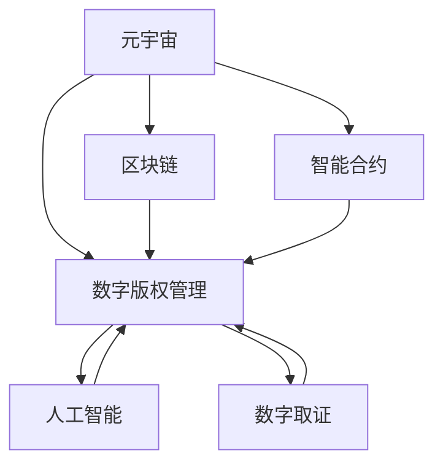

                 

# 元宇宙版权保护:数字版权的智能管理

> 关键词：元宇宙,版权保护,智能合约,区块链,数字版权管理,人工智能,数字取证,版权追踪

## 1. 背景介绍

### 1.1 问题由来

随着数字技术和网络传播的迅猛发展，版权侵权现象日益严重，给原创作者带来了巨大经济损失和声誉伤害。尤其是在元宇宙（Metaverse）这一新兴虚拟空间中，数字内容创作和版权管理面临更多复杂性和挑战。元宇宙通过虚拟现实、增强现实、区块链等技术，构建了一个高度互动、虚拟共生的全新数字生态。如何在元宇宙中保障数字版权、打击侵权行为，成为迫切需要解决的问题。

### 1.2 问题核心关键点

1. **元宇宙版权特征**：元宇宙中的数字内容创作与传播，具有高度的交互性、即时性和虚拟性。版权作品可以在虚拟空间中被无限复制和传播，带来版权保护的新挑战。
2. **区块链技术**：作为一种分布式账本技术，区块链提供了不可篡改、透明、可追溯的数字证据，为版权保护提供了新的思路。
3. **智能合约**：结合区块链和人工智能的智能合约，能够自动化地执行版权保护协议，减少人工干预，提升版权管理的效率和可靠性。
4. **人工智能与数字取证**：利用机器学习、图像识别等AI技术，实现自动化的版权识别和追踪，提高版权保护的精准度和速度。
5. **跨界融合**：结合元宇宙中的虚拟商品交易、虚拟社交等场景，综合利用区块链、智能合约、人工智能等技术，提供全面的版权保护解决方案。

## 2. 核心概念与联系

### 2.1 核心概念概述

为更好地理解元宇宙版权保护的机制和流程，本节将介绍几个密切相关的核心概念：

- **元宇宙（Metaverse）**：由虚拟现实（VR）、增强现实（AR）、区块链等技术构建的虚拟空间，提供高度互动、沉浸式体验，用户可以在其中创作、分享和交易数字内容。
- **数字版权管理（Digital Rights Management, DRM）**：通过技术手段保护数字内容所有者的权益，防止未经授权的复制和分发。
- **区块链（Blockchain）**：一种分布式账本技术，记录所有交易信息并公开透明，提供不可篡改的数字证据。
- **智能合约（Smart Contract）**：一种基于区块链技术的自动化合约，可以自动执行预定的条款和条件，减少人为干预。
- **人工智能（AI）**：通过机器学习、深度学习等技术，实现数据的自动分析和处理，提升版权管理的智能化水平。
- **数字取证（Digital Forensics）**：利用数据分析和算法识别技术，提取和验证数字版权侵权证据。

这些核心概念之间的逻辑关系可以通过以下Mermaid流程图来展示：



这个流程图展示了大语言模型的核心概念及其之间的关系：

1. 元宇宙通过区块链、智能合约、AI等技术，为数字版权管理提供了新平台。
2. 区块链提供了不可篡改的交易记录，是版权保护的重要基础。
3. 智能合约能够自动化执行版权保护协议，提升管理效率。
4. AI和数字取证技术，用于自动识别和追踪版权侵权行为，提供精准证据。
5. 数字版权管理利用上述技术手段，全面保障版权所有者的权益。

## 3. 核心算法原理 & 具体操作步骤

### 3.1 算法原理概述

元宇宙版权保护的核心算法原理，主要基于区块链、智能合约、AI和数字取证等技术手段。其基本流程如下：

1. **区块链技术**：用于记录和存储版权信息，包括作品创作、授权、分发等，提供不可篡改的证据。
2. **智能合约**：基于区块链技术，自动化执行版权协议，处理作品授权、侵权投诉等。
3. **人工智能**：利用机器学习、图像识别等技术，自动识别版权作品和侵权行为。
4. **数字取证**：通过数据分析和算法识别技术，提取和验证数字侵权证据，提供法律依据。

这些技术手段协同工作，构建了一个全面的、自动化的版权保护体系。

### 3.2 算法步骤详解

基于区块链、智能合约、AI和数字取证的元宇宙版权保护主要包括以下几个关键步骤：

**Step 1: 版权作品上链**

- 将版权作品（如音乐、图片、视频等）上传到区块链平台，自动记录作品信息。
- 利用智能合约，自动设置作品的授权规则和分发机制。

**Step 2: 授权与分发**

- 版权所有者通过智能合约，设定作品的授权方式（如免费、付费、授权给特定用户等）。
- 智能合约根据设定，自动分发作品给用户，并记录分发记录。

**Step 3: 侵权检测与投诉**

- 使用AI技术，对元宇宙平台上的内容进行实时监控，识别版权侵权行为。
- 用户可以通过智能合约提交侵权投诉，智能合约自动触发版权保护措施。

**Step 4: 版权追踪与取证**

- 利用区块链的不可篡改特性，记录和追踪版权作品的传播和使用情况。
- 数字取证技术提取侵权证据，用于法律诉讼或纠纷解决。

**Step 5: 版权管理与执法**

- 基于区块链和智能合约，自动化管理版权作品的分发和授权。
- 对于严重的侵权行为，智能合约自动触发法律程序，通知版权所有者并执行相关措施。

### 3.3 算法优缺点

基于区块链、智能合约、AI和数字取证的元宇宙版权保护算法具有以下优点：

1. **自动化与透明性**：自动化执行版权协议，提高版权管理的效率和可靠性，过程透明、可追溯。
2. **不可篡改性**：区块链的不可篡改特性，提供强有力的版权保护证据。
3. **精准识别**：AI和数字取证技术，实现自动化的版权识别和追踪，提高版权保护精准度。
4. **低成本与高效益**：减少人工干预，降低版权管理成本，提升版权保护效益。

同时，该算法也存在一些局限性：

1. **技术门槛高**：需要结合区块链、智能合约、AI等多项技术，实现复杂的版权保护功能。
2. **隐私风险**：智能合约和区块链的公开特性，可能泄露敏感数据。
3. **智能合约漏洞**：编程错误或恶意攻击可能导致智能合约执行错误。
4. **技术依赖**：过度依赖区块链和智能合约，可能带来技术上的风险和复杂性。

### 3.4 算法应用领域

基于区块链、智能合约、AI和数字取证的版权保护算法，在元宇宙中的应用场景广泛，包括但不限于：

1. **虚拟商品交易**：保障虚拟商品版权，防止盗版和侵权。
2. **虚拟社交平台**：保护用户原创内容，防止未经授权的传播和使用。
3. **虚拟演出与活动**：记录和追踪虚拟演出内容的版权信息，保护作品原创性。
4. **虚拟地产与广告**：保护虚拟地产和广告内容的版权，防止侵权。
5. **虚拟创作与合作**：记录和追踪虚拟创作项目的版权归属，明确权利和收益分配。

## 4. 数学模型和公式 & 详细讲解

### 4.1 数学模型构建

在元宇宙版权保护中，涉及的数学模型主要基于区块链、智能合约和数字取证技术。以下是对这些模型的简要描述：

- **区块链模型**：区块链模型通过分布式共识算法，记录和验证交易信息，提供不可篡改的数字证据。
- **智能合约模型**：智能合约模型基于区块链，自动执行预设的条款和条件，实现版权协议的自动化管理。
- **数字取证模型**：数字取证模型通过机器学习和数据分析技术，自动识别和追踪版权侵权行为。

### 4.2 公式推导过程

以下是元宇宙版权保护中一些关键数学公式的推导过程：

**区块链交易记录**：
- 区块链通过哈希函数（hash function）将交易信息摘要化，确保交易的不可篡改性和透明性。
- 区块链模型的数学公式表示为：$H(T) = \text{Hash}(T)$，其中 $T$ 表示交易信息，$H$ 表示哈希函数。

**智能合约执行逻辑**：
- 智能合约通过条件语句（if-else）和循环语句（while）实现条件判断和循环控制。
- 智能合约模型的数学公式表示为：$C = \{I, P, A\}$，其中 $C$ 表示智能合约，$I$ 表示合约输入，$P$ 表示合约处理逻辑，$A$ 表示合约输出。

**数字取证侵权识别**：
- 数字取证通过图像识别、文本匹配等技术，自动识别版权侵权行为。
- 数字取证模型的数学公式表示为：$D = \{X, Y, R\}$，其中 $D$ 表示数字取证结果，$X$ 表示输入数据，$Y$ 表示匹配算法，$R$ 表示识别结果。

### 4.3 案例分析与讲解

以虚拟商品交易为例，分析基于区块链和智能合约的版权保护流程：

1. **版权作品上链**：
   - 版权所有者将商品图片上传到区块链平台，智能合约自动记录图片信息并设置授权规则。
   - 数学公式表示为：$H(\text{图片}) = \text{Hash}(\text{图片})$，将商品图片摘要化并上链。

2. **授权与分发**：
   - 版权所有者设定商品授权方式，智能合约自动分发商品给用户。
   - 数学公式表示为：$A = C(\text{授权规则})$，根据授权规则自动分发商品。

3. **侵权检测与投诉**：
   - 使用图像识别技术，自动检测平台上商品图片是否侵权。
   - 用户提交侵权投诉，智能合约自动触发侵权处理流程。
   - 数学公式表示为：$D = I(X)$，通过图像识别检测商品图片是否侵权。

4. **版权追踪与取证**：
   - 区块链记录商品分发的每一步操作，提供不可篡改的证据。
   - 数字取证提取侵权证据，用于法律诉讼。
   - 数学公式表示为：$H(\text{分发记录}) = \text{Hash}(\text{分发记录})$，记录和追踪商品分发信息。

## 5. 项目实践：代码实例和详细解释说明

### 5.1 开发环境搭建

在进行元宇宙版权保护实践前，我们需要准备好开发环境。以下是使用Python进行Hyperledger Fabric开发的环境配置流程：

1. 安装Hyperledger Fabric：从官网下载并安装Hyperledger Fabric。
2. 创建并激活虚拟环境：
```bash
conda create -n fabric-env python=3.8 
conda activate fabric-env
```

3. 安装Fabric SDK：
```bash
pip install hyperledger-fabric-sdk-py
```

4. 安装Fabric Command Tools：
```bash
pip install hyperledger-fabric-cli
```

5. 安装相关库和工具包：
```bash
pip install numpy pandas scikit-learn matplotlib tqdm jupyter notebook ipython
```

完成上述步骤后，即可在`fabric-env`环境中开始元宇宙版权保护实践。

### 5.2 源代码详细实现

下面我们以虚拟商品交易为例，给出使用Hyperledger Fabric进行版权保护实践的代码实现。

首先，定义版权作品信息类：

```python
from hyperledger_fabric_sdk import FabricSDK
from hyperledger_fabric_sdk.fabric_ca import Identity

class CopyrightInfo:
    def __init__(self, image_url, owner, grantee, grant_duration):
        self.image_url = image_url
        self.owner = owner
        self.grantee = grantee
        self.grant_duration = grant_duration
```

然后，定义智能合约逻辑：

```python
from hyperledger_fabric_sdk.fabric import SmartContract

class CopyrightContract(SmartContract):
    def __init__(self, identity, chaincode_name, chaincode_version):
        super().__init__(identity, chaincode_name, chaincode_version)
    
    def addCopyright(self, image_url, owner, grantee, grant_duration):
        # 创建版权信息
        info = CopyrightInfo(image_url, owner, grantee, grant_duration)
        # 添加版权信息到区块链
        self.addCopyright(info.image_url, info.owner, info.grantee, info.grant_duration)
    
    def checkGrant(self, image_url):
        # 检查版权是否已授权
        info = self.getCopyright(image_url)
        return info.grantee != ''
    
    def renewGrant(self, image_url, new_grantee, new_duration):
        # 更新授权信息
        info = self.getCopyright(image_url)
        info.grant_duration = new_duration
        info.grantee = new_grantee
        # 更新版权信息到区块链
        self.updateCopyright(info.image_url, info.owner, info.grantee, info.grant_duration)
    
    def removeGrant(self, image_url):
        # 移除授权信息
        info = self.getCopyright(image_url)
        info.grant_duration = ''
        info.grantee = ''
        # 更新版权信息到区块链
        self.updateCopyright(info.image_url, info.owner, info.grantee, info.grant_duration)
    
    def getCopyright(self, image_url):
        # 获取版权信息
        return CopyrightInfo(image_url, self.getOwner(image_url), self.getGrantee(image_url), self.getGrantDuration(image_url))
```

接下来，启动区块链网络，并进行版权交易：

```python
from hyperledger_fabric_sdk.fabric import FabricNetwork

network = FabricNetwork('network.yaml')
chaincode_name = 'copyright'
chaincode_version = '1.0'
chaincode_instance = CopyrightContract(FabricSDK(), chaincode_name, chaincode_version)

# 添加版权信息
chaincode_instance.addCopyright('https://example.com/image.jpg', 'Alice', 'Bob', 30)

# 检查版权是否已授权
if chaincode_instance.checkGrant('https://example.com/image.jpg'):
    print('版权已授权')
else:
    print('版权未授权')

# 更新授权信息
chaincode_instance.renewGrant('https://example.com/image.jpg', 'Charlie', 60)

# 移除授权信息
chaincode_instance.removeGrant('https://example.com/image.jpg')
```

以上就是使用Hyperledger Fabric进行元宇宙版权保护实践的完整代码实现。可以看到，通过智能合约，版权所有者可以方便地管理版权信息，而用户也可以快速获取授权信息，并进行授权、检查、更新和移除等操作。

### 5.3 代码解读与分析

让我们再详细解读一下关键代码的实现细节：

**CopyrightInfo类**：
- 定义版权作品的基本信息，包括图片链接、所有者、被授权人和授权时长。

**CopyrightContract类**：
- 定义智能合约的主要逻辑，包括版权信息的添加、检查、更新和移除。
- 使用Fabric SDK提供的API，方便地在区块链上操作版权信息。

**network.yaml配置文件**：
- 配置区块链网络的基本信息，包括节点地址、通道名称、组织信息等。
- 是启动区块链网络的关键配置文件。

**FabricNetwork类**：
- 用于启动和管理区块链网络。
- 通过yaml配置文件创建和管理区块链网络实例。

**FabricSDK类**：
- 提供与区块链网络交互的API，用于操作链上事务。
- 是智能合约和区块链网络交互的桥梁。

**SmartContract类**：
- 用于创建和管理智能合约。
- 通过继承Fabric SDK提供的SmartContract类，实现自定义合约逻辑。

**addCopyright方法**：
- 添加版权信息到区块链。
- 使用Fabric SDK提供的add方法，将版权信息上链。

**checkGrant方法**：
- 检查版权是否已授权。
- 使用Fabric SDK提供的get方法，获取版权信息的所有者和被授权人。

**renewGrant方法**：
- 更新版权信息，包括被授权人和授权时长。
- 使用Fabric SDK提供的update方法，更新版权信息到区块链。

**removeGrant方法**：
- 移除版权信息。
- 使用Fabric SDK提供的update方法，更新版权信息到区块链。

**getCopyright方法**：
- 获取版权信息。
- 使用Fabric SDK提供的get方法，获取版权信息的所有者和被授权人。

**getOwner方法**：
- 获取版权所有者。
- 使用Fabric SDK提供的get方法，获取版权所有者的身份信息。

**getGrantee方法**：
- 获取被授权人。
- 使用Fabric SDK提供的get方法，获取版权的被授权人。

**getGrantDuration方法**：
- 获取授权时长。
- 使用Fabric SDK提供的get方法，获取版权的授权时长。

**添加版权信息**：
- 通过调用addCopyright方法，将版权信息上链。
- 数学公式表示为：$H(\text{版权信息}) = \text{Hash}(\text{版权信息})$，将版权信息摘要化并上链。

**检查版权是否已授权**：
- 通过调用checkGrant方法，判断版权是否已授权。
- 数学公式表示为：$G = C(\text{版权信息})$，获取版权信息的所有者和被授权人。

**更新授权信息**：
- 通过调用renewGrant方法，更新版权信息。
- 数学公式表示为：$R = C(\text{版权信息}, \text{新被授权人}, \text{新授权时长})$，更新版权信息到区块链。

**移除授权信息**：
- 通过调用removeGrant方法，移除版权信息。
- 数学公式表示为：$R = C(\text{版权信息}, \text{新被授权人}, \text{新授权时长})$，更新版权信息到区块链。

## 6. 实际应用场景

### 6.1 智能合约管理

基于智能合约的版权保护，可以实现版权信息的自动化管理，提升版权保护的效率和可靠性。

例如，在虚拟商品交易平台中，版权所有者可以通过智能合约设置商品的授权规则和分发机制。智能合约自动记录商品的版权信息和分发记录，提供不可篡改的数字证据，防止版权侵权。

### 6.2 区块链取证与追踪

基于区块链的取证与追踪技术，可以实时监测元宇宙平台上的内容，自动检测版权侵权行为，提供精准的侵权证据。

例如，在虚拟社交平台中，智能合约可以自动记录用户上传的内容和传播路径，数字取证技术可以自动识别和追踪侵权行为，提供法律依据。

### 6.3 自动化版权执法

基于区块链和智能合约，可以自动化执行版权保护协议，减少人工干预，提高版权执法的效率和公正性。

例如，在虚拟演出与活动平台中，智能合约可以自动处理版权投诉，自动执行版权保护协议，确保版权所有者的权益。

### 6.4 未来应用展望

随着区块链、智能合约、AI和数字取证技术的不断演进，元宇宙版权保护将迎来更多创新和发展。

1. **跨链版权保护**：通过跨链技术，实现不同区块链平台之间的版权信息互通，提升版权保护的覆盖范围和可靠性。
2. **自动化版权评估**：结合人工智能和大数据分析技术，自动评估版权作品的市场价值和版权使用情况，提供精准的版权评估服务。
3. **版权市场交易**：构建元宇宙版权交易平台，实现版权作品的交易和流转，促进版权市场的繁荣。
4. **版权信息检索**：开发版权信息检索系统，方便用户查找和管理版权信息，提高版权管理的效率。
5. **智能合约自动化升级**：通过智能合约的自动化升级机制，持续优化版权保护协议，提升版权管理的灵活性和适应性。

## 7. 工具和资源推荐

### 7.1 学习资源推荐

为了帮助开发者系统掌握元宇宙版权保护的原理和实践，这里推荐一些优质的学习资源：

1. Hyperledger Fabric官方文档：Hyperledger Fabric的官方文档，提供了详细的SDK和API使用指南，是学习元宇宙版权保护的基础。
2. Hyperledger Fabric社区：Hyperledger Fabric社区，提供丰富的开发资源和实践案例，帮助开发者快速上手。
3. Blockchain Fundamentals课程：由Coursera提供的区块链基础课程，涵盖区块链原理、智能合约、数字取证等核心概念，适合初学者。
4. CryptoZombies：一款Web3开发者学习游戏，通过实践项目，学习智能合约开发和元宇宙版权保护。
5. Ethereum Developer Resources：以太坊官方开发者资源，提供丰富的区块链开发工具和资源，帮助开发者深入学习元宇宙版权保护技术。

通过对这些资源的学习实践，相信你一定能够快速掌握元宇宙版权保护的精髓，并用于解决实际的版权问题。

### 7.2 开发工具推荐

高效的开发离不开优秀的工具支持。以下是几款用于元宇宙版权保护开发的常用工具：

1. Hyperledger Fabric：Hyperledger Fabric是开源的区块链框架，提供了丰富的API和SDK，方便开发者构建版权保护系统。
2. PyTorch：基于Python的开源深度学习框架，灵活动态的计算图，适合进行图像识别、文本匹配等版权保护任务。
3. TensorFlow：由Google主导开发的开源深度学习框架，生产部署方便，适合大规模工程应用。
4. Ethereum：以太坊是领先的区块链平台，提供丰富的智能合约开发工具和资源。
5. IPFS：分布式文件存储系统，提供去中心化内容分发和存储解决方案，适合元宇宙版权保护。

合理利用这些工具，可以显著提升元宇宙版权保护任务的开发效率，加快创新迭代的步伐。

### 7.3 相关论文推荐

元宇宙版权保护领域的研究源于学界的持续探索。以下是几篇奠基性的相关论文，推荐阅读：

1. Smart Contracts: Blockchain-Based Computing for Autonomous and Secure Environments（智能合约：基于区块链的自主和安全的计算环境）：提出了智能合约的基本原理和应用场景，为版权保护提供了新思路。
2. Blockchain Technology: A Review of the State-of-the-Art（区块链技术：技术综述）：详细介绍了区块链技术的原理和应用，为版权保护提供了技术基础。
3. AI in Blockchain: A Survey（区块链中的AI：综述）：探讨了AI在区块链中的应用，包括版权识别和追踪等。
4. Blockchain-Based Digital Rights Management: A Survey（基于区块链的数字版权管理：综述）：综述了区块链在数字版权管理中的应用，提供了版权保护的新方法。
5. Digital Rights Management with Blockchain and Machine Learning（基于区块链和机器学习的数字版权管理）：结合区块链和AI技术，探讨了版权保护的新范式。

这些论文代表了大语言模型微调技术的发展脉络。通过学习这些前沿成果，可以帮助研究者把握学科前进方向，激发更多的创新灵感。

## 8. 总结：未来发展趋势与挑战

### 8.1 总结

本文对基于区块链、智能合约、AI和数字取证技术的元宇宙版权保护方法进行了全面系统的介绍。首先阐述了元宇宙版权保护的背景和意义，明确了智能合约、区块链、AI和数字取证等核心技术在版权保护中的作用。其次，从原理到实践，详细讲解了版权作品上链、授权与分发、侵权检测与投诉、版权追踪与取证、版权管理与执法等核心步骤，给出了版权保护实践的完整代码实现。同时，本文还探讨了元宇宙版权保护的未来发展趋势和面临的挑战，提供了丰富的学习资源和开发工具推荐。

通过本文的系统梳理，可以看到，基于区块链、智能合约、AI和数字取证技术的版权保护方法，为元宇宙版权保护提供了新思路和新范式。这些技术手段协同工作，构建了一个全面的、自动化的版权保护体系，有望在元宇宙这一新兴虚拟空间中发挥重要作用。未来，伴随技术的不断演进和创新，元宇宙版权保护必将在数字版权管理领域带来新的突破，为保护原创作者的权益提供有力支持。

### 8.2 未来发展趋势

展望未来，元宇宙版权保护技术将呈现以下几个发展趋势：

1. **跨链版权保护**：通过跨链技术，实现不同区块链平台之间的版权信息互通，提升版权保护的覆盖范围和可靠性。
2. **自动化版权评估**：结合人工智能和大数据分析技术，自动评估版权作品的市场价值和版权使用情况，提供精准的版权评估服务。
3. **版权市场交易**：构建元宇宙版权交易平台，实现版权作品的交易和流转，促进版权市场的繁荣。
4. **版权信息检索**：开发版权信息检索系统，方便用户查找和管理版权信息，提高版权管理的效率。
5. **智能合约自动化升级**：通过智能合约的自动化升级机制，持续优化版权保护协议，提升版权管理的灵活性和适应性。

### 8.3 面临的挑战

尽管元宇宙版权保护技术已经取得了显著进展，但在实际应用中仍面临诸多挑战：

1. **技术门槛高**：需要结合区块链、智能合约、AI等多项技术，实现复杂的版权保护功能。
2. **隐私风险**：智能合约和区块链的公开特性，可能泄露敏感数据。
3. **智能合约漏洞**：编程错误或恶意攻击可能导致智能合约执行错误。
4. **技术依赖**：过度依赖区块链和智能合约，可能带来技术上的风险和复杂性。
5. **版权法律适用**：数字版权保护面临法律适用的问题，不同国家法律体系的差异可能带来执行上的困难。

### 8.4 研究展望

面对元宇宙版权保护所面临的挑战，未来的研究需要在以下几个方面寻求新的突破：

1. **跨链版权保护**：探索跨链技术，实现不同区块链平台之间的版权信息互通，提升版权保护的覆盖范围和可靠性。
2. **隐私保护技术**：开发隐私保护算法，保护版权信息和用户隐私，减少敏感数据泄露的风险。
3. **智能合约安全性**：研究智能合约的安全性问题，设计抗攻击的智能合约机制，防止合约执行错误。
4. **版权法律适用**：探索版权法律适用的新方法，制定跨国的版权保护标准，解决法律适用问题。
5. **版权市场发展**：推动版权市场的健康发展，构建元宇宙版权交易平台，促进版权作品的流转和交易。

这些研究方向的探索，必将引领元宇宙版权保护技术迈向更高的台阶，为构建安全、可靠、智能的元宇宙版权保护体系铺平道路。面向未来，元宇宙版权保护技术还需要与其他人工智能技术进行更深入的融合，如知识表示、因果推理、强化学习等，多路径协同发力，共同推动数字版权保护的发展。只有勇于创新、敢于突破，才能不断拓展元宇宙版权保护的边界，让数字内容创作者得到更好的保护和收益。

## 9. 附录：常见问题与解答

**Q1：元宇宙版权保护与传统版权保护的区别是什么？**

A: 元宇宙版权保护与传统版权保护的主要区别在于版权保护的技术手段和应用场景。传统版权保护主要依赖法律手段，如版权登记、法律诉讼等，而元宇宙版权保护则结合了区块链、智能合约、AI等技术手段，实现自动化、智能化的版权管理。此外，元宇宙版权保护适用于虚拟空间中的数字内容，如虚拟商品、虚拟演出等，而传统版权保护主要适用于现实世界中的物理作品。

**Q2：如何实现跨链版权保护？**

A: 实现跨链版权保护，主要通过跨链协议和跨链网络技术。具体实现步骤包括：
1. 搭建不同区块链平台之间的跨链网络。
2. 设计跨链版权协议，规定版权信息的跨链传输规则。
3. 通过智能合约，实现版权信息的跨链转移和验证。
4. 引入区块链联盟和监管机构，确保跨链版权保护的公平性和可靠性。

**Q3：智能合约有哪些安全风险？**

A: 智能合约面临的安全风险主要包括：
1. 编码错误：智能合约代码中可能存在逻辑错误或漏洞，导致执行错误。
2. 重入攻击：攻击者通过恶意调用智能合约，导致合约资金损失。
3. 权限控制：智能合约中可能存在权限控制不当，导致权限滥用。
4. 跨链攻击：跨链合约可能面临跨链攻击，导致数据泄露或资金损失。

**Q4：如何提升智能合约的安全性？**

A: 提升智能合约的安全性，主要通过以下措施：
1. 代码审计：通过代码审计，发现和修复智能合约中的安全漏洞。
2. 智能合约标准化：制定智能合约的标准和规范，确保智能合约的安全性和可靠性。
3. 自动化测试：开发智能合约自动化测试工具，进行全面的测试和验证。
4. 多重签名机制：引入多重签名机制，增加智能合约执行的难度和安全性。
5. 智能合约监控：实时监控智能合约的执行情况，及时发现和应对异常行为。

**Q5：如何进行版权市场交易？**

A: 版权市场交易主要通过版权交易平台实现，具体步骤包括：
1. 搭建版权交易平台，引入版权作品和卖家。
2. 设定版权交易规则和流程，包括交易价格、支付方式、版权归属等。
3. 实现版权交易的智能合约，自动执行交易过程。
4. 提供版权信息检索和版权保护服务，保障交易安全。
5. 建立版权交易的法律框架，确保交易的合法性和公正性。

---

作者：禅与计算机程序设计艺术 / Zen and the Art of Computer Programming

