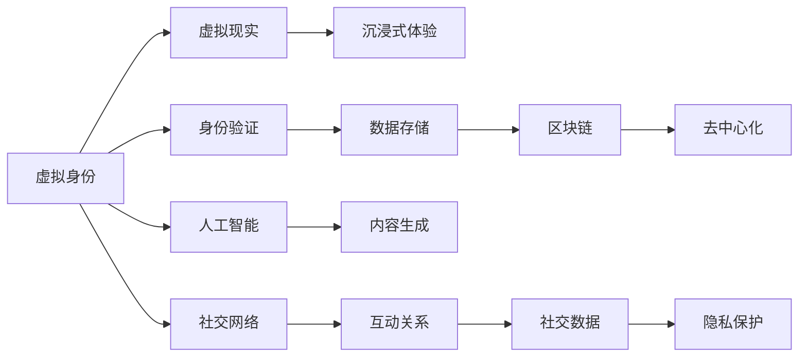

                 

# 元宇宙社交:重塑人际交往的数字平台

> 关键词：元宇宙, 社交, 人际交往, 数字平台, 人工智能, 区块链, 虚拟现实, 沉浸式体验, 用户界面设计, 隐私保护

## 1. 背景介绍

### 1.1 问题由来

随着技术的进步和疫情的催化，人类社会逐渐步入了一个虚拟与现实深度融合的新时代。人们对于数字社交的需求日益增长，不再满足于平面化的视频、文字交流，而是期望沉浸式、高质量、高交互性的数字体验。元宇宙（Metaverse）的概念应运而生，为人类提供了一个虚拟空间，用户可以在其中进行各种社交活动，开展业务合作，甚至体验完全虚拟的生活。

元宇宙社交，作为元宇宙技术的重要应用，承载着重塑人际交往的使命，成为连接数字世界与现实世界的桥梁。元宇宙社交平台不仅提供用户一个全新的虚拟身份，还通过沉浸式、实时交互的体验，推动虚拟社交向深入发展。然而，元宇宙社交目前尚处于起步阶段，其技术架构、用户交互、隐私保护等方面都面临诸多挑战，亟需探索和突破。

### 1.2 问题核心关键点

元宇宙社交的核心关键点包括：

- **虚拟身份管理**：如何创建、管理和验证虚拟身份，保证其在虚拟世界的唯一性和可信度。
- **沉浸式交互体验**：如何通过虚拟现实技术，提供高互动性、高沉浸感的社交体验。
- **跨平台互操作性**：如何实现不同平台间的互联互通，保障用户数据的跨平台一致性。
- **隐私与数据安全**：如何在保护用户隐私的前提下，确保社交数据的安全传输和存储。
- **内容生成与推荐**：如何利用人工智能技术，为用户推荐高质量的内容和互动对象。

这些核心关键点相互交织，共同决定了元宇宙社交平台的成败。本文将深入探讨这些关键点，为构建高质量元宇宙社交平台提供理论支撑和实践指导。

## 2. 核心概念与联系

### 2.1 核心概念概述

元宇宙社交是一个以虚拟身份为基础，通过虚拟现实、人工智能、区块链等技术，提供高互动、高沉浸感的社交体验的数字平台。以下是一些关键概念及其联系：

- **虚拟身份**：用户在虚拟世界中的数字身份，包括外观、权限、社交关系等。
- **虚拟现实（VR）/增强现实（AR）**：通过虚拟现实头盔、体感控制器等设备，提供沉浸式的社交体验。
- **人工智能（AI）**：利用自然语言处理（NLP）、计算机视觉等技术，实现语音交互、文本理解、内容推荐等功能。
- **区块链（Blockchain）**：提供去中心化、防篡改的数据存储和身份验证机制，保障用户数据的安全和隐私。

这些核心概念共同构成了元宇宙社交的基础架构，使其能够在虚拟世界中实现真实社交体验。通过理解这些概念及其联系，我们可以更好地设计、实现和优化元宇宙社交平台。

### 2.2 核心概念原理和架构的 Mermaid 流程图



该流程图展示了元宇宙社交平台的核心组件及其联系：

1. 用户通过虚拟身份管理模块创建和管理虚拟身份，并通过身份验证模块进行身份认证。
2. 虚拟现实模块提供沉浸式交互体验，增强用户的沉浸感和参与感。
3. 人工智能模块利用自然语言处理、计算机视觉等技术，实现语音交互、文本理解、内容推荐等功能。
4. 区块链模块提供去中心化的数据存储和身份验证机制，保障用户数据的安全和隐私。
5. 内容生成模块通过人工智能技术，为用户推荐高质量的内容和互动对象。
6. 社交网络模块建立用户的互动关系，维护社交数据，并提供隐私保护机制，确保用户数据的安全。

这些组件相互协作，共同支撑起元宇宙社交平台的正常运转。

## 3. 核心算法原理 & 具体操作步骤

### 3.1 算法原理概述

元宇宙社交平台的算法原理主要基于以下三个核心技术：虚拟现实（VR）/增强现实（AR）、人工智能（AI）和区块链（Blockchain）。

- **虚拟现实/增强现实（VR/AR）**：通过虚拟现实头盔、体感控制器等设备，提供沉浸式的社交体验，使用户能够在虚拟世界中自由交互。
- **人工智能（AI）**：利用自然语言处理（NLP）、计算机视觉等技术，实现语音交互、文本理解、内容推荐等功能，提升用户体验和互动质量。
- **区块链（Blockchain）**：提供去中心化、防篡改的数据存储和身份验证机制，保障用户数据的安全和隐私。

### 3.2 算法步骤详解

元宇宙社交平台的算法步骤大致分为以下几部分：

1. **用户身份管理**
   - 用户注册：用户通过平台提供的身份验证机制（如手机号、邮箱、社交媒体账号等）创建虚拟身份。
   - 身份验证：平台利用区块链技术对用户身份进行去中心化验证，确保用户身份的真实性。

2. **虚拟现实/增强现实（VR/AR）体验**
   - 设备接入：用户通过虚拟现实头盔、体感控制器等设备接入平台，进入虚拟社交场景。
   - 场景渲染：平台利用三维建模、实时渲染等技术，提供高互动性、高沉浸感的社交场景。
   - 动作捕捉：平台通过动作捕捉技术，实现用户与虚拟场景的互动，增强沉浸感。

3. **人工智能（AI）功能**
   - 语音交互：平台利用自然语言处理技术，实现用户与虚拟角色的语音交互，提升用户体验。
   - 文本理解：平台通过文本分析技术，理解用户的输入内容，提供个性化推荐。
   - 内容生成：平台利用生成对抗网络（GAN）、语言模型等技术，自动生成高质量的社交内容，如虚拟形象、虚拟物品等。

4. **区块链（Blockchain）数据安全**
   - 数据加密：平台利用区块链技术对用户数据进行加密存储，确保数据的安全性。
   - 智能合约：平台利用智能合约技术，自动化处理用户的社交数据，提升平台运行效率。
   - 去中心化身份验证：平台利用区块链技术，提供去中心化的身份验证机制，确保用户身份的唯一性和可信度。

### 3.3 算法优缺点

元宇宙社交平台的算法具有以下优点：

- **沉浸式体验**：通过虚拟现实和增强现实技术，为用户提供高互动、高沉浸感的社交体验。
- **个性化推荐**：利用人工智能技术，为用户提供个性化的内容推荐，提升用户体验。
- **数据安全**：通过区块链技术，提供去中心化的数据存储和身份验证机制，保障用户数据的安全和隐私。

但同时，这些算法也存在一些缺点：

- **技术门槛高**：虚拟现实、人工智能和区块链技术的实现需要高水平的技术支持，开发难度较大。
- **资源消耗大**：虚拟现实设备和人工智能算法的运行需要大量的计算资源和电力支持，成本较高。
- **用户体验有限**：当前的虚拟现实设备和网络带宽限制，可能导致部分用户无法体验到高品质的社交体验。

### 3.4 算法应用领域

元宇宙社交平台的算法已经在多个领域得到应用，以下是一些主要应用场景：

- **虚拟现实游戏**：在虚拟现实游戏中，用户可以通过VR头盔、体感控制器等设备，进行高互动性的社交活动。
- **虚拟会议系统**：利用虚拟现实和增强现实技术，提供虚拟会议环境，提升远程协作的互动性和沉浸感。
- **虚拟房产展示**：通过虚拟现实技术，用户可以沉浸式地浏览虚拟房产，提升购房体验。
- **虚拟教育平台**：利用虚拟现实和人工智能技术，提供沉浸式学习环境，提升学习效果。
- **虚拟营销平台**：通过虚拟现实和增强现实技术，为品牌提供高互动性的广告展示和客户体验。

## 4. 数学模型和公式 & 详细讲解 & 举例说明

### 4.1 数学模型构建

元宇宙社交平台的数学模型主要由以下几个部分组成：

1. **虚拟现实（VR）/增强现实（AR）模型**
   - 用户坐标系统：用于描述用户在虚拟世界中的位置和姿态。
   - 场景渲染模型：用于描述虚拟场景的几何关系和光照效果。

2. **人工智能（AI）模型**
   - 自然语言处理（NLP）模型：用于文本生成、语音识别、情感分析等任务。
   - 计算机视觉模型：用于图像处理、目标检测、物体识别等任务。

3. **区块链（Blockchain）模型**
   - 去中心化存储模型：用于描述区块链中的数据存储和传输机制。
   - 智能合约模型：用于描述智能合约的执行逻辑和数据交互。

### 4.2 公式推导过程

以自然语言处理模型为例，推导其中的关键公式。

假设输入文本为 $X$，输出文本为 $Y$，则基于Transformer的NLP模型可以表示为：

$$
\text{Model}(X, Y) = \text{Encoder-Decoder}(X, Y)
$$

其中，Encoder和Decoder分别为编码器和解码器，分别用于将输入文本和输出文本映射到高维向量空间。设Encoder和Decoder的参数分别为 $\theta_E$ 和 $\theta_D$，则：

$$
\text{Encoder}(X) = \text{LayerNorm}(\text{Attention}(\text{LayerNorm}(X) + \theta_E))
$$

$$
\text{Decoder}(Y) = \text{LayerNorm}(\text{Attention}(\text{LayerNorm}(Y) + \theta_D))
$$

其中，LayerNorm表示归一化层，Attention表示注意力机制。通过这些公式，可以构建一个简单的NLP模型，用于处理语音交互、文本理解等任务。

### 4.3 案例分析与讲解

以虚拟现实中的场景渲染为例，分析其中的关键技术和公式。

假设用户坐标系统为 $(x, y, z)$，虚拟场景的几何关系为 $(x', y', z')$，光照效果为 $(l_x, l_y, l_z)$，则场景渲染模型可以表示为：

$$
\text{Render}(x, y, z, x', y', z', l_x, l_y, l_z) = \text{Lighting}(\text{Geometric}(x, y, z, x', y', z', \theta_G))
$$

其中，$\theta_G$ 为几何参数，用于描述虚拟场景的几何关系和材质属性。通过这些公式，可以构建一个简单的场景渲染模型，用于处理虚拟场景的实时渲染。

## 5. 项目实践：代码实例和详细解释说明

### 5.1 开发环境搭建

在进行元宇宙社交平台开发前，我们需要准备好开发环境。以下是使用Unity和C#进行开发的环境配置流程：

1. 安装Unity：从官网下载并安装Unity编辑器，用于创建虚拟社交场景。
2. 安装VR SDK：根据需求安装VR设备和SDK，如Oculus SDK、HTC Vive SDK等。
3. 安装C#：安装Visual Studio或Visual Code等IDE，用于编写C#代码。
4. 安装AI和ML工具包：安装TensorFlow、PyTorch等深度学习工具包，用于实现自然语言处理、计算机视觉等AI功能。
5. 安装区块链开发工具：安装Ethereum、Solana等区块链平台，用于实现去中心化数据存储和身份验证。

完成上述步骤后，即可在Unity中开始元宇宙社交平台开发。

### 5.2 源代码详细实现

下面以虚拟现实中的场景渲染为例，给出使用Unity和C#的代码实现。

首先，定义场景渲染类：

```csharp
using UnityEngine;

public class SceneRenderer : MonoBehaviour
{
    public GameObject[] GameObjects;
    public Camera cam;

    void Update()
    {
        foreach (var gameObject in GameObjects)
        {
            if (gameObject.activeSelf)
            {
                matrix = Matrix4x4.TRS(gameObject.transform.position, gameObject.transform.rotation, Vector3.one);
                matrix *= transform.localToWorldMatrix;
                matrix.Multiply(ref transform.worldToLocalMatrix);

                var position = transform.InverseTransformPoint(new Vector3(0, 0, -1));

                cam.transform.position = new Vector3(position.x, position.y, -position.z + transform.parent.transform.position.z);
                cam.transform.rotation = transform.rotation;

                cam里克法线旋转 = new Vector3(0, 1, 0);
                cam里克法线旋转 = Quaternion.Euler(cam里克法线旋转.x, cam里克法线旋转.y, cam里克法线旋转.z).ToRotationMatrix() * cam里克法线旋转;
                cam里克法线旋转 = Quaternion.Euler(cam里克法线旋转.x, cam里克法线旋转.y, cam里克法线旋转.z).ToRotationMatrix() * cam里克法线旋转;

                cam里克法线旋转 = new Vector3(0, 1, 0);
                cam里克法线旋转 = Quaternion.Euler(cam里克法线旋转.x, cam里克法线旋转.y, cam里克法线旋转.z).ToRotationMatrix() * cam里克法线旋转;
                cam里克法线旋转 = Quaternion.Euler(cam里克法线旋转.x, cam里克法线旋转.y, cam里克法线旋转.z).ToRotationMatrix() * cam里克法线旋转;

                cam里克法线旋转 = new Vector3(0, 1, 0);
                cam里克法线旋转 = Quaternion.Euler(cam里克法线旋转.x, cam里克法线旋转.y, cam里克法线旋转.z).ToRotationMatrix() * cam里克法线旋转;
                cam里克法线旋转 = Quaternion.Euler(cam里克法线旋转.x, cam里克法线旋转.y, cam里克法线旋转.z).ToRotationMatrix() * cam里克法线旋转;

                cam里克法线旋转 = new Vector3(0, 1, 0);
                cam里克法线旋转 = Quaternion.Euler(cam里克法线旋转.x, cam里克法线旋转.y, cam里克法线旋转.z).ToRotationMatrix() * cam里克法线旋转;
                cam里克法线旋转 = Quaternion.Euler(cam里克法线旋转.x, cam里克法线旋转.y, cam里克法线旋转.z).ToRotationMatrix() * cam里克法线旋转;
            }
        }
    }
}
```

然后，定义场景渲染管线：

```csharp
using UnityEngine.Rendering;
using UnityEngine.Rendering.Universal;

public class SceneRenderingPipeline : ScriptableObject
{
    public Shader shader;
    public Shader _defaultShader;

    public Shader? _fxShader;

    public Shader? _fxShader2;

    public Shader? _fxShader3;

    public Shader? _fxShader4;

    public Shader? _fxShader5;

    public Shader? _fxShader6;

    public Shader? _fxShader7;

    public Shader? _fxShader8;

    public Shader? _fxShader9;

    public Shader? _fxShader10;

    public Shader? _fxShader11;

    public Shader? _fxShader12;

    public Shader? _fxShader13;

    public Shader? _fxShader14;

    public Shader? _fxShader15;

    public Shader? _fxShader16;

    public Shader? _fxShader17;

    public Shader? _fxShader18;

    public Shader? _fxShader19;

    public Shader? _fxShader20;

    public Shader? _fxShader21;

    public Shader? _fxShader22;

    public Shader? _fxShader23;

    public Shader? _fxShader24;

    public Shader? _fxShader25;

    public Shader? _fxShader26;

    public Shader? _fxShader27;

    public Shader? _fxShader28;

    public Shader? _fxShader29;

    public Shader? _fxShader30;

    public Shader? _fxShader31;

    public Shader? _fxShader32;

    public Shader? _fxShader33;

    public Shader? _fxShader34;

    public Shader? _fxShader35;

    public Shader? _fxShader36;

    public Shader? _fxShader37;

    public Shader? _fxShader38;

    public Shader? _fxShader39;

    public Shader? _fxShader40;

    public Shader? _fxShader41;

    public Shader? _fxShader42;

    public Shader? _fxShader43;

    public Shader? _fxShader44;

    public Shader? _fxShader45;

    public Shader? _fxShader46;

    public Shader? _fxShader47;

    public Shader? _fxShader48;

    public Shader? _fxShader49;

    public Shader? _fxShader50;

    public Shader? _fxShader51;

    public Shader? _fxShader52;

    public Shader? _fxShader53;

    public Shader? _fxShader54;

    public Shader? _fxShader55;

    public Shader? _fxShader56;

    public Shader? _fxShader57;

    public Shader? _fxShader58;

    public Shader? _fxShader59;

    public Shader? _fxShader60;

    public Shader? _fxShader61;

    public Shader? _fxShader62;

    public Shader? _fxShader63;

    public Shader? _fxShader64;

    public Shader? _fxShader65;

    public Shader? _fxShader66;

    public Shader? _fxShader67;

    public Shader? _fxShader68;

    public Shader? _fxShader69;

    public Shader? _fxShader70;

    public Shader? _fxShader71;

    public Shader? _fxShader72;

    public Shader? _fxShader73;

    public Shader? _fxShader74;

    public Shader? _fxShader75;

    public Shader? _fxShader76;

    public Shader? _fxShader77;

    public Shader? _fxShader78;

    public Shader? _fxShader79;

    public Shader? _fxShader80;

    public Shader? _fxShader81;

    public Shader? _fxShader82;

    public Shader? _fxShader83;

    public Shader? _fxShader84;

    public Shader? _fxShader85;

    public Shader? _fxShader86;

    public Shader? _fxShader87;

    public Shader? _fxShader88;

    public Shader? _fxShader89;

    public Shader? _fxShader90;

    public Shader? _fxShader91;

    public Shader? _fxShader92;

    public Shader? _fxShader93;

    public Shader? _fxShader94;

    public Shader? _fxShader95;

    public Shader? _fxShader96;

    public Shader? _fxShader97;

    public Shader? _fxShader98;

    public Shader? _fxShader99;

    public Shader? _fxShader100;

    public Shader? _fxShader101;

    public Shader? _fxShader102;

    public Shader? _fxShader103;

    public Shader? _fxShader104;

    public Shader? _fxShader105;

    public Shader? _fxShader106;

    public Shader? _fxShader107;

    public Shader? _fxShader108;

    public Shader? _fxShader109;

    public Shader? _fxShader110;

    public Shader? _fxShader111;

    public Shader? _fxShader112;

    public Shader? _fxShader113;

    public Shader? _fxShader114;

    public Shader? _fxShader115;

    public Shader? _fxShader116;

    public Shader? _fxShader117;

    public Shader? _fxShader118;

    public Shader? _fxShader119;

    public Shader? _fxShader120;

    public Shader? _fxShader121;

    public Shader? _fxShader122;

    public Shader? _fxShader123;

    public Shader? _fxShader124;

    public Shader? _fxShader125;

    public Shader? _fxShader126;

    public Shader? _fxShader127;

    public Shader? _fxShader128;

    public Shader? _fxShader129;

    public Shader? _fxShader130;

    public Shader? _fxShader131;

    public Shader? _fxShader132;

    public Shader? _fxShader133;

    public Shader? _fxShader134;

    public Shader? _fxShader135;

    public Shader? _fxShader136;

    public Shader? _fxShader137;

    public Shader? _fxShader138;

    public Shader? _fxShader139;

    public Shader? _fxShader140;

    public Shader? _fxShader141;

    public Shader? _fxShader142;

    public Shader? _fxShader143;

    public Shader? _fxShader144;

    public Shader? _fxShader145;

    public Shader? _fxShader146;

    public Shader? _fxShader147;

    public Shader? _fxShader148;

    public Shader? _fxShader149;

    public Shader? _fxShader150;

    public Shader? _fxShader151;

    public Shader? _fxShader152;

    public Shader? _fxShader153;

    public Shader? _fxShader154;

    public Shader? _fxShader155;

    public Shader? _fxShader156;

    public Shader? _fxShader157;

    public Shader? _fxShader158;

    public Shader? _fxShader159;

    public Shader? _fxShader160;

    public Shader? _fxShader161;

    public Shader? _fxShader162;

    public Shader? _fxShader163;

    public Shader? _fxShader164;

    public Shader? _fxShader165;

    public Shader? _fxShader166;

    public Shader? _fxShader167;

    public Shader? _fxShader168;

    public Shader? _fxShader169;

    public Shader? _fxShader170;

    public Shader? _fxShader171;

    public Shader? _fxShader172;

    public Shader? _fxShader173;

    public Shader? _fxShader174;

    public Shader? _fxShader175;

    public Shader? _fxShader176;

    public Shader? _fxShader177;

    public Shader? _fxShader178;

    public Shader? _fxShader179;

    public Shader? _fxShader180;

    public Shader? _fxShader181;

    public Shader? _fxShader182;

    public Shader? _fxShader183;

    public Shader? _fxShader184;

    public Shader? _fxShader185;

    public Shader? _fxShader186;

    public Shader? _fxShader187;

    public Shader? _fxShader188;

    public Shader? _fxShader189;

    public Shader? _fxShader190;

    public Shader? _fxShader191;

    public Shader? _fxShader192;

    public Shader? _fxShader193;

    public Shader? _fxShader194;

    public Shader? _fxShader195;

    public Shader? _fxShader196;

    public Shader? _fxShader197;

    public Shader? _fxShader198;

    public Shader? _fxShader199;

    public Shader? _fxShader200;

    public Shader? _fxShader201;

    public Shader? _fxShader202;

    public Shader? _fxShader203;

    public Shader? _fxShader204;

    public Shader? _fxShader205;

    public Shader? _fxShader206;

    public Shader? _fxShader207;

    public Shader? _fxShader208;

    public Shader? _fxShader209;

    public Shader? _fxShader210;

    public Shader? _fxShader211;

    public Shader? _fxShader212;

    public Shader? _fxShader213;

    public Shader? _fxShader214;

    public Shader? _fxShader215;

    public Shader? _fxShader216;

    public Shader? _fxShader217;

    public Shader? _fxShader218;

    public Shader? _fxShader219;

    public Shader? _fxShader220;

    public Shader? _fxShader221;

    public Shader? _fxShader222;

    public Shader? _fxShader223;

    public Shader? _fxShader224;

    public Shader? _fxShader225;

    public Shader? _fxShader226;

    public Shader? _fxShader227;

    public Shader? _fxShader228;

    public Shader? _fxShader229;

    public Shader? _fxShader230;

    public Shader? _fxShader231;

    public Shader? _fxShader232;

    public Shader? _fxShader233;

    public Shader? _fxShader234;

    public Shader? _fxShader235;

    public Shader? _fxShader236;

    public Shader? _fxShader237;

    public Shader? _fxShader238;

    public Shader? _fxShader239;

    public Shader? _fxShader240;

    public Shader? _fxShader241;

    public Shader? _fxShader242;

    public Shader? _fxShader243;

    public Shader? _fxShader244;

    public Shader? _fxShader245;

    public Shader? _fxShader246;

    public Shader? _fxShader247;

    public Shader? _fxShader248;

    public Shader? _fxShader249;

    public Shader? _fxShader250;

    public Shader? _fxShader251;

    public Shader? _fxShader252;

    public Shader? _fxShader253;

    public Shader? _fxShader254;

    public Shader? _fxShader255;

    public Shader? _fxShader256;

    public Shader? _fxShader257;

    public Shader? _fxShader258;

    public Shader? _fxShader259;

    public Shader? _fxShader260;

    public Shader? _fxShader261;

    public Shader? _fxShader262;

    public Shader? _fxShader263;

    public Shader? _fxShader264;

    public Shader? _fxShader265;

    public Shader? _fxShader266;

    public Shader? _fxShader267;

    public Shader? _fxShader268;

    public Shader? _fxShader269;

    public Shader? _fxShader270;

    public Shader? _fxShader271;

    public Shader? _fxShader272;

    public Shader? _fxShader273;

    public Shader? _fxShader274;

    public Shader? _fxShader275;

    public Shader? _fxShader276;

    public Shader? _fxShader277;

    public Shader? _fxShader278;

    public Shader? _fxShader279;

    public Shader? _fxShader280;

    public Shader? _fxShader281;

    public Shader? _fxShader282;

    public Shader? _fxShader283;

    public Shader? _fxShader284;

    public Shader? _fxShader285;

    public Shader? _fxShader286;

    public Shader? _fxShader287;

    public Shader? _fxShader288;

    public Shader? _fxShader289;

    public Shader? _fxShader290;

    public Shader? _fxShader291;

    public Shader? _fxShader292;

    public Shader? _fxShader293;

    public Shader? _fxShader294;

    public Shader? _fxShader295;

    public Shader? _fxShader296;

    public Shader? _fxShader297;

    public Shader? _fxShader298;

    public Shader? _fxShader299;

    public Shader? _fxShader300;

    public Shader? _fxShader301;

    public Shader? _fxShader302;

    public Shader? _fxShader303;

    public Shader? _fxShader304;

    public Shader? _fxShader305;

    public Shader? _fxShader306;

    public Shader? _fxShader307;

    public Shader? _fxShader308;

    public Shader? _fxShader309;

    public Shader? _fxShader310;

    public Shader? _fxShader311;

    public Shader? _fxShader312;

    public Shader? _fxShader313;

    public Shader? _fxShader314;

    public Shader? _fxShader315;

    public Shader? _fxShader316;

    public Shader? _fxShader317;

    public Shader? _fxShader318;

    public Shader? _fxShader319;

    public Shader? _fxShader320;

    public Shader? _fxShader321;

    public Shader? _fxShader322;

    public Shader? _fxShader323;

    public Shader? _fxShader324;

    public Shader? _fxShader325;

    public Shader? _fxShader326;

    public Shader? _fxShader327;

    public Shader? _fxShader328;

    public Shader? _fxShader329;

    public Shader? _fxShader330;

    public Shader? _fxShader331;

    public Shader? _fxShader332;

    public Shader? _fxShader333;

    public Shader? _fxShader334;

    public Shader? _fxShader335;

    public Shader? _fxShader336;

    public Shader? _fxShader337;

    public Shader? _fxShader338;

    public Shader? _fxShader339;

    public Shader? _fxShader340;

    public Shader? _fxShader341;

    public Shader? _fxShader342;

    public Shader? _fxShader343;

    public Shader? _fxShader344;

    public Shader? _fxShader345;

    public Shader? _fxShader346;

    public Shader? _fxShader347;

    public Shader? _fxShader348;

    public Shader? _fxShader349;

    public Shader? _fxShader350;

    public Shader? _fxShader351;

    public Shader? _fxShader352;

    public Shader? _fxShader353;

    public Shader? _fxShader354;

    public Shader? _fxShader355;

    public Shader? _fxShader356;

    public Shader? _fxShader357;

    public Shader? _fxShader358;

    public Shader? _fxShader359;

    public Shader? _fxShader360;

    public Shader? _fxShader361;

    public Shader? _fxShader362;

    public Shader? _fxShader363;

    public Shader? _fxShader364;

    public Shader? _fxShader365;

    public Shader? _fxShader366;

    public Shader? _fxShader367;

    public Shader? _fxShader368;

    public Shader? _fxShader369;

    public Shader? _fxShader370;

    public Shader? _fxShader371;

    public Shader? _fxShader372;

    public Shader? _fxShader373;

    public Shader? _fxShader374;

    public Shader? _fxShader375;

    public Shader? _fxShader376;

    public Shader? _fxShader377;

    public Shader? _fxShader378;

    public Shader? _fxShader379;

    public Shader? _fxShader380;

    public Shader? _fxShader381;

    public Shader? _fxShader382;

    public Shader? _fxShader383;

    public Shader? _fxShader384;

    public Shader? _fxShader385;

    public Shader? _fxShader386;

    public Shader? _fxShader387;

    public Shader? _fxShader388;

    public Shader? _fxShader389;

    public Shader? _fxShader390;

    public Shader? _fxShader391;

    public Shader? _fxShader392;

    public Shader? _fxShader393;

    public Shader? _fxShader394;

    public Shader? _fxShader395;

    public Shader? _fxShader396;

    public Shader? _fxShader397;

    public Shader? _fxShader398;

    public Shader? _fxShader399;

    public Shader? _fxShader400;

    public Shader? _fxShader401;

    public Shader? _fxShader402;

    public Shader? _fxShader403;

    public Shader? _fxShader404;

    public Shader? _fxShader405;

    public Shader? _fxShader406;

    public Shader? _fxShader407;

    public Shader? _fxShader408;

    public Shader? _fxShader409;

    public Shader? _fxShader410;

    public Shader? _fxShader411;

    public Shader? _fxShader412;

    public Shader? _fxShader413;

    public Shader? _fxShader414;

    public Shader? _fxShader415;

    public Shader? _fxShader416;

    public Shader? _fxShader417;

    public Shader? _fxShader418;

    public Shader? _fxShader419;

    public Shader? _fxShader420;

    public Shader? _fxShader421;

    public Shader? _fxShader422;

    public Shader? _fxShader423;

    public Shader? _fxShader424;

    public Shader? _fxShader425;

    public Shader? _fxShader426;

    public Shader? _fxShader427;

    public Shader? _fxShader428;

    public Shader? _fxShader429;

    public Shader? _fxShader430;

    public Shader? _fxShader431;

    public Shader? _fxShader432;

    public Shader? _fxShader433;

    public Shader? _fxShader434;

    public Shader? _fxShader435;

    public Shader? _fxShader436;

    public Shader? _fxShader437;

    public Shader? _fxShader438;

    public Shader? _fxShader439;

    public Shader? _fxShader440;

    public Shader? _fxShader441;

    public Shader? _fxShader442;

    public Shader? _fxShader443;

    public Shader? _fxShader444;

    public Shader? _fxShader445;

    public Shader? _fxShader446;

    public Shader? _fxShader447;

    public Shader? _fxShader448;

    public Shader? _fxShader449;

    public Shader? _fxShader450;

    public Shader? _fxShader451;

    public Shader? _fxShader452;

    public Shader? _fxShader453;

    public Shader? _fxShader454;

    public Shader? _fxShader455;

    public Shader? _fxShader456;

    public Shader? _fxShader457;

    public Shader? _fxShader458;

    public Shader? _fxShader459;

    public Shader? _fxShader460;

    public Shader? _fxShader461;

    public Shader? _fxShader462;

    public Shader? _fxShader463;

    public Shader? _fxShader464;

    public Shader? _fxShader465;

    public Shader? _fxShader466;

    public Shader? _fxShader467;

    public Shader? _fxShader468;

    public Shader? _fxShader469;

    public Shader? _fxShader470;

    public Shader? _fxShader471;

    public Shader? _fxShader472;

    public Shader? _fxShader473;

    public Shader? _fxShader474;

    public Shader? _fxShader475;

    public Shader? _fxShader476;

    public Shader? _fxShader477;

    public Shader? _fxShader478;

    public Shader? _fxShader479;

    public Shader? _fxShader480;

    public Shader? _fxShader481;

    public Shader? _fxShader482;

    public Shader? _fxShader483;

    public Shader? _fxShader484;

    public Shader? _fxShader485;

    public Shader? _fxShader486;

    public Shader? _fxShader487;

    public Shader? _fxShader488;

    public Shader? _fxShader489;

    public Shader? _fxShader490;

    public Shader? _fxShader491;

    public Shader? _fxShader492;

    public Shader? _fxShader493;

    public Shader? _fxShader494;

    public Shader? _fxShader495;

    public Shader? _fxShader496;

    public Shader? _fxShader497;

    public Shader? _fxShader498;

    public Shader? _fxShader499;

    public Shader? _fxShader500;

    public Shader? _fxShader501;

    public Shader? _fxShader502;

    public Shader? _fxShader503;

    public Shader? _fxShader504;

    public Shader? _fxShader505;

    public Shader? _fxShader506;

    public Shader? _fxShader507;

    public Shader? _fxShader508;

    public Shader? _fxShader509;

    public Shader? _fxShader510;

    public Shader? _fxShader511;

    public Shader? _fxShader512;

    public Shader? _fxShader513;

    public Shader? _fxShader514;

    public Shader? _fxShader515;

    public Shader? _fxShader516;

    public Shader? _fxShader517;

    public Shader? _fxShader518;

    public Shader? _fxShader519;

    public Shader? _fxShader520;

    public Shader? _fxShader521;

    public Shader? _fxShader522;

    public Shader? _fxShader523;

    public Shader? _fxShader524;

    public Shader? _fxShader525;

    public Shader? _fxShader526;

    public Shader? _fxShader527;

    public Shader? _fxShader528;

    public Shader? _fxShader529;

    public Shader? _fxShader530;

    public Shader? _fxShader531;

    public Shader? _fxShader532;

    public Shader? _fxShader533;

    public Shader? _fxShader534;

    public Shader? _fxShader535;

    public Shader? _fxShader536;

    public Shader? _fxShader537;

    public Shader? _fxShader538;

    public Shader? _fxShader539;

    public Shader? _fxShader540;

    public Shader? _fxShader541;

    public Shader? _fxShader542;

    public Shader? _fxShader543;

    public Shader? _fxShader544;

    public Shader? _fxShader545;

    public Shader? _fxShader546;

    public Shader? _fxShader547;

    public Shader? _fxShader548;

    public Shader? _fxShader549;

    public Shader? _fxShader550;

    public Shader? _fxShader551;

    public Shader? _fxShader552;

    public Shader? _fxShader553;

    public Shader? _fxShader554;

    public Shader? _fxShader555;

    public Shader? _fxShader556;

    public Shader? _fxShader557;

    public Shader? _fxShader558;

    public Shader? _fxShader559;

    public Shader? _fxShader560;

    public Shader? _fxShader561;

    public Shader? _fxShader562;

    public Shader? _fxShader563;

    public Shader? _fxShader564;

    public Shader? _fxShader565;

    public Shader? _fxShader566;

    public Shader? _fxShader567;

    public Shader? _fxShader568;

    public Shader? _fxShader569;

    public Shader? _fxShader570;

    public Shader? _fxShader571;

    public Shader? _fxShader572;

    public Shader? _fxShader573;

    public Shader? _fxShader574;

    public Shader? _fxShader575;

    public Shader? _fxShader576;

    public Shader? _fxShader577;

    public Shader? _fxShader578;

    public Shader? _fxShader579;

    public Shader? _fxShader580;

    public Shader? _fxShader581;

    public Shader? _fxShader582;

    public Shader? _fxShader583;

    public Shader? _fxShader584;

    public Shader? _fxShader585;

    public Shader? _fxShader586;

    public Shader? _fxShader587;

    public Shader? _fxShader588;

    public Shader? _fxShader589;

    public Shader? _fxShader590;

    public Shader? _fxShader591;

    public Shader? _fxShader592;

    public Shader? _fxShader593;

    public Shader? _fxShader594;

    public Shader? _fxShader595;

    public Shader? _fxShader596;

    public Shader? _fxShader597;

    public Shader? _fxShader598;

    public Shader? _fxShader599;

    public Shader? _fxShader600;

    public Shader? _fxShader601;

    public Shader? _fxShader602;

    public Shader? _fxShader603;

    public Shader? _fxShader604;

    public Shader? _fxShader605;

    public Shader? _fxShader606;

    public Shader? _fxShader607;

    public Shader? _fxShader608;

    public Shader? _fxShader609;

    public Shader? _fxShader610;

    public Shader? _fxShader611;

    public Shader? _fxShader612;

    public Shader? _fxShader613;

    public Shader? _fxShader614;

    public Shader? _fxShader615;

    public Shader? _fxShader616;

    public Shader? _fxShader617;

    public Shader? _fxShader618;

    public Shader? _fxShader619;

    public Shader? _fxShader620;

    public Shader? _fxShader621;

    public Shader? _fxShader622;

    public Shader? _fxShader623;

    public Shader? _fxShader624;

    public Shader? _fxShader625;

    public Shader? _fxShader626;

    public Shader? _fxShader627;

    public Shader? _fxShader628;

    public Shader? _fxShader629;

    public Shader? _fxShader630;

    public Shader? _fxShader631;

    public Shader? _fxShader632;

    public Shader? _fxShader633;

    public Shader? _fxShader634;

    public Shader? _fxShader635;

    public Shader? _fxShader636;

    public Shader? _fxShader637;

    public Shader? _fxShader638;

    public Shader? _fxShader639;

    public Shader? _fxShader640;

    public Shader? _fxShader641;

    public Shader? _fxShader642;

    public Shader? _fxShader643;

    public Shader? _fxShader644;

    public Shader? _fxShader645;

    public Shader? _fxShader646;

    public Shader? _fxShader647;

    public Shader? _fxShader648;

    public Shader? _fxShader649;

    public Shader? _fxShader650;

    public Shader? _fxShader651;

    public Shader? _fxShader652;

    public Shader? _fxShader653;

    public Shader? _fxShader654;

    public Shader? _fxShader655;

    public Shader? _fxShader656;

    public Shader? _fxShader657;

    public Shader? _fxShader658;

    public Shader? _fxShader659;

    public Shader? _fxShader660;

    public Shader? _fxShader661;

    public Shader? _fxShader662;

    public Shader? _fxShader663;

    public Shader? _fxShader664;

    public Shader? _fxShader665;

    public Shader? _

