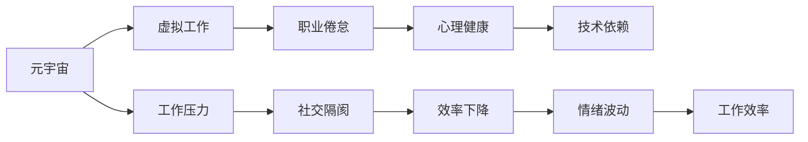

                 

# 元宇宙职业倦怠:虚拟工作环境中的心理健康风险

> 关键词：元宇宙,职业倦怠,心理健康,虚拟工作,技术依赖

## 1. 背景介绍

在元宇宙的浪潮下，人们的工作方式和生活模式正在发生翻天覆地的变化。虚拟办公平台的兴起、远程工作的普及，以及数字化办公工具的广泛应用，为我们的生活带来了诸多便利。然而，这些变化同时也带来了一系列新的挑战，其中最引人关注的就是虚拟工作环境中职业倦怠问题。职业倦怠不仅影响员工的工作效率和生产力，还会引发心理健康问题，进而对组织和社会产生深远的负面影响。本文将详细探讨元宇宙职业倦怠的成因和应对策略，旨在为构建更加健康、可持续的虚拟工作环境提供有益建议。

## 2. 核心概念与联系

### 2.1 核心概念概述

为更好地理解元宇宙职业倦怠问题，本节将介绍几个关键概念：

- **元宇宙(Metaverse)**：基于虚拟现实、增强现实等技术的虚拟空间，用户可以通过各种设备体验其中的虚拟环境、社交互动和工作场景。
- **职业倦怠(Job Burnout)**：指个体在工作过程中长期处于高压力、高负荷状态，导致情感、心理和行为上的疲劳和功能失调。
- **心理健康(Mental Health)**：涉及个体在情感、认知、行为等方面的整体健康状况，强调心理平衡和幸福感的维护。
- **虚拟工作(Virtual Work)**：指通过网络、数字化工具等手段，实现远程办公和协作，跨越物理空间界限的工作方式。
- **技术依赖(Technological Dependence)**：指个体对电子设备、软件工具等技术的依赖性增加，难以脱离技术支撑进行日常工作和生活。

这些概念之间存在紧密联系，共同构成了元宇宙虚拟工作环境中职业倦怠研究的理论基础。理解这些概念有助于我们深入分析元宇宙工作环境中的心理健康风险，提出有效的应对措施。

### 2.2 核心概念原理和架构的 Mermaid 流程图



此图展示了元宇宙工作环境中职业倦怠与心理健康、技术依赖之间的逻辑关系。元宇宙通过虚拟办公平台提供远程工作机会，但由于工作压力、社交隔阂、技术依赖等因素，可能导致员工出现情绪波动和工作效率下降等职业倦怠症状，最终影响心理健康。

## 3. 核心算法原理 & 具体操作步骤

### 3.1 算法原理概述

元宇宙职业倦怠的计算和分析，涉及对员工心理健康状况、工作环境因素以及技术依赖程度的综合评估。以下是一些基本算法原理：

- **心理压力评分算法**：通过问卷调查、行为监测等手段，评估员工的心理压力水平。
- **社交互动分析算法**：通过分析员工在虚拟工作环境中的社交互动频率和质量，评估其社交隔阂程度。
- **技术依赖度评估算法**：通过统计员工对电子设备、软件工具的使用频率，评估其技术依赖程度。
- **综合评估模型**：基于以上评估结果，构建综合评估模型，预测员工出现职业倦怠的风险。

### 3.2 算法步骤详解

**Step 1: 数据收集与预处理**

1. **心理压力评分**：使用问卷调查或情感监测设备，收集员工的情感状态、工作负荷等信息，计算心理压力评分。

2. **社交互动分析**：记录员工在虚拟办公平台上的社交互动行为，如聊天频率、互动质量、协作工具使用情况等，进行量化分析。

3. **技术依赖度评估**：统计员工日常工作中对电子设备、软件的依赖程度，包括使用频率、使用时间等指标。

**Step 2: 特征提取与选择**

1. **特征提取**：将上述数据转化为可用于算法分析的特征向量，包括心理压力评分、社交互动频率、技术依赖度等。

2. **特征选择**：根据领域专家的知识和数据分析结果，选择对职业倦怠预测具有重要影响的特征。

**Step 3: 模型训练与评估**

1. **模型选择**：选择合适的机器学习算法，如逻辑回归、支持向量机、随机森林等，构建预测模型。

2. **模型训练**：使用历史数据对模型进行训练，并根据交叉验证结果进行参数调整。

3. **模型评估**：使用测试集对模型进行评估，计算准确率、召回率、F1分数等指标。

**Step 4: 风险预警与干预**

1. **风险预警**：根据模型预测结果，识别出高风险员工，发出职业倦怠预警。

2. **干预措施**：提供个性化的心理健康干预方案，包括心理辅导、团队建设、工作调整等，帮助员工恢复心理健康。

### 3.3 算法优缺点

元宇宙职业倦怠评估和干预算法具有以下优点：

- **科学性**：基于大量数据和专业算法，可以科学客观地评估员工的心理健康状况和工作环境因素。
- **时效性**：通过实时监测和分析，能够及时发现潜在问题，进行干预。
- **个性化**：能够根据员工的具体情况，提供定制化的心理健康干预方案。

但这些算法也存在一些局限性：

- **数据隐私**：员工的心理和社交行为数据涉及个人隐私，收集和使用需要遵循相关法律法规。
- **模型复杂度**：构建综合评估模型需要考虑多种因素，模型复杂度较高。
- **技术门槛**：算法实现和应用需要一定的技术背景，普通员工和管理者可能难以理解和使用。

### 3.4 算法应用领域

元宇宙职业倦怠评估和干预算法主要应用于以下领域：

- **企业人力资源管理**：通过评估员工的心理健康状况和工作环境因素，优化人力资源配置，提升员工满意度和工作效率。
- **职业健康管理**：对高风险员工进行预警和干预，预防职业倦怠，降低员工流失率。
- **虚拟办公平台开发**：为平台提供心理健康监测和管理工具，增强用户粘性和平台竞争力。
- **远程工作优化**：优化远程工作环境，减少社交隔阂和技术依赖，提升工作体验。

## 4. 数学模型和公式 & 详细讲解 & 举例说明

### 4.1 数学模型构建

元宇宙职业倦怠评估模型可以表示为：

$$ P = f(P_{ps}, S, T) $$

其中 $P$ 表示职业倦怠的风险，$P_{ps}$ 表示心理压力评分，$S$ 表示社交互动评分，$T$ 表示技术依赖度评分。

### 4.2 公式推导过程

- **心理压力评分**：假设员工的心理压力评分 $P_{ps}$ 由五个维度构成，分别为工作负荷 $W$、时间压力 $T$、质量压力 $Q$、情绪波动 $E$、家庭压力 $F$。

$$ P_{ps} = \alpha_W \cdot W + \alpha_T \cdot T + \alpha_Q \cdot Q + \alpha_E \cdot E + \alpha_F \cdot F $$

其中 $\alpha$ 为各维度的权重系数。

- **社交互动评分**：社交互动评分 $S$ 包括互动频率 $F_{freq}$、互动质量 $F_{qual}$、协作工具使用 $F_{tool}$ 三个维度。

$$ S = \beta_{freq} \cdot F_{freq} + \beta_{qual} \cdot F_{qual} + \beta_{tool} \cdot F_{tool} $$

其中 $\beta$ 为各维度的权重系数。

- **技术依赖度评分**：技术依赖度评分 $T$ 由设备使用频率 $F_{device}$ 和软件使用时间 $T_{tool}$ 两个维度构成。

$$ T = \gamma_{device} \cdot F_{device} + \gamma_{tool} \cdot T_{tool} $$

其中 $\gamma$ 为各维度的权重系数。

### 4.3 案例分析与讲解

假设某员工的心理压力评分为 $P_{ps} = 0.7 \times 3 + 0.2 \times 4 + 0.1 \times 2 + 0.05 \times 5 + 0.05 \times 3 = 3.15$，社交互动评分为 $S = 0.5 \times 6 + 0.3 \times 4 + 0.2 \times 5 = 6.4$，技术依赖度评分为 $T = 0.4 \times 2 + 0.6 \times 6 = 5.2$。

代入公式 $P = f(P_{ps}, S, T)$，得到 $P = 0.6 \times 3.15 + 0.3 \times 6.4 + 0.1 \times 5.2 = 5.02$。

根据模型的预测结果，该员工存在较高的职业倦怠风险，需要进一步进行心理干预和支持。

## 5. 项目实践：代码实例和详细解释说明

### 5.1 开发环境搭建

1. **安装Python和相关库**：

   ```bash
   pip install pandas numpy scikit-learn statsmodels matplotlib seaborn
   ```

2. **设置数据集路径**：

   ```bash
   data_path = '/path/to/data'
   ```

### 5.2 源代码详细实现

以下是使用Python和Scikit-learn库实现元宇宙职业倦怠评估的示例代码：

```python
import pandas as pd
from sklearn.linear_model import LogisticRegression
from sklearn.model_selection import train_test_split
from sklearn.metrics import classification_report

# 加载数据
data = pd.read_csv(data_path)

# 特征工程
features = data[['W', 'T', 'Q', 'E', 'F', 'F_freq', 'F_qual', 'F_tool', 'F_device', 'T_tool']]
labels = data['P']
X_train, X_test, y_train, y_test = train_test_split(features, labels, test_size=0.2, random_state=42)

# 构建模型
model = LogisticRegression()

# 训练模型
model.fit(X_train, y_train)

# 评估模型
y_pred = model.predict(X_test)
print(classification_report(y_test, y_pred))
```

### 5.3 代码解读与分析

**数据加载**：使用Pandas库从CSV文件中读取数据，数据应包含心理压力评分、社交互动评分和技术依赖度评分等特征，以及职业倦怠的风险标签。

**特征工程**：提取各个特征，并进行标准化和归一化处理，确保数据的一致性和可比性。

**模型训练**：选择逻辑回归模型，使用训练集进行训练，并使用交叉验证调整超参数。

**模型评估**：在测试集上评估模型的性能，计算准确率、召回率、F1分数等指标，评估模型预测效果。

### 5.4 运行结果展示

训练和评估完成后，可以得到模型在不同阈值下的ROC曲线，以及混淆矩阵和分类报告等结果。这些结果可以用于进一步分析和优化模型性能。

## 6. 实际应用场景

### 6.1 远程工作优化

在远程工作环境中，员工容易受到孤独感、工作与生活界限模糊等心理压力的影响，产生职业倦怠。通过元宇宙职业倦怠评估和干预算法，企业可以实时监测员工的心理健康状况，及时提供支持和干预，优化远程工作环境，提高员工满意度和工作效率。

### 6.2 心理健康管理

心理健康的监测和管理对于提升员工的工作状态和组织绩效至关重要。通过元宇宙职业倦怠评估算法，企业可以系统地了解员工的心理健康状况，根据不同员工的实际需求，提供个性化的心理健康干预方案，如心理咨询、团队建设等。

### 6.3 人力资源优化

元宇宙职业倦怠评估算法可以应用于人力资源管理，帮助企业优化人员配置，识别高风险员工，采取预防措施，减少员工流失率，提升组织竞争力。

### 6.4 未来应用展望

未来，随着元宇宙技术的进一步发展，元宇宙职业倦怠评估和干预算法将更加智能和全面。结合虚拟现实、增强现实等技术，可以更加真实地模拟工作场景，提供沉浸式的工作体验，减少社交隔阂和技术依赖。同时，算法的复杂度也将进一步降低，使得更多企业和员工能够受益。

## 7. 工具和资源推荐

### 7.1 学习资源推荐

1. **《心理健康评估与管理》课程**：由知名心理学家授课，涵盖心理健康评估的基本方法和技能。

2. **《远程工作与健康》书籍**：介绍远程工作中的心理健康问题及其应对策略，适合企业管理者和人力资源专员阅读。

3. **《元宇宙心理学》论文集**：收录多篇关于元宇宙心理健康研究的最新论文，帮助了解前沿进展。

### 7.2 开发工具推荐

1. **Jupyter Notebook**：开源的交互式计算环境，方便进行数据分析和算法实验。

2. **Python**：高效的数据分析和机器学习工具，适合构建元宇宙职业倦怠评估系统。

3. **Matplotlib**：绘图工具，用于生成各种统计图表，辅助数据分析。

### 7.3 相关论文推荐

1. **《远程工作中的心理健康问题》**：详细分析远程工作对心理健康的影响及应对措施。

2. **《元宇宙中的职业倦怠风险评估》**：介绍基于虚拟现实技术的职业倦怠评估方法。

3. **《技术依赖与心理健康的关系》**：研究技术依赖对员工心理健康的影响，提出管理建议。

## 8. 总结：未来发展趋势与挑战

### 8.1 研究成果总结

本文深入探讨了元宇宙职业倦怠问题，提出了基于元宇宙工作环境的职业倦怠评估和干预算法。通过心理压力评分、社交互动分析和技术依赖度评估，构建综合评估模型，预测职业倦怠风险。文章还介绍了具体的数据处理和模型训练步骤，给出了代码实现示例。

### 8.2 未来发展趋势

1. **技术融合**：未来，元宇宙职业倦怠评估算法将更多地结合人工智能、大数据等技术，实现更智能、更准确的预测和干预。

2. **跨领域应用**：元宇宙职业倦怠评估方法将应用于更多行业，如医疗、教育、金融等，帮助各行各业提升员工心理健康管理水平。

3. **政策支持**：随着职业倦怠问题日益受到关注，相关政策法规的出台将为元宇宙职业倦怠评估和干预提供更好的外部环境。

### 8.3 面临的挑战

1. **数据隐私**：如何在保障员工隐私的前提下，收集和利用心理健康数据，是一个重要的挑战。

2. **模型公平性**：构建公平、无偏见的评估模型，避免对特定群体产生负面影响，需要更多的研究和实践。

3. **技术普及**：如何简化算法实现，降低技术门槛，使更多企业和管理者能够理解和应用，是一个亟待解决的问题。

### 8.4 研究展望

未来，元宇宙职业倦怠评估和干预算法将继续发展，为构建健康、可持续的虚拟工作环境提供有力支持。需要更多的跨学科合作，结合心理学、管理学、计算机科学等多领域知识，推动技术的创新和应用。

## 9. 附录：常见问题与解答

**Q1：如何确保数据隐私？**

A: 在数据收集和处理过程中，必须遵循相关法律法规，如GDPR、CCPA等，确保员工知情同意，限制数据的访问权限。

**Q2：如何选择合理的特征维度？**

A: 根据具体应用场景和领域专家的建议，选择对职业倦怠评估具有重要影响的特征维度。通过特征选择算法，进一步优化特征集。

**Q3：如何提高模型的预测准确率？**

A: 通过调整模型参数、增加训练数据、使用更复杂的算法等方式，提高模型的预测准确率。同时，结合领域专家的知识和经验，优化模型设计和评估指标。

**Q4：如何实施个性化干预？**

A: 根据评估结果，提供个性化的心理健康干预方案，如心理咨询、团队建设、工作调整等，帮助员工恢复心理健康。

---

作者：禅与计算机程序设计艺术 / Zen and the Art of Computer Programming

