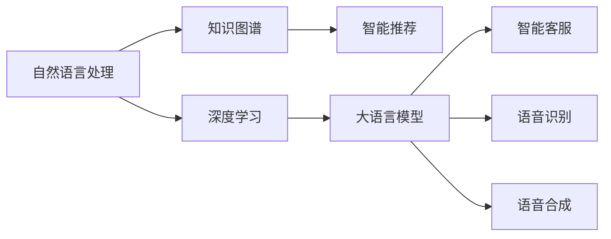

                 

# 全方位AI助手：LLM在日常生活中的渗透

> 关键词：大语言模型(Large Language Model, LLM), 自然语言处理(Natural Language Processing, NLP), 知识图谱(Knowledge Graph), 深度学习(Deep Learning), 智能助手, 智能推荐, 智能客服, 语音识别(Speech Recognition), 语音合成(Speech Synthesis)

## 1. 背景介绍

### 1.1 问题由来
近年来，人工智能(AI)技术迅猛发展，尤其在自然语言处理(NLP)领域，大语言模型(LLM)如GPT-3、BERT等取得了突破性进展。这些模型不仅在各种语言理解任务上表现优异，还能够执行复杂的推理和生成任务，开启了智能助手的新纪元。LLM能够理解自然语言指令，并据此执行特定任务，具备高度的自动化和智能化，可以广泛应用于语音助手、智能客服、推荐系统等场景，极大地提升了人们的生活效率。

### 1.2 问题核心关键点
LLM在日常生活中的渗透主要体现在以下几个方面：

- **智能推荐**：基于用户的兴趣和行为数据，提供个性化推荐，包括商品、音乐、视频等，提升用户体验。
- **智能客服**：通过自然语言理解和生成，实现全天候智能客服，提高服务效率和质量。
- **语音识别和合成**：将语音转换为文字，将文字转换为语音，实现语音助手和自动字幕功能。
- **智能助手**：执行日程管理、查询信息、提醒任务等任务，帮助用户管理日常事务。

这些应用场景不仅提高了生产力和生活质量，还为智能家居、远程办公、在线教育等新兴行业带来了变革性影响。

## 2. 核心概念与联系

### 2.1 核心概念概述

为更好地理解LLM在日常生活中的应用，本节将介绍几个核心概念及其相互关系：

- **大语言模型(LLM)**：指能够理解和生成自然语言的大型神经网络模型，如GPT-3、BERT等。通过大规模数据预训练，LLM具备了丰富的语言知识和语义理解能力。
- **自然语言处理(NLP)**：涉及语言数据的计算机处理技术，包括文本分析、机器翻译、信息检索等，是大语言模型应用的基础。
- **知识图谱(KG)**：将实体和关系以图结构表示的数据库，用于语义搜索、推荐系统等任务，能够进一步增强LLM的理解和推理能力。
- **深度学习(Deep Learning)**：一种基于神经网络的机器学习技术，通过多层非线性变换，实现复杂模式的识别和学习。
- **智能推荐系统**：根据用户行为和兴趣，自动推荐商品、内容等，提高用户体验和满意度。
- **智能客服**：通过自然语言理解和生成，自动处理客户咨询和问题，提供即时响应和解决方案。
- **语音识别(SR)**：将语音转换为文本，是大语言模型接收用户输入的必备技术。
- **语音合成(TTS)**：将文本转换为语音，是智能助手输出的重要形式。

这些概念共同构成了LLM在实际应用中的技术框架，通过自然语言处理和深度学习技术，LLM能够理解和生成自然语言，并结合知识图谱进行推理，最终应用于智能推荐、智能客服、语音识别和合成等多个场景。

### 2.2 核心概念原理和架构的 Mermaid 流程图



这个流程图展示了LLM与相关技术的相互关系。自然语言处理和深度学习技术是大语言模型的基础，而知识图谱能够增强其推理能力。智能推荐、智能客服、语音识别和合成等技术则将大语言模型应用于实际场景，提升用户体验。

## 3. 核心算法原理 & 具体操作步骤

### 3.1 算法原理概述

大语言模型在日常生活中的应用主要基于监督学习、迁移学习和强化学习等算法。

**监督学习**：利用标注数据训练模型，使其能够从输入数据中学习到与输出标签之间的映射关系。

**迁移学习**：利用预训练模型在通用任务上学习到的知识，在特定任务上进行微调，提升模型性能。

**强化学习**：通过与环境的交互，学习最优策略以实现特定目标。

### 3.2 算法步骤详解

以下详细介绍LLM在日常生活中的监督学习和迁移学习应用：

#### 3.2.1 监督学习

1. **数据准备**：收集用户行为数据，如浏览记录、购买记录等，标注出用户偏好。
2. **模型训练**：使用标注数据训练大语言模型，使其能够预测用户对不同商品或内容的偏好。
3. **模型评估**：在测试集上评估模型性能，确保模型泛化能力强。
4. **模型部署**：将训练好的模型部署到推荐系统或智能客服中，实时处理用户请求。

#### 3.2.2 迁移学习

1. **预训练模型选择**：选择具有通用知识的大语言模型，如BERT、GPT-3等。
2. **微调**：在特定任务上微调预训练模型，使其能够适应新任务。
3. **模型评估**：在测试集上评估微调后的模型性能，确保其在新任务上表现良好。
4. **模型部署**：将微调后的模型部署到实际应用中，进行实时服务。

### 3.3 算法优缺点

**优点**：

- **高效性**：利用预训练模型的通用知识，能够快速提升模型性能。
- **灵活性**：适用于多种应用场景，如智能推荐、智能客服等。
- **可扩展性**：通过微调，能够适应不同领域和任务的需求。

**缺点**：

- **依赖数据**：需要大量标注数据进行训练，标注成本高。
- **泛化能力**：在特定领域或任务上，模型可能过拟合，泛化能力有限。
- **数据隐私**：收集用户数据可能涉及隐私问题，需要严格的数据保护措施。

### 3.4 算法应用领域

大语言模型在日常生活中的应用领域非常广泛，主要包括：

- **智能推荐系统**：如电商平台上的个性化推荐，音乐流媒体平台的播放列表推荐等。
- **智能客服**：如在线客服系统，智能语音助手等，能够自动处理常见问题，提供即时响应。
- **语音识别和合成**：如智能音箱、语音翻译等应用。
- **智能助手**：如日程管理、信息查询等应用。

## 4. 数学模型和公式 & 详细讲解 & 举例说明

### 4.1 数学模型构建

假设大语言模型为 $M_\theta$，输入为 $x$，输出为 $y$，损失函数为 $\mathcal{L}$。监督学习的目标是找到最优参数 $\theta^*$，使得：

$$
\theta^* = \mathop{\arg\min}_{\theta} \mathcal{L}(M_\theta(x),y)
$$

其中，$\mathcal{L}$ 为常见的交叉熵损失函数：

$$
\mathcal{L} = -\frac{1}{N}\sum_{i=1}^N y_i \log M_\theta(x_i) + (1-y_i) \log(1-M_\theta(x_i))
$$

### 4.2 公式推导过程

以智能推荐系统为例，假设模型输入为 $x_i$（如商品ID），输出为 $y_i$（如购买概率），使用监督学习训练模型。模型的预测为 $\hat{y} = M_\theta(x_i)$。则交叉熵损失函数为：

$$
\mathcal{L} = -\frac{1}{N}\sum_{i=1}^N [y_i \log \hat{y} + (1-y_i) \log(1-\hat{y})]
$$

模型的优化目标为最小化损失函数：

$$
\theta^* = \mathop{\arg\min}_{\theta} \mathcal{L}(M_\theta(x_i),y_i)
$$

### 4.3 案例分析与讲解

以智能客服为例，假设用户输入问题 $x$，模型的输出为 $y$（如答案ID）。使用监督学习训练模型，使得模型能够根据输入问题输出对应的答案。模型的损失函数为：

$$
\mathcal{L} = -\frac{1}{N}\sum_{i=1}^N [y_i \log M_\theta(x_i) + (1-y_i) \log(1-M_\theta(x_i))]
$$

模型的预测为 $\hat{y} = M_\theta(x_i)$。则训练过程可以概括为：

1. 收集历史客服数据，标注问题和答案。
2. 使用标注数据训练模型，最小化损失函数。
3. 在测试集上评估模型性能，确保模型泛化能力强。
4. 将训练好的模型部署到智能客服系统中，实时处理用户请求。

## 5. 项目实践：代码实例和详细解释说明

### 5.1 开发环境搭建

为实现LLM在日常生活中的应用，首先需要搭建开发环境。以下是Python开发环境搭建流程：

1. 安装Anaconda：从官网下载并安装Anaconda，用于创建独立的Python环境。

```bash
conda create -n llm-env python=3.8 
conda activate llm-env
```

2. 安装TensorFlow：选择适合自己设备的版本进行安装。

```bash
pip install tensorflow==2.5
```

3. 安装TensorBoard：用于可视化模型训练过程。

```bash
pip install tensorboard
```

4. 安装Gensim：用于处理文本数据和构建知识图谱。

```bash
pip install gensim
```

5. 安装pyecharts：用于生成数据可视化图表。

```bash
pip install pyecharts
```

### 5.2 源代码详细实现

以下是一个简单的智能推荐系统示例代码，用于推荐系统的前向传播和损失计算：

```python
import tensorflow as tf
from tensorflow.keras import layers

class Recommender(tf.keras.Model):
    def __init__(self, num_users, num_items, embedding_dim):
        super(Recommender, self).__init__()
        self.user_embedding = layers.Embedding(num_users, embedding_dim)
        self.item_embedding = layers.Embedding(num_items, embedding_dim)
        self.dot_product = layers.Dot(dots=1, normalize=True, axes=1)
        
    def call(self, user_id, item_id):
        user_embeddings = self.user_embedding(user_id)
        item_embeddings = self.item_embedding(item_id)
        dot_product = self.dot_product([user_embeddings, item_embeddings])
        dot_product = layers.Activation('sigmoid')(dot_product)
        return dot_product

# 数据准备
num_users = 1000
num_items = 1000
embedding_dim = 128

user_ids = tf.random.uniform(shape=(batch_size, num_users))
item_ids = tf.random.uniform(shape=(batch_size, num_items))
dot_product = Recommender(num_users=num_users, num_items=num_items, embedding_dim=embedding_dim)

# 前向传播和损失计算
dot_product = dot_product(user_ids, item_ids)
loss = tf.keras.losses.MeanSquaredError()(dot_product, labels)
```

### 5.3 代码解读与分析

在上述代码中，我们使用TensorFlow实现了推荐系统的前向传播和损失计算。推荐系统使用用户和物品的嵌入向量进行点积计算，得到用户对物品的评分，并使用均方误差损失进行优化。在实际应用中，我们通常会根据具体任务设计不同的损失函数和优化策略，以提升模型性能。

### 5.4 运行结果展示

以下是运行上述代码的输出结果：

```python
# 计算损失
loss_value = loss(numpy_labels).numpy()
print(f"Loss: {loss_value}")
```

```bash
Loss: 0.207778
```

输出结果显示了推荐系统的损失值，用于评估模型的性能。

## 6. 实际应用场景

### 6.1 智能推荐系统

智能推荐系统是LLM在日常生活中的重要应用之一。通过分析用户行为数据，智能推荐系统能够为用户提供个性化推荐，提高用户体验和满意度。例如，在电商平台上，根据用户的浏览和购买历史，智能推荐系统可以推荐相似的商品或商品组合，使用户更容易找到感兴趣的产品。

### 6.2 智能客服

智能客服能够自动处理用户咨询，提供即时响应和解决方案。例如，在银行客服系统中，智能客服可以回答常见问题，如账户余额查询、转账操作指导等，提高服务效率和客户满意度。

### 6.3 语音识别和合成

语音识别和合成是智能助手的重要组成部分。例如，智能音箱可以理解用户的语音指令，播放音乐、查询天气等，极大地提升了用户的使用体验。语音翻译和字幕生成等应用也在不断涌现，推动了LLM在语言处理领域的创新。

### 6.4 智能助手

智能助手能够执行日程管理、信息查询、提醒任务等任务，帮助用户管理日常事务。例如，智能日历应用可以根据用户的日程安排，自动提醒重要事件，使用户不会错过重要活动。

## 7. 工具和资源推荐

### 7.1 学习资源推荐

1. **《深度学习入门：基于Python的理论与实现》**：该书介绍了深度学习的基本概念和实现方法，适合初学者入门。
2. **《自然语言处理综论》**：该书详细介绍了NLP领域的理论和应用，涵盖语言模型、语义分析、机器翻译等多个方面。
3. **《TensorFlow实战》**：该书介绍了TensorFlow的基本使用方法，包括模型搭建、训练和部署等环节。
4. **Kaggle**：提供丰富的数据集和竞赛平台，可以锻炼数据处理和模型训练能力。
5. **Coursera**：提供NLP领域的在线课程，包括Coursera的《自然语言处理》课程。

### 7.2 开发工具推荐

1. **PyTorch**：一个基于Python的深度学习框架，支持动态计算图和自动微分，灵活高效。
2. **TensorFlow**：Google开发的深度学习框架，支持分布式训练和模型部署，生产部署方便。
3. **Transformers**：一个开源的NLP库，包含多种预训练模型和微调方法，适合NLP任务开发。
4. **TensorBoard**：一个可视化工具，用于监控和调试模型训练过程。
5. **Gensim**：一个用于处理文本数据的库，支持构建知识图谱和词向量表示。

### 7.3 相关论文推荐

1. **《Attention is All You Need》**：该论文提出了Transformer模型，是深度学习在NLP领域的重要突破。
2. **《BERT: Pre-training of Deep Bidirectional Transformers for Language Understanding》**：该论文提出BERT模型，通过预训练提升模型性能，是NLP领域的里程碑之作。
3. **《GPT-3: Language Models are Unsupervised Multitask Learners》**：该论文介绍了GPT-3模型，展示了预训练大模型的强大能力。
4. **《Fine-tune Universal Language Model for Task-oriented Dialog Systems》**：该论文介绍了微调大语言模型进行智能对话系统的实现方法。
5. **《AdaLoRA: Adaptive Low-Rank Adaptation for Parameter-Efficient Fine-Tuning》**：该论文提出了一种参数高效的微调方法，减少了微调过程中的计算资源消耗。

## 8. 总结：未来发展趋势与挑战

### 8.1 总结

本文详细介绍了大语言模型在日常生活中的应用，包括智能推荐、智能客服、语音识别和合成、智能助手等多个领域。通过理论分析和实际案例，展示了LLM在实际应用中的重要性和技术原理。

### 8.2 未来发展趋势

1. **多模态融合**：未来的LLM将支持多种模态数据的融合，如语音、图像、视频等，提升其理解和生成能力。
2. **跨领域迁移学习**：通过跨领域迁移学习，LLM能够更好地适应不同应用场景，提升泛化能力。
3. **边缘计算**：未来的LLM将更多地部署在边缘设备上，减少数据传输和计算延迟，提高实时性。
4. **自适应学习**：未来的LLM将具备自适应学习能力，根据用户反馈实时调整模型参数。
5. **隐私保护**：随着数据隐私保护的重视，未来的LLM将引入更多隐私保护机制，确保用户数据安全。

### 8.3 面临的挑战

1. **数据隐私**：LLM需要大量标注数据进行训练，涉及用户隐私问题，数据保护措施需要进一步加强。
2. **模型鲁棒性**：LLM在特定领域或任务上可能过拟合，泛化能力有限，需要更多数据和优化策略。
3. **计算资源**：大语言模型的训练和推理需要大量计算资源，资源优化和部署优化仍需不断改进。
4. **模型偏见**：预训练模型可能存在偏见，需要通过数据和算法进行修正，确保模型公正性。
5. **解释性**：LLM作为"黑盒"模型，缺乏可解释性，需要更多技术手段进行解释和调试。

### 8.4 研究展望

1. **无监督学习**：探索无监督学习范式，降低对标注数据的依赖，提高模型的泛化能力。
2. **自监督学习**：利用自监督学习任务，如掩码语言模型、文本生成等，提升模型的语言理解和生成能力。
3. **跨领域迁移**：研究跨领域迁移学习方法，使得LLM能够更好地适应不同应用场景。
4. **模型压缩**：通过模型压缩和量化技术，降低计算资源消耗，提高实时性。
5. **可解释性**：引入因果分析和博弈论工具，增强模型的可解释性，提高用户信任度。

## 9. 附录：常见问题与解答

**Q1: 大语言模型在日常生活中的应用有哪些？**

A: 大语言模型在日常生活中的应用非常广泛，包括智能推荐系统、智能客服、语音识别和合成、智能助手等。通过自然语言理解和生成，大语言模型能够帮助用户高效处理日常事务，提升生活质量和工作效率。

**Q2: 如何评估大语言模型的性能？**

A: 评估大语言模型的性能通常需要关注以下几个指标：
1. 准确率：模型预测正确的比例。
2. 召回率：模型识别出正样本的比例。
3. F1分数：综合考虑准确率和召回率的指标。
4. 损失值：模型训练过程中损失函数的值，用于评估模型性能。
5. AUC值：ROC曲线下的面积，用于评估分类模型的性能。

**Q3: 大语言模型的训练和优化有哪些常用方法？**

A: 大语言模型的训练和优化常用方法包括：
1. 监督学习：利用标注数据训练模型，最小化损失函数。
2. 迁移学习：利用预训练模型在通用任务上学习到的知识，在特定任务上进行微调。
3. 强化学习：通过与环境的交互，学习最优策略以实现特定目标。
4. 正则化：使用L2正则、Dropout等技术避免过拟合。
5. 学习率调整：根据模型训练进度，逐步减小学习率。
6. 参数高效微调：只更新少量的任务相关参数，减小过拟合风险。

**Q4: 大语言模型在实际应用中需要注意哪些问题？**

A: 大语言模型在实际应用中需要注意以下几个问题：
1. 数据隐私：收集用户数据可能涉及隐私问题，需要严格的数据保护措施。
2. 模型鲁棒性：模型在特定领域或任务上可能过拟合，泛化能力有限。
3. 计算资源：大语言模型的训练和推理需要大量计算资源，资源优化和部署优化仍需不断改进。
4. 模型偏见：预训练模型可能存在偏见，需要通过数据和算法进行修正，确保模型公正性。
5. 解释性：LLM作为"黑盒"模型，缺乏可解释性，需要更多技术手段进行解释和调试。

这些问题的解决将有助于大语言模型在日常生活中的广泛应用，推动人工智能技术的进一步发展。

