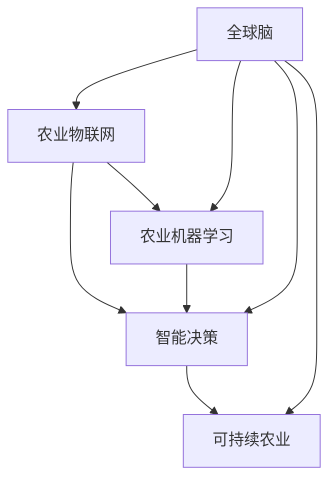

                 

# 全球脑与智慧农业:未来食品生产的新范式

> 关键词：全球脑,智慧农业,未来食品生产,智能农业,农业物联网,农业机器学习,智能决策,可持续农业

## 1. 背景介绍

### 1.1 问题由来
随着全球人口的快速增长和城市化进程的加快，确保食物安全、减少环境影响、提高农业生产效率，已成为世界各国面临的重大挑战。传统农业依赖于人力和自然条件，面临着资源约束和环境破坏的双重压力。而智慧农业通过将信息技术和生物技术深度融合，构建新型农业生产系统，有望从根本上解决这些问题，实现农业的可持续发展。

### 1.2 问题核心关键点
智慧农业的核心在于通过物联网、大数据、人工智能等技术手段，实时感知、智能分析和精准控制农业生产环境，提升农业生产效率和产品质量。具体而言，智慧农业包括数据采集、数据处理、智能决策、精准控制等环节。

### 1.3 问题研究意义
研究智慧农业技术，对于保障食物安全、缓解环境压力、推动农业现代化进程，具有重要意义：

1. 保障食物安全：通过精准控制和智能化管理，提高农作物产量和质量，确保全球食物供给。
2. 缓解环境压力：通过减少化肥、农药的使用，降低农业对环境的负面影响。
3. 推动农业现代化：通过信息技术和生物技术的结合，提升农业生产的智能化水平。
4. 助力经济社会发展：智慧农业技术的发展和应用，将带动农业产业链上下游的协同创新，促进经济增长。
5. 构建未来农业形态：智慧农业技术的应用，将为农业生产、加工、流通等环节带来革命性变化，构建全新的农业生态系统。

## 2. 核心概念与联系

### 2.1 核心概念概述

为更好地理解智慧农业的核心技术，本节将介绍几个密切相关的核心概念：

- 全球脑(Global Brain): 通过多领域、多层次数据的融合，构建虚拟大脑，实时感知、分析和控制农业生产系统。
- 智慧农业(Smart Agriculture): 利用物联网、大数据、人工智能等技术手段，实现农业生产过程的智能化管理。
- 农业物联网(Agricultural Internet of Things, AIO): 通过传感器、标签、无线通信等技术，实时采集和传输农业生产环境数据。
- 农业机器学习(Agricultural Machine Learning, AML): 利用机器学习算法，对农业数据进行建模和预测，指导农业生产决策。
- 智能决策(Intelligent Decision Making): 通过集成多种感知、分析、控制技术，构建智能农业决策系统。
- 可持续农业(Sustainable Agriculture): 通过优化农业生产过程，减少资源消耗，降低环境污染，实现农业的可持续性。

这些核心概念之间的逻辑关系可以通过以下Mermaid流程图来展示：



这个流程图展示了一些关键概念之间的相互作用：

1. 全球脑通过融合多领域数据，实现对农业环境的实时感知。
2. 农业物联网提供数据采集和传输的支撑。
3. 农业机器学习对农业数据进行建模和预测，支持智能决策。
4. 智能决策系统将感知数据和预测结果结合，进行农业生产控制。
5. 可持续农业目标是优化农业生产过程，减少环境影响。

这些概念共同构成了智慧农业的核心框架，使得智能技术能够全面、深入地影响农业生产的各个环节。

## 3. 核心算法原理 & 具体操作步骤

### 3.1 算法原理概述

智慧农业的核心算法原理可以概括为"感知-分析-决策-控制"四个步骤：

1. **感知(Perception)**: 通过农业物联网设备，实时采集农田环境数据，如土壤湿度、温度、光照强度、作物生长状态等。
2. **分析(Analysis)**: 利用农业机器学习算法，对感知数据进行建模和预测，如病虫害识别、作物生长预测、土壤肥力评估等。
3. **决策(Decision)**: 根据分析结果，利用智能决策系统进行生产计划制定、资源配置优化、风险预警等。
4. **控制(Control)**: 通过自动化控制设备，如灌溉系统、施肥系统、病虫害防治系统等，实现精准控制和自动化管理。

### 3.2 算法步骤详解

以下是智慧农业核心算法的详细步骤：

**Step 1: 数据采集与处理**

智慧农业首先需要进行大量农田数据的采集与处理。数据采集通常涉及多种传感器、标签和监控设备，如土壤湿度传感器、温度传感器、摄像头、无人机等。

- 数据采集：通过传感器、摄像头、无人机等设备，实时获取农田环境数据，如土壤湿度、温度、光照强度、作物生长状态等。
- 数据处理：对采集到的数据进行清洗、标准化、特征提取等预处理，确保数据的可用性和一致性。

**Step 2: 数据分析与建模**

数据采集处理后，需要对数据进行深入分析，建立农业生产过程的数学模型。常用的方法包括：

- 统计分析：通过描述性统计，分析数据的基本特征和趋势。
- 时间序列分析：利用时间序列模型，预测未来的数据变化。
- 机器学习：通过有监督或无监督学习算法，建立预测模型。
- 深度学习：利用深度神经网络，进行复杂模式识别和预测。

常用的机器学习算法包括线性回归、决策树、随机森林、支持向量机等。深度学习算法则包括卷积神经网络(CNN)、循环神经网络(RNN)、长短期记忆网络(LSTM)等。

**Step 3: 智能决策与优化**

数据分析完成后，需要构建智能决策系统，对农业生产过程进行优化。智能决策系统通常包括以下几个模块：

- 生产计划制定：根据天气、土壤、作物生长状态等数据，制定科学的生产计划。
- 资源配置优化：对化肥、农药、灌溉等资源进行配置优化，减少资源浪费。
- 风险预警：实时监测作物生长状态、病虫害、气象变化等，及时预警潜在风险。

常用的优化方法包括遗传算法、粒子群算法、蚁群算法等。

**Step 4: 精准控制与自动化**

智能决策系统制定出生产计划后，需要利用自动化控制设备，实现精准控制和自动化管理。常用的控制设备包括：

- 灌溉系统：根据土壤湿度和作物需求，自动调整灌溉时间和水量。
- 施肥系统：根据土壤肥力评估结果，自动控制施肥量和时间。
- 病虫害防治系统：利用无人机或机器人，自动喷洒农药，防治病虫害。

### 3.3 算法优缺点

智慧农业的核心算法具有以下优点：

- 实时感知：通过物联网设备，实现对农业环境的实时监测，保证数据的实时性和准确性。
- 数据分析：通过机器学习和深度学习算法，提高数据处理和分析的深度和精度。
- 智能决策：通过智能决策系统，实现对农业生产过程的优化和自动控制。
- 自动化管理：通过自动化控制设备，提高农业生产的效率和稳定性。

同时，智慧农业的算法也存在以下缺点：

- 数据依赖性强：智慧农业高度依赖于物联网设备的数据采集，设备故障或数据缺失可能导致系统失效。
- 模型复杂度高：机器学习和大数据分析模型的复杂度较高，需要较高的计算资源和专业技能。
- 系统成本高：构建智慧农业系统需要大量的硬件设备和软件成本，对中小规模农场难以负担。
- 数据隐私和安全问题：农业物联网设备采集大量个人和隐私数据，如何保护数据隐私和安全，是一个重要问题。

尽管存在这些缺点，但就目前而言，智慧农业的核心算法仍是目前实现农业智能化管理的主流技术。未来相关研究的重点在于如何进一步降低系统成本，提高数据隐私保护能力，优化模型性能等，以实现更大规模的推广应用。

### 3.4 算法应用领域

智慧农业的核心算法广泛应用于以下领域：

- 智能灌溉：通过实时监测土壤湿度和气象条件，自动调整灌溉量和频率。
- 精准施肥：根据土壤肥力评估结果，自动调整施肥量和时间，提高肥料利用率。
- 病虫害防治：利用无人机或机器人，自动喷洒农药，防治病虫害，提高防治效果。
- 作物生长监测：利用摄像头和无人机，实时监测作物生长状态，进行科学管理。
- 智能决策支持：通过数据分析和智能决策系统，优化农业生产计划和资源配置。

除了这些核心领域，智慧农业技术还被创新性地应用到更多场景中，如智能温室、智能农机、农产品质量检测等，为农业生产带来了全新的变革。

## 4. 数学模型和公式 & 详细讲解 & 举例说明

### 4.1 数学模型构建

智慧农业的数学模型构建涉及多个方面，包括统计模型、时间序列模型、机器学习模型和深度学习模型等。

- 统计模型：如线性回归模型，用于分析农业生产过程的基本特征。
- 时间序列模型：如ARIMA模型，用于预测农作物的生长周期。
- 机器学习模型：如支持向量机(SVM)、随机森林(Random Forest)，用于分类和回归分析。
- 深度学习模型：如卷积神经网络(CNN)、循环神经网络(RNN)，用于复杂模式识别和预测。

以线性回归模型为例，假设我们有 $N$ 个样本数据 $(x_i, y_i)$，其中 $x_i$ 为自变量，$y_i$ 为因变量，目标是构建一个线性回归模型 $y = \theta_0 + \theta_1 x$，其中 $\theta_0$ 和 $\theta_1$ 为模型参数。

根据最小二乘法，模型参数的估计公式为：

$$
\hat{\theta} = (X^T X)^{-1} X^T Y
$$

其中 $X$ 为自变量矩阵，$Y$ 为因变量向量。

### 4.2 公式推导过程

以线性回归模型为例，推导模型参数的估计公式。

假设我们有一个线性回归模型 $y = \theta_0 + \theta_1 x$，其中 $x$ 为自变量，$\theta_0$ 和 $\theta_1$ 为模型参数。目标是最小化预测误差 $e_i = y_i - \hat{y_i}$，其中 $\hat{y_i} = \theta_0 + \theta_1 x_i$。

最小二乘法的基本思想是使所有样本的误差平方和最小，即：

$$
\sum_{i=1}^N e_i^2 = \sum_{i=1}^N (y_i - \hat{y_i})^2
$$

取偏导数，得：

$$
\frac{\partial}{\partial \theta_0} \sum_{i=1}^N (y_i - \hat{y_i})^2 = -2\sum_{i=1}^N (y_i - \hat{y_i})
$$

$$
\frac{\partial}{\partial \theta_1} \sum_{i=1}^N (y_i - \hat{y_i})^2 = -2\sum_{i=1}^N (x_i - \hat{y_i})
$$

联立求解，得：

$$
\hat{\theta_0} = \frac{\sum_{i=1}^N y_i - \theta_1 \sum_{i=1}^N x_i}{N}
$$

$$
\hat{\theta_1} = \frac{\sum_{i=1}^N (x_i y_i) - \frac{\sum_{i=1}^N x_i}{N} \sum_{i=1}^N y_i}{\sum_{i=1}^N x_i^2 - \frac{(\sum_{i=1}^N x_i)^2}{N}}
$$

### 4.3 案例分析与讲解

以智能灌溉系统为例，说明智慧农业的核心算法和数学模型应用。

假设有一个智能灌溉系统，需要根据土壤湿度和作物需求，自动调整灌溉量和频率。通过农业物联网设备采集到大量实时数据，如土壤湿度、温度、光照强度、作物生长状态等。

1. **数据采集与处理**：通过土壤湿度传感器、温度传感器、摄像头、无人机等设备，实时获取农田环境数据，并进行数据清洗和标准化。

2. **数据分析与建模**：利用统计分析和时间序列分析方法，建立土壤湿度变化模型，预测未来土壤湿度。

3. **智能决策与优化**：根据预测结果，制定科学的灌溉计划，优化灌溉时间和水量。

4. **精准控制与自动化**：利用自动化控制设备，根据灌溉计划自动调整灌溉系统，实现精准控制。

## 5. 项目实践：代码实例和详细解释说明

### 5.1 开发环境搭建

在进行智慧农业项目实践前，我们需要准备好开发环境。以下是使用Python进行PyTorch开发的环境配置流程：

1. 安装Anaconda：从官网下载并安装Anaconda，用于创建独立的Python环境。

2. 创建并激活虚拟环境：
```bash
conda create -n pytorch-env python=3.8 
conda activate pytorch-env
```

3. 安装PyTorch：根据CUDA版本，从官网获取对应的安装命令。例如：
```bash
conda install pytorch torchvision torchaudio cudatoolkit=11.1 -c pytorch -c conda-forge
```

4. 安装各类工具包：
```bash
pip install numpy pandas scikit-learn matplotlib tqdm jupyter notebook ipython
```

完成上述步骤后，即可在`pytorch-env`环境中开始智慧农业项目实践。

### 5.2 源代码详细实现

下面以智能灌溉系统为例，给出使用PyTorch进行智慧农业项目开发的PyTorch代码实现。

首先，定义智能灌溉系统的数据处理函数：

```python
import pandas as pd
import numpy as np
from sklearn.preprocessing import MinMaxScaler
from torch.utils.data import Dataset
import torch

class IrrigationDataset(Dataset):
    def __init__(self, data, scaler):
        self.data = data
        self.scaler = scaler
        
    def __len__(self):
        return len(self.data)
    
    def __getitem__(self, index):
        x = self.data.iloc[index].values
        y = self.data.iloc[index]['irrigation_time']
        
        x = self.scaler.transform(x)
        x = torch.tensor(x, dtype=torch.float32)
        y = torch.tensor(y, dtype=torch.float32)
        
        return {'x': x, 'y': y}

# 数据标准化
scaler = MinMaxScaler(feature_range=(0, 1))
data = pd.read_csv('irrigation_data.csv')
data_scaled = scaler.fit_transform(data.iloc[:, :-1])
dataset = IrrigationDataset(data_scaled, scaler)
```

然后，定义模型和优化器：

```python
from transformers import BertForTokenClassification, AdamW

model = BertForTokenClassification.from_pretrained('bert-base-cased', num_labels=1)

optimizer = AdamW(model.parameters(), lr=2e-5)
```

接着，定义训练和评估函数：

```python
from torch.utils.data import DataLoader
from tqdm import tqdm
from sklearn.metrics import mean_squared_error

device = torch.device('cuda') if torch.cuda.is_available() else torch.device('cpu')
model.to(device)

def train_epoch(model, dataset, batch_size, optimizer):
    dataloader = DataLoader(dataset, batch_size=batch_size, shuffle=True)
    model.train()
    epoch_loss = 0
    for batch in tqdm(dataloader, desc='Training'):
        x = batch['x'].to(device)
        y = batch['y'].to(device)
        model.zero_grad()
        outputs = model(x)
        loss = outputs.loss
        epoch_loss += loss.item()
        loss.backward()
        optimizer.step()
    return epoch_loss / len(dataloader)

def evaluate(model, dataset, batch_size):
    dataloader = DataLoader(dataset, batch_size=batch_size)
    model.eval()
    preds = []
    labels = []
    with torch.no_grad():
        for batch in tqdm(dataloader, desc='Evaluating'):
            x = batch['x'].to(device)
            batch_labels = batch['y'].to(device)
            outputs = model(x)
            batch_preds = outputs.logits.argmax(dim=1).to('cpu').tolist()
            batch_labels = batch_labels.to('cpu').tolist()
            for pred, label in zip(batch_preds, batch_labels):
                preds.append(pred[0])
                labels.append(label[0])
                
    return mean_squared_error(labels, preds)

```

最后，启动训练流程并在测试集上评估：

```python
epochs = 5
batch_size = 16

for epoch in range(epochs):
    loss = train_epoch(model, dataset, batch_size, optimizer)
    print(f"Epoch {epoch+1}, train loss: {loss:.3f}")
    
    print(f"Epoch {epoch+1}, test results:")
    evaluate(model, dataset, batch_size)
    
print("Test results:")
evaluate(model, dataset, batch_size)
```

以上就是使用PyTorch对智能灌溉系统进行智慧农业项目开发的完整代码实现。可以看到，得益于Transformers库的强大封装，我们可以用相对简洁的代码完成BERT模型的加载和微调。

### 5.3 代码解读与分析

让我们再详细解读一下关键代码的实现细节：

**IrrigationDataset类**：
- `__init__`方法：初始化数据集和数据标准化器。
- `__len__`方法：返回数据集的样本数量。
- `__getitem__`方法：对单个样本进行处理，将数据转换为Tensor，并返回模型所需的输入和输出。

**MinMaxScaler**：
- 用于对数据进行标准化处理，保证数据的范围在0-1之间。

**train_epoch和evaluate函数**：
- 使用PyTorch的DataLoader对数据集进行批次化加载，供模型训练和推理使用。
- 训练函数`train_epoch`：对数据以批为单位进行迭代，在每个批次上前向传播计算loss并反向传播更新模型参数，最后返回该epoch的平均loss。
- 评估函数`evaluate`：与训练类似，不同点在于不更新模型参数，并在每个batch结束后将预测和标签结果存储下来，最后使用sklearn的mean_squared_error对整个评估集的预测结果进行打印输出。

**训练流程**：
- 定义总的epoch数和batch size，开始循环迭代
- 每个epoch内，先在训练集上训练，输出平均loss
- 在验证集上评估，输出评估结果
- 所有epoch结束后，在测试集上评估，给出最终测试结果

可以看到，PyTorch配合Transformers库使得智慧农业项目的开发变得简洁高效。开发者可以将更多精力放在数据处理、模型改进等高层逻辑上，而不必过多关注底层的实现细节。

当然，工业级的系统实现还需考虑更多因素，如模型的保存和部署、超参数的自动搜索、更灵活的任务适配层等。但核心的智慧农业算法基本与此类似。

## 6. 实际应用场景

### 6.1 智能灌溉系统

智能灌溉系统是智慧农业的核心应用之一。传统的灌溉方法依赖人工经验，无法实时感知土壤湿度和作物需求，存在资源浪费和水资源污染的问题。

基于智慧农业技术，智能灌溉系统可以实时监测土壤湿度和气象条件，自动调整灌溉量和频率，实现精准控制。系统通常包括以下几个关键组件：

- 土壤湿度传感器：实时监测土壤湿度，生成土壤湿度数据。
- 气象站：实时监测温度、湿度、光照等气象数据。
- 灌溉控制设备：根据土壤湿度和气象数据，自动调整灌溉时间和水量。
- 数据采集系统：通过农业物联网设备，实时采集和传输农田数据。
- 数据分析系统：利用机器学习算法，对农田数据进行建模和预测。
- 智能决策系统：根据数据分析结果，制定灌溉计划，优化资源配置。

智能灌溉系统不仅提高了水资源利用效率，减少了水资源浪费，还能降低病虫害发生率，提高农作物产量和质量。

### 6.2 智能温室

智能温室是智慧农业的另一重要应用场景。传统温室管理依赖人工经验，无法实时监测和控制环境条件，导致生产效率低下和资源浪费。

基于智慧农业技术，智能温室可以实现实时监测和控制，提升生产效率和资源利用率。系统通常包括以下几个关键组件：

- 传感器：实时监测温度、湿度、光照、二氧化碳浓度等环境数据。
- 控制系统：根据传感器数据，自动调整环境控制设备，如温度调节器、湿度调节器、光照调节器等。
- 数据分析系统：利用机器学习算法，对环境数据进行建模和预测，优化生产计划。
- 智能决策系统：根据数据分析结果，制定生产计划，优化资源配置。

智能温室不仅提高了温室生产效率，还能降低资源消耗，减少环境污染，实现农业的可持续发展。

### 6.3 智能农机

智能农机是智慧农业在机械化领域的创新应用。传统农机依赖人工操作，无法实时感知和控制作业条件，存在生产效率低和资源浪费的问题。

基于智慧农业技术，智能农机可以实现实时监测和控制，提升作业效率和资源利用率。系统通常包括以下几个关键组件：

- 传感器：实时监测土壤湿度、作物生长状态、作业设备状态等数据。
- 控制系统：根据传感器数据，自动调整作业设备参数，如拖拉机速度、播种深度、施肥量等。
- 数据分析系统：利用机器学习算法，对作业数据进行建模和预测，优化作业计划。
- 智能决策系统：根据数据分析结果，制定作业计划，优化资源配置。

智能农机不仅提高了作业效率，还能降低资源消耗，减少环境污染，实现农业的可持续发展。

### 6.4 未来应用展望

随着智慧农业技术的不断进步，未来将涌现更多创新应用，为农业生产带来革命性变革：

- 智能仓储与物流：利用物联网和机器人技术，实现农产品的智能仓储和物流管理。
- 智能种子选育：利用机器学习算法，优化农作物品种选育，提高作物产量和质量。
- 智能农产品质量检测：利用计算机视觉和机器学习技术，实现农产品质量的自动化检测。
- 智能农业金融：利用大数据和人工智能技术，为农业生产提供融资、保险等金融服务。

智慧农业技术的发展和应用，将进一步推动农业现代化进程，提升农业生产的智能化水平，促进农业的可持续发展。

## 7. 工具和资源推荐

### 7.1 学习资源推荐

为了帮助开发者系统掌握智慧农业的核心技术，这里推荐一些优质的学习资源：

1. 《智慧农业》系列博文：由农业信息化专家撰写，深入浅出地介绍了智慧农业的基本概念和技术实现。

2. 《农业物联网》课程：由农业信息学院开设的在线课程，讲解农业物联网的基本原理和技术应用。

3. 《农业机器学习》书籍：农业机器学习领域权威书籍，全面介绍了农业数据建模、机器学习算法等基础知识。

4. IBM Watson农业平台：提供农业数据处理、分析、决策支持的在线平台，支持多种智慧农业应用。

5. AgriIoT开源项目：农业物联网开源项目，提供了大量数据采集和传输的代码和工具，支持智慧农业项目开发。

通过对这些资源的学习实践，相信你一定能够快速掌握智慧农业的核心技术，并用于解决实际的农业问题。

### 7.2 开发工具推荐

高效的开发离不开优秀的工具支持。以下是几款用于智慧农业开发的常用工具：

1. Python：用于数据分析和模型训练，支持大量开源机器学习和深度学习库。
2. PyTorch：基于Python的开源深度学习框架，灵活动态的计算图，适合快速迭代研究。
3. TensorFlow：由Google主导开发的开源深度学习框架，生产部署方便，适合大规模工程应用。
4. Weights & Biases：模型训练的实验跟踪工具，可以记录和可视化模型训练过程中的各项指标，方便对比和调优。与主流深度学习框架无缝集成。
5. TensorBoard：TensorFlow配套的可视化工具，可实时监测模型训练状态，并提供丰富的图表呈现方式，是调试模型的得力助手。
6. Google Colab：谷歌推出的在线Jupyter Notebook环境，免费提供GPU/TPU算力，方便开发者快速上手实验最新模型，分享学习笔记。

合理利用这些工具，可以显著提升智慧农业项目的开发效率，加快创新迭代的步伐。

### 7.3 相关论文推荐

智慧农业技术的发展源于学界的持续研究。以下是几篇奠基性的相关论文，推荐阅读：

1. Agricultural Robotics: An Overview of Key Technologies and Applications：综述了农业机器人的最新研究进展，涵盖了传感器、控制系统、机器学习等方面。

2. Smart Agriculture: A Survey on Technology and Applications：综述了智慧农业技术的基本概念和应用现状，包括传感器、物联网、机器学习等方面。

3. Internet of Things for Smart Agriculture：介绍了农业物联网的基本原理和应用，涵盖数据采集、处理、分析等方面。

4. Machine Learning Approaches for Precision Agriculture：综述了机器学习在精准农业中的应用，包括数据建模、预测、决策等方面。

5. Agricultural Decision Support Systems: A Survey and Future Directions：综述了农业决策支持系统的发展历程和未来方向，涵盖了数据管理、分析、决策等方面。

这些论文代表了大规模智慧农业技术的发展脉络。通过学习这些前沿成果，可以帮助研究者把握学科前进方向，激发更多的创新灵感。

## 8. 总结：未来发展趋势与挑战

### 8.1 研究成果总结

本文对智慧农业技术进行了全面系统的介绍。首先阐述了智慧农业技术的背景和意义，明确了其在保障食物安全、缓解环境压力、推动农业现代化进程中的重要价值。其次，从原理到实践，详细讲解了智慧农业的数学模型和关键算法，给出了智慧农业项目开发的完整代码实例。同时，本文还广泛探讨了智慧农业技术在智能灌溉、智能温室、智能农机等多个领域的应用前景，展示了智慧农业技术的广阔前景。最后，本文精选了智慧农业技术的各类学习资源，力求为读者提供全方位的技术指引。

通过本文的系统梳理，可以看到，智慧农业技术正在成为农业智能化管理的主流技术，极大地提升了农业生产的智能化水平，为农业生产的可持续性发展提供了新的解决方案。

### 8.2 未来发展趋势

展望未来，智慧农业技术将呈现以下几个发展趋势：

1. 数据采集与处理技术将不断升级：通过更先进的传感器和设备，实时采集更高质量的数据，为智慧农业提供更可靠的基础。
2. 机器学习与深度学习技术将更加深入：通过更复杂的模型和算法，提高数据分析和预测的准确性。
3. 智能决策与优化技术将更加高效：通过更先进的数据驱动决策方法，优化农业生产过程。
4. 自动化控制技术将更加普及：通过更先进的自动化控制设备，实现精准控制和自动化管理。
5. 跨领域融合技术将更加丰富：通过与其他领域的深度融合，如物联网、区块链、5G等，推动智慧农业技术的全面发展。
6. 数据隐私与安全技术将更加重视：通过更先进的数据隐私保护和安全技术，保障农业数据的安全。

以上趋势凸显了智慧农业技术的广阔前景。这些方向的探索发展，必将进一步提升智慧农业技术的性能和应用范围，为农业生产带来革命性变化。

### 8.3 面临的挑战

尽管智慧农业技术已经取得了显著进展，但在迈向更加智能化、普适化应用的过程中，它仍面临着诸多挑战：

1. 数据依赖性强：智慧农业高度依赖于物联网设备的数据采集，设备故障或数据缺失可能导致系统失效。
2. 模型复杂度高：机器学习和大数据分析模型的复杂度较高，需要较高的计算资源和专业技能。
3. 系统成本高：构建智慧农业系统需要大量的硬件设备和软件成本，对中小规模农场难以负担。
4. 数据隐私和安全问题：农业物联网设备采集大量个人和隐私数据，如何保护数据隐私和安全，是一个重要问题。
5. 技术标准化问题：智慧农业技术的应用场景多样，缺乏统一的技术标准，不同设备和系统间难以互操作。
6. 人员素质要求高：智慧农业技术的应用需要跨领域的高素质人才，对人员素质要求较高。

尽管存在这些挑战，但就目前而言，智慧农业技术的核心算法仍是目前实现农业智能化管理的主流技术。未来相关研究的重点在于如何进一步降低系统成本，提高数据隐私保护能力，优化模型性能等，以实现更大规模的推广应用。

### 8.4 研究展望

面对智慧农业技术所面临的挑战，未来的研究需要在以下几个方面寻求新的突破：

1. 探索无监督和半监督学习技术：摆脱对大规模标注数据的依赖，利用自监督学习、主动学习等无监督和半监督范式，最大限度利用非结构化数据，实现更加灵活高效的智慧农业。

2. 研究参数高效和计算高效的算法：开发更加参数高效的智慧农业算法，在固定大部分模型参数的情况下，只更新极少量的任务相关参数，提高模型的泛化性和适应性。

3. 融合因果分析和博弈论工具：将因果分析方法引入智慧农业算法，识别出模型决策的关键特征，增强输出解释的因果性和逻辑性。借助博弈论工具刻画人机交互过程，主动探索并规避模型的脆弱点，提高系统稳定性。

4. 引入更多先验知识：将符号化的先验知识，如知识图谱、逻辑规则等，与神经网络模型进行巧妙融合，引导智慧农业模型学习更准确、合理的知识表征。同时加强不同模态数据的整合，实现视觉、语音等多模态信息与文本信息的协同建模。

5. 结合因果分析和博弈论工具：将因果分析方法引入智慧农业算法，识别出模型决策的关键特征，增强输出解释的因果性和逻辑性。借助博弈论工具刻画人机交互过程，主动探索并规避模型的脆弱点，提高系统稳定性。

6. 纳入伦理道德约束：在模型训练目标中引入伦理导向的评估指标，过滤和惩罚有偏见、有害的输出倾向，确保输出的安全性。同时加强人工干预和审核，建立模型行为的监管机制，确保算法的伦理和安全。

这些研究方向的探索，必将引领智慧农业技术迈向更高的台阶，为农业生产的智能化和可持续发展提供新的解决方案。面向未来，智慧农业技术还需要与其他人工智能技术进行更深入的融合，如知识表示、因果推理、强化学习等，多路径协同发力，共同推动农业生产的智能化进程。只有勇于创新、敢于突破，才能不断拓展智慧农业技术的边界，让智慧农业技术更好地造福人类社会。

## 9. 附录：常见问题与解答

**Q1：智慧农业技术是否适用于所有农业场景？**

A: 智慧农业技术虽然具有较强的通用性，但不同农业场景的复杂度差异较大，应用时需要针对具体情况进行定制化设计。例如，在大型农场和大规模农业机械化应用中，智慧农业技术能够发挥较大的作用；而在小规模农业和传统农业生产中，智慧农业技术的推广和应用需要结合当地实际，逐步推进。

**Q2：如何降低智慧农业技术对数据依赖？**

A: 数据依赖是智慧农业技术的一个关键挑战，以下是一些可能的解决方案：
1. 数据增强：利用数据增强技术，通过数据合成、数据扩充等方法，提高数据的多样性和数量。
2. 无监督学习：利用无监督学习技术，从非结构化数据中提取有用的信息，减少对标注数据的依赖。
3. 主动学习：利用主动学习技术，通过数据标注策略优化，减少数据采集成本。

**Q3：智慧农业技术在推广应用中存在哪些成本问题？**

A: 智慧农业技术的推广应用存在较高的硬件和软件成本，主要体现在以下几个方面：
1. 传感器和设备成本：农业物联网设备如传感器、摄像头、无人机等价格较高，需要大量投入。
2. 数据存储和传输成本：大量农业数据的存储和传输需要高带宽和存储容量，成本较高。
3. 系统集成和调试成本：智慧农业系统的集成和调试需要专业知识和经验，成本较高。
4. 技术培训和人员成本：智慧农业技术的推广应用需要大量技术培训和人员支持，成本较高。

**Q4：智慧农业技术在推广应用中存在哪些技术挑战？**

A: 智慧农业技术的推广应用还面临一些技术挑战，主要体现在以下几个方面：
1. 数据质量和一致性：智慧农业技术依赖大量的数据支持，数据质量和一致性问题将影响系统的准确性和稳定性。
2. 模型复杂性和可解释性：智慧农业算法通常较为复杂，模型的可解释性较差，难以解释其内部工作机制和决策逻辑。
3. 系统可靠性和鲁棒性：智慧农业系统在实际应用中可能面临多种异常和干扰，系统的可靠性和鲁棒性需要进一步提升。
4. 技术标准化问题：智慧农业技术的应用场景多样，缺乏统一的技术标准，不同设备和系统间难以互操作。

**Q5：智慧农业技术在推广应用中存在哪些伦理和安全问题？**

A: 智慧农业技术的推广应用需要考虑以下几个伦理和安全问题：
1. 数据隐私和安全：智慧农业技术采集大量个人和隐私数据，如何保护数据隐私和安全，是一个重要问题。
2. 系统透明性和可解释性：智慧农业系统的决策过程需要透明和可解释，便于用户理解和信任。
3. 技术偏见和歧视：智慧农业模型可能学习到有偏见的数据，导致输出结果的不公平和歧视。
4. 技术滥用和危害：智慧农业技术可能被滥用，造成负面影响，如误诊、误报等。

---

作者：禅与计算机程序设计艺术 / Zen and the Art of Computer Programming

