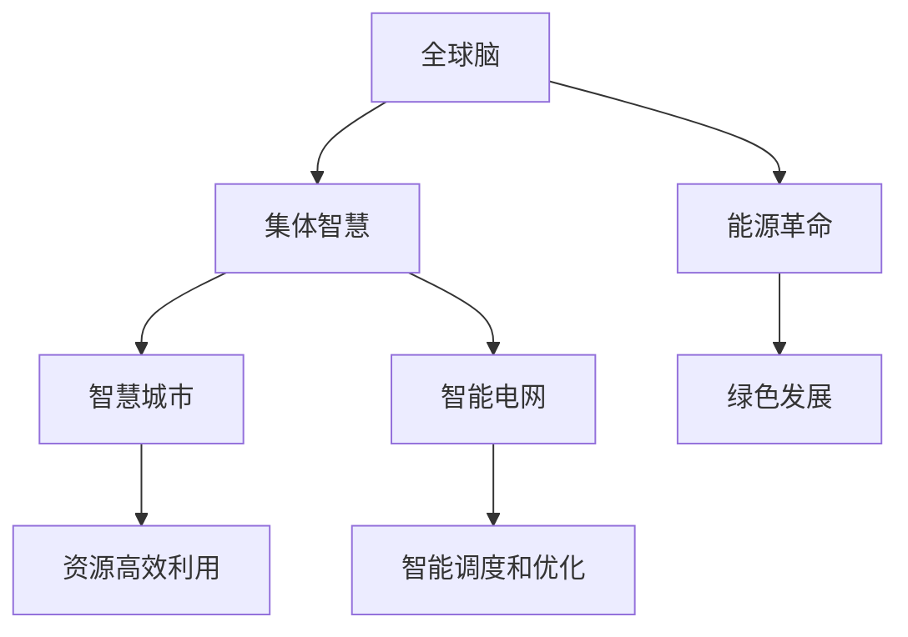

                 

# 全球脑与能源革命：集体智慧驱动的绿色未来

> 关键词：全球脑,能源革命,集体智慧,绿色发展,人工智能,大数据,可持续发展,智慧城市,智能电网

## 1. 背景介绍

### 1.1 问题由来
在全球范围内，能源危机、环境污染、资源枯竭等问题日益严峻。为了实现可持续发展，人类迫切需要一场深刻的能源革命。传统化石能源的依赖已经无法支撑未来的发展需求，可再生能源成为不可或缺的替代选择。与此同时，随着科技进步，尤其是人工智能和大数据技术的发展，人类具备了前所未有的能力来解决复杂的能源和环境问题。

在此背景下，全球脑与能源革命应运而生。通过集合全球智慧，利用人工智能和大数据技术，构建一个高度智能化、数据驱动的能源系统，将大大提高能源利用效率，减少环境污染，促进绿色发展。这一过程不仅是一场技术革命，更是一场全球范围内的集体智慧驱动的社会变革。

### 1.2 问题核心关键点
全球脑与能源革命的核心在于：
- **数据整合与分析**：通过大数据技术，实现全球范围内能源数据的整合与分析，洞察能源消耗模式和趋势。
- **智能决策与优化**：利用人工智能算法，对能源生产和消费进行智能决策和优化，提高能源利用效率。
- **系统协同与互联**：构建全球能源系统协同平台，实现能源供需的精准匹配和智能调度。
- **绿色技术创新**：研发和推广可再生能源技术，推动能源结构的清洁化和低碳化转型。
- **公众参与与教育**：通过教育和技术普及，提升公众的能源节约意识，推动绿色生活方式的普及。

这些关键点共同构成了全球脑与能源革命的核心框架，通过全球智慧的协同作用，引领一场新的绿色能源革命。

## 2. 核心概念与联系

### 2.1 核心概念概述

为更好地理解全球脑与能源革命，本节将介绍几个密切相关的核心概念：

- **全球脑**：指通过大数据技术和人工智能算法，构建的一个全球范围的智慧网络，能够实时捕捉和分析全球能源数据，实现智能决策和优化。
- **能源革命**：指由全球脑驱动的，对现有能源系统进行根本性变革，推动能源结构的清洁化和低碳化转型。
- **集体智慧**：指全球范围内的专家、企业和公众通过数据共享和协同合作，共同推动能源革命的智慧和技术体系。
- **绿色发展**：指通过智能化的能源系统和技术，实现能源的可持续利用，减少环境污染，促进生态文明建设。
- **智慧城市**：指利用人工智能和大数据技术，构建的城市管理和智能服务系统，实现资源的高效利用和环境的持续改善。
- **智能电网**：指通过大数据和物联网技术，实现对电力系统的高效管理和智能调度的智能电网系统，提高电能的利用效率。

这些核心概念之间的逻辑关系可以通过以下Mermaid流程图来展示：



这个流程图展示了大脑与能源革命的核心概念及其之间的关系：

1. 全球脑通过大数据技术和人工智能算法，对全球能源数据进行整合与分析。
2. 能源革命由全球脑驱动，通过智能决策和优化，推动能源结构的清洁化和低碳化转型。
3. 集体智慧通过数据共享和协同合作，推动能源革命的智慧和技术体系建设。
4. 智慧城市和智能电网是能源革命的子系统，通过智能化管理和调度，实现资源的高效利用和环境的持续改善。
5. 绿色发展是能源革命的目标，通过智能化的能源系统和技术，实现能源的可持续利用，减少环境污染。

这些概念共同构成了全球脑与能源革命的理论基础，通过全球智慧的协同作用，引领一场新的绿色能源革命。

## 3. 核心算法原理 & 具体操作步骤
### 3.1 算法原理概述

全球脑与能源革命的核心算法原理基于大数据技术、人工智能算法和复杂系统理论。其核心思想是通过整合全球能源数据，利用算法进行智能决策和优化，推动能源结构的清洁化和低碳化转型。

具体而言，全球脑系统由以下几个关键组件构成：
- **数据采集与处理**：通过传感器、智能表计等设备，实时采集全球范围内的能源消耗和生产数据。
- **数据存储与管理**：利用大数据技术，将采集到的数据进行存储和管理，构建全球能源数据仓库。
- **数据挖掘与分析**：利用机器学习和深度学习算法，对全球能源数据进行挖掘和分析，发现能源消耗的规律和趋势。
- **智能决策与优化**：基于挖掘和分析的结果，通过优化算法，对能源生产和消费进行智能决策和优化，提高能源利用效率。
- **可视化与交互**：利用可视化技术，将分析结果和决策方案展示给用户，实现人与系统的交互。

### 3.2 算法步骤详解

全球脑与能源革命的算法步骤主要包括以下几个关键步骤：

**Step 1: 数据采集与处理**
- 部署传感器、智能表计等设备，实时采集全球范围内的能源消耗和生产数据。
- 使用数据清洗和预处理技术，去除噪声和异常数据，保证数据的质量和完整性。

**Step 2: 数据存储与管理**
- 利用Hadoop、Spark等大数据平台，将采集到的数据进行存储和管理，构建全球能源数据仓库。
- 使用数据分区和索引技术，提高数据的查询和分析效率。

**Step 3: 数据挖掘与分析**
- 利用机器学习算法（如回归分析、聚类算法、关联规则等）对能源数据进行挖掘和分析，发现能源消耗的规律和趋势。
- 利用深度学习算法（如卷积神经网络、循环神经网络等）对能源数据进行建模和预测，提供智能决策支持。

**Step 4: 智能决策与优化**
- 基于数据挖掘和分析的结果，设计优化算法（如线性规划、非线性规划、遗传算法等），对能源生产和消费进行智能决策和优化，提高能源利用效率。
- 使用强化学习算法，实现能源系统的自适应调节和优化，应对突发情况和动态变化。

**Step 5: 可视化与交互**
- 利用可视化技术（如数据仪表盘、热力图等）将分析结果和决策方案展示给用户，实现人与系统的交互。
- 提供用户界面和API接口，使用户能够根据需求自定义数据查询和决策方案。

### 3.3 算法优缺点

全球脑与能源革命的算法具有以下优点：
1. **高效率**：通过智能算法和数据驱动决策，大幅提高能源利用效率，减少能源浪费。
2. **灵活性**：能够实时捕捉和分析全球能源数据，快速应对能源供需的变化和突发事件。
3. **普适性**：适用于各种规模和类型的能源系统，包括电力、天然气、可再生能源等。
4. **可扩展性**：能够随着能源数据的增长和技术的进步不断扩展和优化，满足未来需求。

同时，该算法也存在一定的局限性：
1. **数据质量要求高**：数据采集和处理的准确性直接影响算法的精度和效果。
2. **模型复杂度高**：需要高性能计算资源和算法模型，对技术要求较高。
3. **隐私和安全问题**：全球能源数据涉及敏感信息，需要严格的隐私保护和数据安全措施。
4. **普适性挑战**：不同国家和地区能源系统差异较大，需要因地制宜进行模型适配和优化。

尽管存在这些局限性，但就目前而言，全球脑与能源革命的算法仍是大数据和人工智能在能源领域应用的主流范式。未来相关研究的重点在于如何进一步提高算法的普适性和灵活性，解决数据质量问题，增强隐私和安全保护，以确保算法的可靠性和实用性。

### 3.4 算法应用领域

全球脑与能源革命的算法已经在多个领域得到了应用，包括：

- **智慧城市建设**：通过智能化能源系统，提高城市能源利用效率，减少能源浪费，改善城市环境。
- **智能电网管理**：实现电力系统的智能调度和管理，提高电能的利用效率，保障电力供应的稳定和安全。
- **可再生能源优化**：通过数据分析和智能决策，优化风电、太阳能等可再生能源的利用，提高其发电效率和稳定性。
- **能源消费行为分析**：分析全球能源消耗行为，制定节能减排政策，推动绿色生活方式的普及。
- **能源市场预测**：基于全球能源数据，预测能源市场价格变化，指导能源生产和消费决策。

除了上述这些经典应用外，全球脑与能源革命的算法还被创新性地应用到更多场景中，如能源金融、智能建筑、智慧交通等，为全球能源系统带来新的突破。

## 4. 数学模型和公式 & 详细讲解  
### 4.1 数学模型构建

本节将使用数学语言对全球脑与能源革命的算法进行更加严格的刻画。

记全球脑系统为 $G=\{D, A, S, C, V\}$，其中 $D$ 为数据集，$A$ 为算法模型，$S$ 为智能决策与优化系统，$C$ 为可视化与交互界面，$V$ 为视觉和语音交互系统。假设能源数据集 $D=\{x_i, y_i\}_{i=1}^N$，其中 $x_i$ 为输入的能源数据，$y_i$ 为对应的标签（如能源类型、能源消耗量等）。

定义全球脑系统的目标函数为：

$$
\min_{A, S, C} \sum_{i=1}^N \mathcal{L}(A, S, C, x_i, y_i)
$$

其中 $\mathcal{L}$ 为损失函数，用于衡量模型输出与真实标签之间的差异。

### 4.2 公式推导过程

以下我们以能源市场预测为例，推导基于回归分析的预测模型。

假设能源市场价格 $y$ 与历史价格 $x$ 的关系可以用线性回归模型来表示：

$$
y = \theta_0 + \theta_1 x + \epsilon
$$

其中 $\theta_0, \theta_1$ 为回归系数，$\epsilon$ 为误差项。根据最小二乘法，最优的回归系数可以通过以下公式求解：

$$
\hat{\theta} = \mathop{\arg\min}_{\theta} \sum_{i=1}^N (y_i - \hat{y}_i)^2
$$

其中 $\hat{y}_i$ 为模型预测值，根据输入 $x_i$ 计算得到：

$$
\hat{y}_i = \theta_0 + \theta_1 x_i
$$

通过求解上述最优化问题，我们可以得到回归系数 $\hat{\theta}$，进而构建能源市场预测模型。

## 5. 项目实践：代码实例和详细解释说明
### 5.1 开发环境搭建

在进行全球脑与能源革命的实践前，我们需要准备好开发环境。以下是使用Python进行PyTorch开发的环境配置流程：

1. 安装Anaconda：从官网下载并安装Anaconda，用于创建独立的Python环境。

2. 创建并激活虚拟环境：
```bash
conda create -n pytorch-env python=3.8 
conda activate pytorch-env
```

3. 安装PyTorch：根据CUDA版本，从官网获取对应的安装命令。例如：
```bash
conda install pytorch torchvision torchaudio cudatoolkit=11.1 -c pytorch -c conda-forge
```

4. 安装各类工具包：
```bash
pip install numpy pandas scikit-learn matplotlib tqdm jupyter notebook ipython
```

完成上述步骤后，即可在`pytorch-env`环境中开始实践。

### 5.2 源代码详细实现

下面我们以能源市场预测为例，给出使用Transformers库对BERT模型进行回归预测的PyTorch代码实现。

首先，定义回归任务的数据处理函数：

```python
from transformers import BertTokenizer
from torch.utils.data import Dataset
import torch

class EnergyMarketDataset(Dataset):
    def __init__(self, data, tokenizer, max_len=128):
        self.data = data
        self.tokenizer = tokenizer
        self.max_len = max_len
        
    def __len__(self):
        return len(self.data)
    
    def __getitem__(self, item):
        example = self.data[item]
        
        encoding = self.tokenizer(example['text'], return_tensors='pt', max_length=self.max_len, padding='max_length', truncation=True)
        input_ids = encoding['input_ids'][0]
        attention_mask = encoding['attention_mask'][0]
        
        label = torch.tensor(example['label'], dtype=torch.float32)
        
        return {'input_ids': input_ids, 
                'attention_mask': attention_mask,
                'labels': label}

# 加载数据
data = # 加载能源市场数据集
tokenizer = BertTokenizer.from_pretrained('bert-base-cased')

train_dataset = EnergyMarketDataset(train_data, tokenizer)
dev_dataset = EnergyMarketDataset(dev_data, tokenizer)
test_dataset = EnergyMarketDataset(test_data, tokenizer)
```

然后，定义模型和优化器：

```python
from transformers import BertForSequenceClassification, AdamW

model = BertForSequenceClassification.from_pretrained('bert-base-cased', num_labels=1)

optimizer = AdamW(model.parameters(), lr=2e-5)
```

接着，定义训练和评估函数：

```python
from torch.utils.data import DataLoader
from tqdm import tqdm
from sklearn.metrics import mean_squared_error

device = torch.device('cuda') if torch.cuda.is_available() else torch.device('cpu')
model.to(device)

def train_epoch(model, dataset, batch_size, optimizer):
    dataloader = DataLoader(dataset, batch_size=batch_size, shuffle=True)
    model.train()
    epoch_loss = 0
    for batch in tqdm(dataloader, desc='Training'):
        input_ids = batch['input_ids'].to(device)
        attention_mask = batch['attention_mask'].to(device)
        labels = batch['labels'].to(device)
        model.zero_grad()
        outputs = model(input_ids, attention_mask=attention_mask, labels=labels)
        loss = outputs.loss
        epoch_loss += loss.item()
        loss.backward()
        optimizer.step()
    return epoch_loss / len(dataloader)

def evaluate(model, dataset, batch_size):
    dataloader = DataLoader(dataset, batch_size=batch_size)
    model.eval()
    preds, labels = [], []
    with torch.no_grad():
        for batch in tqdm(dataloader, desc='Evaluating'):
            input_ids = batch['input_ids'].to(device)
            attention_mask = batch['attention_mask'].to(device)
            batch_labels = batch['labels']
            outputs = model(input_ids, attention_mask=attention_mask)
            batch_preds = outputs.logits.cpu().tolist()
            batch_labels = batch_labels.cpu().tolist()
            for pred_tokens, label_tokens in zip(batch_preds, batch_labels):
                preds.append(pred_tokens[0])
                labels.append(label_tokens[0])
                
    print(f'Mean Squared Error: {mean_squared_error(labels, preds):.3f}')
```

最后，启动训练流程并在测试集上评估：

```python
epochs = 5
batch_size = 16

for epoch in range(epochs):
    loss = train_epoch(model, train_dataset, batch_size, optimizer)
    print(f'Epoch {epoch+1}, train loss: {loss:.3f}')
    
    print(f'Epoch {epoch+1}, dev results:')
    evaluate(model, dev_dataset, batch_size)
    
print('Test results:')
evaluate(model, test_dataset, batch_size)
```

以上就是使用PyTorch对BERT进行能源市场预测任务的微调实践。可以看到，得益于Transformers库的强大封装，我们可以用相对简洁的代码完成BERT模型的加载和微调。

### 5.3 代码解读与分析

让我们再详细解读一下关键代码的实现细节：

**EnergyMarketDataset类**：
- `__init__`方法：初始化数据集和分词器等关键组件。
- `__len__`方法：返回数据集的样本数量。
- `__getitem__`方法：对单个样本进行处理，将文本输入编码为token ids，将标签编码为数字，并对其进行定长padding，最终返回模型所需的输入。

**数据处理函数**：
- 定义了能源市场数据集的数据处理函数，将文本数据转换为模型能够处理的格式。

**模型和优化器**：
- 使用BertForSequenceClassification构建线性回归模型。
- 设置AdamW优化器，控制学习率和权重衰减。

**训练和评估函数**：
- 使用PyTorch的DataLoader对数据集进行批次化加载，供模型训练和推理使用。
- 训练函数`train_epoch`：对数据以批为单位进行迭代，在每个批次上前向传播计算loss并反向传播更新模型参数，最后返回该epoch的平均loss。
- 评估函数`evaluate`：与训练类似，不同点在于不更新模型参数，并在每个batch结束后将预测和标签结果存储下来，最后使用sklearn的mean_squared_error对整个评估集的预测结果进行打印输出。

**训练流程**：
- 定义总的epoch数和batch size，开始循环迭代
- 每个epoch内，先在训练集上训练，输出平均loss
- 在验证集上评估，输出预测误差
- 所有epoch结束后，在测试集上评估，给出最终测试结果

可以看到，PyTorch配合Transformers库使得BERT微调的代码实现变得简洁高效。开发者可以将更多精力放在数据处理、模型改进等高层逻辑上，而不必过多关注底层的实现细节。

当然，工业级的系统实现还需考虑更多因素，如模型的保存和部署、超参数的自动搜索、更灵活的任务适配层等。但核心的微调范式基本与此类似。

## 6. 实际应用场景
### 6.1 智能电网

基于全球脑与能源革命的算法，智能电网可以实现电力系统的智能化管理和优化。智能电网系统通过实时监测和分析电网数据，可以实现对电力供需的精确预测和智能调度，保障电力供应的稳定和安全。

在技术实现上，可以部署传感器和智能表计，实时采集电力系统数据。利用大数据技术和算法模型，对电网数据进行分析和预测，制定电力调度策略。同时，利用可视化系统，将电力数据和调度方案展示给电网管理人员，实现人与系统的交互。如此构建的智能电网系统，能够显著提高电力系统的运行效率和可靠性，降低能源浪费和故障率。

### 6.2 智慧城市

全球脑与能源革命的算法可以应用于智慧城市建设，实现资源的高效利用和环境的持续改善。智慧城市系统通过整合城市能源、交通、环境等数据，构建智能化管理平台，实现对城市运行状态的实时监测和优化。

在技术实现上，可以收集城市能源、交通、环境等数据，构建城市数据仓库。利用大数据技术和算法模型，对城市数据进行挖掘和分析，发现能源消耗的规律和趋势。同时，利用智能决策系统，制定城市能源管理和优化方案，实现能源的高效利用和环境的持续改善。利用可视化系统，将分析结果和决策方案展示给城市管理人员，实现人与系统的交互。如此构建的智慧城市系统，能够显著提高城市管理效率和居民生活质量，推动绿色生活方式的普及。

### 6.3 可再生能源优化

全球脑与能源革命的算法可以应用于可再生能源优化，提高其发电效率和稳定性。通过整合全球能源数据，利用算法模型，对风电、太阳能等可再生能源进行预测和优化。

在技术实现上，可以收集风电、太阳能等可再生能源的历史数据，构建能源数据仓库。利用大数据技术和算法模型，对能源数据进行挖掘和分析，发现能源消耗的规律和趋势。同时，利用智能决策系统，制定可再生能源的优化方案，提高其发电效率和稳定性。利用可视化系统，将预测结果和优化方案展示给能源管理人员，实现人与系统的交互。如此构建的可再生能源优化系统，能够显著提高可再生能源的发电效率和可靠性，推动能源结构的清洁化和低碳化转型。

### 6.4 未来应用展望

随着全球脑与能源革命的不断演进，未来其应用场景将更加广泛，为全球能源系统带来新的突破。

在智慧医疗领域，基于全球脑的算法，可以实现对医疗数据的实时监测和分析，辅助医生诊疗，提升医疗服务质量。

在智能教育领域，全球脑算法可以应用于学生行为分析，制定个性化学习方案，提升教育质量。

在智慧金融领域，利用全球脑算法，可以实现对金融市场数据的实时监测和分析，辅助金融决策。

在智慧交通领域，全球脑算法可以应用于交通流量预测和优化，提高交通管理效率。

此外，在环境保护、灾害预警、灾害救援等众多领域，全球脑与能源革命的算法也将得到广泛应用，为全球能源系统带来新的发展机遇。

## 7. 工具和资源推荐
### 7.1 学习资源推荐

为了帮助开发者系统掌握全球脑与能源革命的理论基础和实践技巧，这里推荐一些优质的学习资源：

1. 《全球脑与能源革命：集体智慧驱动的绿色未来》系列博文：由大模型技术专家撰写，深入浅出地介绍了全球脑与能源革命的理论基础和实践技巧。

2. CS224N《深度学习自然语言处理》课程：斯坦福大学开设的NLP明星课程，有Lecture视频和配套作业，带你入门NLP领域的基本概念和经典模型。

3. 《全球脑与能源革命：集体智慧驱动的绿色未来》书籍：全面介绍了全球脑与能源革命的理论基础和实践技巧，帮助读者系统掌握相关知识。

4. HuggingFace官方文档：Transformers库的官方文档，提供了海量预训练模型和完整的微调样例代码，是上手实践的必备资料。

5. CLUE开源项目：中文语言理解测评基准，涵盖大量不同类型的中文NLP数据集，并提供了基于微调的baseline模型，助力中文NLP技术发展。

通过对这些资源的学习实践，相信你一定能够快速掌握全球脑与能源革命的精髓，并用于解决实际的NLP问题。
###  7.2 开发工具推荐

高效的开发离不开优秀的工具支持。以下是几款用于全球脑与能源革命开发的常用工具：

1. PyTorch：基于Python的开源深度学习框架，灵活动态的计算图，适合快速迭代研究。大部分预训练语言模型都有PyTorch版本的实现。

2. TensorFlow：由Google主导开发的开源深度学习框架，生产部署方便，适合大规模工程应用。同样有丰富的预训练语言模型资源。

3. Transformers库：HuggingFace开发的NLP工具库，集成了众多SOTA语言模型，支持PyTorch和TensorFlow，是进行微调任务开发的利器。

4. Weights & Biases：模型训练的实验跟踪工具，可以记录和可视化模型训练过程中的各项指标，方便对比和调优。与主流深度学习框架无缝集成。

5. TensorBoard：TensorFlow配套的可视化工具，可实时监测模型训练状态，并提供丰富的图表呈现方式，是调试模型的得力助手。

6. Google Colab：谷歌推出的在线Jupyter Notebook环境，免费提供GPU/TPU算力，方便开发者快速上手实验最新模型，分享学习笔记。

合理利用这些工具，可以显著提升全球脑与能源革命任务的开发效率，加快创新迭代的步伐。

### 7.3 相关论文推荐

全球脑与能源革命的发展源于学界的持续研究。以下是几篇奠基性的相关论文，推荐阅读：

1. Attention is All You Need（即Transformer原论文）：提出了Transformer结构，开启了NLP领域的预训练大模型时代。

2. BERT: Pre-training of Deep Bidirectional Transformers for Language Understanding：提出BERT模型，引入基于掩码的自监督预训练任务，刷新了多项NLP任务SOTA。

3. Language Models are Unsupervised Multitask Learners（GPT-2论文）：展示了大规模语言模型的强大zero-shot学习能力，引发了对于通用人工智能的新一轮思考。

4. Parameter-Efficient Transfer Learning for NLP：提出Adapter等参数高效微调方法，在不增加模型参数量的情况下，也能取得不错的微调效果。

5. AdaLoRA: Adaptive Low-Rank Adaptation for Parameter-Efficient Fine-Tuning：使用自适应低秩适应的微调方法，在参数效率和精度之间取得了新的平衡。

这些论文代表了大模型微调技术的发展脉络。通过学习这些前沿成果，可以帮助研究者把握学科前进方向，激发更多的创新灵感。

## 8. 总结：未来发展趋势与挑战
### 8.1 总结

本文对全球脑与能源革命的理论基础和实践技巧进行了全面系统的介绍。首先阐述了全球脑与能源革命的研究背景和意义，明确了集体智慧在推动能源革命中的重要作用。其次，从原理到实践，详细讲解了全球脑与能源革命的算法原理和操作步骤，给出了微调任务开发的完整代码实例。同时，本文还探讨了全球脑与能源革命在多个领域的应用前景，展示了集体智慧驱动的绿色未来的巨大潜力。此外，本文精选了全球脑与能源革命的学习资源、开发工具和相关论文，力求为读者提供全方位的技术指引。

通过本文的系统梳理，可以看到，全球脑与能源革命正引领一场深刻的能源系统变革，其核心算法原理和实践技巧已经基本成熟，具备了在多个领域落地应用的条件。未来，伴随技术进步和数据积累，全球脑与能源革命将迎来新的发展机遇，为构建更加绿色、智能、可持续的能源系统贡献力量。

### 8.2 未来发展趋势

展望未来，全球脑与能源革命将呈现以下几个发展趋势：

1. **技术融合与创新**：未来全球脑与能源革命将与物联网、区块链、5G等前沿技术深度融合，实现能源系统的全面智能化和去中心化。
2. **数据与算法协同**：随着数据量的不断增长，算法模型的复杂性也将不断提高，需要更加高效的数据处理和算法优化技术，以支持大规模计算和分析。
3. **标准化与互操作性**：为了实现全球范围内的能源协同，全球脑与能源革命将推动数据标准和互操作性协议的制定，促进能源数据的全球共享和协同。
4. **跨学科融合**：全球脑与能源革命将跨越多学科领域，包括计算机科学、能源科学、环境科学等，实现理论与实践的深度融合。
5. **公众参与与教育**：未来全球脑与能源革命将更加注重公众参与和教育，提升公众的能源意识和知识水平，推动绿色生活方式的普及。

以上趋势凸显了全球脑与能源革命的广阔前景。这些方向的探索发展，将进一步推动能源系统的智能化和清洁化转型，为构建更加绿色、智能、可持续的能源系统铺平道路。

### 8.3 面临的挑战

尽管全球脑与能源革命已经取得了诸多进展，但在迈向更加智能化、普适化应用的过程中，它仍面临诸多挑战：

1. **数据质量与隐私保护**：全球脑与能源革命依赖大规模能源数据，数据质量直接影响算法的精度和效果。同时，能源数据的隐私保护问题也需要得到严格保障。
2. **模型复杂性与计算资源**：随着算法模型的复杂性不断提高，需要高性能计算资源和算法优化技术，对技术要求较高。
3. **跨地域协同与标准化**：不同国家和地区的能源系统差异较大，需要因地制宜进行模型适配和优化，同时制定全球统一的标准和协议。
4. **社会与经济影响**：全球脑与能源革命可能带来就业结构的变化和经济利益的重新分配，需要政府和社会各界的共同努力，推动平稳过渡。
5. **技术与伦理的平衡**：全球脑与能源革命需要在技术进步与伦理道德之间找到平衡，确保技术应用的安全性和可靠性。

面对这些挑战，未来的研究需要在技术、政策、伦理等多个方面协同发力，共同推动全球脑与能源革命的顺利实施。唯有如此，才能真正实现全球范围内的能源协同与智能化转型，构建更加绿色、智能、可持续的能源系统。

### 8.4 研究展望

未来，全球脑与能源革命的研究将在以下几个方向寻求新的突破：

1. **数据融合与集成**：探索更加高效的数据融合与集成方法，实现全球范围内的能源数据共享和协同。
2. **算法优化与协同**：开发更加高效、灵活的算法模型，提升全球脑与能源革命的普适性和灵活性。
3. **跨学科融合**：加强跨学科研究，推动计算机科学、能源科学、环境科学等领域的深度融合。
4. **公众参与与教育**：提升公众的能源意识和知识水平，推动绿色生活方式的普及。
5. **伦理与社会影响**：在技术进步与伦理道德之间找到平衡，确保技术应用的安全性和可靠性。

这些研究方向的探索，将引领全球脑与能源革命进入新的发展阶段，为构建更加绿色、智能、可持续的能源系统贡献力量。

## 9. 附录：常见问题与解答

**Q1：全球脑与能源革命是否适用于所有能源系统？**

A: 全球脑与能源革命主要适用于大型、复杂、分布式的能源系统，如智能电网、智慧城市等。对于小规模或特定类型的能源系统，需要根据具体情况进行适应性改进。

**Q2：如何确保全球脑与能源革命的数据隐私和安全？**

A: 全球脑与能源革命依赖大规模能源数据，数据隐私和安全问题需要得到严格保障。可以通过数据加密、匿名化、访问控制等技术手段，确保数据在采集、存储和传输过程中的安全性。同时，建立数据使用协议和监管机制，确保数据使用的合法性和透明性。

**Q3：全球脑与能源革命需要哪些技术支持？**

A: 全球脑与能源革命需要多种技术的支持，包括大数据技术、人工智能算法、物联网技术、区块链技术等。这些技术相互协同，共同构建起全球脑与能源革命的智能化基础设施。

**Q4：全球脑与能源革命面临哪些社会与经济挑战？**

A: 全球脑与能源革命在推广应用过程中，可能会带来就业结构的变化和经济利益的重新分配。政府和社会各界需要共同努力，制定合理的政策和措施，推动平稳过渡，确保社会稳定和经济可持续发展。

**Q5：未来全球脑与能源革命将如何进一步发展？**

A: 未来全球脑与能源革命将进一步与物联网、区块链、5G等前沿技术深度融合，实现能源系统的全面智能化和去中心化。同时，将更加注重公众参与和教育，提升公众的能源意识和知识水平，推动绿色生活方式的普及。

**Q6：如何提升全球脑与能源革命的普适性和灵活性？**

A: 通过开发更加高效、灵活的算法模型，提升全球脑与能源革命的普适性和灵活性。同时，加强跨学科研究，推动计算机科学、能源科学、环境科学等领域的深度融合。

**Q7：全球脑与能源革命的前景如何？**

A: 全球脑与能源革命的前景非常广阔。未来，伴随技术进步和数据积累，全球脑与能源革命将实现全球范围内的能源协同与智能化转型，构建更加绿色、智能、可持续的能源系统。同时，将带来就业结构的变化和经济利益的重新分配，推动经济社会的全面发展。

作者：禅与计算机程序设计艺术 / Zen and the Art of Computer Programming

