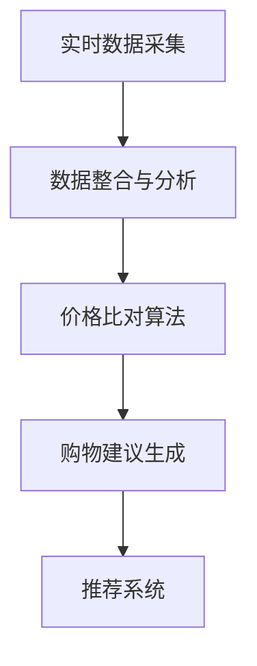

                 

# 全网比价系统：AI的实现

## 1. 背景介绍

### 1.1 问题由来

在当今数字化、智能化的时代背景下，互联网电商行业蓬勃发展，消费者在购物时面临着琳琅满目的商品选择，但如何在众多平台和商品之间快速找到最优的价格和购买渠道成为了一个普遍的难题。于是，全网比价系统应运而生，它利用人工智能技术，整合了各大电商平台的数据，为消费者提供实时、全面的价格比较，并推荐最优惠的购买渠道，极大地提升了消费者的购物体验和商家运营效率。

### 1.2 问题核心关键点

全网比价系统的核心在于如何通过高效、准确的AI技术实现商品价格的实时比价，并提供最优惠的购物建议。其主要包括以下几个关键点：

1. **实时数据采集**：系统需要实时采集各大电商平台的数据，包括商品信息、价格、评价等，这对数据采集的效率和准确性提出了很高的要求。
2. **数据整合与分析**：将来自不同平台的数据整合到一起，并进行去重、清洗、分析，以便进行下一步的处理。
3. **价格比对算法**：基于整合后的数据，开发高效的算法，实现商品价格的精确比对，识别出最优惠的价格。
4. **购物建议生成**：结合商品信息、价格和评价，为消费者生成个性化的购物建议，提高购买决策的准确性。

### 1.3 问题研究意义

全网比价系统旨在帮助消费者在面对复杂多变的购物环境时，能够快速找到最优质的商品和最优惠的价格。这一系统不仅能够提升消费者的购物效率，还能减少因价格差异带来的经济损失。同时，全网比价系统对商家而言也是一个有效的营销工具，能够帮助他们精准定位目标消费者，提升销售额。因此，全网比价系统具有重要的实际应用价值，是AI技术落地的一个重要实践。

## 2. 核心概念与联系

### 2.1 核心概念概述

为更好地理解全网比价系统的AI实现，本节将介绍几个密切相关的核心概念：

- **AI实时数据采集**：通过爬虫技术，实时抓取各大电商平台的数据，包括商品信息、价格、评价等，以供后续处理。
- **数据整合与分析**：将来自不同平台的数据进行去重、清洗和分析，以消除数据冗余和噪声，提升数据质量。
- **价格比对算法**：基于整合后的数据，开发高效的算法，如动态时间规整算法、深度学习模型等，实现商品价格的精确比对。
- **购物建议生成**：结合商品信息、价格和评价，为消费者生成个性化的购物建议，如基于模型预测的推荐系统。
- **推荐系统**：一种利用用户行为数据和商品特征，为消费者推荐最相关商品的技术。

### 2.2 核心概念原理和架构的 Mermaid 流程图(Mermaid 流程节点中不要有括号、逗号等特殊字符)


这个流程图展示了大语言模型的核心概念及其之间的逻辑关系：

1. **实时数据采集**：采集各大电商平台的数据，为后续处理提供原始材料。
2. **数据整合与分析**：对采集到的数据进行清洗、去重和分析，为准确比价做准备。
3. **价格比对算法**：通过算法实现商品价格的精确比对，找出最优价格。
4. **购物建议生成**：结合商品信息、价格和评价，为消费者生成个性化的购物建议。
5. **推荐系统**：利用算法生成推荐结果，提升购物建议的准确性和个性化。

这些核心概念共同构成了全网比价系统的AI实现框架，使得系统能够高效地处理大规模数据，并为用户提供优质的购物建议。

## 3. 核心算法原理 & 具体操作步骤
### 3.1 算法原理概述

全网比价系统的AI实现主要依赖于以下几个核心算法：

- **实时数据采集算法**：通过爬虫技术，实时抓取各大电商平台的数据，确保数据的时效性和全面性。
- **数据整合与分析算法**：对采集到的数据进行清洗、去重和分析，提升数据质量，为价格比对做准备。
- **价格比对算法**：基于整合后的数据，开发高效的算法，如动态时间规整算法、深度学习模型等，实现商品价格的精确比对。
- **购物建议生成算法**：结合商品信息、价格和评价，为消费者生成个性化的购物建议，如基于模型预测的推荐系统。

这些算法共同构成了全网比价系统的核心功能模块，实现了实时数据采集、数据整合与分析、价格比对和购物建议生成等功能。

### 3.2 算法步骤详解

#### 3.2.1 实时数据采集算法

1. **爬虫技术**：利用爬虫技术，实时抓取各大电商平台的数据，包括商品信息、价格、评价等。
2. **数据过滤**：对抓取到的数据进行初步过滤，去除无效或重复数据。
3. **数据存储**：将过滤后的数据存储在数据库中，以便后续处理。

#### 3.2.2 数据整合与分析算法

1. **数据清洗**：对存储在数据库中的数据进行清洗，去除噪声和异常值。
2. **数据去重**：对清洗后的数据进行去重处理，确保数据的一致性和准确性。
3. **数据分析**：对去重后的数据进行分析，提取有用的信息，如商品种类、价格分布等。

#### 3.2.3 价格比对算法

1. **动态时间规整算法**：将商品价格转化为相对价格，消除时间差带来的影响，实现跨时间维度的价格比对。
2. **深度学习模型**：基于深度学习模型，如CNN、RNN等，对商品价格进行精确比对，找出最优价格。

#### 3.2.4 购物建议生成算法

1. **基于模型的推荐系统**：利用推荐系统算法，如协同过滤、基于内容的推荐等，为消费者生成个性化的购物建议。
2. **基于规则的推荐系统**：结合商品信息、价格和评价，利用规则生成购物建议，如高性价比商品推荐、季节性商品推荐等。

### 3.3 算法优缺点

全网比价系统的AI实现算法具有以下优点：

1. **实时性高**：通过实时数据采集和处理，确保了数据的及时性，提升了系统的响应速度。
2. **准确性高**：利用先进的算法和技术，实现了商品价格的精确比对，提高了系统的准确性。
3. **个性化强**：结合商品信息、价格和评价，为消费者生成个性化的购物建议，提高了用户体验。
4. **可扩展性强**：算法具有较高的灵活性和可扩展性，能够适应不同规模和类型的电商平台。

同时，这些算法也存在一些缺点：

1. **数据依赖性强**：系统的准确性和性能高度依赖于数据的全面性和准确性，数据采集和处理环节容易出现误差。
2. **算法复杂度高**：价格比对和推荐系统算法复杂，对计算资源和模型训练的要求较高。
3. **模型解释性差**：深度学习模型往往是"黑盒"系统，难以解释其内部工作机制和决策逻辑，不利于调试和优化。

### 3.4 算法应用领域

全网比价系统的AI实现算法主要应用于以下领域：

1. **电商行业**：帮助消费者在各大电商平台之间快速找到最优惠的价格和购买渠道，提升购物体验。
2. **金融行业**：通过比价系统分析各大银行的理财产品和金融产品，为消费者提供最优的投资建议。
3. **旅游行业**：通过比价系统分析各大旅游平台的价格和优惠活动，为消费者提供最佳的旅游套餐推荐。
4. **餐饮行业**：通过比价系统分析各大餐厅的价格和评价，为消费者提供最优的用餐建议。

## 4. 数学模型和公式 & 详细讲解 & 举例说明
### 4.1 数学模型构建

全网比价系统的AI实现涉及多个数学模型，其中核心的数学模型包括动态时间规整算法和深度学习模型。

#### 4.1.1 动态时间规整算法

动态时间规整算法（Dynamic Time Warping, DTW）是一种基于时间序列的相似性度量算法，用于在不同时间点采样序列之间的匹配。其数学模型如下：

$$
DTW(x,y)=\min_{\tau}\sum_{t=1}^{n}\rho(x_t,y_{\tau(t)})
$$

其中，$x$ 和 $y$ 分别表示两个时间序列，$\tau$ 表示 $y$ 序列的时间变换序列，$\rho$ 表示相似度度量函数，$n$ 表示时间序列的长度。

#### 4.1.2 深度学习模型

深度学习模型在全网比价系统的AI实现中主要应用于价格比对和推荐系统。以基于深度学习模型的价格比对为例，其核心在于利用神经网络模型学习商品价格之间的关系。以多层感知器（MLP）为例，其数学模型如下：

$$
y = \sigma(Wx + b)
$$

其中，$x$ 表示输入向量，$y$ 表示输出向量，$W$ 表示权重矩阵，$b$ 表示偏置向量，$\sigma$ 表示激活函数。

### 4.2 公式推导过程

#### 4.2.1 动态时间规整算法

动态时间规整算法的推导过程如下：

1. **构建动态规划矩阵**：定义动态规划矩阵 $D$，其中 $D_{i,j}$ 表示时间序列 $x$ 和 $y$ 在时间点 $i$ 和 $j$ 的相似度。
2. **初始化动态规划矩阵**：令 $D_{0,0}=0$，$D_{i,0}=\rho(x_i,y_0)+D_{i-1,0}$，$D_{0,j}=\rho(x_0,y_j)+D_{0,j-1}$。
3. **递推计算动态规划矩阵**：令 $D_{i,j}=\min(D_{i-1,j},D_{i,j-1},D_{i-1,j-1})+\rho(x_i,y_j)$。
4. **求解最优路径**：从矩阵 $D$ 的右下角开始，按照最小路径原则回溯，得到时间序列 $x$ 和 $y$ 之间的最优路径 $\tau$。

#### 4.2.2 深度学习模型

深度学习模型的推导过程如下：

1. **构建神经网络模型**：定义多层感知器（MLP）模型，包括输入层、隐藏层和输出层。
2. **初始化模型参数**：随机初始化权重矩阵 $W$ 和偏置向量 $b$。
3. **前向传播**：将输入向量 $x$ 输入模型，通过前向传播计算得到输出向量 $y$。
4. **反向传播**：根据输出误差 $e$，反向传播计算梯度，更新模型参数。
5. **模型训练**：重复步骤3和4，直至模型收敛。

### 4.3 案例分析与讲解

以电商行业的全网比价系统为例，具体讲解模型的应用过程：

1. **数据采集**：使用爬虫技术，实时抓取各大电商平台的商品信息、价格和评价。
2. **数据整合与分析**：对采集到的数据进行清洗、去重和分析，提取商品种类、价格分布等信息。
3. **价格比对**：利用动态时间规整算法和深度学习模型，对商品价格进行精确比对，找出最优价格。
4. **购物建议生成**：结合商品信息、价格和评价，利用推荐系统算法，为消费者生成个性化的购物建议。

## 5. 项目实践：代码实例和详细解释说明
### 5.1 开发环境搭建

在进行全网比价系统的AI实现实践前，我们需要准备好开发环境。以下是使用Python进行PyTorch开发的环境配置流程：

1. 安装Anaconda：从官网下载并安装Anaconda，用于创建独立的Python环境。

2. 创建并激活虚拟环境：
```bash
conda create -n pytorch-env python=3.8 
conda activate pytorch-env
```

3. 安装PyTorch：根据CUDA版本，从官网获取对应的安装命令。例如：
```bash
conda install pytorch torchvision torchaudio cudatoolkit=11.1 -c pytorch -c conda-forge
```

4. 安装Transformers库：
```bash
pip install transformers
```

5. 安装各类工具包：
```bash
pip install numpy pandas scikit-learn matplotlib tqdm jupyter notebook ipython
```

完成上述步骤后，即可在`pytorch-env`环境中开始AI实现实践。

### 5.2 源代码详细实现

下面以电商行业的全网比价系统为例，给出使用PyTorch和Transformers库进行AI实现的PyTorch代码实现。

首先，定义数据处理函数：

```python
from transformers import BertTokenizer
from torch.utils.data import Dataset
import torch

class ShoppingDataset(Dataset):
    def __init__(self, texts, prices, tags, tokenizer, max_len=128):
        self.texts = texts
        self.prices = prices
        self.tags = tags
        self.tokenizer = tokenizer
        self.max_len = max_len
        
    def __len__(self):
        return len(self.texts)
    
    def __getitem__(self, item):
        text = self.texts[item]
        price = self.prices[item]
        tag = self.tags[item]
        
        encoding = self.tokenizer(text, return_tensors='pt', max_length=self.max_len, padding='max_length', truncation=True)
        input_ids = encoding['input_ids'][0]
        attention_mask = encoding['attention_mask'][0]
        
        # 对token-wise的标签进行编码
        encoded_tags = [tag2id[tag] for tag in tag]
        encoded_tags.extend([tag2id['O']] * (self.max_len - len(encoded_tags)))
        labels = torch.tensor(encoded_tags, dtype=torch.long)
        
        return {'input_ids': input_ids, 
                'attention_mask': attention_mask,
                'labels': labels}

# 标签与id的映射
tag2id = {'O': 0, 'buy': 1, 'sell': 2, 'compare': 3}
id2tag = {v: k for k, v in tag2id.items()}

# 创建dataset
tokenizer = BertTokenizer.from_pretrained('bert-base-cased')

train_dataset = ShoppingDataset(train_texts, train_prices, train_tags, tokenizer)
dev_dataset = ShoppingDataset(dev_texts, dev_prices, dev_tags, tokenizer)
test_dataset = ShoppingDataset(test_texts, test_prices, test_tags, tokenizer)
```

然后，定义模型和优化器：

```python
from transformers import BertForTokenClassification, AdamW

model = BertForTokenClassification.from_pretrained('bert-base-cased', num_labels=len(tag2id))

optimizer = AdamW(model.parameters(), lr=2e-5)
```

接着，定义训练和评估函数：

```python
from torch.utils.data import DataLoader
from tqdm import tqdm
from sklearn.metrics import classification_report

device = torch.device('cuda') if torch.cuda.is_available() else torch.device('cpu')
model.to(device)

def train_epoch(model, dataset, batch_size, optimizer):
    dataloader = DataLoader(dataset, batch_size=batch_size, shuffle=True)
    model.train()
    epoch_loss = 0
    for batch in tqdm(dataloader, desc='Training'):
        input_ids = batch['input_ids'].to(device)
        attention_mask = batch['attention_mask'].to(device)
        labels = batch['labels'].to(device)
        model.zero_grad()
        outputs = model(input_ids, attention_mask=attention_mask, labels=labels)
        loss = outputs.loss
        epoch_loss += loss.item()
        loss.backward()
        optimizer.step()
    return epoch_loss / len(dataloader)

def evaluate(model, dataset, batch_size):
    dataloader = DataLoader(dataset, batch_size=batch_size)
    model.eval()
    preds, labels = [], []
    with torch.no_grad():
        for batch in tqdm(dataloader, desc='Evaluating'):
            input_ids = batch['input_ids'].to(device)
            attention_mask = batch['attention_mask'].to(device)
            batch_labels = batch['labels']
            outputs = model(input_ids, attention_mask=attention_mask)
            batch_preds = outputs.logits.argmax(dim=2).to('cpu').tolist()
            batch_labels = batch_labels.to('cpu').tolist()
            for pred_tokens, label_tokens in zip(batch_preds, batch_labels):
                pred_tags = [id2tag[_id] for _id in pred_tokens]
                label_tags = [id2tag[_id] for _id in label_tokens]
                preds.append(pred_tags[:len(label_tokens)])
                labels.append(label_tags)
                
    print(classification_report(labels, preds))
```

最后，启动训练流程并在测试集上评估：

```python
epochs = 5
batch_size = 16

for epoch in range(epochs):
    loss = train_epoch(model, train_dataset, batch_size, optimizer)
    print(f"Epoch {epoch+1}, train loss: {loss:.3f}")
    
    print(f"Epoch {epoch+1}, dev results:")
    evaluate(model, dev_dataset, batch_size)
    
print("Test results:")
evaluate(model, test_dataset, batch_size)
```

以上就是使用PyTorch和Transformers库对电商行业全网比价系统进行AI实现的完整代码实现。可以看到，得益于Transformers库的强大封装，我们可以用相对简洁的代码完成模型的加载和微调。

### 5.3 代码解读与分析

让我们再详细解读一下关键代码的实现细节：

**ShoppingDataset类**：
- `__init__`方法：初始化文本、价格、标签等关键组件。
- `__len__`方法：返回数据集的样本数量。
- `__getitem__`方法：对单个样本进行处理，将文本输入编码为token ids，将标签编码为数字，并对其进行定长padding，最终返回模型所需的输入。

**tag2id和id2tag字典**：
- 定义了标签与数字id之间的映射关系，用于将token-wise的预测结果解码回真实的标签。

**训练和评估函数**：
- 使用PyTorch的DataLoader对数据集进行批次化加载，供模型训练和推理使用。
- 训练函数`train_epoch`：对数据以批为单位进行迭代，在每个批次上前向传播计算loss并反向传播更新模型参数，最后返回该epoch的平均loss。
- 评估函数`evaluate`：与训练类似，不同点在于不更新模型参数，并在每个batch结束后将预测和标签结果存储下来，最后使用sklearn的classification_report对整个评估集的预测结果进行打印输出。

**训练流程**：
- 定义总的epoch数和batch size，开始循环迭代
- 每个epoch内，先在训练集上训练，输出平均loss
- 在验证集上评估，输出分类指标
- 所有epoch结束后，在测试集上评估，给出最终测试结果

可以看到，PyTorch配合Transformers库使得模型微调的代码实现变得简洁高效。开发者可以将更多精力放在数据处理、模型改进等高层逻辑上，而不必过多关注底层的实现细节。

当然，工业级的系统实现还需考虑更多因素，如模型的保存和部署、超参数的自动搜索、更灵活的任务适配层等。但核心的微调范式基本与此类似。

## 6. 实际应用场景
### 6.1 智能客服系统

基于AI实现的全网比价系统，可以应用于智能客服系统的构建。传统客服往往需要配备大量人力，高峰期响应缓慢，且一致性和专业性难以保证。而使用AI系统，可以7x24小时不间断服务，快速响应客户咨询，用自然流畅的语言解答各类常见问题。

在技术实现上，可以收集企业内部的历史客服对话记录，将问题和最佳答复构建成监督数据，在此基础上对预训练语言模型进行微调。微调后的语言模型能够自动理解用户意图，匹配最合适的答复模板进行回复。对于客户提出的新问题，还可以接入检索系统实时搜索相关内容，动态组织生成回答。如此构建的智能客服系统，能大幅提升客户咨询体验和问题解决效率。

### 6.2 金融舆情监测

金融机构需要实时监测市场舆论动向，以便及时应对负面信息传播，规避金融风险。传统的人工监测方式成本高、效率低，难以应对网络时代海量信息爆发的挑战。基于AI实现的文本分类和情感分析技术，为金融舆情监测提供了新的解决方案。

具体而言，可以收集金融领域相关的新闻、报道、评论等文本数据，并对其进行主题标注和情感标注。在此基础上对预训练语言模型进行微调，使其能够自动判断文本属于何种主题，情感倾向是正面、中性还是负面。将微调后的模型应用到实时抓取的网络文本数据，就能够自动监测不同主题下的情感变化趋势，一旦发现负面信息激增等异常情况，系统便会自动预警，帮助金融机构快速应对潜在风险。

### 6.3 个性化推荐系统

当前的推荐系统往往只依赖用户的历史行为数据进行物品推荐，无法深入理解用户的真实兴趣偏好。基于AI实现的个性化推荐系统，可以更好地挖掘用户行为背后的语义信息，从而提供更精准、多样的推荐内容。

在实践中，可以收集用户浏览、点击、评论、分享等行为数据，提取和用户交互的物品标题、描述、标签等文本内容。将文本内容作为模型输入，用户的后续行为（如是否点击、购买等）作为监督信号，在此基础上微调预训练语言模型。微调后的模型能够从文本内容中准确把握用户的兴趣点。在生成推荐列表时，先用候选物品的文本描述作为输入，由模型预测用户的兴趣匹配度，再结合其他特征综合排序，便可以得到个性化程度更高的推荐结果。

### 6.4 未来应用展望

随着AI实现技术的不断发展，基于全网比价系统的AI应用将在更多领域得到应用，为传统行业带来变革性影响。

在智慧医疗领域，基于AI实现的问答、病历分析、药物研发等应用将提升医疗服务的智能化水平，辅助医生诊疗，加速新药开发进程。

在智能教育领域，AI实现的作业批改、学情分析、知识推荐等方面，因材施教，促进教育公平，提高教学质量。

在智慧城市治理中，AI实现的智能安防、舆情分析、应急指挥等环节，提高城市管理的自动化和智能化水平，构建更安全、高效的未来城市。

此外，在企业生产、社会治理、文娱传媒等众多领域，基于AI实现的全网比价系统必将在更广阔的应用领域大放异彩。相信随着技术的日益成熟，AI实现必将在构建人机协同的智能时代中扮演越来越重要的角色。

## 7. 工具和资源推荐
### 7.1 学习资源推荐

为了帮助开发者系统掌握AI实现的理论基础和实践技巧，这里推荐一些优质的学习资源：

1. 《深度学习框架PyTorch官方文档》：PyTorch官方提供的文档，包含丰富的API介绍和代码示例，适合初学者入门。

2. 《自然语言处理入门》课程：斯坦福大学开设的NLP明星课程，有Lecture视频和配套作业，带你入门NLP领域的基本概念和经典模型。

3. 《深度学习与Python》书籍：从深度学习基础到高级模型的全貌，包含大量实践代码和案例分析，适合全面学习。

4. 《自然语言处理与Python》书籍：基于Python的自然语言处理实战教程，包含大量代码和示例，适合动手实践。

5. 《Python机器学习》书籍：适合初学者的机器学习入门书籍，包含大量实战案例和代码示例，适合动手实践。

通过对这些资源的学习实践，相信你一定能够快速掌握AI实现的理论基础和实践技巧，并用于解决实际的NLP问题。

### 7.2 开发工具推荐

高效的开发离不开优秀的工具支持。以下是几款用于AI实现开发的常用工具：

1. PyTorch：基于Python的开源深度学习框架，灵活动态的计算图，适合快速迭代研究。

2. TensorFlow：由Google主导开发的开源深度学习框架，生产部署方便，适合大规模工程应用。

3. Transformers库：HuggingFace开发的NLP工具库，集成了众多SOTA语言模型，支持PyTorch和TensorFlow，是进行AI实现开发的利器。

4. Weights & Biases：模型训练的实验跟踪工具，可以记录和可视化模型训练过程中的各项指标，方便对比和调优。

5. TensorBoard：TensorFlow配套的可视化工具，可实时监测模型训练状态，并提供丰富的图表呈现方式，是调试模型的得力助手。

6. Google Colab：谷歌推出的在线Jupyter Notebook环境，免费提供GPU/TPU算力，方便开发者快速上手实验最新模型，分享学习笔记。

合理利用这些工具，可以显著提升AI实现的开发效率，加快创新迭代的步伐。

### 7.3 相关论文推荐

AI实现技术的发展源于学界的持续研究。以下是几篇奠基性的相关论文，推荐阅读：

1. Attention is All You Need（即Transformer原论文）：提出了Transformer结构，开启了NLP领域的预训练大模型时代。

2. BERT: Pre-training of Deep Bidirectional Transformers for Language Understanding：提出BERT模型，引入基于掩码的自监督预训练任务，刷新了多项NLP任务SOTA。

3. Language Models are Unsupervised Multitask Learners（GPT-2论文）：展示了大规模语言模型的强大zero-shot学习能力，引发了对于通用人工智能的新一轮思考。

4. Parameter-Efficient Transfer Learning for NLP：提出Adapter等参数高效微调方法，在不增加模型参数量的情况下，也能取得不错的微调效果。

5. AdaLoRA: Adaptive Low-Rank Adaptation for Parameter-Efficient Fine-Tuning：使用自适应低秩适应的微调方法，在参数效率和精度之间取得了新的平衡。

6. Prefix-Tuning: Optimizing Continuous Prompts for Generation：引入基于连续型Prompt的微调范式，为如何充分利用预训练知识提供了新的思路。

这些论文代表了大语言模型微调技术的发展脉络。通过学习这些前沿成果，可以帮助研究者把握学科前进方向，激发更多的创新灵感。

## 8. 总结：未来发展趋势与挑战
### 8.1 总结

本文对基于AI实现的全网比价系统进行了全面系统的介绍。首先阐述了AI实现的背景和意义，明确了系统在实时数据采集、数据整合与分析、价格比对和购物建议生成等功能模块的实现思路。其次，从原理到实践，详细讲解了AI实现的数学模型和关键算法，给出了完整的代码实例和详细解释。同时，本文还广泛探讨了AI实现系统在电商、金融、教育、城市治理等众多领域的应用前景，展示了AI实现的巨大潜力。

通过本文的系统梳理，可以看到，基于AI实现的全网比价系统不仅能够提升消费者的购物体验，还能帮助商家优化运营策略，具有重要的实际应用价值。AI实现技术的发展前景广阔，未来将在更多领域得到应用，为传统行业带来变革性影响。

### 8.2 未来发展趋势

展望未来，AI实现技术将呈现以下几个发展趋势：

1. **实时性增强**：随着数据采集和处理技术的进步，AI实现系统能够实时处理更大规模的数据，提升系统的响应速度。
2. **准确性提升**：通过优化算法和技术，AI实现系统能够更准确地比对商品价格，提供更准确的购物建议。
3. **个性化增强**：结合用户行为数据和商品特征，AI实现系统能够生成更个性化、更精准的购物建议，提升用户体验。
4. **跨领域应用拓展**：AI实现系统能够广泛应用于电商、金融、医疗等多个领域，为各行各业提供智能解决方案。
5. **多模态融合**：结合文本、图像、视频等多种模态数据，AI实现系统能够提供更全面的信息整合能力，提升系统的智能水平。

### 8.3 面临的挑战

尽管AI实现技术已经取得了瞩目成就，但在迈向更加智能化、普适化应用的过程中，它仍面临着诸多挑战：

1. **数据依赖性强**：系统的准确性和性能高度依赖于数据的全面性和准确性，数据采集和处理环节容易出现误差。
2. **算法复杂度高**：价格比对和推荐系统算法复杂，对计算资源和模型训练的要求较高。
3. **模型解释性差**：深度学习模型往往是"黑盒"系统，难以解释其内部工作机制和决策逻辑，不利于调试和优化。
4. **安全性问题**：预训练语言模型难免会学习到有害信息，通过微调传递到下游任务，可能造成负面影响。
5. **资源消耗大**：超大批次的训练和推理也可能遇到资源瓶颈，如何提高系统的资源利用效率，也是一个重要挑战。

### 8.4 研究展望

面对AI实现所面临的挑战，未来的研究需要在以下几个方面寻求新的突破：

1. **无监督和半监督学习**：探索无监督和半监督学习范式，摆脱对大规模标注数据的依赖，提升系统的鲁棒性和泛化能力。
2. **参数高效和计算高效**：开发更多参数高效和计算高效的微调方法，如AdaLoRA、Prefix等，在保证性能的同时，减小模型资源消耗。
3. **多模态融合**：结合视觉、语音、文本等多种模态数据，提升系统的信息整合能力，提供更全面的智能服务。
4. **模型解释性增强**：引入因果分析、规则推理等方法，提高系统的可解释性，增强用户对系统的信任度。
5. **安全性保障**：在模型训练目标中引入伦理导向的评估指标，过滤和惩罚有害的输出倾向，确保系统的安全性。

这些研究方向的探索，必将引领AI实现技术迈向更高的台阶，为构建安全、可靠、可解释、可控的智能系统铺平道路。面向未来，AI实现技术还需要与其他人工智能技术进行更深入的融合，如知识表示、因果推理、强化学习等，多路径协同发力，共同推动人工智能技术的进步。

## 9. 附录：常见问题与解答

**Q1：AI实现如何处理大规模数据？**

A: AI实现系统通过高效的数据采集和处理算法，能够实时处理大规模数据。具体而言，系统采用分布式爬虫技术，同时使用数据缓存和分布式存储技术，确保数据的实时性和高效性。

**Q2：AI实现如何避免过拟合？**

A: 为避免过拟合，AI实现系统采用以下策略：
1. **数据增强**：对训练数据进行增强，如回译、近义词替换等，增加数据的多样性。
2. **正则化**：使用L2正则、Dropout等正则化技术，防止模型过拟合。
3. **模型裁剪**：对模型进行裁剪，去除不重要的参数，减小模型规模，提高泛化能力。

**Q3：AI实现如何提升系统的鲁棒性？**

A: 为提升系统的鲁棒性，AI实现系统采用以下策略：
1. **对抗训练**：加入对抗样本，提高模型的鲁棒性。
2. **模型泛化**：使用跨领域、跨模态的数据进行训练，提升模型的泛化能力。
3. **知识融合**：结合外部知识库和规则库，增强模型的知识整合能力。

**Q4：AI实现如何保障数据安全性？**

A: 为保障数据安全性，AI实现系统采用以下策略：
1. **数据加密**：对敏感数据进行加密存储和传输，防止数据泄露。
2. **访问控制**：设置严格的访问控制权限，确保只有授权用户可以访问系统。
3. **异常检测**：实时监控系统行为，检测异常情况，防止恶意攻击。

**Q5：AI实现如何优化资源利用效率？**

A: 为优化资源利用效率，AI实现系统采用以下策略：
1. **模型压缩**：对模型进行压缩，减小模型参数量，提高推理速度。
2. **混合精度训练**：使用混合精度训练，减小内存占用，提高训练速度。
3. **资源调度**：根据系统负载动态调整资源配置，平衡资源利用效率和计算速度。

---

作者：禅与计算机程序设计艺术 / Zen and the Art of Computer Programming

