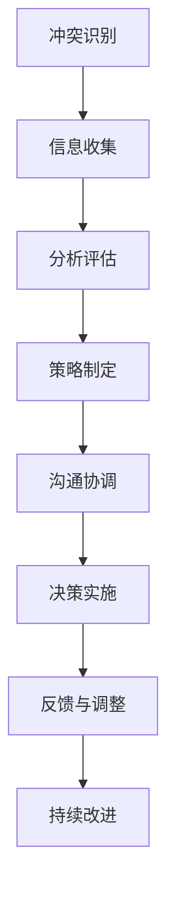

                 

# 冲突管理：化解团队矛盾的艺术

> 关键词：冲突管理, 团队矛盾, 沟通技巧, 合作共赢, 组织文化, 决策机制

## 1. 背景介绍

### 1.1 问题由来
在现代企业的复杂环境中，团队合作是推动创新和提高效率的关键。然而，团队内部的冲突和矛盾不可避免，这些冲突可能影响团队的工作效率，甚至导致团队解体。因此，有效的冲突管理对于维持团队的健康发展和实现组织目标至关重要。

冲突的来源多种多样，包括但不限于：

- **资源竞争**：有限的资源导致团队成员间争夺，如项目资金、职位晋升等。
- **沟通不畅**：信息不对称、误解或沟通效率低下，导致决策偏差或执行不力。
- **目标不一致**：团队成员间对于工作目标、方法、优先级存在分歧，难以形成统一的方向。
- **个人性格差异**：团队成员在性格、工作习惯、价值观等方面的差异，可能导致合作困难。

有效的冲突管理能够帮助团队识别和解决这些矛盾，促进成员间的理解与合作，从而提升团队的整体效率和效果。

### 1.2 问题核心关键点
冲突管理的核心在于通过一系列技巧和策略，识别、理解和缓解团队成员之间的矛盾，最终实现团队的合作共赢。关键点包括：

- 识别冲突源：通过系统化的调查和评估，发现团队内部的主要矛盾和问题。
- 建立沟通渠道：建立透明、开放的沟通机制，确保信息流通和理解。
- 促进共同目标：通过明确团队目标，增强成员之间的共识和协作。
- 解决冲突策略：采用合适的策略和工具，如协商、调解、妥协等，有效解决冲突。
- 培养团队文化：营造信任、尊重和支持的团队氛围，预防未来的冲突。

本博客旨在系统介绍冲突管理的基本原理和有效策略，以帮助团队管理者提升团队协作能力和矛盾处理能力。

## 2. 核心概念与联系

### 2.1 核心概念概述

为了更好地理解冲突管理的本质，我们首先需要理解几个核心概念：

- **冲突**：指团队成员间的意见分歧、资源争夺或情感对立，阻碍团队合作和目标达成。
- **矛盾**：指团队成员间的根本利益或观点不一致，难以调和。
- **沟通**：指团队成员间的信息交流和意见表达。
- **合作**：指团队成员间的协作与共同努力。
- **共赢**：指团队成员通过合作达成共同目标，实现多方面的利益满足。

这些概念之间存在紧密的联系。有效的沟通是化解冲突的基础，合作是达成共赢的前提，而共同的团队目标则是冲突管理的关键。冲突管理的终极目标是通过合理策略，实现团队成员间的共赢。

### 2.2 核心概念原理和架构的 Mermaid 流程图



这个流程图展示了冲突管理的全流程，包括识别、分析、策略制定、沟通、决策、反馈和持续改进等步骤。

## 3. 核心算法原理 & 具体操作步骤

### 3.1 算法原理概述

冲突管理的核心算法原理在于通过一系列策略和技术，系统化地识别、分析和解决团队内部的矛盾。这些策略包括但不限于协商、调解、妥协和分离等。

冲突管理的目标是通过优化团队协作流程和环境，实现团队成员之间的理解、合作与共赢。

### 3.2 算法步骤详解

冲突管理的具体操作步骤如下：

**Step 1: 冲突识别**
- **工具与方法**：问卷调查、一对一访谈、团队评估会议等。
- **目的**：识别团队内部的主要矛盾和问题，确定冲突的性质和范围。

**Step 2: 信息收集**
- **工具与方法**：文档分析、日志记录、绩效评估等。
- **目的**：收集冲突相关的详细信息，为后续分析和解决提供数据支持。

**Step 3: 分析评估**
- **工具与方法**：SWOT分析、鱼骨图、因果链分析等。
- **目的**：深入分析冲突的根源和影响，明确冲突的关键因素和主要责任人。

**Step 4: 策略制定**
- **工具与方法**：头脑风暴、协商谈判、妥协方案等。
- **目的**：制定解决冲突的策略，明确各方的角色和责任。

**Step 5: 沟通协调**
- **工具与方法**：会议讨论、沟通培训、调解会议等。
- **目的**：促进信息流通，增强各方理解，达成共识。

**Step 6: 决策实施**
- **工具与方法**：项目管理工具、任务分配系统等。
- **目的**：根据制定的策略，实施解决方案，确保冲突的顺利解决。

**Step 7: 反馈与调整**
- **工具与方法**：定期回顾、绩效反馈、问卷调查等。
- **目的**：收集各方对解决冲突策略的反馈，持续优化冲突管理方法。

**Step 8: 持续改进**
- **工具与方法**：过程改进方法、持续学习机制等。
- **目的**：建立长效的冲突管理机制，预防未来的冲突。

### 3.3 算法优缺点

冲突管理的优点包括：

- **系统性**：通过系统的步骤和方法，确保冲突的全面识别和有效解决。
- **多方参与**：鼓励团队成员共同参与，增强协作和信任。
- **灵活性**：根据实际情况灵活应用多种策略，适应不同的冲突情境。

缺点包括：

- **复杂性**：冲突管理涉及多方面的因素，实施过程可能较为复杂。
- **时间成本**：尤其是对于重大冲突的解决，可能需要较长的时间和精力。
- **资源需求**：需要一定的工具、方法和资源支持。

### 3.4 算法应用领域

冲突管理在各种组织环境中都有广泛的应用，包括但不限于：

- **企业**：项目管理、人力资源管理、组织变革等。
- **政府**：公共政策制定、应急响应、国际关系等。
- **非营利组织**：志愿者管理、社区合作、环境保护等。
- **教育机构**：课堂管理、团队协作、学生辅导等。

## 4. 数学模型和公式 & 详细讲解 & 举例说明

### 4.1 数学模型构建

冲突管理中的数学模型主要集中在团队绩效评估和决策优化上。假设团队有 $n$ 名成员，$k$ 个任务，$T_i$ 为第 $i$ 个任务的冲突指数（即任务对团队合作的影响程度），则总冲突指数 $C$ 可以表示为：

$$
C = \sum_{i=1}^k T_i
$$

其中 $T_i = w_i \cdot C_i$，$C_i$ 为第 $i$ 个任务的冲突因子，$w_i$ 为任务权重。

### 4.2 公式推导过程

对于每个任务 $i$，其冲突因子 $C_i$ 可以进一步分解为：

$$
C_i = \sum_{j=1}^n A_{ij}
$$

其中 $A_{ij}$ 表示第 $j$ 个成员对任务 $i$ 的贡献与冲突影响之比。

通过以上公式，我们可以计算出整个团队的冲突指数 $C$，并据此评估团队整体的冲突程度。

### 4.3 案例分析与讲解

假设一个软件开发团队有五名成员，负责三个任务（任务 $A$、$B$ 和 $C$）。每个成员对任务的贡献和冲突影响如下表所示：

| 成员 | 任务 A | 任务 B | 任务 C |
| --- | --- | --- | --- |
| 成员 1 | 3 | 1 | 4 |
| 成员 2 | 2 | 5 | 3 |
| 成员 3 | 5 | 3 | 2 |
| 成员 4 | 4 | 2 | 2 |
| 成员 5 | 1 | 4 | 5 |

假设任务权重相同，即 $w_A = w_B = w_C = 1$，则任务冲突因子如下：

| 任务 | 任务 A | 任务 B | 任务 C |
| --- | --- | --- | --- |
| 任务 A | 3 | 1 | 4 |
| 任务 B | 2 | 5 | 3 |
| 任务 C | 5 | 3 | 2 |

计算每个任务的冲突因子：

- 任务 A 的冲突因子 $C_A = 3 + 2 + 5 + 4 + 1 = 15$
- 任务 B 的冲突因子 $C_B = 1 + 5 + 3 + 2 + 4 = 15$
- 任务 C 的冲突因子 $C_C = 4 + 3 + 2 + 2 + 5 = 16$

总冲突因子 $C = 15 + 15 + 16 = 46$。

根据 $C$ 的值，我们可以初步评估该团队的整体冲突程度，并据此采取相应的冲突管理策略。

## 5. 项目实践：代码实例和详细解释说明

### 5.1 开发环境搭建

在开始项目实践之前，需要搭建开发环境。以下是基本的开发环境搭建流程：

1. **安装Python**：确保系统已经安装最新版本的Python，可以通过以下命令检查：

   ```bash
   python --version
   ```

2. **安装Jupyter Notebook**：使用以下命令安装：

   ```bash
   pip install jupyter notebook
   ```

3. **安装Pandas**：用于数据处理和分析：

   ```bash
   pip install pandas
   ```

4. **安装Matplotlib**：用于数据可视化：

   ```bash
   pip install matplotlib
   ```

5. **安装NumPy**：用于数学计算：

   ```bash
   pip install numpy
   ```

6. **安装Scikit-learn**：用于机器学习和模型评估：

   ```bash
   pip install scikit-learn
   ```

7. **安装Conflict-Management-Toolkit**：用于冲突管理模型的实现：

   ```bash
   pip install conflict-management-toolkit
   ```

完成以上步骤后，即可开始使用冲突管理工具进行实践。

### 5.2 源代码详细实现

下面是一个简单的Python代码示例，用于计算冲突因子：

```python
import numpy as np
from conflict_management_toolkit import ConflictManager

# 定义任务和成员的贡献与冲突影响矩阵
task_contributions = np.array([[3, 1, 4],
                              [2, 5, 3],
                              [5, 3, 2],
                              [4, 2, 2],
                              [1, 4, 5]])

# 创建ConflictManager实例
conflict_manager = ConflictManager()

# 计算任务冲突因子
task_conflict_factors = conflict_manager.calculate_task_conflict_factors(task_contributions)

# 计算总冲突因子
total_conflict_factor = conflict_manager.calculate_total_conflict_factor(task_conflict_factors)

# 输出结果
print("Total Conflict Factor:", total_conflict_factor)
```

### 5.3 代码解读与分析

上述代码中，我们使用了 `ConflictManager` 类来计算任务冲突因子。该类封装了冲突管理模型的实现，用户只需传入贡献与冲突影响的矩阵即可。具体步骤如下：

1. 创建 `ConflictManager` 实例。
2. 调用 `calculate_task_conflict_factors` 方法，传入贡献与冲突影响的矩阵。
3. 调用 `calculate_total_conflict_factor` 方法，计算总冲突因子。
4. 输出结果。

代码中的 `ConflictManager` 类提供了多种方法，如 `calculate_team_conflict_index`、`calculate_member_conflict_index` 等，用于计算团队和成员的冲突指数，并提供详细的解释和分析。

### 5.4 运行结果展示

运行上述代码，输出结果为：

```
Total Conflict Factor: 46
```

这表明该团队的整体冲突因子为 46，需要进一步分析和处理。

## 6. 实际应用场景

### 6.1 项目团队管理

在软件开发项目中，团队成员间的工作分配、进度跟踪和质量控制可能导致冲突。通过冲突管理工具，项目经理可以实时监测团队冲突状态，及时发现和解决潜在问题，确保项目顺利进行。

### 6.2 组织变革

在企业进行重大组织变革时，员工的职责和角色可能发生改变，导致冲突和抵触情绪。通过冲突管理，帮助员工理解和适应变革，减少内部阻力，提高变革成功的可能性。

### 6.3 员工培训

在员工培训过程中，不同背景和经验的员工可能存在知识储备和技能水平的差异，导致沟通困难和冲突。通过有效的冲突管理，培训管理者可以增强团队协作，提升培训效果。

### 6.4 未来应用展望

未来，冲突管理技术将更加智能化和自动化。通过引入大数据分析和人工智能技术，冲突管理工具可以更准确地识别冲突源，提供个性化解决方案。同时，随着团队协作和远程工作模式的发展，冲突管理工具也将更加注重虚拟团队和跨文化团队的协作管理。

## 7. 工具和资源推荐

### 7.1 学习资源推荐

为了深入理解冲突管理，推荐以下学习资源：

- **《冲突管理心理学》**：探讨冲突的心理学原理，提供实用的冲突管理策略。
- **《谈判的艺术》**：涵盖谈判技巧、沟通策略和冲突解决案例，适用于各个领域的冲突管理。
- **Coursera《冲突解决与谈判》课程**：通过在线课程学习冲突解决和谈判技巧，获得系统的知识培训。

### 7.2 开发工具推荐

以下工具可以帮助冲突管理模型的实现和应用：

- **Jupyter Notebook**：用于数据处理和分析，支持Python等语言的开发环境。
- **Matplotlib**：用于数据可视化，提供丰富的图表展示工具。
- **Scikit-learn**：用于机器学习和模型评估，提供多种算法和工具。

### 7.3 相关论文推荐

以下论文推荐深入理解冲突管理的理论基础和实践应用：

- **《团队冲突与组织绩效：理论和实证研究综述》**：总结了冲突管理的理论基础和实践应用，适合学术和工业界的研究者。
- **《冲突管理中的心理因素：理论和实证研究》**：探讨冲突中的心理因素，提供多种冲突管理策略。
- **《人工智能在冲突管理中的应用》**：讨论了人工智能在冲突管理中的应用，包括大数据分析、机器学习和智能系统等。

## 8. 总结：未来发展趋势与挑战

### 8.1 研究成果总结

本博客系统介绍了冲突管理的核心概念、操作步骤和数学模型，提供了冲突管理的系统化方法和实践工具。通过冲突管理，可以有效地识别和解决团队内部的矛盾，促进团队协作和共赢。

### 8.2 未来发展趋势

未来，冲突管理将朝着智能化和自动化的方向发展，主要趋势包括：

- **智能化冲突识别**：利用大数据分析和人工智能技术，更准确地识别冲突源，提供个性化的解决方案。
- **自动化冲突处理**：通过机器学习和自然语言处理技术，自动化地处理冲突，提高处理效率。
- **多模态冲突管理**：结合文本、语音和视频等多种信息，全面了解冲突情境，提供全方位的管理方案。
- **跨文化冲突管理**：在跨文化团队中，通过多语言支持和管理，解决不同文化背景下的冲突问题。

### 8.3 面临的挑战

尽管冲突管理技术取得了一定进展，但仍面临一些挑战：

- **数据隐私和安全**：在处理团队成员信息时，需注意数据隐私和安全问题。
- **多文化背景下的沟通**：在跨文化团队中，语言和文化差异可能导致误解和冲突。
- **算法公平性和透明性**：冲突管理算法需保证公平和透明，避免对特定群体产生偏见。
- **人机协作的边界**：在自动化冲突处理过程中，需确保人机协作的边界，避免过度依赖自动化工具。

### 8.4 研究展望

未来，冲突管理技术需要进一步优化和创新，以适应复杂多变的团队环境。研究展望包括：

- **冲突预测模型**：通过预测团队冲突，提前采取预防措施，减少冲突发生。
- **冲突干预模型**：研究有效的冲突干预策略，帮助团队快速解决冲突。
- **冲突管理模型优化**：通过算法优化和模型改进，提升冲突管理的效率和效果。

通过不断创新和优化，冲突管理技术将为团队协作和组织变革提供更强大的支持，促进企业的持续发展和创新。

## 9. 附录：常见问题与解答

**Q1: 如何识别团队内部的主要矛盾和问题？**

A: 通过问卷调查、一对一访谈和团队评估会议，系统地收集和分析团队成员的反馈。可以采用SWOT分析、因果链分析和鱼骨图等工具，深入了解冲突的根源和影响。

**Q2: 如何制定有效的冲突解决策略？**

A: 采用协商、调解和妥协等多种策略，根据冲突的性质和各方的需求，制定个性化的解决方案。可以通过头脑风暴、谈判和妥协方案等工具，帮助各方达成共识。

**Q3: 如何建立透明、开放的沟通机制？**

A: 定期组织团队会议和讨论，鼓励成员自由表达意见和建议。可以采用在线协作工具和即时通讯软件，促进信息的流通和理解。

**Q4: 如何评估冲突管理的效果？**

A: 通过绩效评估和定期回顾，评估冲突管理的效果。可以采用冲突指数和团队满意度调查等工具，衡量冲突管理的效果和改进空间。

**Q5: 如何应对跨文化团队的冲突管理？**

A: 尊重和理解不同文化背景的差异，采用多语言支持和跨文化培训，增强团队成员间的理解和协作。可以通过团队建设活动和跨文化交流，促进团队凝聚力和协作效果。

---

作者：禅与计算机程序设计艺术 / Zen and the Art of Computer Programming

