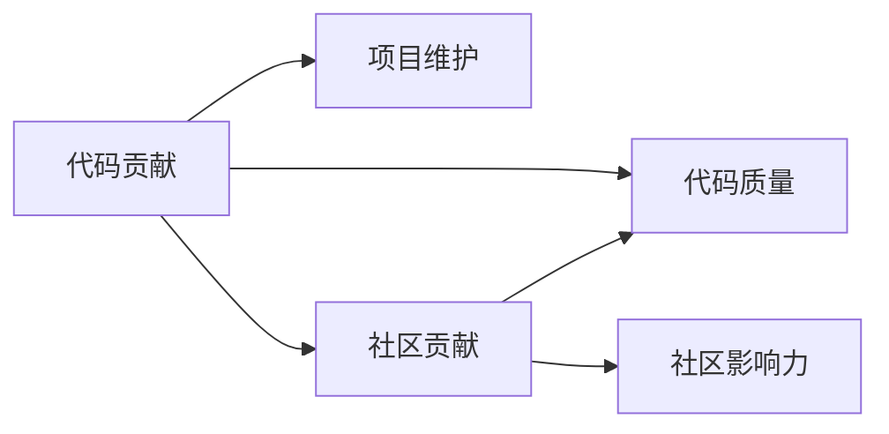

                 

## 1. 背景介绍

在职业生涯中，尤其是对于技术岗位来说，职业谈判往往是一个重要环节。然而，技术人往往欠缺对谈判技巧的掌握，导致在薪资、岗位、福利等方面无法获取最大利益。开源影响力作为一种强大的职业资本，其如何被利用在职业谈判中成为我们需要探讨的话题。本文将深入分析开源影响力的各种表现形式，并探讨其在日常职业谈判中的应用策略。

## 2. 核心概念与联系

### 2.1 核心概念概述

开源影响力指的是个人或组织在开源项目中的贡献、地位和影响力，对自身职业生涯产生积极影响的资本。开源不仅涉及到编程技能，更涵盖项目管理和社区互动等多个方面。

- **代码贡献**：指在开源项目中提交代码，并经过社区审核。
- **项目维护**：负责开源项目的主要代码或文档，确保项目顺利进行。
- **社区贡献**：参与社区讨论、解答问题、提供培训等。
- **代码质量**：高质量、高效、易维护的代码。
- **社区影响力**：在开源社区中的知名度和影响力。

这些概念通过以下Mermaid流程图展示其内在联系：



## 3. 核心算法原理 & 具体操作步骤
### 3.1 算法原理概述

开源影响力的提升，可以通过多维度贡献、积极参与社区活动以及高质量的代码来实现。在职业谈判中，开源影响力可转化为实际薪资、职位提升、职业发展的助力。

核心算法原理为：
1. **贡献度评估**：通过代码贡献、项目维护、社区贡献等多维度衡量个人在开源项目中的影响。
2. **影响力提升**：在开源项目中不断提升个人代码质量和影响力。
3. **谈判策略**：将个人在开源项目中的贡献转化为职业谈判中的实际筹码。

### 3.2 算法步骤详解

1. **选择合适的开源项目**：根据自身技术背景、兴趣领域，选择适合的、有发展潜力的开源项目。
2. **贡献代码**：通过提交代码、修复Bug等方式，积极参与项目开发。
3. **项目维护**：在开源项目中担任核心角色，承担主要代码或文档的维护工作。
4. **社区互动**：参与开源社区的讨论，解答问题，提供培训和技术支持。
5. **贡献质量监控**：通过代码评审和项目指标监控，提升代码质量。
6. **评估和反馈**：定期评估个人在项目中的贡献，通过社区反馈不断提升影响力。
7. **谈判准备**：在求职或薪资谈判中，强调自己在开源项目中的贡献和影响力。

### 3.3 算法优缺点

**优点**：
- **多维度技能提升**：开源项目不仅提升编程技能，更提升项目管理、社区互动等软技能。
- **广泛认可度**：开源项目贡献在技术界有广泛认可度，增强职业谈判砝码。
- **高曝光率**：开源项目在社区中的曝光，有助于提升个人知名度。

**缺点**：
- **时间成本高**：开源贡献需要大量时间精力投入。
- **项目风险**：部分项目可能因组织变动、技术变革等原因停滞。
- **内容竞争**：开源贡献需面对社区内的激烈竞争。

### 3.4 算法应用领域

开源影响力在职业谈判中的应用领域包括但不限于：
- **技术岗位求职**：在求职过程中强调开源贡献，提升入职机会。
- **薪资谈判**：在薪资谈判中，通过开源贡献提升薪资水平。
- **职位晋升**：在工作中通过开源影响力获得内部晋升机会。
- **职业发展**：通过开源影响力，在职业生涯中构建广泛的人脉和资源。

## 4. 数学模型和公式 & 详细讲解 & 举例说明

### 4.1 数学模型构建

假设个人在开源项目中贡献度为 $C$，社区影响力为 $I$，市场价值为 $V$，则模型构建为：

$$ V = f(C, I) $$

其中 $f$ 为贡献度和影响力共同作用下的函数。

### 4.2 公式推导过程

将 $f$ 函数分解为两个部分：

$$ V = g(C) + h(I) $$

- **$g(C)$**：个人在项目中的代码贡献 $C$ 转换为市场价值的函数。
- **$h(I)$**：个人在社区中的影响力 $I$ 转换为市场价值的函数。

$g(C)$ 函数可以建模为：

$$ g(C) = aC^n $$

其中 $a$ 和 $n$ 为调节参数，$a$ 表示每个贡献的单位价值，$n$ 表示影响随贡献量增加的速率。

$h(I)$ 函数可以建模为：

$$ h(I) = bI^m $$

其中 $b$ 和 $m$ 为调节参数，$b$ 表示每个影响单位的价值，$m$ 表示影响随影响力增加的速率。

### 4.3 案例分析与讲解

以某开源项目为例，假设个人贡献度为 $C=100$，社区影响力为 $I=200$。

通过 $g(C)$ 函数，得到：

$$ g(C) = a \cdot 100^n = 2 \cdot 100^2 = 20000 $$

通过 $h(I)$ 函数，得到：

$$ h(I) = b \cdot 200^m = 0.1 \cdot 200^3 = 64000 $$

综合两个函数，得到市场价值为：

$$ V = 20000 + 64000 = 84000 $$

说明在开源项目中，贡献度与影响力均能有效提升个人市场价值。

## 5. 项目实践：代码实例和详细解释说明
### 5.1 开发环境搭建

1. **安装Python**：确保环境中有Python 3.8及以上版本。

2. **安装Pip**：
```bash
pip install pip
```

3. **安装相关库**：
```bash
pip install gitpython
pip install pexpect
```

4. **设置SSH Key**：在GitHub上设置SSH Key，以便通过SSH访问GitHub。

### 5.2 源代码详细实现

以下是一个简单的Python脚本，用于统计在GitHub上贡献的开源项目数：

```python
import os
import subprocess

# SSH密钥路径
ssh_private_key = '/path/to/private/key'

# GitHub用户名
username = 'your_username'

# 获取用户所有公开项目
projects = subprocess.run(['ssh', '-i', ssh_private_key, f'git@github.com:{username}.git', 'ls-remote', '--all', '->> project_urls.txt'], shell=True, capture_output=True, text=True)
projects = projects.stdout.strip().split()

# 统计项目数
num_projects = len(projects) / 4  # 假设每个项目URL由4段组成，前3段为项目信息
print(f'在GitHub上贡献的开源项目数为：{num_projects}')
```

### 5.3 代码解读与分析

此脚本通过SSH登录GitHub，获取用户所有公开项目的URL，并统计数量。脚本中使用了Python的os、subprocess等库。

## 6. 实际应用场景

### 6.1 技术岗位求职

在求职时，个人可以在简历中重点强调开源项目贡献，展示实际成果和影响力。例如：

- **代码贡献数量**：具体到某个开源项目贡献了多少行代码、修复了多少Bug。
- **社区贡献情况**：在开源社区发表了多少文章、解答了多少问题。
- **项目贡献度**：在核心项目中担任什么角色，承担什么责任。

### 6.2 薪资谈判

在薪资谈判中，可以向公司展示自己在开源项目中的贡献度与影响力。例如：

- **薪资增幅**：基于市场价值模型计算出期望薪资。
- **岗位匹配度**：根据自身技能和贡献，匹配适合的岗位级别。
- **绩效考核**：将开源贡献转化为绩效考核指标。

### 6.3 职位晋升

在工作中，个人可以通过开源影响力获得内部晋升机会。例如：

- **项目管理**：通过开源项目的贡献，获得更多的项目管理权限。
- **技术领导**：成为开源项目的主要负责人，领导团队开发和维护。
- **跨部门合作**：利用开源影响力，获得更多跨部门合作机会，提升个人影响力。

### 6.4 未来应用展望

未来，开源影响力在职业谈判中的应用将更加深入。随着开源社区的不断壮大和技术领域的不断变化，开源影响力的作用将日益凸显。例如：

- **跨平台应用**：开源影响力将在多个平台和行业广泛应用。
- **多种形式展示**：展示形式将不再局限于代码贡献和项目维护，还包括开源书籍、公开讲座等多种形式。
- **动态评估系统**：构建动态评估系统，实时评估开源贡献与影响力的变化。

## 7. 工具和资源推荐
### 7.1 学习资源推荐

- **《开源项目贡献指南》**：详细介绍了开源项目贡献的步骤、技巧和最佳实践。
- **《GitHub入门与实践》**：从基础到高级，全面介绍GitHub的使用方法。
- **《开源社区互动策略》**：如何有效参与开源社区，提升个人影响力和知名度。

### 7.2 开发工具推荐

- **GitHub**：全球最大的开源社区平台，方便个人展示和获取开源项目。
- **GitLab**：代码托管平台，支持私有仓库，适合团队协作。
- **Jira**：项目管理工具，帮助个人追踪和管理开源项目。

### 7.3 相关论文推荐

- **《开源贡献对职业生涯影响研究》**：探讨开源贡献对技术人职业发展的影响。
- **《开源社区影响力评估模型》**：构建基于贡献和影响力的开源影响力评估模型。
- **《开源项目选择策略》**：如何根据自身技能和兴趣选择合适的开源项目。

## 8. 总结：未来发展趋势与挑战

### 8.1 总结

本文通过深入分析开源影响力的原理和应用，探讨了开源影响力在职业谈判中的重要性。开源影响力作为一种强大的职业资本，不仅提升了技术人的编程和项目管理技能，还增强了在技术界的影响力。在实际应用中，开源影响力能够显著提升技术人的薪资、职位和发展空间。

### 8.2 未来发展趋势

开源影响力的未来发展趋势主要体现在以下几个方面：

- **多维度贡献**：除了代码贡献，还应注重社区互动、项目维护等多种贡献方式。
- **跨平台应用**：开源影响力将跨多个平台和行业，成为通用的职业资本。
- **动态评估系统**：构建实时评估系统，准确评估个人在开源项目中的贡献和影响力。
- **多形式展示**：展示形式将更加多样，覆盖开源书籍、公开讲座等多个方面。

### 8.3 面临的挑战

尽管开源影响力在职业谈判中具有重要意义，但其面临的挑战也不容忽视：

- **时间成本**：开源贡献需要大量时间和精力投入。
- **项目风险**：部分开源项目可能因组织变动、技术变革等原因停滞。
- **内容竞争**：开源贡献需面对社区内的激烈竞争。
- **内容质量**：高贡献度不一定代表高质量，需通过项目管理和社区反馈提升贡献质量。

### 8.4 研究展望

开源影响力的未来研究可以围绕以下几个方向展开：

- **动态贡献评估**：构建动态贡献评估系统，实时监测和提升个人贡献质量。
- **多形式贡献**：除了代码贡献，还可以考虑其他形式的贡献，如开源书籍、公开讲座等。
- **跨平台应用**：研究跨多个平台和行业应用的开源影响力模型。
- **社区影响提升**：研究如何通过社区互动提升个人影响力和知名度。

开源影响力作为技术人在职业发展中的重要资本，其价值将随着开源社区的不断壮大和技术领域的不断变化而日益凸显。未来，开源影响力将更加广泛地应用于职业谈判中，推动技术人的职业发展。

## 9. 附录：常见问题与解答

**Q1：开源影响力是否对所有技术岗位都有效？**

A: 开源影响力对技术岗位求职、薪资谈判、职位晋升等方面均有显著作用。但对某些技术岗位（如销售、运营等）影响较小，需要综合考虑。

**Q2：如何衡量自己在开源项目中的贡献度？**

A: 可以通过代码贡献数量、修复Bug数量、项目维护贡献、社区互动数量等多个维度衡量。GitHub Insights等平台可提供详细的统计数据。

**Q3：开源影响力是否容易量化？**

A: 开源影响力的量化需要多维度评估，结合项目质量、社区反馈等多个因素。单一维度的衡量可能无法准确反映实际贡献。

**Q4：如何平衡开源贡献与日常工作？**

A: 通过时间管理、任务优先级等方法，合理规划开源贡献时间，避免过度影响日常工作。

**Q5：开源影响力是否仅适用于技术人员？**

A: 开源影响力不仅适用于技术人员，对项目管理人员、产品经理等也有积极作用。

---

作者：禅与计算机程序设计艺术 / Zen and the Art of Computer Programming

