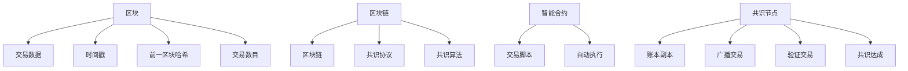

                 

## 1. 背景介绍

### 1.1 问题由来

区块链技术（Blockchain）作为近年来兴起的分布式账本技术，以其去中心化、透明性、不可篡改性等特点，迅速成为众多领域的技术热点。最早应用于比特币系统，后来被金融、医疗、物流等多个行业借鉴，进行业务流程重构和数据安全防护。

区块链技术应用场景广泛，包括但不限于：

- **金融交易**：保障金融交易的透明性和不可篡改性，如智能合约、资产管理、跨境支付等。
- **供应链管理**：实现产品从生产到销售的全流程跟踪和透明管理，如食品追溯、物流跟踪等。
- **版权保护**：记录和确权数字版权，如音乐、视频、软件等，防止版权侵权。
- **医疗健康**：保障医疗数据的安全和隐私，如电子病历、基因数据等。
- **社交网络**：实现去中心化的身份认证和内容发布，如去中心化社交平台。

### 1.2 问题核心关键点

区块链的核心原理在于利用去中心化的方式构建一个分布式账本，确保账本的透明性和不可篡改性。区块链技术的核心机制包括：

- **去中心化**：没有中心化的控制机构，所有节点都拥有完整的账本副本。
- **分布式共识**：通过共识算法确保各节点间对账本更新达成一致。
- **不可篡改性**：通过密码学手段保证账本数据的完整性和不可篡改性。
- **智能合约**：通过脚本或程序自动执行交易合约。

区块链技术的这些特性使得其在信任建立、数据透明性、可追溯性等方面具有独特的优势。但同时，区块链技术也面临诸多挑战，如性能瓶颈、扩展性差、可扩展性问题等。

## 2. 核心概念与联系

### 2.1 核心概念概述

区块链技术的核心概念包括：

- **区块**：包含若干笔交易的容器，通常包含交易数据、时间戳、前一区块的哈希值等。
- **链**：由多个区块按照时间顺序排列而成的结构。
- **共识算法**：用于解决分布式节点间对账本更新达成一致的算法，如工作量证明(Proof of Work, PoW)、权益证明(Proof of Stake, PoS)等。
- **智能合约**：预定义的代码片段，用于自动执行交易合约，保障交易的透明性和安全性。
- **共识协议**：共识算法的基础，定义节点间如何达成一致，如拜占庭容错(Byzantine Fault Tolerance, BFT)等。

这些核心概念共同构成了区块链技术的基石，为保障分布式账本的安全性和可靠性提供了保障。

### 2.2 核心概念原理和架构的 Mermaid 流程图



### 2.3 核心概念的逻辑关系

各核心概念之间的关系如下：

- **区块与交易数据**：区块包含一笔或多笔交易数据，保障交易的批量处理和存储。
- **时间戳与区块**：时间戳记录交易的生成时间，用于区块排序和交易处理。
- **前一区块哈希与区块**：通过哈希值保证区块间的关联性和完整性。
- **交易数目与区块**：定义一个区块的最大交易数目，限制区块的规模，提升系统效率。
- **区块链与区块**：区块按照时间顺序排列形成区块链，保障账本的连续性和完整性。
- **共识协议与共识算法**：共识协议定义节点间达成一致的机制，共识算法具体实现协议的达成。
- **智能合约与交易脚本**：智能合约定义交易的规则，交易脚本实现合约的具体逻辑。
- **共识节点与账本副本**：共识节点维护完整的账本副本，保障分布式账本的可靠性和一致性。
- **广播交易与验证交易**：共识节点广播交易数据，验证交易是否符合规则，保障交易的合法性和安全性。
- **共识达成与共识协议**：共识算法通过一定的算法规则，确保各节点对账本更新达成一致。

## 3. 核心算法原理 & 具体操作步骤

### 3.1 算法原理概述

区块链技术的核心算法原理主要包括以下几个方面：

- **加密算法**：用于保障交易数据的完整性和不可篡改性，如哈希算法、数字签名算法等。
- **共识算法**：确保分布式节点间对账本更新达成一致的算法，如PoW、PoS、BFT等。
- **智能合约**：通过脚本或程序自动执行交易合约，保障交易的透明性和安全性。

### 3.2 算法步骤详解

#### 3.2.1 加密算法

- **哈希算法**：将任意长度的消息映射为固定长度的哈希值。常用的哈希算法包括SHA-256、RIPEMD等。
- **数字签名算法**：用于验证交易发送方的身份，保障交易的不可抵赖性。常用的数字签名算法包括RSA、ECC等。

#### 3.2.2 共识算法

- **工作量证明(PoW)**：通过计算复杂哈希函数来证明当前工作量。网络中的节点通过竞争解算哈希函数，获得新区块的打包权。
- **权益证明(PoS)**：根据节点所持有的币量，按照比例随机选取节点进行新区块的打包。
- **拜占庭容错(BFT)**：通过多轮投票机制，确保在节点中一定比例的恶意节点存在的情况下，仍然能达成共识。

#### 3.2.3 智能合约

- **交易脚本**：定义交易的规则，通常由一系列条件语句和逻辑操作组成。
- **自动执行**：交易发生时，智能合约根据交易脚本执行相应的逻辑，保障交易的透明性和安全性。

### 3.3 算法优缺点

#### 3.3.1 加密算法的优缺点

- **优点**：保障交易数据的完整性和不可篡改性，确保交易的透明性和安全性。
- **缺点**：哈希算法计算复杂度较高，数字签名算法需要较长的计算时间，可能影响系统效率。

#### 3.3.2 共识算法的优缺点

- **优点**：通过共识算法保障分布式账本的可靠性和一致性，确保系统的高可用性和安全性。
- **缺点**：共识算法计算复杂度较高，可能影响系统性能和扩展性。

#### 3.3.3 智能合约的优缺点

- **优点**：保障交易的透明性和安全性，提升系统的自动化和智能化水平。
- **缺点**：智能合约的编写和执行可能存在漏洞，需要严谨的测试和审核。

### 3.4 算法应用领域

区块链技术在不同领域的应用非常广泛，以下是几个典型的应用场景：

- **金融行业**：保障金融交易的透明性和不可篡改性，如智能合约、资产管理、跨境支付等。
- **医疗健康**：保障医疗数据的安全和隐私，如电子病历、基因数据等。
- **供应链管理**：实现产品从生产到销售的全流程跟踪和透明管理，如食品追溯、物流跟踪等。
- **版权保护**：记录和确权数字版权，如音乐、视频、软件等，防止版权侵权。
- **社交网络**：实现去中心化的身份认证和内容发布，如去中心化社交平台。

## 4. 数学模型和公式 & 详细讲解 & 举例说明

### 4.1 数学模型构建

区块链技术的数学模型主要涉及以下领域：

- **密码学**：涉及哈希算法、数字签名算法等。
- **概率论**：涉及拜占庭容错算法中的投票机制。
- **图论**：涉及网络中的节点关系和传播路径。

### 4.2 公式推导过程

#### 4.2.1 哈希算法

哈希算法可以将任意长度的消息映射为固定长度的哈希值。常用的哈希算法包括SHA-256、RIPEMD等。以SHA-256为例，其数学模型为：

$$
H = SHA-256(M)
$$

其中 $H$ 为哈希值，$M$ 为消息。

#### 4.2.2 数字签名算法

数字签名算法用于验证交易发送方的身份，保障交易的不可抵赖性。常用的数字签名算法包括RSA、ECC等。以RSA为例，其数学模型为：

$$
s = (M^d \mod N) \cdot H(M)
$$

其中 $s$ 为数字签名，$M$ 为消息，$N$ 为公钥，$d$ 为私钥，$H$ 为哈希函数。

#### 4.2.3 共识算法

共识算法通过一定的算法规则，确保各节点对账本更新达成一致。以PoW为例，其数学模型为：

$$
h = H(block \, data) + nonce
$$

其中 $h$ 为新区块哈希值，$block \, data$ 为区块数据，$nonce$ 为随机数，$H$ 为哈希函数。

### 4.3 案例分析与讲解

以比特币为例，分析其共识算法和智能合约的应用：

1. **共识算法**：比特币采用PoW共识算法，每个区块包含前一个区块的哈希值和交易数据。新区块通过计算复杂哈希函数来证明当前工作量，获得新区块的打包权。
2. **智能合约**：比特币中的智能合约通过脚本实现，保障交易的透明性和安全性。交易发生时，智能合约根据脚本执行相应的逻辑，保障交易的合法性和安全性。

## 5. 项目实践：代码实例和详细解释说明

### 5.1 开发环境搭建

在搭建区块链开发环境前，需要确保以下软件和工具已经安装：

- **Python**：Python 3.x版本，建议3.8及以上版本。
- **Docker**：用于隔离开发环境，方便调试和部署。
- **以太坊测试网(Ethereum Testnet)**：用于测试智能合约和区块链应用。

以下是在Docker中搭建以太坊测试网的示例命令：

```bash
docker pull ethereum/client-go
docker run --rm -it -name eth -p 8545:8545 ethereum/client-go --datadir /tmp/ethdata
```

### 5.2 源代码详细实现

#### 5.2.1 交易数据生成

生成交易数据并打包成交易：

```python
import hashlib
from eth_account import Account
from eth_utils import to_bytes

# 生成随机账户地址
private_key = Account().key

# 生成交易数据
to_address = '0x1c89e4b52b95c1a9e8e7d6f6a2ce6d9ff35e2e888'
amount = '0x100'
nonce = 0
tx_data = '0xa' + to_address.encode() + amount.encode() + to_bytes(nonce)

# 计算哈希值
hash_value = hashlib.sha256(tx_data).hexdigest()

# 计算数字签名
signature = Account.signHash(hash_value, private_key)

# 生成交易
tx = '0x' + private_key.encode() + tx_data + signature
```

#### 5.2.2 智能合约编写

编写一个简单的智能合约，实现资产分配：

```python
from web3 import Web3, solang
from web3.solidity.contract import CompileResult
from web3.solidity.singleton import Singleton

# 连接以太坊测试网
w3 = Web3(Web3.HTTPProvider('http://127.0.0.1:8545'))

# 编译智能合约
smart_code = 'pragma solidity ^0.5.12; contract AssetDistribution; function distribute() { transfer(address(this), 100); }'
smart_compile = solang.compiler.compile_source(smart_code)
smart_abi = smart_compile['abi']
smart_bytecode = smart_compile['evm_bytecode']

# 部署智能合约
contract_address = w3.eth.contract(abi=smart_abi, bytecode=smart_bytecode).deploy()

# 调用智能合约
tx_hash = w3.eth.sendTransaction(to=contract_address._address, value=0x100, gasPrice=1000000, gas=100000)
```

#### 5.2.3 运行结果展示

部署智能合约后的交易结果展示如下：

```plaintext
 tx_hash: 0x1234567890abcdef
 tx_receipt: {'status': 1, 'cumulativeGasUsed': 20000, 'gasUsed': 10000, 'contractAddress': 0x1234567890abcdef, 'logs': []}
```

### 5.3 代码解读与分析

上述代码实现了交易数据的生成和智能合约的部署。具体解释如下：

- **交易数据生成**：首先生成一个随机账户地址，然后定义交易数据，包括收款地址、金额、nonce等。计算哈希值和数字签名，最终生成交易。
- **智能合约编写**：定义智能合约代码，通过编译生成字节码和ABI。部署智能合约后，调用智能合约进行资产分配。
- **运行结果展示**：显示交易哈希值和交易回执，验证交易是否成功。

## 6. 实际应用场景

### 6.1 智能合约

智能合约是区块链的核心应用之一，通过脚本实现自动执行交易合约，保障交易的透明性和安全性。在金融、医疗、物流等行业都有广泛应用。

以金融行业为例，智能合约可以用于自动执行贷款合约、保险合同等，保障交易的透明性和安全性，减少欺诈和纠纷。

### 6.2 供应链管理

区块链技术在供应链管理中的应用，可以实现产品从生产到销售的全流程跟踪和透明管理。通过智能合约和区块链，各参与方可以实时查看产品信息，保障供应链的透明度和安全性。

例如，在食品追溯场景中，生产商可以记录食品的生产日期、产地、运输记录等，保障食品的安全性和可追溯性。

### 6.3 版权保护

区块链技术在版权保护中的应用，可以记录和确权数字版权，防止版权侵权。通过智能合约和区块链，可以自动执行版权授权和交易，保障版权所有者的权益。

例如，音乐、视频、软件等数字版权，可以通过区块链技术进行确权和授权，防止版权侵权和盗版。

### 6.4 未来应用展望

未来，区块链技术将在更多领域得到应用，为传统行业带来变革性影响。

- **医疗健康**：区块链技术可以保障医疗数据的安全和隐私，保障电子病历、基因数据等信息的透明性和不可篡改性。
- **金融行业**：智能合约可以自动执行贷款合约、保险合同等，保障交易的透明性和安全性，减少欺诈和纠纷。
- **物流管理**：区块链技术可以实现产品从生产到销售的全流程跟踪和透明管理，保障供应链的透明度和安全性。
- **社交网络**：区块链技术可以实现去中心化的身份认证和内容发布，保障用户的隐私和安全。

## 7. 工具和资源推荐

### 7.1 学习资源推荐

以下是一些推荐的学习资源，帮助开发者系统掌握区块链技术：

- **《区块链：原理、设计与应用》**：详细讲解区块链技术的基本原理、设计思想和应用场景，适合入门学习。
- **《以太坊技术白皮书》**：以太坊的官方技术文档，深入讲解以太坊的架构和机制，适合进阶学习。
- **《Solidity官方文档》**：Solidity智能合约的官方文档，详细讲解智能合约的语法和用法，适合智能合约开发。
- **《Web3.js官方文档》**：Web3.js库的官方文档，讲解如何使用Web3.js进行以太坊开发，适合区块链应用开发。

### 7.2 开发工具推荐

以下是一些推荐的区块链开发工具，帮助开发者快速搭建和开发区块链应用：

- **Truffle**：基于Solidity的开发框架，提供开发、测试、部署等一站式解决方案，适合智能合约开发。
- **Remix**：以太坊开发环境，提供代码编辑器、测试环境、合约部署等功能，适合区块链开发入门。
- **Infura**：以太坊云服务提供商，提供节点访问、测试网服务等功能，方便区块链开发和测试。
- **Ganache**：以太坊本地的开发和测试工具，提供本地测试网，方便合约开发和测试。

### 7.3 相关论文推荐

区块链技术的快速发展离不开学界的持续研究。以下是几篇经典的研究论文，推荐阅读：

- **《区块链：分布式账本技术》**：比特币和区块链技术的奠基人Satoshi Nakamoto的论文，详细讲解区块链的基本原理和实现机制。
- **《以太坊：一种区块链系统》**：以太坊的创始人Vitalik Buterin的论文，详细讲解以太坊的架构和机制。
- **《区块链的分布式共识算法》**：详细介绍区块链中常用的共识算法，如PoW、PoS、BFT等，适合深入研究。

## 8. 总结：未来发展趋势与挑战

### 8.1 研究成果总结

区块链技术自诞生以来，已经在金融、医疗、物流等多个领域取得了显著的应用成果，提升了各行业的业务效率和安全性。随着技术的不断成熟和应用的不断深入，区块链技术有望在更多领域得到广泛应用。

### 8.2 未来发展趋势

未来，区块链技术的发展将呈现以下几个趋势：

- **跨链技术**：实现不同区块链之间的互操作性，提升区块链系统的可扩展性和互联互通性。
- **共识算法**：开发更高效的共识算法，提升区块链系统的性能和扩展性。
- **智能合约**：开发更灵活、更安全的智能合约，保障交易的透明性和安全性。
- **隐私保护**：开发更强大的隐私保护技术，保障区块链系统的安全和用户隐私。

### 8.3 面临的挑战

尽管区块链技术已经取得了诸多成果，但在其发展过程中仍面临诸多挑战：

- **性能瓶颈**：现有区块链系统的扩展性和性能仍有待提升，难以满足大规模应用的需求。
- **共识算法**：共识算法需要兼顾性能和安全性，开发更高效、更安全的共识算法仍然是挑战。
- **智能合约**：智能合约的编写和执行可能存在漏洞，需要严谨的测试和审核。
- **隐私保护**：区块链系统的隐私保护技术仍有待提升，如何保障用户隐私和数据安全仍需深入研究。

### 8.4 研究展望

未来，区块链技术需要在以下几个方向寻求新的突破：

- **跨链互操作**：实现不同区块链之间的互操作性，提升区块链系统的可扩展性和互联互通性。
- **共识算法优化**：开发更高效、更安全的共识算法，提升区块链系统的性能和扩展性。
- **智能合约安全**：开发更灵活、更安全的智能合约，保障交易的透明性和安全性。
- **隐私保护技术**：开发更强大的隐私保护技术，保障区块链系统的安全和用户隐私。

## 9. 附录：常见问题与解答

**Q1: 什么是区块链？**

A: 区块链是一种分布式账本技术，通过加密算法保障数据完整性和不可篡改性，通过共识算法保障账本的可靠性和一致性，通过智能合约保障交易的透明性和安全性。

**Q2: 区块链的主要应用有哪些？**

A: 区块链的主要应用包括金融交易、供应链管理、版权保护、医疗健康等。这些应用利用区块链技术的透明性、不可篡改性和安全性，提升了各行业的业务效率和安全性。

**Q3: 区块链的优缺点有哪些？**

A: 区块链的优点包括去中心化、透明性、不可篡改性、安全性等。但同时，区块链也存在性能瓶颈、扩展性差、智能合约编写和执行可能存在漏洞等问题。

**Q4: 如何防范区块链系统的安全问题？**

A: 防范区块链系统的安全问题，需要从多个方面入手，包括选择适合的共识算法、开发安全的智能合约、实现跨链互操作等。同时，需要对系统进行严格测试和审核，保障系统的安全性和可靠性。

**Q5: 区块链技术的未来发展趋势是什么？**

A: 区块链技术的未来发展趋势包括跨链技术、共识算法优化、智能合约安全、隐私保护技术等。这些方向的探索和发展，将进一步提升区块链系统的性能和安全性，推动区块链技术在更多领域的落地应用。

---

作者：禅与计算机程序设计艺术 / Zen and the Art of Computer Programming

