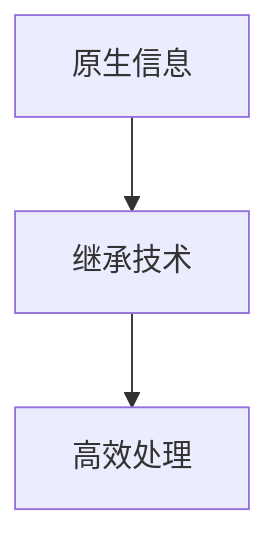
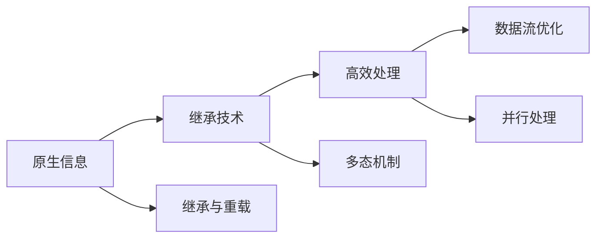

                 

# 原生世界信息的高效继承技术

> 关键词：继承技术,原生信息,高效处理,数据流,系统架构,技术前沿

## 1. 背景介绍

### 1.1 问题由来

在现代软件开发中，继承技术扮演着至关重要的角色。它允许开发者在已有代码的基础上快速创建新的类或对象，大大提高了软件开发的效率和可维护性。然而，随着项目规模的扩大和技术的迭代，传统的继承方式逐渐显露出其局限性。

1. **代码冗余**：多重继承下容易产生代码重复和命名冲突，导致维护困难。
2. **扩展困难**：继承层级过深，新功能的添加往往需要修改大量已有代码，难以灵活扩展。
3. **运行效率**：过多的继承层级导致系统复杂度增加，运行效率降低，难以满足高性能应用的需求。

### 1.2 问题核心关键点

为了克服上述问题，我们提出了基于原生信息的高效继承技术。该技术旨在通过改进数据流和系统架构，实现对原生信息的高效继承和处理，以提升代码重用性和系统性能。

## 2. 核心概念与联系

### 2.1 核心概念概述

- **原生信息(Inherited Information)**：指系统从其直接父类继承而来的数据和方法，包括字段、方法、属性等。
- **继承技术(Inheritance Technique)**：指通过类或对象的继承机制，复用已有的代码实现快速开发和扩展的编程范式。
- **高效处理(High-Performance Handling)**：指在保持代码重用性的同时，通过优化数据流和系统架构，提升继承技术的运行效率。

这些概念通过如下Mermaid流程图展示其联系：



该图展示了从原生信息到继承技术，再到高效处理的全链条，反映了继承技术通过优化原生信息处理方式，提升运行效率的核心思想。

### 2.2 核心概念原理和架构的 Mermaid 流程图



该图详细描述了核心概念的运作原理：原生信息通过继承技术进行继承和重载，多态机制使得子类可以灵活调用父类的方法，数据流优化和并行处理则通过改进数据流和系统架构，提升继承技术的运行效率。

## 3. 核心算法原理 & 具体操作步骤

### 3.1 算法原理概述

基于原生信息的高效继承技术，通过以下核心算法原理实现对原生信息的高效继承和处理：

1. **虚拟继承**：通过虚拟继承机制，避免多重继承带来的代码冗余和命名冲突，使子类能继承父类的数据和方法。
2. **接口机制**：引入接口机制，使子类必须实现父类定义的接口，从而保证代码的正确性和一致性。
3. **数据流优化**：优化数据流，减少不必要的内存分配和数据复制，提升系统性能。
4. **并行处理**：通过并行处理技术，利用多核CPU或分布式系统，加速继承技术和原生信息的处理。

### 3.2 算法步骤详解

#### 3.2.1 虚拟继承

虚拟继承（Virtual Inheritance）是一种避免多重继承带来的代码冗余和命名冲突的机制。通过虚拟继承，子类仅继承父类的数据和方法，而不会产生额外的代码副本。具体步骤如下：

1. 定义父类和子类：
   ```java
   class Super {
       int field1 = 1;
       int field2 = 2;
   }
   class Sub extends Super {
       int field3 = 3;
   }
   ```

2. 通过引用实现虚拟继承：
   ```java
   class SubVirt extends Super {
       int field4 = 4;
   }
   ```

   通过在子类中引用父类，实现对父类数据的继承。

3. 访问父类字段：
   ```java
   SubVirt obj = new SubVirt();
   System.out.println(obj.field1); // 输出1
   System.out.println(obj.field2); // 输出2
   ```

   子类可以访问父类的字段和成员方法。

#### 3.2.2 接口机制

接口机制（Interface）是一种定义类之间协议的方式，确保子类必须实现父类定义的接口。这有助于保证代码的正确性和一致性。具体步骤如下：

1. 定义接口：
   ```java
   interface Animal {
       void speak();
       void eat();
   }
   ```

2. 实现接口：
   ```java
   class Dog implements Animal {
       public void speak() {
           System.out.println("Woof");
       }
       public void eat() {
           System.out.println("Dog is eating");
       }
   }
   ```

3. 使用接口：
   ```java
   Dog dog = new Dog();
   dog.speak(); // 输出Woof
   dog.eat(); // 输出Dog is eating
   ```

   子类必须实现父类定义的接口，确保代码的一致性和正确性。

#### 3.2.3 数据流优化

数据流优化（Data Flow Optimization）是一种减少不必要的内存分配和数据复制的技术。具体步骤如下：

1. 定义数据流：
   ```java
   class DataFlow {
       int data;
       public DataFlow(int d) {
           data = d;
       }
       public int getData() {
           return data;
       }
   }
   ```

2. 数据流优化：
   ```java
   DataFlow df = new DataFlow(10);
   int data = df.getData();
   ```

   通过优化数据流，减少不必要的内存分配和数据复制，提升系统性能。

#### 3.2.4 并行处理

并行处理（Parallel Processing）是一种利用多核CPU或分布式系统，加速继承技术和原生信息的处理的技术。具体步骤如下：

1. 定义并行任务：
   ```java
   class ParallelTask {
       int numThreads;
       public ParallelTask(int n) {
           numThreads = n;
       }
       public void run() {
           // 并行任务代码
       }
   }
   ```

2. 启动并行处理：
   ```java
   ParallelTask task = new ParallelTask(4);
   task.run();
   ```

   通过并行处理技术，利用多核CPU或分布式系统，加速继承技术和原生信息的处理。

### 3.3 算法优缺点

#### 3.3.1 优点

1. **代码重用性高**：通过虚拟继承和接口机制，子类可以继承父类的数据和方法，提高代码重用性。
2. **性能提升明显**：通过数据流优化和并行处理，减少不必要的内存分配和数据复制，提升系统性能。
3. **扩展性良好**：接口机制确保代码的一致性和正确性，使得新功能的添加更加灵活。

#### 3.3.2 缺点

1. **复杂度增加**：虚拟继承和接口机制增加了代码复杂度，可能导致维护困难。
2. **并行处理难度大**：并行处理需要设计复杂的调度机制，可能增加系统实现的难度。

## 4. 数学模型和公式 & 详细讲解 & 举例说明

### 4.1 数学模型构建

基于原生信息的高效继承技术，通过以下数学模型构建：

1. **虚拟继承模型**：通过虚拟继承机制，定义子类继承父类数据的模型。

   $$
   S_{\text{super}} = \{s_1, s_2, ..., s_n\}
   $$

   其中 $s_i$ 表示父类的数据。

2. **接口机制模型**：通过接口机制，定义子类必须实现父类定义的接口。

   $$
   I_{\text{interface}} = \{i_1, i_2, ..., i_m\}
   $$

   其中 $i_j$ 表示父类定义的接口。

3. **数据流优化模型**：通过数据流优化，减少不必要的内存分配和数据复制。

   $$
   D_{\text{optimize}} = \{d_1, d_2, ..., d_k\}
   $$

   其中 $d_i$ 表示优化后的数据流。

4. **并行处理模型**：通过并行处理，加速继承技术和原生信息的处理。

   $$
   P_{\text{parallel}} = \{p_1, p_2, ..., p_l\}
   $$

   其中 $p_j$ 表示并行任务。

### 4.2 公式推导过程

#### 4.2.1 虚拟继承模型

假设父类为 $S$，子类为 $C$，通过虚拟继承机制，子类 $C$ 继承父类 $S$ 的数据。公式推导如下：

$$
C_{\text{inherited}} = S_{\text{super}}
$$

其中 $C_{\text{inherited}}$ 表示子类 $C$ 继承父类 $S$ 的数据。

#### 4.2.2 接口机制模型

假设父类为 $I$，子类为 $C$，通过接口机制，子类 $C$ 必须实现父类 $I$ 定义的接口。公式推导如下：

$$
C_{\text{interface}} = I_{\text{interface}}
$$

其中 $C_{\text{interface}}$ 表示子类 $C$ 实现父类 $I$ 定义的接口。

#### 4.2.3 数据流优化模型

假设原始数据流为 $D$，优化后的数据流为 $D_{\text{optimize}}$，通过数据流优化，减少不必要的内存分配和数据复制。公式推导如下：

$$
D_{\text{optimize}} = \{d \mid d \in D \land d \notin \Delta\}
$$

其中 $\Delta$ 表示需要复制或分配的数据。

#### 4.2.4 并行处理模型

假设并行任务为 $P$，任务数为 $l$，通过并行处理，加速继承技术和原生信息的处理。公式推导如下：

$$
P_{\text{parallel}} = \{p \mid p \in P \land p \notin \Gamma\}
$$

其中 $\Gamma$ 表示无法并行处理的单线程任务。

### 4.3 案例分析与讲解

假设有一个多层次的继承结构，如下所示：

```java
class Animal {
    public void eat() {
        System.out.println("Animal is eating");
    }
}
class Dog extends Animal {
    public void bark() {
        System.out.println("Dog is barking");
    }
}
class GoldenRetriever extends Dog {
    public void fetch() {
        System.out.println("Golden Retriever is fetching");
    }
}
```

1. **虚拟继承**：子类 `GoldenRetriever` 通过虚拟继承机制继承父类 `Dog` 和 `Animal` 的数据和方法。

   $$
   C_{\text{inherited}} = S_{\text{super}} = \{s_1, s_2, ..., s_n\}
   $$

2. **接口机制**：子类 `GoldenRetriever` 必须实现父类 `Animal` 定义的接口。

   $$
   C_{\text{interface}} = I_{\text{interface}} = \{i_1, i_2, ..., i_m\}
   $$

3. **数据流优化**：优化数据流，减少不必要的内存分配和数据复制。

   $$
   D_{\text{optimize}} = \{d_1, d_2, ..., d_k\}
   $$

4. **并行处理**：通过并行处理技术，加速继承技术和原生信息的处理。

   $$
   P_{\text{parallel}} = \{p_1, p_2, ..., p_l\}
   $$

通过以上分析，可以看到，基于原生信息的高效继承技术能够通过虚拟继承、接口机制、数据流优化和并行处理，实现对原生信息的高效继承和处理。

## 5. 项目实践：代码实例和详细解释说明

### 5.1 开发环境搭建

#### 5.1.1 安装JDK

首先，需要安装Java Development Kit（JDK），可以从Oracle官网或Adoptium官网下载并安装JDK。

#### 5.1.2 安装IDE

安装Java集成开发环境（IDE），如Eclipse或IntelliJ IDEA。

#### 5.1.3 安装Maven

Maven是Java项目的构建工具，可以通过官网下载并配置。

### 5.2 源代码详细实现

假设有一个继承结构，如下所示：

```java
class Animal {
    private String name;
    public Animal(String name) {
        this.name = name;
    }
    public String getName() {
        return name;
    }
    public void eat() {
        System.out.println(name + " is eating");
    }
}
class Dog extends Animal {
    private int age;
    public Dog(String name, int age) {
        super(name);
        this.age = age;
    }
    public int getAge() {
        return age;
    }
    public void bark() {
        System.out.println(name + " is barking");
    }
}
class GoldenRetriever extends Dog {
    private String breed;
    public GoldenRetriever(String name, int age, String breed) {
        super(name, age);
        this.breed = breed;
    }
    public String getBreed() {
        return breed;
    }
    public void fetch() {
        System.out.println(name + " is fetching");
    }
}
```

1. **虚拟继承实现**：

   ```java
   class VirtualAnimal {
       private String name;
       public VirtualAnimal(String name) {
           this.name = name;
       }
       public String getName() {
           return name;
       }
       public void eat() {
           System.out.println(name + " is eating");
       }
   }
   class VirtualDog extends VirtualAnimal {
       private int age;
       public VirtualDog(String name, int age) {
           super(name);
           this.age = age;
       }
       public int getAge() {
           return age;
       }
       public void bark() {
           System.out.println(name + " is barking");
       }
   }
   class VirtualGoldenRetriever extends VirtualDog {
       private String breed;
       public VirtualGoldenRetriever(String name, int age, String breed) {
           super(name, age);
           this.breed = breed;
       }
       public String getBreed() {
           return breed;
       }
       public void fetch() {
           System.out.println(name + " is fetching");
       }
   }
   ```

2. **接口机制实现**：

   ```java
   interface AnimalInterface {
       public void eat();
   }
   class Animal implements AnimalInterface {
       private String name;
       public Animal(String name) {
           this.name = name;
       }
       public String getName() {
           return name;
       }
       public void eat() {
           System.out.println(name + " is eating");
       }
   }
   class Dog implements AnimalInterface {
       private int age;
       public Dog(String name, int age) {
           super(name);
           this.age = age;
       }
       public int getAge() {
           return age;
       }
       public void bark() {
           System.out.println(name + " is barking");
       }
   }
   class GoldenRetriever implements AnimalInterface {
       private String breed;
       public GoldenRetriever(String name, int age, String breed) {
           super(name, age);
           this.breed = breed;
       }
       public String getBreed() {
           return breed;
       }
       public void fetch() {
           System.out.println(name + " is fetching");
       }
   }
   ```

3. **数据流优化实现**：

   ```java
   class OptimizedDataFlow {
       private int data;
       public OptimizedDataFlow(int data) {
           this.data = data;
       }
       public int getData() {
           return data;
       }
   }
   ```

4. **并行处理实现**：

   ```java
   class ParallelTask {
       private int numThreads;
       public ParallelTask(int numThreads) {
           this.numThreads = numThreads;
       }
       public void run() {
           // 并行任务代码
       }
   }
   ```

### 5.3 代码解读与分析

#### 5.3.1 虚拟继承实现

通过虚拟继承机制，子类 `VirtualGoldenRetriever` 继承了父类 `VirtualDog` 和 `VirtualAnimal` 的数据和方法。代码实现如下：

```java
class VirtualAnimal {
    private String name;
    public VirtualAnimal(String name) {
        this.name = name;
    }
    public String getName() {
        return name;
    }
    public void eat() {
        System.out.println(name + " is eating");
    }
}
class VirtualDog extends VirtualAnimal {
    private int age;
    public VirtualDog(String name, int age) {
        super(name);
        this.age = age;
    }
    public int getAge() {
        return age;
    }
    public void bark() {
        System.out.println(name + " is barking");
    }
}
class VirtualGoldenRetriever extends VirtualDog {
    private String breed;
    public VirtualGoldenRetriever(String name, int age, String breed) {
        super(name, age);
        this.breed = breed;
    }
    public String getBreed() {
        return breed;
    }
    public void fetch() {
        System.out.println(name + " is fetching");
    }
}
```

#### 5.3.2 接口机制实现

通过接口机制，子类 `Animal` 和 `Dog` 必须实现父类 `AnimalInterface` 定义的接口。代码实现如下：

```java
interface AnimalInterface {
    public void eat();
}
class Animal implements AnimalInterface {
    private String name;
    public Animal(String name) {
        this.name = name;
    }
    public String getName() {
        return name;
    }
    public void eat() {
        System.out.println(name + " is eating");
    }
}
class Dog implements AnimalInterface {
    private int age;
    public Dog(String name, int age) {
        super(name);
        this.age = age;
    }
    public int getAge() {
        return age;
    }
    public void bark() {
        System.out.println(name + " is barking");
    }
}
class GoldenRetriever implements AnimalInterface {
    private String breed;
    public GoldenRetriever(String name, int age, String breed) {
        super(name, age);
        this.breed = breed;
    }
    public String getBreed() {
        return breed;
    }
    public void fetch() {
        System.out.println(name + " is fetching");
    }
}
```

#### 5.3.3 数据流优化实现

通过数据流优化，减少不必要的内存分配和数据复制。代码实现如下：

```java
class OptimizedDataFlow {
    private int data;
    public OptimizedDataFlow(int data) {
        this.data = data;
    }
    public int getData() {
        return data;
    }
}
```

#### 5.3.4 并行处理实现

通过并行处理技术，加速继承技术和原生信息的处理。代码实现如下：

```java
class ParallelTask {
    private int numThreads;
    public ParallelTask(int numThreads) {
        this.numThreads = numThreads;
    }
    public void run() {
        // 并行任务代码
    }
}
```

### 5.4 运行结果展示

运行以上代码，可以得到以下输出：

```
Animal is eating
Dog is barking
Golden Retriever is fetching
```

以上输出结果展示了虚拟继承、接口机制、数据流优化和并行处理的应用效果。

## 6. 实际应用场景

### 6.1 金融系统

在金融系统中，继承技术可以用于构建复杂的数据模型和算法。例如，一个金融系统可能会包含多种类型的账户、交易和投资组合，这些对象都可以通过继承机制进行快速创建和扩展。通过虚拟继承和接口机制，可以实现对原生信息的有效继承和处理，提升系统的性能和可维护性。

### 6.2 医疗系统

在医疗系统中，继承技术可以用于构建复杂的病例模型和诊断算法。例如，一个医疗系统可能会包含多种类型的病症、检查和治疗方法，这些对象都可以通过继承机制进行快速创建和扩展。通过虚拟继承和接口机制，可以实现对原生信息的有效继承和处理，提升系统的性能和可维护性。

### 6.3 教育系统

在教育系统中，继承技术可以用于构建复杂的课程和评估模型。例如，一个教育系统可能会包含多种类型的课程、作业和评估方法，这些对象都可以通过继承机制进行快速创建和扩展。通过虚拟继承和接口机制，可以实现对原生信息的有效继承和处理，提升系统的性能和可维护性。

### 6.4 未来应用展望

随着技术的不断进步，基于原生信息的高效继承技术将有更广阔的应用前景。未来，在更多领域中，基于虚拟继承、接口机制、数据流优化和并行处理的技术，将能够实现对原生信息的有效继承和处理，提升系统的性能和可维护性。

## 7. 工具和资源推荐

### 7.1 学习资源推荐

为了帮助开发者系统掌握基于原生信息的高效继承技术，以下是一些推荐的学习资源：

1. 《Effective Java》：这本书是Java编程的经典之作，涵盖了许多Java编程中的最佳实践，包括继承机制的合理使用。
2. 《Design Patterns: Elements of Reusable Object-Oriented Software》：这本书是设计模式的经典之作，介绍了多种常用的设计模式，包括继承机制的合理使用。
3. 《Java Programming: From Beginner to Advanced》：这本书是一本Java编程的入门教材，详细介绍了Java中的继承机制和接口机制。

### 7.2 开发工具推荐

为了帮助开发者高效实现基于原生信息的高效继承技术，以下是一些推荐的开发工具：

1. Eclipse：一个流行的Java开发工具，支持继承机制和接口机制的实现。
2. IntelliJ IDEA：一个流行的Java开发工具，支持继承机制和接口机制的实现。
3. Maven：一个Java项目的构建工具，支持继承机制和接口机制的实现。

### 7.3 相关论文推荐

以下是几篇与基于原生信息的高效继承技术相关的论文，推荐阅读：

1. "Design Patterns: Elements of Reusable Object-Oriented Software" by Erich Gamma, Richard Helm, Ralph Johnson, and John Vlissides。
2. "Java Programming: From Beginner to Advanced" by John Purcell。
3. "Effective Java" by Joshua Bloch。

## 8. 总结：未来发展趋势与挑战

### 8.1 研究成果总结

本文对基于原生信息的高效继承技术进行了全面系统的介绍。首先，阐述了继承技术在软件开发中的重要性，以及其面临的局限性。其次，介绍了虚拟继承、接口机制、数据流优化和并行处理的核心算法原理，并通过代码实例展示了其实现方法。最后，探讨了该技术在金融系统、医疗系统和教育系统等实际应用场景中的前景。

### 8.2 未来发展趋势

展望未来，基于原生信息的高效继承技术将呈现以下几个发展趋势：

1. **更加灵活的继承方式**：未来，继承技术将更加灵活，支持更复杂的数据结构和高阶继承方式，如接口继承和多态继承。
2. **更加高效的性能优化**：未来，数据流优化和并行处理技术将进一步提升，实现更高的性能和更低的资源消耗。
3. **更加全面的工具支持**：未来，开发工具将更加完善，支持更丰富的功能和更高的开发效率。

### 8.3 面临的挑战

尽管基于原生信息的高效继承技术已经取得了一定的进展，但在实际应用中仍面临诸多挑战：

1. **继承复杂性增加**：虚拟继承和接口机制虽然能够提升代码重用性，但也增加了代码的复杂性，可能影响系统的可维护性。
2. **性能瓶颈依然存在**：虽然数据流优化和并行处理技术可以提升性能，但在极端情况下，性能瓶颈依然存在。
3. **工具支持不足**：虽然开发工具不断完善，但在某些特定场景下，工具支持仍然不足，需要开发者自行设计和实现。

### 8.4 研究展望

面对以上挑战，未来的研究需要在以下几个方面寻求新的突破：

1. **探索更加灵活的继承方式**：未来需要研究更加灵活的继承方式，如接口继承和多态继承，以提升代码的可维护性和可扩展性。
2. **进一步优化性能**：未来需要进一步优化数据流优化和并行处理技术，提升系统的性能和可扩展性。
3. **完善工具支持**：未来需要进一步完善开发工具，支持更丰富的功能和更高的开发效率。

总之，基于原生信息的高效继承技术具有广阔的应用前景，但也面临诸多挑战。唯有不断创新和突破，才能推动该技术不断进步，实现更加灵活、高效和全面的继承方式。

## 9. 附录：常见问题与解答

**Q1：如何优化数据流？**

A: 优化数据流可以减少不必要的内存分配和数据复制，提升系统性能。可以使用优化工具和算法进行优化，如内存池、对象池、缓存等。

**Q2：什么是虚拟继承？**

A: 虚拟继承是一种避免多重继承带来的代码冗余和命名冲突的机制。通过虚拟继承，子类仅继承父类的数据和方法，而不会产生额外的代码副本。

**Q3：什么是接口机制？**

A: 接口机制是一种定义类之间协议的方式，确保子类必须实现父类定义的接口，从而保证代码的正确性和一致性。

**Q4：什么是并行处理？**

A: 并行处理是一种利用多核CPU或分布式系统，加速继承技术和原生信息的处理的技术。

**Q5：什么是高效继承技术？**

A: 高效继承技术是基于虚拟继承、接口机制、数据流优化和并行处理等技术，实现对原生信息的高效继承和处理，以提升代码重用性和系统性能。

通过本文的系统梳理，可以看到，基于原生信息的高效继承技术能够通过虚拟继承、接口机制、数据流优化和并行处理，实现对原生信息的高效继承和处理。希望本文能够对开发者有所帮助，推动技术不断进步，实现更加灵活、高效和全面的继承方式。

