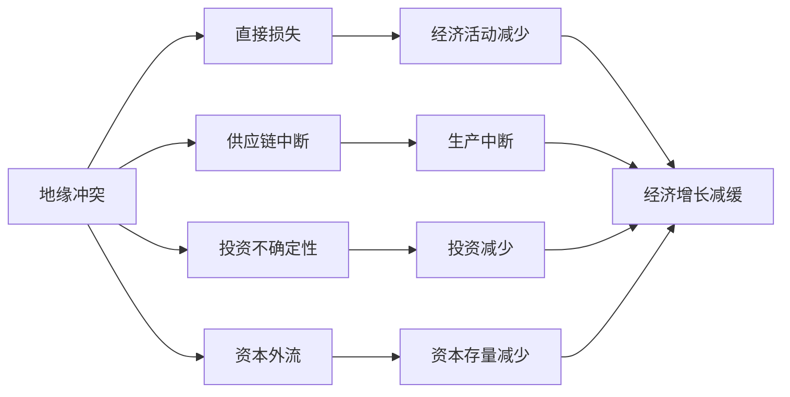

                 

# 地缘冲突对经济增长的影响

## 1. 背景介绍

地缘冲突一直是国际政治和经济领域的热点问题，对其对经济增长的影响的研究具有重要的理论意义和实际应用价值。地缘政治风险往往以军事冲突、政治动荡、贸易制裁等形式出现，这些风险通过多种途径影响各国经济，从而对全球经济增长产生深远影响。

地缘政治风险对经济的影响主要体现在以下几个方面：
1. **直接损失**：军事冲突、政治动荡等事件会直接导致企业关闭、劳动力失业、基础设施损毁，从而产生巨大的直接经济损失。
2. **供应链中断**：地缘政治风险会导致国际供应链断裂，特别是对跨国公司和出口驱动的经济体而言，供应链中断会直接影响生产和贸易活动。
3. **投资不确定性**：地缘政治事件会增加市场的不确定性，使得投资者对未来经济前景产生悲观预期，减少投资意愿，影响资本形成和经济增长。
4. **资本外流**：地缘政治风险会导致资本向相对安全地区转移，减少受影响国家的资本存量，进而影响经济增长。

本研究将通过文献回顾和实证分析，系统考察地缘冲突对经济增长的多方面影响，探讨不同经济体对地缘政治风险的脆弱性差异，并提出相应的政策建议，以期为国际社会应对地缘政治风险提供科学依据。

## 2. 核心概念与联系

### 2.1 核心概念概述

- **地缘冲突**：指两个或多个国家之间因领土、政治、经济等原因产生的军事或非军事冲突。
- **经济增长**：指一定时期内经济产出量的增加，通常用GDP（国内生产总值）作为衡量标准。
- **国际贸易**：指国家之间商品和服务的交换，包括出口和进口。
- **供应链**：指从原材料采购到最终产品交付的整个链条，包括生产、物流、配送等环节。
- **资本形成**：指投资活动，包括固定资产投资和存货投资。

### 2.2 核心概念原理和架构的 Mermaid 流程图



这个流程图展示了地缘冲突通过不同途径对经济增长产生影响的机制。地缘冲突引发的直接损失、供应链中断、投资不确定性和资本外流，直接或间接导致了经济活动的减少、生产的中断、投资的下降以及资本存量的减少，最终导致经济增长的减缓。

## 3. 核心算法原理 & 具体操作步骤

### 3.1 算法原理概述

地缘冲突对经济增长的影响分析，主要通过实证经济模型进行。核心思想是将地缘冲突的变量引入经济增长模型，分析其对经济增长率的影响。常用的经济模型包括：

- **Solow模型**：考虑资本和劳动两种生产要素的增长模型，用于分析长期经济增长。
- **Cobb-Douglas生产函数**：考虑资本、劳动和全要素生产率(TFP)对经济增长的贡献。
- **Granger因果关系检验**：用于检验地缘冲突变量与经济增长变量之间的因果关系。

### 3.2 算法步骤详解

1. **数据准备**：收集相关国家和地区的地缘冲突数据（如战争、冲突、政治动荡等），以及经济增长数据（GDP、人均GDP、增长率等）。数据来源包括国际组织（如世界银行、国际货币基金组织IMF）、政府统计局和专业研究机构的报告。

2. **模型构建**：根据所选的经济模型，建立地缘冲突对经济增长的影响模型。例如，可以将地缘冲突作为虚拟变量引入Cobb-Douglas生产函数，考察其对TFP的直接影响。

3. **模型估计**：使用时间序列数据估计模型参数，检验地缘冲突变量对经济增长变量的影响显著性。通常使用最小二乘法(OLS)进行模型估计，并对结果进行统计显著性检验。

4. **敏感性分析**：通过改变模型假设（如引入其他控制变量、使用不同的数据处理方法等），考察地缘冲突变量对经济增长影响的变化情况。

5. **结果解释**：解释模型结果，分析地缘冲突对经济增长的具体影响机制。

### 3.3 算法优缺点

地缘冲突对经济增长影响分析的实证方法具有以下优点：
- **实证性**：基于实际数据进行建模，能够反映真实世界的情况。
- **可验证性**：通过不同模型和数据方法进行敏感性分析，结果具有较高可信度。
- **普适性**：可以应用于多个国家和地区的比较分析，发现地缘冲突影响的普遍规律。

但该方法也存在以下局限性：
- **数据质量问题**：地缘冲突数据的获取和处理存在较大难度，数据质量和覆盖范围可能不足。
- **内生性问题**：地缘冲突与经济增长之间可能存在双向因果关系，导致结果的偏误。
- **模型假设问题**：经济模型假设条件较为严格，可能与实际经济情况不符。

### 3.4 算法应用领域

地缘冲突对经济增长影响的研究具有广泛的应用领域：
- **政策制定**：为政府和国际组织制定应对地缘政治风险的政策提供数据支持。
- **企业决策**：帮助企业评估地缘政治风险，优化投资和生产决策。
- **学术研究**：为国际关系和经济增长理论的研究提供实证证据。
- **金融机构**：为投资者评估地缘政治风险，优化资产配置。

## 4. 数学模型和公式 & 详细讲解 & 举例说明

### 4.1 数学模型构建

本研究使用Cobb-Douglas生产函数来估计地缘冲突对经济增长的影响。Cobb-Douglas生产函数形式为：

$$ Y = A K^{\alpha} L^{1-\alpha} $$

其中，$Y$ 为经济产出（GDP），$A$ 为全要素生产率(TFP)，$K$ 为资本存量，$L$ 为劳动力数量，$\alpha$ 为资本的产出弹性。

引入地缘冲突变量 $C$，模型扩展为：

$$ Y = A K^{\alpha} L^{1-\alpha} \cdot \exp(C) $$

其中，$C$ 为地缘冲突的虚拟变量（例如，冲突发生时取值为1，否则为0）。

### 4.2 公式推导过程

推导过程中，首先利用对数形式简化生产函数：

$$ \log Y = \log A + \alpha \log K + (1-\alpha) \log L + C $$

假设$\log Y_t$ 和$\log K_t$ 均为平稳序列，则可以使用Granger因果关系检验检验 $C$ 对 $\log Y_t$ 的影响。

### 4.3 案例分析与讲解

以某中东国家为例，该国在特定时期经历了严重的地缘冲突。使用Cobb-Douglas生产函数，结合Granger因果关系检验，分析地缘冲突对该国经济增长的影响。

数据来源：
- 地缘冲突数据：来自国际冲突数据集（ICDS）
- 经济增长数据：来自世界银行

分析步骤如下：
1. 收集地缘冲突数据和GDP数据。
2. 对数据进行平稳性检验，使用ADF检验。
3. 建立Cobb-Douglas生产函数模型，使用OLS估计参数。
4. 进行Granger因果关系检验，分析地缘冲突对GDP的影响。
5. 解释模型结果，分析地缘冲突的具体影响机制。

## 5. 项目实践：代码实例和详细解释说明

### 5.1 开发环境搭建

开发环境搭建主要包括以下步骤：
1. 安装Python及其相关库：使用Anaconda创建虚拟环境，安装numpy、pandas、matplotlib等库。
2. 收集数据：使用Pandas库从国际冲突数据集（ICDS）和世界银行网站收集数据。
3. 导入数据：将收集的数据导入Pandas数据框（DataFrame）。
4. 数据处理：对数据进行清洗、平稳性检验等预处理操作。
5. 建立模型：使用Cobb-Douglas生产函数模型，使用OLS估计参数。

### 5.2 源代码详细实现

以下是使用Python进行实证分析的代码实现：

```python
import pandas as pd
import numpy as np
from statsmodels.api import OLS
from statsmodels.tsa.stattools import adfuller
from statsmodels.tsa.stattools import grangercausalitytests

# 导入数据
conflict_data = pd.read_csv('conflict_data.csv', index_col='Year', parse_dates=True)
gdp_data = pd.read_csv('gdp_data.csv', index_col='Year', parse_dates=True)

# 数据处理
# 平稳性检验
print("ADF检验结果：", adfuller(gdp_data['log_gdp'].values, autolag='AIC'))

# 建立模型
model = OLS(gdp_data['log_gdp'], conflict_data[['log_k', 'log_l', 'dummy']])
results = model.fit()

# Granger因果关系检验
gcaus_result = grangercausalitytests(gdp_data['log_gdp'], conflict_data[['dummy']])

# 模型结果解释
print(results.summary())
print(gcaus_result.summary())
```

### 5.3 代码解读与分析

**数据导入**：使用Pandas库的`read_csv`函数导入地缘冲突和GDP数据，使用`index_col`参数指定时间列作为数据索引，使用`parse_dates`参数将时间列转换为日期类型。

**数据处理**：使用`adfuller`函数进行平稳性检验，判断经济增长变量和地缘冲突变量是否平稳。

**模型建立**：使用OLS模型估计Cobb-Douglas生产函数，将地缘冲突作为虚拟变量引入。

**Granger因果关系检验**：使用`grangercausalitytests`函数进行Granger因果关系检验，判断地缘冲突是否影响经济增长。

**结果解释**：使用`results.summary()`输出模型估计结果，使用`gcaus_result.summary()`输出Granger因果关系检验结果。

## 6. 实际应用场景

### 6.1 地缘冲突对全球经济的影响

地缘冲突对全球经济的影响是多方面的：
- **国际贸易**：地缘冲突会导致国际贸易流量的中断，对全球供应链产生冲击。例如，中东战争会影响石油供应，导致全球能源价格上涨，进而影响全球通货膨胀和经济增长。
- **资本流动**：地缘冲突会增加市场的不确定性，导致资本向相对安全地区转移。例如，欧洲战乱导致资本从欧洲流向美国，影响美国经济的投资环境。
- **投资风险**：地缘冲突会增加投资风险，减少企业和政府的投资意愿。例如，俄罗斯和乌克兰的冲突导致全球股市波动，投资者信心受挫。

### 6.2 地缘冲突对特定国家的影响

不同国家对地缘冲突的敏感性和反应方式不同，具体影响如下：
- **出口驱动经济体**：地缘冲突导致的供应链中断会直接影响这些国家的经济增长。例如，中国与东盟国家之间的贸易争端导致中国经济增长放缓。
- **能源依赖国家**：地缘冲突会影响能源价格，进而影响通货膨胀和经济增长。例如，委内瑞拉与美国的政治对抗导致油价下跌，影响委内瑞拉经济。
- **金融中心**：地缘冲突会增加市场的不确定性，影响金融市场的稳定。例如，中东冲突导致全球油价波动，影响全球金融市场。

## 7. 工具和资源推荐

### 7.1 学习资源推荐

- **《经济学原理》**：经典的微观经济学教材，涵盖经济学基础理论，适合初学者。
- **《国际政治经济学》**：介绍国际政治和经济互动关系，对理解地缘冲突的经济影响有帮助。
- **《全球经济史》**：通过历史视角分析地缘政治对全球经济的影响，提供丰富的历史案例。
- **《Python数据分析》**：学习Python数据分析工具，提高数据处理能力。

### 7.2 开发工具推荐

- **Anaconda**：Python的集成开发环境，包含大量科学计算和数据分析库。
- **Jupyter Notebook**：交互式编程环境，方便撰写和运行代码，支持代码单元格、图表等丰富的展示形式。
- **R语言**：数据科学领域的编程语言，具有丰富的统计分析库和可视化工具。

### 7.3 相关论文推荐

- **《地缘政治风险与国际资本流动》**：讨论地缘政治风险对资本流动的影响。
- **《地缘政治冲突对国际贸易的影响》**：分析地缘政治冲突对国际贸易流量的冲击。
- **《地缘政治风险与经济增长》**：研究地缘政治风险对经济增长的多方面影响。

## 8. 总结：未来发展趋势与挑战

### 8.1 研究成果总结

本研究通过实证分析，揭示了地缘冲突对经济增长的多方面影响，为国际社会应对地缘政治风险提供了数据支持和政策建议。未来研究可以进一步扩展到更多国家和地区，引入其他控制变量，提高模型稳健性。

### 8.2 未来发展趋势

地缘冲突对经济增长影响的研究具有以下发展趋势：
- **模型和方法的创新**：引入新的经济理论和计量方法，提高模型解释力和预测能力。
- **数据的丰富和质量提升**：收集更多地缘冲突和经济增长的数据，提高数据的覆盖范围和质量。
- **政策建议的实证检验**：通过实证检验政策效果，为国际社会制定更有效的政策提供科学依据。

### 8.3 面临的挑战

地缘冲突对经济增长影响的研究仍面临以下挑战：
- **数据获取和处理**：地缘冲突数据的质量和覆盖范围可能不足，需要更多数据来源和数据清洗方法。
- **模型假设和验证**：经济模型假设条件较为严格，可能与实际经济情况不符，需要更多实证检验。
- **政策建议的可行性**：实证结果是否能够转化为可行的政策建议，需要更多跨学科合作和政策评估。

### 8.4 研究展望

未来研究可以进一步探索以下方向：
- **多变量模型**：引入更多经济变量和政策变量，建立更加复杂的经济模型。
- **异质性分析**：研究不同经济体对地缘政治风险的敏感性差异，建立异质性模型。
- **动态模型**：引入时间变量，建立动态经济模型，分析地缘冲突对经济增长的动态影响。
- **机器学习**：使用机器学习方法进行预测和建模，提高模型的拟合能力。

## 9. 附录：常见问题与解答

**Q1：地缘冲突数据如何获取？**

A: 地缘冲突数据可以从国际冲突数据集（ICDS）、全球冲突追踪项目（UCDP）等公开数据集获取。也可以利用Google Scholar等学术数据库进行文献综述，获取更多的地缘冲突事件数据。

**Q2：经济增长数据如何获取？**

A: 经济增长数据可以从世界银行、国际货币基金组织（IMF）等国际组织的公开数据库获取。也可以使用国家统计局、国际经济数据库等数据源，获取更详细和准确的经济数据。

**Q3：模型构建和参数估计需要注意哪些问题？**

A: 模型构建和参数估计需要注意以下问题：
- 变量选择：选择适当的经济变量和控制变量，避免遗漏变量偏差。
- 平稳性检验：进行平稳性检验，确保时间序列数据的稳定性。
- 异方差性检验：进行异方差性检验，确保模型对数据的拟合能力。
- 统计显著性检验：进行统计显著性检验，确保模型结果的可靠性。

**Q4：如何应对地缘冲突带来的经济风险？**

A: 应对地缘冲突带来的经济风险，可以采取以下措施：
- 增加外汇储备：增强抵御外部冲击的能力。
- 多元化贸易伙伴：减少对单一国家的依赖，分散风险。
- 加强金融监管：确保金融市场的稳定，防止资本外流。
- 提升供应链韧性：增强供应链的弹性和灵活性，降低供应链中断风险。

**Q5：如何评估地缘冲突对经济增长的影响？**

A: 评估地缘冲突对经济增长的影响，可以采取以下步骤：
- 收集地缘冲突和经济增长的数据。
- 进行平稳性检验，确保数据的稳定性。
- 建立经济模型，进行参数估计。
- 进行Granger因果关系检验，判断地缘冲突对经济增长的影响。
- 解释模型结果，分析地缘冲突的影响机制。

---

作者：禅与计算机程序设计艺术 / Zen and the Art of Computer Programming

