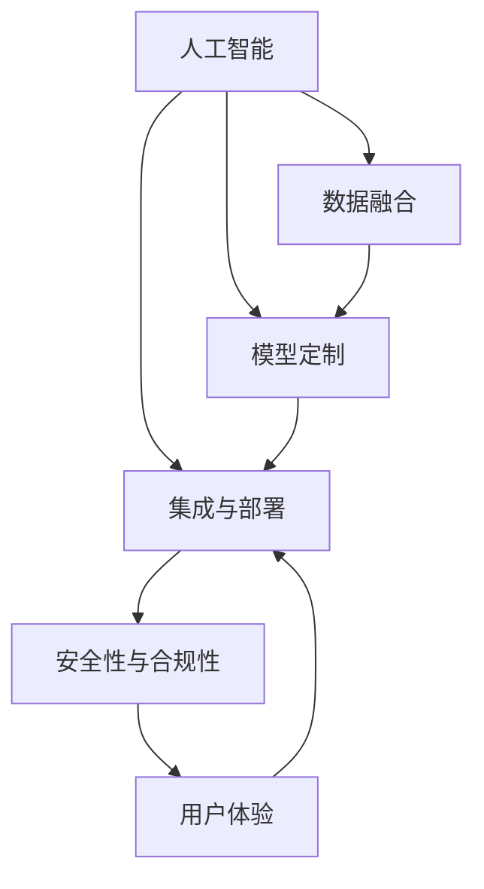

                 

# 垂直行业软件与AI的结合

## 1. 背景介绍

### 1.1 问题由来
随着人工智能(AI)技术的发展，越来越多的行业开始探索如何将其与现有业务系统进行结合，以实现智能化升级和业务创新。垂直行业软件与AI的结合，是当前技术发展的重要方向。通过在行业特定的软件系统中引入AI功能，企业能够更高效地处理数据、优化流程、提升服务质量。

然而，AI与垂直行业软件的结合并非易事。垂直行业通常具有复杂性和特殊性，AI模型需要在特定的业务场景中进行定制和优化，才能发挥其最大效能。此外，不同行业对数据安全和合规性的要求不同，如何在符合法律法规的前提下，高效安全地实现AI与软件系统的融合，是实践中的重要挑战。

### 1.2 问题核心关键点
AI与垂直行业软件的结合需要考虑以下几个核心问题：

1. **数据适配**：不同行业的业务数据通常具有复杂性和多样性，如何适配数据源、清洗数据、提取有用特征，是AI应用的首要挑战。
2. **模型定制**：通用AI模型往往无法直接应用于垂直行业，需要根据特定业务场景进行模型定制，以提升模型效果和泛化能力。
3. **集成与部署**：如何将训练好的AI模型高效集成到现有软件系统中，并保证其在生产环境中的稳定运行和实时响应，是实际应用中的关键。
4. **安全性与合规性**：AI模型涉及大量敏感数据，如何确保数据安全、满足行业合规要求，是应用过程中的重要保障。
5. **用户体验**：AI与软件系统的结合应当以用户为中心，如何设计直观易用的用户界面，提升用户体验，是应用成功的重要因素。

### 1.3 问题研究意义
AI与垂直行业软件的结合，不仅能够提升企业的智能化水平，降低运营成本，还能为消费者提供更加个性化、高效的服务体验。通过AI技术的引入，企业能够更好地理解用户需求，优化产品和服务，提高市场竞争力。此外，AI技术在医疗、金融、制造、零售等众多领域的应用，能够推动传统行业向数字化、智能化转型，为社会经济的发展注入新的动力。

## 2. 核心概念与联系

### 2.1 核心概念概述

为了更好地理解AI与垂直行业软件的结合，我们需要先了解几个关键概念：

- **人工智能(AI)**：通过机器学习、深度学习等技术，使计算机具备学习、推理和决策能力，以实现智能化的目标。
- **垂直行业软件**：专注于特定行业需求的软件系统，如医疗管理软件、金融风险控制系统等。
- **数据融合**：将不同来源的数据进行清洗、整合，形成可供AI模型训练和推理的统一数据集。
- **模型定制**：根据特定行业特点，对通用AI模型进行结构调整、参数优化，以提升模型在行业场景中的适用性。
- **集成与部署**：将训练好的AI模型集成到现有软件中，并通过高效部署策略保证其在生产环境中的稳定运行。
- **安全性与合规性**：确保数据安全和模型合规，满足不同行业的法律法规和隐私保护要求。
- **用户体验(UX)**：通过良好的用户界面设计，提升用户对软件系统的使用体验。

这些核心概念之间的逻辑关系可以通过以下Mermaid流程图来展示：



这个流程图展示了几大核心概念之间的相互关系：

1. AI技术需要通过数据融合获取所需数据源，然后进行模型定制。
2. 定制后的模型需要被集成到现有软件中，并通过高效部署策略保证其在生产环境中的稳定运行。
3. 集成过程中需要考虑数据安全和模型合规，以满足不同行业的法律法规和隐私保护要求。
4. 用户体验是应用成功的重要因素，良好的用户体验设计能提升用户对系统使用效率的满意度。

## 3. 核心算法原理 & 具体操作步骤
### 3.1 算法原理概述

AI与垂直行业软件的结合，本质上是一个数据驱动的智能决策过程。其核心思想是通过AI模型对行业数据进行分析和处理，自动化的生成决策建议或直接做出决策，以提升业务效率和效果。

形式化地，假设垂直行业软件系统为 $S$，其中包含输入数据 $D$、业务规则 $R$ 和输出决策 $D'$。AI模型 $M$ 作为系统的一部分，负责对输入数据 $D$ 进行处理，并结合业务规则 $R$，输出决策建议 $D'$。具体流程如下：

1. 收集行业数据 $D$，包括历史数据和实时数据。
2. 对数据进行清洗、转换、整合，形成统一的数据格式。
3. 根据业务需求，选择适当的AI模型 $M$，如监督学习、无监督学习或强化学习等。
4. 对模型进行定制，以适应特定行业场景，进行参数调整和结构优化。
5. 将训练好的模型 $M$ 集成到现有软件系统 $S$ 中，并设定合适的输出决策规则 $R'$。
6. 在生产环境中，系统接收新数据 $D'$，通过模型 $M$ 处理并结合业务规则 $R'$，生成决策建议 $D''$，进行业务优化或自动化决策。

### 3.2 算法步骤详解

基于上述模型定制和集成的基本框架，AI与垂直行业软件的结合可以进一步细化为以下步骤：

**Step 1: 数据准备与预处理**

1. **数据收集**：从不同渠道收集行业相关的数据，包括结构化数据和非结构化数据。
2. **数据清洗**：去除噪声数据、处理缺失值、进行数据归一化等预处理操作。
3. **特征提取**：从清洗后的数据中提取有意义的特征，供后续模型训练使用。

**Step 2: 模型选择与定制**

1. **模型选择**：根据业务需求选择适合的机器学习模型，如线性回归、支持向量机、决策树、神经网络等。
2. **模型定制**：对选定的模型进行结构调整和参数优化，以适应特定行业场景。

**Step 3: 模型训练与评估**

1. **数据划分**：将清洗后的数据集分为训练集、验证集和测试集。
2. **模型训练**：在训练集上使用梯度下降等优化算法，训练模型。
3. **模型评估**：在验证集上评估模型性能，调整超参数，防止过拟合。
4. **模型测试**：在测试集上进一步评估模型泛化能力，确保模型效果稳定可靠。

**Step 4: 集成与部署**

1. **模型集成**：将训练好的模型嵌入现有软件系统，并设定合适的输出规则。
2. **系统部署**：在生产环境中部署系统，并设置监控机制，保证系统稳定运行。
3. **用户交互设计**：设计直观易用的用户界面，提升用户体验。

**Step 5: 维护与优化**

1. **系统监控**：实时监测系统运行状态，收集反馈信息。
2. **模型更新**：根据业务变化和新数据，周期性更新模型。
3. **用户体验优化**：根据用户反馈，持续改进系统界面和功能。

### 3.3 算法优缺点

AI与垂直行业软件结合的优势在于：

1. **效率提升**：自动化处理数据和决策，提升业务效率。
2. **质量保障**：模型经过定制和训练，能够更准确地处理行业数据。
3. **用户体验**：通过直观易用的界面设计，提升用户满意度。

但其也存在一些局限性：

1. **数据复杂性**：垂直行业数据通常复杂多样，处理难度大。
2. **模型定制难度**：通用模型需要针对特定行业进行定制，工作量较大。
3. **系统集成复杂**：将AI模型集成到现有系统中，可能需要改造原有架构。
4. **安全与合规风险**：涉及敏感数据的处理，需确保数据安全和合规。
5. **技术门槛高**：需要具备AI模型训练、集成、部署等技术能力。

尽管存在这些局限性，但AI与垂直行业软件的结合仍是大势所趋，其带来的效率提升和业务优化具有显著优势。

### 3.4 算法应用领域

AI与垂直行业软件的结合，在多个领域都已取得显著应用效果。以下是几个典型的应用案例：

**医疗领域**：
- **智能诊断系统**：结合医学影像和病历数据，辅助医生进行疾病诊断和治疗方案推荐。
- **药物研发**：通过分析海量生物数据，加速药物筛选和临床试验。

**金融领域**：
- **风险评估系统**：利用历史交易数据，进行信用风险评估和欺诈检测。
- **投资策略优化**：基于市场数据，生成自动化交易策略，提升投资回报。

**制造领域**：
- **智能质检系统**：通过图像识别技术，实时检测生产线上产品的质量。
- **供应链优化**：预测市场需求，优化库存和物流管理。

**零售领域**：
- **个性化推荐系统**：根据用户行为数据，生成个性化商品推荐。
- **库存管理系统**：基于销售数据，预测库存需求，优化库存管理。

这些应用案例展示了AI与垂直行业软件结合的广泛前景和巨大潜力。

## 4. 数学模型和公式 & 详细讲解
### 4.1 数学模型构建

以医疗领域的智能诊断系统为例，构建一个简单的分类模型。假设系统接收到患者的症状描述 $X$，输出诊断结果 $Y$，其中 $Y$ 可能为正常、轻度、中度或重度。

我们采用监督学习中的逻辑回归模型作为分类器，其数学模型如下：

$$
P(Y|X;\theta) = \frac{1}{1+e^{-\theta^TX}}
$$

其中 $\theta$ 为模型参数，$P(Y|X;\theta)$ 为在特征 $X$ 下，目标 $Y$ 的条件概率。

### 4.2 公式推导过程

对于上述逻辑回归模型，我们需要通过最大化似然函数来估计参数 $\theta$。设训练集为 $D=\{(x_i,y_i)\}_{i=1}^N$，则似然函数为：

$$
L(\theta) = \prod_{i=1}^N P(y_i|x_i;\theta)
$$

取对数后得：

$$
\ell(\theta) = -\sum_{i=1}^N \log P(y_i|x_i;\theta)
$$

接下来，我们使用梯度下降算法最小化损失函数 $\ell(\theta)$：

$$
\theta \leftarrow \theta - \eta \nabla_{\theta}\ell(\theta)
$$

其中 $\eta$ 为学习率，$\nabla_{\theta}\ell(\theta)$ 为损失函数对参数 $\theta$ 的梯度。

### 4.3 案例分析与讲解

**医疗影像分类**：
- **数据准备**：收集患者影像数据和诊断结果。
- **特征提取**：将影像数据转化为数值特征，如图像像素值、边缘特征等。
- **模型训练**：在特征化后的影像数据上训练逻辑回归模型。
- **模型评估**：使用验证集评估模型性能，调整参数。
- **应用部署**：将训练好的模型嵌入智能诊断系统，并结合业务规则进行决策。

## 5. 项目实践：代码实例和详细解释说明
### 5.1 开发环境搭建

在进行AI与垂直行业软件结合的实践前，我们需要准备好开发环境。以下是使用Python进行TensorFlow和PyTorch开发的环境配置流程：

1. 安装Anaconda：从官网下载并安装Anaconda，用于创建独立的Python环境。

2. 创建并激活虚拟环境：
```bash
conda create -n tf-env python=3.8 
conda activate tf-env
```

3. 安装TensorFlow和PyTorch：根据CUDA版本，从官网获取对应的安装命令。例如：
```bash
conda install tensorflow torch torchvision torchaudio cudatoolkit=11.1 -c pytorch -c conda-forge
```

4. 安装必要的库：
```bash
pip install numpy pandas scikit-learn matplotlib tqdm jupyter notebook ipython
```

完成上述步骤后，即可在`tf-env`环境中开始实践。

### 5.2 源代码详细实现

下面我们以医疗影像分类为例，给出使用TensorFlow和PyTorch进行AI与垂直行业软件结合的代码实现。

**TensorFlow实现**：

```python
import tensorflow as tf
from tensorflow.keras.datasets import mnist

# 加载数据集
(x_train, y_train), (x_test, y_test) = mnist.load_data()

# 数据预处理
x_train = x_train / 255.0
x_test = x_test / 255.0

# 构建模型
model = tf.keras.models.Sequential([
    tf.keras.layers.Flatten(input_shape=(28, 28)),
    tf.keras.layers.Dense(128, activation='relu'),
    tf.keras.layers.Dense(10, activation='softmax')
])

# 编译模型
model.compile(optimizer='adam',
              loss='sparse_categorical_crossentropy',
              metrics=['accuracy'])

# 训练模型
model.fit(x_train, y_train, epochs=10, validation_data=(x_test, y_test))
```

**PyTorch实现**：

```python
import torch
import torch.nn as nn
import torchvision
from torchvision import datasets, transforms

# 定义数据预处理
transform = transforms.Compose([
    transforms.ToTensor(),
    transforms.Normalize((0.5,), (0.5,))
])

# 加载数据集
trainset = datasets.MNIST('data', train=True, download=True, transform=transform)
testset = datasets.MNIST('data', train=False, download=True, transform=transform)

# 定义数据加载器
trainloader = torch.utils.data.DataLoader(trainset, batch_size=64, shuffle=True)
testloader = torch.utils.data.DataLoader(testset, batch_size=64, shuffle=False)

# 定义模型
class Net(nn.Module):
    def __init__(self):
        super(Net, self).__init__()
        self.fc1 = nn.Linear(28 * 28, 128)
        self.fc2 = nn.Linear(128, 10)
        self.fc3 = nn.Linear(10, 1)

    def forward(self, x):
        x = x.view(-1, 28 * 28)
        x = F.relu(self.fc1(x))
        x = F.softmax(self.fc2(x), dim=1)
        x = self.fc3(x)
        return x

# 实例化模型
model = Net()

# 定义优化器和损失函数
optimizer = torch.optim.Adam(model.parameters(), lr=0.001)
criterion = nn.CrossEntropyLoss()

# 训练模型
for epoch in range(10):
    running_loss = 0.0
    for i, data in enumerate(trainloader, 0):
        inputs, labels = data
        optimizer.zero_grad()
        outputs = model(inputs)
        loss = criterion(outputs, labels)
        loss.backward()
        optimizer.step()

    print(f'Epoch {epoch+1}, loss: {running_loss:.3f}')
```

以上是使用TensorFlow和PyTorch进行AI与垂直行业软件结合的代码实现。可以看到，通过这两个框架，我们可以快速搭建并训练医疗影像分类模型。

### 5.3 代码解读与分析

**TensorFlow代码解读**：
- 使用Keras API构建了一个简单的神经网络模型，包括一个输入层、一个隐藏层和一个输出层。
- 定义了Adam优化器和交叉熵损失函数，并使用均方误差作为评估指标。
- 使用数据集`mnist`进行模型训练，并设置验证集。

**PyTorch代码解读**：
- 定义了数据预处理步骤，包括将图像转换为Tensor格式和归一化处理。
- 使用`datasets.MNIST`加载MNIST数据集，并定义数据加载器。
- 定义了一个简单的神经网络模型，包含三个全连接层。
- 使用Adam优化器和交叉熵损失函数进行模型训练。

### 5.4 运行结果展示

在训练结束后，可以通过以下代码进行模型评估：

```python
# 使用测试集评估模型
correct = 0
total = 0
with torch.no_grad():
    for data in testloader:
        images, labels = data
        outputs = model(images)
        _, predicted = torch.max(outputs.data, 1)
        total += labels.size(0)
        correct += (predicted == labels).sum().item()

print(f'Accuracy of the network on the test images: {100 * correct / total}%')
```

运行结果展示了模型在测试集上的准确率。

## 6. 实际应用场景
### 6.1 智能诊断系统

AI与垂直行业软件的结合，在医疗领域有广泛的应用前景。智能诊断系统通过分析患者症状和历史病历，结合医学影像数据，生成诊断建议，辅助医生进行决策。

以X光影像诊断为例，系统可以将患者的X光影像数据输入模型，结合病历数据，输出可能的疾病类型和严重程度。医生可以参考系统生成的诊断结果，进行进一步的检查和诊断，提升诊疗效率。

### 6.2 风险评估系统

在金融领域，风险评估系统通过分析客户的交易数据、信用记录等信息，生成信用风险评估结果。系统可以通过历史数据训练模型，学习信用评分机制，实时评估新客户的信用风险，优化信贷决策。

### 6.3 智能质检系统

制造企业可以通过AI与垂直行业软件结合，构建智能质检系统。系统通过图像识别技术，实时检测生产线上产品的质量缺陷，自动分类和标记，生成质检报告。企业可以根据质检报告，及时调整生产工艺和质量控制策略，提升产品质量。

### 6.4 未来应用展望

随着AI技术的不断发展，AI与垂直行业软件的结合将在更多领域得到应用，为传统行业带来变革性影响。

在智慧城市治理中，智能交通、智能安防、智能能源等领域将引入AI技术，提升城市管理水平和居民生活质量。

在智能家居领域，智能家电、智能安防等应用将变得更加智能和人性化，提升用户体验和家庭安全。

在教育领域，个性化学习、智能辅导等应用将帮助学生更高效地学习和成长，推动教育公平。

总之，AI与垂直行业软件的结合，将推动各行业的数字化转型，提升企业的智能化水平和市场竞争力，带来更美好的未来。

## 7. 工具和资源推荐
### 7.1 学习资源推荐

为了帮助开发者系统掌握AI与垂直行业软件结合的理论基础和实践技巧，这里推荐一些优质的学习资源：

1. **TensorFlow官方文档**：TensorFlow官方提供的详细文档，包含丰富的示例和API参考，适合初学者入门。
2. **PyTorch官方文档**：PyTorch官方提供的详细文档，涵盖从基础到高级的内容，适合深度学习和AI开发。
3. **《深度学习入门》**：张异辰教授的入门级深度学习书籍，内容通俗易懂，适合初学者。
4. **《动手学深度学习》**：李沐教授的深度学习实战书籍，包含丰富的代码示例和项目实践。
5. **Coursera和Udacity的深度学习课程**：斯坦福大学、DeepLearning.AI等机构的深度学习课程，适合进阶学习。

通过对这些资源的学习实践，相信你一定能够快速掌握AI与垂直行业软件结合的精髓，并用于解决实际的业务问题。

### 7.2 开发工具推荐

高效的开发离不开优秀的工具支持。以下是几款用于AI与垂直行业软件结合开发的常用工具：

1. **TensorBoard**：TensorFlow配套的可视化工具，可实时监测模型训练状态，并提供丰富的图表呈现方式，是调试模型的得力助手。
2. **TensorFlow Extended (TFX)**：Google提供的开源机器学习库，包含数据处理、模型训练、部署等一站式解决方案。
3. **PyTorch Lightning**：PyTorch的加速训练库，支持分布式训练、自动化超参优化等，提高训练效率。
4. **Kubeflow**：Kubernetes的机器学习工作流，提供一站式机器学习部署和管理，适合大规模分布式训练。
5. **TorchServe**：PyTorch的模型部署工具，支持多种框架模型部署，易于使用。

合理利用这些工具，可以显著提升AI与垂直行业软件结合的开发效率，加快创新迭代的步伐。

### 7.3 相关论文推荐

AI与垂直行业软件的结合，涉及到深度学习、优化算法、模型集成等多个领域。以下是几篇奠基性的相关论文，推荐阅读：

1. **Deep Learning**：Ian Goodfellow等著的深度学习经典书籍，详细介绍了深度学习的原理和应用。
2. **TensorFlow Cookbook**：Robert Chang等著的TensorFlow实战书籍，包含丰富的示例代码和项目实践。
3. **Model-Based Reinforcement Learning for Predictive Maintenance**：这篇论文介绍了基于模型驱动的强化学习在预测性维护中的应用。
4. **Safe and Interpretable Reinforcement Learning in Healthcare**：这篇论文讨论了在医疗领域如何应用强化学习进行安全可解释的决策。

这些论文代表了大语言模型微调技术的发展脉络。通过学习这些前沿成果，可以帮助研究者把握学科前进方向，激发更多的创新灵感。

## 8. 总结：未来发展趋势与挑战
### 8.1 研究成果总结

本文对AI与垂直行业软件结合进行了全面系统的介绍。首先阐述了AI与垂直行业软件结合的背景和意义，明确了结合在提升业务效率和效果方面的重要价值。其次，从原理到实践，详细讲解了结合的数学模型和操作步骤，给出了具体的代码实现和运行结果。同时，本文还广泛探讨了结合在医疗、金融、制造等多个领域的应用前景，展示了其广阔的发展空间。

通过本文的系统梳理，可以看到，AI与垂直行业软件的结合正成为各行业智能化升级的重要方向。这种结合不仅能够提升企业的智能化水平，降低运营成本，还能为消费者提供更加个性化、高效的服务体验。未来，伴随AI技术的不断演进，结合过程的优化和智能化水平提升将成为行业发展的关键。

### 8.2 未来发展趋势

展望未来，AI与垂直行业软件结合的发展趋势如下：

1. **数据驱动**：未来结合将以更加多样化和高质量的数据为基础，数据驱动的决策和优化将更加普遍。
2. **模型自动化**：结合过程中的模型选择、定制和训练将更多地依赖自动化工具，减少人工干预。
3. **跨领域融合**：结合将更多地与其他人工智能技术（如知识图谱、自然语言处理等）进行融合，提升系统性能和智能水平。
4. **边缘计算**：结合将更多地应用边缘计算技术，减少数据传输，提升系统响应速度和可靠性。
5. **AI驱动的业务创新**：结合将推动更多业务模式创新，提升企业竞争力，促进产业升级。

### 8.3 面临的挑战

尽管AI与垂直行业软件的结合取得了显著成效，但在迈向更加智能化、普适化应用的过程中，仍然面临以下挑战：

1. **数据孤岛**：不同行业的业务数据通常分散在不同的系统中，数据整合难度大。
2. **模型通用性不足**：现有的通用模型无法直接应用于特定行业，模型定制工作量大。
3. **技术复杂性高**：结合过程涉及数据预处理、模型训练、集成部署等多个环节，技术门槛高。
4. **合规性和安全性**：涉及敏感数据和业务规则，如何确保数据安全和合规，是应用过程中的重要保障。
5. **用户体验**：如何将AI技术融入自然流畅的用户界面，提升用户满意度，是应用成功的重要因素。

### 8.4 研究展望

为了应对这些挑战，未来的研究需要在以下几个方面寻求新的突破：

1. **数据治理**：构建统一的数据治理体系，解决数据孤岛问题，提升数据整合效率。
2. **模型迁移学习**：开发通用的模型迁移学习算法，提升模型在不同行业中的通用性和适用性。
3. **模型自动化**：研究模型自动化调参、超参优化等技术，提升模型训练和调优效率。
4. **跨模态融合**：研究跨模态信息融合技术，提升系统的智能化水平和鲁棒性。
5. **用户交互设计**：研究用户交互设计理论，提升系统的易用性和用户体验。

这些研究方向将引领AI与垂直行业软件的结合向更高层次发展，为构建更加智能、高效的业务系统铺平道路。

## 9. 附录：常见问题与解答

**Q1：AI与垂直行业软件结合的优势有哪些？**

A: AI与垂直行业软件结合的优势在于：

1. **效率提升**：自动化处理数据和决策，提升业务效率。
2. **质量保障**：模型经过定制和训练，能够更准确地处理行业数据。
3. **用户体验**：通过直观易用的界面设计，提升用户满意度。

**Q2：如何选择适合垂直行业的AI模型？**

A: 选择适合垂直行业的AI模型需要考虑以下几个方面：

1. **数据类型**：根据数据的类型（如结构化、非结构化、时序数据等）选择相应的模型。
2. **业务需求**：根据业务需求选择适合的模型，如监督学习、无监督学习、强化学习等。
3. **模型性能**：评估模型的泛化能力、鲁棒性等性能指标，选择最优模型。
4. **模型可解释性**：选择可解释性强的模型，便于业务理解和决策支持。

**Q3：如何确保AI与垂直行业软件结合的安全性？**

A: 确保AI与垂直行业软件结合的安全性需要考虑以下几个方面：

1. **数据安全**：采用数据加密、访问控制等措施，保护数据安全。
2. **模型鲁棒性**：采用对抗样本训练、模型蒸馏等技术，提高模型的鲁棒性。
3. **合规性**：确保模型应用符合行业法律法规和隐私保护要求，建立合规审计机制。

**Q4：如何设计用户友好的AI应用界面？**

A: 设计用户友好的AI应用界面需要考虑以下几个方面：

1. **直观性**：界面设计应直观易懂，避免复杂操作和繁琐步骤。
2. **交互性**：提供交互式操作，增强用户参与感和体验。
3. **反馈机制**：及时提供反馈信息，告知用户操作结果和系统状态。
4. **定制化**：根据用户偏好和需求，提供个性化的界面定制。

**Q5：AI与垂直行业软件结合有哪些具体应用案例？**

A: AI与垂直行业软件结合的具体应用案例包括：

1. **智能诊断系统**：医疗影像诊断、病理分析等。
2. **风险评估系统**：信用评分、欺诈检测等。
3. **智能质检系统**：产品质量检测、缺陷分类等。
4. **智能客服系统**：语音识别、情感分析等。
5. **个性化推荐系统**：商品推荐、广告投放等。

通过这些应用案例，可以看到AI与垂直行业软件结合的广泛前景和巨大潜力。

**Q6：AI与垂直行业软件结合有哪些技术难点？**

A: AI与垂直行业软件结合的技术难点主要包括：

1. **数据适配**：垂直行业数据通常复杂多样，处理难度大。
2. **模型定制**：通用模型需要针对特定行业进行定制，工作量较大。
3. **系统集成**：将AI模型集成到现有系统中，可能需要改造原有架构。
4. **安全性与合规性**：涉及敏感数据，需确保数据安全和合规。
5. **用户体验**：如何将AI技术融入自然流畅的用户界面，提升用户满意度。

通过这些技术难点，可以看到AI与垂直行业软件结合的复杂性和挑战性，需要多方协同解决。

---

作者：禅与计算机程序设计艺术 / Zen and the Art of Computer Programming

