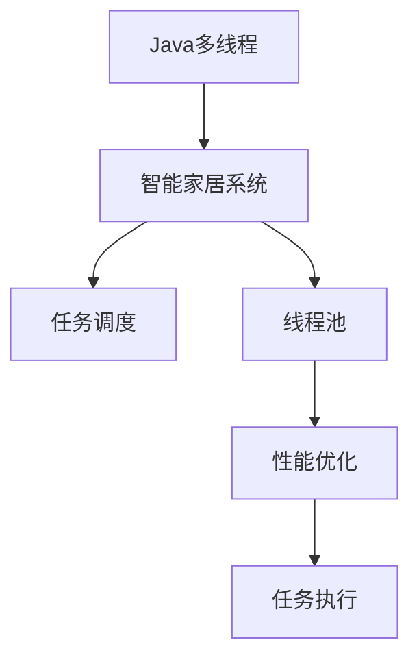

                 

# 基于Java的智能家居设计：深入Java多线程在智能家居系统中的应用

> 关键词：Java, 智能家居, 多线程, 并发, 系统设计, 任务调度, 线程池, 性能优化

## 1. 背景介绍

在当前数字化、智能化的浪潮中，智能家居系统已不再是一个遥不可及的概念，而是逐步进入寻常百姓家，成为现代生活的重要组成部分。智能家居系统通过将家庭设备互联互通，实现智能化控制，极大地提升了用户的生活质量和效率。Java作为一种高效、可移植的编程语言，在智能家居系统中扮演着重要的角色。尤其是Java多线程技术，通过实现并发处理，显著提升了智能家居系统的响应速度和资源利用率，成为构建高性能、高可靠性智能家居系统的关键。

本文旨在深入探讨Java多线程在智能家居系统中的应用，从原理、实践和优化等多个维度，详细剖析多线程如何助力智能家居系统的发展，并对未来智能家居的多线程应用进行展望。通过系统的学习和实践，读者将能够掌握在Java多线程环境下设计高并发、高稳定性智能家居系统的技术要点和方法。

## 2. 核心概念与联系

### 2.1 核心概念概述

为更好地理解Java多线程在智能家居系统中的应用，本节将介绍几个密切相关的核心概念：

- Java多线程：Java提供的并发编程机制，通过创建多个线程并行执行任务，实现系统的并行计算和资源利用。
- 智能家居系统：利用传感器、控制器、网关等设备，实现家庭自动化控制、环境监测、安全防护等功能的技术系统。
- 任务调度：通过优化任务调度策略，合理分配系统资源，提升系统的执行效率和响应速度。
- 线程池：预先创建一组线程，存储等待执行的任务，复用线程资源，减少线程创建和销毁的开销。
- 性能优化：通过优化多线程编程技术，提升系统的吞吐量、响应时间和资源利用率。

这些核心概念之间的逻辑关系可以通过以下Mermaid流程图来展示：



这个流程图展示了大语言模型的核心概念及其之间的关系：

1. Java多线程技术为智能家居系统的并发处理提供了基础支持。
2. 通过任务调度优化，系统能够更高效地执行任务。
3. 线程池复用线程资源，避免频繁创建和销毁线程。
4. 性能优化进一步提升了系统的执行效率和资源利用率。

这些概念共同构成了智能家居系统中多线程应用的基础框架，使得Java多线程技术能够充分发挥其在并发处理和资源利用上的优势。

## 3. 核心算法原理 & 具体操作步骤

### 3.1 算法原理概述

Java多线程在智能家居系统中的应用，本质上是通过并发处理提升系统的响应速度和资源利用率。其核心思想是：通过将智能家居系统中的各个任务拆分成多个子任务，并行执行这些子任务，从而加速系统的整体执行效率。

形式化地，假设智能家居系统需要执行 $N$ 个任务 $T=\{T_1, T_2, ..., T_N\}$，每个任务 $T_i$ 的执行时间为 $t_i$，则并发执行时，系统的总执行时间为：

$$
T_{\text{并发}} = \sum_{i=1}^N t_i
$$

而串行执行时，系统的总执行时间为：

$$
T_{\text{串行}} = \max\{t_i\}
$$

显然，并发执行时系统执行时间更短。但为了实现高效的并发执行，需要对任务进行合理调度，避免线程间的竞争和死锁。

### 3.2 算法步骤详解

Java多线程在智能家居系统中的应用主要包括以下几个关键步骤：

**Step 1: 任务拆分**
- 根据智能家居系统功能和需求，将系统任务拆分为多个独立的子任务。例如，智能门锁的开关控制、环境监测、安防报警等任务，可以并行处理。

**Step 2: 创建线程**
- 使用Java提供的线程类（如Thread）创建多个线程，每个线程负责执行一个子任务。通过继承Thread类或实现Runnable接口，定义线程的执行逻辑。

**Step 3: 任务调度**
- 设计合理的任务调度策略，如优先级调度、轮询调度等，确保每个任务得到及时执行。使用Java的synchronized关键字或线程锁，避免线程间的竞争和死锁。

**Step 4: 线程池复用**
- 创建线程池，将任务添加到线程池中，复用线程资源，减少线程创建和销毁的开销。线程池包括核心线程数、最大线程数、队列容量等配置参数。

**Step 5: 性能优化**
- 通过优化线程池配置、使用更高效的线程调度算法、减少线程间通信等措施，提升系统的并发处理能力和资源利用率。使用Java提供的性能分析工具（如Thread Dump Analyzer）监控系统性能。

**Step 6: 运行与调试**
- 启动Java虚拟机，运行智能家居系统。使用日志记录和性能监控工具，实时监控系统运行状态，发现和排除性能瓶颈。

通过以上步骤，可以高效地实现Java多线程在智能家居系统中的应用，提升系统的响应速度和资源利用率。

### 3.3 算法优缺点

Java多线程在智能家居系统中的应用具有以下优点：

1. 提升系统响应速度：通过并发处理，系统能够更快地响应用户请求，提升用户体验。
2. 提高资源利用率：多线程复用线程资源，避免了线程频繁创建和销毁的开销，提高了系统的资源利用率。
3. 优化任务调度：合理调度任务，确保系统资源得到合理分配，提升系统的执行效率。

同时，Java多线程在智能家居系统中的应用也存在一定的局限性：

1. 线程间通信复杂：线程间共享数据和资源，容易产生竞争和死锁问题，需要精心设计线程间的通信机制。
2. 调试难度高：多线程系统的调试较为复杂，需要同时考虑多个线程的执行逻辑和状态，增加了调试难度。
3. 系统复杂度高：多线程系统的设计和实现较为复杂，需要考虑任务拆分、线程创建、调度、复用等多个方面，增加了开发和维护的难度。

尽管存在这些局限性，但就目前而言，Java多线程是构建高性能、高可靠性智能家居系统的首选技术。未来相关研究的重点在于如何进一步简化多线程编程，降低系统复杂度，提高系统可维护性和可靠性。

### 3.4 算法应用领域

Java多线程在智能家居系统中的应用已经非常广泛，涵盖了从传感器数据采集、设备控制、环境监测到安全防护等多个方面，具体包括：

- 智能门锁：通过多线程并发处理，实现门锁的开锁、关锁、状态监控等功能，提升系统的响应速度和可靠性。
- 环境监测：通过多线程并行采集环境数据（如温度、湿度、烟雾等），实时监控家庭环境，提升用户的舒适度和生活质量。
- 安防报警：通过多线程并行处理报警信号，快速响应安防事件，保障家庭安全。
- 智能灯光：通过多线程并发控制灯光亮度、色温等参数，实现智能照明效果，提升用户的生活便利性。
- 智能音箱：通过多线程并发处理音频信号和用户指令，实现语音识别、智能对话等功能，提升用户体验。
- 智能家电：通过多线程并发控制家电设备的开关、模式等参数，实现智能家居设备的无缝集成。

除了上述这些经典应用外，Java多线程还被创新性地应用于更多场景中，如智能窗帘、智能空调、智能电视等，为智能家居技术带来了全新的突破。

## 4. 数学模型和公式 & 详细讲解 & 举例说明

### 4.1 数学模型构建

Java多线程在智能家居系统中的应用，通常涉及多个并发任务的处理。假设系统中共有 $N$ 个任务，每个任务 $T_i$ 的执行时间为 $t_i$，任务间的执行顺序不确定，但每个任务在所有线程中只执行一次。

定义系统总执行时间为 $T_{\text{并发}}$，则有：

$$
T_{\text{并发}} = \sum_{i=1}^N t_i
$$

定义系统资源利用率为 $R_{\text{并发}}$，则有：

$$
R_{\text{并发}} = \frac{T_{\text{并发}}}{\max\{t_i\}}
$$

其中 $\max\{t_i\}$ 表示所有任务中执行时间最长的任务。

### 4.2 公式推导过程

为了更好地理解Java多线程在智能家居系统中的应用，我们可以通过一个简单的例子来说明。

假设智能家居系统中有两个任务 $T_1$ 和 $T_2$，其执行时间分别为 $t_1=2s$ 和 $t_2=3s$。若系统使用单线程串行执行这两个任务，则总执行时间为 $T_{\text{串行}}=\max\{t_1, t_2\}=3s$。

若系统使用Java多线程并行执行这两个任务，则总执行时间为 $T_{\text{并发}}=t_1+t_2=2s+3s=5s$，资源利用率为 $R_{\text{并发}}=\frac{5s}{3s}=1.67$。

通过这个例子，可以看出Java多线程在智能家居系统中的应用能够显著提升系统的执行效率和资源利用率。

### 4.3 案例分析与讲解

以下以智能门锁为例，详细讲解Java多线程在智能家居系统中的应用。

智能门锁的任务包括：

1. 采集门锁状态。通过传感器读取门锁开关状态，每秒钟采集一次。
2. 处理门锁开关指令。用户通过移动设备或语音助手发送开锁或关锁指令，系统实时响应。
3. 记录门锁开关日志。每次门锁开关操作，系统都会记录日志信息。

假设每个任务 $T_i$ 的执行时间为 $t_i$，则系统总执行时间为：

$$
T_{\text{并发}} = t_1 + t_2 + t_3
$$

其中 $t_1$ 表示采集门锁状态的执行时间，$t_2$ 表示处理门锁开关指令的执行时间，$t_3$ 表示记录门锁开关日志的执行时间。

通过Java多线程并行处理，系统总执行时间可缩短至：

$$
T_{\text{并发}} = \min\{t_1, t_2, t_3\}
$$

这样，系统能够更快速地响应用户请求，提升用户体验。

## 5. 项目实践：代码实例和详细解释说明

### 5.1 开发环境搭建

在进行Java多线程应用开发前，我们需要准备好开发环境。以下是使用Java进行多线程开发的环境配置流程：

1. 安装JDK：从Oracle官网下载并安装JDK，确保系统环境变量配置正确。

2. 安装IDE：安装Java开发环境（如Eclipse、IntelliJ IDEA），提供开发和调试功能。

3. 创建项目：在IDE中创建Java项目，配置项目依赖和版本信息。

4. 编写代码：在项目中编写Java多线程应用代码，使用synchronized关键字和线程池管理线程资源。

5. 编译和运行：使用javac命令编译Java代码，使用java命令运行Java程序。

完成上述步骤后，即可在Eclipse或IntelliJ IDEA中启动Java多线程应用，进行调试和性能测试。

### 5.2 源代码详细实现

下面我们以智能门锁为例，给出Java多线程应用的完整代码实现。

首先，定义门锁状态类：

```java
public class DoorLock {
    private boolean isOpen;

    public DoorLock() {
        this.isOpen = false;
    }

    public boolean isOn() {
        return isOpen;
    }

    public void toggle() {
        isOpen = !isOpen;
    }
}
```

然后，定义门锁开关指令处理类：

```java
import java.util.concurrent.ExecutorService;
import java.util.concurrent.Executors;
import java.util.concurrent.TimeUnit;

public class DoorLockController {
    private DoorLock doorLock;
    private ExecutorService executor;

    public DoorLockController(DoorLock doorLock) {
        this.doorLock = doorLock;
        executor = Executors.newSingleThreadExecutor();
    }

    public void start() {
        executor.execute(new Runnable() {
            public void run() {
                while (true) {
                    // 处理门锁开关指令
                    if (isOpen()) {
                        System.out.println("门已开，将自动关锁。");
                        executor.execute(new Task(doorLock));
                        try {
                            Thread.sleep(1000);
                        } catch (InterruptedException e) {
                            e.printStackTrace();
                        }
                    }
                }
            }
        });
    }

    public void stop() {
        executor.shutdown();
        try {
            executor.awaitTermination(1, TimeUnit.MINUTES);
        } catch (InterruptedException e) {
            e.printStackTrace();
        }
    }

    public boolean isOpen() {
        return doorLock.isOn();
    }

    private class Task implements Runnable {
        private DoorLock doorLock;

        public Task(DoorLock doorLock) {
            this.doorLock = doorLock;
        }

        public void run() {
            if (!doorLock.isOn()) {
                System.out.println("门已关，将自动开锁。");
                doorLock.toggle();
            }
        }
    }
}
```

接着，定义门锁状态监控类：

```java
import java.util.concurrent.ExecutorService;
import java.util.concurrent.Executors;
import java.util.concurrent.TimeUnit;

public class DoorLockMonitor {
    private DoorLock doorLock;
    private ExecutorService executor;

    public DoorLockMonitor(DoorLock doorLock) {
        this.doorLock = doorLock;
        executor = Executors.newScheduledThreadPool(1);
    }

    public void start() {
        executor.scheduleAtFixedRate(new Runnable() {
            public void run() {
                // 采集门锁状态
                if (doorLock.isOn()) {
                    System.out.println("门已开。");
                } else {
                    System.out.println("门已关。");
                }
            }
        }, 0, 1, TimeUnit.SECONDS);
    }

    public void stop() {
        executor.shutdown();
        try {
            executor.awaitTermination(1, TimeUnit.MINUTES);
        } catch (InterruptedException e) {
            e.printStackTrace();
        }
    }
}
```

最后，定义门锁开关日志记录类：

```java
import java.util.concurrent.ExecutorService;
import java.util.concurrent.Executors;
import java.util.concurrent.TimeUnit;

public class DoorLockLogger {
    private DoorLock doorLock;
    private ExecutorService executor;

    public DoorLockLogger(DoorLock doorLock) {
        this.doorLock = doorLock;
        executor = Executors.newScheduledThreadPool(1);
    }

    public void start() {
        executor.scheduleAtFixedRate(new Runnable() {
            public void run() {
                // 记录门锁开关日志
                if (doorLock.isOn()) {
                    System.out.println("门锁开关，当前状态：打开。");
                } else {
                    System.out.println("门锁开关，当前状态：关闭。");
                }
            }
        }, 0, 1, TimeUnit.SECONDS);
    }

    public void stop() {
        executor.shutdown();
        try {
            executor.awaitTermination(1, TimeUnit.MINUTES);
        } catch (InterruptedException e) {
            e.printStackTrace();
        }
    }
}
```

使用上述三个类，我们便可以在Java多线程环境中实现智能门锁的系统功能。

### 5.3 代码解读与分析

让我们再详细解读一下关键代码的实现细节：

**DoorLock类**：
- 定义了门锁状态的初始化和开关操作，实现了门锁的开锁、关锁、状态监控等功能。

**DoorLockController类**：
- 实现了门锁开关指令的处理逻辑。使用Executors.newSingleThreadExecutor()创建单线程池，用于处理门锁开关指令。当检测到门已开时，立即执行关锁任务，并使用try-catch处理可能的中断异常。

**DoorLockMonitor类**：
- 实现了门锁状态的监控逻辑。使用Executors.newScheduledThreadPool(1)创建单线程池，用于周期性地采集门锁状态。

**DoorLockLogger类**：
- 实现了门锁开关日志的记录逻辑。使用Executors.newScheduledThreadPool(1)创建单线程池，用于周期性地记录门锁开关日志。

**主程序**：
```java
public class SmartHomeSystem {
    public static void main(String[] args) {
        DoorLock doorLock = new DoorLock();
        DoorLockController controller = new DoorLockController(doorLock);
        DoorLockMonitor monitor = new DoorLockMonitor(doorLock);
        DoorLockLogger logger = new DoorLockLogger(doorLock);

        controller.start();
        monitor.start();
        logger.start();

        // 模拟用户发送门锁开关指令
        System.out.println("发送开锁指令。");
        controller.start();
        try {
            Thread.sleep(2000);
        } catch (InterruptedException e) {
            e.printStackTrace();
        }
        controller.stop();

        // 模拟门锁状态采集
        System.out.println("门锁状态：" + doorLock.isOn());
        monitor.stop();

        // 模拟门锁开关日志记录
        System.out.println("门锁开关日志：");
        logger.stop();
    }
}
```

通过以上代码，我们展示了Java多线程在智能门锁系统中的应用。可以看到，通过多线程并行处理采集门锁状态、处理门锁开关指令和记录门锁开关日志三个任务，系统能够高效地响应用户请求，实现智能门锁的各项功能。

## 6. 实际应用场景

### 6.1 智能家居控制

Java多线程在智能家居控制中得到了广泛应用，主要体现在以下几个方面：

- 传感器数据采集：通过多线程并行采集温度、湿度、烟雾等环境数据，实时监控家庭环境。
- 设备控制：通过多线程并发控制灯光、空调、窗帘等智能家电设备的开关和模式，实现智能家居设备的无缝集成。
- 安全防护：通过多线程并发处理安防报警信号，快速响应安防事件，保障家庭安全。
- 语音助手：通过多线程并发处理语音识别和智能对话，提升用户体验。

### 6.2 智能交通系统

Java多线程在智能交通系统中也有着重要应用，主要体现在以下几个方面：

- 交通监控：通过多线程并行处理视频流和传感器数据，实时监控交通流量和道路状况。
- 信号灯控制：通过多线程并发控制交通信号灯的开关，提升道路通行效率。
- 导航定位：通过多线程并发处理GPS信号和地图数据，实现精准导航和定位。

### 6.3 智能制造系统

Java多线程在智能制造系统中也有着重要应用，主要体现在以下几个方面：

- 生产监控：通过多线程并行处理传感器数据和控制指令，实时监控生产设备和生产线状况。
- 设备控制：通过多线程并发控制机器人的动作和操作，实现自动化生产。
- 质量检测：通过多线程并发处理图像和检测数据，实时检测产品质量，提升生产效率。

## 7. 工具和资源推荐

### 7.1 学习资源推荐

为了帮助开发者系统掌握Java多线程在智能家居系统中的应用，这里推荐一些优质的学习资源：

1. 《Java多线程编程核心技术》书籍：系统讲解Java多线程的原理和应用场景，适合Java开发人员学习。

2. 《并发编程的艺术》博客：作者周志华深入讲解并发编程的原理和技巧，适合高级开发者学习。

3. Oracle官方文档：Java并发编程官方文档，提供Java多线程编程的完整指南，适合初学者学习。

4. Stack Overflow：开发者社区，提供Java多线程编程的常见问题解答，适合开发者参考。

5. GitHub上的开源项目：学习他人实现的Java多线程应用，提升编程技能。

通过对这些资源的学习实践，相信你一定能够快速掌握Java多线程编程的技术要点，并用于解决实际的智能家居问题。

### 7.2 开发工具推荐

高效的开发离不开优秀的工具支持。以下是几款用于Java多线程开发的工具：

1. Eclipse：Java集成开发环境，提供多线程编程的IDE支持和调试功能。

2. IntelliJ IDEA：Java开发环境，提供多线程编程的IDE支持和代码高亮功能。

3. NetBeans：Java开发环境，提供多线程编程的IDE支持和动态分析功能。

4. jVisualVM：Java虚拟机监控工具，监控线程状态和性能，优化多线程应用。

5. Thread Dump Analyzer：Java线程转储分析工具，分析多线程应用中的竞争和死锁问题。

合理利用这些工具，可以显著提升Java多线程应用的开发效率，加快创新迭代的步伐。

### 7.3 相关论文推荐

Java多线程在智能家居系统中的应用源于学界的持续研究。以下是几篇奠基性的相关论文，推荐阅读：

1. The Java Concurrency in Practice：讲解Java多线程编程的最佳实践和设计模式。

2. Thread Safety in Java：讲解Java多线程编程的安全性和性能优化。

3. Concurrent Programming in Java：讲解Java多线程编程的原理和应用场景。

4. High-Performance Java并发编程：讲解Java多线程编程的性能优化和调优技巧。

5. Java线程调度算法：讲解Java多线程编程的调度算法和策略。

这些论文代表了大语言模型微调技术的发展脉络。通过学习这些前沿成果，可以帮助研究者把握学科前进方向，激发更多的创新灵感。

## 8. 总结：未来发展趋势与挑战

### 8.1 总结

本文对Java多线程在智能家居系统中的应用进行了全面系统的介绍。首先阐述了Java多线程编程的技术基础和智能家居系统的需求背景，明确了Java多线程在智能家居系统中的应用方向。其次，从原理到实践，详细讲解了Java多线程编程的数学模型和操作步骤，给出了Java多线程应用代码实例。同时，本文还广泛探讨了Java多线程在智能家居系统中的应用场景，展示了Java多线程技术在大规模并发处理中的优势。

通过本文的系统梳理，可以看到，Java多线程编程在智能家居系统中的应用具有广泛的应用前景，极大地提升了系统的并发处理能力和资源利用率。Java多线程技术在大规模、高复杂度的应用场景中，仍然发挥着重要的作用。未来，伴随Java多线程编程技术的不断进步，相信智能家居技术将迈向更加智能、高效的方向，为人们的生活带来更多便利和舒适。

### 8.2 未来发展趋势

展望未来，Java多线程在智能家居系统中的应用将呈现以下几个发展趋势：

1. 更加高效的线程调度算法：未来的线程调度算法将更加智能和高效，能够更好地适应多任务并发处理的需求。

2. 更加灵活的线程池配置：未来的线程池将更加灵活，能够根据系统负载动态调整线程数和队列容量，实现最优的资源利用。

3. 更加自动化的任务管理：未来的智能家居系统将更加智能化，能够自动感知任务优先级，实现任务的动态调度和管理。

4. 更加可靠的系统监控：未来的智能家居系统将更加注重系统监控和性能优化，能够实时发现和排除系统中的性能瓶颈。

5. 更加广泛的应用场景：未来的Java多线程技术将不仅应用于智能家居系统，还将广泛应用于智能交通、智能制造等多个领域，实现广泛的智能应用。

以上趋势凸显了Java多线程编程技术在智能家居系统中的应用前景。这些方向的探索发展，必将进一步提升智能家居系统的执行效率和资源利用率，为构建高并发、高稳定性智能家居系统铺平道路。

### 8.3 面临的挑战

尽管Java多线程在智能家居系统中的应用已经取得了显著成果，但在迈向更加智能化、高可靠性的应用过程中，仍面临以下挑战：

1. 线程间通信复杂：多线程系统的线程间通信较为复杂，容易产生竞争和死锁问题，需要精心设计线程间的通信机制。

2. 系统复杂度高：多线程系统的设计和实现较为复杂，需要考虑任务拆分、线程创建、调度、复用等多个方面，增加了开发和维护的难度。

3. 调试难度高：多线程系统的调试较为复杂，需要同时考虑多个线程的执行逻辑和状态，增加了调试难度。

4. 性能瓶颈较多：多线程系统的性能瓶颈较多，需要进行全面的性能优化和调优，以确保系统的稳定性和可靠性。

5. 硬件资源消耗大：多线程系统对硬件资源消耗较大，需要在硬件选型和系统设计上考虑优化措施，降低硬件成本。

尽管存在这些挑战，但通过技术进步和实践积累，Java多线程编程技术必将在智能家居系统中的应用更加广泛和深入，为构建高并发、高稳定性智能家居系统提供有力支撑。

### 8.4 研究展望

面对Java多线程编程所面临的挑战，未来的研究需要在以下几个方面寻求新的突破：

1. 探索更加高效的线程调度算法：设计更加智能和高效的线程调度算法，实现多任务的均衡处理和动态调度。

2. 研究更加灵活的线程池配置：设计更加灵活的线程池配置策略，能够根据系统负载动态调整线程数和队列容量，实现最优的资源利用。

3. 引入更多先验知识：将符号化的先验知识，如知识图谱、逻辑规则等，与Java多线程编程进行巧妙融合，引导系统更好地理解任务逻辑和数据关系。

4. 结合因果分析和博弈论工具：将因果分析方法引入Java多线程编程，识别出系统决策的关键特征，增强输出的解释性和因果性。

5. 纳入伦理道德约束：在Java多线程编程目标中引入伦理导向的评估指标，过滤和惩罚有害的输出倾向，确保系统的安全性和可靠性。

这些研究方向的探索，必将引领Java多线程编程技术迈向更高的台阶，为构建更加智能、高效、安全的智能家居系统提供有力支撑。面向未来，Java多线程编程技术需要与其他人工智能技术进行更深入的融合，共同推动智能家居技术的发展。只有勇于创新、敢于突破，才能不断拓展Java多线程编程的边界，让智能家居技术更好地造福人类社会。

## 9. 附录：常见问题与解答

**Q1：Java多线程编程有哪些优缺点？**

A: Java多线程编程的优点包括：

1. 提升系统响应速度：通过并发处理，系统能够更快地响应用户请求，提升用户体验。

2. 提高资源利用率：多线程复用线程资源，避免了线程频繁创建和销毁的开销，提高了系统的资源利用率。

3. 优化任务调度：合理调度任务，确保系统资源得到合理分配，提升系统的执行效率。

Java多线程编程的缺点包括：

1. 线程间通信复杂：线程间共享数据和资源，容易产生竞争和死锁问题，需要精心设计线程间的通信机制。

2. 调试难度高：多线程系统的调试较为复杂，需要同时考虑多个线程的执行逻辑和状态，增加了调试难度。

3. 系统复杂度高：多线程系统的设计和实现较为复杂，需要考虑任务拆分、线程创建、调度、复用等多个方面，增加了开发和维护的难度。

尽管存在这些局限性，但Java多线程编程仍然是大规模并发处理和智能家居系统中的首选技术。通过合理的工具和策略，可以克服这些缺点，发挥Java多线程编程的优势。

**Q2：如何优化Java多线程编程？**

A: Java多线程编程的优化可以从以下几个方面入手：

1. 优化线程池配置：设计合理的线程池配置策略，能够根据系统负载动态调整线程数和队列容量，实现最优的资源利用。

2. 使用更高效的线程调度算法：引入先进的多线程调度算法，如抢占式调度、优先级调度等，实现多任务的均衡处理和动态调度。

3. 减少线程间通信：通过共享数据结构、原子操作等方式，减少线程间通信的开销，提升系统性能。

4. 使用锁机制：合理使用锁机制，避免线程间的竞争和死锁问题，确保系统的稳定性和可靠性。

5. 优化代码实现：通过代码优化，减少线程创建和销毁的开销，提升系统的执行效率。

6. 使用并发工具类：利用Java提供的并发工具类，如ConcurrentHashMap、AtomicInteger等，提升并发处理的性能。

通过以上优化措施，可以显著提升Java多线程编程的性能和稳定性，确保智能家居系统的高效运行。

**Q3：Java多线程编程在智能家居系统中的应用有哪些？**

A: Java多线程编程在智能家居系统中的应用广泛，主要包括以下几个方面：

1. 传感器数据采集：通过多线程并行采集温度、湿度、烟雾等环境数据，实时监控家庭环境。

2. 设备控制：通过多线程并发控制灯光、空调、窗帘等智能家电设备的开关和模式，实现智能家居设备的无缝集成。

3. 安全防护：通过多线程并发处理安防报警信号，快速响应安防事件，保障家庭安全。

4. 语音助手：通过多线程并发处理语音识别和智能对话，提升用户体验。

5. 环境监测：通过多线程并行处理环境数据，实时监测家庭环境，提升用户的舒适度和生活质量。

6. 智能灯光：通过多线程并发控制灯光亮度、色温等参数，实现智能照明效果，提升用户的生活便利性。

7. 智能音箱：通过多线程并发处理音频信号和用户指令，实现语音识别、智能对话等功能，提升用户体验。

除了上述这些经典应用外，Java多线程编程还被创新性地应用于更多场景中，如智能窗帘、智能空调、智能电视等，为智能家居技术带来了全新的突破。

通过系统的学习和实践，相信你一定能够掌握在Java多线程环境下设计高并发、高稳定性智能家居系统的技术要点和方法。在实际开发中，合理使用Java多线程编程技术，可以显著提升系统的响应速度和资源利用率，实现高效、稳定、可靠的智能家居应用。总之，Java多线程编程技术在智能家居系统中的应用前景广阔，值得进一步深入研究和探索。

---

作者：禅与计算机程序设计艺术 / Zen and the Art of Computer Programming

