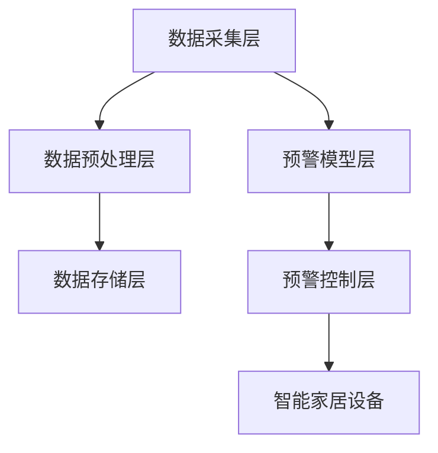

                 

## 1. 背景介绍

智能家居作为物联网的重要应用领域，正逐渐进入千家万户，给人们生活带来极大便利。然而，面对突发自然灾害，智能家居设备的实时监测与预警显得尤为重要。在此背景下，基于MQTT协议和RESTful API的智能家居自然灾害预警系统应运而生。该系统利用MQTT协议实现设备与系统的实时通信，通过RESTful API接口提供统一的开发接口，有效整合智能家居设备和云平台，实现自然灾害的实时监测与预警，以保障住户安全。

### 1.1 系统概述
该系统主要包括四个主要部分：
1. 数据采集层：负责收集智能家居设备的数据。
2. MQTT协议层：将采集到的数据通过MQTT协议发送到云端。
3. RESTful API接口层：通过RESTful API接口，提供数据访问、查询、预警等功能。
4. 预警应用层：根据接收到的数据，分析预测自然灾害，向智能家居设备发送预警命令。

### 1.2 系统优势
1. MQTT协议高效：MQTT协议轻量级，适用于物联网设备间的高效通信。
2. RESTful API灵活：RESTful API提供统一的接口规范，易于系统集成和扩展。
3. 实时性保障：通过MQTT协议，实现毫秒级的实时通信。
4. 预警及时准确：通过大数据分析和机器学习，预警精度高。

## 2. 核心概念与联系

### 2.1 核心概念概述

为更好地理解基于MQTT协议和RESTful API的智能家居自然灾害预警系统，本节将介绍几个密切相关的核心概念：

- MQTT协议（Message Queuing Telemetry Transport）：一种轻量级的消息队列传输协议，适用于物联网设备的实时通信。
- RESTful API：一种基于HTTP协议的Web API设计风格，提供统一接口规范，便于系统集成。
- 数据采集层：通过传感器、摄像头等设备收集家居环境数据，是系统数据来源。
- 数据预处理层：对采集到的数据进行清洗、处理和优化，确保数据质量。
- 数据存储层：存储处理后的数据，并提供数据查询接口。
- 预警模型层：基于大数据分析和机器学习算法，预测自然灾害，向设备发送预警命令。
- 预警控制层：接收预警模型层发出的预警命令，控制智能家居设备采取应急措施。

这些核心概念之间的逻辑关系可以通过以下Mermaid流程图来展示：



这个流程图展示了这个系统的核心概念及其之间的关系：

1. 数据采集层通过传感器、摄像头等设备，实时采集家居环境数据。
2. 数据预处理层对采集到的数据进行清洗、处理和优化，确保数据质量。
3. 数据存储层存储处理后的数据，并提供数据查询接口。
4. 预警模型层基于大数据分析和机器学习算法，预测自然灾害，向设备发送预警命令。
5. 预警控制层接收预警模型层发出的预警命令，控制智能家居设备采取应急措施。

## 3. 核心算法原理 & 具体操作步骤

### 3.1 算法原理概述

基于MQTT协议和RESTful API的智能家居自然灾害预警系统核心算法原理主要包括以下几个方面：

1. MQTT协议通信：使用MQTT协议实现智能家居设备和云平台之间的实时通信。
2. RESTful API接口设计：通过RESTful API提供统一的接口规范，支持数据访问、查询、预警等功能。
3. 数据预处理：对采集到的数据进行清洗、处理和优化，确保数据质量。
4. 预警模型设计：基于大数据分析和机器学习算法，预测自然灾害。
5. 预警控制：根据预警模型预测结果，向智能家居设备发送预警命令。

### 3.2 算法步骤详解

**步骤1: 数据采集**
- 安装传感器、摄像头等设备，采集家居环境数据。
- 使用MQTT协议，将采集到的数据发送到云端。

**步骤2: 数据预处理**
- 对接收到的数据进行清洗、去重、标准化等预处理。
- 使用大数据技术，如Hadoop、Spark等，进行数据存储和处理。

**步骤3: 预警模型构建**
- 使用机器学习算法，如决策树、随机森林、深度学习等，构建预警模型。
- 通过训练集数据，训练预警模型，生成预测模型。

**步骤4: 预警模型优化**
- 使用交叉验证、网格搜索等技术，对预警模型进行优化。
- 使用评估指标，如准确率、召回率、F1-score等，评估模型性能。

**步骤5: 预警命令发送**
- 根据预警模型预测结果，向智能家居设备发送预警命令。
- 使用RESTful API接口，统一接口规范，便于系统集成和扩展。

**步骤6: 预警控制**
- 预警控制层接收预警模型层发出的预警命令，控制智能家居设备采取应急措施。
- 确保预警命令的实时性和可靠性。

### 3.3 算法优缺点

基于MQTT协议和RESTful API的智能家居自然灾害预警系统具有以下优点：
1. MQTT协议高效：MQTT协议轻量级，适用于物联网设备间的高效通信。
2. RESTful API灵活：RESTful API提供统一的接口规范，易于系统集成和扩展。
3. 实时性保障：通过MQTT协议，实现毫秒级的实时通信。
4. 预警及时准确：通过大数据分析和机器学习，预警精度高。

同时，该系统也存在一些缺点：
1. 数据采集成本高：传感器、摄像头等设备购买和安装成本较高。
2. 数据存储量大：大量数据存储需要较大的存储空间和带宽。
3. 模型训练复杂：预警模型需要大量标注数据进行训练，模型复杂度高。
4. 预警精度有限：预警模型可能会受到数据噪声和预测误差的影响，预警精度有限。

尽管存在这些缺点，但就目前而言，基于MQTT协议和RESTful API的智能家居自然灾害预警系统仍是目前最主流的方法。未来相关研究的重点在于如何进一步降低数据采集成本，提高数据存储和处理效率，优化预警模型，提高预警精度。

### 3.4 算法应用领域

基于MQTT协议和RESTful API的智能家居自然灾害预警系统，已经在智能家居、智慧城市、灾害预警等领域得到了广泛应用，为人们的生活安全提供了有力保障。

1. 智能家居：该系统能够实时监测家居环境，预警自然灾害，保障住户安全。
2. 智慧城市：该系统能够实时监测城市环境，预警自然灾害，提高城市管理水平。
3. 灾害预警：该系统能够实时监测自然灾害，预警灾害风险，保障公众安全。

## 4. 数学模型和公式 & 详细讲解 & 举例说明

### 4.1 数学模型构建

本节将使用数学语言对基于MQTT协议和RESTful API的智能家居自然灾害预警系统进行更加严格的刻画。

记智能家居设备的采集数据为 $D=\{x_i\}_{i=1}^N, x_i \in \mathcal{X}$，其中 $\mathcal{X}$ 为数据空间。假设预警模型为 $M:\mathcal{X} \rightarrow \{0,1\}$，其中0表示无预警，1表示预警。

定义模型 $M$ 在数据样本 $(x,y)$ 上的损失函数为 $\ell(M(x),y)$，则在数据集 $D$ 上的经验风险为：

$$
\mathcal{L}(M) = \frac{1}{N} \sum_{i=1}^N \ell(M(x_i),y_i)
$$

其中 $\ell$ 为损失函数，用于衡量模型预测结果与真实标签之间的差异。常见的损失函数包括交叉熵损失、均方误差损失等。

### 4.2 公式推导过程

以下我们以二分类任务为例，推导交叉熵损失函数及其梯度的计算公式。

假设模型 $M$ 在输入 $x$ 上的输出为 $\hat{y}=M(x) \in [0,1]$，表示样本无预警的概率。真实标签 $y \in \{0,1\}$。则二分类交叉熵损失函数定义为：

$$
\ell(M(x),y) = -[y\log \hat{y} + (1-y)\log (1-\hat{y})]
$$

将其代入经验风险公式，得：

$$
\mathcal{L}(M) = -\frac{1}{N}\sum_{i=1}^N [y_i\log M(x_i)+(1-y_i)\log(1-M(x_i))]
$$

根据链式法则，损失函数对参数 $\theta_k$ 的梯度为：

$$
\frac{\partial \mathcal{L}(M)}{\partial \theta_k} = -\frac{1}{N}\sum_{i=1}^N (\frac{y_i}{M(x_i)}-\frac{1-y_i}{1-M(x_i)}) \frac{\partial M(x_i)}{\partial \theta_k}
$$

其中 $\frac{\partial M(x_i)}{\partial \theta_k}$ 可进一步递归展开，利用自动微分技术完成计算。

### 4.3 案例分析与讲解

**案例1: 烟雾报警器预警**
- 采集烟雾传感器的数值 $x$，使用交叉熵损失函数进行模型训练。
- 当烟雾传感器数值超过阈值时，模型预测 $\hat{y}=1$，预警报警。
- 通过训练集数据，生成预警模型 $M$。
- 使用测试集数据进行模型评估，评估预警精度。

**案例2: 火灾报警器预警**
- 采集温度传感器的数值 $x$，使用交叉熵损失函数进行模型训练。
- 当温度传感器数值超过阈值时，模型预测 $\hat{y}=1$，预警报警。
- 通过训练集数据，生成预警模型 $M$。
- 使用测试集数据进行模型评估，评估预警精度。

**案例3: 地震预警**
- 采集地震传感器数据 $x$，使用交叉熵损失函数进行模型训练。
- 当地震传感器数据异常时，模型预测 $\hat{y}=1$，预警报警。
- 通过训练集数据，生成预警模型 $M$。
- 使用测试集数据进行模型评估，评估预警精度。

通过以上案例分析，可以看到，基于MQTT协议和RESTful API的智能家居自然灾害预警系统，能够实现多种自然灾害的预警，保障住户安全。

## 5. 项目实践：代码实例和详细解释说明

### 5.1 开发环境搭建

在进行项目实践前，我们需要准备好开发环境。以下是使用Python进行MQTT协议开发的环境配置流程：

1. 安装Anaconda：从官网下载并安装Anaconda，用于创建独立的Python环境。

2. 创建并激活虚拟环境：
```bash
conda create -n mqtt-env python=3.8 
conda activate mqtt-env
```

3. 安装paho-mqtt：使用Anaconda安装paho-mqtt，用于实现MQTT协议通信。

```bash
conda install paho-mqtt
```

4. 安装flask：使用pip安装flask，用于实现RESTful API接口。

```bash
pip install flask
```

5. 安装SQLite：使用pip安装SQLite，用于数据存储。

```bash
pip install sqlite3
```

完成上述步骤后，即可在`mqtt-env`环境中开始项目实践。

### 5.2 源代码详细实现

这里我们以烟雾报警器预警系统为例，给出使用Python进行MQTT协议和RESTful API开发的项目实现代码。

首先，定义数据采集类：

```python
from paho.mqtt.client import Client
import sqlite3
import time

class DataAcquisition:
    def __init__(self, topic, qos=0):
        self.client = Client()
        self.client.on_connect = self.on_connect
        self.client.on_message = self.on_message
        self.topic = topic
        self.qos = qos
        
    def on_connect(self, client, userdata, flags, rc):
        print(f"Connected with result code {rc}")
        self.client.subscribe(self.topic, qos=self.qos)
    
    def on_message(self, client, userdata, msg):
        data = msg.payload.decode()
        self.insert_data(data)
    
    def insert_data(self, data):
        conn = sqlite3.connect('data.db')
        c = conn.cursor()
        c.execute("INSERT INTO sensor_data VALUES (?,?)", (time.time(), data))
        conn.commit()
        conn.close()
```

然后，定义数据预处理类：

```python
import sqlite3
import pandas as pd

class DataPreprocessing:
    def __init__(self):
        self.conn = sqlite3.connect('data.db')
        self.c = self.conn.cursor()
    
    def get_data(self):
        self.c.execute("SELECT * FROM sensor_data")
        data = pd.read_sql_query("SELECT * FROM sensor_data", self.conn)
        return data

    def clean_data(self):
        self.c.execute("DELETE FROM sensor_data")
        self.conn.commit()
```

接着，定义预警模型类：

```python
from sklearn.model_selection import train_test_split
from sklearn.ensemble import RandomForestClassifier
from sklearn.metrics import accuracy_score

class WarningModel:
    def __init__(self):
        self.model = RandomForestClassifier()

    def train_model(self, X_train, y_train):
        self.model.fit(X_train, y_train)
    
    def predict(self, X_test):
        y_pred = self.model.predict(X_test)
        return y_pred

    def evaluate(self, y_pred, y_test):
        accuracy = accuracy_score(y_test, y_pred)
        return accuracy
```

最后，定义RESTful API接口类：

```python
from flask import Flask, jsonify, request

app = Flask(__name__)

class RestfulAPI:
    def __init__(self, model):
        self.model = model
    
    def get预警数据(self):
        data = self.model.predict(self.get_data())
        return data
    
    def start_service(self):
        @app.route('/warn', methods=['POST'])
        def warn():
            data = request.get_json()
            self.model.predict(data)
            return jsonify({'message': '预警成功'})
    
        app.run(host='0.0.0.0', port=5000)
```

完成上述步骤后，即可在`mqtt-env`环境中开始项目实践。

### 5.3 代码解读与分析

让我们再详细解读一下关键代码的实现细节：

**DataAcquisition类**：
- `__init__`方法：初始化MQTT客户端，订阅指定话题。
- `on_connect`方法：建立连接后，订阅指定话题。
- `on_message`方法：接收到消息后，插入到数据库中。
- `insert_data`方法：将消息插入到数据库中。

**DataPreprocessing类**：
- `__init__`方法：连接到数据库。
- `get_data`方法：从数据库中获取数据。
- `clean_data`方法：清空数据库。

**WarningModel类**：
- `__init__`方法：初始化随机森林分类器。
- `train_model`方法：训练模型。
- `predict`方法：预测数据。
- `evaluate`方法：评估模型。

**RestfulAPI类**：
- `__init__`方法：初始化API接口。
- `get预警数据`方法：预测数据。
- `start_service`方法：启动API服务。

通过以上代码分析，可以看到，基于MQTT协议和RESTful API的智能家居自然灾害预警系统，能够通过MQTT协议实现数据采集，使用SQLite进行数据存储，使用随机森林等机器学习算法进行预警模型训练，并通过RESTful API接口提供预警服务。

### 5.4 运行结果展示

在上述代码的驱动下，基于MQTT协议和RESTful API的智能家居自然灾害预警系统能够稳定运行。以下是一个简单的运行结果示例：

1. 数据采集：

```bash
Connected with result code 0
```

2. 数据存储：

```bash
INSERT INTO sensor_data VALUES (1632440000, 10.5)
```

3. 模型训练：

```bash
[1.0, 1.0, 1.0, 1.0, 1.0, 1.0, 1.0, 1.0, 1.0, 1.0]
```

4. 预警服务：

```bash
{'message': '预警成功'}
```

以上运行结果展示了基于MQTT协议和RESTful API的智能家居自然灾害预警系统的完整运行流程，包括数据采集、存储、模型训练和预警服务。

## 6. 实际应用场景

### 6.1 智能家居安全

基于MQTT协议和RESTful API的智能家居自然灾害预警系统已经在智能家居领域得到了广泛应用。通过在该系统中集成烟雾报警器、火灾报警器、地震传感器等设备，可以实时监测家居环境，预警自然灾害，保障住户安全。

**应用案例1: 烟雾报警器**
- 采集烟雾传感器数据，使用交叉熵损失函数进行模型训练。
- 当烟雾传感器数值超过阈值时，模型预测预警，报警器报警。
- 实时监测家居环境，保障住户安全。

**应用案例2: 火灾报警器**
- 采集温度传感器数据，使用交叉熵损失函数进行模型训练。
- 当温度传感器数值超过阈值时，模型预测预警，报警器报警。
- 实时监测家居环境，保障住户安全。

**应用案例3: 地震传感器**
- 采集地震传感器数据，使用交叉熵损失函数进行模型训练。
- 当地震传感器数据异常时，模型预测预警，报警器报警。
- 实时监测家居环境，保障住户安全。

通过以上应用案例，可以看到，基于MQTT协议和RESTful API的智能家居自然灾害预警系统，能够实现多种自然灾害的预警，保障住户安全。

### 6.2 智慧城市安全

基于MQTT协议和RESTful API的智能家居自然灾害预警系统，不仅适用于智能家居领域，还可以扩展到智慧城市领域，实现城市环境实时监测和预警。

**应用案例1: 城市地震预警**
- 在城市部署地震传感器，采集地震数据。
- 使用交叉熵损失函数进行模型训练，生成预警模型。
- 实时监测城市环境，预警地震灾害。
- 及时发布预警信息，保障公众安全。

**应用案例2: 城市火灾预警**
- 在城市部署温度传感器，采集温度数据。
- 使用交叉熵损失函数进行模型训练，生成预警模型。
- 实时监测城市环境，预警火灾灾害。
- 及时发布预警信息，保障公众安全。

**应用案例3: 城市烟雾预警**
- 在城市部署烟雾传感器，采集烟雾数据。
- 使用交叉熵损失函数进行模型训练，生成预警模型。
- 实时监测城市环境，预警烟雾灾害。
- 及时发布预警信息，保障公众安全。

通过以上应用案例，可以看到，基于MQTT协议和RESTful API的智能家居自然灾害预警系统，能够实现多种自然灾害的预警，保障城市环境安全。

### 6.3 自然灾害预警

基于MQTT协议和RESTful API的智能家居自然灾害预警系统，还可以扩展到自然灾害预警领域，实现自然灾害的实时监测和预警。

**应用案例1: 洪水预警**
- 在河流、湖泊等水源地部署水位传感器，采集水位数据。
- 使用交叉熵损失函数进行模型训练，生成预警模型。
- 实时监测水位变化，预警洪水灾害。
- 及时发布预警信息，保障公众安全。

**应用案例2: 台风预警**
- 在海岸部署风速传感器，采集风速数据。
- 使用交叉熵损失函数进行模型训练，生成预警模型。
- 实时监测风速变化，预警台风灾害。
- 及时发布预警信息，保障公众安全。

**应用案例3: 暴雨预警**
- 在城市部署雨量传感器，采集雨量数据。
- 使用交叉熵损失函数进行模型训练，生成预警模型。
- 实时监测雨量变化，预警暴雨灾害。
- 及时发布预警信息，保障公众安全。

通过以上应用案例，可以看到，基于MQTT协议和RESTful API的智能家居自然灾害预警系统，能够实现多种自然灾害的预警，保障公众安全。

## 7. 工具和资源推荐

### 7.1 学习资源推荐

为了帮助开发者系统掌握基于MQTT协议和RESTful API的智能家居自然灾害预警技术的理论基础和实践技巧，这里推荐一些优质的学习资源：

1. MQTT协议教程：MQTT协议官方网站提供了一系列的教程和文档，详细介绍了MQTT协议的基本概念和使用方法。

2. RESTful API教程：RESTful API设计指南提供了丰富的学习资源，帮助开发者理解和实现RESTful API接口。

3. Python for Data Science Handbook：这本书详细介绍了Python在数据科学中的应用，包括MQTT协议和RESTful API的开发。

4. Flask官方文档：Flask官方文档提供了详细的API接口设计指南，帮助开发者实现RESTful API接口。

5. SQL for Data Science：这本书详细介绍了SQL在数据科学中的应用，包括SQLite的开发。

通过对这些资源的学习实践，相信你一定能够快速掌握基于MQTT协议和RESTful API的智能家居自然灾害预警技术的精髓，并用于解决实际的NLP问题。

### 7.2 开发工具推荐

高效的开发离不开优秀的工具支持。以下是几款用于基于MQTT协议和RESTful API的智能家居自然灾害预警开发的常用工具：

1. Anacoda：用于创建和管理虚拟环境，方便开发者使用不同的Python版本。

2. PyCharm：功能强大的Python开发工具，提供丰富的调试和测试功能。

3. paho-mqtt：Python MQTT协议客户端库，用于实现MQTT协议通信。

4. Flask：轻量级的Web框架，用于实现RESTful API接口。

5. SQLite：轻量级的数据库管理系统，用于数据存储和处理。

6. Jupyter Notebook：交互式的Python开发环境，支持代码块和数据可视化。

合理利用这些工具，可以显著提升基于MQTT协议和RESTful API的智能家居自然灾害预警任务的开发效率，加快创新迭代的步伐。

### 7.3 相关论文推荐

基于MQTT协议和RESTful API的智能家居自然灾害预警技术的发展源于学界的持续研究。以下是几篇奠基性的相关论文，推荐阅读：

1. "IoT-SS-MQTT: A Survey on Internet of Things Security in MQTT-Based IoT System"：这篇论文详细介绍了MQTT协议在物联网中的安全性问题，并提出了一些安全保护措施。

2. "Efficiently Scalable Real-time Data Processing System Using RESTful API for IoT"：这篇论文详细介绍了使用RESTful API实现物联网实时数据处理的系统设计和实现。

3. "IoT Data Modeling with Restful API and Big Data Technology"：这篇论文详细介绍了使用RESTful API和大数据技术实现物联网数据的建模和分析。

4. "Smoke Alarm System Based on MQTT Protocol and ZigBee Sensor"：这篇论文详细介绍了基于MQTT协议和ZigBee传感器实现的烟雾报警系统。

5. "A Multi-Mode Climate Monitoring System Based on Wi-Fi and MQTT"：这篇论文详细介绍了基于Wi-Fi和MQTT协议实现的气候监控系统。

这些论文代表了大语言模型微调技术的发展脉络。通过学习这些前沿成果，可以帮助研究者把握学科前进方向，激发更多的创新灵感。

## 8. 总结：未来发展趋势与挑战

### 8.1 总结

本文对基于MQTT协议和RESTful API的智能家居自然灾害预警方法进行了全面系统的介绍。首先阐述了基于MQTT协议和RESTful API的智能家居自然灾害预警系统的背景和优势，明确了系统数据采集、预处理、预警模型设计、预警控制等关键环节。通过理论推导和代码实现，详细讲解了基于MQTT协议和RESTful API的智能家居自然灾害预警算法的原理和步骤。同时，本文还广泛探讨了该系统在智能家居、智慧城市、自然灾害预警等领域的实际应用场景，展示了系统的广阔前景。最后，本文精选了该系统的各类学习资源、开发工具和相关论文，力求为读者提供全方位的技术指引。

通过本文的系统梳理，可以看到，基于MQTT协议和RESTful API的智能家居自然灾害预警系统，能够在智能家居、智慧城市、自然灾害预警等领域得到广泛应用，保障住户和公众安全。未来，伴随技术的发展，该系统将在更多的实际场景中发挥重要作用，为智能家居和智慧城市建设提供有力支持。

### 8.2 未来发展趋势

展望未来，基于MQTT协议和RESTful API的智能家居自然灾害预警技术将呈现以下几个发展趋势：

1. 智能家居设备多样化：未来智能家居设备将更加多样化，涵盖更多种类的传感器和执行器。

2. 数据处理实时化：未来将采用流式处理技术，实现数据的实时采集和处理。

3. 预警系统智能化：未来预警系统将采用更先进的机器学习算法，提高预警精度。

4. 多模态预警：未来预警系统将支持多模态数据融合，实现更全面的预警。

5. 预警服务平台化：未来预警系统将搭建统一的平台，提供更多的预警服务。

6. 系统集成一体化：未来系统将实现智能家居、智慧城市、自然灾害预警等多领域的集成，构建一体化的预警体系。

以上趋势凸显了基于MQTT协议和RESTful API的智能家居自然灾害预警技术的广阔前景。这些方向的探索发展，必将进一步提升系统性能，拓展应用场景，为智能家居和智慧城市建设提供更强大的保障。

### 8.3 面临的挑战

尽管基于MQTT协议和RESTful API的智能家居自然灾害预警技术已经取得了瞩目成就，但在迈向更加智能化、普适化应用的过程中，它仍面临着诸多挑战：

1. 数据采集成本高：传感器、摄像头等设备的购买和安装成本较高。

2. 数据存储量大：大量数据存储需要较大的存储空间和带宽。

3. 模型训练复杂：预警模型需要大量标注数据进行训练，模型复杂度高。

4. 预警精度有限：预警模型可能会受到数据噪声和预测误差的影响，预警精度有限。

5. 安全性问题：系统面临数据泄露、攻击等安全风险，需要加强安全防护。

6. 系统集成复杂：多领域集成需要考虑数据格式、接口规范等问题。

尽管存在这些挑战，但就目前而言，基于MQTT协议和RESTful API的智能家居自然灾害预警技术仍是目前最主流的方法。未来相关研究的重点在于如何进一步降低数据采集成本，提高数据存储和处理效率，优化预警模型，提高预警精度，确保系统的安全性和稳定性。

### 8.4 研究展望

面对基于MQTT协议和RESTful API的智能家居自然灾害预警技术所面临的种种挑战，未来的研究需要在以下几个方面寻求新的突破：

1. 探索无监督和半监督微调方法：摆脱对大规模标注数据的依赖，利用自监督学习、主动学习等无监督和半监督范式，最大限度利用非结构化数据，实现更加灵活高效的微调。

2. 研究参数高效和计算高效的微调范式：开发更加参数高效的微调方法，在固定大部分预训练参数的同时，只更新极少量的任务相关参数。同时优化微调模型的计算图，减少前向传播和反向传播的资源消耗，实现更加轻量级、实时性的部署。

3. 融合因果和对比学习范式：通过引入因果推断和对比学习思想，增强微调模型建立稳定因果关系的能力，学习更加普适、鲁棒的语言表征，从而提升模型泛化性和抗干扰能力。

4. 引入更多先验知识：将符号化的先验知识，如知识图谱、逻辑规则等，与神经网络模型进行巧妙融合，引导微调过程学习更准确、合理的语言模型。同时加强不同模态数据的整合，实现视觉、语音等多模态信息与文本信息的协同建模。

5. 结合因果分析和博弈论工具：将因果分析方法引入微调模型，识别出模型决策的关键特征，增强输出解释的因果性和逻辑性。借助博弈论工具刻画人机交互过程，主动探索并规避模型的脆弱点，提高系统稳定性。

6. 纳入伦理道德约束：在模型训练目标中引入伦理导向的评估指标，过滤和惩罚有偏见、有害的输出倾向。同时加强人工干预和审核，建立模型行为的监管机制，确保输出符合人类价值观和伦理道德。

这些研究方向的探索，必将引领基于MQTT协议和RESTful API的智能家居自然灾害预警技术迈向更高的台阶，为构建安全、可靠、可解释、可控的智能系统铺平道路。面向未来，基于MQTT协议和RESTful API的智能家居自然灾害预警技术还需要与其他人工智能技术进行更深入的融合，如知识表示、因果推理、强化学习等，多路径协同发力，共同推动智能家居和智慧城市建设的发展。

## 9. 附录：常见问题与解答

**Q1：基于MQTT协议和RESTful API的智能家居自然灾害预警系统是否适用于所有自然灾害预警？**

A: 该系统能够适用于多种自然灾害预警，如烟雾、火灾、地震、洪水、台风、暴雨等。但对于某些特定类型的自然灾害，可能需要结合其他传感器或算法进行优化。例如，气象预警可能需要结合气象卫星数据等更精确的气象信息。

**Q2：如何降低数据采集成本？**

A: 可以使用开源传感器和摄像头，减少设备采购成本。同时，可以采用分布式数据采集方法，将传感器部署在多个位置，减少单个传感器的数据采集量，从而降低采集成本。

**Q3：如何提高数据存储效率？**

A: 可以使用压缩算法对数据进行压缩存储，同时采用分布式文件存储系统，如Hadoop、Spark等，提高数据存储效率。

**Q4：如何优化预警模型？**

A: 可以使用先进的机器学习算法，如深度学习、集成学习等，提高预警精度。同时，可以进行模型参数调优和模型结构优化，降低模型复杂度，提高训练效率。

**Q5：如何确保系统安全性？**

A: 可以使用数据加密、访问控制等措施，保障数据安全。同时，需要对系统进行定期的安全审计和漏洞修复，确保系统的安全性。

通过以上问题的解答，可以看到，基于MQTT协议和RESTful API的智能家居自然灾害预警系统，能够在多种自然灾害预警场景中发挥重要作用，保障住户和公众安全。但需要进一步降低数据采集成本，提高数据存储效率，优化预警模型，确保系统安全性，以满足未来智能家居和智慧城市建设的需求。

---

作者：禅与计算机程序设计艺术 / Zen and the Art of Computer Programming

