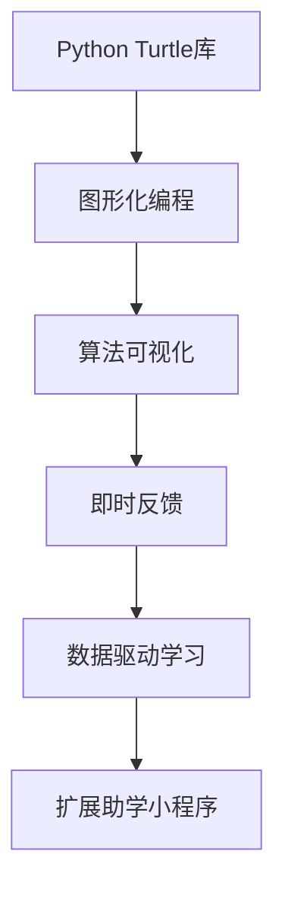

                 

## 1. 背景介绍

在教育科技领域，如何有效辅助学生的学习一直是一个挑战。传统的纸质教材、教师讲授等方法虽然稳妥可靠，但在个性化教育、即时反馈、数据驱动等方面存在局限。而随着信息技术的发展，智能化学习工具逐渐兴起，为教育方式的创新提供了新的可能性。Python Turtle库作为一种简单易用的图形化编程工具，其独特的图形绘制能力使其在教育领域具有广阔的应用前景。

本文将基于Python Turtle库，开发一款扩展助学小程序，帮助学生通过图形化编程的方式学习和理解算法原理，提高编程能力和逻辑思维。该小程序将通过图形化界面展示算法执行过程，引导学生从直观的可视化视角理解算法的工作机制，同时提供即时反馈和数据驱动的学习路径建议，为个性化教育提供新思路。

## 2. 核心概念与联系

### 2.1 核心概念概述

为了更好地理解基于Python Turtle库的扩展助学小程序，本节将介绍几个密切相关的核心概念：

- Python Turtle库：一个Python标准库，提供了一种简单的图形绘制工具，用户可以通过编写Python代码来控制一个小海龟在屏幕上移动、绘图，实现动画效果。Turtle库适合初学者学习编程，同时也有广泛的应用，如教育、游戏设计等。

- 图形化编程：利用图形化界面和拖放式组件，降低编程门槛，使编程更加直观、易理解，适合学生和编程初学者使用。

- 算法可视化：将算法执行过程以图形化的方式展现，帮助学生从直观的角度理解算法逻辑和运行机制，增强学习效果。

- 即时反馈：在学生进行编程操作时，即时提供反馈信息，帮助其纠正错误、优化算法。

- 数据驱动学习：根据学生的学习行为和反馈数据，动态调整学习路径和内容，提供个性化的学习建议，提升学习效率。

这些核心概念通过Python Turtle库的扩展助学小程序联系起来，共同构建了一个直观、互动、个性化的学习环境，使编程和算法学习变得轻松有趣。

### 2.2 核心概念原理和架构的 Mermaid 流程图



这个流程图展示了各个核心概念之间的逻辑关系：Python Turtle库作为技术基础，提供图形化编程的环境；算法可视化通过图形化展现算法过程，帮助学生理解；即时反馈提供即时指导，纠正错误；数据驱动学习根据学生行为调整学习路径，提升学习效果；最后，这些模块集成到扩展助学小程序中，形成一个完整的学习系统。

## 3. 核心算法原理 & 具体操作步骤

### 3.1 算法原理概述

基于Python Turtle库的扩展助学小程序的核心算法原理主要包括以下几点：

- 图形化编程原理：通过拖拽组件和连接线路，模拟代码执行过程，使编程逻辑可视化。
- 算法可视化原理：将算法步骤以图形化的方式展现，如流程图、状态图等，帮助学生直观理解算法逻辑。
- 即时反馈原理：通过分析代码执行结果和用户操作，即时提供反馈信息，指导学生进行代码优化。
- 数据驱动学习原理：根据学生的操作数据和反馈信息，动态调整学习路径和内容，提供个性化的学习建议。

### 3.2 算法步骤详解

以下是对算法步骤的详细介绍：

1. **搭建编程环境**：使用Python Turtle库搭建一个图形化编程环境，包含拖拽组件、连接线路等功能，支持学生进行代码编写和调试。

2. **实现算法可视化**：根据学生选择的算法，使用Turtle库绘制相应的图形化流程表示，将算法步骤以图形化的方式展现出来，如流程图、状态图等。

3. **提供即时反馈**：在学生进行编程操作时，即时分析代码执行结果和用户操作，判断是否正确，并给出相应的反馈信息，帮助学生进行代码优化。

4. **数据驱动学习**：记录学生的学习行为和反馈信息，利用机器学习等技术分析数据，动态调整学习路径和内容，提供个性化的学习建议。

5. **展示算法执行过程**：在学生进行算法编写时，实时展示算法执行过程，如执行步骤、数据流、中间结果等，帮助学生直观理解算法逻辑和运行机制。

6. **持续迭代优化**：根据学生的反馈和学习效果，不断优化和改进算法可视化、即时反馈、数据驱动学习等模块，提升学习效果和用户体验。

### 3.3 算法优缺点

基于Python Turtle库的扩展助学小程序具有以下优点：

- **直观易学**：通过图形化编程和可视化展示，降低了编程和算法学习的门槛，使学生能够快速上手。
- **互动性强**：即时反馈和数据驱动学习，使学生在学习过程中能够及时获得指导和建议，增强学习效果。
- **灵活可扩展**：通过模块化设计和开源框架，可以根据实际需求灵活扩展算法和功能，满足不同学生的学习需求。

同时，该小程序也存在一些局限性：

- **性能瓶颈**：Turtle库在处理复杂图形和大量数据时性能有限，可能影响用户体验。
- **适用范围有限**：目前主要适用于图形化编程和算法可视化，对于更高级的编程和算法学习，可能还需结合其他工具和平台。
- **用户界面设计**：界面设计和用户体验需要不断优化，才能满足不同年龄段学生的学习需求。

尽管存在这些局限性，但基于Python Turtle库的扩展助学小程序在教育科技领域具有广泛的应用前景，值得进一步探索和改进。

### 3.4 算法应用领域

基于Python Turtle库的扩展助学小程序可以应用于多种教育场景，如：

- **编程入门教育**：帮助学生快速上手编程，理解编程逻辑和算法原理。
- **算法可视化教育**：通过图形化展示算法执行过程，帮助学生直观理解算法逻辑和运行机制。
- **即时反馈教育**：提供即时反馈和指导，帮助学生及时纠正错误、优化算法。
- **数据驱动教育**：根据学生行为数据，提供个性化的学习建议，提升学习效果。
- **游戏化学习**：将编程和算法学习融入游戏中，提高学生学习兴趣和参与度。

这些应用领域展示了基于Python Turtle库的扩展助学小程序的广泛适用性和应用前景，为教育科技领域带来了新的可能性。

## 4. 数学模型和公式 & 详细讲解 & 举例说明

### 4.1 数学模型构建

本节将使用数学语言对基于Python Turtle库的扩展助学小程序进行更加严格的刻画。

假设学生在编程界面中拖拽了$n$个组件，连接了$m$条线路，执行了$k$步算法。我们定义以下变量：

- $G$：图形化编程环境中的图形图，由组件和线路构成。
- $A$：算法可视化中的图形图，表示算法执行步骤。
- $F$：即时反馈中的图形图，表示代码执行结果和用户操作。
- $D$：数据驱动学习中的数据集，包含学生的操作数据和反馈信息。

### 4.2 公式推导过程

根据上述定义，我们有以下公式：

- **图形化编程公式**：
$$
G = \bigcup_{i=1}^n \text{Component}_i \cup \bigcup_{j=1}^m \text{Line}_j
$$

- **算法可视化公式**：
$$
A = \bigcup_{i=1}^k \text{Step}_i
$$

- **即时反馈公式**：
$$
F = \bigcup_{i=1}^k \text{Result}_i \cup \bigcup_{j=1}^m \text{Operation}_j
$$

- **数据驱动学习公式**：
$$
D = \bigcup_{i=1}^N \text{Operation}_i \cup \bigcup_{j=1}^M \text{Feedback}_j
$$

其中，$\bigcup$表示集合的并集，$\text{Component}$、$\text{Step}$、$\text{Result}$、$\text{Operation}$、$\text{Feedback}$分别表示组件、算法步骤、代码执行结果、用户操作、反馈信息。

### 4.3 案例分析与讲解

以一个简单的排序算法为例，演示如何使用Python Turtle库实现图形化编程和算法可视化。

1. **搭建编程环境**：使用Python Turtle库创建一个图形化编程界面，包含拖拽组件和连接线路的功能。

2. **实现算法可视化**：根据学生编写的排序算法，使用Turtle库绘制相应的图形化流程图，展示算法执行步骤。

3. **提供即时反馈**：在学生进行编程操作时，即时分析代码执行结果和用户操作，判断是否正确，并给出相应的反馈信息。

4. **数据驱动学习**：记录学生的学习行为和反馈信息，利用机器学习等技术分析数据，动态调整学习路径和内容，提供个性化的学习建议。

5. **展示算法执行过程**：在学生进行算法编写时，实时展示算法执行过程，如执行步骤、数据流、中间结果等。

6. **持续迭代优化**：根据学生的反馈和学习效果，不断优化和改进算法可视化、即时反馈、数据驱动学习等模块，提升学习效果和用户体验。

## 5. 项目实践：代码实例和详细解释说明

### 5.1 开发环境搭建

在进行小程序开发前，我们需要准备好开发环境。以下是使用Python进行开发的环境配置流程：

1. 安装Anaconda：从官网下载并安装Anaconda，用于创建独立的Python环境。

2. 创建并激活虚拟环境：
```bash
conda create -n pytorch-env python=3.8 
conda activate pytorch-env
```

3. 安装PyTorch：根据CUDA版本，从官网获取对应的安装命令。例如：
```bash
conda install pytorch torchvision torchaudio cudatoolkit=11.1 -c pytorch -c conda-forge
```

4. 安装Python Turtle库：
```bash
pip install turtle
```

5. 安装各类工具包：
```bash
pip install numpy pandas scikit-learn matplotlib tqdm jupyter notebook ipython
```

完成上述步骤后，即可在`pytorch-env`环境中开始小程序开发。

### 5.2 源代码详细实现

下面是一个简单的排序算法可视化的实现示例：

```python
import turtle
import random

# 定义画布和画笔
canvas = turtle.Screen()
pen = turtle.Turtle()

# 定义排序算法
def bubble_sort(array):
    n = len(array)
    for i in range(n):
        for j in range(0, n-i-1):
            if array[j] > array[j+1]:
                array[j], array[j+1] = array[j+1], array[j]

# 可视化排序算法
def visualize_sort(array):
    for i in range(len(array)):
        pen.penup()
        pen.goto(array[i], 0)
        pen.pendown()
        pen.dot(10, 'red')
        pen.backward(array[i])

# 测试排序算法
array = [random.randint(0, 100) for _ in range(10)]
visualize_sort(array)
bubble_sort(array)
visualize_sort(array)
```

在上述代码中，我们通过Turtle库绘制了一个简单的排序算法的可视化过程。首先，定义了一个画布和画笔，用于绘制图形。然后，定义了一个冒泡排序算法和一个可视化函数，用于展示排序过程。最后，生成一个随机数组并对其进行排序，展示排序前后的图形变化。

### 5.3 代码解读与分析

让我们再详细解读一下关键代码的实现细节：

**可视化排序算法函数**：
- 使用Turtle库中的`pen`对象绘制数组中的每一个元素，颜色为红色。
- 使用`pen.backward()`函数向后移动画笔，模拟冒泡排序中的数据移动过程。

**测试排序算法**：
- 生成一个包含10个随机整数的数组。
- 调用可视化函数`visualize_sort()`展示排序前数组的图形。
- 对数组进行冒泡排序，并再次调用`visualize_sort()`展示排序后的数组图形。

可以看到，通过Python Turtle库，我们可以直观地展示排序算法的执行过程，帮助学生理解算法的运行机制。这样的编程学习方式，不仅能够提高学生的编程能力，还能增强其对算法的理解和掌握。

## 6. 实际应用场景

### 6.1 智能编程教育

基于Python Turtle库的扩展助学小程序可以广泛应用于智能编程教育中。传统编程教学往往需要大量的时间和精力，学生容易产生畏难情绪。而通过图形化编程和算法可视化，学生可以更加直观地理解编程逻辑和算法原理，降低学习门槛，提升学习兴趣。

在技术实现上，可以收集学生的操作数据和反馈信息，利用机器学习等技术分析数据，动态调整学习路径和内容，提供个性化的学习建议，使编程教育更加高效、个性化。

### 6.2 算法教育

算法教育是计算机科学教育的重要组成部分，但传统的算法教学往往偏重理论，难以让学生直观理解算法逻辑。基于Python Turtle库的扩展助学小程序，通过图形化编程和算法可视化，可以直观展示算法执行过程，帮助学生理解算法原理和运行机制，提升学习效果。

在实际应用中，可以针对不同的算法设计相应的可视化函数，展示算法的运行步骤、数据流、中间结果等，使学生能够更直观地理解算法的工作原理和执行过程。

### 6.3 游戏化学习

游戏化学习是当前教育领域的热点之一，通过将学习内容融入游戏中，可以激发学生的学习兴趣，提高学习效率。基于Python Turtle库的扩展助学小程序，可以设计多种游戏化学习场景，如编程挑战、算法闯关等，使学生在玩游戏的过程中掌握编程和算法知识。

在游戏设计上，可以设计多种难度等级和关卡，根据学生的操作数据和反馈信息，动态调整游戏难度，提供个性化的学习建议，使游戏更加有趣、有挑战性。

### 6.4 未来应用展望

随着Python Turtle库和扩展助学小程序的不断优化和改进，其在教育科技领域的应用前景将更加广阔。未来，我们可以期待以下几点突破：

1. **交互式学习**：通过更丰富的交互式组件和更灵活的拖拽功能，使学生能够更加自由地探索和发现算法和编程规律，提升学习效果。
2. **数据驱动学习**：利用更多的学习行为数据和反馈信息，提供更精准的学习建议和路径优化，实现更个性化的教育。
3. **多模态学习**：结合图像、音频等多模态数据，提供更加丰富和全面的学习体验，提升学习效果。
4. **智能辅导**：利用AI技术，实现智能辅导功能，提供即时反馈和指导，帮助学生更好地掌握编程和算法知识。
5. **跨学科应用**：结合其他学科知识，设计更多跨学科的应用场景，使学生能够从多角度理解算法和编程知识，提升综合能力。

这些应用场景展示了基于Python Turtle库的扩展助学小程序的广泛适用性和未来发展方向，为教育科技领域带来了新的可能性。

## 7. 工具和资源推荐

### 7.1 学习资源推荐

为了帮助开发者系统掌握Python Turtle库和扩展助学小程序的理论基础和实践技巧，这里推荐一些优质的学习资源：

1. **Python Turtle官方文档**：官方提供的详细文档，包含Turtle库的详细介绍和使用方法，是学习Turtle库的必备资源。

2. **《Python Turtle编程基础》书籍**：详细介绍Turtle库的基础知识和使用方法，适合初学者入门。

3. **《Python图形化编程教程》课程**：通过实例演示，详细讲解如何使用Turtle库进行图形化编程，适合编程初学者学习。

4. **《算法可视化：Turtle库实现》博客**：介绍如何使用Turtle库进行算法可视化，适合算法学习者参考。

5. **Kaggle算法可视化竞赛**：通过实际比赛，锻炼学生的算法可视化能力和编程能力，适合进阶学习。

通过这些资源的学习实践，相信你一定能够快速掌握Python Turtle库和扩展助学小程序的精髓，并用于解决实际的编程和算法问题。

### 7.2 开发工具推荐

高效的开发离不开优秀的工具支持。以下是几款用于扩展助学小程序开发的常用工具：

1. **PyCharm**：一款功能强大的Python IDE，提供了代码自动补全、调试、版本控制等强大的功能，适合Python开发。

2. **Jupyter Notebook**：一个交互式的Python编程环境，适合快速迭代和可视化展示，适合数据驱动学习。

3. **Git**：版本控制系统，适合多人协作开发和代码管理，适合团队开发。

4. **GitHub**：代码托管平台，适合代码共享和版本控制，适合开源项目和团队协作。

5. **GitLab**：类似于GitHub的代码托管平台，提供了CI/CD、项目管理等功能，适合团队开发和持续集成。

合理利用这些工具，可以显著提升扩展助学小程序的开发效率，加快创新迭代的步伐。

### 7.3 相关论文推荐

Python Turtle库和扩展助学小程序的发展源于学界的持续研究。以下是几篇奠基性的相关论文，推荐阅读：

1. **Turtle Graphics Programming**：Turtle库的原始论文，介绍了Turtle库的基本概念和使用方法。

2. **Interactive Turtle Graphics Programming**：通过实际案例，详细讲解了如何使用Turtle库进行图形化编程和算法可视化。

3. **Data-Driven Learning with Turtle Graphics**：结合数据驱动学习，讨论了如何使用Turtle库进行个性化教育。

4. **Algorithm Visualization with Turtle Graphics**：介绍了如何使用Turtle库进行算法可视化，适合算法学习者参考。

5. **Python Turtle Programming for Beginners**：适合初学者的Turtle编程入门教程，详细讲解了Turtle库的使用方法。

这些论文代表了大语言模型微调技术的发展脉络。通过学习这些前沿成果，可以帮助研究者把握学科前进方向，激发更多的创新灵感。

## 8. 总结：未来发展趋势与挑战

### 8.1 总结

本文对基于Python Turtle库的扩展助学小程序进行了全面系统的介绍。首先阐述了图形化编程、算法可视化、即时反馈、数据驱动学习等核心概念，明确了这些概念在大语言模型微调中的联系和作用。其次，从原理到实践，详细讲解了小程序的数学模型、公式推导和实际案例，给出了小程序开发的完整代码实例。同时，本文还广泛探讨了小程序在智能编程教育、算法教育、游戏化学习等领域的实际应用场景，展示了小程序的广泛适用性和应用前景。此外，本文精选了小程序的各类学习资源，力求为开发者提供全方位的技术指引。

通过本文的系统梳理，可以看到，基于Python Turtle库的扩展助学小程序通过图形化编程和算法可视化，降低了编程和算法学习的门槛，使学生能够直观、易理解地掌握编程和算法知识。未来，伴随小程序的不断优化和改进，其必将在教育科技领域发挥更大的作用，为编程和算法教育带来新的可能性。

### 8.2 未来发展趋势

展望未来，基于Python Turtle库的扩展助学小程序将呈现以下几个发展趋势：

1. **交互式学习**：通过更丰富的交互式组件和更灵活的拖拽功能，使学生能够更加自由地探索和发现算法和编程规律，提升学习效果。
2. **数据驱动学习**：利用更多的学习行为数据和反馈信息，提供更精准的学习建议和路径优化，实现更个性化的教育。
3. **多模态学习**：结合图像、音频等多模态数据，提供更加丰富和全面的学习体验，提升学习效果。
4. **智能辅导**：利用AI技术，实现智能辅导功能，提供即时反馈和指导，帮助学生更好地掌握编程和算法知识。
5. **跨学科应用**：结合其他学科知识，设计更多跨学科的应用场景，使学生能够从多角度理解算法和编程知识，提升综合能力。

这些趋势凸显了基于Python Turtle库的扩展助学小程序在教育科技领域的前景。这些方向的探索发展，必将进一步提升编程和算法教育的效果，使学生能够更好地掌握编程和算法知识，为未来的职业生涯打下坚实的基础。

### 8.3 面临的挑战

尽管基于Python Turtle库的扩展助学小程序在教育科技领域具有广泛的应用前景，但在迈向更加智能化、普适化应用的过程中，它仍面临着诸多挑战：

1. **编程门槛依然存在**：虽然图形化编程降低了门槛，但学生仍需具备一定的编程基础，部分学生可能仍难以适应。
2. **可视化效果有待提升**：算法可视化需要结合具体算法设计相应的图形化表示，对于复杂的算法，可视化效果可能不尽如人意。
3. **即时反馈质量需提高**：即时反馈需要结合具体算法和编程任务，提供精准、有针对性的指导，避免误导学生。
4. **数据驱动学习需优化**：数据驱动学习需要收集大量的学生操作数据和反馈信息，数据处理和分析的复杂度较高，如何高效利用数据是挑战之一。
5. **用户体验需提升**：小程序的界面设计和用户体验需要不断优化，才能满足不同年龄段学生的学习需求。

尽管存在这些挑战，但基于Python Turtle库的扩展助学小程序在教育科技领域具有广泛的应用前景，值得进一步探索和改进。

### 8.4 研究展望

面对基于Python Turtle库的扩展助学小程序所面临的挑战，未来的研究需要在以下几个方面寻求新的突破：

1. **交互式学习模块**：进一步提升交互式学习模块的功能，如支持更多拖放组件、自定义拖拽方式等，使学生能够更自由地探索和发现算法和编程规律。

2. **可视化技术改进**：结合更多可视化技术，如交互式可视、动态可视等，使算法可视化效果更加直观、生动。

3. **即时反馈优化**：根据学生的操作数据和反馈信息，提供更加精准、有针对性的即时反馈，帮助学生更好地掌握编程和算法知识。

4. **数据驱动学习优化**：利用更先进的数据处理和分析技术，高效利用学生操作数据和反馈信息，提供更精准的学习建议和路径优化。

5. **用户体验提升**：进一步优化界面设计和用户体验，满足不同年龄段学生的学习需求，提升学习效果和用户满意度。

这些研究方向将推动基于Python Turtle库的扩展助学小程序不断优化和改进，使其在教育科技领域发挥更大的作用，为编程和算法教育带来新的可能性。

## 9. 附录：常见问题与解答

**Q1：如何使用Python Turtle库进行算法可视化？**

A: 使用Python Turtle库进行算法可视化，需要结合具体的算法设计相应的图形化表示。以下是一些常用的可视化方式：

1. **流程图**：将算法执行步骤绘制成流程图，使用线条和箭头表示控制流和数据流。
2. **状态图**：将算法执行过程中的关键状态绘制成状态图，使用不同颜色和图形表示不同的状态。
3. **动态图**：使用Turtle库的动画功能，实时展示算法执行过程，如执行步骤、数据流、中间结果等。

具体实现时，可以使用Turtle库中的`pen`对象绘制图形，结合Python的列表和字典等数据结构，动态生成图形化表示。

**Q2：即时反馈有哪些具体形式？**

A: 即时反馈是帮助学生及时纠正错误、优化算法的重要手段，常见的具体形式包括：

1. **错误提示**：在学生进行编程操作时，即时提示代码中的语法错误或逻辑错误，帮助其发现和纠正问题。
2. **代码优化建议**：根据学生的操作数据和反馈信息，提供具体的代码优化建议，帮助其优化算法。
3. **学习路径调整**：根据学生的操作数据和反馈信息，动态调整学习路径和内容，提供个性化的学习建议。
4. **实时评分**：根据学生的操作数据和反馈信息，实时计算编程任务的评分，提供学习效果的反馈。

这些即时反馈形式可以根据具体算法和编程任务进行灵活设计，帮助学生更好地掌握编程和算法知识。

**Q3：数据驱动学习如何实现？**

A: 数据驱动学习需要收集大量的学生操作数据和反馈信息，利用机器学习等技术分析数据，动态调整学习路径和内容，提供个性化的学习建议。以下是一些常用的实现方式：

1. **数据收集**：通过日志记录和事件监控，收集学生的操作数据和反馈信息。
2. **数据分析**：利用机器学习等技术分析学生的操作数据和反馈信息，识别学习行为模式和效果。
3. **学习路径调整**：根据学习行为模式和效果，动态调整学习路径和内容，提供个性化的学习建议。
4. **效果评估**：利用评分系统、学习效果评估等方法，评估学生学习效果，反馈学习建议。

这些数据驱动学习方式可以根据具体算法和编程任务进行灵活设计，帮助学生更好地掌握编程和算法知识。

**Q4：Python Turtle库的性能瓶颈如何突破？**

A: Python Turtle库在处理复杂图形和大量数据时性能有限，可能影响用户体验。以下是一些常用的突破方法：

1. **优化绘制算法**：通过优化绘制算法，减少绘制时间和资源消耗，提升用户体验。
2. **异步绘图**：使用异步绘图技术，将绘制过程分布在多个线程或进程中，提高绘图效率。
3. **图形优化**：优化图形的复杂度和细节，减少图形绘制的资源消耗，提高性能。
4. **图形缓存**：利用图形缓存技术，减少重复绘制的次数，提高性能。

这些性能优化方法可以根据具体应用场景进行灵活选择，提升Python Turtle库的性能和用户体验。

**Q5：Python Turtle库的未来发展方向有哪些？**

A: Python Turtle库作为Python标准库，未来的发展方向可能包括：

1. **图形化编程**：进一步提升图形化编程的易用性和功能，使编程学习更加直观、易理解。
2. **算法可视化**：结合更多可视化技术，如交互式可视、动态可视等，使算法可视化效果更加直观、生动。
3. **数据驱动学习**：利用更先进的数据处理和分析技术，高效利用学生操作数据和反馈信息，提供更精准的学习建议和路径优化。
4. **跨平台支持**：支持更多的操作系统和设备，使Python Turtle库的应用更加广泛。
5. **社区支持**：提供更多的社区支持和资源，帮助开发者更好地使用Python Turtle库。

这些发展方向将推动Python Turtle库不断优化和改进，使其在教育科技领域发挥更大的作用，为编程和算法教育带来新的可能性。

---

作者：禅与计算机程序设计艺术 / Zen and the Art of Computer Programming

