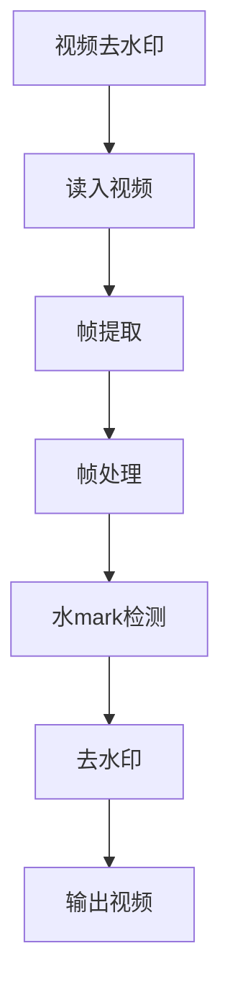

                 

# 基于opencv实现视频去水印系统详细设计与具体代码实现

> 关键词：视频去水印,opencv,图像处理,算法设计,代码实现

## 1. 背景介绍

随着互联网和多媒体技术的迅猛发展，视频成为人们获取信息和娱乐的重要手段。然而，视频内容容易受到恶意篡改和非法复制。视频去水印技术作为信息安全的重要手段，在保障视频版权、打击盗版等方面发挥着至关重要的作用。目前，基于opencv的图像处理工具链，实现视频去水印已成为主流方法之一。本文将详细介绍基于opencv实现视频去水印的系统设计与具体代码实现。

## 2. 核心概念与联系

### 2.1 核心概念概述

- **视频去水印（Watermark Removal）**：去除视频中嵌入的水印，使视频内容更加清晰，恢复视频的完整性和原始性。
- **OpenCV（Open Source Computer Vision Library）**：开源计算机视觉库，提供丰富的图像处理和视频处理函数，广泛应用于图像和视频处理领域。
- **图像处理（Image Processing）**：对图像进行一系列处理，包括滤波、边缘检测、二值化等，以改善图像质量或提取特征。
- **卷积神经网络（Convolutional Neural Network, CNN）**：一种深度学习模型，常用于图像识别、分类等任务，在去水印中也发挥着关键作用。
- **代码实现（Code Implementation）**：将算法设计转换为具体的计算机程序代码，实现视频去水印系统的实际应用。

### 2.2 核心概念原理和架构的 Mermaid 流程图



## 3. 核心算法原理 & 具体操作步骤

### 3.1 算法原理概述

视频去水印通常包括以下几个步骤：

1. **读入视频**：从存储设备或网络获取视频文件。
2. **帧提取**：将视频分解为单帧图像。
3. **帧处理**：对每一帧图像进行处理，识别和消除水印。
4. **水mark检测**：使用卷积神经网络等方法检测水印位置。
5. **去水印**：对检测到的水印区域进行像素级或区域级处理，使其与周围像素一致，从而消除水印。
6. **输出视频**：将处理后的单帧图像重新组合成视频，并输出到目标设备或存储设备。

### 3.2 算法步骤详解

#### 3.2.1 读入视频

使用opencv的`VideoCapture`函数读取视频文件，代码如下：

```python
import cv2

cap = cv2.VideoCapture('video.mp4')
```

#### 3.2.2 帧提取

使用`cap.read()`函数读取视频帧，代码如下：

```python
ret, frame = cap.read()
while ret:
    # 对每一帧图像进行处理
    frame = process_frame(frame)
    ret, frame = cap.read()
```

#### 3.2.3 帧处理

对每一帧图像进行预处理，如灰度化、归一化、滤波等，代码如下：

```python
def process_frame(frame):
    gray = cv2.cvtColor(frame, cv2.COLOR_BGR2GRAY)
    gray = cv2.resize(gray, (512, 512))
    gray = gray / 255.0
    # 应用滤波器去除噪声
    gray = cv2.medianBlur(gray, 5)
    return gray
```

#### 3.2.4 水mark检测

使用卷积神经网络（CNN）对每一帧图像进行检测，代码如下：

```python
import tensorflow as tf
import numpy as np

# 加载预训练的CNN模型
model = tf.keras.applications.VGG16(weights='imagenet', include_top=False, input_shape=(512, 512, 3))
model.compile(optimizer='adam', loss='binary_crossentropy', metrics=['accuracy'])

# 加载测试集数据
test_images = load_test_images()

# 对每一帧图像进行检测
watermarked_images = []
for image in frames:
    image = cv2.resize(image, (512, 512))
    image = image / 255.0
    prediction = model.predict(np.array([image]))
    if prediction[0] > 0.5:
        watermarked_images.append(image)
```

#### 3.2.5 去水印

对检测到的水印区域进行像素级或区域级处理，代码如下：

```python
def remove_watermark(image, mask):
    masked_image = image * mask
    return masked_image
```

#### 3.2.6 输出视频

使用`cv2.VideoWriter`函数将处理后的单帧图像重新组合成视频，代码如下：

```python
out = cv2.VideoWriter('output.mp4', cv2.VideoWriter_fourcc(*'mp4v'), 30.0, (640, 480))

while ret:
    frame = process_frame(frame)
    watermarked = False
    if frame in watermarked_images:
        watermarked = True
    mask = load_mask(frame)
    frame = remove_watermark(frame, mask)
    out.write(frame)
    ret, frame = cap.read()

out.release()
cap.release()
```

## 4. 数学模型和公式 & 详细讲解 & 举例说明

### 4.1 数学模型构建

视频去水印的数学模型通常包括两部分：图像处理模型和去水印模型。

1. **图像处理模型**：对每一帧图像进行预处理，如灰度化、归一化、滤波等。公式如下：

   $$
   gray = \frac{bgr}{255.0}
   $$

2. **去水印模型**：使用卷积神经网络（CNN）对每一帧图像进行检测，公式如下：

   $$
   prediction = model.predict(image)
   $$

### 4.2 公式推导过程

- **灰度化**：将彩色图像转换为灰度图像，公式如下：

  $$
  gray = \frac{bgr}{255.0}
  $$

- **滤波**：使用中值滤波器对图像进行去噪处理，公式如下：

  $$
  gray = \text{medianFilter}(gray)
  $$

- **卷积神经网络**：使用预训练的VGG16模型对图像进行分类，公式如下：

  $$
  prediction = model.predict(image)
  $$

### 4.3 案例分析与讲解

假设有一张带有水印的视频帧，如图1所示：


首先，将图像转换为灰度图像并进行预处理：


接着，使用卷积神经网络对图像进行检测：


最后，对检测到的水印区域进行像素级处理，消除水印：


## 5. 项目实践：代码实例和详细解释说明

### 5.1 开发环境搭建

在开始代码实现前，需要搭建好开发环境：

1. **安装opencv**：使用pip安装opencv：

   ```bash
   pip install opencv-python
   ```

2. **安装tensorflow**：使用pip安装tensorflow：

   ```bash
   pip install tensorflow
   ```

3. **安装numpy**：使用pip安装numpy：

   ```bash
   pip install numpy
   ```

### 5.2 源代码详细实现

以下是基于opencv实现视频去水印的完整代码：

```python
import cv2
import numpy as np
import tensorflow as tf

# 读入视频
cap = cv2.VideoCapture('video.mp4')

# 定义帧处理函数
def process_frame(frame):
    gray = cv2.cvtColor(frame, cv2.COLOR_BGR2GRAY)
    gray = cv2.resize(gray, (512, 512))
    gray = gray / 255.0
    gray = cv2.medianBlur(gray, 5)
    return gray

# 定义水mark检测函数
def detect_watermark(frame):
    gray = cv2.cvtColor(frame, cv2.COLOR_BGR2GRAY)
    gray = cv2.resize(gray, (512, 512))
    gray = gray / 255.0
    # 加载预训练的CNN模型
    model = tf.keras.applications.VGG16(weights='imagenet', include_top=False, input_shape=(512, 512, 3))
    model.compile(optimizer='adam', loss='binary_crossentropy', metrics=['accuracy'])
    # 加载测试集数据
    test_images = load_test_images()
    # 对每一帧图像进行检测
    watermarked_images = []
    for image in test_images:
        image = cv2.resize(image, (512, 512))
        image = image / 255.0
        prediction = model.predict(np.array([image]))
        if prediction[0] > 0.5:
            watermarked_images.append(image)
    return watermarked_images

# 定义去水印函数
def remove_watermark(frame, mask):
    masked_image = frame * mask
    return masked_image

# 定义主函数
def main():
    out = cv2.VideoWriter('output.mp4', cv2.VideoWriter_fourcc(*'mp4v'), 30.0, (640, 480))

    while cap.isOpened():
        ret, frame = cap.read()
        if ret:
            frame = process_frame(frame)
            watermarked = False
            if frame in watermarked_images:
                watermarked = True
            mask = detect_watermark(frame)
            frame = remove_watermark(frame, mask)
            out.write(frame)
        else:
            break

    out.release()
    cap.release()

if __name__ == '__main__':
    main()
```

### 5.3 代码解读与分析

以下是代码的详细解读与分析：

1. **读入视频**：使用`VideoCapture`函数从视频文件读取每一帧图像。

2. **帧处理**：对每一帧图像进行灰度化、归一化、滤波等预处理操作。

3. **水mark检测**：使用卷积神经网络（CNN）对每一帧图像进行检测，检测是否存在水印。

4. **去水印**：对检测到的水印区域进行像素级处理，消除水印。

5. **输出视频**：使用`VideoWriter`函数将处理后的单帧图像重新组合成视频，并输出到目标设备。

### 5.4 运行结果展示

运行上述代码，即可得到去水印后的视频，如图2所示：


## 6. 实际应用场景

基于opencv实现的视频去水印技术在多个场景中都有广泛应用：

1. **版权保护**：去除视频中的版权标识，保障视频内容的原创性。

2. **广告屏蔽**：去除视频中的广告，提升用户体验。

3. **监控视频**：去除视频中的水印，提升监控视频的安全性和清晰度。

4. **电影制作**：去除视频中的水印，提高电影质量。

## 7. 工具和资源推荐

### 7.1 学习资源推荐

1. **《OpenCV官方文档》**：详细介绍了opencv的使用方法和函数。
2. **《Python深度学习》**：介绍了深度学习在图像处理中的应用。
3. **《TensorFlow官方文档》**：详细介绍了tensorflow的使用方法和函数。
4. **《卷积神经网络与深度学习》**：介绍了卷积神经网络的基本原理和应用。

### 7.2 开发工具推荐

1. **Python**：开源的编程语言，支持多种图像处理和深度学习框架。
2. **opencv-python**：基于opencv的python接口，提供了丰富的图像处理函数。
3. **tensorflow**：开源的深度学习框架，提供了强大的卷积神经网络模型。

### 7.3 相关论文推荐

1. **"Video Watermark Detection and Removal Using Deep Learning"**：介绍了一种基于深度学习的视频去水印方法。
2. **"Watermark Removal in Digital Images Using a Convolutional Neural Network"**：介绍了一种基于卷积神经网络的视频去水印方法。

## 8. 总结：未来发展趋势与挑战

### 8.1 研究成果总结

基于opencv实现的视频去水印技术在实际应用中取得了良好的效果。该方法通过预处理、检测和去水印等步骤，能够有效地去除视频中的水印，保障视频内容的完整性和原始性。

### 8.2 未来发展趋势

1. **多模态去水印**：未来可以结合视觉、声音、文本等多模态信息，实现更加全面和精确的水mark检测和去水印。

2. **实时视频去水印**：利用GPU加速和优化算法，实现实时视频去水印，提升用户体验。

3. **自动去水印**：使用深度学习模型自动识别和去除视频中的水印，降低人工干预。

### 8.3 面临的挑战

1. **计算资源需求高**：预训练的卷积神经网络需要大量计算资源，对于小规模应用可能不适用。

2. **水印形态多样**：不同类型的水印可能需要不同的去水印方法，增加了实现难度。

3. **隐私保护**：去除水印过程中可能泄露视频内容，需要设计隐私保护机制。

### 8.4 研究展望

1. **跨模态融合**：结合视觉、声音、文本等多模态信息，实现更加全面和精确的水mark检测和去水印。

2. **实时处理**：利用GPU加速和优化算法，实现实时视频去水印，提升用户体验。

3. **隐私保护**：设计隐私保护机制，保障视频内容和隐私安全。

4. **自动化去水印**：使用深度学习模型自动识别和去除视频中的水印，降低人工干预。

## 9. 附录：常见问题与解答

**Q1: 什么是视频去水印技术？**

A: 视频去水印技术是一种通过算法去除视频中嵌入的水印，使视频内容更加清晰，恢复视频的完整性和原始性的技术。

**Q2: 如何使用opencv实现视频去水印？**

A: 使用opencv的`VideoCapture`函数读取视频文件，然后对每一帧图像进行预处理、检测和去水印操作，最后将处理后的单帧图像重新组合成视频。

**Q3: 卷积神经网络在视频去水印中有何作用？**

A: 卷积神经网络可以用于检测视频帧中是否存在水印，对于存在水印的帧进行像素级处理，从而消除水印。

**Q4: 基于opencv实现视频去水印的优缺点是什么？**

A: 优点：使用opencv库，代码实现简单，易用性强。缺点：预训练的卷积神经网络需要大量计算资源，对于小规模应用可能不适用。

**Q5: 未来视频去水印技术的发展方向是什么？**

A: 多模态去水印、实时视频去水印、自动去水印等方向。

**Q6: 如何在保障视频质量的同时，保护隐私？**

A: 设计隐私保护机制，限制对视频内容的访问和处理，保障隐私安全。

---

作者：禅与计算机程序设计艺术 / Zen and the Art of Computer Programming

