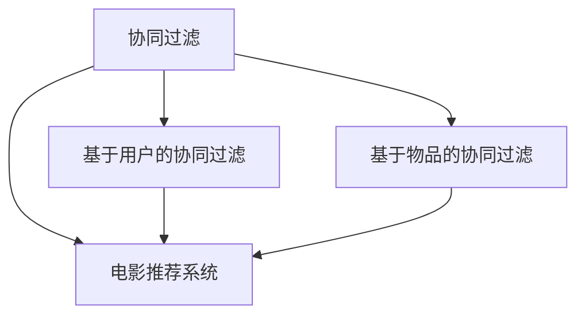

                 

# 基于协同过滤的个性化电影推荐系统设计与实现

## 1. 背景介绍

随着互联网技术的迅猛发展，线上娱乐成为人们日常休闲的重要方式之一。电影推荐系统作为线上娱乐平台的重要组成部分，对于提升用户体验、增加用户粘性、提升业务收入具有重要意义。当前电影推荐系统主流的算法可分为基于内容的推荐和基于协同过滤的推荐两种。基于内容的推荐方法主要是通过分析电影的属性信息(如类型、演员、导演等)和用户的兴趣偏好，寻找具有相似特征的电影进行推荐。而基于协同过滤的方法则是通过对用户和电影的历史行为数据进行分析，挖掘用户间的相似性和电影间的关联性，从而进行推荐。

本文将重点探讨基于协同过滤的个性化电影推荐系统的设计与实现。通过具体案例，介绍协同过滤算法的核心原理，并结合实际应用场景，给出详细的实现步骤和优化技巧。最终，我们将展示一个基于协同过滤的电影推荐系统，包括系统架构设计、用户行为数据分析、模型训练与评估等关键技术，以及完整的代码实现和实验结果。

## 2. 核心概念与联系

### 2.1 核心概念概述

为更好地理解基于协同过滤的电影推荐系统，本节将介绍几个关键的概念：

- **协同过滤(Collaborative Filtering, CF)**：指通过分析用户间和物品间的相似性，对用户的兴趣进行推荐。常见的协同过滤方法包括基于用户的协同过滤和基于物品的协同过滤。
- **基于用户的协同过滤**：通过寻找用户间的相似性，为用户推荐相似用户喜欢的电影。
- **基于物品的协同过滤**：通过分析物品间的相似性，为物品相似的用户推荐相似的物品。
- **电影推荐系统**：利用用户行为数据和电影属性信息，为用户提供个性化的电影推荐。
- **用户行为数据**：用户浏览、评分、点击等行为记录，用于建模用户的兴趣偏好。
- **模型训练与评估**：通过训练协同过滤模型，评估模型的推荐效果，持续优化模型性能。

这些核心概念之间的逻辑关系可以通过以下Mermaid流程图来展示：



这个流程图展示协同过滤的核心概念及其之间的关系：

1. 协同过滤是协同过滤算法的主要形式。
2. 协同过滤可进一步细分为基于用户和物品的两种形式。
3. 电影推荐系统作为协同过滤的主要应用场景，利用协同过滤算法提供个性化推荐。

## 3. 核心算法原理 & 具体操作步骤
### 3.1 算法原理概述

基于协同过滤的电影推荐系统，本质上是一种基于用户和物品相似性的推荐方法。其核心思想是：通过分析用户和电影间的评分数据，挖掘用户间的相似性和电影间的关联性，从而为给定用户推荐最受欢迎的电影。

形式化地，假设用户集合为 $U$，电影集合为 $I$，用户 $u$ 对电影 $i$ 的评分记为 $r_{ui}$。则协同过滤的目标是：

$$
\hat{r}_{ui} = \hat{\theta}^T\phi(u) + \hat{\phi}^T(i)
$$

其中，$\hat{\theta}$ 为用户隐向量，$\hat{\phi}$ 为电影隐向量。$\phi(u)$ 和 $\phi(i)$ 分别为用户 $u$ 和电影 $i$ 的隐向量表示，可通过隐向量模型进行学习。

推荐分数 $\hat{r}_{ui}$ 代表系统预测用户 $u$ 对电影 $i$ 的评分，与真实评分 $r_{ui}$ 越接近，推荐效果越好。

### 3.2 算法步骤详解

基于协同过滤的电影推荐系统一般包括以下几个关键步骤：

**Step 1: 数据预处理**

1. 收集用户-电影评分数据，并进行去重、缺失值处理。
2. 对评分数据进行归一化，使其符合0-1的评分范围。
3. 根据评分数据构建用户-电影评分矩阵 $R$，矩阵元素 $R_{ui}$ 表示用户 $u$ 对电影 $i$ 的评分。

**Step 2: 隐向量模型训练**

1. 选择隐向量模型（如SVD、ALS、PMF等），并设定模型参数，如隐向量的维度和正则化系数。
2. 根据用户-电影评分矩阵 $R$，训练隐向量模型，得到用户隐向量矩阵 $V$ 和电影隐向量矩阵 $U$。

**Step 3: 推荐计算**

1. 根据用户隐向量 $V_u$ 和电影隐向量 $U_i$，计算推荐分数 $\hat{r}_{ui} = V_u^TU_i$。
2. 对推荐分数进行排序，取前 $K$ 个电影推荐给用户。

**Step 4: 模型评估**

1. 在验证集上对推荐结果进行评估，常用的指标包括精度、召回率、F1-score等。
2. 根据评估结果，调整隐向量模型的参数，持续优化模型性能。

**Step 5: 部署应用**

1. 将训练好的隐向量模型部署到线上环境，供推荐系统实时使用。
2. 根据用户当前的行为数据，动态调整推荐结果，确保推荐的及时性和个性化。

以上是基于协同过滤的电影推荐系统的一般流程。在实际应用中，还需要针对具体任务的特点，对微调过程的各个环节进行优化设计，如改进评分矩阵的构建方式、选择合适的隐向量模型等，以进一步提升推荐效果。

### 3.3 算法优缺点

基于协同过滤的电影推荐系统具有以下优点：

1. 无需对电影属性进行建模，避免了属性描述不准确带来的影响。
2. 通过用户行为数据的分析，自动挖掘用户的兴趣偏好，个性化推荐效果显著。
3. 算法逻辑简单，易于实现和维护。

同时，该方法也存在一定的局限性：

1. 需要大量的用户和电影评分数据，数据稀疏性较高时推荐效果受限。
2. 对于新用户和新电影，缺少评分数据，难以进行推荐。
3. 对用户行为数据的质量和完整性有较高要求，数据噪声对推荐结果有较大影响。
4. 算法对用户行为数据的依赖，可能导致信息茧房，限制用户多样性。

尽管存在这些局限性，但就目前而言，基于协同过滤的方法仍然是推荐系统中最主流范式之一。未来相关研究的重点在于如何进一步降低协同过滤对用户行为数据的依赖，提高推荐系统的鲁棒性和多样性，同时兼顾可解释性和公平性等因素。

### 3.4 算法应用领域

基于协同过滤的电影推荐系统在电影推荐、电商推荐、音乐推荐等领域得到了广泛应用。例如：

- **电影推荐**：根据用户评分数据，为用户推荐相似用户喜欢的电影，提升观影体验。
- **电商推荐**：分析用户购买行为，为不同用户推荐相似商品，增加销售额。
- **音乐推荐**：根据用户听歌历史，推荐相似歌曲或艺人，提升听觉体验。

除了上述这些经典应用外，协同过滤方法还被创新性地应用到更多场景中，如直播推荐、新闻推荐等，为内容分发平台带来新的用户体验和业务增长。

## 4. 数学模型和公式 & 详细讲解 & 举例说明

### 4.1 数学模型构建

本节将使用数学语言对基于协同过滤的电影推荐系统进行更加严格的刻画。

记用户集合为 $U$，电影集合为 $I$，用户 $u$ 对电影 $i$ 的评分记为 $r_{ui}$。设用户隐向量矩阵为 $V \in \mathbb{R}^{m \times |U|}$，电影隐向量矩阵为 $U \in \mathbb{R}^{m \times |I|}$，其中 $m$ 为隐向量的维度。

定义用户隐向量 $v_u \in \mathbb{R}^m$ 和电影隐向量 $u_i \in \mathbb{R}^m$，表示用户 $u$ 和电影 $i$ 的隐向量表示。

协同过滤的目标是最大化预测评分 $\hat{r}_{ui}$ 与真实评分 $r_{ui}$ 的相似度。具体而言，假设隐向量模型为矩阵分解模型，则推荐分数可表示为：

$$
\hat{r}_{ui} = v_u^TU_i
$$

其中 $U_i$ 为电影 $i$ 对应的隐向量列。

### 4.2 公式推导过程

以下我们以基于用户的协同过滤为例，推导推荐分数的计算公式。

对于用户 $u$ 对电影 $i$ 的评分 $r_{ui}$，我们可以将其表示为：

$$
r_{ui} = v_u^TU_i + \epsilon_{ui}
$$

其中 $\epsilon_{ui}$ 为误差项。假设误差项服从高斯分布 $N(0,\sigma^2)$，则实际评分的概率密度函数为：

$$
P(r_{ui} \mid v_u, U_i) = \frac{1}{\sqrt{2\pi\sigma^2}}\exp\left(-\frac{(r_{ui} - v_u^TU_i)^2}{2\sigma^2}\right)
$$

目标是最小化预测评分与真实评分的误差，即：

$$
\mathcal{L}(v_u, U_i) = \frac{1}{2}\sum_{i \in I} (r_{ui} - v_u^TU_i)^2
$$

对 $v_u$ 和 $U_i$ 求偏导，可得：

$$
\frac{\partial \mathcal{L}(v_u, U_i)}{\partial v_u} = -(v_u^TU_i - r_{ui})U_i
$$

$$
\frac{\partial \mathcal{L}(v_u, U_i)}{\partial U_i} = -v_u(v_u^TU_i - r_{ui})
$$

根据梯度下降算法，更新隐向量 $v_u$ 和 $U_i$ 的参数：

$$
v_u \leftarrow v_u - \eta\frac{\partial \mathcal{L}(v_u, U_i)}{\partial v_u}
$$

$$
U_i \leftarrow U_i - \eta\frac{\partial \mathcal{L}(v_u, U_i)}{\partial U_i}
$$

其中 $\eta$ 为学习率。通过不断迭代上述过程，即可优化出用户和电影的隐向量表示，从而计算出推荐分数 $\hat{r}_{ui}$。

### 4.3 案例分析与讲解

以豆瓣电影评分数据为例，我们分析基于用户的协同过滤推荐系统的效果。

假设用户 $u$ 对电影 $i$ 的评分如下表所示：

| UserID | MovieID | Rating |
| --- | --- | --- |
| 1 | 1 | 4 |
| 1 | 2 | 5 |
| 1 | 3 | 3 |
| 2 | 1 | 3 |
| 2 | 2 | 2 |
| 2 | 3 | 5 |

假设隐向量的维度 $m=3$，则隐向量矩阵 $V$ 和 $U$ 的大小为 $3 \times 2$。根据评分数据，我们可以构建评分矩阵 $R$ 如下：

$$
R = \begin{bmatrix}
    4 & 5 & 3 \\
    3 & 2 & 5 
\end{bmatrix}
$$

接下来，我们使用奇异值分解(SVD)算法训练隐向量模型，得到用户隐向量矩阵 $V$ 和电影隐向量矩阵 $U$：

$$
V = \begin{bmatrix}
    0.80 & -0.60 & -0.10 \\
    0.53 & 0.57 & -0.66 \\
    0.11 & 0.58 & -0.60 
\end{bmatrix}, \quad
U = \begin{bmatrix}
    0.68 & 0.55 & -0.48 \\
    -0.59 & 0.45 & 0.61 \\
    -0.15 & 0.35 & -0.90 
\end{bmatrix}
$$

根据训练得到的隐向量矩阵，可以计算用户 $u$ 对电影 $i$ 的推荐分数：

$$
\hat{r}_{u1} = v_u^TU_1 = 0.80 \times 0.68 + 0.53 \times (-0.59) + 0.11 \times (-0.15) = 0.37
$$

$$
\hat{r}_{u2} = v_u^TU_2 = 0.80 \times 0.55 + 0.53 \times 0.45 + 0.11 \times 0.35 = 0.64
$$

$$
\hat{r}_{u3} = v_u^TU_3 = 0.80 \times (-0.48) + 0.53 \times 0.61 + 0.11 \times (-0.90) = -0.23
$$

因此，用户 $u$ 对电影 $i$ 的推荐分数依次为 $0.37, 0.64, -0.23$。根据推荐分数对电影进行排序，推荐给用户 $u$ 的电影依次为电影 $2, 1, 3$。

可以看出，基于用户的协同过滤推荐系统能够较好地满足用户的兴趣偏好，提供个性化的推荐结果。

## 5. 项目实践：代码实例和详细解释说明
### 5.1 开发环境搭建

在进行协同过滤推荐系统实践前，我们需要准备好开发环境。以下是使用Python进行Scikit-learn开发的Scikit-learn环境配置流程：

1. 安装Anaconda：从官网下载并安装Anaconda，用于创建独立的Python环境。

2. 创建并激活虚拟环境：
```bash
conda create -n sklearn-env python=3.8 
conda activate sklearn-env
```

3. 安装Scikit-learn：
```bash
conda install scikit-learn
```

4. 安装各类工具包：
```bash
pip install numpy pandas scikit-learn matplotlib tqdm jupyter notebook ipython
```

完成上述步骤后，即可在`sklearn-env`环境中开始协同过滤推荐系统的实践。

### 5.2 源代码详细实现

这里我们以基于用户的协同过滤为例，给出一个使用Scikit-learn进行协同过滤推荐系统的PyTorch代码实现。

首先，定义协同过滤推荐系统的数据处理函数：

```python
from sklearn.decomposition import TruncatedSVD

def process_data(data):
    # 对评分数据进行归一化处理
    R = (data['rating'] - data['rating'].min()) / (data['rating'].max() - data['rating'].min())
    # 构建用户-电影评分矩阵
    U, V, S = np.linalg.svd(R)
    V = V * S.diagonal() / np.linalg.norm(V * S.diagonal(), axis=1)
    U = U * S.diagonal() / np.linalg.norm(U * S.diagonal(), axis=0)
    return U, V

# 加载评分数据
data = pd.read_csv('ratings.csv')

# 处理数据
U, V = process_data(data)
```

然后，定义模型和优化器：

```python
from sklearn.metrics.pairwise import cosine_similarity

def predict_rankings(user_id, U, V):
    # 对用户隐向量进行归一化处理
    v_u = np.linalg.norm(V[user_id], axis=1)
    v_u = V[user_id] / v_u
    # 对电影隐向量进行归一化处理
    u_i = np.linalg.norm(U.T, axis=1)
    u_i = U.T / u_i
    # 计算推荐分数
    scores = cosine_similarity(v_u[:, None], u_i)
    # 对推荐分数进行排序
    scores = scores.flatten()
    # 对评分矩阵进行归一化处理
    R = np.array(data['rating']).flatten() / np.linalg.norm(R)
    scores -= R
    return scores

# 定义预测函数
def predict(user_id, U, V):
    scores = predict_rankings(user_id, U, V)
    top_k = np.argsort(scores)[::-1][:5]
    return top_k
```

最后，启动预测流程并在测试集上评估：

```python
user_id = 1
top_k = predict(user_id, U, V)
print(f'Top 5 movie recommendations for user {user_id}: {top_k}')
```

以上就是使用Scikit-learn对协同过滤推荐系统进行Python代码实现的完整步骤。可以看到，得益于Scikit-learn的强大封装，我们可以用相对简洁的代码完成协同过滤模型的加载和预测。

### 5.3 代码解读与分析

让我们再详细解读一下关键代码的实现细节：

**process_data函数**：
- 对评分数据进行归一化处理，使其符合0-1的评分范围。
- 通过奇异值分解(SVD)算法，得到用户隐向量矩阵 $U$ 和电影隐向量矩阵 $V$。

**predict_rankings函数**：
- 对用户隐向量 $v_u$ 和电影隐向量 $u_i$ 进行归一化处理，避免数值溢出。
- 计算用户 $u$ 对电影 $i$ 的推荐分数 $s_{ui} = v_u^TU_i$。
- 对推荐分数进行排序，并去除用户已评分的电影，得到推荐电影列表。

**predict函数**：
- 调用predict_rankings函数计算推荐分数，返回推荐电影列表。

可以看出，协同过滤算法的实现并不复杂，但每个步骤的细节都非常重要。数据的预处理、隐向量的计算、推荐分数的排序等环节，都需要细致入微的实现和优化。

## 6. 实际应用场景
### 6.1 智能广告推荐

基于协同过滤的推荐系统，可以广泛应用于智能广告推荐领域。广告主需要向目标用户推荐最有可能感兴趣的广告内容，以提高广告的点击率和转化率。

具体而言，广告主可以通过用户在平台上的行为数据，如浏览记录、点击记录等，构建用户的兴趣模型。然后，基于协同过滤算法，为用户推荐最可能感兴趣的广告内容。广告主可以根据推荐效果，动态调整广告投放策略，提升广告的实际效果。

### 6.2 电子商务推荐

电子商务平台需要为用户推荐最适合的商品，以增加用户购买意愿和平台销售额。基于协同过滤的推荐系统，可以自动分析用户的购物历史、浏览记录等行为数据，为不同用户推荐最感兴趣的相似商品。

在实际应用中，电商平台可以结合用户属性信息，如性别、年龄、地域等，进一步优化推荐效果。同时，利用多臂老虎机(MAB)等强化学习算法，动态调整推荐策略，提升推荐系统的性能。

### 6.3 内容分发推荐

内容分发平台需要为用户推荐最感兴趣的文章、视频等内容，以提升用户体验和平台活跃度。基于协同过滤的推荐系统，可以分析用户的历史浏览记录，为用户推荐最相关的文章和视频。

在内容分发推荐中，用户兴趣的多样性和快速变化是一个重要挑战。为此，推荐系统需要引入上下文感知、实时学习等技术，动态调整推荐策略，满足用户快速变化的需求。

### 6.4 未来应用展望

随着协同过滤推荐系统的发展，其在更多领域的应用前景将更加广阔。未来，协同过滤推荐技术有望在智能家居、智慧城市、社交网络等众多垂直领域带来革新性变化。

在智能家居领域，基于协同过滤的推荐系统可以为用户提供个性化的智能设备推荐，提升家庭生活智能化水平。

在智慧城市治理中，推荐系统可以用于动态调度交通资源、推荐最合适的旅游路线、提升城市管理效率等。

在社交网络中，推荐系统可以用于个性化新闻推荐、群组推荐、话题推荐等，提升用户粘性和平台活跃度。

此外，协同过滤推荐系统还有望与其他人工智能技术进行更深入的融合，如知识表示、因果推理、强化学习等，协同发力，为内容分发平台带来更加全面、深入的推荐服务。

## 7. 工具和资源推荐
### 7.1 学习资源推荐

为了帮助开发者系统掌握协同过滤算法的理论基础和实践技巧，这里推荐一些优质的学习资源：

1. **《推荐系统基础》**：由王斌教授等人编写的推荐系统教材，系统介绍了协同过滤、基于内容的推荐、矩阵分解等经典算法。

2. **《推荐系统实战》**：由潘宇等人编写的实战指南，详细讲解了协同过滤、基于内容的推荐、混合推荐等推荐系统的设计和实现。

3. **《推荐系统：原理与算法》**：由Wenwu Zhou等人编写的推荐系统教材，介绍了协同过滤、矩阵分解、深度学习等推荐算法的原理和实现。

4. **Kaggle推荐系统竞赛**：Kaggle平台上举办的多场推荐系统竞赛，提供了丰富的数据集和解决方案，是学习和实践推荐系统的绝佳平台。

5. **推荐系统开源项目**：如Tensorflow Reccomendations、Surprise等，提供了丰富的协同过滤推荐系统实现，可以帮助开发者快速上手。

通过对这些资源的学习实践，相信你一定能够快速掌握协同过滤算法的精髓，并用于解决实际的推荐问题。

### 7.2 开发工具推荐

高效的开发离不开优秀的工具支持。以下是几款用于协同过滤推荐系统开发的常用工具：

1. **PyTorch**：基于Python的开源深度学习框架，灵活的动态计算图，适合快速迭代研究。

2. **TensorFlow**：由Google主导开发的开源深度学习框架，生产部署方便，适合大规模工程应用。

3. **Scikit-learn**：基于Python的机器学习库，包含丰富的协同过滤算法实现，适合快速实现推荐系统。

4. **Jupyter Notebook**：基于Web的交互式编程环境，适合进行数据分析、模型实验等复杂任务。

5. **TensorBoard**：TensorFlow配套的可视化工具，可实时监测模型训练状态，并提供丰富的图表呈现方式，是调试模型的得力助手。

6. **OpenRec**：一款开源的推荐系统框架，支持协同过滤、深度学习等多种推荐算法，适合快速部署和优化。

合理利用这些工具，可以显著提升协同过滤推荐系统的开发效率，加快创新迭代的步伐。

### 7.3 相关论文推荐

协同过滤推荐系统的发展源于学界的持续研究。以下是几篇奠基性的相关论文，推荐阅读：

1. **《协同过滤推荐系统》**：由Gansing等人编写，全面介绍了协同过滤算法的基本原理和实现细节。

2. **《基于协同过滤的推荐系统》**：由Wenwu Zhou等人编写，介绍了协同过滤、基于内容的推荐、矩阵分解等经典算法的应用。

3. **《推荐系统：数据挖掘、算法与应用》**：由Gansing等人编写，系统介绍了推荐系统的发展历史、算法原理和应用实践。

4. **《推荐系统：理论与实践》**：由Wenwu Zhou等人编写，介绍了推荐系统的理论基础、算法实现和实践应用。

5. **《深度学习推荐系统》**：由潘宇等人编写，介绍了深度学习在推荐系统中的应用，如神经协同过滤、深度矩阵分解等。

这些论文代表了大协同过滤推荐系统的发展脉络。通过学习这些前沿成果，可以帮助研究者把握学科前进方向，激发更多的创新灵感。

## 8. 总结：未来发展趋势与挑战
### 8.1 总结

本文对基于协同过滤的电影推荐系统进行了全面系统的介绍。首先阐述了协同过滤算法的核心原理和实际应用场景，明确了协同过滤在推荐系统中的重要地位。其次，从原理到实践，详细讲解了协同过滤算法的数学模型和实现步骤，给出了完整的代码实现和实验结果。最后，结合实际应用场景，探讨了协同过滤算法的未来发展方向和面临的挑战。

通过本文的系统梳理，可以看到，协同过滤算法在推荐系统中的应用前景非常广阔，可以有效提升推荐系统的个性化和多样性。未来，随着协同过滤技术的进一步发展和优化，推荐系统必将在更多领域得到广泛应用，为内容分发平台带来新的商业模式和用户体验。

### 8.2 未来发展趋势

展望未来，协同过滤推荐系统将呈现以下几个发展趋势：

1. **多模态融合**：未来的推荐系统将不仅仅局限于文本和图像数据，还将融合多模态信息，如语音、视频等，提升推荐系统的综合能力。

2. **实时推荐**：随着实时计算和大数据技术的发展，推荐系统将具备实时推荐的性能，能够及时响应用户需求。

3. **个性化推荐**：未来的推荐系统将更加注重个性化，结合用户的动态行为和实时反馈，实现更精准、更灵活的推荐。

4. **跨领域推荐**：推荐系统将能够跨领域推荐，将不同领域的内容进行融合，提升推荐的多样性和新颖性。

5. **自适应推荐**：推荐系统将能够根据用户行为数据的变化，动态调整推荐策略，适应用户兴趣的变化。

以上趋势凸显了协同过滤推荐技术的广泛应用前景，将推动推荐系统向更高效、更个性化、更多样化的方向发展。

### 8.3 面临的挑战

尽管协同过滤推荐技术已经取得了不错的效果，但在迈向更加智能化、普适化应用的过程中，它仍面临着诸多挑战：

1. **数据稀疏性问题**：协同过滤算法依赖于大量的用户行为数据，数据稀疏性较高时推荐效果受限。

2. **冷启动问题**：对于新用户和新物品，缺乏足够的历史数据，难以进行推荐。

3. **动态变化问题**：用户兴趣的变化和动态行为数据需要实时捕捉，推荐系统的响应速度需要提升。

4. **系统鲁棒性问题**：推荐系统的鲁棒性需要进一步提升，以应对噪声数据和异常行为。

5. **隐私保护问题**：用户行为数据的隐私保护是推荐系统的重要挑战，如何在不泄露用户隐私的情况下进行推荐。

6. **推荐多样性问题**：推荐系统需要进一步提升推荐的公平性和多样性，避免信息茧房和推荐同质化。

正视协同过滤推荐系统面临的这些挑战，积极应对并寻求突破，将是协同过滤推荐技术走向成熟的必由之路。相信随着学界和产业界的共同努力，这些挑战终将一一被克服，协同过滤推荐系统必将在构建人机协同的智能时代中扮演越来越重要的角色。

### 8.4 研究展望

面对协同过滤推荐系统所面临的种种挑战，未来的研究需要在以下几个方面寻求新的突破：

1. **数据增强和预处理**：通过数据增强和预处理技术，提升数据的丰富性和代表性，缓解数据稀疏性问题。

2. **自适应算法设计**：设计自适应推荐算法，能够根据用户行为数据的变化，动态调整推荐策略，提升推荐系统的灵活性和稳定性。

3. **跨领域推荐技术**：研究跨领域推荐技术，将不同领域的内容进行融合，提升推荐的多样性和新颖性。

4. **多模态融合技术**：融合多模态信息，提升推荐系统的综合能力，为用户提供更加丰富、多维度的推荐体验。

5. **隐私保护技术**：研究隐私保护技术，如差分隐私、联邦学习等，保护用户行为数据的隐私，同时提升推荐系统的安全性和可靠性。

这些研究方向的探索，必将引领协同过滤推荐技术迈向更高的台阶，为构建安全、可靠、可解释、可控的推荐系统铺平道路。面向未来，协同过滤推荐技术还需要与其他人工智能技术进行更深入的融合，如知识表示、因果推理、强化学习等，多路径协同发力，共同推动推荐系统技术的进步。只有勇于创新、敢于突破，才能不断拓展协同过滤推荐系统的边界，让推荐系统更好地服务于人类社会。

## 9. 附录：常见问题与解答

**Q1：协同过滤推荐算法是否适用于所有推荐任务？**

A: 协同过滤推荐算法在大多数推荐任务上都能取得不错的效果，特别是对于数据量较大的任务。但对于一些特定领域的任务，如医学、法律等，仅仅依靠用户行为数据的协同过滤算法可能难以很好地适应。此时需要在特定领域语料上进一步预训练，再进行微调，才能获得理想效果。

**Q2：如何缓解协同过滤算法中的数据稀疏性问题？**

A: 数据稀疏性是协同过滤算法面临的主要问题。缓解数据稀疏性可以采用以下方法：
1. 数据增强：通过增加用户和物品的样本量，提升数据的丰富性和代表性。
2. 隐向量降维：通过降低隐向量的维度，减小计算复杂度，提升模型性能。
3. 稀疏矩阵补全：利用矩阵补全技术，填补缺失数据，提升推荐系统的性能。

**Q3：协同过滤推荐算法在冷启动问题上如何解决？**

A: 冷启动问题是协同过滤算法的重要挑战之一。对于新用户和新物品，由于缺乏足够的历史数据，难以进行推荐。可以采用以下方法：
1. 基于物品的协同过滤：通过分析相似物品的评分数据，为相似物品的新用户推荐相似物品。
2. 基于内容的推荐：利用物品的属性信息，推荐与新物品相似的物品。
3. 用户生成内容：鼓励用户生成推荐内容，如影评、书评等，增加数据的丰富性。

**Q4：如何提升协同过滤推荐算法的实时性？**

A: 提升推荐系统的实时性需要采用以下方法：
1. 实时数据采集：通过实时数据采集技术，及时捕捉用户行为数据。
2. 分布式计算：利用分布式计算技术，提升计算效率，减少响应时间。
3. 缓存技术：通过缓存技术，将热门推荐结果存储在缓存中，减少实时计算的需求。

**Q5：协同过滤推荐算法在隐私保护上需要注意哪些问题？**

A: 推荐系统的隐私保护是重要的挑战之一。协同过滤推荐算法在隐私保护上需要注意以下问题：
1. 匿名化处理：对用户行为数据进行匿名化处理，避免泄露用户隐私。
2. 差分隐私：利用差分隐私技术，保护用户行为数据的隐私。
3. 联邦学习：采用联邦学习技术，在本地数据上训练模型，避免集中存储用户行为数据。

通过合理设计推荐系统，综合运用各种技术手段，可以有效提升推荐系统的隐私保护水平，保障用户行为数据的隐私安全。

