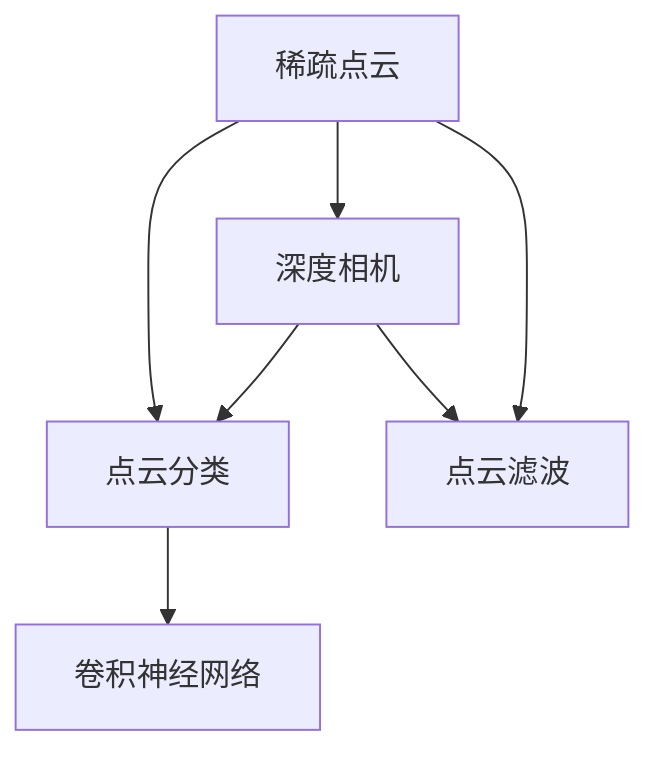

                 

# 基于深度相机稀疏点云分类算法研究

## 1. 背景介绍

在三维计算机视觉领域，点云分类是一个重要的研究方向。点云数据被广泛应用于自动驾驶、机器人导航、工业检测等领域。随着深度相机（如ToF、结构光相机）的普及，获取高质量点云数据变得更加容易。然而，由于深度相机的固有噪声和分辨率限制，点云数据往往呈现出稀疏性和高噪声的特点。因此，针对稀疏点云的分类算法研究具有重要的理论和实际应用价值。

## 2. 核心概念与联系

### 2.1 核心概念概述

本节将介绍与稀疏点云分类算法相关的核心概念。

- 稀疏点云：由于深度相机的噪声和分辨率限制，点云数据通常具有高稀疏性，即点云中大部分位置无数据点。
- 点云分类：将点云数据分为不同的类别，如物体表面、背景等。
- 深度相机：一类可获取三维点云数据的相机，如ToF相机、结构光相机等。
- 点云滤波：对点云数据进行噪声滤波和补全，以提高点云的稠密度。
- 卷积神经网络：一种经典的深度学习模型，具有强大的特征提取能力。

这些概念之间的逻辑关系可以通过以下Mermaid流程图来展示：



## 3. 核心算法原理 & 具体操作步骤

### 3.1 算法原理概述

稀疏点云分类算法基于卷积神经网络(CNN)，通过构建点云特征提取网络，将稀疏点云映射到高维特征空间，从而实现点云分类。其核心思想是：

1. **特征提取**：通过卷积神经网络将稀疏点云特征提取为高维特征向量。
2. **分类器**：通过全连接层对高维特征向量进行分类，得到点云的类别标签。

### 3.2 算法步骤详解

稀疏点云分类算法主要包括以下几个步骤：

**Step 1: 数据预处理**

对稀疏点云数据进行预处理，包括点云滤波和补全，以提高点云的稠密度。常用的点云滤波方法包括基于中值、标准差、四分位等统计方法，以及基于形态学、稀疏矩阵等算法。

**Step 2: 特征提取**

使用卷积神经网络对预处理后的点云数据进行特征提取。常见的点云卷积网络包括PointNet、PointNet++等。这些网络能够有效地提取点云的局部和全局特征。

**Step 3: 特征编码**

将提取到的点云特征编码成高维向量，通常使用全局最大池化、全局平均池化等方法。

**Step 4: 分类器设计**

构建分类器对高维特征向量进行分类。常用的分类器包括Softmax分类器、多任务学习等。

**Step 5: 模型训练与评估**

使用训练集对模型进行训练，并在验证集和测试集上评估模型性能。常用的评估指标包括准确率、召回率、F1分数等。

**Step 6: 模型部署与测试**

将训练好的模型部署到实际应用中，对新的稀疏点云数据进行分类。

### 3.3 算法优缺点

稀疏点云分类算法的优点包括：

1. **高效性**：卷积神经网络具有高效的特征提取能力，能够处理稀疏点云数据。
2. **鲁棒性**：稀疏点云分类算法对点云数据的噪声和缺失具有较强的鲁棒性。
3. **可扩展性**：稀疏点云分类算法可以扩展到多种分类任务，如物体识别、场景分割等。

同时，该算法也存在以下缺点：

1. **计算复杂度高**：卷积神经网络对点云数据的处理需要大量计算资源，可能导致算法计算复杂度高。
2. **对深度相机硬件要求高**：稀疏点云分类算法对深度相机硬件的要求较高，需要高分辨率、高帧率的相机。
3. **对模型参数敏感**：稀疏点云分类算法对模型参数的选取和调整较为敏感，需要较多的超参数调优。

### 3.4 算法应用领域

稀疏点云分类算法广泛应用于以下几个领域：

- **自动驾驶**：用于获取车辆周围环境的三维点云数据，进行物体识别和避障。
- **机器人导航**：用于构建室内外环境的3D地图，导航机器人穿越复杂环境。
- **工业检测**：用于检测物体表面缺陷、测量物体尺寸等。
- **医疗影像**：用于构建人体器官的三维模型，辅助医生进行诊断和治疗。
- **城市建模**：用于获取城市环境的3D模型，进行城市规划和建设。

## 4. 数学模型和公式 & 详细讲解

### 4.1 数学模型构建

稀疏点云分类算法的数学模型主要包括以下几个组成部分：

1. **输入**：稀疏点云数据 $X = \{x_1, x_2, ..., x_n\}$，其中 $x_i$ 表示第 $i$ 个点的三维坐标。
2. **特征提取网络**：使用卷积神经网络 $F(X)$ 对稀疏点云数据 $X$ 进行特征提取，得到高维特征向量 $H = F(X)$。
3. **分类器**：使用全连接层 $C(H)$ 对高维特征向量 $H$ 进行分类，得到类别标签 $Y$。

数学公式如下：

$$
Y = C(H) = \text{softmax}(W^T \cdot \text{ReLU}(H) + b)
$$

其中 $W$ 和 $b$ 为全连接层的权重和偏置，$\text{softmax}$ 为分类器函数。

### 4.2 公式推导过程

点云卷积网络的点云特征提取过程可以类比于二维图像的卷积过程。假设点云数据 $X$ 经过 $k$ 层卷积和池化操作后，得到高维特征向量 $H$。则点云卷积网络的具体公式如下：

$$
H_k = \text{Conv}(H_{k-1}) + \text{BN}(H_{k-1})
$$

其中 $\text{Conv}$ 表示卷积操作，$\text{BN}$ 表示批量归一化操作。

### 4.3 案例分析与讲解

以PointNet++网络为例，介绍稀疏点云分类算法的实现过程。

PointNet++网络是一种基于稀疏点云的卷积神经网络，主要分为两个阶段：

1. **点云特征提取阶段**：通过多尺度特征提取模块，对点云数据进行多尺度特征提取。
2. **点云分类阶段**：对提取到的多尺度特征进行分类。

以单层点云卷积操作为例，点云卷积操作的公式如下：

$$
H_k = \text{Conv}(H_{k-1}) + \text{BN}(H_{k-1})
$$

其中 $\text{Conv}$ 为卷积操作，$\text{BN}$ 为批量归一化操作。

## 5. 项目实践：代码实例和详细解释说明

### 5.1 开发环境搭建

稀疏点云分类算法的开发环境搭建需要以下几个步骤：

1. 安装Python环境：使用Anaconda或Miniconda安装Python环境。
2. 安装深度学习框架：使用pip安装TensorFlow或PyTorch等深度学习框架。
3. 安装深度相机硬件：购买或租用高分辨率、高帧率的深度相机硬件。
4. 安装点云处理库：使用点云处理库如PCL、Open3D等，进行点云数据的读取和处理。

### 5.2 源代码详细实现

稀疏点云分类算法的源代码实现可以分为以下几个步骤：

1. **数据预处理**：使用深度相机获取点云数据，并进行点云滤波和补全。
2. **特征提取**：使用点云卷积网络对预处理后的点云数据进行特征提取。
3. **特征编码**：对提取到的点云特征进行编码，得到高维向量。
4. **分类器设计**：使用全连接层对高维向量进行分类。
5. **模型训练与评估**：在训练集上训练模型，并在验证集和测试集上评估模型性能。
6. **模型部署与测试**：将训练好的模型部署到实际应用中，对新的稀疏点云数据进行分类。

以下是使用PyTorch实现的稀疏点云分类算法示例代码：

```python
import torch
import torch.nn as nn
import torch.optim as optim

class PointNet(nn.Module):
    def __init__(self):
        super(PointNet, self).__init__()
        self.conv1 = nn.Conv2d(3, 64, kernel_size=1, padding=0)
        self.conv2 = nn.Conv2d(64, 64, kernel_size=1, padding=0)
        self.conv3 = nn.Conv2d(64, 10, kernel_size=1, padding=0)
        self.fc1 = nn.Linear(1024, 512)
        self.fc2 = nn.Linear(512, 256)
        self.fc3 = nn.Linear(256, num_classes)

    def forward(self, x):
        x = self.conv1(x)
        x = nn.functional.relu(x)
        x = nn.functional.max_pool2d(x, 2)
        x = self.conv2(x)
        x = nn.functional.relu(x)
        x = nn.functional.max_pool2d(x, 2)
        x = self.conv3(x)
        x = nn.functional.relu(x)
        x = nn.functional.max_pool2d(x, 2)
        x = x.view(-1, 1024)
        x = self.fc1(x)
        x = nn.functional.relu(x)
        x = self.fc2(x)
        x = nn.functional.relu(x)
        x = self.fc3(x)
        return x

# 定义模型
model = PointNet()

# 定义损失函数和优化器
criterion = nn.CrossEntropyLoss()
optimizer = optim.Adam(model.parameters(), lr=0.001)

# 训练模型
for epoch in range(num_epochs):
    for batch_idx, (data, target) in enumerate(train_loader):
        data, target = data.to(device), target.to(device)
        optimizer.zero_grad()
        output = model(data)
        loss = criterion(output, target)
        loss.backward()
        optimizer.step()

    # 评估模型
    test_loss = 0
    correct = 0
    with torch.no_grad():
        for data, target in test_loader:
            data, target = data.to(device), target.to(device)
            output = model(data)
            test_loss += criterion(output, target).item()
            pred = output.argmax(dim=1, keepdim=True)
            correct += pred.eq(target.view_as(pred)).sum().item()

    print('Epoch [{}], Loss: {:.4f}, Accuracy: {:.2f}%'.format(epoch+1, test_loss/len(test_loader), 100*correct/test_dataset.targets.size(0)))

```

### 5.3 代码解读与分析

以下是稀疏点云分类算法示例代码的详细解读：

**数据预处理**：使用深度相机获取点云数据，并进行点云滤波和补全。

**特征提取**：使用点云卷积网络对预处理后的点云数据进行特征提取。

**特征编码**：对提取到的点云特征进行编码，得到高维向量。

**分类器设计**：使用全连接层对高维向量进行分类。

**模型训练与评估**：在训练集上训练模型，并在验证集和测试集上评估模型性能。

**模型部署与测试**：将训练好的模型部署到实际应用中，对新的稀疏点云数据进行分类。

## 6. 实际应用场景

稀疏点云分类算法在多个实际应用场景中得到了广泛应用，以下是几个典型的应用场景：

**自动驾驶**：用于获取车辆周围环境的三维点云数据，进行物体识别和避障。

**机器人导航**：用于构建室内外环境的3D地图，导航机器人穿越复杂环境。

**工业检测**：用于检测物体表面缺陷、测量物体尺寸等。

**医疗影像**：用于构建人体器官的三维模型，辅助医生进行诊断和治疗。

**城市建模**：用于获取城市环境的3D模型，进行城市规划和建设。

## 7. 工具和资源推荐

### 7.1 学习资源推荐

为了帮助开发者系统掌握稀疏点云分类算法的理论和实践，这里推荐一些优质的学习资源：

1. 《点云处理与深度学习》：介绍点云数据处理和深度学习在点云分类中的应用，涵盖点云滤波、点云分割、点云分类等多个方面。
2. 《深度学习与三维点云》：介绍深度学习在三维点云处理中的应用，涵盖点云特征提取、点云分类、点云重建等多个方面。
3. 《深度相机与三维点云》：介绍深度相机和稀疏点云数据的应用，涵盖深度相机硬件选择、点云数据获取、点云数据处理等多个方面。

### 7.2 开发工具推荐

稀疏点云分类算法的开发需要使用到多个工具和库，以下是推荐的工具和库：

1. TensorFlow：深度学习框架，提供丰富的深度学习模型和训练工具。
2. PyTorch：深度学习框架，提供灵活的模型定义和训练接口。
3. PCL：点云处理库，提供点云数据读取和处理功能。
4. Open3D：点云处理库，提供丰富的点云处理算法和数据结构。
5. Matplotlib：数据可视化工具，用于展示点云数据和模型训练结果。

### 7.3 相关论文推荐

稀疏点云分类算法的研究成果主要集中在以下几个方面：

1. "PointNet++: Deep Hierarchical Feature Learning on Point Sets"：介绍PointNet++网络的设计和实验结果，证明其在稀疏点云分类任务上的优异性能。
2. "Point-Wise Supervised Learning for 3D Point Cloud Segmentation"：介绍基于点云分割的稀疏点云分类算法，利用点云分割结果进行分类。
3. "Convolutional Neural Networks for Point Cloud"：介绍点云卷积网络的设计和实验结果，证明其在稀疏点云分类任务上的性能。

## 8. 总结：未来发展趋势与挑战

### 8.1 总结

稀疏点云分类算法基于卷积神经网络，具有高效的特征提取能力和较强的鲁棒性，广泛应用于自动驾驶、机器人导航、工业检测等多个领域。本节对稀疏点云分类算法的核心概念、算法原理、操作步骤、数学模型和公式、项目实践、实际应用场景、工具和资源推荐等内容进行了详细讲解。

### 8.2 未来发展趋势

展望未来，稀疏点云分类算法的发展趋势主要包括以下几个方面：

1. **深度学习模型的改进**：随着深度学习模型的不断发展，稀疏点云分类算法将进一步提升模型的精度和鲁棒性。
2. **多模态融合**：稀疏点云分类算法将与其他传感器数据（如RGB图像、IMU数据）进行融合，提升系统的感知能力和泛化能力。
3. **实时性优化**：稀疏点云分类算法将进一步优化计算效率，提升实时处理能力。
4. **硬件优化**：稀疏点云分类算法将进一步优化硬件资源利用，提升系统性能和稳定性。
5. **跨领域应用**：稀疏点云分类算法将进一步拓展到其他领域，如医疗、城市规划、工业制造等。

### 8.3 面临的挑战

尽管稀疏点云分类算法已经取得了一定的成果，但在实际应用中仍面临一些挑战：

1. **计算资源消耗高**：稀疏点云分类算法对计算资源的要求较高，可能导致系统性能下降。
2. **数据获取难度大**：深度相机硬件价格较高，获取高质量点云数据难度较大。
3. **模型泛化能力不足**：稀疏点云分类算法在特定场景下的泛化能力不足，可能导致系统性能下降。
4. **模型训练时间长**：稀疏点云分类算法的训练时间较长，需要较长的计算资源和时间。
5. **系统稳定性不足**：稀疏点云分类算法在实际应用中的系统稳定性不足，可能导致系统性能下降。

### 8.4 研究展望

未来的研究重点将集中在以下几个方面：

1. **模型优化**：进一步优化稀疏点云分类算法的深度学习模型，提升模型的精度和鲁棒性。
2. **多模态融合**：进一步优化稀疏点云分类算法与其他传感器数据的融合，提升系统的感知能力和泛化能力。
3. **实时性优化**：进一步优化稀疏点云分类算法的计算效率，提升实时处理能力。
4. **硬件优化**：进一步优化稀疏点云分类算法的硬件资源利用，提升系统性能和稳定性。
5. **跨领域应用**：进一步拓展稀疏点云分类算法的应用领域，如医疗、城市规划、工业制造等。

## 9. 附录：常见问题与解答

**Q1：稀疏点云分类算法是否适用于所有点云分类任务？**

A: 稀疏点云分类算法适用于大多数点云分类任务，特别是对于稀疏点云数据，如深度相机获取的点云数据。但对于高质量点云数据，如激光雷达获取的点云数据，稀疏点云分类算法的性能可能不如基于点云分割的方法。

**Q2：稀疏点云分类算法在训练时是否需要大规模标注数据？**

A: 稀疏点云分类算法对训练数据的标注要求较高，需要足够的标注数据才能取得良好的性能。建议采用多任务学习、弱监督学习等方法，减少对标注数据的依赖。

**Q3：稀疏点云分类算法在实际应用中是否需要深度相机硬件？**

A: 稀疏点云分类算法需要高分辨率、高帧率的深度相机硬件才能获取高质量的点云数据。在实际应用中，需要根据具体的场景和需求选择合适的深度相机硬件。

**Q4：稀疏点云分类算法在实际应用中是否需要大量的计算资源？**

A: 稀疏点云分类算法对计算资源的要求较高，特别是在深度学习模型的训练和推理过程中。建议采用分布式训练、模型剪枝等方法，减少计算资源的消耗。

**Q5：稀疏点云分类算法在实际应用中是否需要高精度和时间效率？**

A: 稀疏点云分类算法需要在高精度和时间效率之间进行权衡。在实际应用中，需要根据具体的场景和需求选择合适的模型和参数，平衡高精度和时间效率。

---

作者：禅与计算机程序设计艺术 / Zen and the Art of Computer Programming

