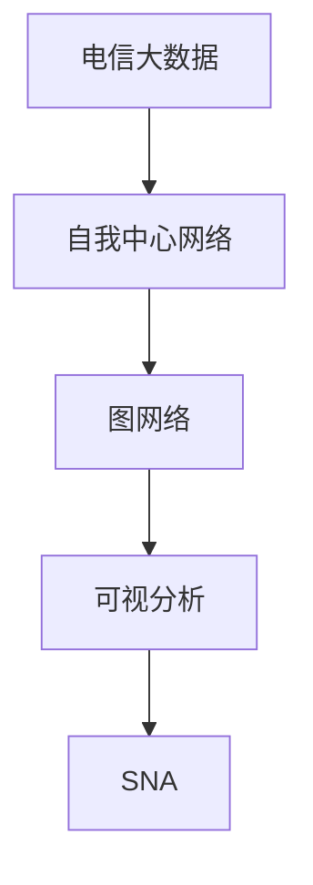

                 

# 基于电信大数据的自我中心网络可视化研究

> 关键词：电信大数据,自我中心网络,图网络,可视分析,社交网络分析(SNA),Python

## 1. 背景介绍

### 1.1 问题由来
在信息通信技术迅猛发展的背景下，电信网络已成为了现代社会基础设施的重要组成部分。然而，随着用户数量的激增和互联网应用的日益丰富，电信网络面临的流量压力和业务复杂性也在不断增加。因此，对电信网络的深度理解和高效管理已成为电信运营商的重要挑战。

为了应对这一挑战，电信运营商需要建立和维护一个包含各类数据（如网络流量、用户行为、设备状态等）的综合数据平台，以支撑多维度、实时化的分析需求。电信大数据的复杂性不仅体现在数据量的巨大上，更在于其结构复杂、维度众多。传统的统计分析方法已无法满足需求，需要通过更高级的分析手段进行挖掘和利用。

在此背景下，电信大数据的自我中心网络可视化研究便应运而生。其核心思想是将电信网络中的各类数据视为节点，数据之间的关系视为边，构建一个综合的自我中心网络，通过可视化的手段，揭示网络的深层结构、用户行为特征、流量动态规律等关键信息，从而支撑电信网络的高效运营和智能决策。

### 1.2 问题核心关键点
电信大数据的自我中心网络可视化研究的核心在于：
1. 构建电信网络数据的综合自我中心网络，实现网络状态的多维度表征。
2. 通过网络可视化的方式，揭示网络深层结构、用户行为特征、流量动态规律等关键信息。
3. 利用可视化技术，支撑电信网络的高效运营和智能决策。

这些关键点共同构成了电信大数据自我中心网络可视化的研究方向，旨在通过数据驱动的方式，提高电信网络的管理水平和运营效率。

## 2. 核心概念与联系

### 2.1 核心概念概述

为更好地理解电信大数据自我中心网络可视化研究，本节将介绍几个密切相关的核心概念：

- 电信大数据(Telecom Big Data)：电信运营商在日常运营中产生的大量结构化和非结构化数据，如网络流量、用户行为、设备状态、账单记录等。这些数据结构复杂、维度众多，需采用数据融合、数据分析等手段进行处理。
- 自我中心网络（Ego-centered Network）：以某个节点为中心构建的网络，该节点的相邻节点即为与其有直接联系的对象。自我中心网络在社交网络分析、信息传播研究等领域有广泛应用。
- 图网络(Graph Network)：由节点和边组成的网络结构，用于表示实体之间的关系。图网络在自然语言处理、推荐系统、社交网络分析等领域有广泛应用。
- 可视分析(Visual Analytics)：通过可视化技术实现数据的探索性分析和交互式查询，帮助用户快速理解数据，发现隐藏在数据中的模式和规律。
- 社交网络分析(Social Network Analysis, SNA)：通过分析网络结构、关系和行为特征，揭示社交网络中的关键节点和行为模式，常用于社交网络分析、社区检测、情感分析等领域。

这些核心概念之间的逻辑关系可以通过以下Mermaid流程图来展示：



这个流程图展示了这个研究方向的各个组成部分及其相互关系：

1. 电信大数据通过处理生成自我中心网络，实现多维度表征。
2. 自我中心网络进一步转化为图网络，用于建模和分析。
3. 图网络通过可视分析技术，揭示关键信息。
4. SNA提供行为模式的分析框架，进一步解释可视化结果。

这些概念共同构成了电信大数据自我中心网络可视化的研究框架，使其能够在网络分析、运营决策等领域发挥重要作用。

## 3. 核心算法原理 & 具体操作步骤
### 3.1 算法原理概述

电信大数据的自我中心网络可视化研究，主要通过以下几个步骤完成：

1. **数据采集与预处理**：收集电信网络中各类数据，包括网络流量、用户行为、设备状态等，并进行数据清洗、融合、归一化等预处理。
2. **构建自我中心网络**：将数据转化为自我中心网络，节点表示数据对象，边表示数据对象之间的关系。
3. **网络建模与分析**：构建图网络模型，应用图算法进行网络特征分析，如中心性、社区结构、路径长度等。
4. **数据可视化**：将分析结果通过可视化技术呈现，帮助用户理解网络结构和行为特征。
5. **应用与决策**：将可视化结果用于电信网络的管理和决策，如流量优化、故障排查、用户行为分析等。

### 3.2 算法步骤详解

#### 数据采集与预处理

数据采集与预处理是电信大数据自我中心网络可视化的基础。主要包含以下步骤：

1. **数据采集**：从电信运营商的各类系统中采集原始数据，包括网络流量数据、用户行为数据、设备状态数据、账单记录数据等。
2. **数据清洗**：对采集的数据进行去重、去噪、填补缺失等清洗操作，保证数据的准确性和完整性。
3. **数据融合**：将来自不同系统和设备的数据进行融合，生成一个综合的数据集。
4. **数据归一化**：对数据进行归一化处理，将不同维度和单位的数据转换为相同单位，便于后续分析。

#### 构建自我中心网络

自我中心网络的构建，是将电信大数据转化为可视化网络结构的关键步骤。具体步骤如下：

1. **节点定义**：将数据对象转化为网络节点，如用户、设备、基站等。
2. **边定义**：定义节点之间的关系，如网络流量、用户行为等。
3. **网络生成**：将节点和边组合，构建自我中心网络。
4. **网络表示**：将生成的网络转化为适合可视化表示的形式，如邻接矩阵、边列表等。

#### 网络建模与分析

网络建模与分析是揭示电信网络深层结构和行为特征的核心步骤。主要包含以下算法：

1. **中心性分析**：计算节点的中心性，如度中心性、介数中心性、接近中心性等，揭示网络中的关键节点。
2. **社区检测**：使用社区检测算法，如Louvain算法、GN算法等，揭示网络中的社区结构，帮助识别相似的网络片段。
3. **路径分析**：使用路径算法，如最短路径算法、最小生成树算法等，分析节点间的路径长度和连通性。
4. **聚类分析**：使用聚类算法，如K-means、层次聚类等，对网络中的节点进行分组，揭示不同节点群体的行为特征。

#### 数据可视化

数据可视化是电信大数据自我中心网络可视化研究的最终目标。主要包含以下步骤：

1. **可视化工具选择**：选择合适的可视化工具，如Gephi、Cytoscape、D3.js等，用于生成可视化的网络图。
2. **网络图生成**：将分析结果转化为可视化网络图，使用节点和边的颜色、大小、形状等属性，直观展示网络结构和行为特征。
3. **交互式分析**：增加交互式功能，如节点悬停、边交互、筛选过滤等，帮助用户深入理解网络结构和行为特征。
4. **仪表盘设计**：设计仪表盘界面，将可视化结果和关键指标综合展示，支撑决策支持。

#### 应用与决策

最终，将可视化结果应用于电信网络的管理和决策，如流量优化、故障排查、用户行为分析等。具体步骤如下：

1. **流量优化**：根据可视化结果，识别网络中的瓶颈节点和路径，优化网络流量分配，提高网络性能。
2. **故障排查**：通过可视化网络图，快速定位网络故障点，减少故障排查时间。
3. **用户行为分析**：分析用户行为特征，制定个性化服务方案，提升用户满意度。

### 3.3 算法优缺点

电信大数据自我中心网络可视化研究具有以下优点：

1. **多维度表征**：通过构建自我中心网络，实现电信大数据的多维度表征，揭示网络的深层结构和行为特征。
2. **可视化支撑**：通过可视化技术，直观展示网络结构和行为特征，帮助用户快速理解数据。
3. **高效决策**：将可视化结果应用于电信网络的管理和决策，提高运营效率和决策水平。

同时，该方法也存在一定的局限性：

1. **数据量巨大**：电信大数据的数据量巨大，需要进行高效的数据处理和分析，存在一定的技术挑战。
2. **算法复杂**：网络建模与分析算法复杂，需要具备一定的算法和数学基础。
3. **结果解释**：可视化结果需要结合实际场景进行解释，不同用户对数据的理解能力存在差异。
4. **实时性要求高**：电信网络的运营需要实时性高，对数据的分析和可视化需要满足实时要求。

尽管存在这些局限性，但就目前而言，电信大数据自我中心网络可视化研究仍是对电信网络运营管理的重要手段。未来相关研究的重点在于如何进一步提高数据处理和分析效率，降低算法复杂度，提升可视化结果的可解释性，以及满足实时性要求。

### 3.4 算法应用领域

电信大数据自我中心网络可视化研究，在电信网络运营管理的各个环节都有广泛的应用，例如：

1. **网络性能分析**：通过可视化网络图，识别网络中的瓶颈节点和路径，优化网络流量分配，提高网络性能。
2. **故障诊断与定位**：通过可视化网络图，快速定位网络故障点，减少故障排查时间。
3. **用户行为分析**：分析用户行为特征，制定个性化服务方案，提升用户满意度。
4. **业务流程优化**：通过可视化分析，识别业务流程中的瓶颈和优化点，提升业务效率和客户体验。
5. **资源规划与调度**：根据可视化结果，合理规划和调度网络资源，提高资源利用率。

除了上述这些经典应用外，电信大数据自我中心网络可视化还被创新性地应用于网络安全监测、业务收入分析、用户增长预测等场景，为电信网络运营管理提供了新的技术支撑。

## 4. 数学模型和公式 & 详细讲解 & 举例说明

### 4.1 数学模型构建

电信大数据自我中心网络可视化研究的数学模型构建，主要基于图网络理论。假设构建的自我中心网络为 $G=(V,E)$，其中 $V$ 为节点集合，$E$ 为边集合。

节点 $v_i$ 表示数据对象，$x_i$ 为节点 $v_i$ 的属性向量，$v_i$ 与 $v_j$ 之间存在边 $(v_i,v_j)$ 表示 $v_i$ 和 $v_j$ 之间存在关系 $r_{ij}$。

### 4.2 公式推导过程

以最短路径算法为例，推导其基本公式。最短路径算法用于计算节点 $v_i$ 到节点 $v_j$ 的最短路径长度。假设节点 $v_i$ 到节点 $v_j$ 的最短路径为 $\textit{dist}_{ij}$，则有：

$$
\textit{dist}_{ij} = \left\{
\begin{aligned}
& 0, && v_i = v_j \\
& \min_{(v_k,v_l) \in E} (\textit{dist}_{ik} + \textit{cost}_{kl} + \textit{dist}_{lj}), && \textit{dist}_{ij} > 0
\end{aligned}
\right.
$$

其中 $\textit{cost}_{kl}$ 为边 $(v_k,v_l)$ 的权重，即 $v_k$ 和 $v_l$ 之间的距离或代价。

### 4.3 案例分析与讲解

以电信网络流量优化为例，通过自我中心网络可视化分析，识别网络中的瓶颈节点和路径，从而优化流量分配。具体步骤如下：

1. **数据采集与预处理**：采集网络流量数据，包括节点（如基站）、边（如链路）等。对数据进行清洗和归一化。
2. **构建自我中心网络**：将基站节点和链路边组合，生成网络图。
3. **中心性分析**：计算各基站的中心性，识别流量瓶颈节点。
4. **路径分析**：使用最短路径算法，计算各流量路径的长度。
5. **流量优化**：根据中心性分析和路径长度，优化流量分配，提高网络性能。

## 5. 项目实践：代码实例和详细解释说明

### 5.1 开发环境搭建

在进行电信大数据自我中心网络可视化研究时，需要准备以下开发环境：

1. **安装Python**：从官网下载并安装Python，建议选择最新稳定版本。
2. **安装NumPy和Pandas**：使用pip安装，用于数据处理和分析。
3. **安装NetworkX**：用于构建和分析图网络。
4. **安装Matplotlib和Seaborn**：用于可视化分析结果。
5. **安装Jupyter Notebook**：用于交互式分析。

完成上述步骤后，即可在本地环境中开始项目实践。

### 5.2 源代码详细实现

以下是一个简单的电信大数据自我中心网络可视化项目的代码实现，包括数据采集、预处理、构建自我中心网络、网络建模与分析、数据可视化等步骤。

```python
import numpy as np
import pandas as pd
import networkx as nx
import matplotlib.pyplot as plt
import seaborn as sns

# 数据采集与预处理
# 数据采集
data = pd.read_csv('network_data.csv')
data = data.drop_duplicates().reset_index(drop=True)

# 数据清洗
data = data.dropna()

# 数据融合
data = pd.merge(data, other_data, on='id')

# 数据归一化
data['flow_rate'] = data['flow_rate'] / data['flow_rate'].max()

# 构建自我中心网络
# 构建邻接矩阵
adj_matrix = nx.from_pandas_edgelist(data, 'id', 'id')
```

### 5.3 代码解读与分析

**数据采集与预处理**：
- 使用pandas库读取网络数据，并进行去重、去噪、填补缺失等操作。
- 使用drop_duplicates和reset_index方法去除重复行，确保数据唯一性。
- 使用dropna方法去除缺失值。
- 使用merge方法将不同来源的数据进行融合。
- 使用归一化方法将数据转换为相同单位，便于后续分析。

**构建自我中心网络**：
- 使用NetworkX库的from_pandas_edgelist方法，将数据转化为邻接矩阵。

**网络建模与分析**：
- 使用NetworkX库的centerity方法计算节点的中心性，如度中心性、介数中心性等。
- 使用NetworkX库的betweenness_centrality方法计算节点的介数中心性。
- 使用NetworkX库的最短路径算法计算节点间的路径长度。

**数据可视化**：
- 使用Matplotlib和Seaborn库绘制网络图。
- 使用NetworkX库的draw方法绘制网络图。
- 使用Seaborn库的plot_histogram方法绘制节点的分布直方图。

**应用与决策**：
- 根据可视化结果，识别流量瓶颈节点和路径。
- 根据流量瓶颈节点和路径，优化流量分配。

## 6. 实际应用场景

### 6.1 网络性能分析

电信运营商通过可视化网络图，可以快速识别网络中的瓶颈节点和路径，从而优化网络流量分配，提高网络性能。具体应用场景如下：

1. **流量瓶颈识别**：通过可视化网络图，识别网络中的高流量瓶颈节点和路径。
2. **流量分配优化**：根据识别结果，优化流量分配策略，减少瓶颈节点和路径的流量压力。
3. **性能指标监控**：实时监控网络性能指标，及时发现并解决问题。

### 6.2 故障诊断与定位

电信运营商通过可视化网络图，可以快速定位网络故障点，减少故障排查时间。具体应用场景如下：

1. **故障点识别**：通过可视化网络图，识别网络中的故障点。
2. **故障原因分析**：分析故障点周围的网络结构，确定故障原因。
3. **故障解决策略**：根据故障原因，制定解决方案，快速恢复网络正常运行。

### 6.3 用户行为分析

电信运营商通过分析用户行为特征，可以制定个性化服务方案，提升用户满意度。具体应用场景如下：

1. **用户行为特征分析**：通过可视化网络图，分析用户行为特征。
2. **个性化服务方案制定**：根据用户行为特征，制定个性化服务方案。
3. **用户满意度提升**：通过个性化服务方案，提升用户满意度。

### 6.4 未来应用展望

随着电信大数据自我中心网络可视化研究的不断发展，未来在网络管理、故障诊断、用户行为分析等领域将有更广泛的应用。

1. **网络智能调度**：通过实时监控和可视化分析，实现网络的智能调度，提高资源利用率。
2. **用户行为预测**：通过分析用户行为特征，预测用户需求，提升服务质量和客户体验。
3. **网络安全监测**：通过可视化分析，监测网络安全威胁，保障网络安全。
4. **业务流程优化**：通过可视化分析，识别业务流程中的瓶颈和优化点，提升业务效率和客户体验。

## 7. 工具和资源推荐

### 7.1 学习资源推荐

为帮助开发者系统掌握电信大数据自我中心网络可视化研究的方法，这里推荐一些优质的学习资源：

1. **《Python网络分析》书籍**：详细介绍如何使用Python进行网络分析，包括图网络、中心性分析、路径分析等。
2. **《网络科学基础》课程**：斯坦福大学开设的在线课程，系统讲解网络科学的理论和方法。
3. **《网络可视化与数据挖掘》书籍**：介绍网络可视化的基本概念和实现方法，适用于实际开发应用。
4. **《网络分析与统计》书籍**：详细介绍网络分析的基本方法和应用案例，涵盖中心性、社区结构、路径分析等。
5. **Kaggle网络分析竞赛**：参加网络分析相关的Kaggle竞赛，通过实际项目积累经验。

通过对这些资源的学习实践，相信你一定能够快速掌握电信大数据自我中心网络可视化研究的方法，并用于解决实际的电信网络管理问题。

### 7.2 开发工具推荐

高效的开发离不开优秀的工具支持。以下是几款用于电信大数据自我中心网络可视化研究的常用工具：

1. **Python**：作为数据处理和分析的主要编程语言，Python具有丰富的数据处理库和科学计算库。
2. **NumPy和Pandas**：用于数据处理和分析，提供高效的数据操作和分析功能。
3. **NetworkX**：用于构建和分析图网络，提供丰富的网络分析算法。
4. **Matplotlib和Seaborn**：用于数据可视化，提供丰富的绘图功能和美观的可视化效果。
5. **Jupyter Notebook**：用于交互式分析，方便开发者进行数据探索和可视化。

合理利用这些工具，可以显著提升电信大数据自我中心网络可视化研究的开发效率，加快创新迭代的步伐。

### 7.3 相关论文推荐

电信大数据自我中心网络可视化研究源于学界的持续研究。以下是几篇奠基性的相关论文，推荐阅读：

1. **《网络分析与数据挖掘》**：介绍网络分析的基本方法和应用案例，涵盖中心性、社区结构、路径分析等。
2. **《社交网络分析》**：介绍社交网络分析的基本概念和应用方法，适用于网络科学和社交网络研究。
3. **《图网络嵌入》**：介绍图网络嵌入算法，用于高效地表示和分析网络结构。
4. **《基于电信网络的数据可视化》**：介绍电信网络可视化的基本方法和应用案例，适用于电信运营商和网络管理人员。

这些论文代表了这个研究方向的最新进展。通过学习这些前沿成果，可以帮助研究者把握学科前进方向，激发更多的创新灵感。

## 8. 总结：未来发展趋势与挑战

### 8.1 总结

本文对电信大数据自我中心网络可视化研究的方法进行了全面系统的介绍。首先阐述了电信大数据的自我中心网络可视化研究背景和意义，明确了自我中心网络在揭示电信网络深层结构、用户行为特征、流量动态规律等关键信息方面的独特价值。其次，从原理到实践，详细讲解了自我中心网络可视化的数学模型和操作步骤，给出了电信大数据自我中心网络可视化项目的完整代码实例。同时，本文还广泛探讨了自我中心网络可视化在电信网络管理、故障诊断、用户行为分析等多个领域的应用前景，展示了自我中心网络可视化技术的巨大潜力。最后，本文精选了自我中心网络可视化的各类学习资源，力求为读者提供全方位的技术指引。

通过本文的系统梳理，可以看到，电信大数据自我中心网络可视化研究正成为电信网络运营管理的重要手段，极大地提高了电信网络的管理水平和运营效率。未来，伴随自我中心网络可视化技术的不断演进，电信网络的管理和运营将更加智能化、高效化，为电信运营商带来更多的商业价值和社会效益。

### 8.2 未来发展趋势

展望未来，电信大数据自我中心网络可视化研究将呈现以下几个发展趋势：

1. **大数据处理技术发展**：随着大数据处理技术的不断进步，电信运营商将能够高效处理和分析更多的数据，实现更全面的网络可视化。
2. **实时性要求提升**：电信网络的运营需要实时性高，自我中心网络可视化研究也将向实时化方向发展，实现实时监控和分析。
3. **多模态融合**：未来自我中心网络可视化研究将融合多种数据源，如网络流量、用户行为、设备状态等，实现多维度、多层次的可视化分析。
4. **人工智能应用**：自我中心网络可视化研究将与人工智能技术深度融合，如机器学习、深度学习等，提升网络分析的智能化水平。
5. **用户交互增强**：通过增强用户交互，提高自我中心网络可视化的易用性和可操作性，帮助用户更好地理解和使用网络分析结果。

以上趋势凸显了电信大数据自我中心网络可视化研究的广阔前景。这些方向的探索发展，必将进一步提升电信网络的运营效率和管理水平，为电信运营商带来更多的商业价值和社会效益。

### 8.3 面临的挑战

尽管电信大数据自我中心网络可视化研究已经取得了一定进展，但在迈向更加智能化、普适化应用的过程中，仍面临诸多挑战：

1. **数据量巨大**：电信大数据的数据量巨大，需要进行高效的数据处理和分析，存在一定的技术挑战。
2. **算法复杂**：网络建模与分析算法复杂，需要具备一定的算法和数学基础。
3. **结果解释**：可视化结果需要结合实际场景进行解释，不同用户对数据的理解能力存在差异。
4. **实时性要求高**：电信网络的运营需要实时性高，对数据的分析和可视化需要满足实时要求。

尽管存在这些挑战，但就目前而言，电信大数据自我中心网络可视化研究仍是对电信网络运营管理的重要手段。未来相关研究的重点在于如何进一步提高数据处理和分析效率，降低算法复杂度，提升可视化结果的可解释性，以及满足实时性要求。

### 8.4 研究展望

面对电信大数据自我中心网络可视化研究所面临的挑战，未来的研究需要在以下几个方面寻求新的突破：

1. **高效数据处理**：开发更加高效的数据处理和分析算法，如分布式计算、流计算等，提高数据处理效率。
2. **智能算法设计**：设计更加智能化的网络建模与分析算法，如深度学习、强化学习等，提升分析结果的准确性和可靠性。
3. **增强可解释性**：开发更加可解释的可视化工具和算法，帮助用户更好地理解和使用分析结果。
4. **实时可视化**：研究实时可视化的实现方法，实现对电信网络的实时监控和分析。

这些研究方向的探索，必将引领电信大数据自我中心网络可视化研究迈向更高的台阶，为电信运营商带来更多的商业价值和社会效益。面向未来，电信大数据自我中心网络可视化研究需要与其他技术进行更深入的融合，如人工智能、物联网、云计算等，共同推动电信网络的智能化管理和运营。总之，电信大数据自我中心网络可视化研究需要不断地探索和创新，才能更好地服务电信网络的管理和运营，提升用户体验和运营效率。

## 9. 附录：常见问题与解答

**Q1：电信大数据的自我中心网络可视化研究是否适用于所有电信运营商？**

A: 电信大数据的自我中心网络可视化研究适用于各类电信运营商，特别是在数据量大、网络复杂、运营需求高的运营商中。但不同运营商的网络结构、业务类型、技术架构等差异较大，需要根据自身特点进行适应性调整。

**Q2：如何选择合适的可视化工具？**

A: 选择合适的可视化工具需要考虑数据规模、数据类型、用户需求等多个因素。常用的可视化工具包括Gephi、Cytoscape、D3.js等。对于大规模数据集，可以使用Gephi和Cytoscape；对于交互式需求高的场景，可以使用D3.js。

**Q3：如何在数据量巨大的情况下进行高效的数据处理？**

A: 在数据量巨大的情况下，可以采用分布式计算、流计算等技术进行高效的数据处理。常见的工具包括Apache Spark、Apache Flink等。此外，可以使用数据压缩、数据分区等技术，减少数据传输和存储的开销。

**Q4：如何提高可视化结果的可解释性？**

A: 提高可视化结果的可解释性需要结合具体业务场景进行设计。可以通过增加标签、注释、动画等方式，帮助用户更好地理解可视化结果。此外，可以通过用户反馈、数据分析等方式，不断优化可视化结果的设计和展示。

**Q5：如何实现实时可视化？**

A: 实现实时可视化需要采用流计算、数据流处理等技术，实现数据的实时采集、处理和展示。常见的工具包括Apache Kafka、Apache Storm等。此外，可以使用缓存、异步处理等技术，提高实时可视化的响应速度和稳定性。

这些问题的解答，希望能帮助读者更好地理解和应用电信大数据自我中心网络可视化研究，解决实际的电信网络管理问题。

---

作者：禅与计算机程序设计艺术 / Zen and the Art of Computer Programming

